# 1. LLM

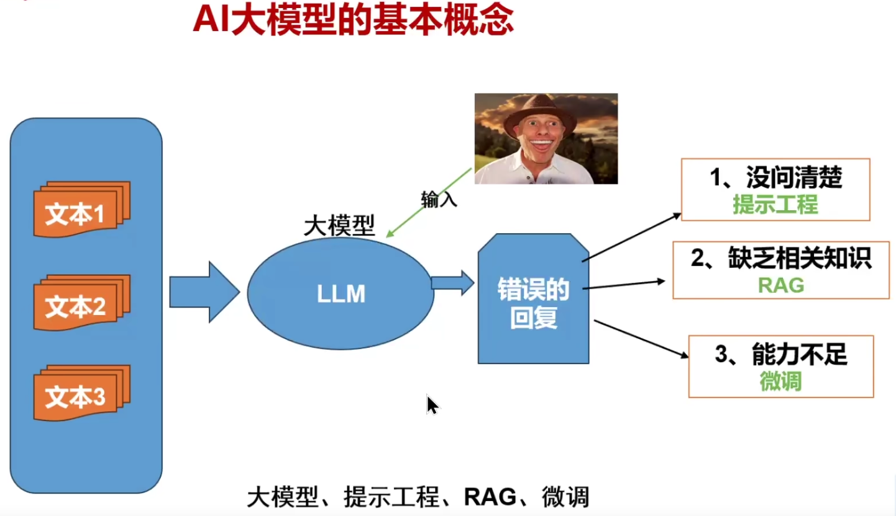

- LLM：大语言模型
- Token：是指已经清洗后的词语
- 提示工程：构建提示词
- RAG：增强文本检索技术

# 2. RAG

自己内部的文本资料数据，进行 **Split** 分词，然后将分词后的词语通过 **Embeddings** 对词语进行向量化；用户输入数据后，通过向量数据库的数据段落根据相适度进行匹配，将获取到到数据组成一个 **Prompt** 提示词传递给 LLM


- 向量数据库：存储将词语进行向量化后的数据库
- Embeddings：RAG核心技术，将词语进行向量化的模型 [什么是Embeddings模型？](https://blog.csdn.net/2301_81940605/article/details/143814539)

# 3. 大模型微调

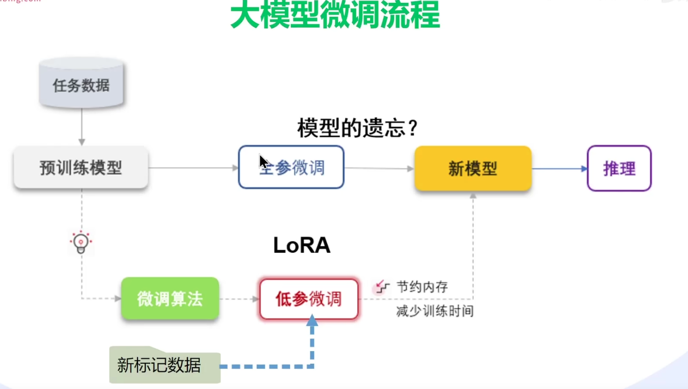

## 3.1 大模型的微调方法

- Adapter Tuning：在训练时，**固定住原来预训练模型的参数不变，只对新增的 Adapter 结构进行微调**
- Prefix Tuning：与Full-finetuning 更新所有参数的方式不同，该方法是**在输入 token 之前构造一段任务相关的 virtual tokens 作为 Prefix，然后训练的时候只更新 Prefix 部分的参数**，而 Transformer 中的其他部分参数固定
- Prompt Tuning：该方法可以看作是 Prefix Tuning 的简化版本，**只在输入层加入 prompt tokens，并不需要加入 MLP 进行调整来解决难训练的问题，主要在 T5 预训练模型上做实验。**
- P-Tuning：P-Tuning 提出将 Prompt 转换为可以学习的 Embedding 层
- P-Tuning v2：P-Tuning v2 的目标就是要让 Prompt Tuning 能够在不同参数规模的预训练模型、针对不同下游任务的结果上都达到匹敌 Fine-tuning 的结果。
- LoRA：大语言模型的低阶适应，是一种PEFT（Parameter-Efficient Tuning，简称PEFT），这是微软的研究人员为了解决大语言模型微调而开发的一项技术。LoRA的基本原理是冻结预训练好的模型权重参数，在冻结原模型参数的情况下，通过往模型中加入额外的网络层，并只训练这些新增的网络层参数。由于这些新增参数数量较少，这样不仅 finetune 的成本显著下降，还能获得和全模型微调类似的效果。
- QLoRA：QLoRA 是一种在微调过程中进一步减少内存占用的技术。在反向传播过程中，QLoRA 将预训练的权重量化为 4-bit，并使用分页优化器来处理内存峰值。使用LoRA时可以节省33%的GPU内存。然而，由于QLoRA中预训练模型权重的额外量化和去量化，训练时间增加了39%。
- LoRA+MoE：由于大模型全量微调时的显存占用过大，LoRA、Adapter、IA 3 这些**参数高效微调**方法便成为了资源有限的机构和研究者微调大模型的标配。PEFT方法的总体思路是冻结住大模型的主干参数，引入一小部分可训练的参数作为适配模块进行训练，以节省模型微调时的显存和参数存储开销。

## 3.2 LLama-Factory

### 3.2.1 安装

[LLaMa-Factory文档说明](https://llamafactory.readthedocs.io/zh-cn/latest/getting_started/installation.html)

> 如果官方的git拉取失败，可以使用：https://gitee.com/hiyouga/LLaMA-Factory 镜像仓库进行拉取

无参数启动

> llamafactory-cli webui

指定显卡启动（多卡）

> CUDA_VISIBLE_DEVICES=1,2 llamafactory-cli webui

使用魔搭下载模型

> export USE_MODELSCOPE_HUB=1 && llamafactory-cli webui

### 3.2.2 参数说明

https://blog.csdn.net/m0_69655483/article/details/138229566

- AdamW学习率：1e-5，如果不稳定可以调整到3e-5。较高的学习率影响大模型的泛化能力和灾难性遗忘
  - 预训练（Pretraining）：1e-4 ～ 5e-4，从头训练时分布变化大
  - 全参微调（Full Fine-tunning）：1e-5 ～ 5e-5：微调时需小幅调整参数，避免破坏预训练知识
  - LoRA/QLoRA：2e-5 ～ 3e-4，仅调整少量参数，可以适当提高学习率加速收敛

- 训练轮数：测试的话1-3就行，数据越大花的时间也越久（如果数据集少，训练轮数过多会出现过拟合现象，数据在1000-5000训练10轮比较合适）

- 微调方法（lora）：使用lora方法进行

- loss（损失）：损失值是一个衡量模型预测与实际标签之间差异的指标，损失值越小，表示模型的预测结果越接近真实值

- 批处理大小：对训练速度、模型性能、资源消耗、梯度更新频率、学习率调整、泛化能力和训练稳定性等方面有显著影响；显存比较紧张的设置小一点例如：2

- 梯度累计（grad）：在训练大规模深度学习模型时，特别是当模型和数据集都非常大时，显存限制可能使得一次性处理大批量数据变得困难。较小的批处理大小虽然可以缓解显存压力，但可能会导致梯度估计的方差较大，从而影响模型的收敛速度和性能；显存比较紧张的设置小一点例如：4

- 温度系数（temperature）：温度系数越小模型回答的越保守，温度系数越大模型回答的越有创造力
- LoRA秩：影响模型的表达能力、训练稳定性
  - 2-16：参数少，显存占用低，训练快；表达能力有限，可能欠拟合；适用于简单任务、显存紧张、快速实验
  - 16-64：平衡表达力与效率；需调参优化；通用任务（文本生成、分类等）
  - 大64+：捕捉复杂模式，性能潜力高；显存要求高，易过拟合；复杂任务（数学推理、长文本生成）
- 预热步数（warmup_steps）：目的是在训练初期逐渐增加学习率，而不是一开始就使用较高的学习率。这种做法有助于稳定训练过程，特别是在训练初期。计算方式：总步数 = 训练轮数 x （数据集的条数 / 批次数）的%5-%10 比较合适
- deepspeed：分布式训练的技术，直接使用默认即可，可以指定模型分片在多个显卡上面

### 3.2.3 微调

参考图：

图一的模型出现了过拟合，学习率设置的比较高基本在500步就降低到0.5以下了，模型问什么就按照训练的数据回答，失去了模型的创意能力

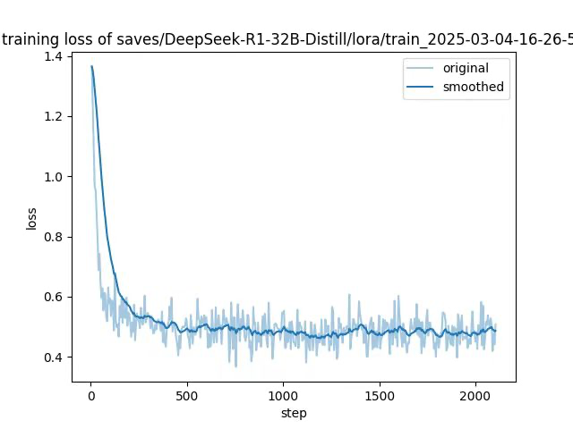

图二在500-1000降到0.8左右，模型的收敛比较好

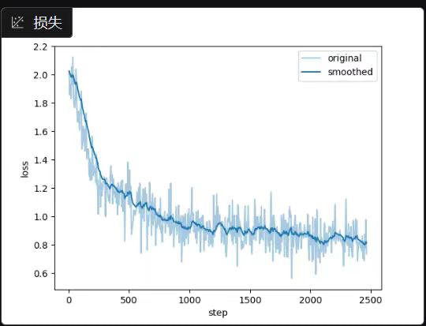

以 **DeepSeek-R1-Distill-Qwen-1.5B** 模型使用魔搭 **Robin021/DISC-Law-SFT、distill_r1_110k** 提取数据进行微调

```python
import json
import os
import random


# 加载专用垂直领域的数据集
def load_data(number):
    messages = []
    with open('/Users/Downloads/DISC-Law-SFT-Triplet-released.jsonl', 'r', encoding='utf-8') as f:
        count = 0  # 添加计数器
        for line in f:
            if count >= number:  # 如果达到5000条，退出循环
                break
            data = json.loads(line)
            user_message = {
                "role": "user",
                "content": data['input']
            }
            assistant_message = {
                "role": "assistant",
                "content": data['output']
            }
            message = {
                "messages": [user_message, assistant_message]
            }
            messages.append(message)
            count += 1  # 增加计数器
    return messages


# 加载指定数量的通用数据
def load_normal_data(number):
    messages = []
    with open('/Users/Downloads/distill_r1_110k.jsonl', 'r', encoding='utf-8') as f:
        count = 0  # 添加计数器
        for line in f:
            if count >= number:
                break
            data = json.loads(line)
            user_message = {
                "role": "user",
                "content": data['input']
            }
            out_put = f"<think>{data['reasoning_content']}\n</think>{data['content']}"
            assistant_message = {
                "role": "assistant",
                "content": out_put
            }
            message = {
                "messages": [user_message, assistant_message]
            }
            messages.append(message)
            count += 1  # 增加计数器
    return messages


# 加载数据集
messages = load_data(1000)
# 加载通用数据集
normal_data = load_normal_data(1000)
messages = normal_data + messages

# 随机打乱数据顺序
random.shuffle(messages)
train_ratio = 0.9

# 计算训练集和测试集的划分点
split_index = int(len(messages) * train_ratio)

# 分割数据为训练集和测试集
train_data = messages[:split_index]


test_data = messages[split_index:]

# 判断路径是否存在
path = './data'
if not os.path.exists(path):
    os.makedirs(path)

# 将训练集保存到JSON文件
with open(f'{path}/law_train.json', 'w', encoding='utf-8') as f:
    json.dump(train_data, f, ensure_ascii=False, indent=4)

# 将测试集保存到JSON文件
with open(f'{path}/law_test.json', 'w', encoding='utf-8') as f:
    json.dump(test_data, f, ensure_ascii=False, indent=4)

```

安装Swanboard进行日志监控，使用本地的方式进行

> pip install swanlab
>
> swanlab watch /app/LLaMA-Factory/swanlog -h 0.0.0.0 #启动本地日志的监控

#### 模型评估

- BLEU-4：BLEU（Bilingual Evaluation Understudy）是一种常用的用于评估机器翻译质量的指标。BLEU-4 表示四元语法 BLEU 分数，它衡量模型生成文本与参考文本之间的 n-gram 匹配程度，其中 n=4。值越高表示生成的文本与参考文本越相似，最大值为 100。

- predict_rouge-1 和 predict_rouge-2：ROUGE（Recall-Oriented Understudy for Gisting Evaluation）是一种用于评估自动摘要和文本生成模型性能的指标。ROUGE-1 表示一元 ROUGE 分数，ROUGE-2 表示二元 ROUGE 分数，分别衡量模型生成文本与参考文本之间的单个词和双词序列的匹配程度。值越高表示生成的文本与参考文本越相似，最大值为 100。

- predict_rouge-l：ROUGE-L 衡量模型生成文本与参考文本之间最长公共子序列（Longest Common Subsequence）的匹配程度。值越高表示生成的文本与参考文本越相似，最大值为 100。

- predict_runtime：预测运行时间，表示模型生成一批样本所花费的总时间。单位通常为秒。

- predict_samples_per_second：每秒生成的样本数量，表示模型每秒钟能够生成的样本数量。通常用于评估模型的推理速度。
- predict_steps_per_second：每秒执行的步骤数量，表示模型每秒钟能够执行的步骤数量。对于生成模型，一般指的是每秒钟执行生成操作的次数。

#### 实现新闻标题分类器

##### 微调1

微调环境：

- 模型：**DeepSeek-R1-1.5B-Distill** 
- 显卡：2张2080TI 共44G显存
- 数据集：[新闻分类](https://atp-modelzoo-sh.oss-cn-shanghai.aliyuncs.com/release/llama_factory/data_news_300.zip)

微调参数：

- 学习率：5e-6
- 轮数：3
- lora缩放系数：16

```sh
nohup llamafactory-cli train \
    --stage sft \
    --do_train True \
    --model_name_or_path /app/LLaMA-Factory/model/DeepSeek-R1-Distill-Qwen-1.5B \
    --preprocessing_num_workers 16 \
    --finetuning_type lora \
    --template deepseek3 \
    --flash_attn fa2 \
    --dataset_dir data \
    --dataset news_train \
    --cutoff_len 2048 \
    --learning_rate 5e-6 \
    --num_train_epochs 3 \
    --max_samples 100000 \
    --per_device_train_batch_size 2 \
    --gradient_accumulation_steps 2 \
    --lr_scheduler_type cosine \
    --max_grad_norm 1.0 \
    --logging_steps 5 \
    --save_steps 100 \
    --warmup_steps 0 \
    --packing False \
    --report_to none \
    --use_swanlab True \
    --output_dir saves/DeepSeek-R1-1.5B-Distill/lora/train_2025_news-1 \
    --bf16 True \
    --plot_loss True \
    --trust_remote_code True \
    --ddp_timeout 180000000 \
    --include_num_input_tokens_seen True \
    --optim adamw_torch \
    --lora_rank 8 \
    --lora_alpha 16 \
    --lora_dropout 0 \
    --loraplus_lr_ratio 16 \
    --lora_target all \
    --swanlab_project llamafactory \
    --swanlab_run_name deepseek-r1-1.5b_news-1 \
    --swanlab_mode local \
    --deepspeed cache/ds_z3_config.json   > llama.log 2>&1 & disown && ps -ef |grep '/usr/local/bin/llamafactory-cli train' | grep -v 'grep' | awk '{print $2}' > llamafactory.pid
```

模型评估：

```sh
nohup llamafactory-cli train \
    --stage sft \
    --model_name_or_path /app/LLaMA-Factory/model/DeepSeek-R1-Distill-Qwen-1.5B \
    --preprocessing_num_workers 16 \
    --finetuning_type lora \
    --quantization_method bitsandbytes \
    --template deepseek3 \
    --flash_attn auto \
    --dataset_dir data \
    --eval_dataset news_eval \
    --cutoff_len 1024 \
    --max_samples 100000 \
    --per_device_eval_batch_size 2 \
    --predict_with_generate True \
    --max_new_tokens 2048 \
    --top_p 0.7 \
    --temperature 0.7 \
    --output_dir saves/DeepSeek-R1-1.5B-Distill/lora/eval_2025_news-1 \
    --trust_remote_code True \
    --do_predict True \
    --adapter_name_or_path saves/DeepSeek-R1-1.5B-Distill/lora/train_2025_news-1  > llama_test.log 2>&1 & disown
```

微调结果：

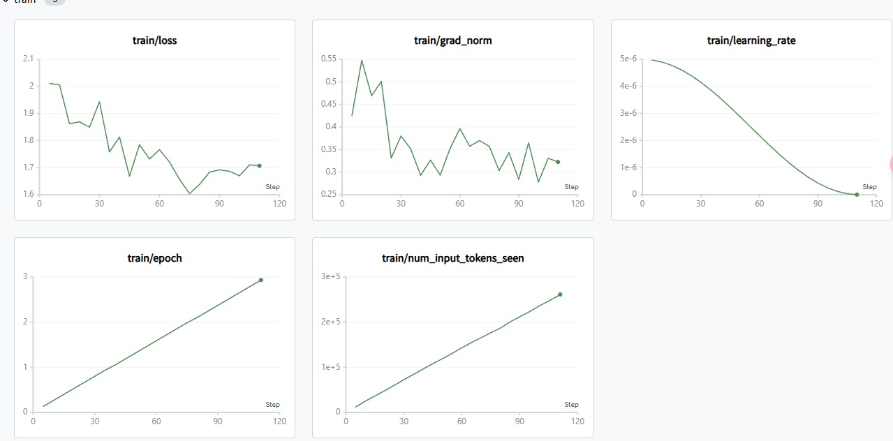

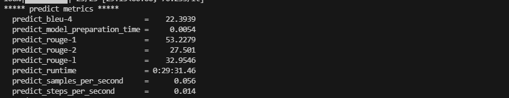

- 训练时长7分20秒
- 模型测试，可以进行新闻分类，并且也能够回答其他的通用问题
- 通过人工进行交叉验证，回答正确率较低，并且出现了重复回答的现象过拟合了

##### 微调2

继续微调1中的模型，通过修改参数查看对模型的影响

- 学习率：1e-05
- 轮数：3
- lora缩放系数：16

```sh
nohup llamafactory-cli train \
    --stage sft \
    --do_train True \
    --model_name_or_path /app/LLaMA-Factory/model/DeepSeek-R1-Distill-Qwen-1.5B \
    --preprocessing_num_workers 16 \
    --finetuning_type lora \
    --template deepseek3 \
    --flash_attn auto \
    --dataset_dir data \
    --dataset news_train \
    --cutoff_len 2048 \
    --learning_rate 1e-05 \
    --num_train_epochs 3 \
    --max_samples 100000 \
    --per_device_train_batch_size 2 \
    --gradient_accumulation_steps 2 \
    --lr_scheduler_type cosine \
    --max_grad_norm 1.0 \
    --logging_steps 5 \
    --save_steps 100 \
    --warmup_steps 0 \
    --packing False \
    --report_to none \
    --use_swanlab True \
    --output_dir saves/DeepSeek-R1-1.5B-Distill/lora/train_2025_news-2 \
    --bf16 True \
    --plot_loss True \
    --trust_remote_code True \
    --ddp_timeout 180000000 \
    --include_num_input_tokens_seen True \
    --optim adamw_torch \
    --lora_rank 8 \
    --lora_alpha 16 \
    --lora_dropout 0 \
    --loraplus_lr_ratio 16 \
    --lora_target all \
    --swanlab_project llamafactory \
    --swanlab_run_name deepseek-r1-1.5b_news-2 \
    --swanlab_mode local \
    --deepspeed cache/ds_z3_config.json   > llama.log 2>&1 & disown && ps -ef |grep '/usr/local/bin/llamafactory-cli train' | grep -v 'grep' | awk '{print $2}' > llamafactory.pid
```

模型评估：

```sh
nohup llamafactory-cli train \
    --stage sft \
    --model_name_or_path /app/LLaMA-Factory/model/DeepSeek-R1-Distill-Qwen-1.5B \
    --preprocessing_num_workers 16 \
    --finetuning_type lora \
    --quantization_method bitsandbytes \
    --template deepseek3 \
    --flash_attn auto \
    --dataset_dir data \
    --eval_dataset news_eval \
    --cutoff_len 1024 \
    --max_samples 100000 \
    --per_device_eval_batch_size 2 \
    --predict_with_generate True \
    --max_new_tokens 2048 \
    --top_p 0.7 \
    --temperature 0.7 \
    --output_dir saves/DeepSeek-R1-1.5B-Distill/lora/eval_2025_news-2 \
    --trust_remote_code True \
    --do_predict True \
    --adapter_name_or_path saves/DeepSeek-R1-1.5B-Distill/lora/train_2025_news-2  > llama_test.log 2>&1 & disown
```

微调结果：

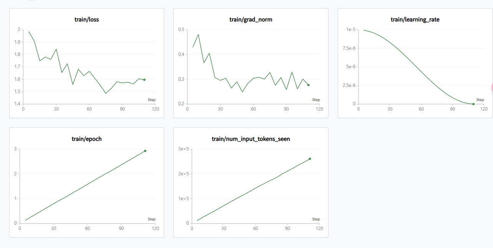

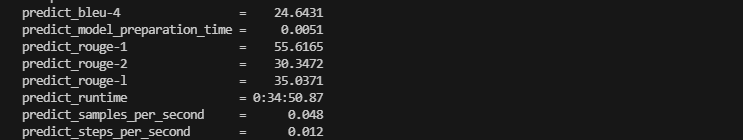

- 训练时长7分20秒
- 模型测试，可以进行新闻分类，并且也能够回答其他的通用问题
- 通过人工进行交叉验证，回答正确率较低

##### 微调3

再次尝试调整学习率

- 学习率：3e-05

微调结果：

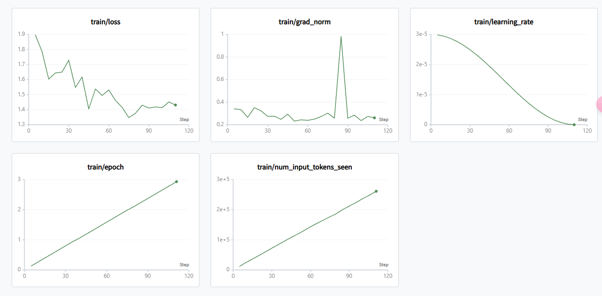


- 训练时长7分钟26秒
- 模型测试，可以进行新闻分类，并且也能够回答其他的通用问题
- 通过人工进行交叉验证，回答正确率还是较低

##### 微调4

上面3次微调通过修改学习率并不能提高模型对问题的回答成功率，可能是数据量或者学习轮数太少接下来提高轮数来查看是否可以提高模型的正确率；通过评估可以看到第三次的指标得分是最高的，接下来采用的参数以第3次的微调参数为准

- 学习率：3e-05
- 轮数：10

微调结果：


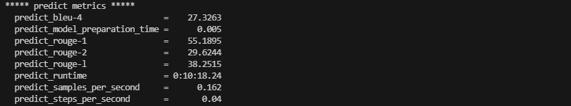

- 训练时长23分钟24秒
- 可以发现整个loss损失率的曲线是一直在降低的，但是一直没有趋于平缓，模型还是出现了过拟合的现象
- 通过评估得分可以看出，增加轮数也没有明显的提升分数

##### 微调5

- 学习率：3e-05
- 轮数：10
- lora_rank：128
- lora_alpha：256

微调结果：


#### 微调法律助手

微调环境：

- 模型：**DeepSeek-R1-1.5B-Distill** 
- 显卡：2张2080TI 共44G显存
- 数据集：[法律数据集](https://modelscope.cn/datasets/Robin021/DISC-Law-SFT) / [DeepSeek-R1数据集](https://modelscope.cn/datasets/liucong/Chinese-DeepSeek-R1-Distill-data-110k-SFT/files)

##### 微调1

- 学习率：3e-5
- 轮数：3
- 数据：截取其中9000条法律数据集

```sh
export CUDA_VISIBLE_DEVICES=2,3 && llamafactory-cli train \
    --stage sft \
    --do_train True \
    --model_name_or_path /app/LLaMA-Factory/model/DeepSeek-R1-Distill-Qwen-1.5B \
    --preprocessing_num_workers 16 \
    --finetuning_type lora \
    --template deepseek3 \
    --flash_attn fa2 \
    --dataset_dir data \
    --dataset law_train \
    --cutoff_len 2048 \
    --learning_rate 3e-5 \
    --num_train_epochs 3 \
    --max_samples 100000 \
    --per_device_train_batch_size 1 \
    --gradient_accumulation_steps 8 \
    --lr_scheduler_type cosine \
    --max_grad_norm 1.0 \
    --logging_steps 5 \
    --save_steps 100 \
    --warmup_steps 0 \
    --packing False \
    --report_to none \
    --use_swanlab True \
    --output_dir saves/DeepSeek-R1-1.5B-Distill/lora/train_2025_law-1 \
    --bf16 True \
    --plot_loss True \
    --trust_remote_code True \
    --ddp_timeout 180000000 \
    --include_num_input_tokens_seen True \
    --optim adamw_torch \
    --lora_rank 8 \
    --lora_alpha 16 \
    --lora_dropout 0 \
    --loraplus_lr_ratio 16 \
    --lora_target all \
    --swanlab_project llamafactory \
    --swanlab_run_name deepseek-r1-1.5b_law-1 \
    --swanlab_mode local \
    --deepspeed cache/ds_z3_config.json > llama.log 2>&1 & disown && ps -ef |grep '/usr/local/bin/llamafactory-cli train' | grep -v 'grep' | awk '{print $2}' > llamafactory.pid
```

微调结果：

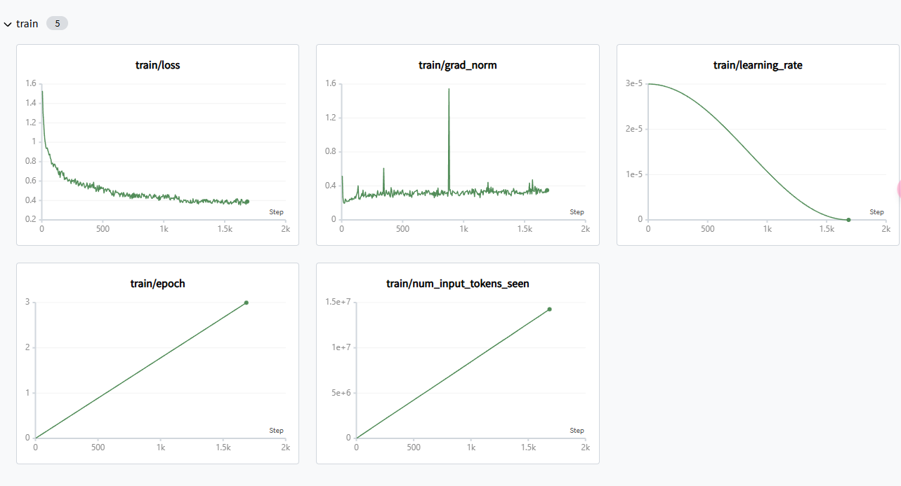

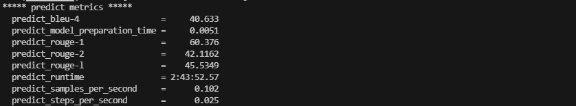

- 训练时长6小时30分钟24秒
- 数据集9000条法律数据，可以看到损失率的图像波动不大，通过测试集发现评分标准也比较高
- 模型拥有了回答法律相关的能力，并且成功率可以达到60%
- 通过使用通用问题测试后发现DeepSeek-R1丧失了深度思考的能力，以及失去了通用问题回答的能力（灾难性遗忘）

##### 微调2

根据微调1的结果，发现9000条法律数据集微调后，模型失去了回答通用问题的能力，本次微调将减少数据集看看是否会影响到模型的通用能力

- 学习率：3e-5
- 轮数：3
- 数据：截取其中2000条法律数据集

微调结果：

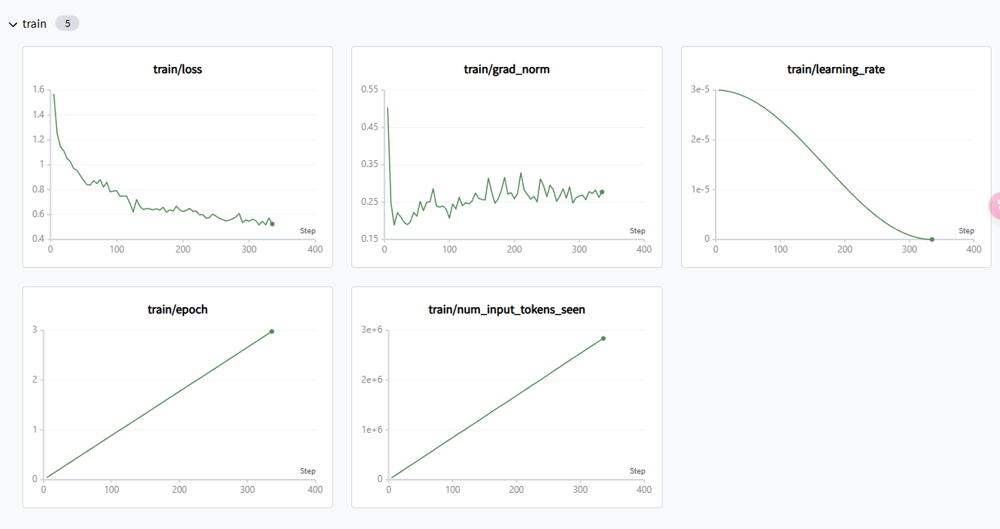

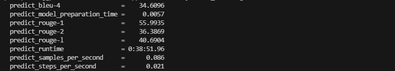

- 训练时长1小时18分钟3秒
- 通过对微调后的大模型实验降低法律数据集到2000条后，大模型出现了过拟合的现象，模型不能很好的回答问题并且通用问题也不能很好的回答，深度思考的能力也丢失了

##### 微调3

微调2降低数据集后模型的效果很不好，通用能力丧失了，而且对训练数据的支持也很差了。本次微调尝试增加轮数

- 学习率：3e-5
- 轮数：10
- 数据：截取其中2000条法律数据集

微调结果：

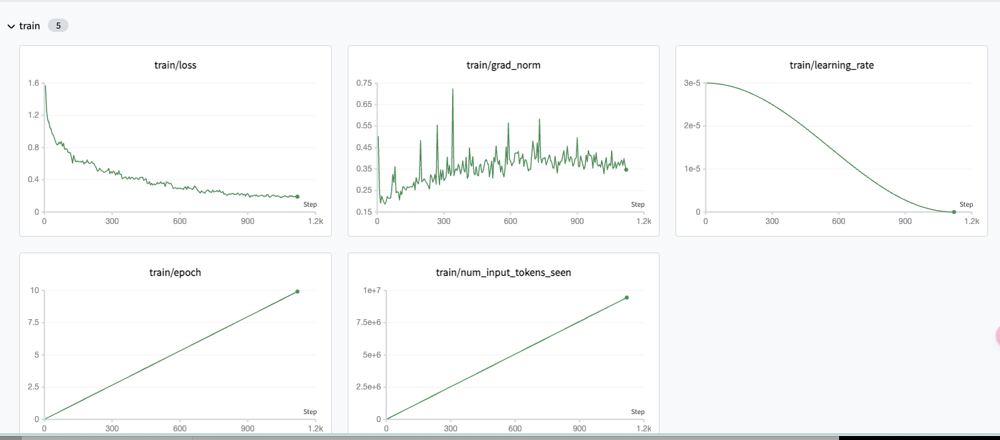

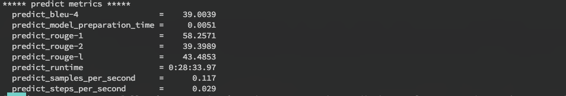

- 模型loss逐渐平缓
- 性能评估后发现指标并不高
- 模型测试大模型失去了通用能力，能够回答上专业法律问题并且引用条例，但是在训练集上面表现比较好，测试集表现就很差了；模型典型的过拟合了缺乏泛化能力

##### 微调4

通过上面测试发现，使用法律数据集后无论是降低学习率还是调整训练轮数都不能缓解模型的过拟合问题，接下来尝试调整lora参数

- 学习率：3e-5
- 轮数：3
- 数据：截取其中2000条法律数据集
- lora_rank：32
- lora_alpha：64
- lora_dropout：0.3

```sh
export CUDA_VISIBLE_DEVICES=2,3 && nohup llamafactory-cli train \
    --stage sft \
    --do_train True \
    --model_name_or_path /app/LLaMA-Factory/model/DeepSeek-R1-Distill-Qwen-1.5B \
    --preprocessing_num_workers 16 \
    --finetuning_type lora \
    --template deepseek3 \
    --flash_attn fa2 \
    --dataset_dir data \
    --dataset law_train \
    --cutoff_len 2048 \
    --learning_rate 3e-5 \
    --num_train_epochs 5 \
    --max_samples 100000 \
    --per_device_train_batch_size 1 \
    --gradient_accumulation_steps 8 \
    --lr_scheduler_type cosine \
    --max_grad_norm 1.0 \
    --logging_steps 5 \
    --save_steps 100 \
    --warmup_steps 0 \
    --packing False \
    --report_to none \
    --use_swanlab True \
    --output_dir saves/DeepSeek-R1-1.5B-Distill/lora/train_2025_law-4 \
    --bf16 True \
    --plot_loss True \
    --trust_remote_code True \
    --ddp_timeout 180000000 \
    --include_num_input_tokens_seen True \
    --optim adamw_torch \
    --lora_rank 32 \
    --lora_alpha 64 \
    --val_size 0.2 \
    --eval_strategy steps \
    --eval_steps 10 \
    --lora_dropout 0.3 \
    --loraplus_lr_ratio 16 \
    --lora_target all \
    --swanlab_project llamafactory \
    --swanlab_run_name deepseek-r1-1.5b_law-4 \
    --swanlab_mode local \
    --deepspeed cache/ds_z3_config.json > llama.log 2>&1 & disown && ps -ef |grep '/usr/local/bin/llamafactory-cli train' | grep -v 'grep' | awk '{print $2}' > llamafactory.pid
```

微调结果：


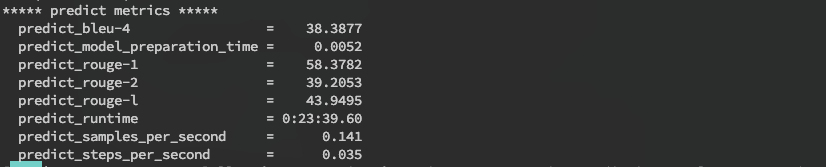

- 训练时长1小时54分钟46秒
- 通过大模型验证测试，模型出现了过拟合的现象，实际测试跟微调3区别不大

##### 微调5

再次尝试调整lora参数

- 学习率：3e-5
- 轮数：3
- 数据：截取其中2000条法律数据集
- lora_rank：128
- lora_alpha：256
- lora_dropout：0.3
- val_size：0.1 验证集为训练集的10%

微调结果：

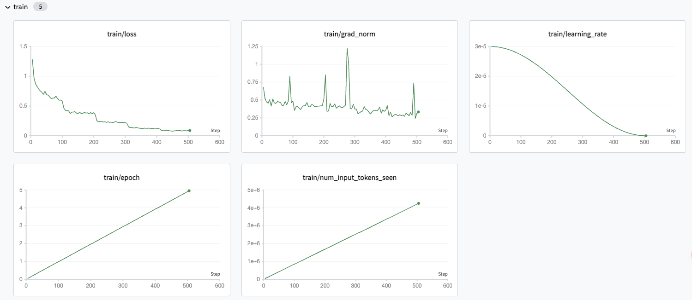

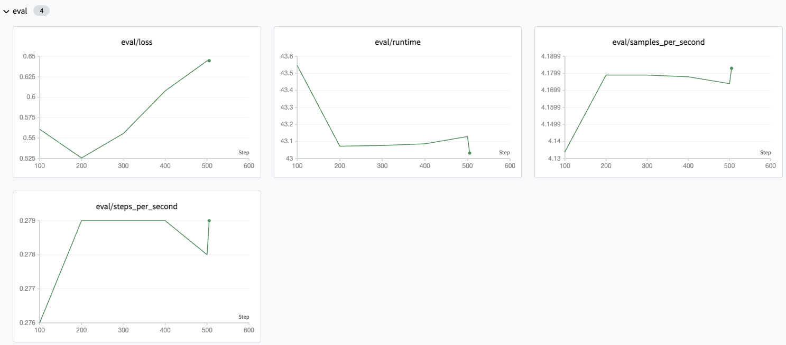

- 通过调整lora相关的参数发现模型不管问什么问题都是回答的通用问题，lora系数缩放过大参数更新范围也比较大所以出现了灾难性遗忘；而验证集loss在前面降低后面上升是明显的出现了过拟合的现象
- 通过交叉验证，模型失去了通用能力

##### 微调6

使用混合数据进行训练

- 数据集：500条通用数据集、1000法律数据集
- 学习率：3e-5
- lora_rank：8
- lora_alpha：16

微调结果：

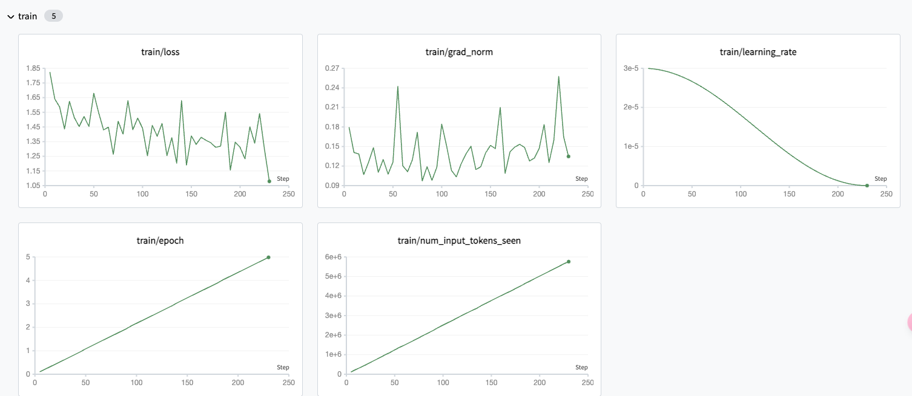

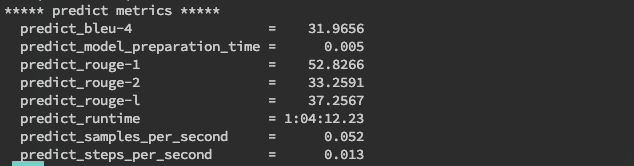

- 微调时长2小时28分钟49秒
- 大模型通用能力没有丧失，也能够回答专业数据，但是回答的准确率不高

##### 微调7

加大混合数据量

- 数据集：8000条法律数据、5000条通用数据集
- 学习率：3e-5
- 训练轮数：5
- lora_rank：8
- lora_alpha：16

微调结果：

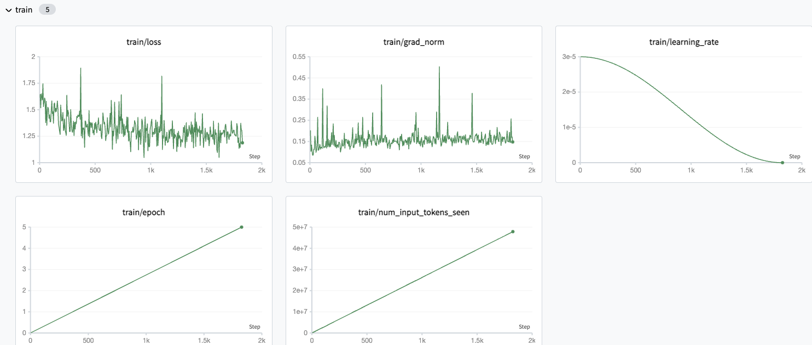

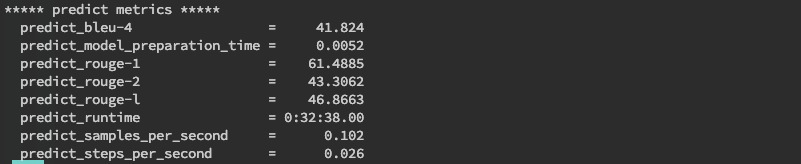

- 训练时长19小时54分钟，loss图由于普通数据和专业数据结合所以在计算的时候特征相距较大所以就会出现波动比较大的情况，但是整体是下降的
- 通过使用混合数据训练后，模型没有失去回答通用问题的能力，专业能力也具备引用具体的法律条例
- 模型出现了复读机的问题，模型还是出现了过拟合现象，但是模型的问答效果还是不错

##### 微调8

上面使用的是混合数据集进行微调，loss图一直处于抖动，所以本次微调尝试将数据分为两个数据集，一个专业数据集，一个通用数据集进行微调，并且加大一点学习率

- 数据集：8000条法律数据、5000条通用数据集
- 学习率：5e-5
- 训练轮数：5
- lora_rank：8
- lora_alpha：16

- 学习率预热步数（warmup）：500

微调结果：

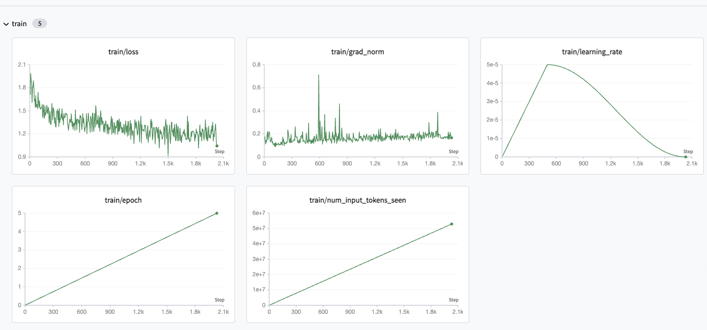

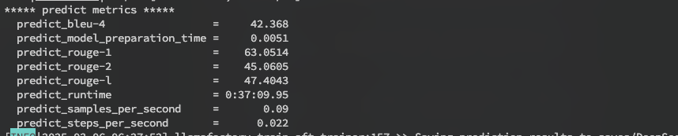

- 微调时长19小时52分钟21秒，通过loss可以看到跟微调7的过程差不多
- 评估结果可以看到将数据集拆分可得到的分数要比微调7合并在一起作为混合数据训练要高许多
- 通过专业数据集可以回答专业问题并且引用条例；通过通用数据集也有一定的泛化能力，不过准确率还有待提高

##### 微调9

降低数据集数量，添加训练评估过程，提高批次处理，批次处理2，梯度累计8

- per_device_train_batch_size：2
- gradient_accumulation_steps：8
- 数据集：500条通用数据集、100垂直数据集
- 学习率：3e-5
- 验证集：0.01

微调结果：

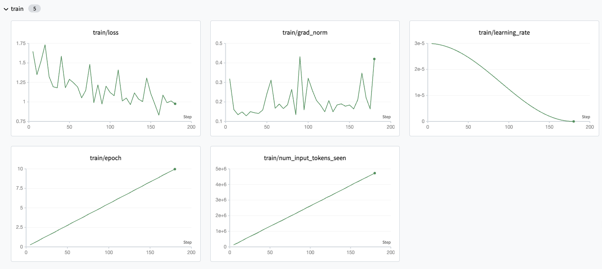

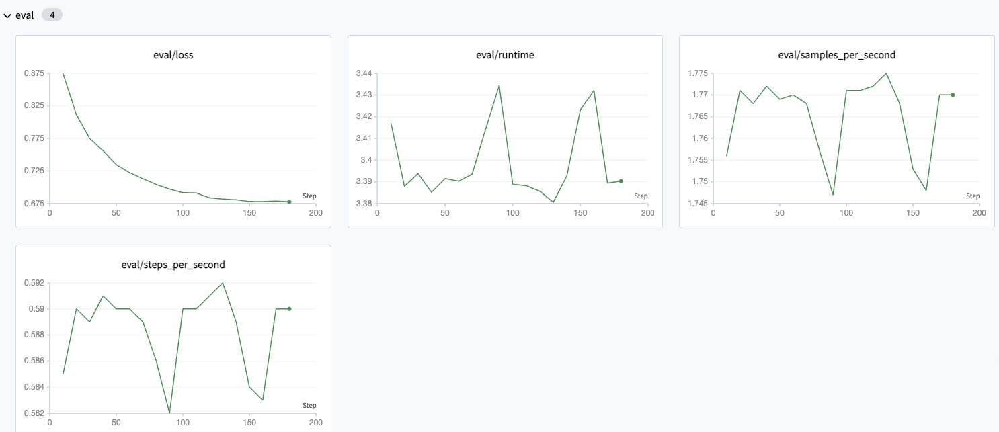

- 训练集的模型不收敛，效果不是很好
- 评估的数据收敛的比较好

##### 微调10

尝试将通用数据集数量加大

- 数据集：1:3，垂直训练集100条，通用数据集500条
- 学习率：3e-5
- 轮数：20
- per_device_train_batch_size：2
- gradient_accumulation_steps：4
- 验证集：0.1

微调结果：


### 3.2.4 问题总结

- 过拟合
  - 现象
    - 训练集损失函数正常的下降
    - 验证集损失函数下降到一定程度开始回升
    - 模型在回答训练集的数据表现的比较好，但是回答测试集上面的数据就牛头不对马嘴
  - 解决方案
    - 数据增强，将样本增强。如果是图片可以将样本旋转，裁切
    - 早停法，在下到最低点停止训练
    - dropout，减少参数量
    - 适当降低学习率
    - 降低训练的轮数
- 欠拟合
  - 现象
    - 训练集损失函数正常下降
    - 验证集损失函数与训练集损失函数的距离很远
  - 解决方案
    - 加深网络层数
    - 尽量用一些非线性激活函数比如relu
- 拟合，但是震荡
  - 现象
    - 验证集在训练集的损失函数线上面进行震荡
  - 解决方案
    - 减少学习率
    - 减少数据
- 恰好拟合（完美）
- 不收敛
  - 数据有问题
  - loss线一直处于震荡状态

# 4. Langchain

开源框架，它允许开发人员将像GPT-4这样的大型语言模型与外部的计算和数据源结合起来；**LangChain是一个用于开发由语言模型驱动的应用程序的框架**（类似java的Spring Boot框架）

- Components：为LLMs提供接口封装，模板提示和信息检索；
- Chains：他将不同的组件结合起来解决特定的任务，比如在大量文本中查找信息；
- Agents：它们使得LLMs能够与外部环境进行交互，例如通过API请求执行操作；

## 4.1 Langchain的核心

- Models：模型，包装器允许连接到大模型
- Prompt Templates：模板可以避免硬编码文本输入。可以动态的将用于输入插入到模板中，并发送给语言模型
- Chains：链允许将多个组件组合在一起，觉得特定的任务，并构建完成的语言模型应用程序
- Agents：代理，允许语言模型与外部Api交互
- Embedding：嵌入与向量存储VectorStore是数据表示和检索的手段，为模型提供比较多语言理解基础
- Indexes：索引帮助从语言模型中提取相关信息

## 4.2 Langchain的底层原理

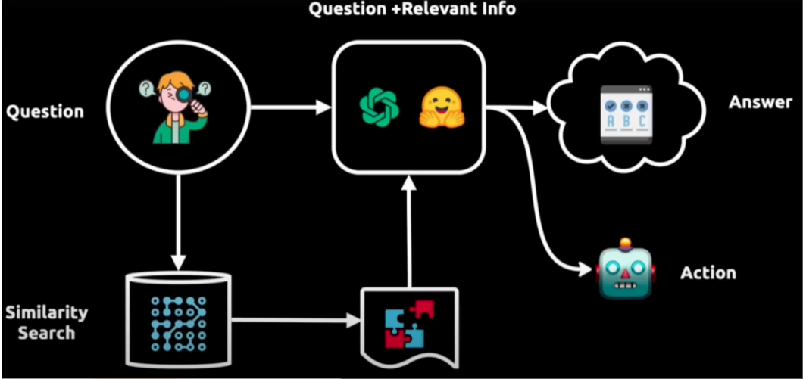

举例：上图展示了一个智能问答系统的工作流程。

- 从用户提出的问题（Question）开始，然后通过相似性搜索（Similarity Search）在一个大型数据库或向量空间中找到与之相关的信息
- 得到的信息与原始问题结合后，由一个处理模型分析，以生成一个答案（Answer）
- 这个答案接着被用来知道一个代理采取行动（Action），这个代理可能会执行一个API调用或者与外部系统交互以完成任务

## 4.3 实战操作

> pip install langchain #核心库
>
> pip install langchain-openapi #openapi实现库
>
> pip install langchain-ollama #ollama实现库

这里我们通过ollama实现一个大模型的数据调用。

- 安装ollama
- 通过ollama启动qwen2.5b的模型
- 通过python代码进行调用

### 4.3.1 普通调用

```python
from langchain_ollama import ChatOllama
llm = ChatOllama(
    base_url = "http://127.0.0.1:11434",
    model = "qwen2.5:7b",
    temperature = 0.8,
    num_predict = 256,
)
messages = [
    ("system", "你的身份是一个心理辅导师，你将给用户提供最专业的心理辅导"),
    ("human", "你好，你是谁？"),
]
print(llm.invoke(messages).content)
```

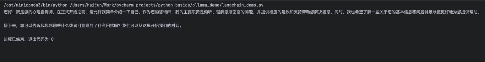

### 4.3.2 流式调用

```python
from langchain_ollama import ChatOllama

llm = ChatOllama(
    base_url = "http://192.168.2.236:11434",
    model = "qwen2.5:7b",
    temperature = 0.8,
    num_predict = 256,
)

messages = [
    ("system", "你的身份是一个心理辅导师，你将给用户提供最专业的心理辅导"),
    ("human", "你好")
]
response = llm.invoke(messages)
print(response.content)
while True:
    prompt = input("\n请输入你的问题：")
    messages.append(("human", prompt))
    stream = llm.stream(messages)
    full = next(stream)
    for chunk in stream:
        print(chunk.content, end='')
        full += chunk
    messages.append(("assistant", full.content))
```


### 4.3.3 链式调用

将两个组件构建为一个链式来进行处理，也是 **langchain** 的核心组件方式

```python
from langchain_core.output_parsers import StrOutputParser
from langchain_ollama import ChatOllama


llm = ChatOllama(
    base_url = "http://192.168.2.236:11434",
    model = "qwen2.5:7b",
    temperature = 0.8,
    num_predict = 256,
)

messages = [
    ("system", "你的身份是一个心理辅导师，你将给用户提供最专业的心理辅导"),
    ("human", "你好")
]
# 最简单的字符串解析器
parser = StrOutputParser()
# 通过链的方式来调用
chain = llm | parser
print(chain.invoke(messages))
```

### 4.3.4 提示词模板

```python
from langchain_core.output_parsers import StrOutputParser
from langchain_core.prompts import ChatPromptTemplate
from langchain_ollama import ChatOllama

llm = ChatOllama(
    base_url="http://192.168.2.236:11434",
    model="vanilj/qwen2.5-32b-instruct_iq4_xs:latest",
    temperature=0.8,
    num_predict=256,
)
# 提示词模板
system_template = ChatPromptTemplate.from_messages([
    ("system", "你的身份是一个心理辅导师，你将给用户提供最专业的心理辅导"),
    ("user", "{text}")
])

# 最简单的字符串解析器
parser = StrOutputParser()
# 通过链的方式来调用
chain = system_template | llm | parser
print(chain.invoke({'text': '我很郁闷怎么办'}))
```

### 4.3.5 聊天机器人

```python
def get_session_history(session_id: str):
    if session_id not in store:
        store[session_id] = ChatMessageHistory()
    return store[session_id]


def normal_chat(chat_robot: RunnableWithMessageHistory):
    # 第一轮聊天
    config = {
        'configurable': {'session_id': 'zs1'}  # 给当前会话定义一个session_id
    }
    resp = chat_robot.invoke(
        {
            'my_message': [HumanMessage(content="你好啊！我是空空")],
            'language': '中文'
        },
        config=config
    )
    print(resp)


def steam_chat(chat_robot: RunnableWithMessageHistory):
    # 第一轮聊天
    config = {
        'configurable': {'session_id': 'zs1'}  # 给当前会话定义一个session_id
    }
    messages = {
        'my_message': [HumanMessage(content="你好啊！我是空空")],
        'language': '中文'
    }
    for resp in chat_robot.steam(messages, config=config):
        print(resp.content)


if __name__ == '__main__':
    # 创建聊天机器人案例
    llm = ChatOllama(
        base_url="http://192.168.2.236:11434",
        model="vanilj/qwen2.5-32b-instruct_iq4_xs:latest",
        temperature=0.8,
        num_predict=256,
    )
    system_template = ChatPromptTemplate.from_messages([
        ("system", "你的身份是一个心理辅导师，你将给用户提供最专业的心理辅导，用{language}来回答所有的问题"),
        MessagesPlaceholder(variable_name='my_message')  # 将历史数据进行注入
    ])
    # 最简单的字符串解析器
    parser = StrOutputParser()
    # 通过链的方式来调用
    chain = system_template | llm | parser

    # 保存聊天的历史记录，所有的用户的聊天记录都保存到store，key：sessionId
    store = {}

    chat_robot = RunnableWithMessageHistory(
        chain,
        get_session_history,
        input_messages_key='my_message'  # 每次聊天的时候发送消息需要插入的模板
    )

    # normal_chat(chat_robot)
    steam_chat(chat_robot)

```


### 4.3.6 构建向量数据库

支持从向量数据库和其他来源检索数据，以便于与LLM工作流集成。它们对应应用程序来说非常重要，这些应用程序需要获取数据作为模型推理的一部分进行推理。

> pip install langchain-chroma

```python
from langchain_chroma import Chroma
from langchain_core.runnables import RunnableLambda
from langchain_ollama import OllamaEmbeddings
from langchain_core.documents import Document


def get_sample_documents():
    documents: list[Document] = [
        Document(
            page_content="狗是伟大的伴侣，以其忠诚和友好而闻名。",
            metadata={
                "source": "https://www.baidu.com"
            }
        ),
        Document(
            page_content="猫是独立的宠物，通常喜欢自己的空间。",
            metadata={
                "source": "https://www.baidu.com"
            }
        ),
    ]
    return documents


if __name__ == '__main__':
    # 实例化一个向量数据空间
    embeddings = OllamaEmbeddings(
        # 指定ollama的地址
        base_url="http://192.168.2.236:11434",
        # 指定向量化技术的模型名称
        model="chevalblanc/acge_text_embedding",
    )
    vector_store = Chroma.from_documents(get_sample_documents(), embedding=embeddings)
    # 相似度的查询：返回相似度的分数，分数越低相似度越高
    score = vector_store.similarity_search_with_score('狗')
    print(score)

    # 检索器：bind(k=1) 返回相似度最高的一个，整合langchain链条，需要将其转换为RunnableLambda对象
    retriever = RunnableLambda(vector_store.similarity_search).bind(k=1)
    print(retriever.batch(['咖啡猫', '鲨鱼']))

    message = """
    使用提供的上下文仅回答这个问题：
    {question}
    上下文：
    {context}
    """

    prompt_temp = ChatPromptTemplate.from_messages([
        ('human', message)
    ])

    model = ChatOllama(
        base_url="http://127.0.0.1:11434",
        model="",
        temperature=0.8,
    )

    # RunnablePassthrough允许我们将用户的问题后面再传递给prompt和model
    chain = {
                'question': RunnablePassthrough(),
                'context': retriever
            } | prompt_temp | model

    resp = chain.invoke('请介绍一下猫？')
    print(resp.content)
```

### 4.3.7 构建代理

代理是使用大模型语言作为推理引擎来确定需要执行的操作以及这些操作的输入应该是什么，然后将结果反馈到大模型语言进行整合

> pip install langgraph

# 5. LangSmith

是一个用于构建生产级 LLM 应用程序的平台，它提供了调试、测试、评估和监控基于任何 LLM 框架构建的链和智能代理的功能，并能与 LangChain 无缝集成。其主要作用包括:

- 调试与测试:通过记录langchain构建的大模型应用的中间过程，开发者可以更好地调整提示词等中间过程，优化模型响应。评估应用效果:langsmith可以量化评估基于大模型的系统的效果，帮助开发者发现潜在问题并进行优化。
- 监控应用性能:实时监控应用程序的运行情况，及时发现异常和错误，确保其稳定性和可靠性。数据管理与分析:对大语言模型此次的运行的输入与输出进行存储和分析，以便开发者更好地理解模型行为和优化应用。
- 团队协作:支持团队成员之间的协作，方便共亨和讨论提示模板等可扩展性与维护性:设计时考虑了应用程序的可扩展性和长期维护，允许开发者构建可成长的系统。

LangSmith是Langchain的一个子产品，是一个大模型应用开发平台。它提供了从原型到生产的全流程工具和服务，帮助开发者构建、测试、评估和监控基于LangChain或其他 LLM 框架的应用程序。


# 6. Spring AI

Spring框架中提供的用于接入 **Ai大模型** 的抽象封装框架 [Spring AI](https://docs.spring.io/spring-ai/reference/getting-started.html)


# 7. KAG

KAG 是基于 [OpenSPG](https://github.com/OpenSPG/openspg) 引擎和大型语言模型的逻辑推理问答框架，用于构建垂直领域知识库的逻辑推理问答解决方案。KAG 可以有效克服传统 RAG 向量相似度计算的歧义性和 OpenIE 引入的 GraphRAG 的噪声问题。KAG 支持逻辑推理、多跳事实问答等，并且明显优于目前的 SOTA 方法。

KAG 的目标是在专业领域构建知识增强的 LLM 服务框架，支持逻辑推理、事实问答等。KAG 充分融合了 KG 的逻辑性和事实性特点，其核心功能包括：

- 知识与 Chunk 互索引结构，以整合更丰富的上下文文本信息
- 利用概念语义推理进行知识对齐，缓解 OpenIE 引入的噪音问题
- 支持 Schema-Constraint 知识构建，支持领域专家知识的表示与构建
- 逻辑符号引导的混合推理与检索，实现逻辑推理和多跳推理问答

## 7.1 面向用户

启动图形化的用户界面

> ```
> curl -sSL https://raw.githubusercontent.com/OpenSPG/openspg/refs/heads/master/dev/release/docker-compose.yml -o docker-compose.yml
> docker compose -f docker-compose.yml up -d
> 
> 浏览器打开 KAG 产品默认链接：http://127.0.0.1:8887 
> 默认用户名: openspg
> 默认密码: openspg@kag
> ```


# 8. Deep-Searcher
