# 1. 部署SD

安装miniconda，通过pytorch官网提供的命令下载对应的pytorch就可以了

配置conda的数据源管道

```config
channels:
  - https://mirrors.tuna.tsinghua.edu.cn/anaconda/cloud/conda-forge/
  - https://mirrors.tuna.tsinghua.edu.cn/anaconda/pkgs/main/
  - https://mirrors.tuna.tsinghua.edu.cn/anaconda/pkgs/free/
  - defaults
show_channel_urls: true
default_channels:
  - https://mirrors.tuna.tsinghua.edu.cn/anaconda/pkgs/main
  - https://mirrors.tuna.tsinghua.edu.cn/anaconda/pkgs/r
  - https://mirrors.tuna.tsinghua.edu.cn/anaconda/pkgs/msys2
custom_channels:
  conda-forge: https://mirrors.tuna.tsinghua.edu.cn/anaconda/cloud
  msys2: https://mirrors.tuna.tsinghua.edu.cn/anaconda/cloud
  bioconda: https://mirrors.tuna.tsinghua.edu.cn/anaconda/cloud
  menpo: https://mirrors.tuna.tsinghua.edu.cn/anaconda/cloud
  pytorch: https://mirrors.tuna.tsinghua.edu.cn/anaconda/cloud
  simpleitk: https://mirrors.tuna.tsinghua.edu.cn/anaconda/cloud
```

下载pytorch，conda中下载pytorch自带就有cuda的工具包，可以不需要单独在电脑上面安装cuda-toolkit的工具包了

> ```cmd
> conda install pytorch torchvision torchaudio pytorch-cuda=12.1 -c pytorch -c nvidia
> ```

## 1.1 安装SD

git仓库中下载sd源码 **https://github.com/AUTOMATIC1111/stable-diffusion-webui.git**

- 安装依赖，使用 pip 下载根目录下面的 **requirements_versions.txt** 文件
- 如果pip缺少安装依赖，那么使用conda来进行对应的依赖下载
- huggingface下载默认的模型：v1-5-pruned-emaonly.safetensors
- 依赖下载完成后直接启动 **python launch.py** 即可

## 1.2 插件

### 1.2.1 中文插件

[安装中文插件](https://github.com/dtlnor/stable-diffusion-webui-localization-zh_CN)：user interface中选择 Localization为中文即可

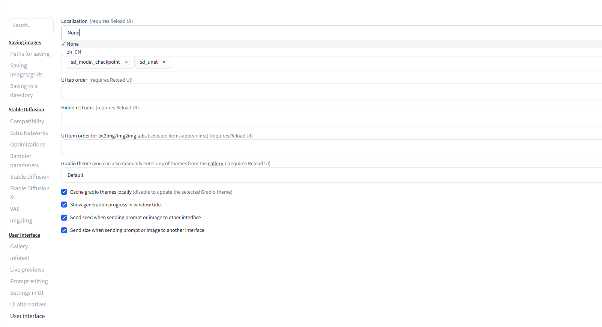

### 1.2.2 openvino加速插件

[openvino低配置电脑加速插件)](https://github.com/openvinotoolkit/openvino)

### 提示词插件

[提示词插件](https://github.com/thisjam/sd-webui-oldsix-prompt)：NSFW 标签的提示词可以放到对应插件的 yours路径下面然后重启

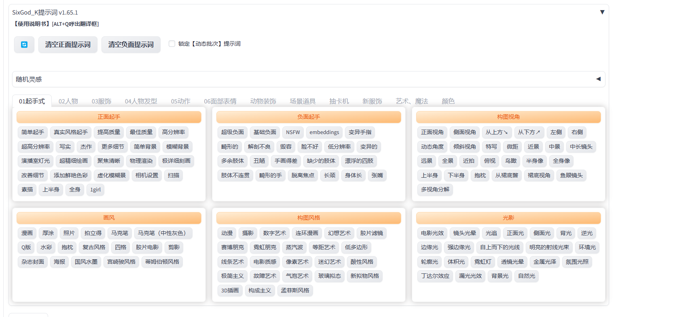

### 1.2.3 提示词翻译插件（推荐）

[提示词插件（带有翻译推荐使用）](https://github.com/Physton/sd-webui-prompt-all-in-one)

### 1.2.4 抠图插件

stable-diffusion-webui-rembg：非常强大的抠图功能

### 1.2.5 TensorRT推理加速插件（推荐）

[TensorRT推理加速插件](https://github.com/NVIDIA/Stable-Diffusion-WebUI-TensorRT)

- 通过扩展插件的方式克隆下载
- 启动时报错时可以进入扩展插件中打开 **install.py** 手动拿出来进行下载

> pip install importlib_metadata
>
> pip install nvidia-cudnn-cu11==8.9.4.25 --no-cache-dir
>
> pip install --pre --extra-index-url https://pypi.nvidia.com tensorrt==9.0.1.post11.dev4 --no-cache-dir
>
> pip install install polygraphy --extra-index-url https://pypi.ngc.nvidia.com
>
> pip install onnx-graphsurgeon --extra-index-url https://pypi.ngc.nvidia.com
>
> pip install optimum

第一步先选择对应的模型然后直接默认值跑预设，输出到处模型成功即可，模型的安装路径为 **\models\Unet-trt**，在设置里面用户界面找到 **sd-unet** 即可

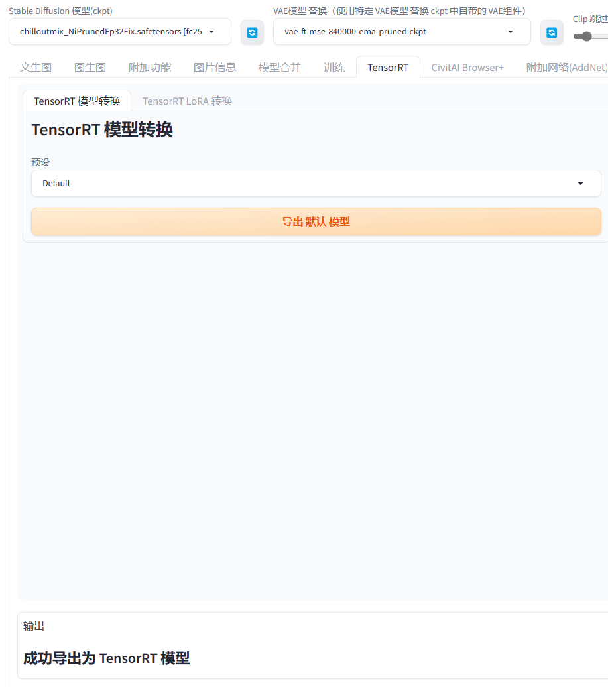

**注意事项：如果使用的是默认预设，需要注意的是每次生成图片的参数不能超过模型规定的最大值和最小值之间，并且数值需要是64的倍数**
现在就可以看到出图的时间是非常的快了

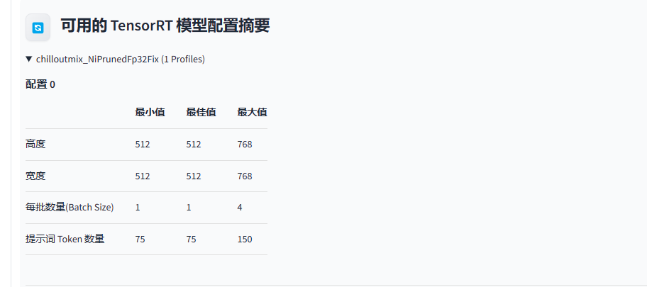

#### 预设参数

相同的参数设定下静态的预设比动态的预设性能更高显存占用更低

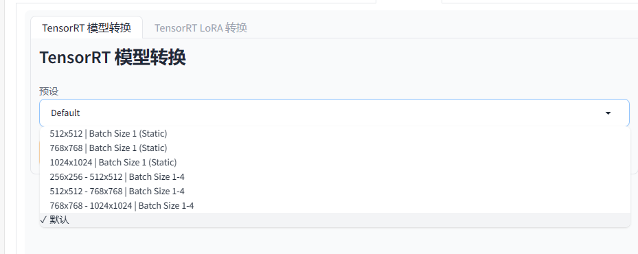

- 512 x 512 | Batch Size1(Static)
    - static表示所有的参数都是固定的，每批的数量数，还有最优的高度和最高的宽度，所有的都固定了
- 512 x 512 - 768 x 768 | Batch Size1 -4
    - 表示动态的参数设定，相当于就设置了一个范围
    - 最优的宽度设置最常用的就好，出图更快
    - 一个模型下面最多只能构建2个，点击强制重构后可以突破
    - **静态和动态的模型会自动合并到一个模型下面，调用时会自动调用下面的最引擎**
- **高阶用法**：、
    - 想要多个预设进行切换就可以根据尺寸多生成几个静态的预设，后续大模型会自动调用（静态引擎没有限制，动态最多只能构建两个）
    - **要想使用高分辨率修复，需要至少两个静态。例如：768x768和1536x1536 要与原尺寸和放大尺寸做匹配**
    - **LoRA转换**：给lora加速，将lora转换TensorRT模型后，lora会自动融入到模型当中不用选择里面自带

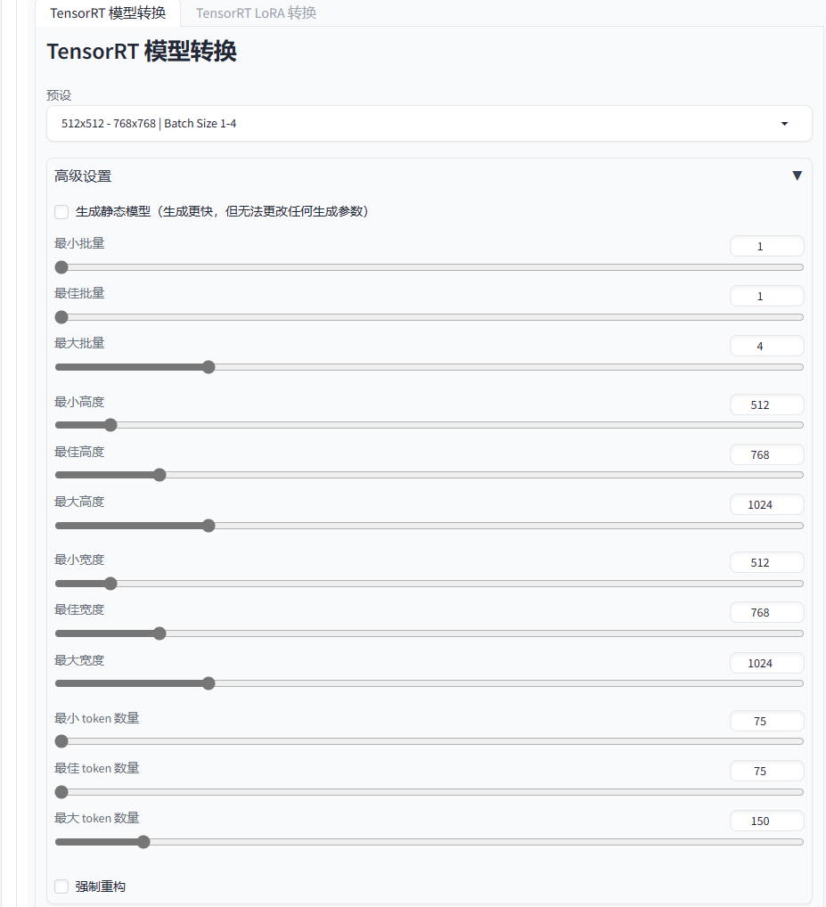

### 1.2.6 图片放大插件

[canvas-zoom](https://github.com/richrobber2/canvas-zoom)：shift+i 放大图片

### 1.2.7 反推提示词插件

[picobyte/stable-diffusion-webui-wd14-tagger](https://github.com/picobyte/stable-diffusion-webui-wd14-tagger)

### 1.2.8 锁定分辨比例插件

[sd-webui-aspect-ratio-helper](https://github.com/thomasasfk/sd-webui-aspect-ratio-helper)，可以用来锁定宽高比拉动时一起跟着改变

### 1.2.9 脸部修复插件（adetailer）

[Bing-su/adetailer](https://github.com/Bing-su/adetailer)

为什么会脸部崩坏？**分辨率不够**

#### 模型下载

需要到 [Bingsu/adetailer at main (huggingface.co)](https://huggingface.co/Bingsu/adetailer/tree/main) 下载对应修复的模型文件，将其放到 *
*models/adetailer** 文件夹下面，设置里面将 **adetailer** 的最大模型设置为5

- 模型的组成：修复的部位_使用的算法+版本+精度
    - 例如：face_yolov8m，修复脸部，yolo算法，版本8，m代表中型
    - s代表小型，n代表纳米（比小型更小），m代表中型，模型越小处理越快，代价就行精度更低
- mediapipe_face_full：只能对真人起效果

- face_yolov8m.pt：修复脸部
- face_yolov8n_v2.pt：脸部修复（推荐使用，二次元和真人都有效）
- hand_yolov8n.pt：修复手部
- person_yolov8m-seg.pt：增加人物整体细节的模型

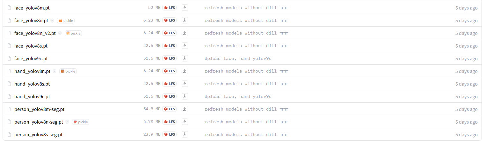

#### 参数说明

- 检测设置：用于扩大检查的范围
    - 检查模型置信度阈值：值越小，检测范围越大

### 1.2.10 controlnet插件

[Mikubill/sd-webui-controlnet: WebUI extension for ControlNet (github.com)](https://github.com/Mikubill/sd-webui-controlnet)

## 1.3 资源

- https://pan.quark.cn/s/656afd3bce60：b站小王子的AI 全资料

- https://pan.quark.cn/s/ac0ff19bed5c：网上找到一下模型和插件的资源

# 2. 参数详解

- checkpoint：大模型，文件使用safetensors/ckpt结尾
- lora：微调模型，一般对checkpoint的大模型进行微调，有些也是以 safetensors结尾

## 2.1 模型的VAE

变分自编码器，也是类似一种模型，在基础的模型上再进行训练提供更多的饱和度等

作用：增加图片饱和度、降低灰度、让图片有更多色彩

常用：vae-ft-mse-840000-ema-pruned-safetensors (可选)

安装路径：models路径中的VAE

## 2.2 Clip跳过层

语言与图片对比预训练

作用：让tag与图片建立关系；数值越高tag和图片关系就会低，数值越低tag和图片关系就越高，不要调整太高（关键词和图片会出现没有关系），默认1-4

## 2.3 正向提示词和反向提示词

正向提示词用于想要出现在图片中的元素，反向提示词用于不想要出现在图片中的元素

正向提示词描述内容（人物例子）：主体、表情、服装、场景、环境、镜头、灯光、风格、画质、渲染器（其他的元素提示词）

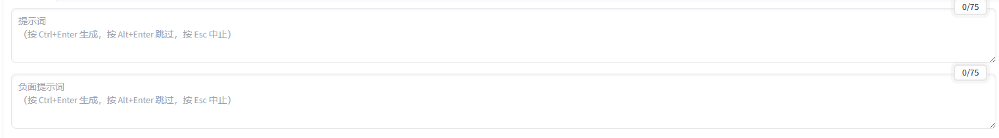

Tag的格式：

- 英文
- 单词
- 词组
- 语句（推荐，ai识别度高）

注意事项：

- tag之间用英文的逗号进行分割
- 靠前的tag权重比较高

权重：

- 括号法制
    - ()  = 增加1.1倍
    - {} = 增加1.05倍
    - [] = 减少1.1 倍
- 数字法则：
    - (tag:1.3) = 增加1.3倍
    - (tag:0.5) = 1/2的权重
    - 大于一就是增加
    - 小于一就是减少

- 混合法则：

    - tag AND tag

    - [tag|tag]

## 2.4 采样步数（Steps）

范围 **1 - 50**

- 数值越高：细节越多，渲染越慢
- 数值越低：细节越少，渲染越快
- 建议范围：20 - 40

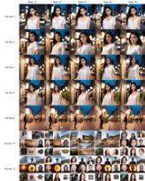

## 2.5 采样器

根据名称进行划分，**步数越少图片效果越好的采样器就好**

- 采样器带a的：噪点不居中，关键词识别稍低
- karras：去噪快
- DDIM & PLMS：sd最早的采样器（过时）
- DPM：**比较建议使用DPM++SDE Karras** 做人像

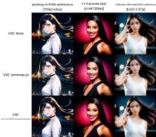

## 2.6 面部修复

渲染任务图时记得勾上，提高sd对人体面部的细节捕捉

## 2.7 无缝贴图

主要用来做纹理图按背景的，平时不要用

## 2.8 高分辨率修复

用于修复图片的

## 2.9 宽度和高度

像素稳准，跟显存有关系

- 512x512
- 768x768

## 2.10 生成次数和每次数量

- 生成次数：一个一个生成x张图片（显存低用这个）
- 每次数量：同时生成x张图（高显存用这个）

## 2.11 提示词相关性（CFG Scale）

文字和图片的相关度 **建议4 - 9之间**，有可能跟采样器有关系

- 数值高：tag和图片的相关度就高
- 数值低：tag和图片的相关度就低

## 2.12 随机种子（Seed）

如果是 -1 那么生成的图片全部都会是随机

循环标志：复制上一张图的种子

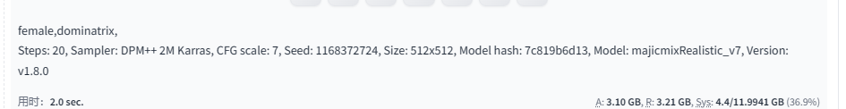

## 2.13 随机数差异种子

有点像是两个随机数的相总和

## 2.14 差异强度

随机种子和差异随机种子各占不同的比例

# 3. 模板预设

用于保存提示词的地方

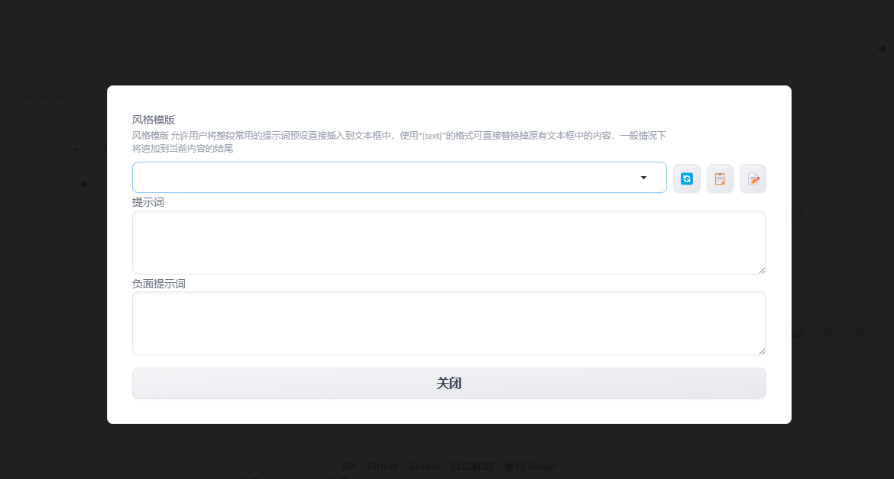

# 4. 嵌入式（Embedding）

也叫做 **Textual inversion** 把关键词打包为一个小模型，如果出现成千上百的关键词就可以将其进行打包，安装路径 **根目录 \embeddings**
，在生成特点人物形象、画风、姿势动作上应用广泛；使用的最多是在 **方向提示词** 可以将很多负面提示词打包成一个嵌入式模型，应用时只需要输入文件名就可以，推荐模型

- badhandv4:修复手指
- easynegative

# 5. 超网络（Hypernetworks）

主要影响画风，对人物还原准确度帮助不大，放在 **model\hypernetwork** 文件夹下

# 6. Checkpoint

大模型，平均几个G以上

# 7. Lora

小模型，在大模型的基础进行微调

# 8. 脚本

## 8.1 提示词矩阵（Prompt matrix）

在对比元素tag之间的区别时使用，例如：固定不变主题tag | 变量1 | 变量2....

图片制作出来像是一个矩阵一样，主要看不同灯光下的区别

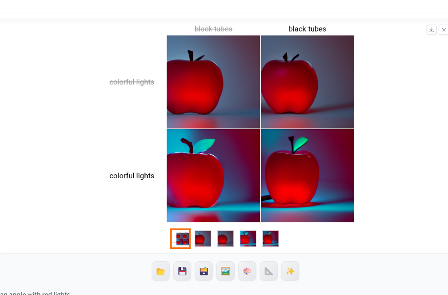

## 8.2 从文本框或文件载入提示词

**Prompts from file or textbox**

如果关键词过多了可用通过文件进行导入

格式为：

```txt
-- prompt "提示词" -- steps 28
```

## 8.3 x/y/z 图表

可以根据选择的参数进行调整来对比各个模型和参数之间的效果

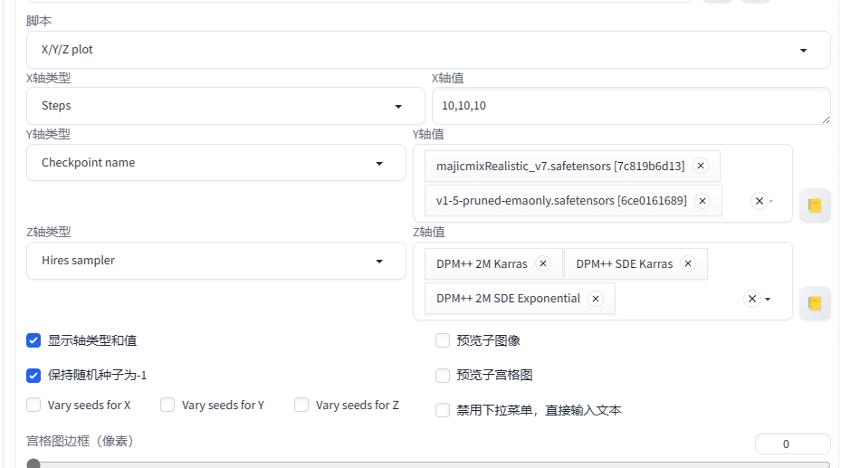

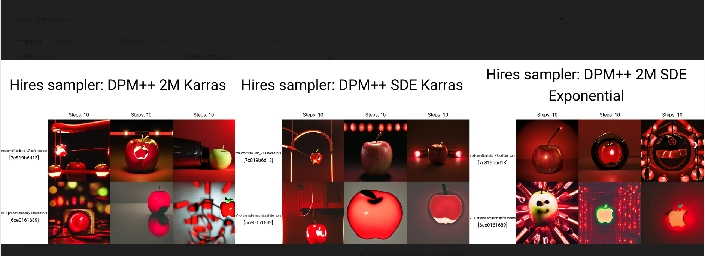

例如：需要对比不同迭代步数、CFG以及不同采样器对提示词的影响，可以设置如下：

- x轴steps：20-30[3] 意思我只需要出5张图，具体由模型来分配步数
- y轴CFG: 5-10[3] 提示词的相关性，也是五张图，由模型来分配
- z轴sampler：表示在两种采样器的情况下进行对比

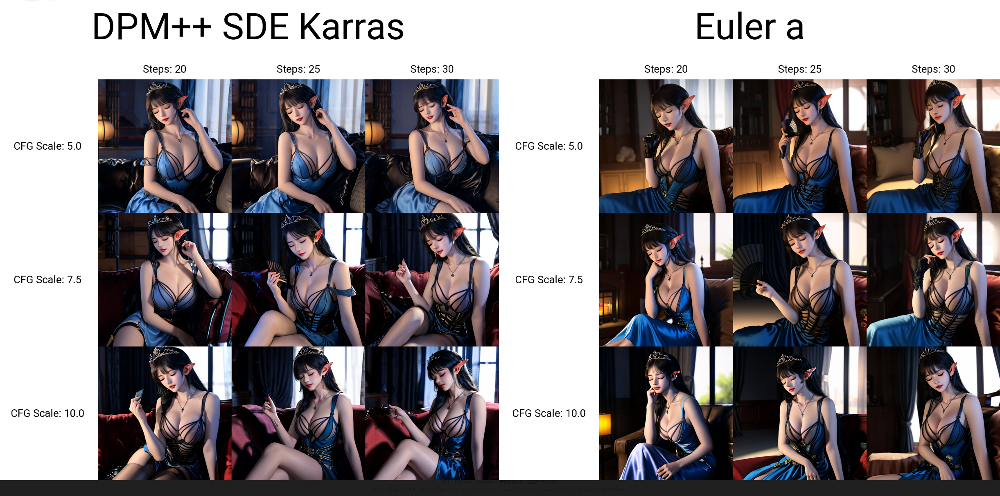

## 8.4 StableSR

[StableSR图像放大算法脚本](https://github.com/pkuliyi2015/sd-webui-stablesr)，秒杀4x-UltraSharp，按照官网文档使用即可

- 需要配合一个大模型一起使用 [stabilityai/stable-diffusion-2-1-base](https://huggingface.co/stabilityai/stable-diffusion-2-1-base/tree/main)
- 安装脚本内置模型：[stablesr_webui_sd-v2-1-512-ema](https://drive.google.com/file/d/1tWjkZQhfj07sHDR4r9Ta5Fk4iMp1t3Qw/view)
  ，打开网页直接下载即可，放大扩展插件的 **StableSR** 文件路径下面的 models
- 安装需要的插件：**Tiled Diffusion、Tiled VAE** 直接扩展里面安装即可

# 9. 图生图

- **重绘强度（核心）**：强度越低跟原图相近，如果太高就会跟原图不一样
- 缩放模式：
    - 拉伸：把图片硬拉成想要的尺寸
    - 裁剪：图片裁剪
    - 填充：最后一个像素进行填充，以最边上的像素为基础（跟重绘强度配合使用）
    - 直接缩放：类似拉伸

### 9.1 图生图（手绘修正/Sketch）

可以通过笔刷在原图上面进行修改，根据笔刷的颜色来进行绘图

### 9.2 局部重绘（inpaint）

- 蒙版模糊度：给蒙版加高斯模糊，就是给蒙版添加模糊度，值越低模糊的越少，值越高蒙版效果越柔和
- 蒙版区域：
    - 蒙版内：蒙版涂在哪里就重绘哪里
    - 蒙版外：图哪里就不重绘哪里
- 重绘参考内容：
    - 原图像素：AI渲染时必须要考虑原图的色素进行重绘
    - 填充空白：渲染时不需要考虑原图，自己随便画
- 重绘画布大小：
    - 以原图尺寸重绘：会以整个图片的尺寸来进行重绘
    - 以蒙版尺寸重绘：按照蒙版的大小进行重绘（局部修复推荐使用）
    - 以蒙版尺寸重绘时的外部填充半径：（建议默认32）
        - 值越少参考周围像素就越少
        - 值越高参考周围像素就越多

### 9.3 局部重绘（有色蒙版）

跟 **局部重绘** 差不多，可以上蒙版也可以上颜色

### 9.4 局部重绘（上传蒙版）

可以使用ps添加蒙版然后上传进行调整

# 10. Extras高清化

**有些会翻译为附加功能**

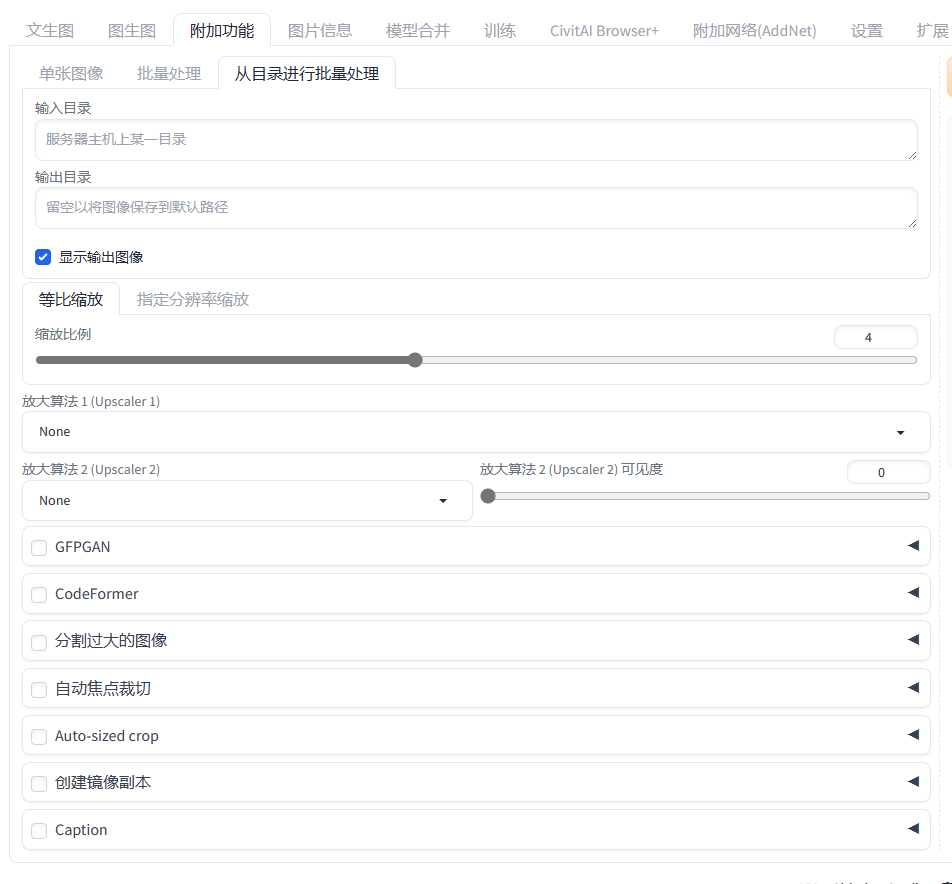

- 单张图像：单张图进行处理
- 批量处理：多张图上传
- 从目录进行批量处理：从文件夹下面开始处理

## 10.1 参数

### 等比例缩放

按照原图的比例进行缩放，如果设置为2，就会放大原来的1倍

### 指定分辨率缩放

设置图片的指定分辨率，**如果图片跟指定分辨不符合一定要勾选选 裁剪以适应宽高化**

### 放大算法（Upscaler 1）

**无脑使用** **[4x-UltraSharp](https://mega.nz/folder/qZRBmaIY#nIG8KyWFcGNTuMX_XNbJ_g)** 插件下载到 **models\ESRGAN** 路径下面

**如果是动漫无脑使用** **R-ESRGAN 4x+ Anime6B** 进行放大

### 放大算法（Upscaler 2）

本来的目的是为了权衡图片的材质避免过度磨皮，有了 **4x-UltraSharp** 后就不需要了

### GFPFAM

**用于修复模糊的图片，面部修复（只能将面部进行修复）**

### CodeFormer

也是用于修复模糊图片的面部，可以跟 **GFPFAM一起使用**，当两个都调为1的时候效果最好

### stable-diffusion-webui-rembg

抠图插件，抠图算法

- u2net_human-seg：做人类抠图时效果最好
- u2net_cloth_seg：模特换装比较好用，会扣取人物的衣服和裤子等
- isnet_anime：给动漫抠图的时候效果最好

参数

- return mask：返回一个蒙版
- alpha matting：
    - Erode Size：主体边缘像素预留区域（侵蚀量），保留主体的边缘留下的一下像素，类似边缘模糊，越高效果越不好但是可以去黑边
    - Foreground threshold：前景阈值
    - Backgorund threshold：背景阈值

推荐预设值

- u2net：
    - Erode Size：6
    - Foreground：143
    - Background：187

## 10.2 图片信息

右边会出现一些图片的一些提示词和反向提示

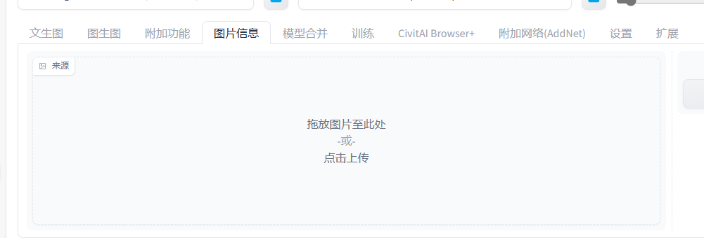

# 8. lora训练

## 8.1 如何选取最优素材

- 不同面部表情
- 构图，各种姿势的图片（侧面、背面、正面、仰视、俯视等等）
- 人物特征（不同颜色的衣服、不同场景）
- 灯光
- 图片质量（不要出现画质不好的图片）
- 以上满足越多越好

## 8.2 素材来源

- 真人写实：建议自己的照片先练手（本地部署不会出现泄露）
- 动漫风格：影视截图
- 模型生成的图片，使用模型生成的图片来训练模型
- 人物、动漫、面部等：只要需要15张图片
- 复杂的场景需要越多越好

## 8.3 推荐步数（建议）

- 每张图片需要训练的次数越多细节越明显（建议最少10步，但不要过高）
- 二次元：10 - 16步
- 写实人物：17 - 35步
- 场景：50步起
- lora训练总部署：1500 - 6000步
- checkpoint训练总步数：30000步起

## 8.4 软件

- kohya_ss：训练页面 [bmaltais/kohya_ss (github.com)](https://github.com/bmaltais/kohya_ss)
- Additional Networks插件
- CUDNN训练加速器（30系以下忽略）
- 参数预设

安装 **kohya_ss** 安装时需要使用 **powershell** 管理员运行执行

> Set-ExecutionPolicy Unrestricted

克隆仓库，直接执行 **setup.bat**

安装**SD** 插件后就有

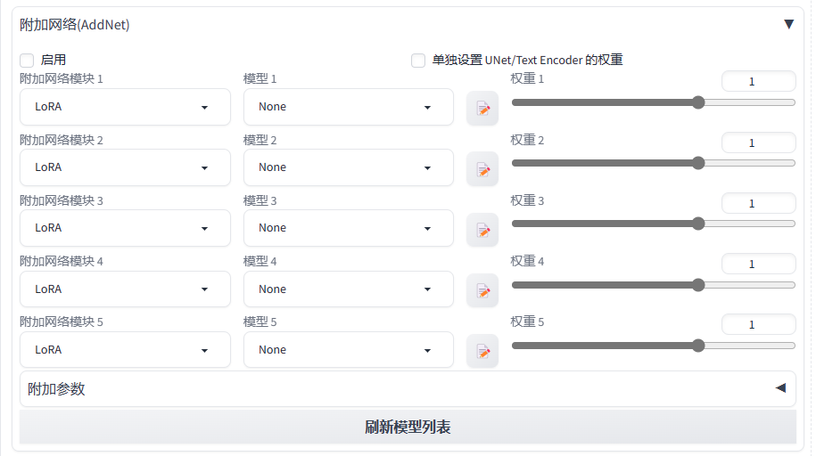

## 8.5 Tag标记

### 1. 图片Tag自动标记

新版移到了附加功能当中，从目录进行批量处理

- 输入目录：图片的路径
- 输出目录：定义模型的地址
    - image：图片的地址，图片的文件名称格式必须是 **数字_你想起的名称**，例如：30_xwz，数字代表文件夹内每张图片需要训练的步数，lora建议 **1500 -
      6000张**；
    - log：运行的日志
    - model：模型的保存地方

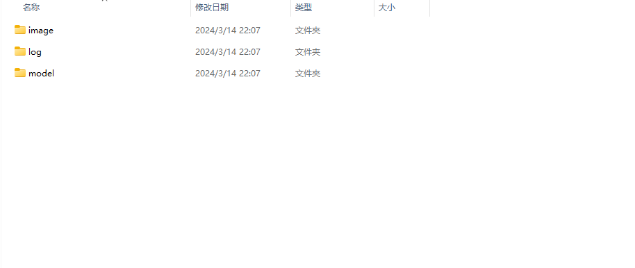

身体每张训练100步，头部训练100步，根据图片来定义

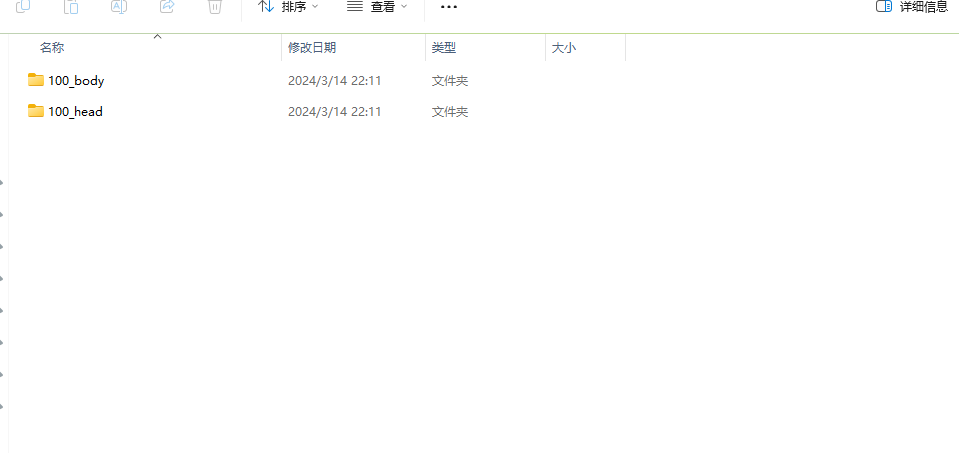

然后将输出的地址粘贴到输出栏中

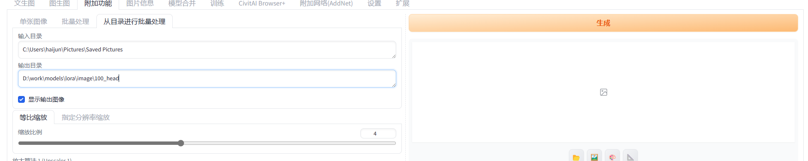

### 2. Bucket自动裁剪

宽高不需要指定（保持默认的宽高），让AI自动来适应，一般使用 **kohyass** 使用Bucket


### 3. 创建镜像副本

就是水平翻转，多给你复制一张另一面的图片，一般用在图片比较少的时候

### 4. Caption

- Deepbooru：使用单词的形式做反推
- BLIP：使用句子的形式做反推（建议使用）

### 5. Tag

执行完之后就会在对应的路径下面生成两个文件，一个图片，另一个是跟图片相同的描述值，里面可以自己进行修改

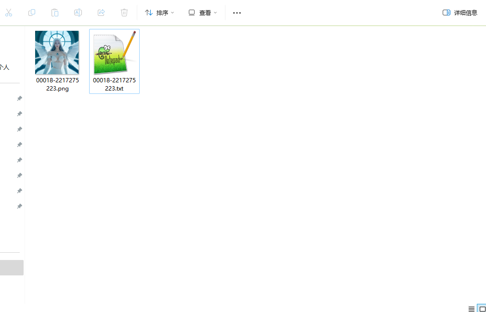

## 8.6 kohya_ss

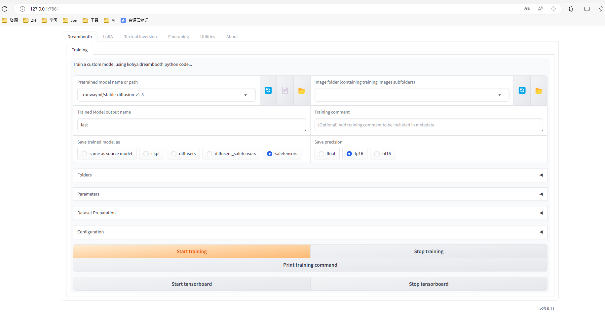

- Dreambooth：训练大模型

- Lora：训练lora模型

- Textual Inversion：嵌入式模型

- Finetuning：模型微调的页面

- Utilities：给模型打tag

### 1. 参数说明

Configuration：预设值，根据显存进行调整的，可以直接下载


