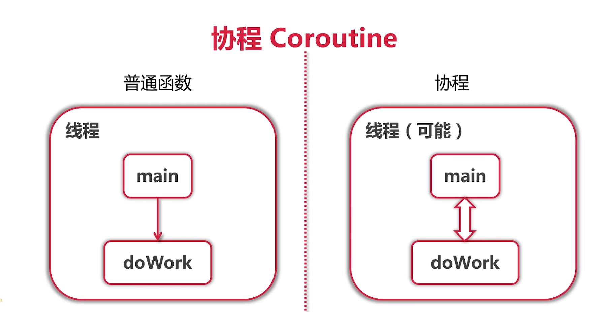
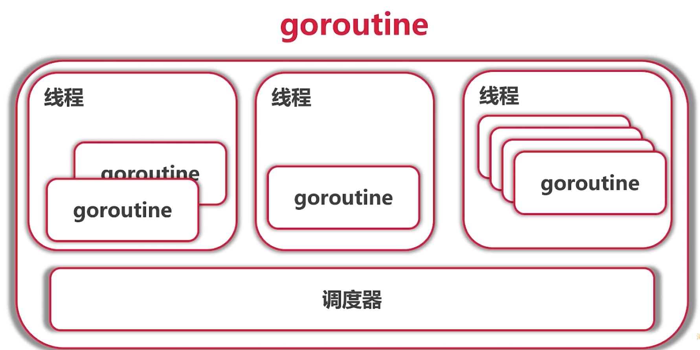
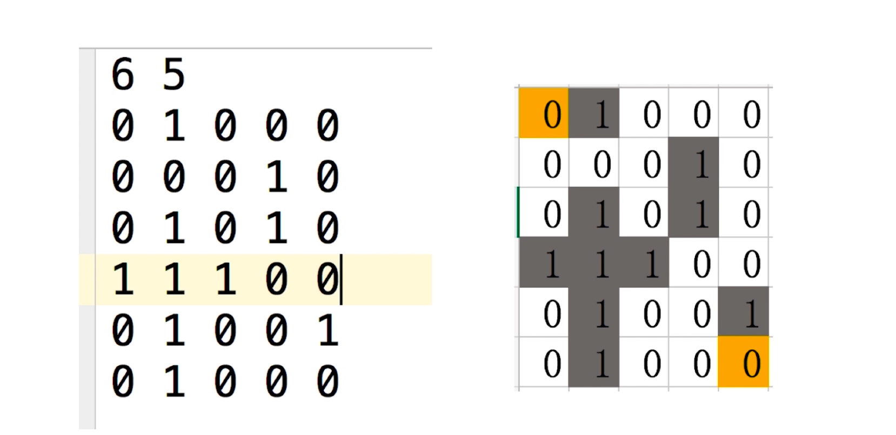
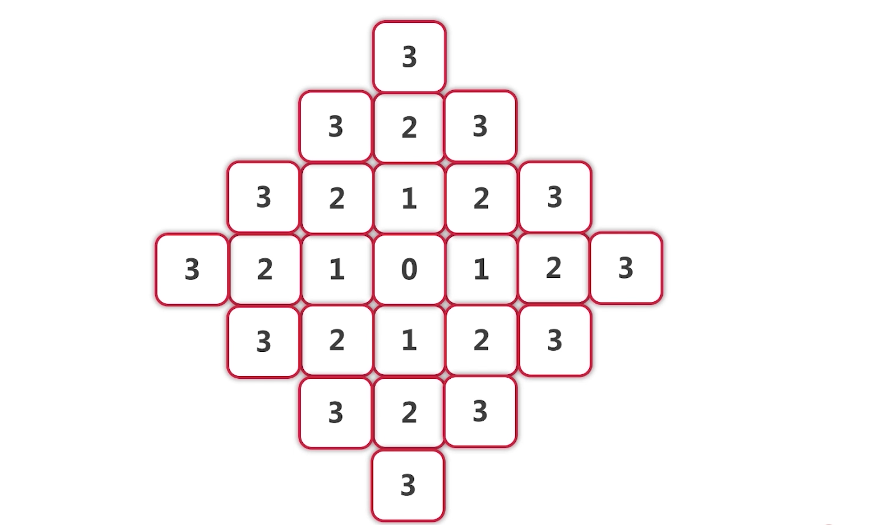
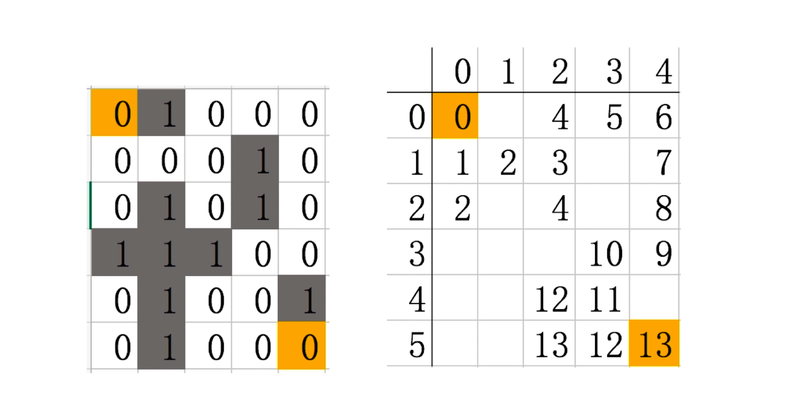
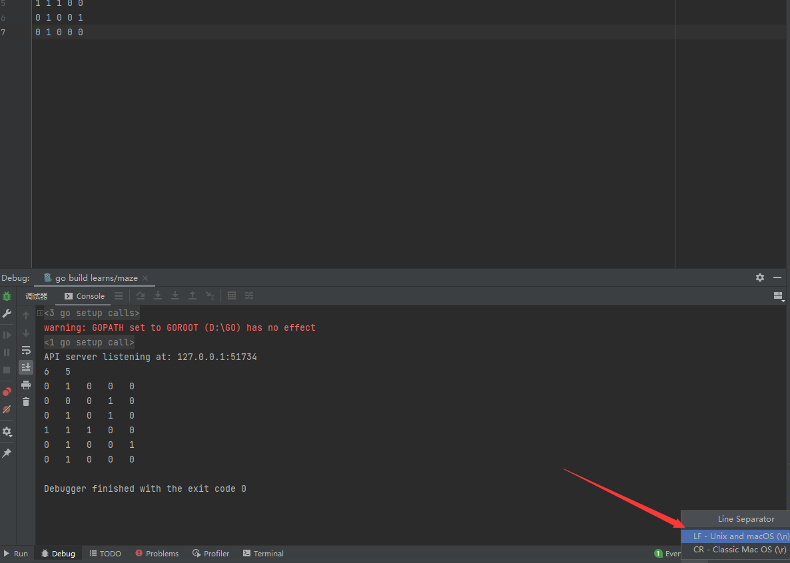

# 1. goroutine

## 1.1 定义

```go
func main() {
	for i := 0; i < 10; i++ {
		//开启并发打印
		go func(i int) {
			fmt.Printf("hello goroutine : %d \n", i)
		}(i)
	}
	time.Sleep(time.Millisecond)
}
```

go语言是采用一种叫 **协程（Coroutine）**

- 轻量级 **“线程”**
- **非抢占式** 多任务处理，由协程主动交出CPU控制权
  - 线程是由CPU来决定是否移交控制权，做到一半可能线程就会进行切换
  - 协程则是由内部进行决定是否要移交CPU的控制权
- 编译器/解释器/虚拟机层面的多任务
- 多个协程可以在一个或者多个线程上运行 （由调度器来决定）


以下例子，通过 **runtime.Gosched()** 可以手动交出控制权，如果不交出控制权；还有如果在 gorotine 里面使用外部函数，如果不传入的话，就是一个闭包的变量，会导致数据冲突，就是通过不同的协程写入数据。检查数据是否有冲突可以通过以下语句进行检测

> go run -race 

```go
func main() {
	var a [10]int
	for i := 0; i < 10; i++ {
		//如果这里不将i传入参数直接引用外部的参数会出现：数据冲突（race condition）
		go func(i int) {
			// 打印语句会进行协程的调度，会交出控制权：fmt.Printf("hello goroutine : %d \n", i)
			a[i]++
			//通过 Gosched() 可以手动交出协程的控制权；如果不写这个语句协程就不会交出控制权进行调度执行，就会一直卡死在这里
			runtime.Gosched()
		}(i)
	}
	time.Sleep(time.Millisecond)
	fmt.Println(a)
}
```

普通函数：在一个线程里面执行，调用完后释放资源，单向调用

协程：双向流通



但go的程序启动时，一个线程里面可能有多个 **goroutine** 执行，具体在哪个线程执行，由调度器决定；传统意义上的 routine 需要显示的写出释放控制权，而 goroutine 不需要写出来，调度器会进行切换



## 1.2 goroutine切换点

只是参考，不能保证肯定会切换

- I/O, select：打印数据的时候
- channel
- 等待锁
- 函数调用（有时）
- runtime.Gosched()

# 2. channel

协程与协程之间的双向通信

## 2.1 语法

```go
func chanDemo() {
	//var c chan int //为 nil 的chan不能使用
	c := make(chan int)
    go func() {
		for  {
			n := <- c
			fmt.Println(n)
		}
	}()
    c <- 1 //向 c 里面发送数据（在发送时需要 goroutine 来进行接收，否则就会死锁）
    c <- 2
}
```

## 2.2 channel作为参数

```go
func worker(i int, c chan int) {
	for  {
		fmt.Printf("Worker :%d, accpet: %c \n", i, <-c)
	}
}

func chanDemo() {
	var channels [10]chan int

	for i := 0; i < 10; i++ {
		channels[i] = make(chan int)
		go worker(i, channels[i])
	}

	for i := 0; i < 10; i++ {
		channels[i] <- 'a' + i
	}

	for i := 0; i < 10; i++ {
		channels[i] <- 'A' + i
	}

}
```

## 2.3 channel作为返回值

>返回值定义：chan<- int :代表只能发数据； <-chan int:代表只能收数据

```go
// chan<- int :代表只能发数据； <-chan int:代表只能收数据
func worker(i int) chan int {
	c := make(chan int)
	go func() {
		for  {
			fmt.Printf("Worker :%d, accpet: %c \n", i, <-c)
		}
	}()
	return c
}

func chanDemo() {
	var channels [10]chan int

	for i := 0; i < 10; i++ {
		channels[i] = worker(i) 
	}

	for i := 0; i < 10; i++ {
		channels[i] <- 'a' + i
	}

	for i := 0; i < 10; i++ {
		channels[i] <- 'A' + i
	}

}
```

创建时可以指定 **channel** 的大小，**make(chan int, 3)** 如果数据超过3个就会死锁，对提升性能有好处。

## 2.4 chan关闭

如果不 **close** 那么会一直接收下去，可以是否 if、range 进行判断是否 close

**不要通过共享内存来进行通信，要通过通信来共享内存**

```go
func chanClose() {
	//创建一个缓冲区
	c := make(chan int, 3)
	c <- 1
	c <- 2
	c <- 3
	//方法一：
	go func() {
		for  {
			//如果没有接收到数据就直接返回
			if i, ok := <-c; !ok {
				fmt.Println(" close channel.....")
				break
			} else {
				//死循环读取，如果外部 chan 已经关闭了，这里会一直接收具体数据的默认值
				fmt.Printf("%d\n", i)
			}
		}
	}()
    //方法二：
    go func() {
		for n := range c {
			//如果没有接收到数据就直接返回
			fmt.Printf("%d\n", n)
		}
	}()

	//close关闭 channel
	close(c)
}
```

## 2.5 等待goroutine

如何等待所有的 **goroutine** 执行完之后才退出程序？

方式一：

```go
func ChanDemo() {
	workers := make([]worker, 10)

	for i, _ := range workers {
		workers[i] = createWorker(i)
	}

	for i, worker := range workers{
		worker.in <- 'a' + i
	}

	for i, worker := range workers{
		worker.in <- 'A' + i
	}

	//这种方式可以接收消费者传入的数据，如果消费者传入的数据是同步的话，这里也会出现死锁
	for _, worker := range workers {
		<- worker.done
		<- worker.done
	}

}
//定义一个worker的结构用来存放 chan数据
type worker struct {
	done chan bool
	in chan int
}

func createWorker(id int) worker  {
	w := worker{
		done: make(chan bool),
		in: make(chan int),
	}
	go doWorker(id, w.in, w.done)
	return w
}

func doWorker(id int, in chan int, done chan bool)  {
	for i := range in {
		fmt.Printf("Worker:%d, accept:%c \n", id, i)
		go func() {
			//异步发送，否则会出现死锁，因为发送会加锁
			done <- true
		}()
	}
}
```

方式二：

使用 **sync.WaitGroup** 等待所有的 **gorounte** 执行结束

```go
//定义一个worker的结构用来存放 chan数据
type done2Worker struct {
	in chan int
	//使用指针传递
	wg *sync.WaitGroup
}

func create2Worker(id int, group *sync.WaitGroup) done2Worker  {
	w := done2Worker{
		wg: group,
		in: make(chan int),
	}
	go do2Worker(id, w)
	return w
}

func do2Worker(id int, worker2 done2Worker)  {
	for i := range worker2.in {
		fmt.Printf("Worker:%d, accept:%c \n", id, i)
		//执行完成
		worker2.wg.Done()
	}
}

func Chan2Demo() {
	var wg sync.WaitGroup
	workers := make([]done2Worker, 10)
	for i, _ := range workers {
		workers[i] = create2Worker(i, &wg)
	}
	wg.Add(20)
	for i, worker := range workers {
		worker.in <- 'a' + i
	}

	for i, worker := range workers {
		worker.in <- 'A' + i
	}
	wg.Wait()

}
```

# 3. select

**select** 可以对 channel 进行非阻塞式调用，谁先来执行谁，在 **select** 中也可以使用 nil 进行调度

```go
func generator() chan int {
	out := make(chan int)
	go func() {
		i := 0
		for {
			//休眠随机数
			time.Sleep(time.Duration(rand.Intn(1500)) * time.Millisecond)
			out <- i
			i++
		}
	}()
	return out
}

func main() {
	//非阻塞式获取数据，谁先出数据就执行哪一段逻辑
	var c1, c2 = generator(), generator()
	// 10秒钟后发送一次数据
	after := time.After(time.Second * 10)
	//每秒钟都会写一次数据
	tick := time.Tick(time.Second)
	//死循环获取channel中的数据
	for  {
		select {
		//会通过select关键字进行调用，谁先来数据，就执行谁
		case n := <-c1:
			fmt.Println("Received from c1:", n)
		case n := <-c2:
			fmt.Println("Received from c2:", n)
		case <-after:
			fmt.Println("ten second after......")
		case <-tick:
			fmt.Println("tick task exec .....")
		default:
			fmt.Println("No value received")
		}
	}

}
```

# 4. 传统同步机制

**CSP** : 模型下面尽量少用传统的同步方式，传统的方式使用共享变量进行使用

- WaitGroup
- Mutex

```go
type atomicInt struct {
	a int
    //定义互斥量进行同步
	lock sync.Mutex
}

func (a *atomicInt) add()  {
	a.lock.Lock()
	defer a.lock.Unlock()
	a.a++
}

func main() {
	a := atomicInt{
		a: 0,
	}
	a.add()
	go a.add()
	time.Sleep(time.Millisecond)
	fmt.Println("value : ", a.a)
}
```

- Cond

# 5. 并发模式

## 5.1 生成器

```go
//传入多个chan，返回一个只能输出的chan
func fanIn(chs...chan string) <-chan string {
	//创建管道
	c := make(chan string)
    //这里循环读取 chs 管道传入的数据
	for _ , ch := range chs {
		go func(in chan string) {
			for  {
				//循环从chCopy里面读取数据后传入到返回出去的chan
                //这里不能直接使用 ch ，因为该变量是一个闭包，后续遍历的管道会将其覆盖
				c <- <-in
			}
		}(ch)
	}
	return c
}

//创建一个channel，循环的发送数据
func msgGen(serviceName string) chan string {
	ch := make(chan string)
	go func() {
		for  {
			ch<- fmt.Sprintf("hello：%s", serviceName)
		}
	}()
	return ch
}


func main() {
	s1 := msgGen("service1")
	s2 := msgGen("service2")
	s3 := msgGen("service3")
	//可以拿到返回出来的 channel 跟服务继续做交互
	m := fanIn(s1, s2, s3)
	for  {
		fmt.Println(<-m)
	}

}
```

## 5.2 定义接口

```go
// ChannelCreateFunc 创建接口，需要传入管道，以及参数
type ChannelCreateFunc interface {
	// Create 创建函数传入一个任何类型的管道，后面参数选择性传入
	Create(ch <-chan any, V...any) (any, bool)
}

func Creator(c ChannelCreateFunc, ch <-chan any) {
	if r, ok := c.Create(ch, time.Duration(time.Second)); ok {
		fmt.Println(r)
	} else {
		fmt.Println("未接收到数据")
	}
}

func main() {
	s1 := msgGen("service1")
	m := fanIn(s1)
	Creator(timeout.TimeoutCreator{}, m)
	Creator(noblock.NotBlockCreator{}, m)
}
```

## 5.3 非阻塞管道

新建 noblock.go，定义下面这样的格式

```go
type NotBlockCreator struct {

}

func (n NotBlockCreator) Create(ch <-chan any, V...any) (any, bool) {
	select {
	case m := <-ch:
		return m, true
	default:
		return "", false
	}
}
```

## 5.4 超时管道

新建 timeout.go

```go
type TimeoutCreator struct {

}

func (t TimeoutCreator) Create(ch <-chan any, V...any) (any, bool) {
	size := len(V)
	if size == 1 {
		var timeoutValue = V[0]
		switch v := timeoutValue.(type) {
		case time.Duration:
			for  {
				select {
				case m := <-ch:
					return m, true
				case <-time.After(v):
					fmt.Println("数据超时接收，直接返回false")
					return "", false
				}
			}
		}
	}
	return "", false
}
```


# 6. 广度优先算法（迷宫）



每次探索都是一层一层的向外进行探索，如果起始为0，那么先将周边的 1 进行探索完毕，探索1时会将1的点位先存入到队列中，等后续所有的1都探索完成之后，再取出1的点位进行1周边的探索



通过上面的这种点位算法，就可以将迷宫的路画出来



## 6.1 代码实现

创建文本，这里需要注意，idea创建文件分隔符编码需要设置以下，否则后续读取文件时会有问题

```text
6 5
0 1 0 0 0
0 0 0 1 0
0 1 0 1 0
1 1 1 0 0
0 1 0 0 1
0 1 0 0 0
```




读取文件成二维数组

```go
// Fscanf函数在读取文件时，遇到\r为默认替换为0，读取\n结束，如果编码不对，这里读取就会出问题
func readMaze(path string) [][]int {
	file, err := os.Open(path)
	if err != nil {
		panic(err)
	}
	var row, col int
	//这里需要取地址，函数里面会更改row和col的值
	fmt.Fscanf(file, "%d %d", &row, &col)
	fmt.Printf("%d\t%d\n", row, col)
	//创建一个二位数组，一共有多少行
	maze := make([][]int, row)
	for i := range maze {
		//创建列
		maze[i] = make([]int, col)
		for j := range maze[i] {
			fmt.Fscanf(file, "%d", &maze[i][j])
		}
	}
	return maze

}

func main() {
	//读取迷宫文件
	maze := readMaze("maze/maze.in")
	for _, row := range maze {
		for _, col := range row {
			fmt.Printf("%d\t", col)
		}
		fmt.Println()
	}
}
```


```go
//点位的结构体
type point struct {
	i, j int
}

//定义需要探索的方向
var dirs = [4]point {
	//当前位置-1，就是向上
	{-1, 0},
	//左边的点位
	{0, -1},
	//向下的点位
	{1, 0},
	//向右的点位
	{0, 1},
}

//将两个点位相加，就可以获取到下一个点位
func (p point) add(r point) point {
	return point{p.i + r.i, p.j + r.j}
}

func (p point) at(grid [][]int) (int, bool) {
	//首先判断点位是否越界了，例如传入的点位 (-1,0)或者(1, -1)
	if p.i < 0 || p.i >= len(grid) {
		return 0, false
	}
	//判断j列是否越界了
	if p.j < 0 || p.j >= len(grid[p.i]) {
		return 0, false
	}
	//返回数据
	return grid[p.i][p.j], true
}

// walk 传入迷宫，指定迷宫开始的点位，以及出口的点位
func walk(maze [][]int, start, end point) [][]int  {
	//创建走过的步
	steps := make([][]int, len(maze))
	for i := range steps {
		steps[i] = make([]int, len(maze[i]))
	}

	//创建需要探索的队列，初始的点位(0,0)
	Q := []point{start}
	for len(Q) > 0 {
		cur := Q[0]
		//截取出队列中的头部
		Q = Q[1:]
		//判断如果点位等于出口的点位，那么直接退出
		if cur == end {
			break
		}

		//dirs为点位周边的四个方向，我这里采用的是 上、左、下、右 的方向进行探索
		for _, dir := range dirs {
			//将当前点位跟四个方向相加，例如 (0,0) 向上的方向就是(-1,0)，将i的值进行减1
			next := cur.add(dir)
			//判断向上的点位不能超出迷宫的界限，并且返回在迷宫中的值，因为如果返回的值为1，就证明是墙
			val, ok := next.at(maze)
			if !ok || val == 1 {
				continue
			}

			//不等0就证明是墙
			val, ok = next.at(steps)
			if !ok || val != 0 {
				continue
			}

			//如果是起点，就跳过
			if next == start {
				continue
			}

			//获取到当前步数的值
			curSteps, _ := cur.at(steps)
			//将走过的点位追加到切片中
			steps[next.i][next.j] = curSteps + 1
			//继续将下一个点位添加到需要探索的队列当中
			Q = append(Q, next)
		}
	}

	return steps
}
```

