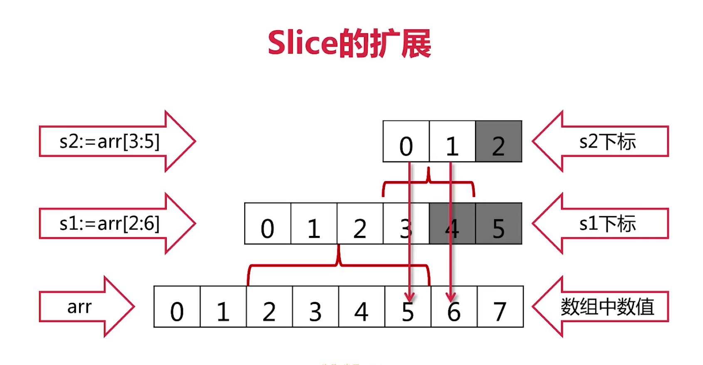
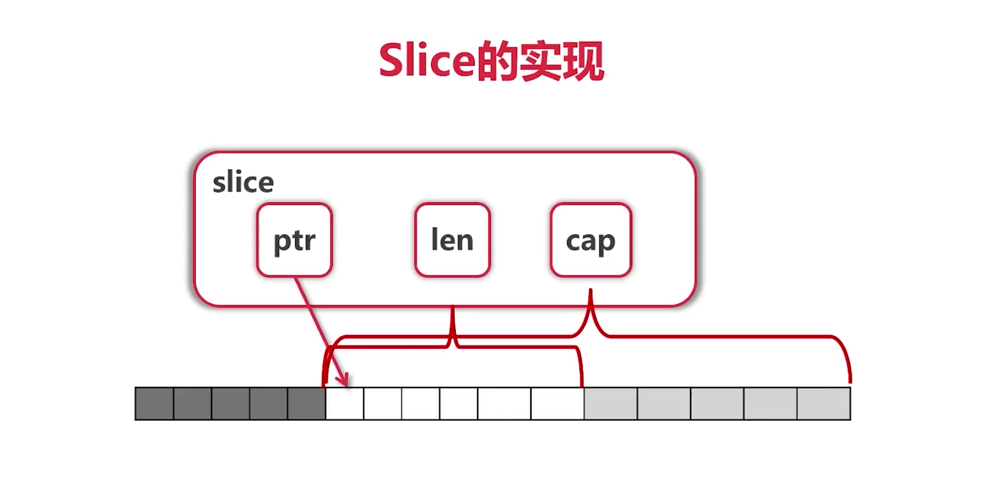
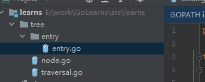
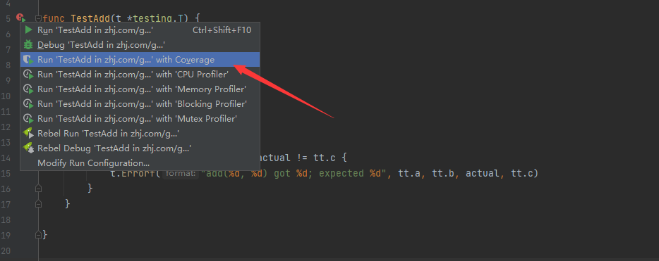
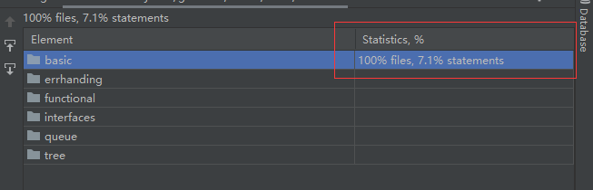
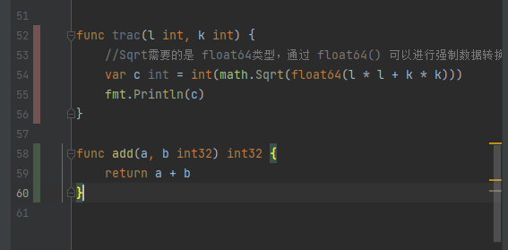
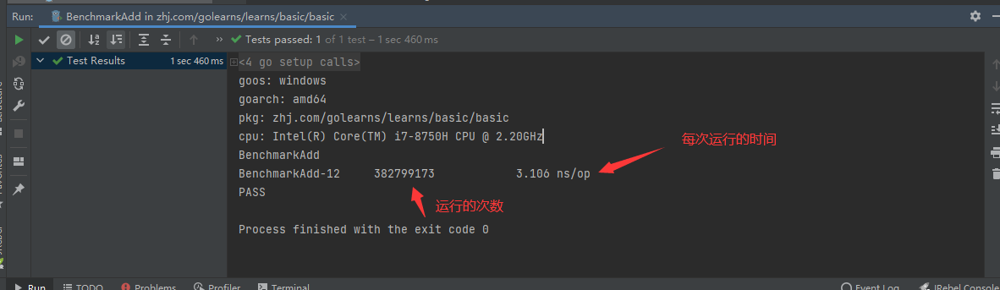
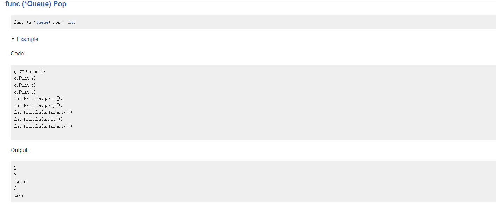

# 1. 基本数据类型

- bool
- string
- int、int8、int16、int32、int64
- uint、uint8、uint16、uini16、uint32、uint64、uintptr
  - 其中int8、int16、int32、int64 大小不一的有符号和无符号整数类型
  - int和uint表示特定CPU平台的字长，其中 **int表示有符号整数**，**uint表示无符号整数**
  - uintptr表示无符号整数类型，没有指定具体的bit大小，但是可以容纳指针。一般在底层编程时才需要，特别是在 GO语言和C语言函数库或者操作系统接口相交互的地方 **（指针）**
- byte  : uint8的别名
- rune : int32的别名，代表一个Unicode码 **（char）类型**
- float32、float64
- complex64、complex128  数学中的复数

 Go语言中有符号整数采用 2 的补码形式表示，也就是最高 bit 位用来表示符号位，一个 n-bit 的有符号数的取值范围是从 -2(n-1) 到 2(n-1)-1。无符号整数的所有 bit 位都用于表示非负数，取值范围是 0 到 2n-1。例如，int8 类型整数的取值范围是从 -128 到 127，而 uint8 类型整数的取值范围是从 0 到 255。 

## 1.1 变量申明

变量声明时，默认值 int = 0，float = 0.0，bool = false，string = 空字符串，指针为nil等，所有的内存在go中都经过初始化，命名遵循驼峰命名法

> var 变量名 变量类型  //单个命名
>
> var ( 变量名 变量类型 )   //批量命名
>
> 名称 := 表达式  //简短格式命名

```go
//单个命名
var numShips bool
//批量命名
var (
    a int
    b string
    c []float32
    d func() bool
    e struct{
        x int
    }
)
//简短模式
i, j := 0, 1
```

注意简单模式的缺点：

- 定义变量，同时显示初始化
- 不能提供数据类型
- 只能在函数内部使用

## 1.2 变量初始化

> var 变量名 类型 = 表达式

```go
var hp int = 100 //因为右边的表达式能够确定左边的类型，所以可以编译器推导后可以确定
var hp = 100

//下面是编译器根据右值推导后的初始化例子
var attack = 40
var defence = 20
var damageRate float32 = 0.17 //由于使用了小数，编译器会尽量提高精度避免精度损失，如果这里不指定，编译器会指定为float64，我们不需要这么长的精度，所以强制指定为32
var damage = float32(attack-defence) * damageRate
```


注意：简短写法，左边变量至少有一个是新出现的变量名称，即便其他变量可以能重复了，都不会报错

```go
//简短写法
var hp int // 声明 hp 变量
hp := 10 // 再次声明并赋值，就会报错 no new variables on left side of :=
conn, err := net.Dial("tcp","127.0.0.1:8080") // Dial函数会返回两个对象，这里就可以使用简短写法，如果使用命名的方式，就是下面的格式了
var conn net.Conn
var err error
conn, err = net.Dial("tcp", "127.0.0.1:8080")
```

## 1.3 变量交换

 编程最简单的算法之一，莫过于变量交换。交换变量的常见算法需要一个中间变量进行变量的临时保存。用传统方法编写变量交换代码如下： 

```go
func swap() {
	//变量交换
	var a = 100
	var b = 200
	var t int
	t = a
	a = b
	b = t
	fmt.Println(a, b)
}
```

 在计算机刚发明时，内存非常“精贵”。这种变量交换往往是非常奢侈的。于是计算机“大牛”发明了一些算法来避免使用中间变量： 

```go
var a int = 100
var b int = 200
a = a ^ b
b = b ^ a
a = a ^ b
fmt.Println(a, b)
```

 到了Go语言时，内存不再是紧缺资源，而且写法可以更简单。使用 Go 的“多重赋值”特性，可以轻松完成变量交换的任务：  多重赋值时，变量的左值和右值按从左到右的顺序赋值。 

```go
var a int = 100
var b int = 200
b, a = a, b
fmt.Println(a, b)
```

 多重赋值在Go语言的错误处理和函数返回值中会大量地使用。例如使用Go语言进行排序时就需要使用交换，代码如下： 

```go
type IntSlice []int
func (p IntSlice) Len() int           { return len(p) }
func (p IntSlice) Less(i, j int) bool { return p[i] < p[j] }
func (p IntSlice) Swap(i, j int)      { p[i], p[j] = p[j], p[i] }
```

## 1.4 匿名变量

匿名变量的特点：**_**  下划线来作为标识符，匿名变量不占用内存，不会分配内存空间

```go
func GetData() (int, int) {
    return 100, 200
}
func main(){
    a, _ := GetData()
    _, b := GetData()
    fmt.Println(a, b)
}
```

## 1.5 变量作用域

 Go语言会在编译时检查每个变量是否使用过，一旦出现未使用的变量，就会报编译错误 

- 函数内定义的为局部变量
- 函数外定义的为全局变量：在一个源文件中定义，就可以在所有的源文件中使用，不包含这个变量的源文件需要使用 import 关键字进行导入，**如果想在外部包中使用全局变量，首字母必须大写**
- 函数定义中的变量称为形式参数

```go
func varF() {
	var a = 3
	var b = 4
	c := a + b
	fmt.Printf("a = %d, b = %d, c = %d", a, b, c)
}
```

```go
import (
	"fmt"
)

var c int

func main() {
	var a, b int
	a = 3
	b = 4
	c = a + b
	fmt.Printf("a = %d, b = %d, c = %d", a, b, c)
}
```

```go
// 这里的 a，b就叫做形式参数
func sum(a, b int) int {
    fmt.Printf("sum() 函数中 a = %d\n", a)
    fmt.Printf("sum() 函数中 b = %d\n", b)
    num := a + b
    return num
}
```

## 1.6 浮点数

 一个 float32 类型的浮点数可以提供大约 6 个十进制数的精度，而 float64 则可以提供约 15 个十进制数的精度，通常应该优先使用 float64 类型，因为 float32 类型的累计计算误差很容易扩散，并且 float32 能精确表示的正整数并不是很大。 

 浮点数在声明的时候可以只写整数部分或者小数部分，像下面这样： 

```go
const e = .71828 // 0.71828
const f = 1.     // 1
```

 很小或很大的数最好用科学计数法书写，通过 e 或 E 来指定指数部分： 

```go
const Avogadro = 6.02214129e23  // 阿伏伽德罗常数
const Planck   = 6.62606957e-34 // 普朗克常数
```

 用 Printf 函数打印浮点数时可以使用“%f”来控制保留几位小数 

```go
func main() {
    fmt.Printf("%f\n", math.Pi)
    fmt.Printf("%.2f\n", math.Pi)
}
```

## 1.7 语言复数

 在计算机中，复数是由两个浮点数表示的，其中一个表示实部（real），一个表示虚部（imag） 

 Go语言中复数的类型有两种，分别是 complex128（64 位实数和虚数）和 complex64（32 位实数和虚数），其中 complex128 为复数的默认类型。 

```go
var x complex128 = complex(1, 2) // 1+2i
var y complex128 = complex(3, 4) // 3+4i
fmt.Println(x*y)                 // "(-5+10i)"
fmt.Println(real(x*y))           // "-5"
fmt.Println(imag(x*y))           // "10"
```

 Go语言内置的 math/cmplx 包中提供了很多操作复数的公共方法，实际操作中建议大家使用复数默认的 complex128 类型，因为这些内置的包中都使用 complex128 类型作为参数。 

## 1.8 字符串

string在go的底层使用 byte数组实现，中文字符在 unicode 编码中占 3个字节，utf-8编码中占3-4个字节，golang默认使用utf-8进行编码。byte用于处理  ASCII  码的范围，rune可以输出UTF-8编码的范围

rune类型一般用来区字符串和整数值的，用于处理 unicode或utf-8字符，rune等同于int32，占4个字节；在go中一般代表一个 UTF-8 字符

**编码：https://www.liaoxuefeng.com/wiki/1016959663602400/1017075323632896**

```go
func main() {
	s := "Yes我爱祖国!"
	fmt.Printf("%x\n", []byte(s))
	// utf-8编码中，一个中文字符串占三个字节
	for _, ch := range []byte(s) {
		fmt.Printf("%X ", ch)
	}
	fmt.Println()
	//可以看到每个字符的分布情况，数据打印出来的会是一个unicode编码
	for i, ch := range s {
		fmt.Printf("(%d, %X)", i, ch)
	}
	fmt.Println()
	//可以计算出字符串中 rune的个数
	fmt.Println("Rune count:", utf8.RuneCountInString(s))
	//数组的转换，将字节数组转换为 rune类型
	bytes := []byte(s)
	for len(bytes) > 0{
		//将数组进行解码成 rune类型，返回字符以及字符的长度
		ch , size := utf8.DecodeRune(bytes)
		bytes = bytes[size:]
		fmt.Printf("%c ", ch)
	}
	fmt.Println()
}
```


# 2. 强制类型转换

在 go 中所有数据都需要对应上，如果不等价，那么需要通过 float64() 构造函数的方式进行强制转换

```go
func trac(l int, k int) {
	//Sqrt需要的是 float64类型，通过 float64() 可以进行强制数据转换
	var c int = int(math.Sqrt(float64(l * l + k * k)))
	fmt.Println(c)
}
```


# 3. 常量

> const 名称 = 数据
>
> const (名称 = 数据)

常量经过定义之后就不能再进行修改了

```go
const fileName = "abc.txt"
func consts() {
	const a, b = 1, "123"
	//常量经过定义就不能再修改了
	a = 2
	fmt.Println(a, b)
	fmt.Println(fileName)
}

```

## 3.1 枚举

```go
func enums() {
	const (
		java = iota  // iota表示这一组枚举使用自增方式进行 0,1,2,3
        _  //可以直接跳过 1 这个索引
		golang
		python
		c
	)
	fmt.Println(java, golang, python, c)
    const (
		b = 1 << (10 * iota)   //这里后续都会使用这个公式进行计算，打印出单位值
		kb
		mb
		gb
		tb
		pb
	)
    fmt.Println(b, kb, mb, gb, tb, pb)
}
```

# 4. 条件语句

## 4.1 if

```go
func main() {
	const filename = "abc.txt"
	//判断是否返回了 err 错误类型，不等于nil，如果等于nil直接打印错误信息，否则打印文件内容
	if contents, err := ioutil.ReadFile(filename) ; err != nil {
		fmt.Println(err)  //打印的数据：open abcd.txt: The system cannot find the file specified.
	} else {
		fmt.Printf("%s\n", contents) //打印数据
	}
}
```

## 4.2 switch

```go
// func定义 score为int类型的分数，op为抛出的异常信息，string代表函数的返回值
func switchDemo(score int) string {
	g := ""
	switch {
	case score < 0 || score > 100:
		panic(fmt.Sprintf("wrong score: %d", score)) // panic() 表示抛出异常
	case score < 60:
		g = "F"
		//自动break，不需要写多余的break
	case score < 80:
		g = "C"
	case score < 90:
		g = "B"
	case score < 100:
		g = "A"
	default:
		panic(fmt.Sprintf("wrong score: %d", score)) // panic() 表示抛出异常
	}
	return g
}
```

## 4.3 for

可以省略初始条件和递增条件，相当于 **while**，也可以省略初始条件

> for { } 这就是一个死循环

```go
//转换二进制
func convertToBin(n int) string  {
	result := ""
	for ; n > 0; n /= 2 {
		lsb := n % 2
		// strconv.Itoa() 转换字符串
		result = strconv.Itoa(lsb) + result
	}
	return result
}

//一行一行的读取文本文档中的数据
func printFile(filename string)  {
	//打开文件流
	file, err := os.Open(filename)
	if err != nil {
		 panic(err)
	}
	//开启一个扫描器，一行一行的读取数据
	scanner := bufio.NewScanner(file)
	//没有起始符以及截止符号跟while关键字类似，可以直接省略  for { } 什么都不加直接死循环
	for scanner.Scan() {
		fmt.Println(scanner.Text())
	}
}
```

## 4.5 要点回顾

- for\if 后面的条件没有括号
- if条件里也可以定义变量
- 没有while
- switch不需要break，也可以直接switch多个条件

# 5. 函数

## 5.1 函数定义

> func eval(参数名 类型) 返回类型 {  方法体 }

```go
//返回单个 int 类型数据
func eval(a int, b int, op string) (int, error) {
	switch op {
	case "+":
		return a + b
	case "-":
		return a - b
	case "*":
		return a * b
	case "/":
        //如果只需要一个参数就可以使用 _ 下划线
        q, _ := div(a, b)
		return q
	default:
		panic("unsupported operatir:" + op)
	}
}

// 13 / 3 = 4 并且余1，这里我们可以返回除数以及余数，可以返回多值
func div(a, b int) (int, int) {
	return a /b, a % b
}
// q, r := div(13,3) 就可以直接获取到对应的变量名称
func div(a, b int) (q, r int) {
	return a /b, a % b
}
//以下的方式也可以(只能用于很简单的函数体)
func div(a, b int) (q, r int) {
    q = a / b
    r = a % b
	return q, r
}
```

一般函数的执行都会返回两个值，一个处理后的数据，一个就是 **error** 值，用于判断执行的异常信息

```go
func main() {
	//可以判断返回的error是否为nil，然后根据返回的数据进行打印
	if result, error := eval(3, 4, "x"); error != nil {
		fmt.Println("Error", error)
	} else {
		fmt.Println(result)
	}
}

func eval(a int, b int, op string) (int, error) {
	switch op {
	case "+":
		return a + b, nil
	case "-":
		return a - b, nil
	case "*":
		return a * b, nil
	case "/":
		q, _ := div(a, b)
		return q, nil
	default:
		return 0, fmt.Errorf("unsupported operation: %s", op)
	}
}

// 13 / 3 = 4 并且余1，这里我们可以返回除数以及余数
func div(a, b int) (int, int) {
	return a /b, a % b
}
```

改造为函数式编程

```go
func main() {
	fmt.Println(apply(pow, 3, 4))
    //以下方式也可以
    fmt.Println(apply(func(a ,b int) int {
		return int(math.Pow(float64(a), float64(b)))
	}, 3, 4))
}
//第一个参数 是一个函数，a，b是数据
func apply(op func(int, int) int, a, b int) int {
	//通过反射获取到函数的指针
	p := reflect.ValueOf(op).Pointer()
	//获取到方法的名称
	opName := runtime.FuncForPC(p).Name()
	fmt.Println("Calling function %s with ars (%d, %d)", opName, a, b)
	return op(a, b)
}
func pow(a, b int) int {
	return int(math.Pow(float64(a), float64(b)))
}
```

## 5.2 可变参数列表

```go
func sum(numbers ...int) int {
	sum := 0
	for i := range numbers {
		sum += numbers[i]
	}
	return sum
}
```

## 5.3 函数变量

```go
func main() {
	arr := []int{2,4,6,8}
	//匿名函数的创建
	f := func(i []int) int {
		sum := 0
		for _ , v := range i {
			sum += v
		}
		return sum
	}
	fmt.Println("数据：", f(arr))

	//将函数作为参数传递
	f1(arr, func(i int) {
		fmt.Println(i)
	})
}
func f1(i []int, f func(int))  {
	for _, v := range i {
		f(v)
	}
}
```


# 6. 指针

## 6.1 值传递&引用传递

go语言中只有值传递一种方式

```go
func main() {
	var (
		a = 3
		b = 4
	)
	swap(a, b)
	fmt.Println(a, b)
	swapFoPoniter(&a, &b)
	fmt.Println(a, b)
}

//交换数据,如果使用这种方式就是采用值传递的方式
func swap(a, b int) {
	a, b = b, a
}
//将指针的数据进行交换
func swapFoPoniter(a, b *int) {
	*a, *b = *b, *a
}
//这种方式是最好的
func swapForReturn(a, b int) (int, int) {
	return b, a
}
```

# 7. 数组

数组采用的是值传递的方式，而且[5]int,[3]int还是不同的类型，进行数据传递会将 array 进行传递会进行拷贝

**go语言中一般不直接使用数组而使用切片**

```go
func main() {
	//定义长度为5的int数组
	var arr1 [5]int
	arr2 := [3]int{1,3,5}
	//采用编译器来确定数据的长度
	arr3 := [...]int{2,4,6,8,10}

	//定义二位数组，4个长度为5的数组
	var grid [4][5]int
	fmt.Println(arr1, arr2, arr3)
	fmt.Println(grid)

	//遍历数组
	for i := 0; i < len(arr3); i++ {
		fmt.Println(arr3[i])
	}
	//使用range关键字进行遍历 i为所有 v为值
	for i, v := range arr3 {
		fmt.Println(i, v)
	}
}

// 参数 arrays []int 代表切片， arrays [5]int才是真正的数组，而且[5]int,[3]int还是不同的类型
func count(arrays [5]int) int {
	count := 0
	for _,v := range arrays {
		count += v
	}
	return count
}

//可以采用指针传递
func countForPointer(arrays *[5]int) int {
	count := 0
	for _,v := range arrays {
		count += v
	}
	return count
}
```

# 8. 切片（Slice）

## 8.1 切片概念

- Slice本身是没有数据的，是对底层array的一个视图，由 **数组指针、长度、容量** 构成
- 每次进行扩容的 cap 是两倍进行扩容

```go
func main() {
	//slice不是值传递，因为slice内部里面是一个视图结构
	arr := [...]int{0,1,2,3,4,5,6,7,8}
	//会截取数组中索引 2 - 6 左闭右开
	fmt.Println("arr[2:6] = ", arr[2:6])
	fmt.Println("arr[:6] = ", arr[:6])
	fmt.Println("arr[2:] = ", arr[2:])
	fmt.Println("arr[:] = ", arr[:])
	//直接获取到切片进行更新
	s1 := arr[2:]
	updateSlice(s1)
	fmt.Println(s1)
	//reslice操作
	fmt.Printf("Reslice之前操作: %d\n", arr)
	s2 := arr[:5]
	fmt.Printf("Reslice[:5]之后操作: %d\n", s2)
	s2 = s2[2:]
	fmt.Printf("Reslice[2:]操作: %d\n", s2)
}

//修改slice
func updateSlice(s []int) {
	s[0] = 100
}
```

## 8.2 切片扩展

```go
func extending() {
	arr := [...]int{0,1,2,3,4,5,6,7}
	s1 := arr[2:6]  // [2,3,4,5]，切了之后原数组后面还有 6和7可以进行扩展
	s2 := s1[3:5]   // [5, 6] ，这里在s1的基础上进行切片，s1可以扩展的是6和7，所以s2也可以进行扩展 6和7
	s3 := s1[3:7]   // 抛错，因为超过了 s1可以进行扩展的范围
	//可以获取到底层数组的长度
	fmt.Printf("s1=%v，len(s1)=%d, cap(s1)=%d\n",
		s1, len(s1), cap(s1))
	fmt.Printf("s2=%v，len(s2)=%d, cap(s2)=%d\n",
		s2, len(s2), cap(s2))
	fmt.Println("s3=", s3)
}
```




实现：

其中有 prt（切片的数据）、len（切片数据的长度）、cap（被切的数组数组）

也就是说只要不超过 cap 的范围就可以进行扩展，cap的范围就是切片的范围 ；

**注意Slice只能向后扩展，不能向前**



## 8.3 切片添加

- 添加元素时如果超越了 cap 的范围，系统会从重新分配更大的底层数组
- 由于值传递的关系，必须接受append的返回值

```go
func extending() {
	arr := [...]int{0,1,2,3,4,5,6,7}
	s1 := arr[2:6]  // [2,3,4,5]，切了之后原数组后面还有 6和7可以进行扩展
	s2 := s1[3:5]   // [5, 6] ，这里在s1的基础上进行切片，s1可以扩展的是6和7，所以s2也可以进行扩展 6和7
	//可以获取到底层数组的长度
	fmt.Printf("s1=%v，len(s1)=%d, cap(s1)=%d\n",
		s1, len(s1), cap(s1))
	fmt.Printf("s2=%v，len(s2)=%d, cap(s2)=%d\n",
		s2, len(s2), cap(s2))
	s3 := append(s2, 10)  //现在进行 append会将原数组的最后一位进行替换
	s4 := append(s3, 11)  //这里再次进行添加，slice内部因为超过了数组的长度，就创建了一个新的数组进行存放
	s5 := append(s4, 12)
	fmt.Println("s3, s4, s5 = ", s3, s4, s5)
	fmt.Println("arr = ", arr)
}
```

## 8.4 切片常用操作

### 1. 创建

```go
//默认方式为0，每次添加如果cap的容量不够就会进行*2的扩容
	var s []int
	for i := 0; i < 100; i++ {
		printSlice(s)
		s = append(s, 2 * i + 1)
	}
	s1 := []int{2,4,6,8}
	printSlice(s1)
	s2 := make([]int, 16)
	printSlice(s2)
	s3 := make([]int, 10, 32)
	printSlice(s3)
```

### 2. 复制

```go
func main() {
	//复制
	s1 := []int {1,2,3,4}
	s2 := make([]int, 10)
	copy(s2, s1)
	fmt.Println(s1)
}
```

### 3. 删除

```go
func main() {
	s1 := []int {1,2,3,4}
	//删除 s1 中的 3  append()后面是一个可变参数，需要加上...
	s1 = append(s1[:2], s1[3:]...)
	fmt.Println(s1)
}
//剪掉首尾
func main() {
	s1 := []int {1,2,3,4}
	printSlice(s1)
	//删除s1的首尾
	head := s1[0]
	s1 = s1[1:]
	fmt.Printf("首部数据：%d,删除后的数据：%d\n", head, s1)
	printSlice(s1)
	tail := s1[len(s1) - 1]
	s1 = s1[:len(s1) - 1]
	fmt.Printf("尾部数据：%d,删除后的数据：%d\n", tail, s1)
	printSlice(s1)
}
func printSlice(s []int)  {
	fmt.Printf("v = %v, len() = %d, cap() = %d \n", s, len(s), cap(s))
}
```

# 9. Map

## 9.1 定义

- Map使用哈希表，必须可以比较相等
- 除了 Slice、map、function的内建类型都可以作为key
- Struct类型不包含上述字段，也可以作为key

```go
func main() {
	m := map[string]string {
		"name": "ccmouse",
	}
	//创建map，在go中 map为nil也可以参与运算
	m2 := make(map[string]int)
    var m3 map[string]int  // map is nil
	fmt.Println(m, m2, m3)
}
```

## 9.2 遍历

map是无序的是一个 **HashMap**，如果需要顺序的话需要手动进行排序，可以使用 **Slice**

```go
func main() {
	m := map[string]string {
		"name": "ccmouse",
	}
	for k,v := range m {
		fmt.Println(k, v)
	}
}
```

## 9.3 取值

```go
//取值
name := m["name"]
fmt.Println(name)
//判断值是否存在,如果查询了一个不存在的值，会返回初始值
name, ok := m["name"]
fmt.Println(name, ok)
//通过表达式进行计算
if name, ok := m["name"]; ok {
    fmt.Println(name, ok)
}
```

## 9.4 删除

```go
delete(m, "name")
name, ok = m["name"]
fmt.Println(ok)
```

## 9.5 例子

例：寻找最长不含有重复字符的子串

```go
func lengthOfNonRepeatingSubStr(s string) int {
	//创建一个 map
	lastOccurred := make(map[byte]int)
	start := 0
	maxLength := 0
	//将s字符串转换成 byte[]
	for i, ch := range []byte(s) {
		//读取map中的数据，如果读取的数据存在并且长度大于 start的长度
		if lastI, ok := lastOccurred[ch]; ok && lastI >= start {
			start = lastI + 1
		}
		if i - start + 1 > maxLength {
			maxLength = i - start + 1
		}
		lastOccurred[ch] = i
	}
	return maxLength
}
```

# 10. 结构

- go语言仅支持封装，不支持继承和多态
- go语言没有类，只有struct

## 10.1 结构的创建

局部变量是在堆上创建还是栈上？

由编译器决定，局部变量返回出去的指针地址，是否有人在使用，然后考虑分配的地址在栈空间还是堆空间中

**指针的数据也是直接使用 . 进行调用** ，编译器会根据方法调用的参数来确定是值传递还是指针传递

```go
type treeNode struct {
	value int
    //左右都是指针地址
	left, right *treeNode
}

//如果没有构造方法，可以通过一个工厂方法来创建
func createNode(value int) *treeNode {
    //这里返回的是一个局部变量的地址
	return &treeNode{value, nil, nil}
}

func main() {
	var root treeNode
	root = treeNode{value: 3}
	root.left = &treeNode{}
	root.right = &treeNode{5, nil, nil}
	root.right.right = new(treeNode)

	nodes := []treeNode {
		{value: 3},
		{},
		{6, nil, &root},
	}
	fmt.Println(nodes)
}
```

## 10.2 给结构定义方法

> func (node nodeTree) print() {	
>
> }

```go
//给结构定义方法，在方法名前面指定接收者,go中没有this指针说法
func (node treeNode) print()  {
    fnt.Println(node.value)
}

func main() {
    root.print()
}

//值传递的方式进行复制，原值不会进行改变
func (node treeNode) setValue(value int)  {
	node.value = value
}

//指针的方式进行赋值，原值会进行改变
func (node *treeNode) setValueForPointer(value int)  {
	node.value = value
}
```

**nil指针也可以调用方法**

## 10.3 值接收者 vs 指针接收者

- 要改变内容必须使用指针接收者
- 结构过大也考虑使用指针接收者
- 一致性：如有指针接收者，最好都是指针接收者

# 11. 封装

针对包来说，每个目录一个包，main包包含可执行方法，为结构定义的方法必须放在同一个包内，可以是不同的文件；通过名称来确定权限

- 名字一般使用Camelcase
- 首字母大写：public
- 首字母小写：private



entry

```go
package main

import "zhj.com/golearns/learns/tree"

func main() {
	var root = tree.Node{}
	root.Left = &tree.Node{}
	root.Right = &tree.Node{Value: 5}
	root.Right.Right = &tree.Node{Value: 6}
	root.Traverse()
}
```

node

```go
package tree
import "fmt"

type Node struct {
	Value int
	Left, Right *Node
}
//给结构定义方法，指定接收者
func (node Node) print()  {
	fmt.Println(node.Value)
}
func (node Node) SetValue(value int)  {
	node.Value = value
}
func (node *Node) SetValueForPointer(value int)  {
	node.Value = value
}
//如果没有构造方法，可以通过一个工厂方法来创建
func CreateNode(value int) *Node {
	return &Node{6, nil, nil}
}
```

traversal

```go
package tree
func (node *Node) Traverse() {
	if node == nil {
		return
	}
	node.Left.Traverse()
	node.print()
	node.Right.Traverse()
}
```

## 11.1 扩展已有类型

- 定义别名

```go
type myTreeNode struct {
	node *tree.Node
}

func (myNode *myTreeNode) postOrder() {
	if myNode == nil || myNode.node == nil {
		return
	}
	left := myTreeNode{myNode.node.Left}
	right := myTreeNode{myNode.node.Right}

	left.postOrder()
	right.postOrder()
	myNode.node.Print()
}

func main() {
	root := tree.Node{Value: 3}
	root.Left = &tree.Node{}
	root.Right = &tree.Node{Value: 5}
	root.Left.Right = &tree.Node{Value: 2}
	root.Right.Left = &tree.Node{Value: 4}

	myNode := myTreeNode{&root}
	myNode.postOrder()
}
```

- 使用组合

```go
type Queue []int

func (q *Queue) Push(v int) {
	*q = append(*q, v)
}

func (q *Queue) Pop() int {
	head := (*q)[0]
	*q = (*q)[1:]
	return head
}

func (q *Queue) IsEmpty() bool  {
	return len(*q) == 0
}
```

- 内嵌方式：直接省略变量名，相当于直接将 **Node** 里面的所有属性都拿出来复制给了 **myEmbeddingNode** 类似于继承

```go
type myEmbeddingNode struct {
	*tree.Node  //内嵌
}
```

# 12. 依赖管理

依赖管理的三个阶段

> GOPATH ---> GOVENDOR ---> GO MOD

## 12.1 GOPATH

一个环境变量，配置的路径，通过GOPATH保存所有的依赖库

依赖优先查找 **GOROOT** 然后去 **GOPATH** 路径下面找

## 12.2 GOVENDOR

每个项目都创建一个 vendor 目录，存放第三方依赖

## 12.3 GOMOD

依赖会存到 **GOPATH** 下的 **pkg** 的路径下面，GOPATH的路径应该在src的上一级目录下，不能设置到 GOROOT

- go get 更新依赖
- go mod tidy  去除无用依赖
- go mod：go mod init，go build ./...  迁移老的项目

# 13. 接口

## 13.1 接口定义

下面定义两个不同包下面的结构

```go
package mock

//定义一个结构
type Retriever struct {
	Contents string
}

func (r Retriever) Get(url string) string  {
	return r.Contents
}
```

```go
package real

import (
	"net/http"
	"net/http/httputil"
	"time"
)

type Retriever struct {
	UserAgent string
	TimeOut time.Duration
}

func (r Retriever) Get(url string) string  {
	resp, err := http.Get(url)
	if err != nil {
		panic(err)
	}
	result, err := httputil.DumpResponse(resp, true)
	//关闭close
	resp.Body.Close()
	if err != nil {
		panic(err)
	}
	return string(result)
}
```

下面main包中定义一个接口，以及一个方法，参数传入接口

```go
type Retriever interface {
	Get(url string) string
}

func download(r Retriever) string  {
	return r.Get("https://www.baidu.com")
}

func main() {
    var r Retriever
	r = real.Retriever{UserAgent: "mock", TimeOut: time.Minute}
	fmt.Println(download(r))
}

```

函数的方式实现接口

```go
func main() {
	var invoker Invoker
	//将实例化的结构体赋值到接口，将匿名函数转换成 FunCaller接口
	invoker = FuncCaller(func(V any) {
		fmt.Println("from function", V)
	})
    //通过接口进行调用
	invoker.call(1)
}
type Invoker interface {
	//需要实现一个方法
	call(V any)
}
//定义函数为类型, 上面定义的any是interface的别名
type FuncCaller func(interface{})

//再给函数进行实现
func (f FuncCaller) call(p interface{})  {
    //最后再调用函数本体
	f(p)
}
```


## 13.2 接口变量里面有什么？

**interface{} 表示任何类型**

- 实现者的类型
- 实现者的指针

```go
func main() {
	var r Retriever
	r = mock.Retriever{Contents: "this is a fake retriever"}
	inspect(r)
	r = &real.Retriever{UserAgent: "mock", TimeOut: time.Minute}
    //获取r接口的类型
    realRetriever := r.(*real.Retriever)
	inspect(r)
}

func inspect(r Retriever)  {
	//打印接口的信息，看看内部变量有什么值？
	fmt.Printf("%T %v\n", r, r)
	// r.(type) 可以获取当前接口的类型
	switch v := r.(type) {
	case mock.Retriever:
		fmt.Println("Contents:", v.Contents)
	case *real.Retriever:
		fmt.Println("UserAgent:", v.UserAgent)
	}
}
```

## 13.3 接口的组合

实现者，只需要实现方法即可，不需要说明是否实现接口

```go
type Retriever interface {
	Get(url string) string
}

type Poster interface {
	Post(url string) string
}

type RetrieverPoster interface {
	// Retriever 其中可以添加很多的接口，进行组合，这个时候 RetrieverPoster 就可以掉用所有接口的方法
	Retriever
	Poster
	Delete(url string) string
}

func session(s RetrieverPoster)  {
	s.Delete("url")
	s.Get("url")
	s.Post("url")
}
```

## 13.4 标准接口

- stringer：用于进行 toString，实现后可以自定义打印格式
- Reader/Writer：对文件的抽象

# 14. 函数式编程

参数，变量，返回值都可以是函数

## 14.1 斐波那契数列

```go
// 斐波那契数列： 1，1，2，3，5，8
func fibonacci() func() int {
    //每一次就将数字进行后移
	a, b := 0, 1
	return func() int {
        //将b跟前后两个数相加，然后返回a
		a, b = b, a + b
		return a
	}
}
func main() {
	f := fibonacci()
	fmt.Println(f())
	fmt.Println(f())
	fmt.Println(f())
	fmt.Println(f())
	fmt.Println(f())
	fmt.Println(f())
	fmt.Println(f())
}
```

## 14.2 函数实现接口

将斐波那契数列的方法进行封装成 Reader 进行调用

```go
func fibonacci() intGen {
	a, b := 0, 1
	return func() int {
		a, b = b, a + b
		return a
	}
}

//函数实现接口
type intGen func() int

//实现 Reader 接口的方法
func (g intGen) Read(p []byte) (n int, err error)  {
    //搜先调用一次本体方法，获取到下一次数
	next := g()
	if next > 10000 {
		return 0, io.EOF
	}
	s := fmt.Sprintf("%d\n", next)
	return strings.NewReader(s).Read(p)
}

//传入 Reader参数，因为 intGen 实现了函数接口
func printFileContents(reader io.Reader)  {
	scanner := bufio.NewScanner(reader)
	for scanner.Scan() {
		fmt.Println(scanner.Text())
	}
}

func main() {
	f := fibonacci()
	printFileContents(f)
}
```

# 15. 资源管理与出错处理

## 15.1 defer

一般在以下情况下调用，等待方法执行结束或者 painc 异常结束前执行，**先进后出**

- Open/Close
- Lock/Unlock
- PrintHeader/PrintFooter

```go
func writeFile(fileName string) {
	if file , err := os.Create(fileName); err == nil {
		//延迟关闭，等return之前
		defer file.Close()
		writer := bufio.NewWriter(file)
		//刷新缓存到内存中
		defer writer.Flush()
		f := fib.Fibonacci()
		for i := 0; i < 20; i++ {
			fmt.Fprintln(writer, f())
		}
	} else {
		panic(err)
	}
}

func main() {
	tryDeffer()
	writeFile("abc.txt")
}
```

## 15.2 错误处理

```go
//当前 语法是为了 检查 err 接口值是否是传入的类型，如果不是就返回 false，一般就处理自己需要处理的异常
pathError, ok := err.(*os.PathError)
```

## 15.3 统一错误处理

### error vs panic

- 意料之中的错误：使用error，如：文件打不开，不存在这个文件
- 意料之外的：使用panic。如：数组越界

定义错误的函数，这个错误的目的是用来区分是否给用户查看

```go
//定义一种错误可以给用户看的错误
type userError interface {
	error  //给系统看的
	Message() string
}
```

将处理的函数进行封装，返回一个 error 错误

```go
//定义一个函数
type appHandler func(writer http.ResponseWriter, request *http.Request) error
```

定义错误包装器，对返回的错误信息进行封装

```go
func errWrapper(handler appHandler) func(writer http.ResponseWriter, request *http.Request) {

	return func(writer http.ResponseWriter, request *http.Request) {
		err := handler(writer, request)
        //使用defer，在函数处理之后调用 recover() 对http请求再次进行封装
		defer func() {
			if r := recover(); r != nil {
				log.Printf("painc :%v", r)
				http.Error(writer, http.StatusText(http.StatusInternalServerError), http.StatusInternalServerError)
			}

		}()
		if err != nil {
			log.Printf("Error occurred handling reqeust :%s", err.Error())
			//判断是否是自定义的异常信息，使用 type Assert 方式
			if useErr, OK := err.(userError); OK {
				http.Error(writer,
					useErr.Message(),
					http.StatusBadRequest)
				return
			}
			//记录下 http的状态
			code := http.StatusOK
			switch {
                //这里判断异常进行对应的状态值的封装
			case os.IsNotExist(err):
				http.Error(writer,
					http.StatusText(http.StatusNotFound),
					http.StatusNotFound)
				return
			default:
				code = http.StatusInternalServerError
			}
			http.Error(writer, http.StatusText(code), code)
		}
	}
}
```

文件处理

```go
func FileHandlerList(writer http.ResponseWriter, request *http.Request) error {
	if strings.Index(request.URL.Path, prefix) != 0 {
		//使用自己定义的异常
		return userError("path must start with" + prefix)
	}
	//给http设置一个处理的函数
	//这里截取/list/后面的数据
	path := request.URL.Path[len(prefix):]
	file, err := os.Open(path)
	if err != nil {
		//panic(err)
		//这里应该返回错误信息，不应该使用panic报错
		//http.Error(writer, err.Error(), http.StatusInternalServerError)
		return err
	}
	defer file.Close()
	all, err := ioutil.ReadAll(file)
	if err != nil {
		return err
	}
	writer.Write(all)
	return nil
}
```

自定义错误的信息，用于实现上面的 userError

```go
//实现用户定义的异常信息
type userError string

func (e userError) Error() string  {
	return e.Message()
}

func (e userError) Message() string  {
	return string(e)
}
```

main方法

```go
//这里参数传递了 filelisting.FileHandlerList，实现了上面定义的 appHandler 所以默认就是调用当前方法
http.HandleFunc("/", errWrapper(filelisting.FileHandlerList))
//开启一个端口监听 8888端口
err := http.ListenAndServe(":8888", nil)
if err != nil {
    panic(err)
}
```


# 16. 测试

## 16.1 传统测试 vs 表格驱动测试

### 16.1.1 传统测试

- 测试数据和测试逻辑混乱在一起
- 出错信息不明确
- 一旦一个数据出错测试全部结束

### 16.1.2 表格驱动测试

- 分离了测试数据和测试逻辑
- 明确了出错信息
- 可以部分失败
- go语言的语法比较容易实现

```go
//参数是 t *testing.T
func TestAdd(t *testing.T) {
	tests := []struct{
		a, b, c int32
	} {
		{3, 4, 7},
		{5, 12, 16},
		{10, 10, 20},
	}
    //循环遍历
	for _, tt := range tests {
		if actual := add(tt.a, tt.b); actual != tt.c {
			t.Errorf("add(%d, %d) got %d; expected %d", tt.a, tt.b, actual, tt.c)
		}
	}
}
```

### 16.1.3 代码覆盖率和性能测试

#### 代码覆盖率

idea还提供了当前测试的代码覆盖率以及性能问题，**测试是 Test 名称开头**





红色部分就是没有覆盖到的测试代码，绿色的就代表覆盖到了



#### 性能测试

**注意名称：性能测试方法名称是 Beanchmark 开头**

```go
func BenchmarkAdd(b *testing.B) {
	tests := []struct{
		a, b, c int32
	} {
		{3, 4, 7},
		{5, 12, 16},
		{10, 10, 20},
	}
    //准备数据的时间不算
	b.ResetTimer()
	// b.N 由系统算法自定义
	for i := 0; i < b.N; i++ {
		for _, tt := range tests {
			if actual := add(tt.a, tt.b); actual != tt.c {
				b.Errorf("add(%d, %d) got %d; expected %d", tt.a, tt.b, actual, tt.c)
			}
		}
	}

}
```



- go test -bean .  -cpuprofile: 获取性能数据
- go tool pprof：查看二进制的性能日志


# 17. 文档写法

下载 **godoc** 依赖 

> go get  golang.org/x/tools/[cmd](https://so.csdn.net/so/search?q=cmd&spm=1001.2101.3001.7020)/godoc 
>
> go install  golang.org/x/tools/[cmd](https://so.csdn.net/so/search?q=cmd&spm=1001.2101.3001.7020)/godoc 

**godoc -http :端口** 可以通过web页面查看文档

## 17.1 示例代码

文件命名一定要 **模块_test** ，编译器会检查 Output 是否正确

```go
func ExampleQueue_Pop() {
	q := Queue{1}
	q.Push(2)
	q.Push(3)
	q.Push(4)
	fmt.Println(q.Pop())
	fmt.Println(q.Pop())
	fmt.Println(q.IsEmpty())
	fmt.Println(q.Pop())
	fmt.Println(q.IsEmpty())
	
	// Output:
	// 1
	// 2
	// false
	// 3
	// true
}
```

以下就是页面的实例代码



