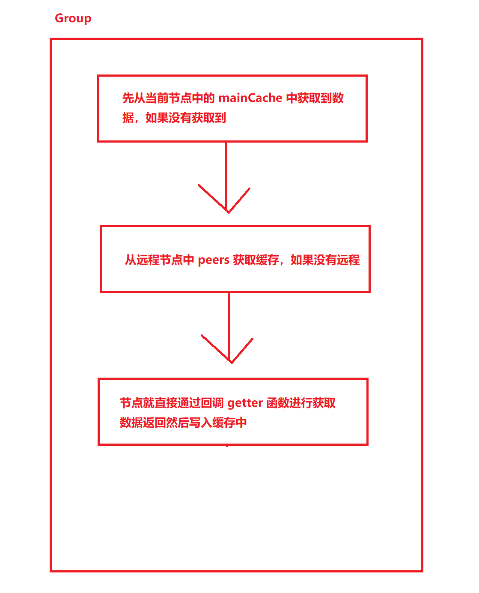

# GeeCache

手写一个分布式缓存系统（模仿 **memcached**），需要实现的功能如下：

- 单机缓存和基于Http的分布式缓存
- LRU缓存策略
- 使用Go锁机制防止缓存击穿
- 使用一致性哈希选择节点实现负载均衡
- 使用protobuf优化节点间通信


## 1. 淘汰策略

### 1.1 FIFO（First In First Out）

先进先出的策略，也就是会淘汰在缓存中最老的记录。FIFO认为，最早添加的记录，其被使用的可能性比刚添加的可能性大。这种算法的实现比较简单，创建一个队列，新增记录添加到队尾，每次内存不够时，淘汰队首。但很多场景下，最早添加的记录被使用也最频繁，不得不因为呆的时间长而被淘汰掉，这类数据会被频繁的添加进缓存，又被淘汰出去

### 1.2 LFU（Least Frequently Used）

最少使用，也就是淘汰缓存中访问频率最低的记录。LFU的使用需要维护一个按照访问次数排序的队列，每次访问就加1，队列进行重新排序，太太数据时选择访问次数最少的即可。LFU算法的命中率比较高，缺点就是每次进行排序以及每个数据都维护一个 **访问次数** ，对内存的消耗是很高的；例如：某个数据历史上访问次数非常高，但是某个时间点之后几乎不再访问，但是因为力是访问次数过高，而迟迟不能被淘汰

### 1.3 LRU（Least Recently Used）

最近最少使用，相对于仅考虑时间因素的 FIFO 和 仅考虑访问频率的 LFU，LRU算法可以认为相对平衡的一种淘汰算法。LRU 认为，如果数据最近被访问了，那么以后访问的概率也会更高。LRU实现非常简单，只需要维护一个队列，如果某个记录被访问了，则移动到队尾，那么队首则是最近最少访问的数据

## 2. LRU算法实现

  

- 绿色是字典（map），存储键和值的映射关系。这样根据某个键查找相对于的值的复杂度是 `0(1)` ，在字典中插入数据的复杂度也是 `0(1)`
- 红色是双向链表实现的队列，将所有的值放入到双向链表中，这样当访问到某个具体值时，将其移动到队尾的复杂度是 `0(1)`


### 2.1 lru.go

**LruCache** 结构体定义了算法的结构，其中每一个属性都已经注释好了

- 其中定义的 **Value** 是我们定义的一个接口，只要数据实现了该接口的访问都可以存入到缓存中
- 字典的定义 **map[string]*list.Element** ，键是字符串，值是指向双向链表中对应节点的指针，取值时直接用 `key` 就可以取到对应的节点，就不需要再通过遍历 **list** 去取值了
- 双向链表则使用了go实现的结构 **list.List**

```go
import "container/list"

// LruCache 采用LRU算法进行淘汰
type LruCache struct {
	maxBytes int64 //允许使用的最大内存

	nbytes int64 //当前已经使用的内存

	ll *list.List //使用go实现的双向链表

	cache map[string]*list.Element //字典的定义，键是字符串，值是双向链表中对应的节点指针

	OnEvicted func(key string, value Value) //某条记录被移除时的回调函数，可以为nil
}

// Get 查找对应的缓存数据
func (c *LruCache) Get(key string) (value Value, ok bool) {
	if ele, ok := c.cache[key]; ok {
		//如果查找对应的值，将链表的值插入到队尾（队首和队尾是相对的这里约定front为队尾）
		c.ll.MoveToFront(ele)
		//返回对应的值
		kv := ele.Value.(*entry)
		return kv.value, true
	}
	return
}

// RemoveOldest 移除掉过期的值
func (c *LruCache) RemoveOldest() {
	//取到队首的数据，从链表中删除
	ele := c.ll.Back()
	if ele != nil {
		c.ll.Remove(ele)
		kv := ele.Value.(*entry)
		//移除映射的值
		delete(c.cache, kv.key)
		//将当前使用的内存减去 key+value 的长度；更新当前所用的内存
		c.nbytes -= int64(len(kv.key)) + int64(kv.value.Len())
		//调用回调函数
		if c.OnEvicted != nil {
			c.OnEvicted(kv.key, kv.value)
		}
	}
}

// Add 添加数据
func (c *LruCache) Add(key string, value Value) {
	if ele, ok := c.cache[key]; ok {
		//移动到队尾
		c.ll.MoveToFront(ele)
		//更新值
		kv := ele.Value.(*entry)
		c.nbytes += int64(value.Len()) - int64(kv.value.Len())
		kv.value = value
	} else {
		//将数据添加到队尾
		ele := c.ll.PushFront(&entry{key, value})
		c.cache[key] = ele
		c.nbytes += int64(len(key)) + int64(value.Len())
	}

	// 判断当前最大内存使用量是否小于已经使用量，如果小于，那么删除掉队首的数据
	for c.maxBytes != 0 && c.maxBytes < c.nbytes {
		c.RemoveOldest()
	}
}

// Len 返回添加的条数
func (c *LruCache) Len() int {
	return c.ll.Len()
}

// SetOnEvicted 设置过期的回调函数
func (c *LruCache) SetOnEvicted(f func(string, Value)) {
	c.OnEvicted = f
}
```

### 2.2 cachefactory.go

缓存创建工厂：

- 通过定义当前缓存工厂，可以选择指定的缓存实现方法，只需要缓存算法实现了 **ICache** 接口就可以，便于后续的扩展
- **CreateMethod** 自定义的工厂方法函数，可以根据自定义的方式来创建缓存方法

```go
import (
	"container/list"
)

const (
	FIFO = iota
	LFU
	LRU
)
// CreateMethod 创建工厂函数
type CreateMethod func() ICache

// entry 双向链表中的数据类型
type entry struct {
	//冗余key的目的是，用于移除对应字典表中的映射
	key string

	//value可以是所有实现了 Value接口的值
	value Value
}

// ICache 自定义缓存策略的接口
type ICache interface {
	//Get 根据key获取数据集
	Get(key string) (value Value, ok bool)
	//RemoveOldest 移除老数据
	RemoveOldest()
	//Add 添加
	Add(key string, value Value)
	//Len 队列长度
	Len() int
	//SetOnEvicted 设置过期时调用的回调函数
	SetOnEvicted(func(string, Value))
}

// Value 定义value接口
type Value interface {

	// Len 用于获取到当前值所占用的内存大小
	Len() int
}

// New 根据策略创建淘汰算法队列
func New(cacheType int, maxBytes int64, onEvicted func(string, Value)) ICache {
	return NewForCreateMethod(func() ICache {
		var iCache ICache
		switch cacheType {
		case FIFO:
		case LFU:
		case LRU:
			iCache = &LruCache{
				maxBytes:  maxBytes,
				OnEvicted: onEvicted,
				ll:        list.New(),
				cache:     make(map[string]*list.Element),
			}
		}
		return iCache
	})
}

// NewForCreateMethod 根据创建方法进行创建
func NewForCreateMethod(method CreateMethod) ICache {
	return method()
}
```

## 3. 单机并发缓存

 **多个协程(goroutine)** 同时读写同一个变量，在并发度较高的情况下，会发生冲突。确保一次只有一个 **协程(goroutine)** 可以访问该变量以避免冲突，这称之为`互斥`，互斥锁可以解决这个问题


### 3.1 byteview.go

采用字节的方式作为数据存储，这样可以使用缓存存储任何类型的数据

- **ByteSlice()** 方法用于拷贝数据，防止外部数据进行原来数据的修改
- **b []byte** 存储真实数据

```go
// ByteView 字节视图
type ByteView struct {
	//字节数组，存储的真实缓存数据，使用字节数组的目的是可以支撑任意的数据类型的存储
	b []byte
}

// cloneBytes 复制字节数组
func cloneBytes(b []byte) []byte {
	//复制字节数据
	c := make([]byte, len(b))
	copy(c, b)
	return c
}

// ByteSlice 复制缓存数据，当前缓存数据是只读，不允许外部进行修改
func (b ByteView) ByteSlice() []byte {
	return cloneBytes(b.b)
}

// String 转换字符串
func (b ByteView) String() string {
	return string(b.b)
}

// Len 获取长度，这里实现了 Value接口的Len()方法
func (b ByteView) Len() int {
	return len(b.b)
}
```

### 3.2 cache.go

- 主要的目的，实例化了 lru 算法，并且添加了互斥锁，用于整体的控制

```go
import (
	"gee/cache/eliminate"
	"sync"
)

// cache 用于并发控制数据的获取流程
type cache struct {
	//导入锁
	lock sync.Mutex

	//缓存lru队列
	elm eliminate.ICache

	//缓存的大小
	cacheBytes int64

	//指定对应缓存队列的创建工厂方法
	createMethod eliminate.CreateMethod
}

// add 添加缓存数据
func (c *cache) add(key string, value ByteView) {
	//上锁
	c.lock.Lock()
	//方法执行完之后释放锁
	defer c.lock.Unlock()
	if c.elm == nil {
		if c.createMethod != nil {
			c.elm = c.createMethod()
		} else {
			//创建一个默认的lru队列
			c.elm = eliminate.New(eliminate.LRU, c.cacheBytes, nil)
		}
	}
	c.elm.Add(key, value)
}

// get 根据key进行获取
func (c *cache) get(key string) (value ByteView, ok bool) {
	c.lock.Lock()
	defer c.lock.Unlock()
	if c.elm == nil {
		return
	}
	if v, ok := c.elm.Get(key); ok {
		return v.(ByteView), ok
	}
	return
}
```

### 3.3 geecache.go

主要负责与外部的交互，控制缓存的存储和获取的主要流程

- **Getter** ： 回调函数，如果在获取某个 `key` 时，并没有拿到数据，那么需要有一个 `回调` 的地方取某个地方取到数据例如：mysql、mongo等；相当于缓存中拿不到就去数据库里面拿，然后再写入缓存中

- **Group** ： 主要用于与外部的交互，通过 **组** 来进行控制整个缓存的存储与取值的流程，每个 **组** 也有自己的名称



```go
import (
	"fmt"
	"log"
	"sync"
)

/**
   cache 缓存组件，目前有3种实现的方法
	1. FIFO:先进先出，最早添加的记录，被使用的频率越低；但是有些情况下，越早添加的数据，使用的越多，这种数据会被频繁的添加以及移除
	2. LFU:最少使用的记录被移除，LFU需要维护一个每个记录访问的次数的字段，每次访问就加1，维护每个记录的访问次数，并且每次都要进行排序，对内存的消费非常大
	3. FRU:最近最少使用的记录，LRU认为，如果数据最近被访问过，那么将来被访问的概率也会更高
*/

type Getter interface {
	// Get 定义get回调方法，如果在用户没有获取到数据，可以通过回调函数去获取对应的数据
	Get(key string) ([]byte, error)
}

//GetterFunc  函数实现 Getter 接口
type GetterFunc func(key string) ([]byte, error)

//Get 调用函数接口
func (f GetterFunc) Get(key string) ([]byte, error) {
	return f(key)
}

type Group struct {
	//名称
	name string
	//回调函数
	getter Getter
	//主要的缓存
	mainCache cache
	//节点选择器
	peers PeerPicker
}

// Get 获取到对应的缓存数据，如果没有命中缓存，通过回调函数进行获取，如果是分布式场景，则通过远程拉取
func (g *Group) Get(key string) (ByteView, error) {
	if key == "" {
		return ByteView{}, fmt.Errorf("key is required")
	}
	if v, ok := g.mainCache.get(key); ok {
		log.Println("[Cache hit]")
		return v, nil
	}
	//加载数据，通过远程节点
	return g.load(key)
}

// load 加载数据到缓存中
func (g *Group) load(key string) (ByteView, error) {
	if g.peers != nil {
		//获取到某个节点选择器
		if peer, ok := g.peers.PickPeer(key); ok {
			//通过节点选择器去查询对应的数据
			if value, err := g.getFromPeer(peer, key); err == nil {
				return value, nil
			} else {
				log.Println("[Cache] Failed to get from peer", err)
			}
		}
	}
	//从本地进行加载
	return g.getLocally(key)
}

// getFromPeer 从远程获取到对应的数据
func (g *Group) getFromPeer(peer PeerGetter, key string) (ByteView, error) {
	//从远程节点读取到对应的数据
	bytes, err := peer.Get(g.name, key)
	if err != nil {
		return ByteView{}, err
	}
	return ByteView{bytes}, nil
}

// getLocally 通过调用本地回调函数取获取到对应的缓存
func (g *Group) getLocally(key string) (ByteView, error) {
	//通过回调函数去获取数据
	bytes, err := g.getter.Get(key)
	if err != nil {
		return ByteView{}, err
	}
	value := ByteView{
		//复制一下数据
		b: cloneBytes(bytes),
	}
	g.populateCache(key, value)
	return value, nil
}

//populateCache 将数据存入到内存当中
func (g *Group) populateCache(key string, value ByteView) {
	g.mainCache.add(key, value)
}

// RegisterPeers 注册节点信息
func (g *Group) RegisterPeers(peers PeerPicker) {
	if g.peers != nil {
		panic("RegisterPeerPicker called more than once")
	}
	g.peers = peers
}

//定义全局的变量
var (
	//读写互斥锁
	mu sync.RWMutex
	//创建一个map用于存储组
	groups = make(map[string]*Group)
)

// NewGroup 创建分组
func NewGroup(name string, cacheBytes int64, getter Getter) *Group {
	if getter == nil {
		panic("nil Getter")
	}
	mu.Lock()
	defer mu.Unlock()
	g := &Group{
		name:   name,
		getter: getter,
		mainCache: cache{
			cacheBytes: cacheBytes,
		},
	}
	//存入到全局字典中
	groups[name] = g
	return g
}

// GetGroup 获取分组，不涉及到写的冲突，只需要用读锁
func GetGroup(name string) *Group {
	mu.RLock()
	g := groups[name]
	mu.RUnlock()
	return g
}
```

## 4. HTTP服务端

### 4.1 http.go

自定义节点之间相互通信的方式，这里 **HTTPPool** 实现了 **PeerPicker、PeerGetter** 两个接口的方法，在 **Group** 里面通过远程获取数据时就是通过调用 **HTTPPool** 中的 **PeerPicker()** 方法来选择其中一个节点进行数据的获取

```go
import (
	"fmt"
	"gee/cache/consistenthash"
	"io/ioutil"
	"log"
	"net/http"
	"net/url"
	"strings"
	"sync"
)

const (
	defaultBasePath = "/_cache/"
	defaultReplicas = 50
)

type HTTPPool struct {
	//表示当前服务的ip地址
	self string
	//节点间通信的前缀
	basePath string
	//锁
	mu sync.Mutex
	//一致性hash算法
	peers *consistenthash.Map
	//远程调用器
	httpGetters map[string]*httpGetter
}

// NewHTTPPool 创建节点间的通信实体
func NewHTTPPool(self string) *HTTPPool {
	return &HTTPPool{
		self:     self, //自身的ip地址
		basePath: defaultBasePath, //默认的缓存请求基础地址
	}
}

// Log 打印日志
func (p *HTTPPool) Log(format string, v ...interface{}) {
	log.Printf("[Server %s] %s", p.self, fmt.Sprintf(format, v))
}

// ServeHTTP 开启服务端的监听
func (p *HTTPPool) ServeHTTP(w http.ResponseWriter, r *http.Request) {
	//判断请求的路径前缀是否跟当前服务的前缀一样
	if !strings.HasPrefix(r.URL.Path, p.basePath) {
		panic("HTTPPool serving unexpected path:" + r.URL.Path)
	}
	p.Log("%s %s", r.Method, r.URL.Path)
	//这里获取到 /basepath/group/key 路径后面的数据；获取group下面对应的key
	parts := strings.SplitN(r.URL.Path[len(p.basePath):], "/", 2)
	if len(parts) != 2 {
		http.Error(w, "bad request", http.StatusBadRequest)
		return
	}
	groupName := parts[0]
	key := parts[1]
	//获取对应组名称
	group := GetGroup(groupName)
	if group == nil {
		http.Error(w, "no such group:"+groupName, http.StatusNotFound)
		return
	}
	//获取对应缓存数据
	view, err := group.Get(key)
	if err != nil {
		http.Error(w, err.Error(), http.StatusInternalServerError)
		return
	}
	w.Header().Set("Content-Type", "application/octet-stream")
	w.Write(view.ByteSlice())
}

//Set 添加节点
func (p *HTTPPool) Set(peers ...string) {
	p.mu.Lock()
	defer p.mu.Unlock()
	p.peers = consistenthash.New(defaultReplicas, nil)
	//添加节点
	p.peers.Add(peers...)
	//创建对应的http调用器
	p.httpGetters = make(map[string]*httpGetter, len(peers))
	for _, peer := range peers {
		p.httpGetters[peer] = &httpGetter{baseURL: peer + p.basePath}
	}
}

// PickPeer 实现了接口，通过key获取到对应的节点信息
func (p *HTTPPool) PickPeer(key string) (PeerGetter, bool) {
	p.mu.Lock()
	defer p.mu.Unlock()
	//通过一致性hash算法，获取到对应的节点地址
	if peer := p.peers.Get(key); peer != "" && peer != p.self {
		p.Log("Pick peer %s", peer)
		return p.httpGetters[peer], true
	}
	return nil, false
}

// httpGetter 创建一个http远程调用器
type httpGetter struct {
	//设置http服务的远程地址
	baseURL string
}

// Get 发起http请求，通过对应的节点获取到缓存数据
func (h *httpGetter) Get(group string, key string) ([]byte, error) {
	u := fmt.Sprintf("%v%v/%v", h.baseURL, url.QueryEscape(group), url.QueryEscape(key))
	res, err := http.Get(u)
	if err != nil {
		return nil, err
	}
	defer res.Body.Close()
	if res.StatusCode != http.StatusOK {
		return nil, fmt.Errorf("reading response body :%v", err)
	}
	bytes, err := ioutil.ReadAll(res.Body)
	if err != nil {
		return nil, err
	}
	return bytes, nil
}
```

### 4.2 consistenthash.go（一致性hash节点）

具体什么是一致性hash算法，可以参考这里：**https://blog.csdn.net/weixin_43915643/article/details/126710522?spm=1001.2014.3001.5501**

```go
import (
	"hash/crc32"
	"sort"
	"strconv"
)

//Hash 定义计算hash的函数
type Hash func(data []byte) uint32

/**
实现原理：将key映射到 2^32 的空间中，将这个数字的首位想连，形成一个环
1. 计算节点（使用节点名称、编号、IP地址）的hash值，放置在环上
2. 计算key的hash值，放置在环上，顺时针寻找到的第一个节点，就是应选取的节点
例如：p2、p4、p6三个节点，key11、key2、key27按照顺序映射到p2、p4、p6上面，假设新增一个节点p8在p6节点之后，这个时候只需要将key27从p6调整到p8就可以了
	也就是说，每次新增删除节点时，只需要重新定位该节点附近的一小部分数据

数据倾斜的问题：
	如果服务器的节点过少，容易引起key的倾斜。例如上面的例子中p2、p4、p6分布在环的上半部分，下半部分是空的。那么映射到下半部分的key都会被分配给p2，key过度倾斜到了p2
	缓存间节点负载不均衡；
为了解决这个问题，引入了虚拟节点的概念，一个真实的节点对应多个虚拟的节点
假设1个真实的节点对应3个虚拟节点，那么p1对应的就是p1-1、p1-2、p1-3
第一步：计算虚拟节点的Hash值，放置在环上
第二步：计算key的Hash值，在环上顺时针寻找到对应选取的虚拟节点，例如：p2-1，对应真实的节点p2
虚拟节点扩充了节点的数量，解决了节点较少的情况下数据倾斜的问题，而且代价非常小，只需要新增一个字典（Map）维护真实的节点与虚拟节点的映射关系就可以了
*/
type Map struct {

	//自定义的hash函数
	hash Hash

	//虚拟节点数
	replicas int

	//hash环，每个节点映射的hash值
	keys []int

	//映射虚拟节点
	hashMap map[int]string
}

// New 创建一个Map实例，作为一致性hash算法的主要结构
func New(replicas int, fn Hash) *Map {
	//创建实例
	m := &Map{
		replicas: replicas,
		hash:     fn,
		hashMap:  make(map[int]string),
	}

	if m.hash == nil {
		//采用默认的hash算法
		m.hash = crc32.ChecksumIEEE
	}
	return m
}

//Add 添加节点，可以传入一个或者多个真实节点的名称
func (m *Map) Add(keys ...string) {
	for _, key := range keys {
		//根据指定的虚拟节点数量进行创建
		for i := 0; i < m.replicas; i++ {
			//计算hash值，根据 id+key 的格式来进行不同虚拟节点的区分 （strconv.Itoa(i)格式化成string类型）
			hash := int(m.hash([]byte(strconv.Itoa(i) + key)))
			//将对应的hash值，添加进行
			m.keys = append(m.keys, hash)
			//映射虚拟节点和真实节点的关系
			m.hashMap[hash] = key
		}
	}
	sort.Ints(m.keys)
}

//Get 获取到节点信息
func (m *Map) Get(key string) string {
	if len(key) == 0 {
		return ""
	}
	//根据key计算节点的hash
	hash := int(m.hash([]byte(key)))

	//Search方法，根据keys的数量进行遍历
	idx := sort.Search(len(m.keys), func(i int) bool {
		//顺时针寻找第一个匹配的虚拟节点对应的下标，为什么要大于等于呢，因为上面对keys进行了排序，并且顺时针获取到环上面的第一个节点
		return m.keys[i] >= hash
	})
	// 如果 idx == len(m.keys) 说明应该选择 m.keys[0]，因为keys是一个环状结构，所以用取余数的方式来处理;
	return m.hashMap[m.keys[idx%len(m.keys)]]
}
```

## 5. 分布式节点

通过上面的 **HttpPool** 实现了下面两个接口的方法，然后将其通过 **Group** 的 **RegisterPeers()** 方法进行注入到组中，就可以通过一致性hash算法，选出对应的节点进行通信

### 5.1 peers.go

``` go
type PeerPicker interface {
	//PickPeer 根据key选择节点
	PickPeer(key string) (peer PeerGetter, ok bool)
}

type PeerGetter interface {
	//Get 通过对应的group查找缓存
	Get(group string, key string) ([]byte, error)
}
```


## 6. 防止缓存击穿

