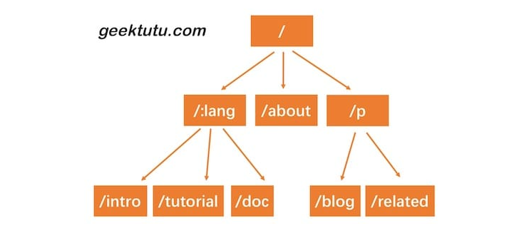
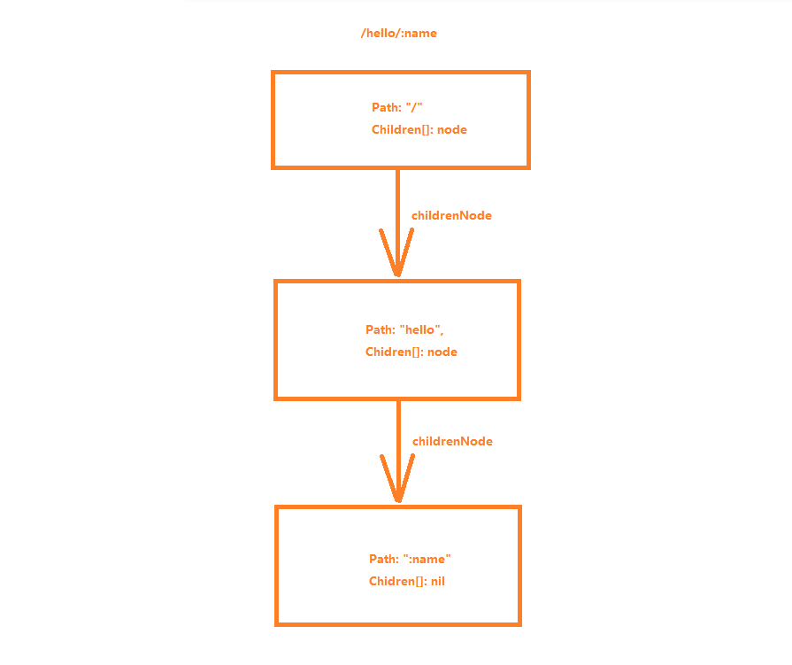
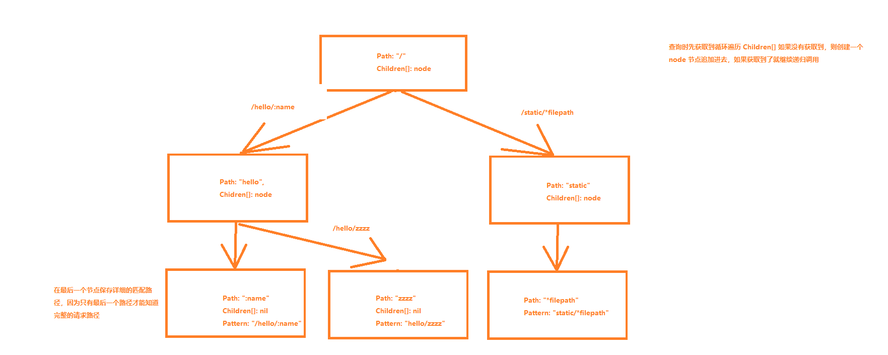
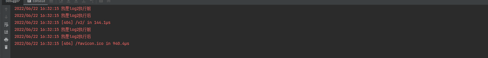
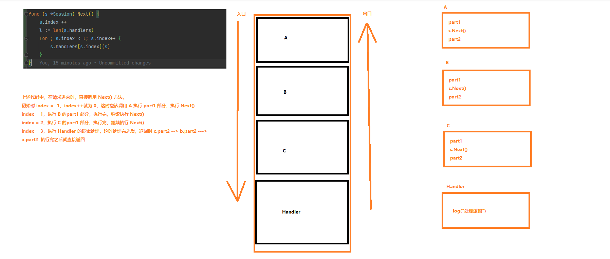
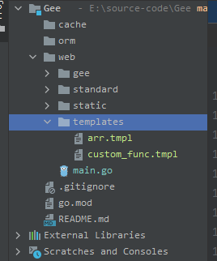

# Go手写Web框架

**参考书籍：https://geektutu.com/post/gee.html** 

## 1. Web

### 1.1 标准启动方式

通过定义接口，使用 **net/http** 库封装基础的功能，通过自定义函数的方式可以自定义

StandardStart.go

```go
// Handler 用于实现处理器
type Handler interface {
	GetProcess() func(w http.ResponseWriter, r *http.Request)
	GetPath() string
}

type TestWeb struct{}

// Start 开启一个web端口的监听
func (t TestWeb) Start(port int, handlers []Handler) {
	for _, handler := range handlers {
		http.HandleFunc(handler.GetPath(), handler.GetProcess())
	}
	addr := fmt.Sprintf("%s:%d", "localhost", port)
	log.Fatal(http.ListenAndServe(addr, nil))
}
```

下面创建了两个处理接口进行实现

main.go

```go
type Handler struct {
	Path string
	Process func(w http.ResponseWriter, r *http.Request)
}

func (p Handler) GetProcess() func(w http.ResponseWriter, r *http.Request) {
	return p.Process
}

func (p Handler) GetPath() string {
	return p.Path
}

func main() {
	web := standard.TestWeb{}
	printPath := Handler {
		Path: "/",
		Process: func(w http.ResponseWriter, r *http.Request) {
			fmt.Fprintf(w, "Url.Path = %q\n", r.URL.Path)
		},
	}
	hello := Handler {
		Path: "/hello",
		Process: func(w http.ResponseWriter, r *http.Request) {
			fmt.Fprintln(w, "hello world")
		},
	}
	handlers := make([]standard.Handler, 0, 2)
	handlers = append(handlers, printPath, hello)
	web.Start(8080, handlers)
}
```

### 1.2 基础框架（Gee）

上面是通过创建函数对象进行实现，下面就通过 **net/http** 提供的 **http.Handler** 接口进行实现

```go
package http

type Handler interface {
    ServeHTTP(w ResponseWriter, r *Request)
}

func ListenAndServe(address string, h Handler) error
```

以下 **Gee.go** 就是对处理代码的封装，其中封装了 GET\POST 请求，**Engine** 结构体中定义了路由表，用于保存处理函数

```go
// Handler gee框架封装的 handler处理方法
type Handler func(http.ResponseWriter, *http.Request)

// Engine 定义接口体其中保存了路由
type Engine struct {
	router map[string]Handler
}

// Router 路由结构体
type Router struct {
	//方法名称
	Method string
	//路径
	Pattern string
	//处理器
	Handler Handler
}

// New 创建Engine对象，构建一个初始化的路由器
func New() *Engine {
	return &Engine{router: make(map[string]Handler)}
}

// addRoute 添加路由器
func (e *Engine) addRoute(router *Router)  {
	key := fmt.Sprintf("%s-%s", router.Method, router.Pattern)
	e.router[key] = router.Handler
}

// GET 添加get类型路由
func (e *Engine) GET(pattern string, handler Handler) {
	e.addRoute(&Router{
		Method: "GET",
		Pattern: pattern,
		Handler: handler,
	})
}
// post
func (e *Engine) post(pattern string, handler Handler) {
	e.addRoute(&Router{
		Method: "POST",
		Pattern: pattern,
		Handler: handler,
	})
}
// Run 执行代码的封装
func (e *Engine) Run(addr string) (err error)  {
	return http.ListenAndServe(addr, e)
}
// ServeHTTP 实现 net/http 处理的接口
func (e *Engine) ServeHTTP(w http.ResponseWriter, req *http.Request)  {
	//处理时获取到请求体的 KET，由方法类型和请求路径拼接
	key := fmt.Sprintf("%s-%s",req.Method ,req.URL.Path)
	if handler, ok := e.router[key]; ok {
		handler(w, req)
	} else {
		fmt.Fprintf(w, "404 NOT FOUND: %s\n", req.URL)
	}
}
```

```go
//启动方法监听
func main() {
	engine := gee.New()
	engine.GET("/", func(writer http.ResponseWriter, request *http.Request) {
		fmt.Fprint(writer, "hello world")
	})
	engine.Run("localhost:8080")
}
```

### 1.3 上下文

其中的目的用于简化响应体的操作，因为我们如果要构造一个完整的响应，就需要考虑 **Header** 和 **消息体（Body）** ，而 **Header** 又包含了 **状态码（StatusCode）** ，**消息类型（ContentType）** ，等数据，如果不封装，每次请求都要这些信息，就会造成大量的重复繁琐的代码 

**session.go** 主要用于封装了响应对象以及请求对象、状态值、请求路径等

```go
const (
	SUCCESS   = 200
	NOT_FOUND = 404
	SERVER_ERROR = 500
)

// M 给map[string]any 起一个别名，便于后续使用
type M map[string]any

// Session 会话
type Session struct {
	//响应对象
	Writer http.ResponseWriter

	//请求对象
	Req *http.Request

	//请求路径
	Path string

	//方法类型
	Method string

	//状态值
	StatusCode int
}

// NewSession 创建一个新的会话
func NewSession(w http.ResponseWriter, req *http.Request) *Session {
	return &Session{
		Writer: w,
		Req: req,
		Path: req.URL.Path,
		Method: req.Method,
	}
}

// PostForm 查询post请求类型的value
func (s *Session) PostForm(key string) string {
	return s.Req.FormValue(key)
}

// Query 获取到url后面的参数
func (s *Session) Query(key string) string {
	return s.Req.URL.Query().Get(key)
}

// Status 写入状态值
func (s *Session) Status(code int)  {
	s.StatusCode = code
	s.Writer.WriteHeader(code)
}

// SetHeader 写入header值
func (s *Session) SetHeader(key string, value string)  {
	s.Writer.Header().Set(key, value)
}

// String 写入字符串数据
func (s *Session) String(code int, format string, values...any)  {
	s.SetHeader("Content-Type", "text/plain")
	result := fmt.Sprintf(format, values)
	s.Bytes(code, []byte(result))
}

// Json 写入json数据
func (s *Session) Json(code int, obj any)  {
	s.SetHeader("Content-Type", "application/json")
	s.Status(code)
	//创建一个编码器，写入对象
	encoder := json.NewEncoder(s.Writer)
	if err := encoder.Encode(obj); err != nil {
		http.Error(s.Writer, err.Error(), SERVER_ERROR)
	}
}

// Bytes 写入字节数据
func (s *Session) Bytes(code int, data []byte)  {
	s.StatusCode = code
	s.Writer.Write(data)
}

// Html 写入html代码
func (s *Session) Html(code int, html string)  {
	s.StatusCode = code
	s.SetHeader("Content-Type", "text/html")
	s.Bytes(code, []byte(html))
}
```

**router.go** router对象被拉出来单独做了对象用于处理路由表，后续还会对其进行动态路由的增强

```go
// Router 路由结构体
type Router struct {
	router map[string]Handler
}

// newRouter 创建一个路由表
func newRouter() *Router {
	return &Router{
		router: make(map[string]Handler),
	}
}

type RouterS struct {
	method string
	pattern string
	handler Handler
}

// addRoute 添加路由器
func (r *Router) addRoute(routers RouterS)  {
	key := fmt.Sprintf("%s-%s", routers.method, routers.pattern)
	r.router[key] = routers.handler
}

// handle 处理逻辑
func (r *Router) handle(s *Session) {
	//处理时获取到请求体的 KET，由方法类型和请求路径拼接
	key := fmt.Sprintf("%s-%s",s.Method ,s.Path)
	if handler, ok := r.router[key]; ok {
		handler(s)
	} else {
		s.String(NOT_FOUND, "404 NOT FOUND: %s\n", s.Path)
	}
}
```

**gee.go** 修改了 **Handler** 接口的参数传递 session 对象，修改了 **ServeHTTP()** 方法的调用逻辑

```go
// Handler gee框架封装的 handler处理方法
type Handler func(session *Session)

// Engine 定义接口体其中保存了路由
type Engine struct {
	router *Router
}

// New 创建Engine对象，构建一个初始化的路由器
func New() *Engine {
	return &Engine{
		router: newRouter(),
	}
}

// GET 添加get类型路由
func (e *Engine) GET(pattern string, handler Handler) {
	e.router.addRoute(RouterS{
		method: "GET",
		pattern: pattern,
		handler: handler,
	})
}
// post
func (e *Engine) post(pattern string, handler Handler) {
	e.router.addRoute(RouterS{
		method: "POST",
		pattern: pattern,
		handler: handler,
	})
}
// Run 执行代码的封装
func (e *Engine) Run(addr string) (err error)  {
	return http.ListenAndServe(addr, e)
}

// ServeHTTP 实现 net/http 处理的接口
func (e *Engine) ServeHTTP(w http.ResponseWriter, req *http.Request)  {
	session := NewSession(w, req)
	e.router.handle(session)
}
```


```go
func main() {
	engine := gee.New()
	engine.GET("/helloword", func(s *gee.Session) {
		s.Json(gee.SUCCESS, gee.M{
			"username": s.Query("username"),
			"password": s.Query("password"),
		})
	})
	engine.Run("localhost:8080")
}
```

### 1.4 路由树



所实现的功能，如果访问路径 **/hello/zhangsan，后端匹配路径 **/hello/:name** 那么这个 **:name** 的值就需要替换成前端访问的 **path** 这个值，跟 java中 Restful接口风格一样，使用 **{variable}** 标记需要取的参数，在接口使用 **@PathVariable** 注解就可以取值；如果页面访问 **/static/path/img** 这个路径，后端使用 **/static/\*filepath** 进行匹配的话，那么我们就需要把 **filepath** 的值设置为 **/path/img** 作为参数让后续进行取值；

上面图片中实现这种方式采用的 **前缀树** 进行递归匹配，**"/"** 作为根路径进行匹配；例如：**/hello/:name** 进行路径匹配，那么进行添加出来的结构就是下图这样



查询对应的节点就只需要获取到顶级的节点进行递归遍历就可以了，具体看代码实现

**trie.go**

```go
// node 路由匹配树型状结构
type node struct {
	pattern string //待匹配路由，例如：/p/:lang
	part string    //路由中的一部分，例如：  :lang
	children []*node //子节点

	//是否精确匹配，part含有 ：或 * 时为true；
	//当进行匹配 /p/go/doc这个路径时，第一层节点，p精确匹配到了p，第二层节点，go使用模糊匹配到了 :lang
	//那么会把 :lang 这个参数赋值为 go，继续一层匹配
	isWild bool
}

// matchChild 第一个匹配成功的节点，用于插入
func (n *node) matchChild(part string) *node {
	for _, child := range n.children {
		if child.part == part || child.isWild {
			return child
		}
	}
	return nil
}

// 所有匹配成功的节点用于查找
func (n *node) matchChildren(part string) []*node {
	nodes := make([]*node, 0)
	for _, child := range n.children {
		if child.part == part || child.isWild {
			nodes = append(nodes, child)
		}
	}
	return nodes
}

// 添加节点，pattern：整体的路径，parts：为请求路径的参数，height：为记录的高度，默认为0
func (n *node) insert(pattern string, parts []string, height int)  {
	if len(parts) == height {
		n.pattern = pattern
		return
	}
	part := parts[height]
	child := n.matchChild(part)
	//如果没有查询到对应的节点，那么执行添加节点
	if child == nil {
		//创建新的节点
		child = &node{
			part: part,
			isWild: part[0] == ':' || part[0] == '*',
		}
		n.children = append(n.children, child)
	}
	//如果已经存在节点，那么高度+1继续执行添加
	child.insert(pattern, parts, height + 1)
}

// 查询节点
func (n *node) search(parts []string, height int) *node {
	//如果匹配到当前的节点前缀是 * 开头的，就直接返回当前节点
	if len(parts) == height || strings.HasPrefix(n.part, "*") {
		//这里进行判断，只有在整个路径的最后一个节点时，才会设置 pattern 属性值
		if n.pattern == "" {
			return nil
		}
		return n
	}
	part := parts[height]
	//根据每一层路径信息去匹配所有的子节点出来
	children := n.matchChildren(part)

	for _, child := range children {
		//所有子节点匹配了之后，在通过 search() 方法去匹配下面的子节点
		result := child.search(parts, height + 1)
		if result != nil {
			return result
		}
	}
	return nil
}
```

**session.go** 中只需要追加下面部分

```go
type Session struct {

	//参数信息
	Params map[string]string
	......
}

// Param 获取到参数信息
func (s *Session) Param(key string) string {
	return s.Params[key]
}
```

**router.go**

```go
// Router 路由结构体
type Router struct {
	//动态路由表
	roots map[string]*node

	//handler映射器
	router map[string]Handler
}

// newRouter 创建一个路由表
func newRouter() *Router {
	return &Router{
		roots: make(map[string]*node),
		router: make(map[string]Handler),
	}
}

// RouterS 封装的添加路由对象的实体
type RouterS struct {
	// 方法类型
	method string
	// 匹配路径
	pattern string
	// 处理方法
	handler Handler
}

// 解析请求路径根据 / 进行分割
func parsePattern(pattern string) []string {
	vs := strings.Split(pattern, "/")
	parts := make([]string, 0)

	for _, item := range vs {
		if item != "" {
			parts = append(parts, item)
			//如果item是 * 开头的，后续的就不需要在进行添加了
			if item[0] == '*' {
				break
			}
		}
	}
	return parts
}

// addRoute 添加路由器
func (r *Router) addRoute(routers RouterS)  {
	pattern := routers.pattern
	parts := parsePattern(pattern)
	method := routers.method
	if _, ok := r.roots[method] ; !ok {
		//如果获取的方法没有，创建一个空的树
		r.roots[method]= &node{}
	}
	//插入解析过后的节点
	r.roots[method].insert(pattern, parts, 0)
	key := fmt.Sprintf("%s-%s", method, pattern)
	r.router[key] = routers.handler
}

// 获取到路由，返回的是匹配到的节点信息，后面就是路径对应的参数信息
func (r *Router) getRoute(method string, pattern string) (*node, map[string]string, bool)  {
	searchParts := parsePattern(pattern)
	params := make(map[string]string)
	root,ok := r.roots[method]
	if !ok {
		return nil, nil, false
	}
	//获取匹配的节点
	n := root.search(searchParts, 0)
	if n != nil {
		parts := parsePattern(n.pattern)
		for index, part := range parts {
			if part[0] == ':' {
				// part[1:] 截取 : 或者 * 后面的字段名称
				params[part[1:]] = searchParts[index]
			}
			if part[0] == '*' && len(part) > 1 {
				// * 号匹配路径后面的所有，需要将请求的路径使用 / 进行拼接
				params[part[1:]] = strings.Join(searchParts[index:], "/")
			}
		}
		return n, params, true
	}
	return nil, nil, false
}

// handle 处理逻辑
func (r *Router) handle(s *Session) {
	method := s.Method
	path := s.Path
	//获取到节点信息，以及对应的参数列表
	if n, params, ok := r.getRoute(method, path); ok {
		s.Params = params
		//处理时获取到请求体的 KET，由方法类型和请求路径拼接
		key := fmt.Sprintf("%s-%s", method, n.pattern)
		r.router[key](s)
	} else {
		s.String(NOT_FOUND, "404 NOT FOUND: %s\n", path)
	}
}
```

上述通过 **trie.go** 中的 **search()** 方法，先将访问的 **path** 路径进行分割，然后遍历子节点进行一部分一部分的匹配



### 1.5 分组

实现对请求的前缀进行分组控制，例如：/v1下的路径可以使用日志打印，/v2路径下的组需要通过token鉴权；而每一个分组下的子路径又可以继续实现分组，最终效果如下

```go
func main() {
	//创建一个引擎，这里面会创建一个默认的分组
	engine := gee.New()

	//通过引擎创建一个 v1 分组
	group1 := engine.Group("/v1")

	//因为group里面包含了 Engine 对象，所以也可以执行添加路由的操作
	group1.GET("/", func(session *gee.Session) {
		session.Html(gee.SUCCESS, "<h1>Hello Gee</h1>")
	})

	//创建第二个分组
	group2 := engine.Group("/v2")
	group2.GET("/hello", func(session *gee.Session) {
		session.Html(gee.SUCCESS, "<h1>Hello Group2</h1>")
	})
	group2.GET("/hello/:name", func(session *gee.Session) {
		session.String(gee.SUCCESS, "Hello %s", session.Param("name"))
	})
	//在group2下再次创建一个分组
	g2c := group2.Group("/children")
	g2c.GET("/", func(session *gee.Session) {
		session.Html(gee.SUCCESS, "<h1>Hello Group2/children</h1>")
	})
	engine.Run(":9999")
}
```

因为 **RouterGroup** 当中保存了 ***Engine** 所以每个分组当中也可以使用到引擎的能力，并且每个分组也拥有添加请求映射的能力

```go
type RouterGroup struct {
	// 分组的前缀
	prefix string
	//中间件的支持
	middlewares []Handler
	//父级分组
	parent *RouterGroup
	//执行引擎
	engine *Engine
}

// Group 创建一个分组，Engine对象在一开始就创建了一个默认的分组
func (group *RouterGroup) Group(prefix string) *RouterGroup  {
	engine := group.engine
	newGroup := &RouterGroup{
        //将上一级的group的前缀跟当前需要创建新的分组拼接上，如果父级是 v1，需要创建一个v2的子分组，那么子分组的实际前缀就是 /v1/v2
		prefix: group.prefix + prefix,
		parent: group,
		engine: engine,
	}
	//将当前分组存入到engine引擎中
	engine.groups = append(engine.groups, newGroup)
	return newGroup
}

// addRouter 添加分组的路由，先拼接上路由的地址
func (group *RouterGroup) addRouter(method string, comp string, handler Handler)  {
	//添加路由，将当前分组的前缀 + 当前路由
	pattern := group.prefix + comp
	log.Printf("Route %4s - %s", method, pattern)
	group.engine.router.addRoute(RouterS{
		method: method,
		pattern: pattern,
		handler: handler,
	})
}

// GET 请求
func (group *RouterGroup) GET(pattern string, handler Handler)  {
	group.addRouter("GET", pattern, handler)
}

func (group *RouterGroup) POST(pattern string, handler Handler) {
	group.addRouter("POST", pattern, handler)
}
```

下面是 **Gee** 的修改，其中，在创建引擎时，创建了一个默认的顶级分组，可以在这个默认顶级分组下继续创建分组，**Engine** 结构体新增 ***RouterGroup** 使得容器作为顶层容器，可以使用分组的所有功能

```go
type Engine struct {
	//直接继承 Group结构体，使Engine拥有Group的功能
	*RouterGroup
	router *Router
	//存储上所有的分组
	groups []*RouterGroup
}

func New() *Engine {
	engine := &Engine{
		router: newRouter(),
	}
	//创建一个默认的分组
	engine.RouterGroup = &RouterGroup{engine: engine}
	//将分组存起来
	engine.groups = []*RouterGroup{engine.RouterGroup}
	return engine
}
```

### 1.6 中间件

在 **Gee** 中可以允许用户在真正执行业务之前，做一些前置性的逻辑，这是就引入了 **middleware** 中间件，用于用户可以添加自定义的中间件处理；设计 **middleware** 的处理入参为 **Session** 通过调用 **Next()** 方法可以继续执行下一个中间件

```go
func main() {
	//创建一个引擎，这里面会创建一个默认的分组
	engine := gee.New()
	//添加中间件
	engine.Use(gee.Logger())
	engine.Use(gee.Logger2())
	//通过引擎创建一个 v1 分组
	group1 := engine.Group("/v1")

	//因为group里面包含了 Engine 对象，所以也可以执行添加路由的操作
	group1.GET("/", func(session *gee.Session) {
		session.Html(gee.SUCCESS, "<h1>Hello Gee</h1>")
	})

	//创建第二个分组
	group2 := engine.Group("/v2")
	group2.GET("/hello", func(session *gee.Session) {
		session.Html(gee.SUCCESS, "<h1>Hello Group2</h1>")
	})
	group2.GET("/hello/:name", func(session *gee.Session) {
		session.String(gee.SUCCESS, "Hello %s", session.Param("name"))
	})
	//在group2下再次创建一个分组
	g2c := group2.Group("/children")
	g2c.GET("/", func(session *gee.Session) {
		session.Html(gee.SUCCESS, "<h1>Hello Group2/children</h1>")
	})
	engine.Run(":9999")
}
```

执行顺序，先执行 logger2 的打印，然后执行对应的路径处理逻辑，然后打印 logger2 后续的打印，然后执行 logger 的打印逻辑



**logger.go** ：创建两个中间件日志打印

```go
// Logger 创建一个日志记录中间件
func Logger() Handler {
	return func(session *Session) {
		//获取到当前事件
		t := time.Now()
		session.Next()
		log.Printf("[%d] %s in %v", session.StatusCode, session.Req.RequestURI, time.Since(t))
	}
}

func Logger2() Handler {
	return func(session *Session) {
		//获取到当前事件
		log.Println("我是log2执行前")
		session.Next()
		log.Println("我是log2执行后")

	}
}
```


**gee.go** ：修改处理的方法

```go
// ServeHTTP 实现 net/http 处理的接口
func (e *Engine) ServeHTTP(w http.ResponseWriter, req *http.Request)  {
	var middlewares []Handler
	//遍历所有的分组，判断当前的请求是否有遍历的分组的前缀，如果有，就将handler添加进去
	for _, group := range e.groups {
		if strings.HasPrefix(req.URL.Path, group.prefix) {
			middlewares = append(middlewares, group.middlewares...)
		}
	}
	session := NewSession(w, req)
	session.handlers = middlewares
	e.router.handle(session)
}
```

**router.go** ：调用 **handler** 的处理

```go
func (r *Router) handle(s *Session) {
	method := s.Method
	path := s.Path
	//获取到节点信息，以及对应的参数列表
	if n, params, ok := r.getRoute(method, path); ok {
		s.Params = params
		//处理时获取到请求体的 KET，由方法类型和请求路径拼接
		key := fmt.Sprintf("%s-%s", method, n.pattern)
		//将真正进行业务处理的handler也添加进去
		s.handlers = append(s.handlers, r.router[key])
	} else {
		s.handlers = append(s.handlers, func(session *Session) {
			session.String(NOT_FOUND, "404 NOT FOUND: %s\n", path)
		})
	}
	//调用中间件
	s.Next()
}
```



### 1.7 静态模板 Template

主要目的是能够实现前端请求获取 **css/js** 文件，并且通过 **Template** 模板语法对 **html** 文件的动态加载；例如：前端请求 **/assets/*filepath** 可以匹配 **/assets** 开头的所有的地址（**assets/js/geektutu.js**） 而 **filepath** 也会被映射成为对应的参数，这里跟上面路径匹配一样；下面是具体实现：



```go
func main() {
	//创建一个引擎，这里面会创建一个默认的分组
	engine := gee.New()
	//添加中间件
	engine.Use(gee.Logger())

	//设置自定义渲染函数
	engine.SetFuncMap(template.FuncMap{
		"FormatAsDate" : FormatAsDate,
	})
	//windows设置绝对路径
	engine.LoadHTMLGlob("E:\\source-code\\Gee\\web\\templates\\*")
    //挂载静态模板的路径
	engine.Static("/assets", "../static")

	engine.GET("/date", func(s *gee.Session) {
        //执行指定的模板名称，并且封装对应的参数
		s.Html(gee.SUCCESS, "custom_func.tmpl", gee.M {
			"title":  "gee",
			"now": time.Date(2022, 8, 17, 0, 0, 0, 0, time.UTC),
		})
	})
	engine.Run(":9999")
}

func FormatAsDate(t time.Time) string {
	year, month, day := t.Date()
	return fmt.Sprintf("%d-%02d-%02d", year, month, day)
}
```

#### gee.go

```go
type Engine struct {
    ......
	//引入html模板资源的渲染，可以将模板加载进内存中
	htmlTemplates *template.Template
	//自定义的模板渲染函数
	funcMap template.FuncMap
}

// SetFuncMap 设置自定义的模板渲染
func (e *Engine) SetFuncMap(funcMap template.FuncMap)  {
	e.funcMap = funcMap
}

// LoadHTMLGlob 将模板加载进内存中
func (e *Engine) LoadHTMLGlob(pattern string)  {
	e.htmlTemplates = template.Must(template.New("").Funcs(e.funcMap).ParseGlob(pattern))
}
```

#### routerGroup.go

```go

// createStaticHandler 创建静态资源的处理器
func (group *RouterGroup) createStaticHandler(relativePath string, fs http.FileSystem) Handler {
	//将当前分组的路径跟传入的相对路径拼接
	absolutePath := path.Join(group.prefix, relativePath)
	//根据完整的路径创建出文件服务
	fileServer := http.StripPrefix(absolutePath, http.FileServer(fs))
	return func(s *Session) {
		file := s.Param("filepath")
		if _, err := fs.Open(file); err != nil {
			s.Status(NOT_FOUND)
			return
		}
		//直接完成路径之后，就交给http库里面进行处理
		fileServer.ServeHTTP(s.Writer, s.Req)
	}
}

// Static 映射静态资源处理
func (group *RouterGroup) Static(relativePath string, root string) {
	// http.Dir(root) 根据路径解析出文件系统对象
	handler := group.createStaticHandler(relativePath, http.Dir(root))
	//拼接出需要匹配的路径地址,进行挂载
	urlPattern := path.Join(relativePath, "/*filepath")
	group.GET(urlPattern, handler)
}
```

#### session.go

```go
type Session struct {
	....
	//存入引擎
	e *Engine
}

// Html 写入html代码
func (s *Session) Html(code int, html string, data any)  {
	s.Status(code)
	s.SetHeader("Content-Type", "text/html")
	if err := s.e.htmlTemplates.ExecuteTemplate(s.Writer, html, data); err != nil {
		s.Fail(SERVER_ERROR, err.Error())
	}
}

// Fail 处理失败函数
func (s *Session) Fail(code int, msg string)  {
	s.String(code, "服务处理失败：%s", msg)
}
```

### 1.8 错误处理

 Go 语言中，比较常见的错误处理方法是返回 error，由调用者决定后续如何处理。但是如果是无法恢复的错误，可以手动触发 panic，当然如果在程序运行过程中出现了类似于数组越界的错误，panic 也会被触发。panic 会中止当前执行的程序，退出。 

 Go 语言还提供了 **recover** 函数，可以避免因为 panic 发生而导致整个程序终止，recover 函数只在 defer 中生效。 

如果按照以往的这种情况，执行到 **/data** 会出现索引越界的情况，web服务就会直接宕掉，所以我们就需要添加一个错误回复的机制，将框架中执行时遇到的错误捕获到，给前端返回 **Internal Server Error** 的错误信息

```go
func main() {
	//创建一个引擎，这里面会创建一个默认的分组
	engine := gee.New()
	//设置自定义渲染函数
	engine.SetFuncMap(template.FuncMap{
		"FormatAsDate" : FormatAsDate,
	})

	engine.GET("/date", func(s *gee.Session) {
		names := []string{"geektutu"}
        //数组越界
		s.String(gee.SUCCESS, names[100])
	})
	engine.Run(":9999")
}
```

#### revocery.go

这里将错误回复制作成了中间件的方式进行插入

```go
func Recovery() Handler {
	return func(session *Session) {
		defer func() {
			if err := recover(); err != nil {
				message := fmt.Sprintf("%s", err)
				log.Printf("%s\n\n", trace(message))
				session.Fail(SERVER_ERROR, "Internal Server Error")
			}
		}()
		session.Next()
	}
}

// print stack trace for debug
func trace(message string) string {
	var pcs [32]uintptr
	//返回调用栈的程序计数器，第0个Caller是Callers本身
	n := runtime.Callers(3, pcs[:]) // skip first 3 caller
	var str strings.Builder
	str.WriteString(message + "\nTraceback:")
	for _, pc := range pcs[:n] {
		//获取到调用该函数的文件名和行号
		fn := runtime.FuncForPC(pc)
		file, line := fn.FileLine(pc)
		str.WriteString(fmt.Sprintf("\n\t%s:%d", file, line))
	}
	return str.String()
}
```

#### gee.go

```go
// Default 创建默认
func Default() *Engine {
	engine := New()
	engine.Use(Recovery())
	engine.Use(Logger())
	return engine
}
```

下面使用 **Default()** 方法进行创建，就可以使用错误回复的功能 

```go
func main() {
	//创建一个引擎，这里面会创建一个默认的分组
	engine := gee.Default()
	engine.GET("/date", func(s *gee.Session) {
		names := []string{"geektutu"}
		s.String(gee.SUCCESS, names[100])
	})
	engine.Run(":9999")
}
```

