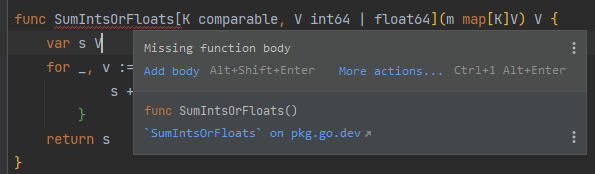
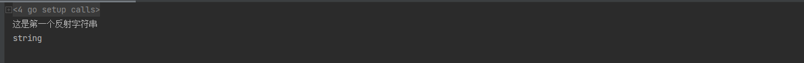

# 1. 泛型

## 1.1 定义

- 泛型[生命周期](https://so.csdn.net/so/search?q=生命周期&spm=1001.2101.3001.7020)只在编译期，旨在为程序员生成代码，减少重复代码的编写
- 在比较两个数的大小时，没有泛型的时候，仅仅只是传入类型不一样，我们就要再写一份一模一样的函数，如果有了泛型就可以减少这类代码

## 1.2 例子

```go
// SumInts 将map的值相加，如果需要添加的数据类型不同，那么就需要定义两个
func SumInts(m map[string]int64) int64 {
    var s int64
    for _, v := range m {
        s += v
    }
    return s
}

func SumFloats(m map[string]float64) float64 {
    var s float64
    for _, v := range m {
        s += v
    }
    return s
}
```

如果使用泛型的话只需要定义泛型方法即可（如果报一下编译错误的话，是idea版本过低，升级版本即可，但是运行没有问题）



```go
func main() {
	ints := make(map[string]int64, 5)
	ints["name"] = 5
	ints["value"] = 6

	floats := make(map[string]float64, 5)
	floats["name"] = 5.6
	floats["value"] = 6.5
	fmt.Printf("Gnneric sums: %v and %v\n", 
		SumIntsOrFloats[string, int64](ints), 
		SumIntsOrFloats[string, float64](floats))
    //可以将类型删除
    fmt.Printf("Gnneric sums: %v and %v\n", 
		SumIntsOrFloats(ints), 
		SumIntsOrFloats(floats))
}
//SumIntsOrFloats 定义泛型方法
func SumIntsOrFloats[K comparable, V int64 | float64](m map[K]V) V {
	var s V
	for _, v := range m {
        s += v
    }
	return s
}
```

## 1.3 自定义泛型类型

- any：代表 go里面所有的内置类型，等价于 **interface {}**
- comparable：代表go里面内置的可比较类型：int、uint、float、bool、struct、指针等一切可比较类型
- ~ 符号：用来表示改类型的衍生类型

```go
//类型约束
type Number interface {
	int64 | float64
}
```


```go
//进行类型约束时就可以使用当前类
func SumIntsNumbers[K comparable, V Number](m map[K]V) V {
	var s V
	for _, v := range m {
        s += v
	}
	return s
}
```

## 1.4 泛型与switch结合使用

```go
func main() {
	fmt.Println(Get(12))
}
//go中不能直接将泛型与switch使用
func Get[T any](t T) T {
	var ti interface{} = &t
	switch v := ti.(type) {
	case *int:
		*v = 18
	}
	return t
}
```

## 1.5 泛型实战

### 1.5.1 使用泛型定义Json解析方法

```go
//根据传入的类型通过反射获取到类型以及值
func typeFunc[E any](v any, e *E) *E {
	valueOf := reflect.ValueOf(v)
	typeOf := reflect.TypeOf(v)
	if k := typeOf.Kind(); k == reflect.Slice {
		json.Unmarshal(valueOf.Bytes(), e)
	}
	return e
}

func main() {
    user1 := &User{}
	user1 = typeFunc[User](marshal, user1)
	fmt.Printf("%+v", user1)
}
```

# 2. 反射

## 2.1 定义

 Golang提供了一种机制，在编译时**不知道类型的情况下**，可**更新变量**、运行时**查看值**、**调用方法**以及直接对他们的**布局进行操作**的机制，称为反射。 

## 2.2 方法

|       方法        |                             说明                             |          返回           |
| :---------------: | :----------------------------------------------------------: | :---------------------: |
| reflect.ValueOf() | 获取输入参数接口中的数据的值，如果未空则返回 0，注意当前方法会使对象逃逸到堆空间当中 | 返回的是 **Value** 对象 |
| reflect.TypeOf()  |     动态获取输入参数接口中的值的类型，如果为空则返回 nil     | 返回的是 **Type** 对象  |

- Value

  ```go
  type Value struct {
  	typ *rtype
      //保存类型的值
  	ptr unsafe.Pointer
      //指针类型
  	flag
      //获取到值的指向地址，用于通过反射修改值
      Elem() Type
      //给value设置值
      Set()
  }
  ```

- Type

  ```go
  type Type interface {
      //根据索引获取到方法
  	Method(int) Method
      //通过名称获取到方法
  	MethodByName(string) (Method, bool)
      //获取到方法的数量
  	NumMethod() int
      //获取结构名称
  	Name() string
      //获取包路径
  	PkgPath() string
      //获取到当前类型
  	Kind() Kind
      //判断当前类型是否实现了接口
  	Implements(u Type) bool
      //以位为单位返回类型的x
  	Bits() int
      //获取到属性值的类型，类型必须是：Array、Chan、Map、Pointer、Slice，否则报错
  	Elem() Type
      //获取到指定所以的值
  	Field(i int) StructField
      //获取到对应索引的嵌套字段
  	FieldByIndex(index []int) StructField
  	//通过名称获取到对应的字段
  	FieldByName(name string) (StructField, bool)
  	FieldByNameFunc(match func(string) bool) (StructField, bool)
  
      .....
  }
  ```

  

## 2.3 反射读取

```go
func stringReflect() {
	name := "这是第一个反射字符串"
	valueOf := reflect.ValueOf(name)
	typeOf := reflect.TypeOf(name)
	fmt.Println(valueOf)
	fmt.Println(typeOf)
}
```



```go
type Name struct {
	Name string
	Age string `use:"Ok"`
}

func (n Name) Show()  {
	fmt.Println(n.Name)
}

func structReflect() {
	name := Name{
		Name: "这是反射结构",
	}
	valueOf := reflect.ValueOf(name)
	typeOf := reflect.TypeOf(name)
	fmt.Printf("value值：%+v\n", valueOf)
	fmt.Printf("类型名称：%s\n", typeOf.Name())
	methodNum := typeOf.NumMethod()
	fmt.Printf("获取到方法的数量：%d", methodNum)
	for i := 0; i < methodNum; i++ {
		method := typeOf.Method(i)
		fmt.Printf("%v\t", method.Name)
	}
	fmt.Println()
	methodByName, _ := typeOf.MethodByName("Show")
	fmt.Printf("根据Show查找指定方法：%v\n", methodByName)
	//判断是否实现了当前接口，因为接口类型不能创建实例，所以把 nil 强制转为 *IName 类型
	implements := typeOf.Implements(reflect.TypeOf((*IName)(nil)).Elem())
	fmt.Printf("当前类型：%s，是否实现接口：%s，%v\n", typeOf.Name(), "IName", implements)

	fieldNum := typeOf.NumField()
	for i := 0; i < fieldNum; i++ {
		field := typeOf.Field(i)
		fmt.Printf("字段名称：%v\t", field.Name)
		if lookup, ok := field.Tag.Lookup("use") ; ok {
			fmt.Printf("获取标签：%v", lookup)
		}
	}
}
```

## 2.4 反射操作

```java
func setValue() {
	name := Name{
		Name: "这是反射结构",
	}
	valueOf := reflect.ValueOf(&name)
	fmt.Printf("设置值之前：%+v\n", valueOf)
	//获取到地址值
	valueOf = valueOf.Elem()
	name1 := Name{
		Name: "这是通过反射设置的值",
	}
	valueOf.Set(reflect.ValueOf(name1))
	fmt.Printf("设置值之后：%+v\n", valueOf)

	//修改字段值
	fieldValueOf := valueOf.FieldByName("Name")
	fieldValueOf.SetString("这是修改字段之后的值")
	fmt.Printf("修改字段之后:%v\n", name.Name)

	//调用方法
	methodByName := valueOf.MethodByName("Show")
	values := make([]reflect.Value, 0)
	methodByName.Call(values)
}
```

## 2.5 判断

```go
func judgeType() {
	name := Name{Name: "123"}
	typeOf := reflect.TypeOf(name)
	switch typeOf.Kind() {
	case reflect.Slice:
		fmt.Println("切面")
	case reflect.Array:
		fmt.Println("数组")
	case reflect.Struct:
		fmt.Println("结构体")
	}
    //判断具体类型
	var ti interface{} = &name
	switch ti.(type) {
	case *Name:
		fmt.Printf("%+v\n", ti)
	}
}
```

