# 1. GO环境安装

## 1.1 环境搭建

 https://golang.google.cn/dl/  下载win10安装包，(https://studygolang.com/dl)

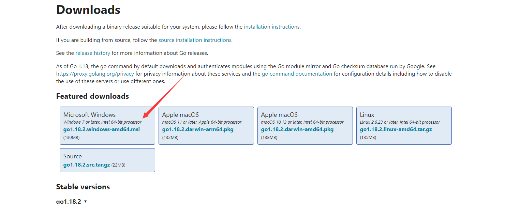

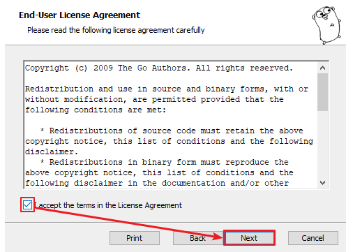

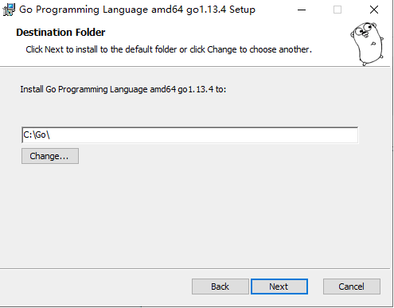

选择 D盘或者C盘进行安装

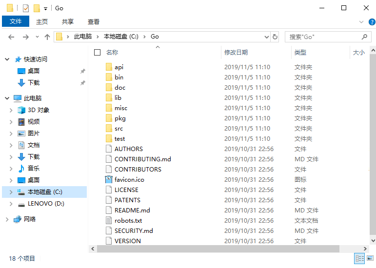

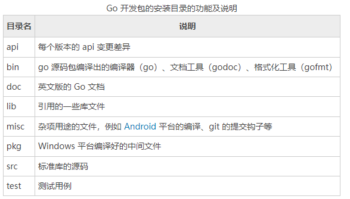

## 1.2 查看安装

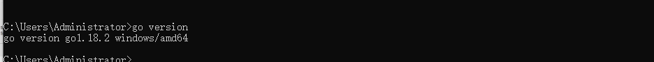

输出以上的信息就是安装成功了

## 1.3 配置代理

>go env -w GO111MODULE=on
>go env -w GOPROXY=https://goproxy.cn,direct

输入以下信息就可以了

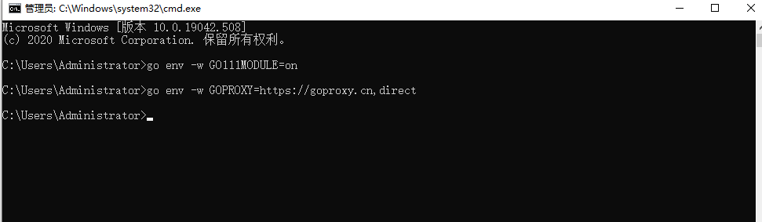

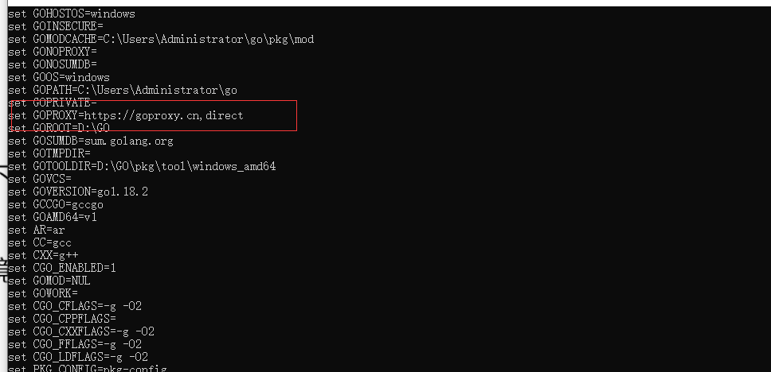

# 2. Goland安装

## 2.1 软件安装

https://www.jetbrains.com.cn/go/download/other.html  选择 2021.2.2版本下载，便于后续安装无限制重置试用时间

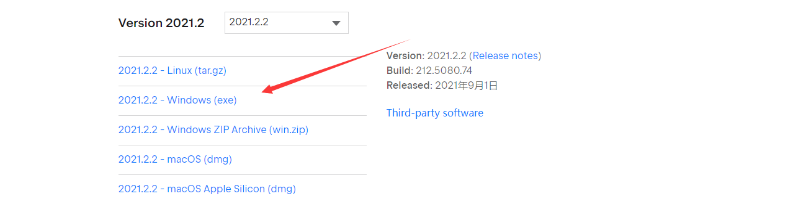

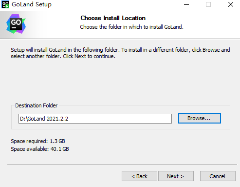

直接点击试用

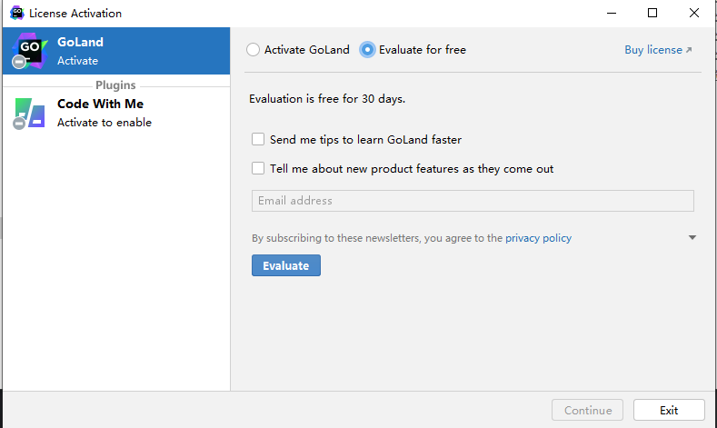

## 2.2 插件安装

https://plugins.zhile.io  安装 IDE Eval Reset 插件，后续就可以无限制重置试用期了

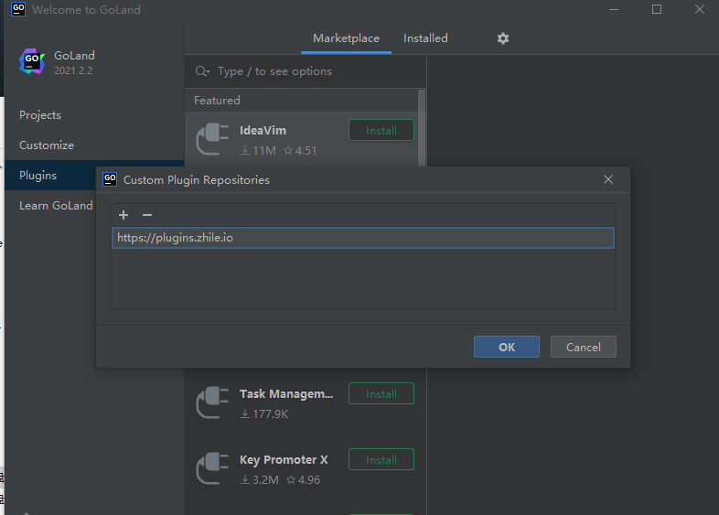

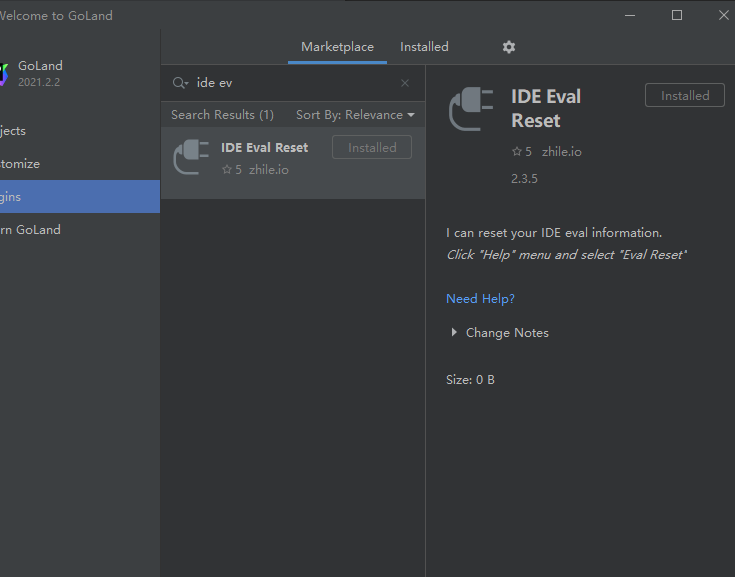

## 2.3 项目创建以及配置

### 2.3.1 创建GOPATH

在任意盘新建一个文件夹，用于存放编译的代码以及拉取的包数据 **（GOMOD默认存储依赖路径）**

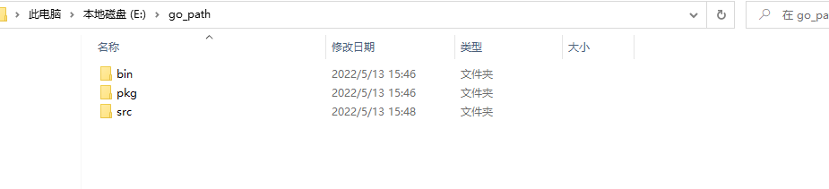

添加环境变量

### 2.3.2 创建项目

设置代理，因为网络防火墙的存在，可能导致 go 在拉取第三方包时无法直接通过 go get 拉取，通过 GOPROXY 的中间代理来拉取包

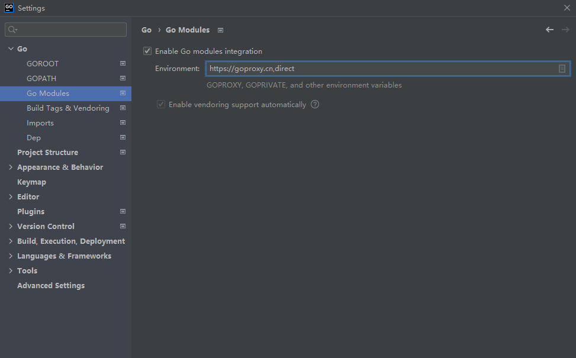

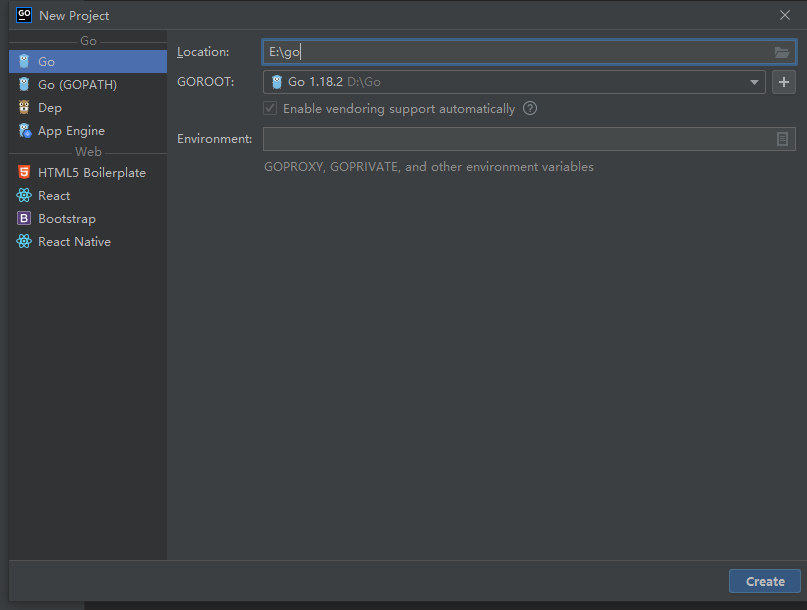

勾选是 index entire GOPATH以所有整个GOPATH，不然无法导入包

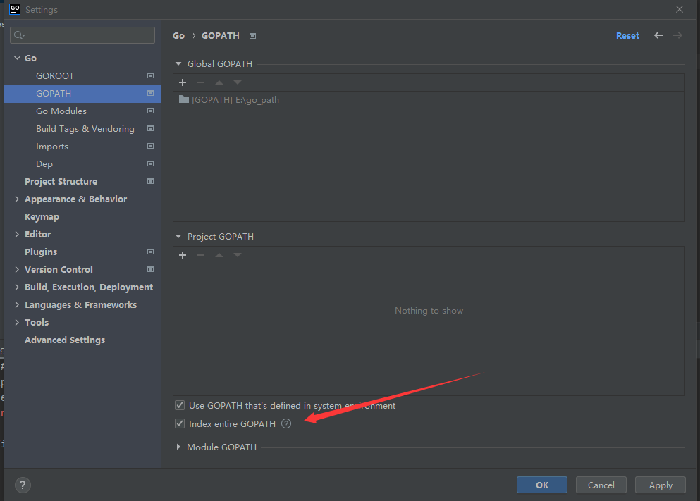

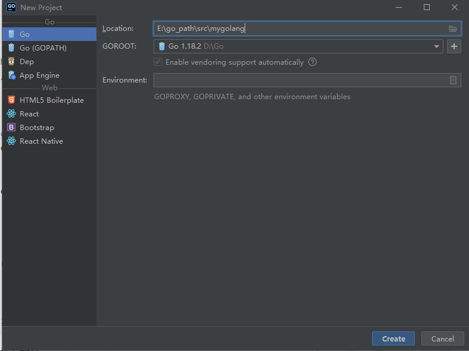

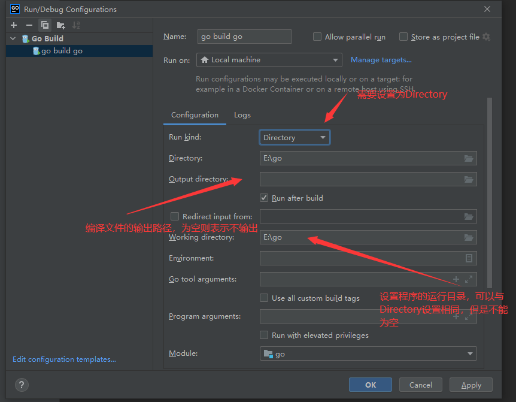

### 2.3.3 问题说明

注意创建 go 文件时自动生成的包名，需要设置为 main 包进行执行

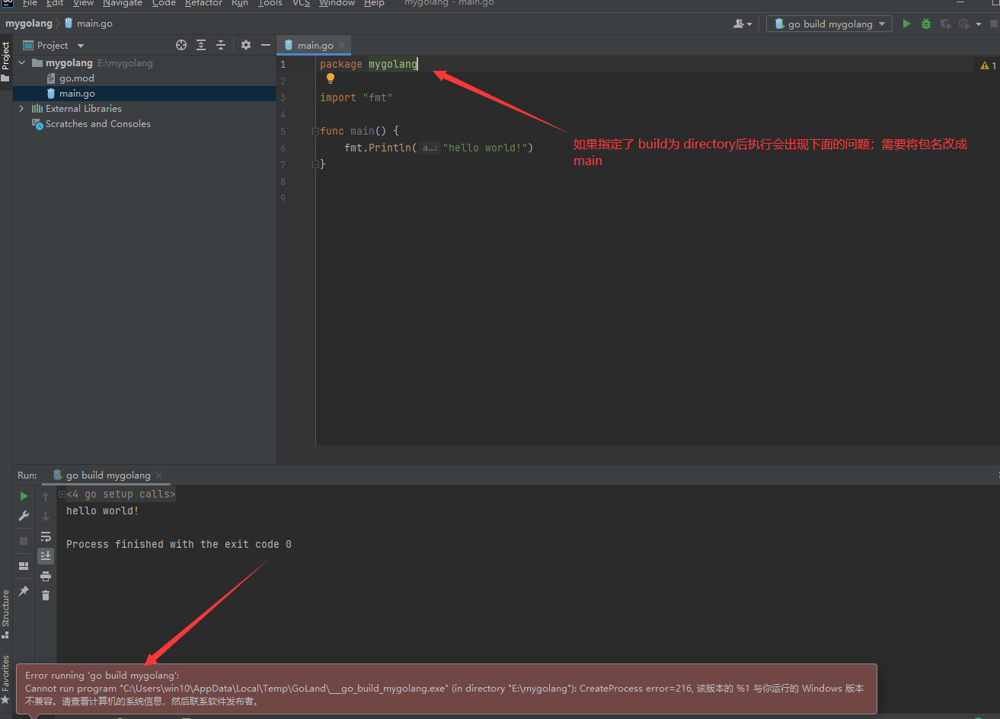

## 2.4 路径说明

- GOROOT：为golang的安装路径，安装好golang之后就有了
- GOPATH：
  - 存放sdk以外的第三方库
  - 自己收藏的可复用的代码
  - 其中$GOPATH目录约定三个子目录：
    - src存放源码
    - pkg编译时生成的中间文件
    - bin编译后生成的可执行文件

Goland中Project GOPATH以及Global GOPATH

- Project GOPATH：只有当前这一个项目可以使用
- Global GOPATH：所有的项目都可以使用，也可以在环境变量中配置

# 3. 安装Idea+GO插件

安装GO的插件，后续就跟以上操作一样了

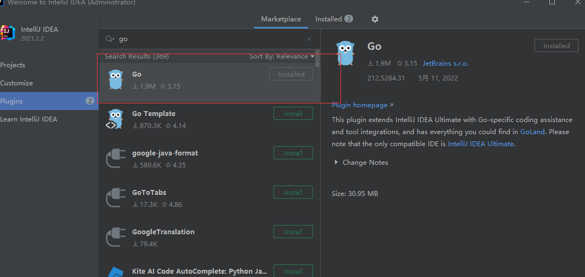

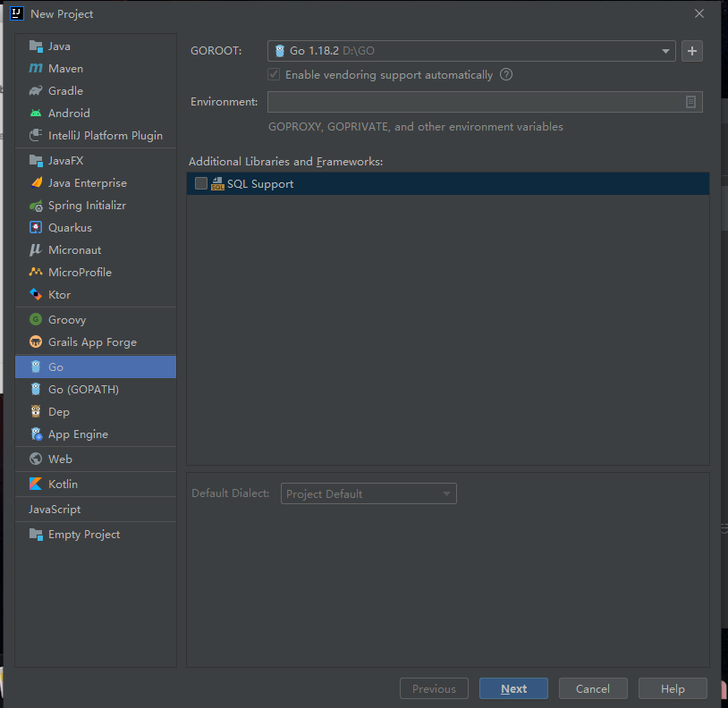

