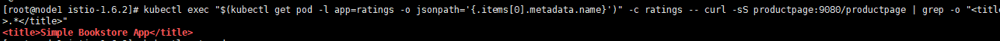
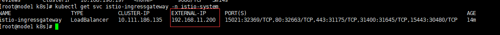
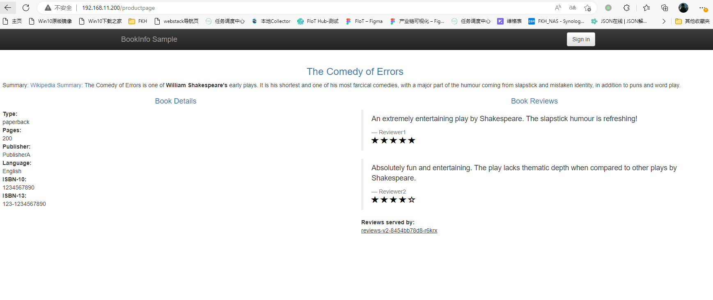
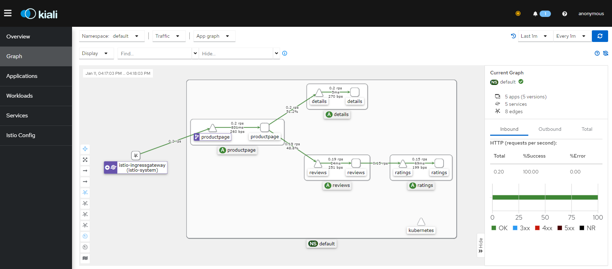
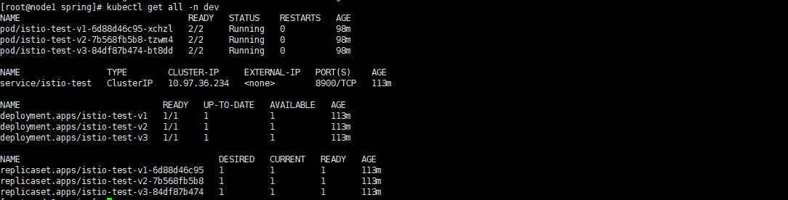
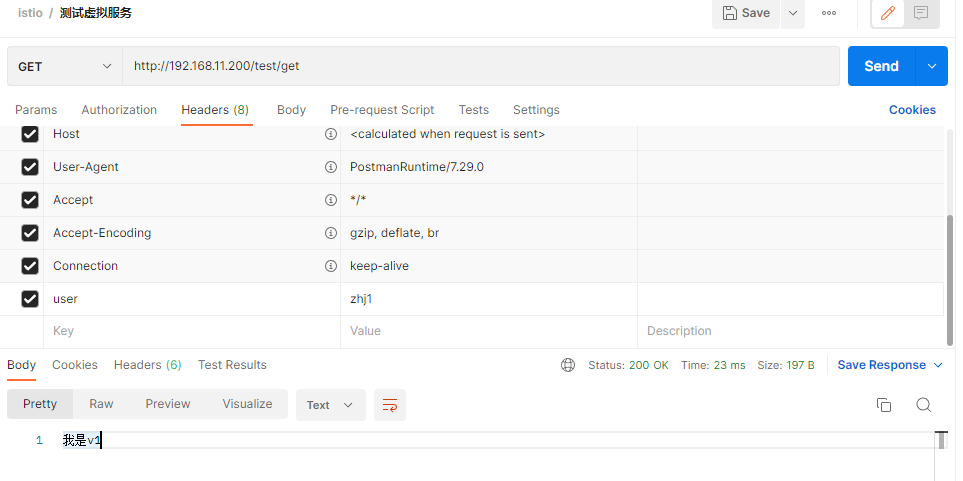
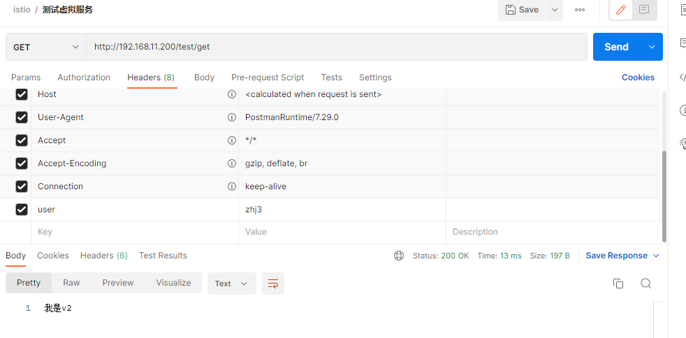
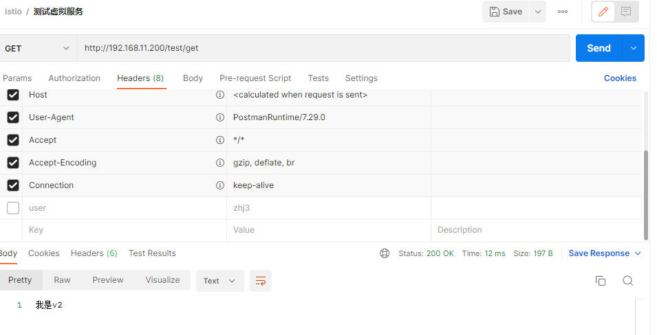
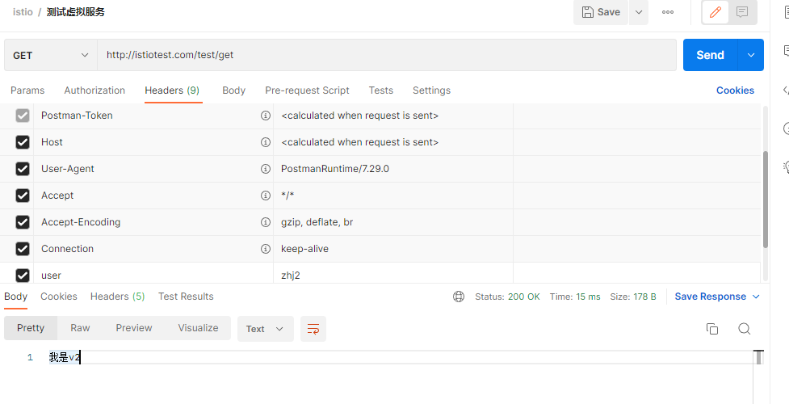
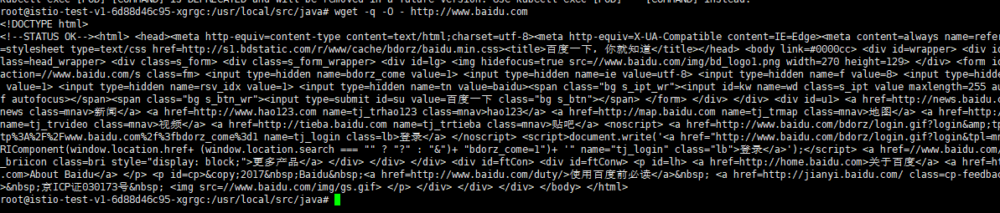

# 1. 安装Istio

在安装istio时需要准备k8s环境，这里我准备的是k8s1.23.0+calico网络插件+istio1.16.1版本

## 1.1 下载istio

下载指定版本以及平台的架构，注意istio的版本和k8s的是否兼容，我这里k8s的版本为 **1.23.0** ，下载istio:1.16.1版本做测试

可以升级 **k8s** 的版本 （https://blog.csdn.net/zfw_666666/article/details/126371912）

> curl -L https://istio.io/downloadIstio | ISTIO_VERSION=1.16.1 TARGET_ARCH=x86_64 sh -
>
> 或通过下面的路径下载
>
> https://github.com/istio/istio/releases/download/1.16.1/istio-1.16.1-linux-amd64.tar.gz
>
> 或者
>
> https://github.com/istio/istio/releases/tag/1.16.1

## 1.2 配置环境变量

进入到安装路径，暴露环境变量出去

- sample：目录下的示例应用
- bin：istioctl客户端二进制文件

>  export PATH=$PWD/bin:$PATH 

需要给命名空间打上标签才可以注入Envoy代理

>  kubectl label namespace default istio-injection=enabled

## 1.3 启动istio

启动istio，目前按照demo的方式进行部署，主要用于测试环境，如果使用默认的模式需要配置的东西过多

> istioctl profile --list  #可以查看有哪些模式提供部署

> istioctl install --set profile=demo -y

## 1.4 拉取镜像

在启动istio的时候可能会出来拉取镜像拉取不下来的情况，可以查看容器启动的日志都需要哪些镜像，然后复制出来通过docker进行手动拉取，如果docker拉取失败可以多试几次

- grafana/grafana:6.5.2
- docker.io/istio/pilot:1.6.2
- docker.io/istio/proxyv2:1.6.2
- docker.io/jaegertracing/all-in-one:1.16
- quay.io/kiali/kiali:v1.18
- docker.io/prom/prometheus:v2.15.1

## 1.5 部署Bookinfo

### 部署服务

部署bookinfo示例项目，如果出现镜像拉取失败的情况可以自己单独进行拉取

```cmd
kubectl apply -f https://raw.githubusercontent.com/istio/istio/release-1.16/samples/bookinfo/platform/kube/bookinfo.yaml
```


> kubectl exec "$(kubectl get pod -l app=ratings -o jsonpath='{.items[0].metadata.name}')" -c ratings -- curl -sS productpage:9080/productpage | grep -o "<title>.*</title>"



### 暴露服务

istio使用 **LoadBalancer** 来对服务进行暴露，这时候需要安装 **metallb** 用于服务负载的转发，如果已经配置好了就不需要再进行安装了

```cmd
kubectl apply -f https://raw.githubusercontent.com/metallb/metallb/v0.13.7/config/manifests/metallb-native.yaml
```

等待pod启动成功

```cmd
kubectl wait --namespace metallb-system \
                --for=condition=ready pod \
                --selector=app=metallb \
                --timeout=90s
```

创建地址池，注意分配的ip地址池是否跟主机在一个网段

```yaml
apiVersion: metallb.io/v1beta1
kind: IPAddressPool
metadata:
  name: ip-pool
  namespace: metallb-system
spec:
  addresses:
  - 192.168.11.200-192.168.11.250   #分配给LB的IP池,在k8s集群的网络段，但是不要占用k8s用到的ip地址
  
---
apiVersion: metallb.io/v1beta1
kind: L2Advertisement
metadata:
  name: l2adver
  namespace: metallb-system
```

安装 **bookinfo-gateway**

```taml
kubectl apply -f https://raw.githubusercontent.com/istio/istio/release-1.16/samples/bookinfo/networking/bookinfo-gateway.yaml
```

如果安装了 **metallb** 插件之后，查询Service的 **EXTERNAL-IP** 会分配一个ip地址使用

> kubectl get svc istio-ingressgateway -n istio-system

> EXTERNAL-IP/productpage #浏览器进行访问





## 1.6 部署kiali

kiali的使用会去拉取容器中 **Prometheus** 服务的信息，所以在部署 **kiali** 时还需要部署 **Prometheus**，这时就可以在界面看到调用链了；注意拉取镜像时可能会很慢，等待一段时间就可以了

> kubctl apply -f  https://raw.githubusercontent.com/istio/istio/release-1.16/samples/addons/prometheus.yaml 

>  kubectl apply -f https://raw.githubusercontent.com/istio/istio/release-1.16/samples/addons/kiali.yaml



# 2. 流量管理

在学习流量管理之前先搭建三个 **springboot** 服务，分为 istio:v1、istio:v2、istio:v3，用来进行学习，这里我直接将服务提交到了镜像仓库中可以进行拉取 **haijun1998/istio:v1** 可以分别拉取服务就行部署，这里我将示例服务名称取名为 **istio-test**，现在我们先部署测试服务到 **k8s** 中

## 2.1 测试服务部署

### 创建命名空间

> kubectl create ns dev
>
> kubectl label ns dev istio-injection=enabled #打上需要注入代理的标签

### istio-test.yaml

创建 **pod** 以及 **Service**

```yaml
apiVersion: v1
kind: Service
metadata:
  name: istio-test
  namespace: dev
  labels:
    app: istio-test
    service: istio-test
spec:
  ports:
    - port: 8900
      name: http
      targetPort: 8080
  selector:
    app: istio-test
---
apiVersion: apps/v1
kind: Deployment
metadata:
  name: istio-test-v1
  namespace: dev
  labels:
    app: istio-test
    version: v1
spec:
  replicas: 1
  selector:
    matchLabels:
      app: istio-test
      version: v1
  template:
    metadata:
      namespace: dev
      labels:
        app: istio-test
        version: v1
    spec:
      containers:
        - name: istio-test-v1
          image: haijun1998/istio:v1
          imagePullPolicy: IfNotPresent
          ports:
            - containerPort: 8080
---
apiVersion: apps/v1
kind: Deployment
metadata:
  name: istio-test-v2
  namespace: dev
  labels:
    app: istio-test
    version: v2
spec:
  replicas: 1
  selector:
    matchLabels:
      app: istio-test
      version: v2
  template:
    metadata:
      namespace: dev
      labels:
        app: istio-test
        version: v2
    spec:
      containers:
        - name: istio-test-v2
          image: haijun1998/istio:v2
          imagePullPolicy: IfNotPresent
          ports:
            - containerPort: 8080
---
apiVersion: apps/v1
kind: Deployment
metadata:
  name: istio-test-v3
  namespace: dev
  labels:
    app: istio-test
    version: v3
spec:
  replicas: 1
  selector:
    matchLabels:
      app: istio-test
      version: v3
  template:
    metadata:
      namespace: dev
      labels:
        app: istio-test
        version: v3
    spec:
      containers:
        - name: ratings
          image: haijun1998/istio:v3
          imagePullPolicy: IfNotPresent
          ports:
            - containerPort: 8080
```



### istio-test-gateway.yaml

下面创建 **Gateway** 和 **VirtualService** 用于进行流量管理，网关关联上默认的 **istio** 控制器，虚拟服务关联上网关；虚拟服务的命名空间可以不需要跟服务在同一个命名空间中，因为解析服务时通过 **FQDN** 进行解析，例如：设置命名空间为 **test** 如果是用短名称（像 istio-test这样，而不是istio-test.dev.svc.cluster.local），istio会将其解析为 **istio-test.test.svc.cluster.local** 这种格式，一般建议使用 **FQDN** 进行配置

```yaml
apiVersion: networking.istio.io/v1alpha3
kind: Gateway
metadata:
  name: istio-test-gateway
spec:
  selector:
    istio: ingressgateway # use istio default controller
  servers:
  - port:
      number: 80 #使用istio默认的端口
      name: http
      protocol: HTTP
    hosts:
    - "*" #匹配所有的域名
---
apiVersion: networking.istio.io/v1alpha3
kind: VirtualService
metadata:
  name: istio-test-virual-service
spec:
  hosts:
  - "istiotest.com" #主机名可以直接用*来进行匹配，正式环境的话一般用域名
  gateways:
  - istio-test-gateway
  http:
  - match: #通过头部字段进行流量切换，如果头部中有 user:zhj1 将流量转发到v1版本
    - headers:
        user: 
          exact: zhj1
    route:
    - destination:
        host: istio-test.dev.svc.cluster.local #写k8s中pod对应的Service
        subset: v1 #这个subset是通过目标规则进行配置的
  - route: #如果没有匹配到user字段，那么直接走v2
    - destination:
        host: istio-test.dev.svc.cluster.local
        subset: v2
```

### istio-test-destination.yaml

注意点：目标规则的配置需要跟服务再同一个命名空间下，否则会出现找不到服务的情况

```yaml
apiVersion: networking.istio.io/v1alpha3
kind: DestinationRule
metadata:
  name: istio-test-destination-rule
  namespace: dev
spec:
  host: istio-test #关联上pod的Service名称
  trafficPolicy: #默认采用随机的方式进行负载
    loadBalancer:
      simple: RANDOM
  subsets: #配置子集，这也是上面虚拟服务用到的配置
  - name: v1 #名称为v1版本，去进行匹配 Service 下面关联pod标签有 version:v1的版本
    labels:
      version: v1
  - name: v2
    labels:
      version: v2
    trafficPolicy:
      loadBalancer:
        simple: ROUND_ROBIN
  - name: v3
    labels:
      version: v3
```

### 测试

调用 **istio-ingressgateway** 服务暴露出去的ip地址，上面通过 **Gateway** 关联了 **80** 端口，所以可以直接访问，下面就是通过头部字段进行区别找到 **Service** 后走哪一个版本的 **pod** 










## 2.2 虚拟服务（Virtual Service）

可以将一个服务根据版本通过虚拟服务进行分别部署，例如：v1版本、v2版本，部署两个容器，对流量管理时可以将80%请求路由v1，20%的路由到v2；**将流量动态的路由到多个版本中**；例如：**istio-test**服务分别部署了三个版本 **v1、v2、v3** 三个版本，每一次访问 **istio-test** 服务初始策略都是采用轮询的方式，我们可以根据对应的策略将流量转发到指定的服务上。

**总结：虚拟服务定义了如何将请求分发到K8s的Service服务上，目标路径则定义了请求到了Service之后如何选择对应的Pod**

具体可以配置属性信息说明： https://istio.io/latest/zh/docs/reference/config/networking/virtual-service/#HTTPMatchRequest

| 字段     | 类型                                                         | 说明                                                         |
| -------- | ------------------------------------------------------------ | ------------------------------------------------------------ |
| hosts    | String[]                                                     | 将流量发送到的目标主机，可以是带通配符前缀的 DNS 名称或 IP 地址；k8s平台使用短名称时（istio-test，而不是istio-test.dev.svc.cluster.local）需要注意，istio会通过命名空间来解释请求的路径，例如：istio-test短名称，会根据名空间的dev来进行选择；如果配置 *****，那么会对所有服务都进行匹配，这里的hosts可以不用是istio服务注册的一部分，只是为了让没有路由到网格内部的虚拟主机进行建模 |
| gateway  | String[]                                                     | 应用这些路由匹配规则的网关名称，其它命名空间中的网关可以也被使用例如：test/istio-gateway |
| http     | [HTTPRoute][https://istio.io/latest/zh/docs/reference/config/networking/virtual-service/#HTTPRoute] | http路由匹配规则                                             |
| tls      | [TLSRoute][https://istio.io/latest/zh/docs/reference/config/networking/virtual-service/#TLSRoute] | tls和https流量的路由规则配置                                 |
| tcp      | [TCPRoute][https://istio.io/latest/zh/docs/reference/config/networking/virtual-service/#TCPRoute] | tcp路由规则配置                                              |
| exportTo | string[]                                                     | 此虚拟服务导出的命名空间列表                                 |

### 请求头匹配

```yaml
apiVersion: networking.istio.io/v1alpha3
kind: VirtualService  #创建一个资源
metadata:
  name: istio-test
spec:
  hosts:
  - reviews #虚拟服务的主机名，可以ip、dns名称、fqdn、通配符（*）
  gateway: #配置需要
  - istio-test-gateway
  http:
  - match: #匹配条件
    - headers: #匹配http头部中字段
        end-user:
          exact: jason #来自于 jason用户的所有请求都到 reviews:v2的版本
    route:
    - destination: #路由规则，匹配到头部字段后路由转发给v2
        host: istio-test #配置k8s Service的名称
        port:
          number: 8900  #端口号
     retries: #请求失败每次重试3次，超时2秒
       attempts: 3
       perTryTimeout: 2s
  - route: #如果头部不含有就匹配v3版本
    - destination:
        host: reviews
        subset: v2 #通过目标规则配置的子集配置
```

### 请求url匹配

```yaml
spec:
  hosts:
  - istio-test #虚拟服务的主机名，可以ip、dns名称、fqdn、通配符（*）
  http:
  - match: #匹配条件
    - url:
        prefix: /istio-v2 #url前缀进行匹配，也可以使用正则表达式
    route:
    - destination: #路由规则，匹配到头部字段后路由转发给v2
        host: istio-test
        subset: v2
  - match:
    - url:
        prefix: /istio-v3 #url前缀进行匹配
    route:
    - destination:
        host: istio-test
        subset: v3
```

### 权重百分比匹配

在 **A/B** 测试和 **金丝雀发布** 非常有用，下面的信息就是通过 **路由优先级** 匹配的规则从上往下匹配，75%的流量会转发到v1版本，剩下的25%的流量会到v2版本

```yaml
spec:
  hosts:
  - reviews
  http:
  - route:
    - destination:
        host: reviews
        subset: v1
      weight: 75 #配置权重信息
    - destination:
        host: reviews
        subset: v2
      weight: 25
```

## 2.3 路由优先级

在 **虚拟服务** 的路由规则进行匹配时是从上往下进行路由的匹配，如果第一个 **match** 进行匹配时没有匹配到，第二项没有 **match** 那么流量将会直接流入到 **v3** 版本中

```yaml
spec:
  hosts:
  - istio-test #虚拟服务的主机名，可以ip、dns名称、fqdn、通配符（*）
  http:
  - match: #匹配条件
    - url:
        prefix: /istio-v2 #url前缀进行匹配
    route:
    - destination: #路由规则，匹配到头部字段后路由转发给v2
        host: istio-test
        subset: v2
  - route:
    - destination:
        host: istio-test
        subset: v3
```

## 2.4 目标规则（Destination Rule）

虚拟服务所定义的是如何将流量给定到目标地址，而目标地址则用于将特定流量 **子集** 指定到目标地址；例如：**istio-test** 部署了一个 **Service** 服务，而下面定义了三个版本  **v1**、**v2**、**v3**，通过 **虚拟服务** 我们可以定义将请求转发给名叫 **istio-test** 的 **Service** 服务，但是 **Service** 服务下面又分别有三个版本的 **pod**，每个 **pod** 通过标签中的 **version：v1** 版本进行区分，而 **目标地址** 就是定义从三个版本中选择哪一个具体的 **pod**

具体属性配置：https://istio.io/latest/zh/docs/reference/config/networking/destination-rule/

```yaml
apiVersion: networking.istio.io/v1alpha3
kind: DestinationRule
metadata:
  name: my-destination-rule
  namespace: dev #命名空间，注意命名空间一定要和 Service 在同一个命名空间下，否则访问会出现503找不到服务的情况
spec:
  host: istio-test #对应的 Service 名称
  trafficPolicy: #默认采取的随机方式
    loadBalancer:
      simple: RANDOM
  subsets: #配置服务的子集
  - name: v1 #服务子集的名称
    labels:
      version: v1
  - name: v2
    labels:
      version: v2
    trafficPolicy:
      loadBalancer:
        simple: ROUND_ROBIN #权重的方式
  - name: v3
    labels:
      version: v3
```

### 负载均衡

目前负载均衡的算法有以下几种：v1和v3默认采用随机的方式进行选择，而v2则采用循环算法进行选择

- RANDOM：随机获取
- ROUND_ROBIN：循环选择
- WEIGHTED_LEAST_REQUEST：最少请求算法， 最少请求负载均衡器使用 O(1) 算法，该算法随机选择两个健康主机并选择活动请求较少的主机

### 熔断器

熔断器的目的就是配置服务在超出自身能够处理极限的情况下的一些策略，例如：redis最大处理100个连接，如果并发同时开启了200个连接，那么必然会导致redis服务资源的使用率变高，然后发生服务崩溃的场景，在这种情况下我们通过熔断器的配置策略可以使 **Envoy** 去配置如果超过了100的并发，那么就直接丢弃掉服务或者做其它的处理

以下的例子配置了tcp连接的最大连接数100，连接超时时间30秒，tcp长连接的时间7200秒，心跳75秒检查一次

```yaml
apiVersion: networking.istio.io/v1alpha3
kind: DestinationRule
metadata:
  name: redis
  namespace: dev
spec:
  host: myredissrv.dev.svc.cluster.local
  trafficPolicy:
    connectionPool:
      tcp:
        maxConnections: 100 #最大tcp连接
        connectTimeout: 30ms #连接超时时间
        tcpKeepalive:
          time: 7200s
          interval: 75s
```

下面是给 **istiotest** 服务，最大的tcp连接为 100，**http2** 协议最大并发数为1000

```yaml
apiVersion: networking.istio.io/v1alpha3
kind: DestinationRule
metadata:
  name: myapp-destination-rule
  namespace: dev
spec:
  host: istiotest.dev.svc.cluster.local
  trafficPolicy:
    connectionPool:
      tcp:
        maxConnections: 100 #100个http1的请求
      http:
        http2MaxRequests: 1000 #http2协议最大并发数1000
        maxRequestsPerConnection: 10
    outlierDetection:
      consecutive5xxErrors: 7 #连续7次出现502、503、504主机将会被弹出15分钟
      interval: 5m
      baseEjectionTime: 15m
```


## 2.5 网关（Gateway）

下面这个示例istio会将host为 **myapp.com** ，的流量通过443端口流入到服务网格之中，但是没有为请求指定任何的路由规则。想要配置规则就需要将其绑定到 **虚拟服务** 上；这里的 **istio-ingressgateway** 选择器相当于将当前网关绑定到了 **istio** 的网关上，因为 **istio-ingressgateway** 我们是向外暴露了ip地址的，所以当 **ingressgateway** 获取到请求之后会转发到 **ext-host-gwy** 然后再转发给对应的服务

```yaml
apiVersion: networking.istio.io/v1alpha3
kind: Gateway
metadata:
  name: ext-host-gwy
spec:
  selector:
    app: istio-ingressgateway #配置需要选择的控制器，例如上面例子中我们就使用的istio提供的ingressgateway
  servers:
  - port:
      number: 443
      name: https
      protocol: HTTPS
    hosts:
    - myapp.com
    tls: #配置tls证书
      mode: SIMPLE
      serverCertificate: /tmp/tls.crt
      privateKey: /tmp/tls.key
```

## 2.6 服务入口（Service Entry）

服务入口所做的事，是将一个不存在于服务网格里面的服务，添加到 **istio内部维护的注册中心** ，添加了入口之后，**Envoy代理** 就可以向服务发送流量，具体配置说明：https://istio.io/latest/zh/docs/reference/config/networking/service-entry/#ServiceEntry-Location

```yaml
apiVersion: networking.istio.io/v1alpha3
kind: ServiceEntry
metadata:
  name: external-app-service-entry
  namespace: dev #注意命名空间
spec:
  hosts:
  - 'www.baidu.com' #指定外部服务的host，可以使用完全限定名或者通配符,这里使用百度作为例子
  ports: #指定服务的端口信息
  - number: 80
    name: http
    protocol: HTTP
  location: MESH_EXTERNAL #服务应该为网格外还是网格内
  resolution: DNS #如何解析与服务关联的网络端点ip地址，STATIC使用静态ip地址、DNS尝试异步查询环境DNS来解析ip地址、DNS_ROUND_ROBIN仅在需要启动新连接时使用返回
```

> kubectl apply -f istio-service-entry.yaml


进入容器中试着ping一下百度，服务条目已经注入进来了；


如果我们对服务入口进行改动一下然后登录看看还能否访问到百度

```yaml
apiVersion: networking.istio.io/v1alpha3
kind: ServiceEntry
metadata:
  name: external-app-service-entry
  namespace: dev #注意命名空间
spec:
  hosts:
  - 'www.baidu.com' #指定外部服务的host，可以使用完全限定名或者通配符,这里使用百度作为例子
  ports: #指定服务的端口信息
  - number: 80
    name: http
    protocol: HTTP
  location: MESH_EXTERNAL #服务应该为网格外还是网格内
  resolution: STATIC #如何解析与服务关联的网络端点ip地址，STATIC使用静态ip地址、DNS尝试异步查询环境DNS来解析ip地址、DNS_ROUND_ROBIN仅在需要启动新连接时使用返回
  endpoints:
  - address: 172.20.10.10
```

会发现一直访问不通，删除之后又可以了，是因为解析hosts的方式原来是采用DNS进行解析，后面改成静态的方式解析，同时指定了 **172.20.10.10** 的一个内网ip地址就无法访问了




## 2.7 Sidecar

默认情况下，**Istio** 让每个 **Envoy** 代理都可以访问来自其它关联的服务的所有端口的请求，然后转发到对应的服务中，我们可以通过 **Sidecar** 去进行配置的调整，例如：

- 微调Envoy代理接受的端口协议集
- 限制Envoy代理可以访问的服务集合

例如下面的配置，声明了一个全局默认配置 **istio-config**，它限制了所有的命名空间的配置，允许出口流量只能流向同一个命名空间以及 **dev** 命名空间下的服务；**注意：同一个命名空间只能允许有一个Sidecar的配置，而且root命名空间下的sidecar配置将应用于所有没有配置的命名空间**

```yaml
apiVersion: networking.istio.io/v1alpha3
kind: Sidecar
metadata:
  name: default
  namespace: istio-config
spec:
  egress:
  - hosts:
    - "./*"
    - "dev/*"
```

下面的例子，在命名空间 **prod-us1** 中覆盖了上面的全局变量，允许 **prod-us1** 出口流量到 **prod-us1、prod-apis、dev** 的命名空间

```yaml
apiVersion: networking.istio.io/v1alpha3
kind: Sidecar
metadata:
  name: default
  namespace: prod-us1
spec:
  egress:
  - hosts:
    - "prod-us1/*"
    - "prod-apis/*"
    - "dev/*"
```


## 2.8 网络弹性

### 超时

配置访问服务的超时时间为10秒

```yaml
apiVersion: networking.istio.io/v1alpha3
kind: VirtualService
metadata:
  name: istio-test-virtual-service
spec:
  hosts:
  - "myistio.com"
  http:
  - route:
    - destination:
        host: istio-test.dev.svc.cluster.local
        subset: v1
    timeout: 10s
```

### 重试

配置重试策略，如果调用失败了可以发起3次重试，每次重试2秒的超时时间

```yaml
apiVersion: networking.istio.io/v1alpha3
kind: VirtualService
metadata:
  name: istio-test-virtual-service
spec:
  hosts:
  - "myistio.com"
  http:
  - route:
    - destination:
        host: istio-test.dev.svc.cluster.local
        subset: v1
    retries:
      attempts: 3
      perTryTimeout: 2s
```

### 熔断器

熔断器的测试例子：https://istio.io/latest/zh/docs/tasks/traffic-management/circuit-breaking/

下面配置一个简单的熔断策略，最大的并发数为100

```yaml
apiVersion: networking.istio.io/v1alpha3
kind: DestinationRule
metadata:
  name: myapp-destination-rule
spec:
  host: istio-test.dev.svc.cluster.local
  subsets:
  - name: v1
    labels:
      version: v1
    trafficPolicy:
      connectionPool:
        tcp:
          maxConnections: 100
```

### 故障注入

故障注入用于来模仿一个服务的故障情况，例如：

- 延迟：时间故障，用于模拟一个网络延迟和超载的服务
- 终止：崩溃失败，用于模拟服务宕机之后的情况

下面的例子是注入了一个 **HTTP** 延迟故障，模拟千分之一的请求后触发一个5秒的延迟，用于模拟上游服务高负载

```yaml
apiVersion: networking.istio.io/v1alpha3
kind: VirtualService
metadata:
  name: istio-test-virtual-service
spec:
  hosts:
  - "myistio.com"
  http:
  - fault:
      delay:
        percentage:
          value: 0.1
        fixedDelay: 5s
    route:
    - destination:
        host: istio-test.dev.svc.cluster.local
        subset: v1
```

延迟故障的参考属性字段

```yaml
fault:
  delay:
    percentage: #请求的百分比，指定 [0.0, 100.0] 范围内的百分比
      value: 0.1
    fixedDelay: 5s #在转发请求之前添加固定延迟，格式：1h/1m/1s/1ms。必须 >=1 毫秒。
```

终止故障，下列用于在 1000个请求中返回一个状态为400的错误代码

```yaml
apiVersion: networking.istio.io/v1alpha3
kind: VirtualService
metadata:
  name: istio-test-virtual-service
spec:
  hosts:
  - "myistio.com"
  http:
  - fault:
      abort:
        percentage:
          value: 0.1
        httpStatus: 400 #状态码
    route:
    - destination:
        host: istio-test.dev.svc.cluster.local
        subset: v1
```

终止故障的参考属性字段

```yaml
fault:
  abort:
    percentage: #请求的百分比，指定 [0.0, 100.0] 范围内的百分比
      value: 0.1
    httpStatus: 400 #http状态码
    grpcStatus: 200 #grpc的状态码
```

### 错误恢复

错误恢复是指某个服务在发生错误之后如何将后续流量转移正确的服务之上的处理。例如：A服务调用B服务，这时候B服务分为了v1、v2、v3版本，现在负载均衡器选择了v1版本进行转发流量，但是v1版本出现了故障宕机了，但是后续的v2、v3还是正常的就需要将后续的流量转移到v2、v3上面

参考官方的流量迁移：https://istio.io/latest/zh/docs/tasks/traffic-management/traffic-shifting/

例如下面的例子：我们可以将对应的故障的服务的权重进行修改，如果v1的pod出现了故障，那么我们可以将 **weight** 的权重修改为100进行后续的流量转移，等待v1修复好之后再修改 **50** 的权重；这里我们可以引入 **金丝雀发布**

```yaml
apiVersion: networking.istio.io/v1beta1
kind: VirtualService
spec:
  hosts:
  - "host"
  http:
  - route:
    - destination:
        host: istio-test.dev.svc.cluster.local
        subset: v1
      weight: 50
    - destination:
        host: istio-test.dev.svc.cluster.local
        subset: v3
      weight: 50
```

## 2.9 金丝雀发布

假设我们有一个已部署的 **helloworld** 服务 **v1** 版本，我们想要测试（或简单上线）新版本 **v2**。使用 Kubernetes，可以通过简单地更新服务的 Deployment 中的镜像并自动进行部署来上线新版本的 **helloworld** 服务；如果能够保证暂停v2版本之后，v1的版本还有足够的副本在运行，那么就能够保持 **金丝雀发布** 对系统的影响很小；这种方式我们一般称为：蓝/绿发布或者红/黑发布

理解起来就是：原有 **Helloworld** 有10个副本，现在上线2个v2版本，v1的版本就需要进行缩容到8个副本，如果在停止v2版本后，v1的版本必须要自动增加到10个，否则就会影响原有系统的运行。这种方式是使用副本的扩容来进行流量的管理

### 使用Istio

使用普通的 **Kubernetes** 方式进行 **金丝雀发布** 需要对副本的数量进行控制，而使用istio就可以很容易的对流量进行管理，只需要设置权重就行，例如：创建v1和v2版本的 **istio-test**

```yaml
apiVersion: v1
kind: Service
metadata:
  name: istio-test
  namespace: dev
  labels:
    app: istio-test
    service: istio-test
spec:
  ports:
    - port: 8900
      name: http
      targetPort: 8080
  selector:
    app: istio-test
---
apiVersion: apps/v1
kind: Deployment
metadata:
  name: istio-test-v1
  namespace: dev
  labels:
    app: istio-test
    version: v1
spec:
  replicas: 1
  selector:
    matchLabels:
      app: istio-test
      version: v1
  template:
    metadata:
      namespace: dev
      labels:
        app: istio-test
        version: v1
    spec:
      containers:
        - name: istio-test-v1
          image: haijun1998/istio:v1
          imagePullPolicy: IfNotPresent
          ports:
            - containerPort: 8080
---
apiVersion: apps/v1
kind: Deployment
metadata:
  name: istio-test-v2
  namespace: dev
  labels:
    app: istio-test
    version: v2
spec:
  replicas: 1
  selector:
    matchLabels:
      app: istio-test
      version: v2
  template:
    metadata:
      namespace: dev
      labels:
        app: istio-test
        version: v2
    spec:
      containers:
        - name: istio-test-v2
          image: haijun1998/istio:v2
          imagePullPolicy: IfNotPresent
          ports:
            - containerPort: 8080
```

这样的方式 90%的流量会先到v1，10%的流量会到v2的版本，无论配置了多少个副本；如果需要切回正常的流量只需要修改 **权重**

```yaml
apiVersion: networking.istio.io/v1alpha3
kind: DestinationRule
metadata:
  name: istio-test-destination-rule
  namespace: dev
spec:
  host: istio-test
  subsets:
  - name: v1
    labels:
      version: v1
  - name: v2
    labels:
      version: v2
---
apiVersion: networking.istio.io/v1alpha3
kind: VirtualService
metadata:
  name: istio-test-virual-service
spec:
  hosts:
  - "istiotest.com"
  - "192.168.11.200"
  gateways:
  - istio-test-gateway
  http:
   - route:
    - destination:
        host: istio-test.dev.svc.cluster.local
        subset: v1
      weight: 90 #配置权重90%流量
    - destination:
        host: istio-test.dev.svc.cluster.local
        subset: v2
      weight: 10
```

### 配置自动缩放

使用istio了我们不在需要保持副本数的比例，我们就可以安全的设置 k8s 的HPA来管理两个版本的**Deployment** 的副本，当CPU的使用率达到了50%后就会对pod进行自动扩容，如果小于CPU使用率降低后，pod就会进行自动缩容

>  kubectl autoscale deployment istio-test-v1 --cpu-percent=50 --min=1 --max=10 -n dev

>  kubectl autoscale deployment istio-test-v2 --cpu-percent=50 --min=1 --max=10 -n dev

