# win11+wsl2安装k8s

## 1. 安装docker

w11上面安装docker-desktop的方案，具体的安装步骤：

- 先开启系统的镜像支持
- 更新wsl
- 设置默认版本为2
- 安装docker-desktop，修改安装位置等，否则就是安装在c盘中

https://blog.csdn.net/weixin_43915643/article/details/127682250?spm=1001.2014.3001.5501

## 2. 测试docker

直接打开cmd控制台，输入 **docker version** 就可以直接使用 **docker** 命令了

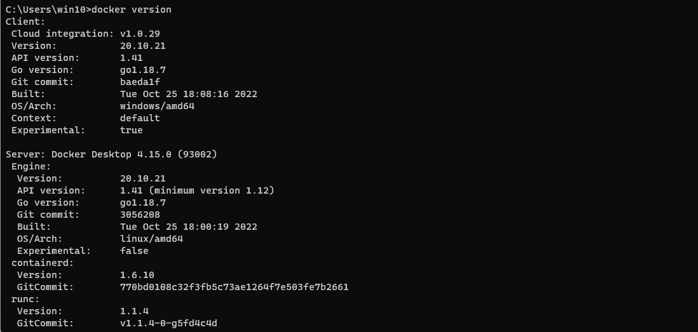

## 6. 安装KinD

目前通过官方文档，提供了两次安装方案，**KinD** 和 **Minikube** 两种方式，具体区别可以百度，这里学习的话就不需要探究太多，我们采用 **KinD** 的方式进行安装比较简单

注意：k8s的官方文档是在wsl2中安装了一个ubuntu的子系统，通过子系统创建集群，这里我安装时会有问题就是集群节点一直启动不了，所以我采用在 win11系统中安装 **kinD** 来创建集群，最后效果都一样；**KinD** 是通过**docker** 容器为每一个 **node** 节点都模拟出了一个容器运行，如果创建三个集群，那么就会有三个 **容器** 运行在docker上面，而k8s就运行在容器中，所以如果要暴露服务的话，必须要把在容器中的k8s端口通过容器给映射出去。

> https://kubernetes.io/blog/2020/05/21/wsl-docker-kubernetes-on-the-windows-desktop/

下面的方式是在ubuntu操作系统里面执行的步骤，启动集群节点时会有问题，改成在win11中直接启动

```cmd
# 下载kind
curl -Lo ./kind https://github.com/kubernetes-sigs/kind/releases/download/v0.7.0/kind-linux-amd64
# 设置权限
chmod +x ./kind
# 将下载的执行文件放到bin路径下，可以直接使用命令
sudo mv ./kind /usr/local/bin/
```

访问下面的链接将 **kinD** 下载到win11系统中，将下载的文件改名为 **kind.exe** 然后拷贝到 **C:\\Windows** 路径下面，通过cmd就可以使用 **kinD** 的命令了

>  https://kind.sigs.k8s.io/dl/v0.16.0/kind-windows-amd64

### 6.1 单机部署

创建一个测试集群

- extraPortMappings：将docker容器的端口映射到主机上面

```cmd
# Create the cluster and give it a name (optional)
kind create cluster --name wslkind
```

```yaml
kind: Cluster
apiVersion: kind.x-k8s.io/v1alpha4
name: k8s-test
nodes:
- role: control-plane
  image: kindest/node:v1.21.1
  kubeadmConfigPatches:
  - |
    kind: InitConfiguration
    nodeRegistration:
      kubeletExtraArgs:
        node-labels: "ingress-ready=true"
  extraPortMappings:
  - containerPort: 80
    hostPort: 80
    protocol: TCP
  - containerPort: 443
    hostPort: 443
    protocol: TCP
networking:
  apiServerAddress: "127.0.0.1"
  apiServerPort: 6443
```

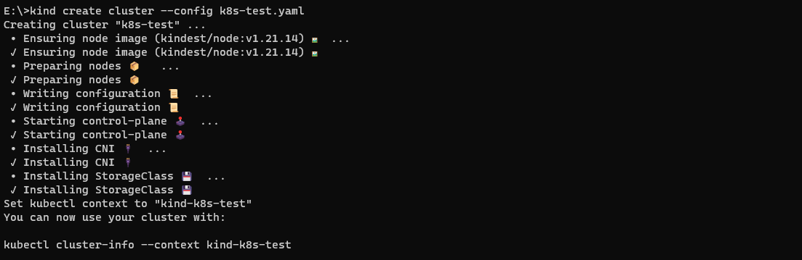

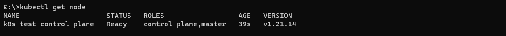

> kubectl cluster-info #查看集群的信息

访问： [https://127.0.0.1:49153](https://127.0.0.1:49153/) 就可以看到已经部署成功了


### 6.2 多机部署

```cmd
#删除原来的单机
kind delete cluster --name wslkind
```

创建 **kind-3nodes.yaml** 配置文件

- extraPortMappings：用于端口映射

```yaml
kind: Cluster
apiVersion: kind.x-k8s.io/v1alpha4
name: kind-3node
nodes:
- role: control-plane
  image: kindest/node:v1.21.14@sha256:9d9eb5fb26b4fbc0c6d95fa8c790414f9750dd583f5d7cee45d92e8c26670aa1
  kubeadmConfigPatches:
  - |
    kind: InitConfiguration
    nodeRegistration:
      kubeletExtraArgs:
        node-labels: "ingress-ready=true"
  extraPortMappings:
  - containerPort: 80
    hostPort: 80
    protocol: TCP
  - containerPort: 443
    hostPort: 443
    protocol: TCP
- role: worker
  image: kindest/node:v1.21.14@sha256:9d9eb5fb26b4fbc0c6d95fa8c790414f9750dd583f5d7cee45d92e8c26670aa1
- role: worker
  image: kindest/node:v1.21.14@sha256:9d9eb5fb26b4fbc0c6d95fa8c790414f9750dd583f5d7cee45d92e8c26670aa1
```

```cmd
#创建集群
kind create cluster --name wslkindmultinodes --config ./kind-3nodes.yaml
```

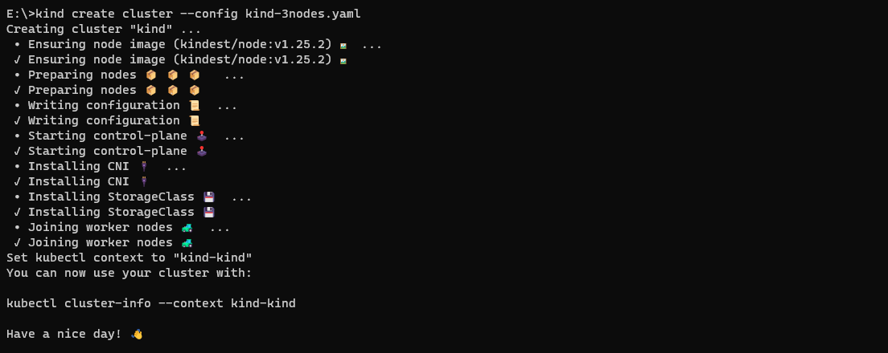


## 7. 安装仪表盘

创建 **recomended.yaml** 文件

```yaml
apiVersion: v1
kind: Namespace
metadata:
  name: kubernetes-dashboard

---

apiVersion: v1
kind: ServiceAccount
metadata:
  labels:
    k8s-app: kubernetes-dashboard
  name: kubernetes-dashboard
  namespace: kubernetes-dashboard

---

kind: Service
apiVersion: v1
metadata:
  labels:
    k8s-app: kubernetes-dashboard
  name: kubernetes-dashboard
  namespace: kubernetes-dashboard
spec:
  ports:
    - port: 443
      targetPort: 8443
  selector:
    k8s-app: kubernetes-dashboard

---

apiVersion: v1
kind: Secret
metadata:
  labels:
    k8s-app: kubernetes-dashboard
  name: kubernetes-dashboard-certs
  namespace: kubernetes-dashboard
type: Opaque

---

apiVersion: v1
kind: Secret
metadata:
  labels:
    k8s-app: kubernetes-dashboard
  name: kubernetes-dashboard-csrf
  namespace: kubernetes-dashboard
type: Opaque
data:
  csrf: ""

---

apiVersion: v1
kind: Secret
metadata:
  labels:
    k8s-app: kubernetes-dashboard
  name: kubernetes-dashboard-key-holder
  namespace: kubernetes-dashboard
type: Opaque

---

kind: ConfigMap
apiVersion: v1
metadata:
  labels:
    k8s-app: kubernetes-dashboard
  name: kubernetes-dashboard-settings
  namespace: kubernetes-dashboard

---

kind: Role
apiVersion: rbac.authorization.k8s.io/v1
metadata:
  labels:
    k8s-app: kubernetes-dashboard
  name: kubernetes-dashboard
  namespace: kubernetes-dashboard
rules:
  # Allow Dashboard to get, update and delete Dashboard exclusive secrets.
  - apiGroups: [""]
    resources: ["secrets"]
    resourceNames: ["kubernetes-dashboard-key-holder", "kubernetes-dashboard-certs", "kubernetes-dashboard-csrf"]
    verbs: ["get", "update", "delete"]
    # Allow Dashboard to get and update 'kubernetes-dashboard-settings' config map.
  - apiGroups: [""]
    resources: ["configmaps"]
    resourceNames: ["kubernetes-dashboard-settings"]
    verbs: ["get", "update"]
    # Allow Dashboard to get metrics.
  - apiGroups: [""]
    resources: ["services"]
    resourceNames: ["heapster", "dashboard-metrics-scraper"]
    verbs: ["proxy"]
  - apiGroups: [""]
    resources: ["services/proxy"]
    resourceNames: ["heapster", "http:heapster:", "https:heapster:", "dashboard-metrics-scraper", "http:dashboard-metrics-scraper"]
    verbs: ["get"]

---

kind: ClusterRole
apiVersion: rbac.authorization.k8s.io/v1
metadata:
  labels:
    k8s-app: kubernetes-dashboard
  name: kubernetes-dashboard
rules:
  # Allow Metrics Scraper to get metrics from the Metrics server
  - apiGroups: ["metrics.k8s.io"]
    resources: ["pods", "nodes"]
    verbs: ["get", "list", "watch"]

---

apiVersion: rbac.authorization.k8s.io/v1
kind: RoleBinding
metadata:
  labels:
    k8s-app: kubernetes-dashboard
  name: kubernetes-dashboard
  namespace: kubernetes-dashboard
roleRef:
  apiGroup: rbac.authorization.k8s.io
  kind: Role
  name: kubernetes-dashboard
subjects:
  - kind: ServiceAccount
    name: kubernetes-dashboard
    namespace: kubernetes-dashboard

---

apiVersion: rbac.authorization.k8s.io/v1
kind: ClusterRoleBinding
metadata:
  name: kubernetes-dashboard
roleRef:
  apiGroup: rbac.authorization.k8s.io
  kind: ClusterRole
  name: kubernetes-dashboard
subjects:
  - kind: ServiceAccount
    name: kubernetes-dashboard
    namespace: kubernetes-dashboard

---

kind: Deployment
apiVersion: apps/v1
metadata:
  labels:
    k8s-app: kubernetes-dashboard
  name: kubernetes-dashboard
  namespace: kubernetes-dashboard
spec:
  replicas: 1
  revisionHistoryLimit: 10
  selector:
    matchLabels:
      k8s-app: kubernetes-dashboard
  template:
    metadata:
      labels:
        k8s-app: kubernetes-dashboard
    spec:
      containers:
        - name: kubernetes-dashboard
          image: kubernetesui/dashboard:v2.0.0-rc6
          imagePullPolicy: Always
          ports:
            - containerPort: 8443
              protocol: TCP
          args:
            - --auto-generate-certificates
            - --namespace=kubernetes-dashboard
            # Uncomment the following line to manually specify Kubernetes API server Host
            # If not specified, Dashboard will attempt to auto discover the API server and connect
            # to it. Uncomment only if the default does not work.
            # - --apiserver-host=http://my-address:port
          volumeMounts:
            - name: kubernetes-dashboard-certs
              mountPath: /certs
              # Create on-disk volume to store exec logs
            - mountPath: /tmp
              name: tmp-volume
          livenessProbe:
            httpGet:
              scheme: HTTPS
              path: /
              port: 8443
            initialDelaySeconds: 30
            timeoutSeconds: 30
          securityContext:
            allowPrivilegeEscalation: false
            readOnlyRootFilesystem: true
            runAsUser: 1001
            runAsGroup: 2001
      volumes:
        - name: kubernetes-dashboard-certs
          secret:
            secretName: kubernetes-dashboard-certs
        - name: tmp-volume
          emptyDir: {}
      serviceAccountName: kubernetes-dashboard
      nodeSelector:
        "beta.kubernetes.io/os": linux
      # Comment the following tolerations if Dashboard must not be deployed on master
      tolerations:
        - key: node-role.kubernetes.io/master
          effect: NoSchedule

---

kind: Service
apiVersion: v1
metadata:
  labels:
    k8s-app: dashboard-metrics-scraper
  name: dashboard-metrics-scraper
  namespace: kubernetes-dashboard
spec:
  ports:
    - port: 8000
      targetPort: 8000
  selector:
    k8s-app: dashboard-metrics-scraper

---

kind: Deployment
apiVersion: apps/v1
metadata:
  labels:
    k8s-app: dashboard-metrics-scraper
  name: dashboard-metrics-scraper
  namespace: kubernetes-dashboard
spec:
  replicas: 1
  revisionHistoryLimit: 10
  selector:
    matchLabels:
      k8s-app: dashboard-metrics-scraper
  template:
    metadata:
      labels:
        k8s-app: dashboard-metrics-scraper
      annotations:
        seccomp.security.alpha.kubernetes.io/pod: 'runtime/default'
    spec:
      containers:
        - name: dashboard-metrics-scraper
          image: kubernetesui/metrics-scraper:v1.0.3
          ports:
            - containerPort: 8000
              protocol: TCP
          livenessProbe:
            httpGet:
              scheme: HTTP
              path: /
              port: 8000
            initialDelaySeconds: 30
            timeoutSeconds: 30
          volumeMounts:
          - mountPath: /tmp
            name: tmp-volume
          securityContext:
            allowPrivilegeEscalation: false
            readOnlyRootFilesystem: true
            runAsUser: 1001
            runAsGroup: 2001
      serviceAccountName: kubernetes-dashboard
      nodeSelector:
        "beta.kubernetes.io/os": linux
      # Comment the following tolerations if Dashboard must not be deployed on master
      tolerations:
        - key: node-role.kubernetes.io/master
          effect: NoSchedule
      volumes:
        - name: tmp-volume
          emptyDir: {}

```

> kubectl apply -f recommended.yaml  #启动仪表盘，等到节点启动成功
>
> kubectl proxy  #开启一个代理服务，让浏览器可以访问 
>
> http://localhost:8001/api/v1/namespaces/kubernetes-dashboard/services/https:kubernetes-dashboard:/proxy/#/login

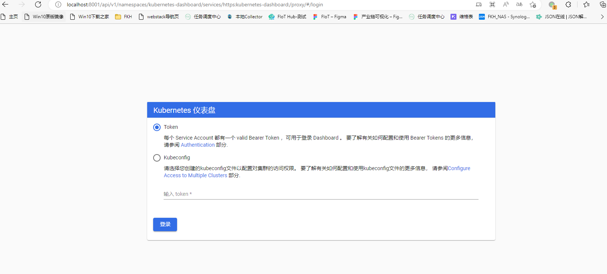

## 8. ingress-nginx转发服务

上面通过 **kubectl proxy** 进行服务暴露会占用cmd的进行服务，如果退出服务也就跟着退出了，如果在服务器上面我们的服务暴露可以通过 **Service** 指定为 **NordePort** 然后通过节点地址进行访问；但是我们通过 **win11** + **docker-desktop + kinD** 的方式就访问不到，因为 **kinD** 是通过docker容器来模拟节点的方式运行 **k8s** 所以我们可以通过 **端口映射+ingress-nginx** 的方式进行转发服务

### 8.1 安装ingress-nginx

创建ingress-nginx，官提供的配置下面

```cmd
kubectl apply -f https://raw.githubusercontent.com/kubernetes/ingress-nginx/master/deploy/static/provider/kind/deploy.yaml
```

这里在拉取镜像时会出现一个小问题会导致k8s在启动pod的时候一直拉取不到镜像，后面排查问题是因为ingress启动的时候需要的镜像是下面这个样子

```text
registry.k8s.io/ingress-nginx/kube-webhook-certgen:v20220916-gd32f8c343@sha256:39c5b2e3310dc4264d638ad28d9d1d96c4cbb2b2dcfb52368fe4e3c63f61e10f
```

镜像包名称是 **registry.k8s.io/ingress-nginx/kube-webhook-certgen** ，tag是 **v20220916-gd32f8c343**，但是 k8s拉取下来只有镜像包名，tag显示为 <NONE\> 所以导致容器一直拉取不到，所以解决方案是先手动拉取然后在修改tag标签

```cmd
docker pull registry.k8s.io/ingress-nginx/kube-webhook-certgen:v20220916-gd32f8c343
docker tag registry.k8s.io/ingress-nginx/kube-webhook-certgen registry.k8s.io/ingress-nginx/kube-webhook-certgen:v20220916-gd32f8c343

docker pull registry.k8s.io/ingress-nginx/controller:v1.5.1
docker tag registry.k8s.io/ingress-nginx/controller registry.k8s.io/ingress-nginx/controller registry.k8s.io/ingress-nginx/controller:v1.5.1
```

下面拉取了镜像之后就有了 tag名称，需要手动将镜像包加载到容器中的 k8s里面去，然后k8s就不会再去拉取镜像包了

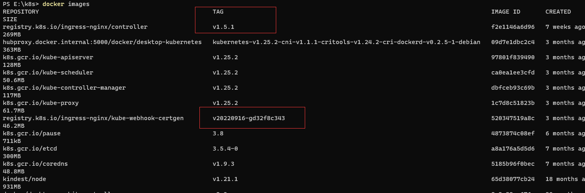

加载镜像包到k8s容器中

```cmd
kind load docker-image registry.k8s.io/ingress-nginx/controller registry.k8s.io/ingress-nginx/controller:v1.5.1 --name 集群名称

kind load docker-image registry.k8s.io/ingress-nginx/kube-webhook-certgen:v20220916-gd32f8c343 --name 集群名称
```

查看容器中是否有镜像包了，这时候k8s拉取pod就没问题了，如果 **registry.k8s.io/ingress-nginx/controller** 镜像出现解析不了的情况可以通过 **docker search nginx-ingress-controller** 搜索一下可以使用的 **nginx**

```cmd
docker exec -it k8s-test-control-plane crictl images
```

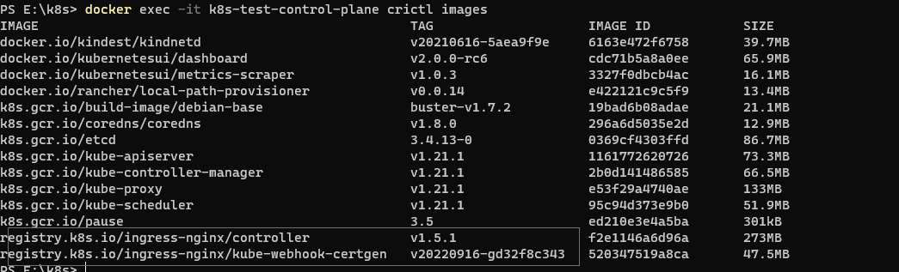

等待服务启动完成

```cmd
kubectl wait --namespace ingress-nginx --for=condition=ready pod --selector=app.kubernetes.io/component=controller --timeout=90s
```

### 8.2 转发dashboard

业务服务的转发可以参考这里的博客：https://zhuanlan.zhihu.com/p/539924966，我现在做一个转发 **dashboard** 的例子

创建 **ingress.yaml** 配置文件，注意 **kinD** 创建集群的时候我将 **node** 节点的 **80** 端口给映射出来了，而**ingress-nginx** 部署时通过 **ingress-nginx-controller** 开放出了 **80** 端口，所以具体的服务暴露就是：**docker映射出80端口，然后部署一个ingress-nginx-controller的Service使用NodePort类型开放出80端口** 这样就可以通过 **localhost** 进行访问了

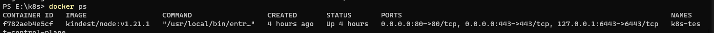

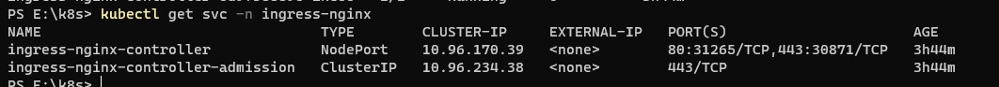

```yaml
apiVersion: networking.k8s.io/v1
kind: Ingress
metadata:
  name: example-ingress
  namespace: kubernetes-dashboard
  annotations:
    kubernetes.io/ingress.class: "nginx"
    nginx.ingress.kubernetes.io/backend-protocol: "HTTPS"
    nginx.ingress.kubernetes.io/force-ssl-redirect: "false"
    nginx.ingress.kubernetes.io/use-regex: "true"
spec:
  rules:
    - http:
        paths:
          - pathType: Prefix
            path: / #匹配 /的路径
            backend:
              service:
                name: kubernetes-dashboard
                port:
                  number: 443
```

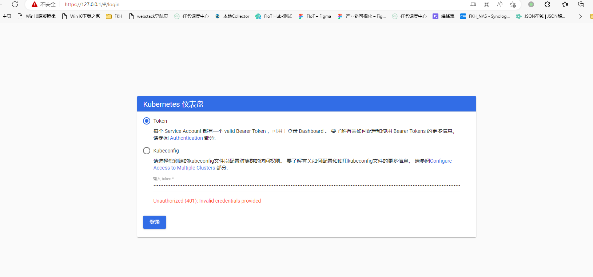

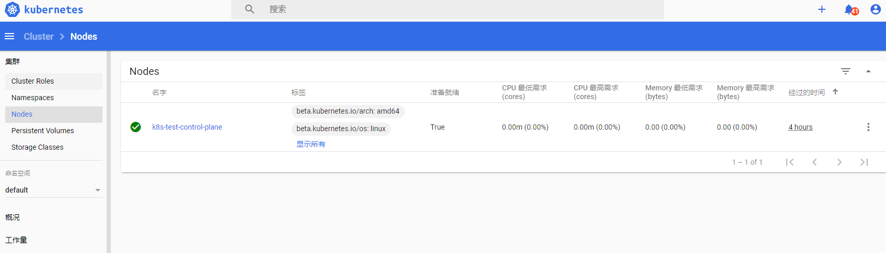

先进行节点的容器里面

> docker exec -it 节点id bash

再通过下面的命令获取到token，就可以登录dashboard了

```cmd
kubectl describe secrets -n kube-system $(kubectl -n kube-system get secret | awk '/dashboard-admin/{print $1}')
```

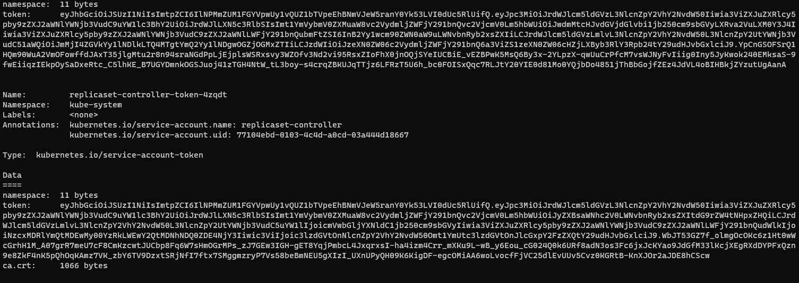

