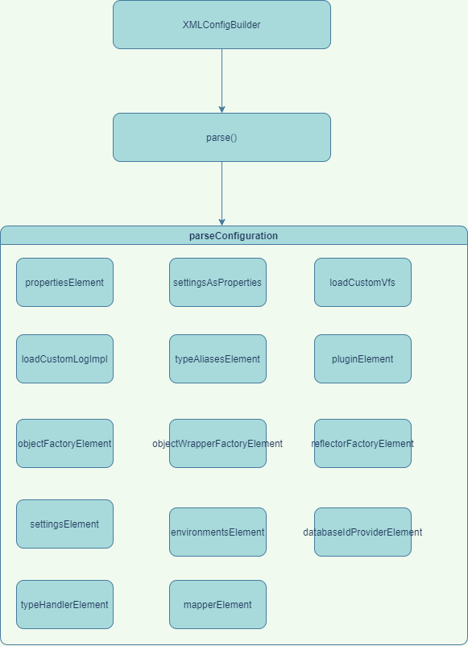

# mybatis之xml文件解析

## 1. 实例代码

下面通过自定义一个 `mybatis-config.xml` 配置来指定 `mybatis` 的配置信息相关，然后构造一个 `SqlSessionFactory` 工厂对象来解析对应的配置信息，下面来看看 `mybatis` 是如何对配置信息进行解析的

```java
public class MybatisApplicationMain {

  public static void main(String[] args) throws IOException {
    String resource = "mybatis-config.xml";
    InputStream config = Resources.getResourceAsStream(resource);
    //根据xml文件进行构建
    SqlSessionFactory sqlSessionFactory = new SqlSessionFactoryBuilder().build(config);
    SqlSession sqlSession = sqlSessionFactory.openSession();
    AccountMapper accountMapper = sqlSession.getMapper(AccountMapper.class);
    //返回代理对象 MapperProxy
    Account account = accountMapper.getAccount(1L);
  }
}
```

```xml
<?xml version="1.0" encoding="UTF-8" ?>
<!DOCTYPE configuration
  PUBLIC "-//mybatis.org//DTD Config 3.0//EN"
  "http://mybatis.org/dtd/mybatis-3-config.dtd">
<configuration>
  <!--<properties>-->
  <!--  <property name="" value=""/>-->
  <!--</properties>-->

  <!--<settings>-->
  <!--  <setting name="useColumnLabel" value="true"/>-->
  <!--  <setting name="vfsImpl" value=""/>-->
  <!--</settings>-->

  <!--<typeAliases>-->
  <!--  &lt;!&ndash;注意两个标签的顺序&ndash;&gt;-->
  <!--  <typeAlias type="com.oracle" alias="ee"/>-->
  <!--  <package name="com"/>-->
  <!--</typeAliases>-->

  <!--<typeHandlers>-->
  <!--  <typeHandler handler="" />-->
  <!--</typeHandlers>-->

  <environments default="development">
    <environment id="development">
      <transactionManager type="JDBC"/>
      <dataSource type="POOLED">
        <property name="driver" value="com.mysql.cj.jdbc.Driver"/>
        <property name="url" value="jdbc:mysql://localhost:3306/db1?serverTimezone=UTC"/>
        <property name="username" value="root"/>
        <property name="password" value="root"/>
      </dataSource>
    </environment>
  </environments>

  <mappers>
    <mapper resource="mappers/AccountMapper.xml"/>
  </mappers>
</configuration>
```

## 2. SqlSessionFactory

`SqlSessionFactoryBuilder` 通过一个文件流的方式进行解析配置文件然后进行构造，`XMLConfigBuilder` 解析出一个 `Configuration` 对象来构造出 `DefaultSqlSessionFactory` 工厂对象

```java
public class SqlSessionFactoryBuilder {

  public SqlSessionFactory build(InputStream inputStream, String environment, Properties properties) {
    try {
      /**
       * 根据xml进行解析配置，创建一个 XPathParser 解析器
       */
      XMLConfigBuilder parser = new XMLConfigBuilder(inputStream, environment, properties);
      return build(parser.parse());
    } catch (Exception e) {
      throw ExceptionFactory.wrapException("Error building SqlSession.", e);
    } finally {
      ErrorContext.instance().reset();
      try {
        inputStream.close();
      } catch (IOException e) {
        // Intentionally ignore. Prefer previous error.
      }
    }
  }

  /**
   * 创建一个默认的SqlSession工厂对象，通过工厂对象来开启 Sql的会话
   */
  public SqlSessionFactory build(Configuration config) {
    return new DefaultSqlSessionFactory(config);
  }
}
```

## 3. XMLConfigBuilder

```java
public class XMLConfigBuilder extends BaseBuilder {
  private boolean parsed;
  //xml的解析器
  private final XPathParser parser;
  //指定的环境
  private String environment;
  //反射工厂
  private final ReflectorFactory localReflectorFactory = new DefaultReflectorFactory();
}
```

### 3.1 parse()

```java
public Configuration parse() {
    if (parsed) {
        throw new BuilderException("Each XMLConfigBuilder can only be used once.");
    }
    parsed = true;
    //获取到 configuration 节点进行对应的配置解析
    parseConfiguration(parser.evalNode("/configuration"));
    return configuration;
}
```

### 3.2 parseConfiguration()

下面是 `XMLConfigBuilder` 类解析配置文件之后，对配置中的标签解析的流程，调用了 `14` 个方法



下面是方法调用之后处理对应的逻辑，这里每一个处理出来的数据都会被存储在 `Configuration` 对象中，下面我们只看比较重要的解析方法

```java
private void parseConfiguration(XNode root) {
    try {
      // issue #117 read properties first
      /**
       * 获取到 xml文件中 properties 的地址将下面的子节点 property解析成 Properties对象
       * 将 properties节点中的属性 resource以及url 加载出来，最后统一合并成 Properties（HashTable对象）
       * 最后设置到 Configuration对象中的 variables 属性
       */
      propertiesElement(root.evalNode("properties"));

      /**
       * 加载 settings 节点的配置信息，会检查 Configuration 对象中是否有对应属性的 set 方法
       */
      Properties settings = settingsAsProperties(root.evalNode("settings"));
      /**
       * 获取到 settings 里面的 vfsImpl的实现类进行加载，设置到 Configuration vfsImpl属性
       */
      loadCustomVfs(settings);
      /**
       * 设置自定义的日志实现
       */
      loadCustomLogImpl(settings);
      /**
       * 处理别名标签中子标签 package和typeAlias 前者是获取对应包下所有的子类，后面是单独的某个类的别名；然后根据 @Alias 注解来确定别名
       * 但是要注意两个标签的顺序 typeAlias在前；
       */
      typeAliasesElement(root.evalNode("typeAliases"));
      /**
       * 解析配置文件中的插件 Interceptor 添加到 configuration中
       */
      pluginElement(root.evalNode("plugins"));
      /**
       * 解析 ObjectFactory 对象，用于通过class创建实例化对象
       */
      objectFactoryElement(root.evalNode("objectFactory"));
      /**
       * 解析包装对象工厂，用于后续对结果集进行处理时，创建映射进行包装
       */
      objectWrapperFactoryElement(root.evalNode("objectWrapperFactory"));
      /**
       * 解析反射工厂
       */
      reflectorFactoryElement(root.evalNode("reflectorFactory"));
      /**
       * 将上面解析出来的 settings 配置给 configuration 对象进行赋值
       */
      settingsElement(settings);
      // read it after objectFactory and objectWrapperFactory issue #631
      /**
       * 解析环境，其中包含了 事务工厂以及数据源，以下默认的类型会创建的事务工厂以及数据源
       * JDBC: JdbcTransactionFactory
       * POOLED: PooledDataSourceFactory
       * 构建环境对象 Environment设置 事务工厂以及数据源
       */
      environmentsElement(root.evalNode("environments"));
      /**
       * 设置数据源的提供对象，主要用于设置 数据库Id到 configuration中
       */
      databaseIdProviderElement(root.evalNode("databaseIdProvider"));
      /**
       * 处理类型处理器，通过注解 MappedTypes 来标记java类型的处理，根据 MappedJdbcTypes 来对应jdbc的类型，然后关联上处理器
       * 最后存储的类型是 Map<JavaType, Map<JdbcType, Handler>> 首先通过java中的类型进行获取到对应的jdbc类型然后获取到对应的Handler
       */
      typeHandlerElement(root.evalNode("typeHandlers"));
      //解析mappers的文件
      mapperElement(root.evalNode("mappers"));
    } catch (Exception e) {
      throw new BuilderException("Error parsing SQL Mapper Configuration. Cause: " + e, e);
    }
  }
```

#### typeAliasesElement()

解析别名的方法，在 `mybatis` 中，可以通过指定包的别名进行注册，后续使用时就只需要通过别名就可以进行操作

```java
private void typeAliasesElement(XNode parent) {
    if (parent != null) {
      for (XNode child : parent.getChildren()) {
        //获取到节点是否是 package，如果是获取到 name属性，然后注册到别名工厂中。会获取到所有的class类，如果类有 @Alias 注解取其中的值作为别名名称
        if ("package".equals(child.getName())) {
          String typeAliasPackage = child.getStringAttribute("name");
          //处理包的别名进行注册
          configuration.getTypeAliasRegistry().registerAliases(typeAliasPackage);
        } else {
          //获取到 typeAlias 标签将别名获取出来进行注册
          String alias = child.getStringAttribute("alias");
          String type = child.getStringAttribute("type");
          try {
            //将class类型进行注册
            Class<?> clazz = Resources.classForName(type);
            if (alias == null) {
              //没有指定别名，会去读取class对象上面的 @Alias 注解进行注册
              typeAliasRegistry.registerAlias(clazz);
            } else {
              typeAliasRegistry.registerAlias(alias, clazz);
            }
          } catch (ClassNotFoundException e) {
            throw new BuilderException("Error registering typeAlias for '" + alias + "'. Cause: " + e, e);
          }
        }
      }
    }
  }
```

#### pluginElement()

```java
private void pluginElement(XNode parent) throws Exception {
    if (parent != null) {
      for (XNode child : parent.getChildren()) {
        //获取到拦截器的名称
        String interceptor = child.getStringAttribute("interceptor");
        Properties properties = child.getChildrenAsProperties();
        //通过别名工厂进行解析class类，会进行判断是否有别名被注册到工厂中
        Interceptor interceptorInstance = (Interceptor) resolveClass(interceptor).getDeclaredConstructor().newInstance();
        interceptorInstance.setProperties(properties);
        configuration.addInterceptor(interceptorInstance);
      }
    }
  }
```

#### environmentsElement()

```java
private void environmentsElement(XNode context) throws Exception {
    if (context != null) {
      if (environment == null) {
        //解析出默认环境的id
        environment = context.getStringAttribute("default");
      }
      for (XNode child : context.getChildren()) {
        String id = child.getStringAttribute("id");
        //获取到对应环境的配置
        if (isSpecifiedEnvironment(id)) {
          //解析出事务工厂对象，会通过别名进行解析，没解析出会抛出异常
          TransactionFactory txFactory = transactionManagerElement(child.evalNode("transactionManager"));
          //解析出数据源工厂
          DataSourceFactory dsFactory = dataSourceElement(child.evalNode("dataSource"));
          //获取到数据源
          DataSource dataSource = dsFactory.getDataSource();
          //构建环境对象
          Environment.Builder environmentBuilder = new Environment.Builder(id)
              .transactionFactory(txFactory)
              .dataSource(dataSource);
          configuration.setEnvironment(environmentBuilder.build());
        }
      }
    }
  }
```

#### databaseIdProviderElement()

解析 `数据库id` 的支持类，可以通过 `数据源` 获取到对应的 `数据库id`，然后在sql中进行指定需要使用的 `数据库id`

```java
private void databaseIdProviderElement(XNode context) throws Exception {
    DatabaseIdProvider databaseIdProvider = null;
    if (context != null) {
      String type = context.getStringAttribute("type");
      // awful patch to keep backward compatibility
      //判断默认的数据库id的支持类型
      if ("VENDOR".equals(type)) {
        type = "DB_VENDOR";
      }
      Properties properties = context.getChildrenAsProperties();
      databaseIdProvider = (DatabaseIdProvider) resolveClass(type).getDeclaredConstructor().newInstance();
      databaseIdProvider.setProperties(properties);
    }
    Environment environment = configuration.getEnvironment();
    if (environment != null && databaseIdProvider != null) {
      //根据配置的数据源可以获取到数据库的id，后续sql中可以配置对应的sql通过数据源名称获取到对应的数据库id
      String databaseId = databaseIdProvider.getDatabaseId(environment.getDataSource());
      configuration.setDatabaseId(databaseId);
    }
  }
```

#### typeHandlerElement()

解析出 `TypeHandler` 类型处理器，用于在结果集处理时根据对应的 `jdbcType` 和 `javaType` 的对应进行处理，一对多进行处理

```java
private void typeHandlerElement(XNode parent) {
    if (parent != null) {
      for (XNode child : parent.getChildren()) {
        if ("package".equals(child.getName())) {
          /**
           * 设置包下的类型处理器，通过注解 MappedTypes 来标记java类型的处理，根据 MappedJdbcTypes 来对应jdbc的类型，然后关联上处理器
           * 最后存储的类型是 Map<JavaType, Map<JdbcType, Handler>> 首先通过java中的类型进行获取到对应的jdbc类型然后获取到对应的Handler
           */
          String typeHandlerPackage = child.getStringAttribute("name");
          typeHandlerRegistry.register(typeHandlerPackage);
        } else {
          //通过 typeHandler 标签进行解析，获取到 java中的类型
          String javaTypeName = child.getStringAttribute("javaType");
          //数据库中的类型
          String jdbcTypeName = child.getStringAttribute("jdbcType");
          //处理器的名称
          String handlerTypeName = child.getStringAttribute("handler");
          //通过别名工厂中解析出 java类型的Class对象
          Class<?> javaTypeClass = resolveClass(javaTypeName);
          //通过jdbc类型解析出对应的jdbcType枚举类型
          JdbcType jdbcType = resolveJdbcType(jdbcTypeName);
          //别名工厂解析出handler对应的Class对象
          Class<?> typeHandlerClass = resolveClass(handlerTypeName);
          if (javaTypeClass != null) {
            if (jdbcType == null) {
              //只有java类型，没有jdbc类型，解析 @MappedJdbcTypes 注解
              typeHandlerRegistry.register(javaTypeClass, typeHandlerClass);
            } else {
              //将java类型跟jdbc类型进行关联起来
              typeHandlerRegistry.register(javaTypeClass, jdbcType, typeHandlerClass);
            }
          } else {
            //如果没有解析出对应的java类型，那么注册handler时，会获取对应的 @MappedTypes 注解解析对应的类型
            typeHandlerRegistry.register(typeHandlerClass);
          }
        }
      }
    }
  }
```

#### mapperElement()

解析 `mappe.xml` 的文件，这里会根据配置的属性进行判断：具体的处理类解析类是由 `MapperRegistry` 进行处理

- package：解析对应包下面的的接口
- resource：解析对应路径下面的 xml 文件
- url：根据 url 路径解析 xml 文件
- mapperClass：解析 class 类

```java
private void mapperElement(XNode parent) throws Exception {
    if (parent != null) {
      for (XNode child : parent.getChildren()) {
        //解析 package 标签
        if ("package".equals(child.getName())) {
          //解析 package 包路径下面的mapper接口
          String mapperPackage = child.getStringAttribute("name");
          configuration.addMappers(mapperPackage);
        } else {
          /**
           * 解析 mapper 标签
           * 处理：
           * 1. resource != null 并且 url和class 为空：
           *    解析 xml配置文件，解析mapper.xml中 namespace来设置命名空间，然后解析后续的节点
           *    解析完 xml配置后，会进行 mapper的解析，mapper对应的就是接口
           * 2. resource == null 和 class == null 并且 url != null
           *
           */
          String resource = child.getStringAttribute("resource");
          String url = child.getStringAttribute("url");
          String mapperClass = child.getStringAttribute("class");
          if (resource != null && url == null && mapperClass == null) {
            ErrorContext.instance().resource(resource);
            InputStream inputStream = Resources.getResourceAsStream(resource);
            //其中 MapperBuilderAssistant 属性比较重要用于关联缓存
            XMLMapperBuilder mapperParser = new XMLMapperBuilder(inputStream, configuration, resource, configuration.getSqlFragments());
            mapperParser.parse();
          } else if (resource == null && url != null && mapperClass == null) {
            ErrorContext.instance().resource(url);
            //根据url获取到数据流进行解析
            InputStream inputStream = Resources.getUrlAsStream(url);
            XMLMapperBuilder mapperParser = new XMLMapperBuilder(inputStream, configuration, url, configuration.getSqlFragments());
            mapperParser.parse();
          } else if (resource == null && url == null && mapperClass != null) {
            //解析 mapperClass 类型
            Class<?> mapperInterface = Resources.classForName(mapperClass);
            configuration.addMapper(mapperInterface);
          } else {
            throw new BuilderException("A mapper element may only specify a url, resource or class, but not more than one.");
          }
        }
      }
    }
  }
```

## 4. XMLMapperBuilder

`xml mapper` 文件解析器，通过当前类可以解析出 `mapper` 文件中对应的标签，根据每一个 `InputStream` 流进行创建解析

### 4.1 parse()

首先会去解析 `xml` 文件中的 `mapper` 下的所有资源信息，解析完成之后将其添加到 `configuration` 中，然后通过命名空间创建一个 `mapper` 接口的代理类，然后后续处理 `待处理` 处理的属性

```java
public void parse() {
    //先判断当前资源是否已经被解析了
    if (!configuration.isResourceLoaded(resource)) {
        //解析 mapper 标签
        configurationElement(parser.evalNode("/mapper"));
        //这里会将 resource的路径添加到已经加载文件的路径中
        configuration.addLoadedResource(resource);
        //将mapper绑定上命名空间，并且将mapper创建代理工厂对象放入缓存池中
        bindMapperForNamespace();
    }
    //解析待处理的结果集映射、缓存引用、预处理的sql标签
    parsePendingResultMaps();
    parsePendingCacheRefs();
    parsePendingStatements();
}
```

#### configurationElement()


#### bindMapperForNamespace()

