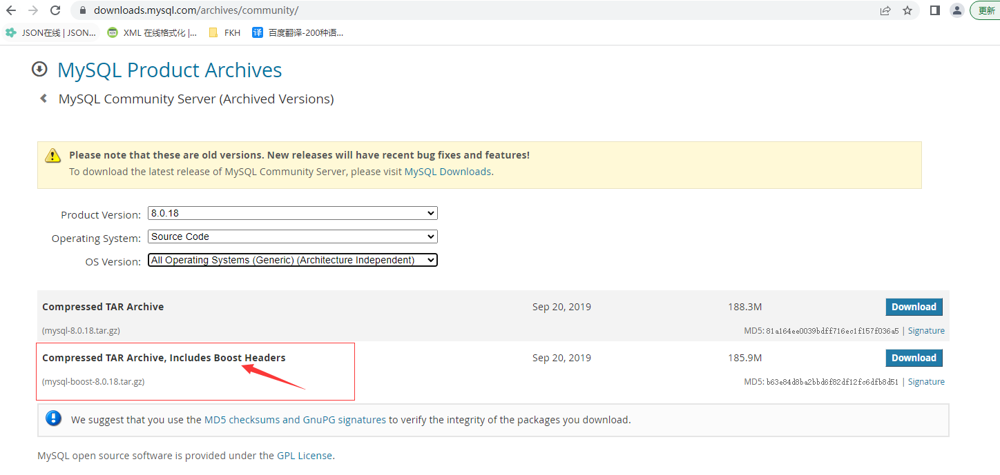
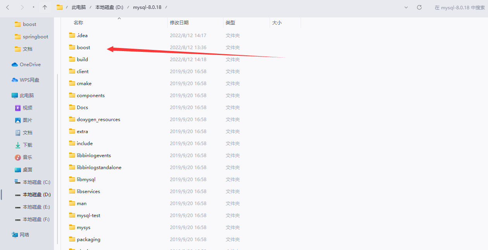
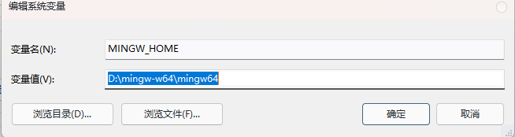
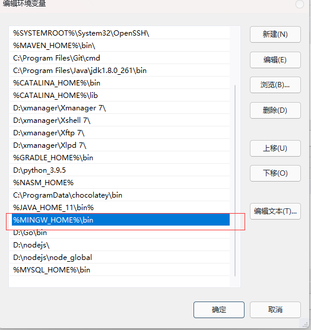
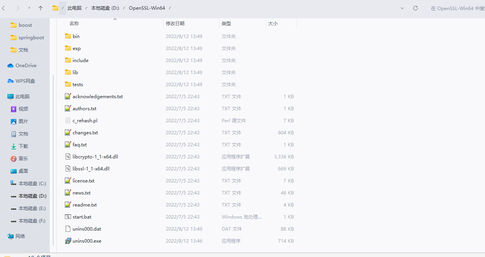
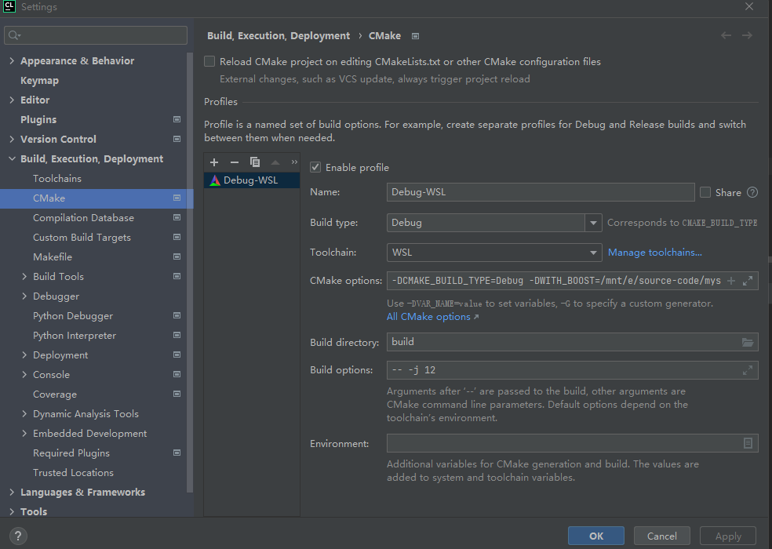
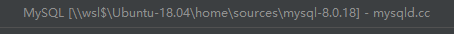
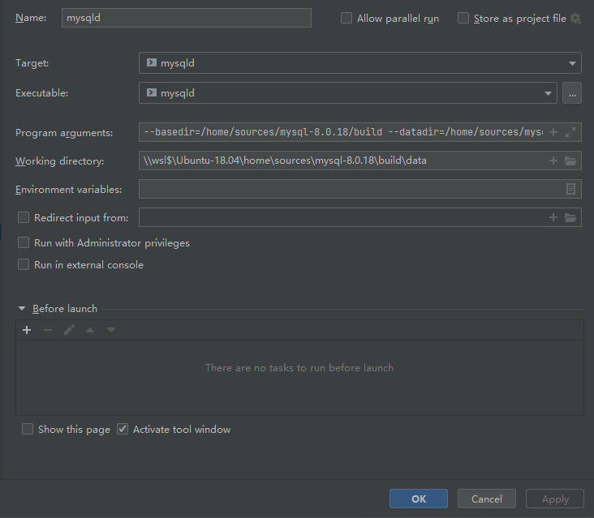

## 1. 下载mysql源码

https://downloads.mysql.com/archives/community/

下载带 **Boost** 包的源码



解压后的文件




## 2. 安装mingw64

 https://sourceforge.net/projects/mingw-w64/files/

文档：https://blog.csdn.net/didi_ya/article/details/111240502

  

配置环境变量





## 3. 配置OpenSSL

 http://slproweb.com/products/Win32OpenSSL.html 

  



配置环境变量


## 4. 配置Cmake


## 5. 参数配置

```text
-DWITH_BOOST=E:\source-code\mysql-8.0.18\boost
-DCMAKE_BUILD_TYPE=Debug
-DCMAKE_INSTALL_PREFIX=E:\source-code\mysql-8.0.18\build
-DMYSQL_DATADIR=E:\source-code\mysql-8.0.18\build\data
-DMYSQL_MAINTAINER_MODE=false
```


## 6. WSL2+Clion进行构建

### wsl安装

> https://blog.csdn.net/maybeYoc/article/details/122544516

### 源码构建

> https://www.sinblog.cn/archives/170  #可以避免构建源码很慢的问题

```text
1. 下载不到 libtirpc3 包
2. 下载ncurses-dev包
```

### clion参数

一定要将源码放在wsl下面进行编译，不要放在win中，这样编译会非常的慢，放在wsl中进行编译，然后通过clion打开代码就可以了

```text
-DCMAKE_BUILD_TYPE=Debug
-DWITH_BOOST=/home/sources/mysql-8.0.18/boost
-DCMAKE_INSTALL_PREFIX=/home/sources/mysql-8.0.18/build
-DMYSQL_DATADIR=/home/sources/mysql-8.0.18/build/data
-DSYSCONFDIR=/home/sources/mysql-8.0.18/build
-DMYSQL_UNIX_ADDR=/home/sources/mysql-8.0.18/build/sock/mysql.sock
```



打开的项目路径是这样的



### mysqld参数

```text
--basedir=/home/sources/mysql-8.0.18/build
--datadir=/home/sources/mysql-8.0.18/build/data
--console
--skip-grant-tables
--user=root
```



