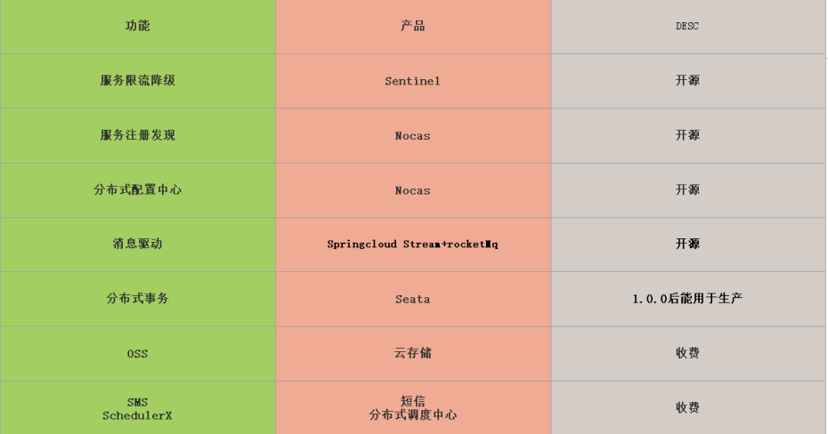
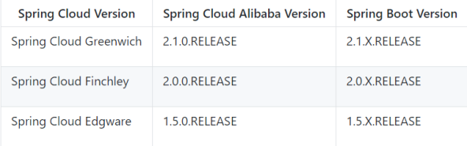
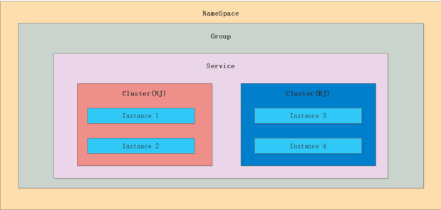
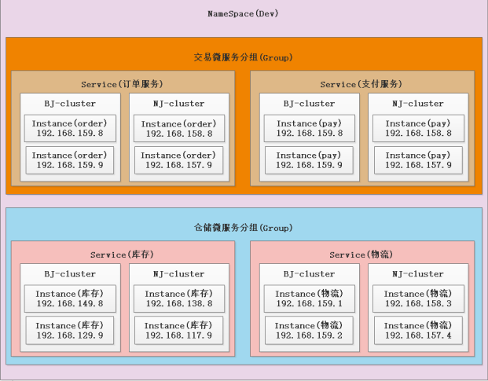
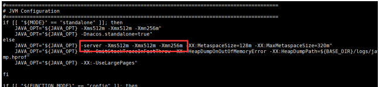

# spring cloud alibaba

## 一、包含产品



有许多组件功能需要收费

## 二、spring boot版本含义

- 其中2：表示的主版本号，表示是我们的SpringBoot第二代产品 

- 其中1:表示的是次版本号，增加了一些新的功能但是主体的架构是没有变化的，是兼容的 

- 其中6:表示的是bug修复版 ，所以2.1.6合起来就是springboot的第二代版本的第一个小版本的 第6次bug修复版本 

- RELEASE:存在哪些取值了 ①:snapshot(开发版本) ②:M1...M2(里程碑版本,在正式版发布之前 会出几个里程碑的版本) ③:release(正式版本) 

> 版本发布计划：SNAPSHOT ----> M1 ----> M2 ----> M3 ----> RC1 ----> RC2 ----> release

## 三、spring cloud版本含义

### 1、版本含义

- 第一代版本:Angle 

- 第二代版本:Brixton 

- 第三代版本:Camden 

- 第四代版本:Edgware 

- 第五代版本:Finchley 

- 第六代版本:GreenWich 

- 第七代版本:Hoxton(还在酝酿中，没正式版本)  标注 GA 代表稳定版本

> 版本发布命令：Greenwich.release ----->发现bug----->Greenwich.SR1------>发现bug----> Greenwich.SR2

### 2、如何选择版本

1. **:打死不用 非稳定版本/ end-of-life（不维护）版本**
2. **:release版本先等等(等别人去探雷)**
3. **:推荐 SR2以后的可以放心使用**



## 四、Nacos

### 1、领域模型





- NameSpace：用来实现环境隔离
- Group：服务分组，不同的分组不能相互调用；比如 订单分组不能调用仓储分组
- Service：下面集群（cluster）用来避免跨集群的调用

### 2、Nacos集群模式

1. 推荐Nginx进行转发
2. 直接配置文件写多个地址

**注意点：集群启动时需要修改startup.sh的参数，如果不改小可能启动不了这么多的服务**



```
修改conf文件夹下面的 cluster.conf文件，将所有集群的节点配置到当中
Nacos底层采用的raft算法
```

## 五、Ribbon(客户端负载均衡）

### 1、手动实现负载均衡

```java
//可以通过自定义实现RestTemplate来重写doExcute()方法来实现手动的负载均衡
public class TulingRestTemplate extends RestTemplate {

    private DiscoveryClient discoveryClient;

    public TulingRestTemplate (DiscoveryClient discoveryClient) {
        this.discoveryClient = discoveryClient;
    }
    
    protected <T> T doExecute(URI url, @Nullable HttpMethod method, @Nullable RequestCallback requestCallback,
                              @Nullable ResponseExtractor<T> responseExtractor) throws RestClientException {}
    
}
```

### 2、RestTemplate负载均衡的实现原理

RestTemplate中是拦截器来实现负载均衡，在某个时间点将loaderBalanceIntercept设置进去。

问题：在项目启动的时候需要通过RestTemplate通过负载均衡去调用另外的服务，能不能调用？不能，因为是在拦截器是spring在初始化之后才会设置拦截器。


## 六、Feign

优化：降低日志级别，改用底层调用框架（httpClient）

如何找类的实现：找成员变量在构造方法中对成员变量赋值的时候

