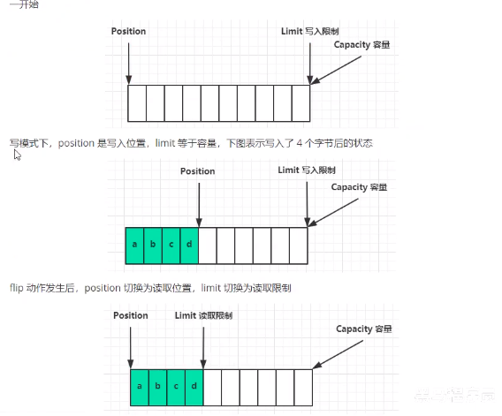
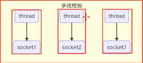
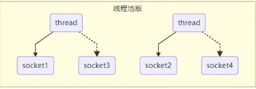
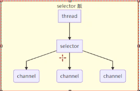

# NIO基础

## 一、三大组件

## 1. Channel

读写数据的双向通道

常见Channel：

- FileChannel
- DatagramChannel：TCP UDP需要用到
- SocketChannel：客服端、服务端都可以用
- ServerSocketChannel：服务端可用

## 2. Buffer

内存缓存区，暂存数据，用来独写数据

常用Buffer：

- ByteBuffer
  - MappedByteBuffer
  - DirectByteBuffer
  - HeapByteBuffer
- ShortBuffer
- IntBuffer
- 。。。。。。

### 2.1 ByteBuffer结构

重要属性：

- capacity：容量
- positio：
  - 写模式：代表写入数据的指针位置
  - 读模式：将位置转换为读取位置
- limit：
  - 写模式：写入限制
  - 读模式：读取的限制




## 3. Selector

选择器

### 3.1 多线程版设计



### 3.2 缺点

- 内存占用高
- 线程上下文切换成本高
- 只适合连接少数的场景

### 3.3 线程池版本



### 3.4 缺点

- 阻塞模式下，线程仅能处理一个socket连接
- 仅适合短连接场景

### 3.5 Selector版本

配合一个线程来管理多个channel，获取这些channel上发生的事件，这些channel工作在非阻塞模式下。调用selector的select() 会阻塞知道channel发生了独写就绪事件，这些事件方法就会返回这些事件交给trhead来处理。适合流量比较低的场景



## 二、粘包\半包

网络上有多条数据发送给服务端，数据之间使用 \n 进行分割，但是由于某种原因这些数据在接收时被进行了重新组合。

```java
public static void main(String[] args) throws IOException {
        //test1();
        //writer();
        ByteBuffer encode = StandardCharsets.UTF_8.encode("hello,world\ni am zhangsan\nwe are family");
        split(encode);
        encode = StandardCharsets.UTF_8.encode(" together . \n 55555");
        split(encode);
        encode = StandardCharsets.UTF_8.encode(" nonononono . \n");
        split(encode);
        encode = StandardCharsets.UTF_8.encode(" 222222 . \n");
        split(encode);
        encode = StandardCharsets.UTF_8.encode(" 33333333333 . \n");
        split(encode);
        encode = StandardCharsets.UTF_8.encode(" 44444444444444 . \n123456\n");
        split(encode);
    }
    
 /**
     * 粘包/半包，通过使用 /n分割 模拟网络发送的数据包
     * 1、查询ThreadLocal中还有没有上一次没有读取完的数据
     *      1.1 将上一次未获取完数据跟当前数据进行合并
     *      1.2 开启读模式
     *      1.3 验证 position的位置 跟limit的位置是否相同，如果不同证明 数据没有取完
     * 2、读取数据     
     */
    private static void split(ByteBuffer byteBuffer){
        //切换读模式
        Data lastData = dataThreadLocal.get();
        if (Objects.nonNull(lastData)) {
            ByteBuffer lastDataBuffer = lastData.getData();
            ByteBuffer newByteBuffer = ByteBuffer.allocate(byteBuffer.limit() + (lastDataBuffer.limit() - lastDataBuffer.positio()));
            while (lastDataBuffer.hasRemaining()){
                newByteBuffer.put(lastDataBuffer.get());
            }
            newByteBuffer.put(byteBuffer);
            newByteBuffer.flip();
            //读取新传入的，将上一次的数据进行合并
            for (int i = 0; i < newByteBuffer.limit(); i++) {
                byte b = newByteBuffer.get(i);
                if ('\n' == b) {
                    int length = i + 1 - newByteBuffer.positio();
                    ByteBuffer allocate = ByteBuffer.allocate(length);
                    for (int i1 = 0; i1 < allocate.limit(); i1++) {
                        allocate.put(newByteBuffer.get());
                    }
                    allocate.flip();
                    System.out.println("后续包数据："+StandardCharsets.UTF_8.decode(allocate));
                }
            }
            if (newByteBuffer.positio() != newByteBuffer.limit()) {
                //没有截取完的数据，将后面的数据放入
                Data data = new Data(Thread.currentThread().getName(), newByteBuffer);
                dataThreadLocal.set(data);
            }
        }else {
            //将数据按照转义符进行分割
            for (int i = 0; i < byteBuffer.limit() ; i++) {
                //截取数据
                byte b = byteBuffer.get(i);
                if ('\n' == b) {
                    int length = i + 1 - byteBuffer.positio();
                    ByteBuffer allocate = ByteBuffer.allocate(length);
                    for (int i1 = 0; i1 < allocate.limit(); i1++) {
                        allocate.put(byteBuffer.get());
                    }
                    allocate.flip();
                    System.out.println("打印数据："+StandardCharsets.UTF_8.decode(allocate));
                }
            }
            if (byteBuffer.positio() != byteBuffer.limit()) {
                //没有截取完的数据，将后面的数据放入
                Data data = new Data(Thread.currentThread().getName(), byteBuffer);
                dataThreadLocal.set(data);
            }
        }
    }
```

## 三、实战

### 时间服务器

```java
public class TimeServer {


    public static void main(String[] args) throws InterruptedException {
        int port = 8080;
        if (args != null && args.length > 0) {
            try {
                port = Integer.parseInt(args[0]);
            } catch (NumberFormatException e) {
                //
            }
        }
        new Thread(new MultiplexerTimeServer(port)).start();
        Thread.currentThread().join();
    }
    
    
    
    public static class MultiplexerTimeServer implements Runnable {
	//创建多路复用器
    private Selector selector;

    //简历服务器管道
    private ServerSocketChannel serverSocketChannel;
        
	//用来控制服务器是否停止
    private volatile boolean stop;


    public MultiplexerTimeServer(int port) {
        try {
            selector = Selector.open();
            serverSocketChannel = ServerSocketChannel.open();
            //设置为非阻塞模式
            serverSocketChannel.configureBlocking(false);
            //绑定套接字
            serverSocketChannel.socket().bind(new InetSocketAddress(port), 1024);
            //注册一个接收的监听位事件
            serverSocketChannel.register(selector, SelectionKey.OP_ACCEPT);
            System.out.println("The time server is start int port :" + port);
        } catch (IOException e) {
            System.exit(1);
        }
    }

    public void stop() {
        this.stop = true;
    }


    @Override
    public void run() {
        try {
            while (!stop) {
                //轮询注册在selector上面准备就绪的channel
                selector.select(1000);
                Set<SelectionKey> selectionKeys = selector.selectedKeys();
                Iterator<SelectionKey> keyIterator = selectionKeys.iterator();
                SelectionKey key = null;
                while (keyIterator.hasNext()) {
                    key = keyIterator.next();
                    keyIterator.remove();
                    this.handleInput(key);
                }
            }
        } catch (IOException e) {
            e.printStackTrace();
        }
    }

    /**
     * 处理事件
     * @param selectionKey
     * @throws IOException
     */
    private void handleInput(SelectionKey selectionKey) throws IOException {
        if (selectionKey.isValid()) {
            //如果是接收事件先处理接收的事件，然后再在管道上面注册一个读的操作位
            if (selectionKey.isAcceptable()) {
                System.out.println("接收到连接事件。。。。");
                ServerSocketChannel channel = (ServerSocketChannel) selectionKey.channel();
                SocketChannel sc = channel.accept();
                sc.configureBlocking(false);
                sc.register(selector, SelectionKey.OP_READ);
            }

            //如果是读事件
            if (selectionKey.isReadable()) {
                System.out.println("接收到读事件。。。。");
                SocketChannel channel = (SocketChannel) selectionKey.channel();
                ByteBuffer byteBuffer = ByteBuffer.allocate(1024);
                int read = channel.read(byteBuffer);
                byteBuffer.flip();
                if (read > 0) {
                    byte[] bytes = new byte[byteBuffer.remaining()];
                    byteBuffer.get(bytes);
                    String body = new String(bytes, StandardCharsets.UTF_8);
                    System.out.println("The time server receive order :" + body);
                    //返回客户端时间
                    String currentTime = "QUERY TIME ORDER".equalsIgnoreCase(body) ? new Date(System.currentTimeMillis()).toString() : "BAD ORDER";
                    doWrite(channel, currentTime);
                } else if (read < 0) {
                    selectionKey.cancel();
                    channel.close();
                } else {
                    ; //读取 0 字节 忽略
                }
            }
        }

    }

    private void doWrite(SocketChannel socketChannel, String response) throws IOException {
        if (StringUtils.hasText(response)) {
            byte[] bytes = response.getBytes(StandardCharsets.UTF_8);
            ByteBuffer wrap = ByteBuffer.allocate(bytes.length);
            wrap.put(bytes);
            wrap.flip();
            socketChannel.write(wrap);
        }
    }
}
    

}
```

### 时间客户端

```java
public class TimeClient {

    public static void main(String[] args) throws InterruptedException {
        int port = 8080;
        if (args != null && args.length > 0) {
            port = Integer.parseInt(args[0]);
        }
        new Thread(new TimeClientHandle("127.0.0.1", port)).start();
        Thread.currentThread().join();
    }
    
    
    
    public static class TimeClientHandle implements Runnable {

    private String host;
    private int port;
    private Selector selector;
    private SocketChannel socketChannel;
    private volatile boolean stop;

    public TimeClientHandle(String host, int port) {
        this.host = host == null ? "127.0.0.1" : host;
        this.port = port;

        try {
            selector = Selector.open();
            socketChannel = SocketChannel.open();
            socketChannel.configureBlocking(false);
        } catch (IOException e) {
            e.printStackTrace();
            System.exit(1);
        }
    }

    @Override
    public void run() {
        try {
            doConnect();
        } catch (IOException e) {
            e.printStackTrace();
            System.exit(1);
        }

        while (!stop) {
            try {
                selector.select(1000);
                Set<SelectionKey> selectionKeys = selector.selectedKeys();
                Iterator<SelectionKey> selectionKeyIterator = selectionKeys.iterator();
                SelectionKey key = null;
                while (selectionKeyIterator.hasNext()) {
                    key = selectionKeyIterator.next();
                    selectionKeyIterator.remove();
                    try {
                        handleInput(key);
                    } catch (IOException e) {
                        e.printStackTrace();
                        key.cancel();
                        if (key.channel() != null) {
                            key.channel().close();
                        }
                    }
                }
            } catch (Exception e) {
                e.printStackTrace();
                System.exit(1);
            }
        }
    }

    /**
     * 创建连接
     * 1.如果直接连接成功，直接注册读事件到多路复用器上
     * 2.没有连接成功的话，注册连接事件到多路复用器上
     * @throws IOException
     */
    private void doConnect() throws IOException {
        if (socketChannel.connect(new InetSocketAddress(host, port))) {
            socketChannel.register(selector, SelectionKey.OP_READ);
            doWrite(socketChannel);
        } else {
            socketChannel.register(selector, SelectionKey.OP_CONNECT);
        }
    }

    /**
     * 发送请求数据到管道中
     *
     *
     * @param socketChannel
     * @throws IOException
     */
    private void doWrite(SocketChannel socketChannel) throws IOException {
        byte[] bytes = "QUERY TIME ORDER".getBytes(StandardCharsets.UTF_8);
        ByteBuffer byteBuffer = ByteBuffer.allocate(bytes.length);
        byteBuffer.put(bytes);
        byteBuffer.flip();
        socketChannel.write(byteBuffer);
        if (!byteBuffer.hasRemaining()) {
            System.out.println("Send order 2 server succeed .");
        }
    }

    /**
     * 先判断key 是否是连接事件，如果连接成功，注册一个读时间发送查询请求
     *
     * @param selectionKey
     * @throws IOException
     */
    private void handleInput(SelectionKey selectionKey) throws IOException {
        if (selectionKey.isValid()) {
            SocketChannel socketChannel = (SocketChannel) selectionKey.channel();
            //判断是否连接成功
            if (selectionKey.isConnectable()) {
                System.out.println("接收到服务器连接事件。。。。");
                //完成连接后，注册一个读事件
                if (socketChannel.finishConnect()) {
                    socketChannel.register(selector, SelectionKey.OP_READ);
                    doWrite(socketChannel);
                }
            }

            //读事件准备就绪
            if (selectionKey.isReadable()) {
                System.out.println("接收到服务器读事件。。。。");
                ByteBuffer byteBuffer = ByteBuffer.allocate(1024);
                int read = socketChannel.read(byteBuffer);
                if (read > 0) {
                    byteBuffer.flip();
                    byte[] bytes = new byte[read];
                    byteBuffer.get(bytes);
                    String body = new String(bytes, StandardCharsets.UTF_8);
                    System.out.println("Now is :" + body);
                    this.stop = true;
                } else if (read < 0) {
                    selectionKey.cancel();
                    socketChannel.close();
                } else {
                    ; // 读取 0 字节
                }
            }
        }
    }
}


}
```

