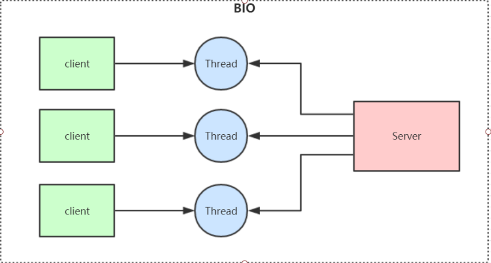
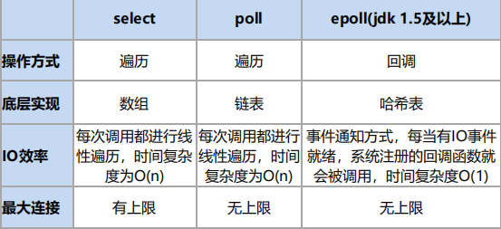
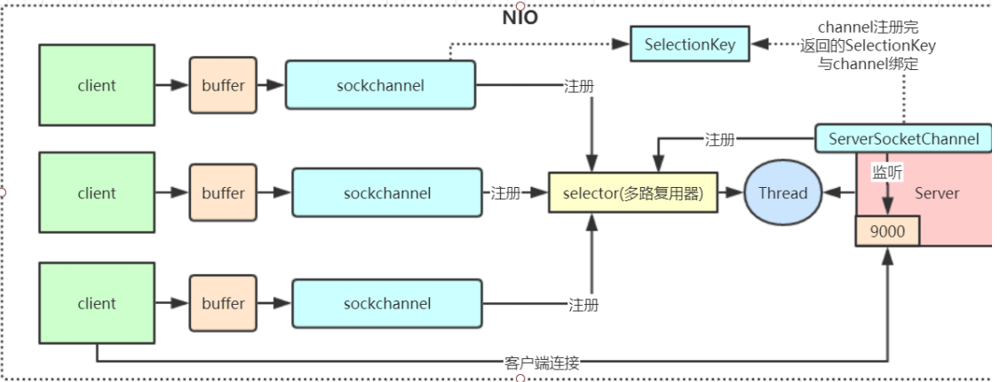
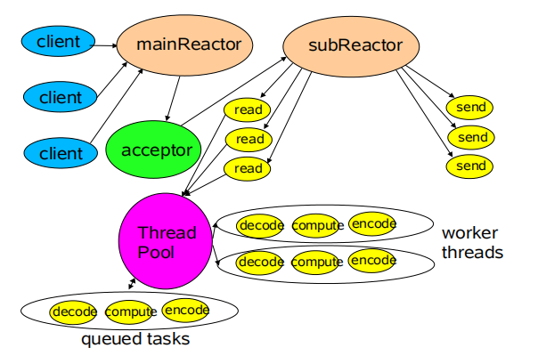

# 一、BIO（Blocking IO）

## 1、特点

同步阻塞模型，一个线程只能处理一个请求

## 2、缺点

- IO代码里read操作是阻塞操作，如果连接不做数据读写操作会导致线程阻塞，浪费资源

- 如果线程很多，会导致服务器线程太多，压力太大

## 3、应用场景

BIO适用于请求数量较小且固定的架构




# 二、NIO（Non Blocking IO）

## 1、特点

同步非阻塞，服务器实现模式为一个线程可以处理多个请求，客户端发送的连接请求都会注册到多路复用器epoll上，多路复用器轮询到有请求的就执行处理；I/O多路复用一般用Linux API（select、poll、epoll）来实现。区别：



## 2、三大组件

- Channel（通道）
- Buffer（缓冲区）
- Selector（选择器）

## 3、demo

一般使用在连接数多并且比较短的架构，比如聊天系统、弹幕系统、服务器间通讯



### getSelector()

- 创建默认的管道连接，初始化端口，注册一个连接的监听事件
- 死循环读取选择器上面的事件
- 调用处理

```java
public class NIOServer {
    private static final Selector SELECTOR = getSelector();
    public static void main(String[] args) throws IOException {
        assert SELECTOR != null;
        while (true){
            //监听selector上面注册的事件
            SELECTOR.select();
            Iterator<SelectionKey> iterator = SELECTOR.selectedKeys().iterator();
            while (iterator.hasNext()){
                SelectionKey selectionKey = iterator.next();
                //处理本次key，防止下次selector进行处理
                handler(selectionKey);
                iterator.remove();
            }
        }
    }
    public static Selector getSelector() {
        try {
            ServerSocketChannel serverSocketChannel = ServerSocketChannel.open();
            serverSocketChannel.bind(new InetSocketAddress(9001));
            serverSocketChannel.configureBlocking(false);
            Selector selector = Selector.open();
            serverSocketChannel.register(selector, SelectionKey.OP_ACCEPT);
            return selector;
        } catch (IOException e) {
            e.printStackTrace();
        }
        return null;
    }
}
```

### handler()

- 如果是连接事件，配置好管道并且注册一个 读事件
- 如果是读事件，读取数据

```java
private static void handler(SelectionKey selectionKey) throws IOException {
        if(selectionKey.isAcceptable()){
            System.out.println("检测到连接事件。。。");
            ServerSocketChannel serverSocketChannel = (ServerSocketChannel) selectionKey.channel();
            SocketChannel socketChannel = serverSocketChannel.accept();
            socketChannel.configureBlocking(false);
            socketChannel.register(SELECTOR,SelectionKey.OP_READ);
            socketChannel.write(ByteBuffer.wrap("hello client".getBytes()));
        }else if (selectionKey.isReadable()){
            System.out.println("检测到读事件。。。");
            SocketChannel socketChannel = (SocketChannel) selectionKey.channel();
            ByteBuffer allocate = ByteBuffer.allocate(1024);
            int read = socketChannel.read(allocate);
            if(read != -1){
                System.out.println("读取客户端数据："+new String(allocate.array(),0,read));
            }
            socketChannel.write(ByteBuffer.wrap("服务端收到信息".getBytes()));
        }else if(selectionKey.isWritable()){
            System.out.println("检测到写事件");
            SocketChannel socketChannel = (SocketChannel) selectionKey.channel();
            ByteBuffer allocate = ByteBuffer.allocate(1024);
            int read = socketChannel.read(allocate);
            if(read != -1){
                System.out.println("读取客户端写数据："+new String(allocate.array(),0,read));
            }
            socketChannel.write(ByteBuffer.wrap("服务端收到信息等待客户端进行处理后返回数据。。".getBytes()));
        }
    }
```

# 三、AIO

异步非阻塞，对NIO进行封装

# 四、Netty



- mainReactor：只处理客户端的连接，处理了连接之后将管道注册到subReactor
- subReactor：处理完客户端的连接会将管道注册到当前reactor上，然后将读写等事件分发到线程池中进行处理

## 1、Netty模型


- Boss Group：相当于上面的mainReactor，只处理客户端请求，每一个线程中都维护一个selector
  - 第一步监听到客户端的请求，生成NioSokectChannel
  - 第二步注册NioSokectChannel到某一个Work Group中某一个线程中
  - 第三步在执行任务runAllTasks
- Work Group：相当于上面的subReactor，建立管道来处理读写等事件，其中每一个线程中都维护一个selector
  - 轮询处理NioSocketChannel中read、writer事件
  - runAllTasks处理任务队列TaskQueue的任务

## 2、ByteBuf


## 3、TCP粘包/半包问题的解决

#### 3.1 问题产生的原因

- 应用程序write写入的字节大小大于套接口发送缓冲区大小
- 进行MSS大小的TCP分段
- 以太网帧的payload大于MTU进行IP分片

#### 3.2 主流解决方案

- 消息定长，例如每个报文的大小为固定200字节，如果不够，空位补空格
- 在包尾增加回车换行符进行分割，例如FTP协议
- 将消息分为消息头和消息体，消息头中包含表示消息总长度（或者消息体长度）的字段，通常设计思路为消息头的第一个字段使用int32来表示消息的总长度
- 更复杂的应用层协议

#### 3.3 netty解码器

**LineBasedFrameDecoder**：依次遍历ByteBuf中可读字节，判断看是否有 \n 或者 \r\n，如果有，就以此为结束位置。如果读取到最大行仍然没有换行符，就会抛出异常

**StringDecoder**：将接收到的对象转换成字符串，然后继续调用后续的handler

时间服务器服务端：

```java
public class NettyTimeServer {
    public static void main(String[] args) {
        int port = 8080;
        new NettyTimeServer().bind(port);
    }
    public void bind(int port) {
        NioEventLoopGroup bossGroup = new NioEventLoopGroup();
        NioEventLoopGroup workGroup = new NioEventLoopGroup();
        try {
            ServerBootstrap serverBootstrap = new ServerBootstrap();
            serverBootstrap
                .group(bossGroup, workGroup)
                .channel(NioServerSocketChannel.class)
                .option(ChannelOption.SO_BACKLOG, 1024)
                .childHandler(new ChildChannelHandler());
            ChannelFuture channelFuture = serverBootstrap.bind(port).sync();
            //等待服务端监听端口关闭
            channelFuture.channel().closeFuture().sync();
        } catch (InterruptedException e) {
            e.printStackTrace();
        } finally {
            bossGroup.shutdownGracefully();
            workGroup.shutdownGracefully();
        }
    }
    private static class ChildChannelHandler extends ChannelInitializer<SocketChannel> {
        @Override
        protected void initChannel(SocketChannel socketChannel) throws Exception {
            //处理粘包/半包，会去遍历数据当中是否有转义符，如果没有会抛出异常信息
            socketChannel.pipeline().addLast(new LineBasedFrameDecoder(1024));
            //将接收到的数据解码成字符串，后续可以直接获取string类型数据
            socketChannel.pipeline().addLast(new StringDecoder());
            socketChannel.pipeline().addLast(new TimeServerHandler());
        }
    }
    private static class TimeServerHandler extends ChannelHandlerAdapter {

        private int counter;

        @Override
        public void channelRead(ChannelHandlerContext ctx, Object msg) throws Exception {
            String body = (String) msg;
            System.out.println("The time server receive order : " + body + ", the counter is :" + ++counter);
            String currentTime = "query time order".equalsIgnoreCase(body) ? new Date(System.currentTimeMillis()).toString() : "bad order";
            currentTime = currentTime + System.getProperty("line.separator");
            ByteBuf resp = Unpooled.copiedBuffer(currentTime.getBytes(StandardCharsets.UTF_8));
            ctx.write(resp);
        }

        @Override
        public void channelReadComplete(ChannelHandlerContext ctx) throws Exception {
            ctx.flush();
        }

        @Override
        public void exceptionCaught(ChannelHandlerContext ctx, Throwable cause) throws Exception {
            cause.printStackTrace();
            ctx.close();
        }
    }
}
```

时间客户端：

```java
public class NettyTimeClient {

    public static void main(String[] args) {
        try {
            new NettyTimeClient().connect("127.0.0.1", 8080);
        } catch (InterruptedException e) {
            e.printStackTrace();
        }
    }

    public void connect(String host, int port) throws InterruptedException {
        NioEventLoopGroup eventLoopGroup = new NioEventLoopGroup();
        Bootstrap client = new Bootstrap();
        client.group(eventLoopGroup)
            .channel(NioSocketChannel.class)
            .option(ChannelOption.TCP_NODELAY, true)
            .handler(new ChannelInitializer<SocketChannel>() {
                @Override
                protected void initChannel(SocketChannel socketChannel) throws Exception {
                    socketChannel.pipeline().addLast(new LineBasedFrameDecoder(1024));
                    socketChannel.pipeline().addLast(new StringDecoder());
                    socketChannel.pipeline().addLast(new TimeClientHandler());
                }
            });
        ChannelFuture future = client.connect(new InetSocketAddress(host, port)).sync();
        future.channel().closeFuture().sync();
    }


    public static class TimeClientHandler extends ChannelHandlerAdapter {

        private int counter;

        @Override
        public void channelActive(ChannelHandlerContext ctx) throws Exception {
            byte[] req = ("query time order" + System.getProperty("line.separator")).getBytes(StandardCharsets.UTF_8);
            for (int i = 0; i < 100; i++) {
                ByteBuf buffer = Unpooled.buffer(req.length);
                buffer.writeBytes(req);
                ctx.writeAndFlush(buffer);
            }
        }

        @Override
        public void channelRead(ChannelHandlerContext ctx, Object msg) throws Exception {
            /*ByteBuf byteBuf = (ByteBuf) msg;
            byte[] bytes = new byte[byteBuf.readableBytes()];
            byteBuf.readBytes(bytes);
            String body = new String(bytes, StandardCharsets.UTF_8);*/
            String body = (String) msg;
            System.out.println("Now is: " + body + "; the counter is :" + ++counter);
        }

        @Override
        public void exceptionCaught(ChannelHandlerContext ctx, Throwable cause) throws Exception {
            ctx.close();
        }
    }
}
```

**DelimiterBasedFrameDecoder**：指定分隔符切分

**FixedLengthFrameDecoder**：固定长度进行切分

分隔符解码器在超过限制的大小还没有读取到分隔符，会抛出异常，主要目的是防止内存溢出

```java
ByteBuf delimiter = Unpooled.copiedBuffer("@".getBytes(StandardCharsets.UTF_8));
                        //1024代表单条消息最大长度，当到达该长度的后还没有找到分隔符，就抛出TooLongFrameException异常， 使用指定分隔符进行拆分数据包
                        DelimiterBasedFrameDecoder delimiterBasedFrameDecoder = new DelimiterBasedFrameDecoder(1024, delimiter);
                        socketChannel.pipeline().addLast(delimiterBasedFrameDecoder);

//定长解码器，按照指定长度进行解码,如果不足长度会等待下一次的数据包，然后进行拼包
                        socketChannel.pipeline().addLast(new FixedLengthFrameDecoder(20));
```

## 4、编解码技术

java提供的 **ObjectInputStream 和 ObjectOutputStream** 可以直接把java对象作为可存储的字节数组写入文件以及网络传输。

java序列化的目的主要有两个

- 网络传输：需要把传输的java对象编码为字节数组或者Bytebuffer对象，远程服务读取到Bytebuffer或者字节数组后转换为java对象
- 对象持久化

###  4.1 java序列化的缺点

- 无法跨语言：如果使用异构语言进程进行交互，Java序列化就不能胜任
- 序列化后的码流太大
- 序列化性能太低

### 4.2 业界主流的编解码框架

#### 1. Protobuf

谷歌开源框架，数据结构以.proto文件进行描述

特点：

- 结构化数据存储结构（XML、JSON等）
- 高效的编解码性能
- 语言无关、平台无关、扩展性好
- 官方支持Java、C++和Python

#### 2. Thrift

Facebook开源而来

支持三种典型的编解码方式

- 通用的二进制编解码
- 压缩二进制编解码
- 优化的可选字段压缩编解码

#### 3. JBoss Marshalliing

java对象的序列化API包，修正了JDK自带的序列化包的很多问题

优点：

- 可插拔的类解析器，更加便捷的类加载定制策略，通过一个接口即可实现
- 可插拔的对象替换技术，不需要通过继承的方式
- 可插拔的预定义类缓存表，可以减小序列化的字节数组的长度，提升常用类型的对象序列化性能
- 无须实现java.io.Serializable接口，即可实现Java序列化
- 通过缓存技术提升对象的序列化性能

### 4.3 netty实现对象编解码

Netty提供的 **ObjectEncoder** 和 **ObjectDecoder** 处理器进行编解码

```java
//在socket管道中新增编解码器，可以自动对数据进行序列化和反序列化
//创建 WeakReferenceMap对类加载器进行缓存，支持多线程并发访问，当虚拟机内存不足时，会释放缓存中的内存，防止内存泄漏
            socketChannel.pipeline().addLast(
                new ObjectDecoder(1024 * 1024,                        ClassResolvers.weakCachingConcurrentResolver(this.getClass().getClassLoader())));
            socketChannel.pipeline().addLast(new ObjectEncoder());
            socketChannel.pipeline().addLast(new SubReqServerHandler());
```

使用 **Protobuf** 提供的序列化进行处理

```java
			socketChannel.pipeline().addLast(new ProtobufVarint32FrameDecoder()); //处理半包
			socketChannel.pipeline().addLast(new ProtobufDecoder(解码目标类.class)); //并没有半包的处理罗辑
			socketChannel.pipeline().addLast(new ProtobufVarint32LengthFieldPrepender());
            socketChannel.pipeline().addLast(new ProtobufEncoder());
            socketChannel.pipeline().addLast(new SubReqServerHandler());
```

