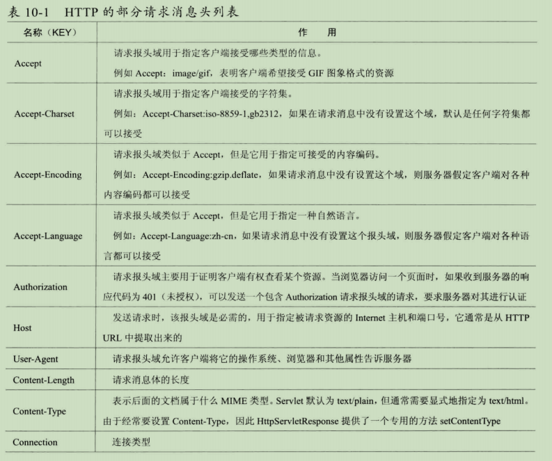
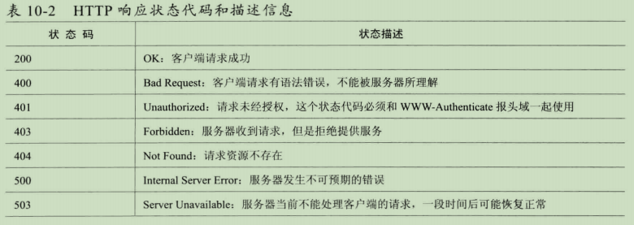

# HTTP协议开发应用

## 1. 请求（HttpRequest）

- 请求行
  - Method：请求方法
  - Request-URI：统一资源标识符
  - HTTP-Version CRLF：请求的HTTP协议版本，CRLF 表示回车和换行
- 请求头
- 请求正文



## 2. 响应（HttpResponse）

- 状态行

  - HTTP-Version：服务器http协议的版本
  - Status-Code：服务器返回的响应状态码

  

  - Reason-Phrase CRLF

- 消息报头

- 响应正文

## 3. 文件服务器

- 创建主线程池和工作线程池
- 初始化时创建解码器
  - HttpRequestDecoder：http解码器
  - HttpObjectAggregator：将http解码器解码后的多个http对象合并成一个完整的
  - HttpResponseEncoder：将响应的数据进行编码
  - ChunkedWriteHandler：大文件传输处理器
  - HttpFileServerHandler：自定义handler

```java
public void run(final int port, final String url) {

        NioEventLoopGroup bossGroup = new NioEventLoopGroup();
        NioEventLoopGroup workGroup = new NioEventLoopGroup();

        try {
            ServerBootstrap serverBootstrap = new ServerBootstrap();
            serverBootstrap
                .group(bossGroup, workGroup)
                .channel(NioServerSocketChannel.class)
                .childHandler(new ChannelInitializer<SocketChannel>() {
                    @Override
                    protected void initChannel(SocketChannel socketChannel) throws Exception {
                        //http请求消息的解码器
                        socketChannel.pipeline().addLast("http-decoder", new HttpRequestDecoder());
                        //主要目的是将多个消息转换为单一的 FullHttpRequest或者FullHttpResponse。因为http解码器会生成多个消息对象
                        socketChannel.pipeline().addLast("http-aggregator", new HttpObjectAggregator(9999999));
                        //http 返回值编码器
                        socketChannel.pipeline().addLast("http-encoder", new HttpResponseEncoder());
                        //主要目的是支持异步发送大的码流（例如大文件传输），但不占用过多内存，防止发生Java内存溢出的错误
                        socketChannel.pipeline().addLast("http-chunked", new ChunkedWriteHandler());
                        socketChannel.pipeline().addLast("fileServerHandler", new HttpFileServerHandler(url));
                    }
                });
            ChannelFuture channelFuture = serverBootstrap.bind(port).sync();
            System.out.println("http 文件目录服务器启动，网址是 ：" + "http://192.168.8.106");
            channelFuture.channel().closeFuture().sync();
        } catch (Exception e) {
            e.printStackTrace();
        } finally {
            bossGroup.shutdownGracefully();
            workGroup.shutdownGracefully();
        }
    }
```

```java
 public static class HttpFileServerHandler extends SimpleChannelInboundHandler<FullHttpRequest> {

        private String url = "/book";

        private static final Pattern INSECURE_URI = Pattern.compile(".*[<>&\"].*");

        private static final Pattern ALLOWED_FILE_NAME = Pattern.compile("[A-Za-z0-9][-_A-Za-z0-9\\.]*");

        public HttpFileServerHandler(String url) {
            this.url = url;
        }

        @Override
        protected void channelRead0(ChannelHandlerContext channelHandlerContext, FullHttpRequest request) throws Exception {
            //对消息进行解码
            if (!request.decoderResult().isSuccess()) {
                sendError(channelHandlerContext, HttpResponseStatus.BAD_REQUEST);
                return;
            }
            //判断当前请求是否是 GET 方法
            if (request.method() != HttpMethod.GET) {
                sendError(channelHandlerContext, HttpResponseStatus.METHOD_NOT_ALLOWED);
                return;
            }

            String uri = request.uri();
            //对 uri进行包装
            String path = sanitizeUri(uri);
            //如果构造的数据不合法，返回错误状态码
            if (!StringUtils.hasText(path)) {
                sendError(channelHandlerContext, HttpResponseStatus.FORBIDDEN);
                return;
            }

            //判断文件是否存在
            File file = new File(path);
            if (file.isHidden() || !file.exists()) {
                sendError(channelHandlerContext, HttpResponseStatus.NOT_FOUND);
                return;
            }

            //判断文件是否是一个路径
            if (file.isDirectory()) {
                //如果是路径，那么把当前路径下的所有文件都返回出去
                if (uri.endsWith("/")) {
                    sendListing(channelHandlerContext, file);
                } else {
                    sendRedirect(channelHandlerContext, uri + "/");
                }
                return;
            }

            //判断是否是文件，如果不是路径 也不是文件，返回错误信息
            if (!file.isFile()) {
                sendError(channelHandlerContext, HttpResponseStatus.FORBIDDEN);
                return;
            }
            //如果是文件，获取到当前文件
            RandomAccessFile randomAccessFile = null;
            long fileLength = 0;
            try {
                randomAccessFile = new RandomAccessFile(file, "r");
                //获取到文件大小
                fileLength = randomAccessFile.length();
            } catch (FileNotFoundException e) {
                sendError(channelHandlerContext, HttpResponseStatus.NOT_FOUND);
            }
            DefaultFullHttpResponse response = new DefaultFullHttpResponse(HttpVersion.HTTP_1_1, HttpResponseStatus.OK);
            setContentTypeLength(response, fileLength);
            setContentTypeHeader(response, file);
            //判断请求对象是否是 KEEP_ALIVE
            if (HttpUtil.isKeepAlive(request)) {
                response.headers().set(CONNECTION, HttpHeaderValues.KEEP_ALIVE);
            }
            channelHandlerContext.write(response);
            //发送文件数据 ChunkedFile，发送完成后 需要发送一个空的消息体，标识所有消息发送完成
            ChunkedFile chunkedFile = new ChunkedFile(randomAccessFile, 0, fileLength, 8192);

            ChannelFuture sendFileFuture = channelHandlerContext.write(chunkedFile, channelHandlerContext.newProgressivePromise());

            sendFileFuture.addListener(new ChannelProgressiveFutureListener() {
                @Override
                public void operationProgressed(ChannelProgressiveFuture channelProgressiveFuture, long progress, long total) throws Exception {
                    if (total < 0) {
                        System.out.println("Transfer progress: " + progress);
                    } else {
                        System.out.println("Transfer progress :" + progress + "/" + total);
                    }
                }
                @Override
                public void operationComplete(ChannelProgressiveFuture channelProgressiveFuture) throws Exception {
                    System.out.println("Transfer complete.");
                }
            });

            ChannelFuture lastContentFuture = channelHandlerContext.writeAndFlush(LastHttpContent.EMPTY_LAST_CONTENT);
            if (!HttpUtil.isKeepAlive(request)) {
                lastContentFuture.addListener(ChannelFutureListener.CLOSE);
            }
        }
 }
```

```java
private static void setContentTypeLength(DefaultFullHttpResponse response, long fileLength) {
            response.headers().set(CONTENT_LENGTH, fileLength);
        }
```

```java
//将url地址进行替换成后端需要的路径
private String sanitizeUri(String uri) {
            try {
                uri = URLDecoder.decode(uri, "UTF-8");
            } catch (UnsupportedEncodingException e) {
                try {
                    uri = URLDecoder.decode(uri, "ISO-8859-1");
                } catch (UnsupportedEncodingException e1) {
                    throw new Error();
                }
            }
            //首先判断请求路径是否是默认路径下的子路径
            if (!uri.startsWith(url)) {
                return null;
            }
            //判断是否是以 / 开头
            if (!uri.startsWith("/")) {
                return null;
            }
            //将路径替换为本地系统的分隔符
            uri = uri.replace('/', File.separatorChar);
            if (uri.contains(File.separator + '.') ||
                uri.contains('.' + File.separator) ||
                uri.startsWith(".") ||
                uri.endsWith(".") ||
                INSECURE_URI.matcher(uri).matches()) {
                return null;
            }
            //使用当前运行程序所在的工程目类 + uri构造绝对路径返回
            //System.getProperty("user.dir");
            return "F:" + File.separator + uri;
        }
```

```java
//将文件夹下面的文件并且成链接，并且生成html文件返回出去
private static void sendListing(ChannelHandlerContext context, File dir) {
            FullHttpResponse httpResponse = new DefaultFullHttpResponse(HttpVersion.HTTP_1_1, HttpResponseStatus.OK);
            httpResponse.headers().set(CONTENT_TYPE, "text/html;charset=UTF-8");
            StringBuilder builder = new StringBuilder();
            String dirPath = dir.getPath();
            builder.append("<!DOCTYPE html>\r\n");
            builder.append("<html><head><title>");
            builder.append(dirPath);
            builder.append(" 目录 ");
            builder.append("</title></head><body>\r\n");
            builder.append("<h3>");
            builder.append(dirPath).append(" 目录： ");
            builder.append("</h3>\r\n");
            builder.append("<ul>");
            builder.append("<li>链接：<a href=\"../\">..</a></li>\r\n");
            for (File f : dir.listFiles()) {
                if (f.isHidden() || !f.canRead()) {
                    continue;
                }
                String name = f.getName();
                if (!ALLOWED_FILE_NAME.matcher(name).matches()) {
                    continue;
                }
                builder.append("<li>链接：<a href=\"");
                builder.append(name);
                builder.append("\">");
                builder.append(name);
                builder.append("</a></li>\r\n");
            }
            builder.append("</ul></body></html>\r\n");
            ByteBuf byteBuf = Unpooled.copiedBuffer(builder, StandardCharsets.UTF_8);
            httpResponse.content().writeBytes(byteBuf);
            byteBuf.release();
            context.writeAndFlush(httpResponse).addListener(ChannelFutureListener.CLOSE);
        }
```

```java
private static void sendError(ChannelHandlerContext ctx, HttpResponseStatus status) {
            String response = String.format("Failure: %s \r\n", status.toString());
            ByteBuf byteBuf = Unpooled.copiedBuffer(response.getBytes(StandardCharsets.UTF_8));
            DefaultFullHttpResponse httpResponse = new DefaultFullHttpResponse(HttpVersion.HTTP_1_1, status, byteBuf);
            httpResponse.headers()
                .set(CONTENT_TYPE, "text/plain; charset=UTF-8");
            ctx.writeAndFlush(httpResponse).addListener(ChannelFutureListener.CLOSE);
        }
```

```java
private static void setContentTypeHeader(HttpResponse httpResponse, File file) {
            MimetypesFileTypeMap mimetypesFileTypeMap = new MimetypesFileTypeMap();
            httpResponse.headers().set(CONTENT_TYPE, mimetypesFileTypeMap.getContentType(file.getPath()));
        }
```

```java
private static void sendRedirect(ChannelHandlerContext ctx, String newUri) {
            FullHttpResponse response = new DefaultFullHttpResponse(HttpVersion.HTTP_1_1, HttpResponseStatus.FOUND);
            response.headers().set(LOCATION, newUri);
            ctx.writeAndFlush(response).addListener(ChannelFutureListener.CLOSE);
        }
```

