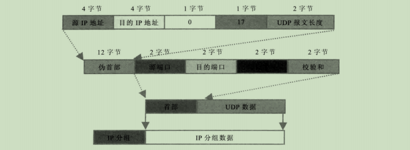

# UDP协议开发

## 1. 概述

**UDP 用户数据协议（User Datagram Protocol）**

## 2. 作用

**将网络流量压缩成数据报形式，提供面向事务的简单信息传输服务，利用IP协议进行数据报传输，提供无连接的、不可靠的数据投递服务**

## 3. 特点

**资源消耗小、处理速度快，通常使用在视频、音频等可靠性要求不高的数据传输**

- UDP是无连接的，发送方和接收方相互交换信息使双方同步
- UDP接受到后不发送确认信息，发送端不知道是否成功，也不会重发
- UDP传送数据比TCP快，系统开销小，常用于视频、图片以及简单文件传输系统。TCP适合于FTP文件传输系统、超文本传输协议HTTP、简单邮件传输协议SMTP等

## 4. 协议简介

UDP不需要简历物理链接。在网络中它用于处理数据包，在OSI模型中，它处理第四层传输层，即位于IP协议的上层

#### 4.1 协议格式

**分为两个部分：首部和数据**

- 源端口：源端口号，2个字节
- 目的端口：目的端口号，2个字节
- 长度：2字节，UDP用户数据报的总长度
- 校验和：2个字节，用来验证数据字段和头部的“伪首部”

**伪首部**：在TCP或UDP的数据报格式中，在数据报首部前面增加源IP地址、目的IP地址、IP分组的协议字段、TCP或UDP数据报的总长度，共12字节。只为了保证可以校验套接字的正确性



## 5. 代码实例

### 5.1 服务端

由于UDP协议不需要跟服务端进行连接，所以需要设置UDP为支持广播数据；并且使用 NioDatagramChannel.class 管道

```java
public void bind(int port) {
        NioEventLoopGroup workGroup = new NioEventLoopGroup();
        try {
            Bootstrap bootstrap = new Bootstrap();
            bootstrap
                .group(workGroup)
                .channel(NioDatagramChannel.class)
                //设置Socket参数支持广播
                .option(ChannelOption.SO_BROADCAST, true)
                .handler(new ChineseProverbHandler());
            bootstrap.bind(port).channel().closeFuture().await();
        } catch (InterruptedException e) {
            e.printStackTrace();
        } finally {
            workGroup.shutdownGracefully();
        }
    }
```


```java
public class ChineseProverbHandler extends SimpleChannelInboundHandler<DatagramPacket> {

        private static final String[] DICTIONARY = {"只要功夫深，铁棒磨成针。", "洛阳亲友如想问，一片冰心在玉壶"};

        @Override
        protected void channelRead0(ChannelHandlerContext ctx, DatagramPacket msg) throws Exception {
            //将内容转换为字符串
            String req = msg.content().toString(StandardCharsets.UTF_8);
            System.out.println("请求数据：" + req);
            if ("谚语字典查询?".equals(req)) {
                ByteBuf byteBuf = Unpooled.copiedBuffer("谚语查询结果：" + nextQuote(), StandardCharsets.UTF_8);
                // msg.sender() 获取发送的ip和端口
                DatagramPacket returnPacket = new DatagramPacket(byteBuf, msg.sender());
                ctx.writeAndFlush(returnPacket);
            }
        }
        private String nextQuote() {
            //可能会出现并发问题
            int nextInt = ThreadLocalRandom.current().nextInt(DICTIONARY.length);
            return DICTIONARY[nextInt];
        }
    }
```

### 5.2 客户端

```java
public void run(int port) {
        NioEventLoopGroup workGroup = new NioEventLoopGroup();
        try {
            Bootstrap bootstrap = new Bootstrap();
            bootstrap
                .group(workGroup)
                .channel(NioDatagramChannel.class)
                //设置Socket参数支持广播
                .option(ChannelOption.SO_BROADCAST, true)
                .handler(new ChineseProverbHandler());
            Channel channel = bootstrap.bind(0).sync().channel();
            //向网段内所有机器广播UDP消息
            channel.writeAndFlush(new DatagramPacket(Unpooled.copiedBuffer("谚语字典查询?", StandardCharsets.UTF_8),
                                                     new InetSocketAddress("255.255.255.255", port))).sync();
            //等待15秒用于接受返回数据，然后退出
            if (!channel.closeFuture().await(15000)) {
                System.out.println("查询超时!");
            }
        } catch (InterruptedException e) {
            e.printStackTrace();
        } finally {
            workGroup.shutdownGracefully();
        }
    }
```

```java
public class ChineseProverbHandler extends SimpleChannelInboundHandler<DatagramPacket> {

        @Override
        protected void channelRead0(ChannelHandlerContext ctx, DatagramPacket msg) throws Exception {
            //将内容转换为字符串
            String response = msg.content().toString(StandardCharsets.UTF_8);
            if (response.startsWith("谚语查询结果：")) {
                System.out.println(response);
                ctx.close();
            }
        }
    }
```

