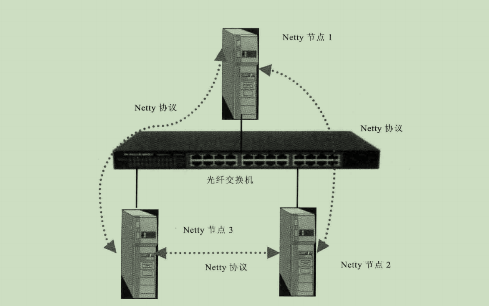
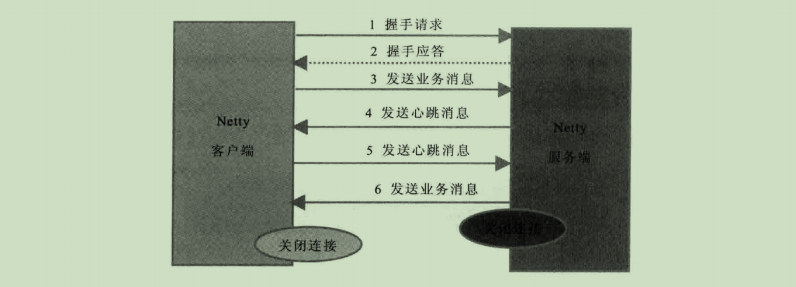

# 1. Netty协议栈功能设计

Netty协议栈用于内部模块之间的通信，它基于 TCP/IP 协议栈，是一个类 HTTP 协议的应用层协议栈，相比于传统标准协议栈，它更加轻巧、灵活和实用




## 1.1 功能描述

Netty协议栈承载了业务内部各模块之间的消息交互和服务调用，主要功能：

- 基于 Netty 的NIO通信框架，提高新能的异步通信能力
- 提供雄安锡的编解码框架，可以实现POJO的序列化和反序列化
- 提供基于IP地址的白名单接入认证机制
- 链路的有效性校验机制
- 链路的断连重连机制

## 1.2 交互模型



- 客户端发送握手消息，携带节点ID等有效身份认证信息
- 服务端对握手请求消息进行合法性校验，包括节点ID有效性检验，节点重复校验和IP地址合法性校验，校验通过后，返回登录成功的握手应答消息
- 链路建立成功之后，客户端端发送业务数据
- 链路成功之后，服务端发送心跳消息
- 链路建立成功之后，客户端发送心跳消息
- 链路建立成功之后，服务端发送业务数据
- 服务退出时，服务端关闭连接，客户端感知对方关闭连接后，被动关闭客户端连接

**备注：** Netty协议通信双方链路建立成功之后，双方可以进行双全工通信，无论客户端还是服务端，都可以主动发送请求消息给对象，通信方式可以是 TWO WAY或者 ONE WAY。双方之间的心跳采用 Ping-Pong机制，当链路处于空闲状态时，客户端主动发送Ping消息给服务端，服务端收到Ping消息后发送应答消息Pong给客户端，如果客户端连续发送N条Ping消息都没有接收到服务端返回的Pong消息，说明链路已经挂死或者对方处于异常状态，客户端关闭连接，间隔周期T后发起重新连接操作，直到重连成功

## 1.3 消息定义表

协议栈消息定义包含两个部分：

- 消息头
- 消息体

| 名称   | 类型   | 长度 | 描述                                                 |
| ------ | ------ | ---- | ---------------------------------------------------- |
| header | Header | 变长 | 消息头定义                                           |
| body   | Object | 变成 | 对于请求消息，它是方法参数；对于相应消息，它是返回值 |

### 1.3.1 消息头

| 名称       |        类型         | 长度 | 描述                                                         |
| ---------- | :-----------------: | :--: | ------------------------------------------------------------ |
| crcCode    |         int         |  32  | 协议栈的校检码，由三部分组成：<br /> 1：OxABEF：固定值，表明该消息是协议消息，2个字节<br />2：主版本号：1 - 255 ，1个字节<br />3：次版本号：1 - 255， 1个字节<br />crcCode = 0xABEF + 主版本号 + 次版本号 |
| length     |         int         |  32  | 消息长度，整个消息，包括消息头和消息体                       |
| sessionID  |        long         |  64  | 集群节点内全局唯一，由会话ID生成器生成                       |
| type       |        Byte         |  8   | 0：业务请求消息<br />1：业务响应消息<br />2：业务ONE WAY 消息（既是请求又是响应消息）<br />3：握手请求消息<br />4：握手应答消息<br />5：心跳请求消息<br />6：心跳应答消息 |
| priority   |        Byte         |  8   | 消息优先级：0 - 255                                          |
| attachment | Map<String, Object> | 变长 | 可选字段，用于扩展消息头                                     |

### 1.3.2 协议编码规范

- crcCode：ByteBuffer.putInt(int value),如果采用其他缓冲区实现，必须与其等价
- length：ByteBuffer.putInt(int value),如果采用其他缓冲区实现，必须与其等价
- sessionID：ByteBuffer.putLong(int value),如果采用其他缓冲区实现，必须与其等价
- type：ByteBuffer.put(byte value),如果采用其他缓冲区实现，必须与其等价
- priority：ByteBuffer.put(byte value),如果采用其他缓冲区实现，必须与其等价
- attachment：如果长度为 0，表示没有可选附件，则将其长度编码为 0，ByteBuffer.put(0)；如果大于 0，说明有附件需要编码
  - 首先对附件个数进行编码：ByteBuffer.putInt(attachment.size())
  - Key的编码：buffer.writeString(key)
  - Value的编码：转换成 Byte[] 数组，buffer.writeBinary(value)
- body：序列化为 byte[] 数组，然后调用 ByteBuffer.put(byte[] src)，最后重新确定 length 字段，将其重新写进ByteBuffer中

### 1.3.3 协议解码规范

- crcCode：ByteBuffer.getInt(),如果采用其他缓冲区实现，必须与其等价
- length：ByteBuffer.getInt(),如果采用其他缓冲区实现，必须与其等价
- sessionID：ByteBuffer.getLong(),如果采用其他缓冲区实现，必须与其等价
- type：ByteBuffer.get(),如果采用其他缓冲区实现，必须与其等价
- priority：ByteBuffer.get(),如果采用其他缓冲区实现，必须与其等价
- attachment：首先 ByteBuffer.getInt() 获取附件的长度，如果为 0，说明附件为空，解码结束；如果不为空，则根据长度进行循环解码
  - 获取附件长度：ByteBuffer.getInt()
  - Key的解码：buffer.readString()
  - Value的解码：buffer.readBinary(), 根据获取的数据在根据解码框架进行反序列化
- body：通过框架对其进行解码

## 1.4 链路建立

对于使用 Netty 协议栈的应用程序而言，不需要刻意区分到底是客户端还是服务端，在分布式组网络环境中，一个节点可能既是服务端也是客户端

Netty协议栈对客户端的调用说明如下：如果A节点发起调用B节点的服务，但是A和B还没有建立物理链路，则由调用方主动发起连接，此时，调用方为客户端，被调用方为服务端。

考虑到安全，链路建立需要通过基于IP地址或者号段的黑白名单安全认证机制，作为样例，本协议使用基于IP地址的安全认证，如果有多个IP，通过逗号进行分割。

### 1.4.1 客户端请求

- 消息头的type字段值为3
- 可选附件为0
- 消息体为空
- 握手消息的长度为22个字节

### 1.4.2 服务端应答

- 消息头的type字段值为4
- 可选附件个数为0
- 消息体为byte类型的结果，0：认证成功，-1：认证失败

## 1.5 链路关闭

- 当对方宕机或者重启时，会主动关闭链路，当得知对方 REST 链路需要关闭连接，释放自身的句柄等资源。由于采用TCP双全工通信，通信双发都要关闭连接
- 消息读写过程中，发生了 I/O 异常，需要主动关闭连接
- 心跳消息读写过程中发生了 I/O 异常，需要主动关闭连接
- 心跳超时，需要主动关闭
- 发生编码异常等不可回复错误时，需要主动关闭连接

## 1.6 可靠性设计

为了保证在恶劣的网络环境中，网络超时、闪断、对方进程僵死或者处理缓慢等情况，需要保证协议栈能够正常工作或者自动恢复，需要对其可靠性进行统一规划和设计

### 1.6.1 心跳机制

- 当网络处于空闲时间达到 T（连续周期没有读写消息） 时，客户端主动发送 Ping
- 如果在下一个周期 T 到来时客户端没有收到对方发送的 Pong 心跳应答，则心跳失败计数器 +1
- 接收到客户端的业务消息或者Pong时，将心跳计数器清零；连续N次没有接收到服务端的Pong消息或者业务消息，则关闭链路，间隔INTERVAL时间后发起重连操作

通过Ping - Pong双向心跳机制，可以保证无论通信哪一方出现网络故障，都能被即时的检测出来，为了防止对方短时间没有及时返回应答造成的误判，只有连续N次心跳检测都失败了才认定链路已经损害，需要关闭链路，重新建立链路

### 1.6.2 重连机制

如果链路中断，等待INTERVAL时间后，由客户端发起重连操作，如果重连失败，间隔周期INTERVAL后再次发起重连，直到重连成功。

为了保证服务端能够有充足的时间释放句柄资源，在首次断连时客户端需要等待INTERVAL时间之后再发起重连，而不是失败后就立即重连。

为了保证句柄资源能够及时释放，无论什么场景下的重连失败，客户端都必须保证自身的资源被及时释放，包括但不限于SocketChannel、Socket 等。

重连失败后，需要打印异常堆栈信息，方便后续的问题定位。

### 1.6.3 重复登录保护

当客户端握手成功之后，在链路处于正常状态下，不允许客户端重复登录，以防止客户端在异常状态下反复重连导致句柄资源被耗尽。服务端接收到客户端的握手请求消息之后，首先对IP地址进行合法性检验，如果校验成功，在缓存的地址表中查看客户端是否已经登录，如果已经登录，则拒绝重复登录，返回错误码-1，同时关闭TCP链路，并在服务端的日志中打印握手失败的原因。

客户端接收到握手失败的应答消息之后，关闭客户端的TCP连接，等待INTERVAL时间之后，再次发起TCP连接，直到认证成功。

为了防止由服务端和客户端对链路状态理解不一致导致的客户端无法握手成功的问题，当服务端连续N次心跳超时之后需要主动关闭链路，清空该客户端的地址缓存信息，以保证后续该客户端可以重连成功，防止被重复登录保护机制拒绝掉。

### 1.6.4 消息缓存重发

无论客户端还是服务端，当发生链路中断之后，在链路恢复之前，缓存在消息队列中待发送的消息不能丢失，等链路恢复之后，重新发送这些消息，保证链路中断期间消息不丢失。
考虑到内存溢出的风险，建议消息缓存队列设置上限，当达到上限之后，应该拒绝继续向该队列添加新的消息。

## 1.7 安全性设计

为了保证整个集群环境的安全，内部长连接采用基于IP地址的安全认证机制，服务端对握手请求消息的IP地址进行合法性校验:如果在白名单之内，则校验通过;否则，拒绝对方连接。

如果将Netty协议栈放到公网中使用，需要采用更加严格的安全认证机制，例如基于密钥和AES加密的用户名+密码认证机制，也可以采用SSL/TSL安全传输。

作为示例程序，Netty 协议栈采用最简单的基于IP地址的白名单安全认证机制。

## 1.8 可扩展性设计

Netty协议需要具备一定的扩展能力，业务可以在消息头中自定义业务域字段，例如消息流水号、业务自定义消息头等。通过Netty消息头中的可选附件attachment字段，业务可以方便地进行自定义扩展。

Netty协议栈架构需要具备一定的扩展能力，例如统一的消息拦截、 接口日志、安全、加解密等可以被方便地添加和删除，不需要修改之前的逻辑代码，类似Servlet的Filter Chain和AOP，但考虑到性能因素，不推荐通过AOP来实现功能的扩展。


# 2. Netty协议栈开发

```maven
<dependency>
    <groupId>io.netty</groupId>
    <artifactId>netty-all</artifactId>
    <version>5.0.0.Alpha1</version>
</dependency>

<!--引入编码解码工具-->
<dependency>
    <groupId>org.jboss.marshalling</groupId>
    <artifactId>jboss-marshalling</artifactId>
    <version>1.3.0.CR9</version>
</dependency>
<dependency>
    <groupId>org.jboss.marshalling</groupId>
    <artifactId>jboss-marshalling-serial</artifactId>
    <version>1.3.0.CR9</version>
</dependency>
```

## 2.1 通用对象

### 2.1.1 MarshallingCodeCFactory

```java
public final class MarshallingCodeCFactory {

    /**
     * 创建Jboss Marshalling解码器
     * @return MarshallingDecoder
     */
    public static MarshallingDecoder buildMarshallingDecoder(){
        //首先通过Marshalling工具类的方法获取Marshalling实例对象，参数serial标识创建的是java序列化工厂
        final MarshallerFactory marshallerFactory = Marshalling.getProvidedMarshallerFactory("serial");
        //创建MarshallingConfiguration对象，配置版本号为5
        final MarshallingConfiguration configuration = new MarshallingConfiguration();
        configuration.setVersion(5);

        //根据marshallerFactory和configuration创建provider
        UnmarshallerProvider provider = new DefaultUnmarshallerProvider(marshallerFactory, configuration);

        //构建Netty的MarshallingDecoder对象，俩参数分别为provider和单个消息序列化后的最大长度
        return new MarshallingDecoder(provider, 1024 * 1024);
    }

    /**
     * 创建Jboss Marshalling编码器MarshallingEncoder
     * @return MarshallingEncoder
     */
    public static MarshallingEncoder buildMarshallingEncoder(){
        final MarshallerFactory marshallerFactory = Marshalling.getProvidedMarshallerFactory("serial");
        final MarshallingConfiguration configuration = new MarshallingConfiguration();
        configuration.setVersion(5);
        MarshallerProvider provider = new DefaultMarshallerProvider(marshallerFactory, configuration);
        //构建Netty的MarshallingEncoder对象，MarshallingEncoder用于实现序列化接口的POJO对象序列化为二进制数组
        return new MarshallingEncoder(provider);
    }

    /**
     * marshaller 编码器
     * @return
     * @throws IOException
     */
    public static Marshaller buildMarshalling() throws IOException {
        final MarshallerFactory marshallerFactory = Marshalling.getProvidedMarshallerFactory("serial");
        final MarshallingConfiguration configuration = new MarshallingConfiguration();
        configuration.setVersion(5);
        return marshallerFactory.createMarshaller(configuration);
    }

    /**
     * Unmarshaller 解码器
     * @return
     * @throws IOException
     */
    public static Unmarshaller buildUnMarshalling() throws IOException {
        final MarshallerFactory marshallerFactory = Marshalling.getProvidedMarshallerFactory("serial");
        final MarshallingConfiguration configuration = new MarshallingConfiguration();
        configuration.setVersion(5);
        return marshallerFactory.createUnmarshaller(configuration);
    }
}
```

### 2.1.2 消息类型

```java
/**
 * 枚举消息类型
 */
@Getter
public enum MessageType {
    /** Login req message type */
    LOGIN_REQ(3, "握手请求消息"),
    /** Login resp message type */
    LOGIN_RESP(4, "握手应答消息"),

    HEARTBEAT_REQ(5, "心跳请求"),

    HEARTBEAT_RESP(6, "心跳响应");

    /** Describe */
    private final String describe;
    /** Code */
    private final byte code;

    /**
     * Message type
     *
     * @param code     code
     * @param describe describe
     * @since 1.0
     */
    MessageType(Integer code, String describe) {
        this.describe = describe;
        this.code = code.byteValue();
    }
}
```

### 2.1.3 ip常量值

```java
/**
 * ip和port地址
 */
public class NettyConstant {

    /** LOCAL_IP */
    public static final String LOCAL_IP = "本机IP";

    /** REMOTE_IP */
    public static final String REMOTE_IP = "服务器IP";

    /** REMOTE_PORT */
    public static final Integer REMOTE_PORT = 8900;

    /** LOCAL_PORT */
    public static final Integer LOCAL_PORT = 8901;
}
```

### 2.1.4 Header

```java
/**
 * netty协议头部包
 */
@Data
@ToString
@Builder
public class Header {
    //协议校检码
    private int crcCode = 0xabef0101;
    //消息长度
    private int length;
    //全局唯一sessionId
    private long sessionId;
    //消息类型
    private byte type;
    //消息优先级
    private byte priority;
    //消息附件，用于扩展协议
    private Map<String, Object> attachment;
}
```

### 2.1.5 NettyProtocolMessage

```java
/**
 * netty协议消息体
 */
@Data
@ToString
@Builder
public final class NettyProtocolMessage {
    //头部数据
    private Header header;
    //消息体
    private Object body;

    /**
     * 创建Message对象
     *
     * @param byteBuf
     * @param decoder
     * @return
     */
    public static NettyProtocolMessage createMessage(ByteBuf byteBuf, MarshallingDecoder decoder) throws IOException {
        //读取消息头部，按照指定直接的长度
        int crcCode = byteBuf.readInt();
        int length = byteBuf.readInt();
        long sessionId = byteBuf.readLong();
        byte type = byteBuf.readByte();
        byte priority = byteBuf.readByte();

        //读取附件数据
        int size = byteBuf.readInt();
        Map<String, Object> attach = null;
        if (size > 0) {
            attach = new HashMap<>(size);
            for (int i = 0; i < size; i++) {
                //先获取到 key数据的长度
                int keySize = byteBuf.readInt();
                //创建一个key长度的字节数据
                byte[] keyArrays = new byte[keySize];
                //读取数据
                byteBuf.readBytes(keyArrays);
                //转换成string字符串形式
                String key = new String(keyArrays, StandardCharsets.UTF_8);
                //读取value数据
                attach.put(key, decoder.decode(byteBuf));
            }
        }
        Object body = null;
        //如果剩下未读的数据长度大于4个字节，证明有body的数据，进行解码
        if (byteBuf.readableBytes() > 4) {
            body = decoder.decode(byteBuf);
        }
        Header header = Header.builder()
            .crcCode(crcCode)
            .length(length)
            .sessionId(sessionId)
            .type(type)
            .priority(priority)
            .attachment(attach).build();
        return NettyProtocolMessage.builder().header(header).body(body).build();
    }
}
```

## 2.2 解码器

### 2.2.1 MarshallingDecoder

封装 **Unmarshaller** 用于对消息对象的解码

```java
public class MarshallingDecoder {

    /**
     * 构建一个解码器
     */
    private final Unmarshaller provider;

    /**
     * Marshalling decoder
     *
     * @throws IOException io exception
     * @since 1.0
     */
    public MarshallingDecoder() throws IOException {
        this.provider = MarshallingCodeCFactory.buildUnMarshalling();
    }

    /**
     * 执行数据解码
     *
     * @param byteBuf byte buf
     * @return object object
     * @throws IOException io exception
     * @since 1.0
     */
    public Object decode(ByteBuf byteBuf) throws IOException {
        //先读取对象的长度
        int objSize = byteBuf.readInt();
        //创建一个新的buf进行读取
        ByteBuf objBuf = byteBuf.slice(byteBuf.readerIndex(), objSize);
        ChannelBufferByteInput channelBufferByteInput = new ChannelBufferByteInput(objBuf);
        Object object = null;
        try {
            provider.start(channelBufferByteInput);
            object = provider.readObject();
            provider.finish();
            //将读的索引位置设置到当前读的索引位置+上对象长度的位置
            byteBuf.readerIndex(byteBuf.readerIndex() + objSize);
        } catch (ClassNotFoundException e) {
            e.printStackTrace();
        } finally {
            provider.close();
        }
        return object;
    }
}
```

### 2.2.2 **NettyMessageDecoder** 

**NettyMessageDecoder** ：实现了 **LengthFieldBasedFrameDecoder** 定长包解码器，通过指定对应索引的字节数据作为包的长度数据，其中需要注意的是 **lengthAdjustment** 矫正字段的使用，用于矫正包的长度

```java
/**
 * netty消息解码处理器：LengthFieldBasedFrameDecoder 对定长包进行处理
 */
public class NettyMessageDecoder extends LengthFieldBasedFrameDecoder {

    /**
     * 创建解码器对象
     */
    private final MarshallingDecoder marshallingDecoder;

    /**
     * Netty message decoder
     *
     * @param maxFrameLength      包的最大长度
     * @param lengthFieldOffset   字段偏移位置，比如在 buf.index为4的地方表示消息长度
     * @param lengthFieldLength   消息长度字段的长度，例如int：就4个字节
     * @param lengthAdjustment    长度矫正，如果不配置这里会导致读出来的长度比数据包的长度长，导致解析不了
     * @param initialBytesToStrip 初始需要跳过的字节长度
     * @throws IOException io exception
     * @since 1.0
     */
    public NettyMessageDecoder(int maxFrameLength,
                               int lengthFieldOffset,
                               int lengthFieldLength,
                               int lengthAdjustment,
                               int initialBytesToStrip) throws IOException {
        super(maxFrameLength, lengthFieldOffset, lengthFieldLength, lengthAdjustment, initialBytesToStrip);
        this.marshallingDecoder = new MarshallingDecoder();
    }

    /**
     * Decode
     *
     * @param ctx ctx
     * @param in  in
     * @return the object
     * @throws Exception exception
     * @since 1.0
     */
    @Override
    protected Object decode(ChannelHandlerContext ctx, ByteBuf in) throws Exception {
        /**
         * 默认使用netty的包长度解码器
         */
        ByteBuf byteBuf = (ByteBuf) super.decode(ctx, in);
        if (byteBuf == null) {
            return null;
        }
        return NettyProtocolMessage.createMessage(byteBuf, marshallingDecoder);
    }

    /**
     * Gets marshalling decoder *
     *
     * @return the marshalling decoder
     * @since 1.0
     */
    public MarshallingDecoder getMarshallingDecoder() {
        return marshallingDecoder;
    }
}
```

### 2.3.3 ChannelBufferByteInput

用于封装 **ByteBuf** 进行数据的读取

```java
/**
 * 封装一个字节输入流，用于 Marshall 读取buffer中对象数据
 */
public class ChannelBufferByteInput implements ByteInput {

    /** Buffer */
    private final ByteBuf buffer;

    /**
     * Channel buffer byte input
     *
     * @param buffer buffer
     * @since 1.0
     */
    public ChannelBufferByteInput(ByteBuf buffer) {
        this.buffer = buffer;
    }

    /**
     * Close
     *
     * @throws IOException io exception
     * @since 1.0
     */
    @Override
    public void close() throws IOException {
        // nothing to do
    }

    /**
     * Available
     *
     * @return the int
     * @throws IOException io exception
     * @since 1.0
     */
    @Override
    public int available() throws IOException {
        return buffer.readableBytes();
    }

    /**
     * Read
     *
     * @return the int
     * @throws IOException io exception
     * @since 1.0
     */
    @Override
    public int read() throws IOException {
        if (buffer.isReadable()) {
            return buffer.readByte() & 0xff;
        }
        return -1;
    }

    /**
     * Read
     *
     * @param array array
     * @return the int
     * @throws IOException io exception
     * @since 1.0
     */
    @Override
    public int read(byte[] array) throws IOException {
        return read(array, 0, array.length);
    }

    /**
     * Read
     *
     * @param dst      dst
     * @param dstIndex dst index
     * @param length   length
     * @return the int
     * @throws IOException io exception
     * @since 1.0
     */
    @Override
    public int read(byte[] dst, int dstIndex, int length) throws IOException {
        int available = available();
        if (available == 0) {
            return -1;
        }

        length = Math.min(available, length);
        buffer.readBytes(dst, dstIndex, length);
        return length;
    }

    /**
     * Skip
     *
     * @param bytes bytes
     * @return the long
     * @throws IOException io exception
     * @since 1.0
     */
    @Override
    public long skip(long bytes) throws IOException {
        int readable = buffer.readableBytes();
        if (readable < bytes) {
            bytes = readable;
        }
        buffer.readerIndex((int) (buffer.readerIndex() + bytes));
        return bytes;
    }

}
```

## 2.3 编码器

### 2.3.1MarshallingEncoder

```java
/**
 * 自定义实现编码器
 */
public class MarshallingEncoder {
    /** LENGTH_PLACEHOLDER */
    //4个字节的空数组，用于占位，后续写入key的长度
    private static final byte[] LENGTH_PLACEHOLDER = new byte[4];
    /** Marshaller */
    //获取到序列化器
    private final Marshaller marshaller;

    /**
     * Marshalling encoder
     *
     * @throws IOException io exception
     * @since 1.0
     */
    public MarshallingEncoder() throws IOException {
        //构建一个默认的序列化器
        this.marshaller = MarshallingCodeCFactory.buildMarshalling();
    }

    /**
     * Encode
     *
     * @param msg     msg
     * @param byteBuf byte buf
     * @since 1.0
     */
    public void encode(Object msg, ByteBuf byteBuf) {
        try {
            //在序列化对象时，先获取到写的位置
            int lengthPos = byteBuf.writerIndex();
            //填充4个字节的空数据
            byteBuf.writeBytes(LENGTH_PLACEHOLDER);
            //开始序列化对象
            ChannelBufferByteOutput bufferByteOutput = new ChannelBufferByteOutput(byteBuf);
            marshaller.start(bufferByteOutput);
            marshaller.writeObject(msg);
            marshaller.finish();
            /**
             * 在指定索引位置写上指定数据：
             * 例如，lengthPos = 10，写了4个空的数据，这时候 writeBytes=14；假如对象数据写完后 writeBytes=20，那么setInt(10, 20 - 10 - 4) 在索引为10的插入int4个字节的数据6，代表后续对象的长度
             */
            byteBuf.setInt(lengthPos, byteBuf.writerIndex() - lengthPos - 4);
        } catch (IOException e) {
            e.printStackTrace();
        } finally {
            try {
                marshaller.close();
            } catch (IOException e) {
                e.printStackTrace();
            }
        }

    }
}
```


### 2.3.2 NettyMessageEncoder

消息编码器，将对象进行封装成二进制流

```java
/**
 * netty消息协议编码器
 */
public class NettyMessageEncoder extends MessageToMessageEncoder<NettyProtocolMessage> {

    /** Marshalling encoder */
    private final MarshallingEncoder marshallingEncoder;

    /**
     * Netty message encoder
     *
     * @throws IOException io exception
     * @since 1.0
     */
    public NettyMessageEncoder() throws IOException {
        this.marshallingEncoder = new MarshallingEncoder();
    }

    /**
     * Encode
     *
     * @param ctx ctx
     * @param msg msg
     * @param out out
     * @throws Exception exception
     * @since 1.0
     */
    @Override
    protected void encode(ChannelHandlerContext ctx, NettyProtocolMessage msg, List<Object> out) throws Exception {
        if (msg == null || msg.getHeader() == null) {
            throw new Exception("The encode message is null");
        }
        ByteBuf sendBuf = Unpooled.buffer();
        sendBuf.writeInt(msg.getHeader().getCrcCode());
        sendBuf.writeInt(msg.getHeader().getLength());
        sendBuf.writeLong(msg.getHeader().getSessionId());
        sendBuf.writeByte(msg.getHeader().getType());
        sendBuf.writeByte(msg.getHeader().getPriority());

        Map<String, Object> attachment = Optional.ofNullable(msg.getHeader().getAttachment()).orElse(Collections.emptyMap());
        sendBuf.writeInt(attachment.size());
        attachment.forEach((k, v) -> {
            byte[] kBytes = k.getBytes(StandardCharsets.UTF_8);
            //先写入key的长度，在写入key的内容
            sendBuf.writeInt(kBytes.length);
            sendBuf.writeBytes(kBytes);
            //调用序列化器，对value值进行序列化
            this.marshallingEncoder.encode(v, sendBuf);
        });
        //获取到body的数据进行序列化
        Object body = msg.getBody();
        if(body != null) {
            this.marshallingEncoder.encode(body, sendBuf);
        } else {
            sendBuf.writeInt(0);
        }
        sendBuf.setInt(4, sendBuf.readableBytes());
        out.add(sendBuf);
    }
}
```

### 2.3.3 ChannelBufferByteOutput

```java
/**
 * 封装的缓冲输入流，用于向buffer中写入数据
 */
public class ChannelBufferByteOutput implements ByteOutput {

    /** Buffer */
    private final ByteBuf buffer;

    /**
     * Create a new instance which use the given {@link ByteBuf}
     *
     * @param buffer buffer
     * @since 1.0
     */
    public ChannelBufferByteOutput(ByteBuf buffer) {
        this.buffer = buffer;
    }

    /**
     * Close
     *
     * @throws IOException io exception
     * @since 1.0
     */
    @Override
    public void close() throws IOException {
        // Nothing to do
    }

    /**
     * Flush
     *
     * @throws IOException io exception
     * @since 1.0
     */
    @Override
    public void flush() throws IOException {
        // nothing to do
    }

    /**
     * Write
     *
     * @param b b
     * @throws IOException io exception
     * @since 1.0
     */
    @Override
    public void write(int b) throws IOException {
        buffer.writeByte(b);
    }

    /**
     * Write
     *
     * @param bytes bytes
     * @throws IOException io exception
     * @since 1.0
     */
    @Override
    public void write(byte[] bytes) throws IOException {
        buffer.writeBytes(bytes);
    }

    /**
     * Write
     *
     * @param bytes    bytes
     * @param srcIndex src index
     * @param length   length
     * @throws IOException io exception
     * @since 1.0
     */
    @Override
    public void write(byte[] bytes, int srcIndex, int length) throws IOException {
        buffer.writeBytes(bytes, srcIndex, length);
    }

    /**
     * Return the {@link ByteBuf} which contains the written content
     *
     * @return the buffer
     * @since 1.0
     */
    ByteBuf getBuffer() {
        return buffer;
    }
}
```

## 2.4 处理器

目前处理分为客户端和服务端两边的处理器

### 2.4.1 server

#### LoginAuthRespHandler

登录鉴权处理器

```java
public class LoginAuthRespHandler extends ChannelHandlerAdapter {

    /**
     * 重复登录保护
     */
    private final Map<String, Boolean> nodeCheck = new ConcurrentHashMap<>();

    /**
     * 创建白名单，默认释放本机的
     */
    private final List<String> whiteList = Arrays.asList("127.0.0.1", "192.168.8.106");

    @Override
    public void channelRead(ChannelHandlerContext ctx, Object msg) throws Exception {
        NettyProtocolMessage message = (NettyProtocolMessage) msg;
        Header header = message.getHeader();
        if (header != null && header.getType() == MessageType.LOGIN_REQ.getCode()) {
            NettyProtocolMessage loginResp = null;
            String nodeIndex = ctx.channel().remoteAddress().toString();
            //判断是否已经重复登录了节点，如果登录了直接构建一个拒绝的请求返回
            if (nodeCheck.containsKey(nodeIndex)) {
                //构建一个响应
                loginResp = buildResponse((byte) -1);
            } else {
                //获取到远程地址
                InetSocketAddress address = (InetSocketAddress) ctx.channel().remoteAddress();
                String ip = address.getAddress().getHostAddress();
                //如果存在白名单中，构建一个返回为0的响应对象
                boolean isOk = whiteList.stream().anyMatch(wip -> wip.equals(ip));
                loginResp = isOk ? buildResponse((byte) 0) : buildResponse((byte) -1);
                if (isOk) {
                    nodeCheck.put(nodeIndex, true);
                }
            }
            System.out.println("The login response is :" + loginResp + "body [" + loginResp.getBody() + "]");
            ctx.writeAndFlush(loginResp);
        } else {
            //释放后续进行处理
            ctx.fireChannelRead(msg);
        }
    }

    /**
     * 服务断开连接或者异常时断开连接
     *
     * @param ctx
     * @param cause
     * @throws Exception
     */
    @Override
    public void exceptionCaught(ChannelHandlerContext ctx, Throwable cause) throws Exception {
        String nodeIndex = ctx.channel().remoteAddress().toString();
        this.nodeCheck.remove(nodeIndex);
        ctx.fireExceptionCaught(cause);
    }

    /**
     * 构建一个响应对象
     *
     * @param status
     * @return
     */
    private NettyProtocolMessage buildResponse(byte status) {
        Header header = Header.builder().type(MessageType.LOGIN_RESP.getCode()).build();
        return NettyProtocolMessage.builder().header(header).body(status).build();
    }
}
```

#### HeartBeatRespHandler

心跳包处理器

```java
/**
 * 心跳响应处理器
 */
public class HeartBeatRespHandler extends ChannelHandlerAdapter {


    @Override
    public void channelRead(ChannelHandlerContext ctx, Object msg) throws Exception {
        NettyProtocolMessage nettyProtocolMessage = (NettyProtocolMessage) msg;
        Header header = nettyProtocolMessage.getHeader();
        if (header != null && MessageType.HEARTBEAT_REQ.getCode() == header.getType()) {
            System.out.println("Receive client heart beat message : ---->" + nettyProtocolMessage);
            NettyProtocolMessage heartBeat = buildHeartBeat();
            System.out.println("Send heart beat response message to client : --->" + heartBeat);
            ctx.writeAndFlush(heartBeat);
        } else {
            ctx.fireChannelRead(msg);
        }
    }

    private NettyProtocolMessage buildHeartBeat() {
        Header header = Header.builder().type(MessageType.HEARTBEAT_RESP.getCode()).build();
        return NettyProtocolMessage.builder().header(header).build();
    }
}
```

### 2.4.2 client

#### LoginAuthReqHandler

```java
/**
 * 登录握手请求处理
 */
public class LoginAuthReqHandler extends ChannelHandlerAdapter {

    /**
     * Channel active
     *
     * @param ctx ctx
     * @throws Exception exception
     * @since 1.0
     */
    @Override
    public void channelActive(ChannelHandlerContext ctx) throws Exception {
        //建立管道连接后，构建一个握手请求，由于使用IP白名单的方式进行鉴权，所以不需要携带请求体
        ctx.writeAndFlush(buildLoginReq());
    }

    /**
     * Channel read
     *
     * @param ctx ctx
     * @param msg msg
     * @throws Exception exception
     * @since 1.0
     */
    @Override
    public void channelRead(ChannelHandlerContext ctx, Object msg) throws Exception {
        NettyProtocolMessage message = (NettyProtocolMessage) msg;
        //判断服务端返回的数据，是否是响应请求，如果是，则判断body中的数据是否返回的是 0
        Header header = message.getHeader();
        if (header != null && header.getType() == MessageType.LOGIN_RESP.getCode()) {
            byte loginResult = (byte) message.getBody();
            if (loginResult != (byte) 0) {
                //握手失败，关闭连接
                ctx.close();
            } else {
                System.out.println("Login is ok :" + message);
                //透传给后续handler进行处理
                ctx.fireChannelRead(msg);
            }
        } else {
            //透传给后续handler进行处理
            ctx.fireChannelRead(msg);
        }
    }

    @Override
    public void exceptionCaught(ChannelHandlerContext ctx, Throwable cause) throws Exception {
        ctx.fireExceptionCaught(cause);
    }

    /**
     * Build login req
     *
     * @return the netty protocol message
     * @since 1.0
     */
    private NettyProtocolMessage buildLoginReq() {
        Header header = Header.builder().type(MessageType.LOGIN_REQ.getCode()).build();
        return NettyProtocolMessage.builder().header(header).build();
    }
}
```


#### HeartBeatReqHandler

```java
public class HeartBeatReqHandler extends ChannelHandlerAdapter {

    /**
     * 心跳检测定时任务
     */
    private volatile ScheduledFuture<?> heartbeat;

    /**
     * Channel read
     *
     * @param ctx ctx
     * @param msg msg
     * @throws Exception exception
     * @since 1.0
     */
    @Override
    public void channelRead(ChannelHandlerContext ctx, Object msg) throws Exception {
        NettyProtocolMessage nettyProtocolMessage = (NettyProtocolMessage) msg;
        Header header = nettyProtocolMessage.getHeader();
        //客户端登录成功后，返回了响应信息后再执行心跳
        if (header != null && MessageType.LOGIN_RESP.getCode() == header.getType()) {
            //创建一个定时任务，初始0秒开始执行，间隔5000毫秒执行一次
            if (this.heartbeat == null) {
                this.heartbeat = ctx.executor().scheduleAtFixedRate(new HeartBeatTask(ctx), 0, 10, TimeUnit.SECONDS);
            }
        } else if(header != null && MessageType.HEARTBEAT_RESP.getCode() == header.getType()) {
            System.out.println("Client receive server heart message : -----> " + nettyProtocolMessage);
        } else {
            ctx.fireChannelRead(msg);
        }
    }

    /**
     * Exception caught
     *
     * @param ctx   ctx
     * @param cause cause
     * @throws Exception exception
     * @since 1.0
     */
    @Override
    public void exceptionCaught(ChannelHandlerContext ctx, Throwable cause) throws Exception {
        if (heartbeat != null) {
            heartbeat.cancel(true);
            heartbeat = null;
        }
        ctx.fireExceptionCaught(cause);
    }

    /**
     * 定时任务，定时发送心跳请求到客户端
     */
    private static class HeartBeatTask implements Runnable {

        /** Ctx */
        private final ChannelHandlerContext ctx;

        /**
         * Heart beat task
         *
         * @param handlerContext handler context
         * @since 1.0
         */
        public HeartBeatTask(ChannelHandlerContext handlerContext) {
            this.ctx = handlerContext;
        }

        /**
         * Run
         *
         * @since 1.0
         */
        @Override
        public void run() {
            NettyProtocolMessage message = buildHeartbeat();
            System.out.println("Client send heart beat message to server : -----> " + message);
            this.ctx.writeAndFlush(message);
        }

        /**
         * Build heartbeat
         *
         * @return the netty protocol message
         * @since 1.0
         */
        private NettyProtocolMessage buildHeartbeat() {
            Header header = Header.builder().type(MessageType.HEARTBEAT_REQ.getCode()).build();
            return NettyProtocolMessage.builder().header(header).build();
        }
    }
}
```


## 2.5 服务启动

### server

```java
public class Server {

    public void bind() throws Exception {
        NioEventLoopGroup bossGroup = new NioEventLoopGroup();
        NioEventLoopGroup workGroup = new NioEventLoopGroup();
        ServerBootstrap b = new ServerBootstrap();
        b.group(bossGroup, workGroup)
            .channel(NioServerSocketChannel.class)
            .option(ChannelOption.SO_BACKLOG, 100)
            .option(ChannelOption.SO_REUSEADDR, true)
            .handler(new LoggingHandler(LogLevel.INFO))
            .childHandler(new ChannelInitializer<SocketChannel>() {
                @Override
                protected void initChannel(SocketChannel ch) throws Exception {
                    ch.pipeline()
                        .addLast(new NettyMessageDecoder(1024 * 1024, 4, 4, -8, 0));
                    ch.pipeline().addLast(new NettyMessageEncoder());
                    ch.pipeline().addLast("readTimeoutHandler", new ReadTimeoutHandler(50));
                    ch.pipeline().addLast("LoginAuthRespHandler", new LoginAuthRespHandler());
                    ch.pipeline().addLast("HeartBeatRespHandler", new HeartBeatRespHandler());
                }
            });
        b.bind(NettyConstant.REMOTE_IP, NettyConstant.REMOTE_PORT).sync();
        System.out.println("Netty server start ok : " + (NettyConstant.REMOTE_IP) + ":" + NettyConstant.REMOTE_PORT);
    }

    public static void main(String[] args) throws Exception {
        new Server().bind();
    }

}
```

### client

```java
public class Client {

    private final ScheduledExecutorService executor = Executors.newScheduledThreadPool(1);

    private final NioEventLoopGroup group = new NioEventLoopGroup();

    public static void main(String[] args) throws Exception {
        new Client().connect(NettyConstant.REMOTE_PORT, NettyConstant.REMOTE_IP);
    }

    public void connect(int port, String host) throws Exception {
        try {
            Bootstrap b = new Bootstrap();
            b.group(group).channel(NioSocketChannel.class)
                .option(ChannelOption.TCP_NODELAY, true)
                .option(ChannelOption.SO_REUSEADDR, true)
                .handler(new ChannelInitializer<SocketChannel>() {
                    @Override
                    protected void initChannel(SocketChannel ch) throws Exception {
                        ch.pipeline()
                            /**
                             * 为了防止单条消息过大导致的内存溢出或者畸形码流导致解码错位引起内存分配失败，对单条消息最大长度进行上限限制
                             * 4，4 代表长度字段的位置以及长度
                             * -8 代表矫正数据包的长度，因为在代码中 ：frameLength += lengthAdjustment + lengthFieldEndOffset; 通过frameLength进行获取包的长度
                             * 如果不指定 lengthAdjustment，默认为0，而：lengthFieldEndOffset = lengthFieldOffset + lengthFieldLength = 8
                             * 例如发送包长度为26，不指定 lengthAdjustment
                             * frameLength += lengthAdjustment + lengthFieldEndOffset = 34 进行对比时发现包长度 26 < 34 就会返回 null
                             * 这时我们就需要指定 lengthAdjustment = -8，将多加上的长度字段给减去掉
                             */
                            .addLast(new NettyMessageDecoder(1024 * 1024, 4, 4, -8, 0))
                            .addLast("MessageEncoder", new NettyMessageEncoder())
                            //超时处理器，在50秒自动断开连接
                            .addLast("readTimeoutHandler", new ReadTimeoutHandler(50));
                        ch.pipeline()
                            .addLast("LoginAuthReqHandler", new LoginAuthReqHandler());
                        ch.pipeline()
                            .addLast("HeartBeatReqHandler", new HeartBeatReqHandler());
                    }
                });
            ChannelFuture future = b.connect(new InetSocketAddress(host, port),
                                             //进行连接时绑定本地的端口和ip，用于进行客户端去重
                                             new InetSocketAddress(NettyConstant.LOCAL_IP, NettyConstant.LOCAL_PORT)).sync();
            future.channel().closeFuture().sync();
        } finally {
            //所有资源释放完成之后，清空资源，再次放弃重连操作
            System.out.println("执行服务重连");
            executor.execute(() -> {
                try {
                    TimeUnit.SECONDS.sleep(10);
                    //发起连接
                    connect(NettyConstant.REMOTE_PORT, NettyConstant.REMOTE_IP);
                } catch (Exception e) {
                    e.printStackTrace();
                }
            });
        }

    }
}
```

## 2.6 注意项

其中需要注意 **NettyMessageDecoder** 的使用，由于参考 **Netty权威指南** 书上的例子，是没有使用 **lengthAdjustment** 字段，只有字段的长度以及偏移为字段，所以导致进行解码的时候，解码出来的长度跟实际的长度始终对应不上，导致返回的数据一直是null，查看了源码之后才知道是下面这段代码导致，解码的长度跟实际的长度不符合，netty认为这是一个半包，所以就返回了null，后来调整了一下代码，新增了 **lengthAdjustment** 字段用于矫正解码之后的包长度

```java
frameLength += lengthAdjustment + lengthFieldEndOffset;

int frameLengthInt = (int) frameLength;
if (in.readableBytes() < frameLengthInt) {
    return null;
}
```

