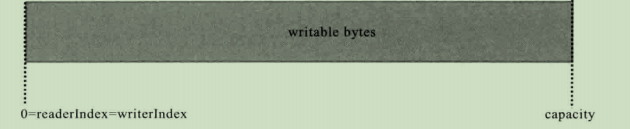
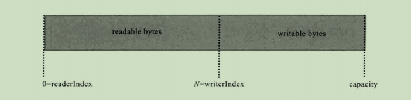
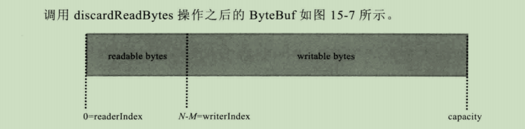
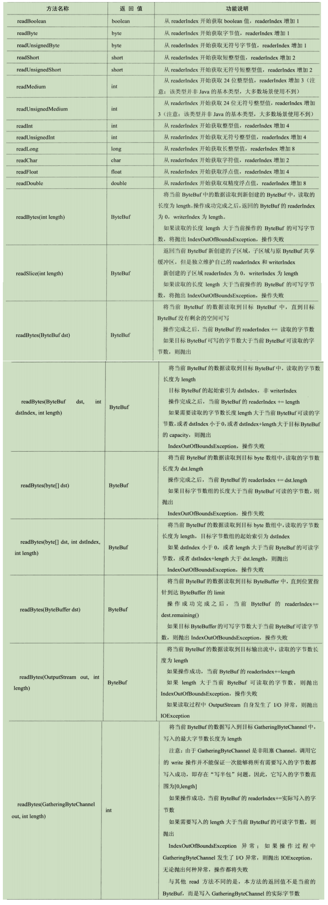
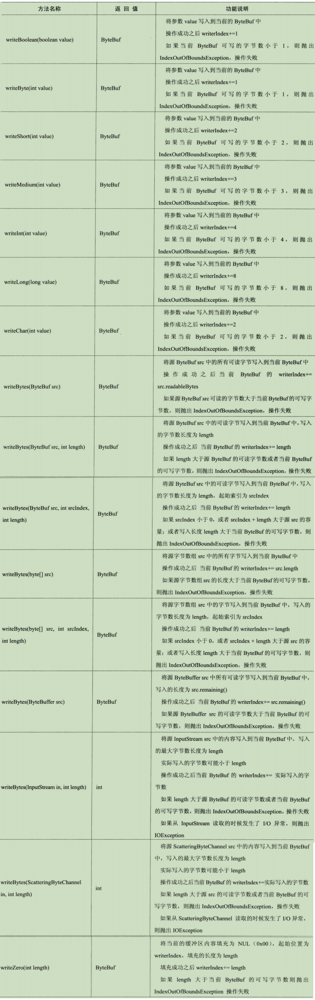
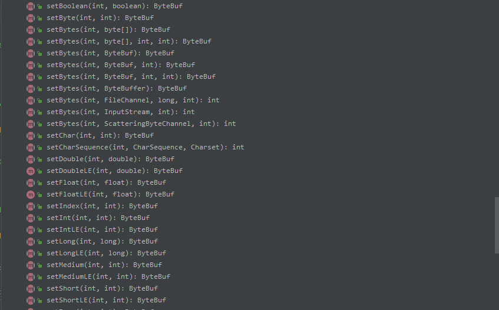
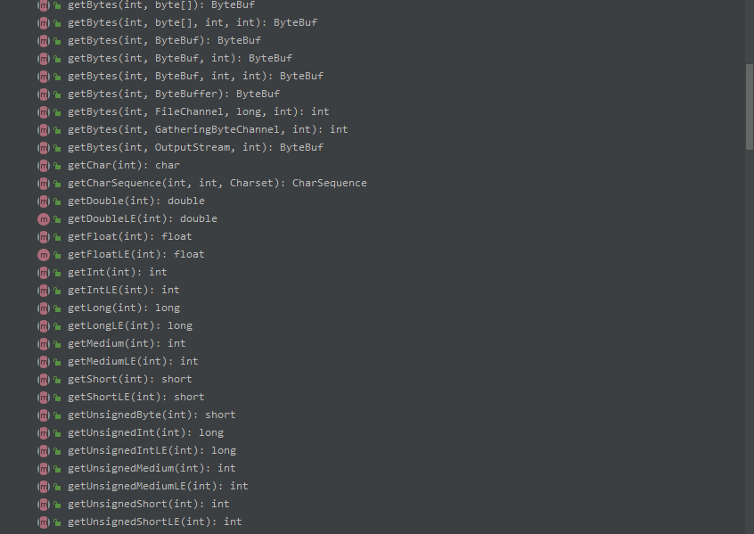
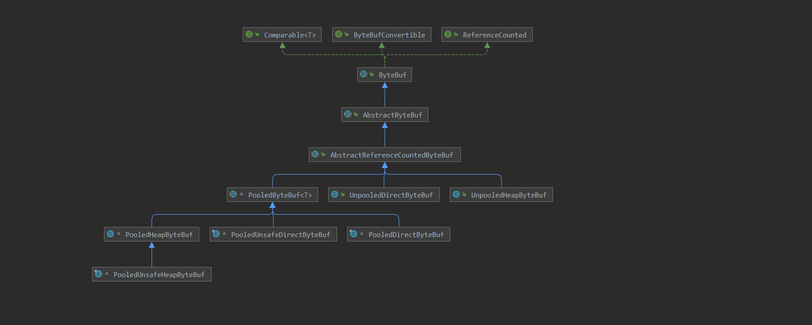

# 一、netty源码解析

源码版本为 **4.1.78.Final** ，源码注释地址：**https://gitee.com/haijun1998/netty/tree/source-read-4.1.78.Final/**

参考文档：https://www.modb.pro/db/215166

## 1. ByteBuf

**ByteBuf** 是对 **JDK ByteBuffer** 的实现，增加了额外的功能，解决了原 **ByteBuffer** 不能进行动态扩容，以及需要手动操作 **flip()** 对 **positio** 指针位置进行重置，否者很容易导致读取到错误的数据；而 **ByteBuf** 解决了动态扩容的问题，并且使用 **readIndex** 和 **writerIndex** 两个指针分别指向了 **读索引** 和 **写索引** 两者互不干扰。

下面是，初始化时，**ByteBuf** 两个指针的位置



下面是，写了 N 个字节的 **writerIndex** 的位置




下面是读取 M 个直接之后的 **readerIndex** 的为位置，注意其中 M < N


调用 **discardReadBytes** 操作之后，可以释放 **0 ~ readerIndex** 之间的数据



### 1.1 常用API

#### 顺序读（read）



#### 顺序写（write）



Netty中 **ByteBuf** 提供了 **readerIndex** 和 **writerIndex** 两个指针用于表示写入和读取的索引位置，将buf分割成三个区域；使用 **discardReadBytes** 会发生字节数组的内存赋值，所以频繁的调用会导致性能的下降


#### 随机读写（set和get）

**ByteBuf** 支持随机读写的特性。它与顺序读写的最大差别在于可以随机指定读写的索引位置；**随机读写不会对readerIndex、writeIndex产生任何影响**





## 2.ByteBuf源码

### 2.1 依赖图



- 堆内存（HeapByteBuf）字节缓冲区：**内存分配和回收速度快，可以被 JVM 进行管理**；缺点就是如果行 Socket 的 I/O 读写，需要额外做一次内存赋值，将堆内存对应的缓存区赋值到内核 Channel 中，性能会有一定程度的下降
- 直接内存（DirectByteBuf）字节缓冲区：非堆内存，它在堆外进行内存分配，相比于堆内存，它的分配和回收速度会慢一些，但是它对 Socket Channel 读写操作更快，因为少了一次内存复制

因为两者的特性，所以在 **ByteBuf** 的最佳实践是在 I/O 通信时使用 **DirectByteBuf** ， 后端业务消息的解码模块使用 **HeapByteBuf** ，这样的组合可以达到性能的最优；而 netty 也提供了 **对象池的ByteBuf** 和 **普通ByteBuf** 两种提供给用户进行使用

### 2.2 AbstractByteBuf

以下是 **AbstractByteBuf** 抽象类，继承至 **ByteBuf** 抽象类，其中只定义了 **readerIndex** 和 **writeIndex** 、**maxCapacity** ，等公共的参数，其中并没有定义任何的数组或者缓冲区，因为**AbstractByteBuf** 并不知道是需要采用直接内存还是堆内存进行实现，所以都交由子类进行实现

```java
public abstract class AbstractByteBuf extends ByteBuf {
    static final boolean checkAccessible; // accessed from CompositeByteBuf

    /**
     * 用于检测是否操作界限
     */
    private static final boolean checkBounds;

    static {
        //获取系统配置中是否指定了当前的值，如果没有配置，直接返回默认true
        checkAccessible = SystemPropertyUtil.getBoolean(PROP_CHECK_ACCESSIBLE, true);
        checkBounds = SystemPropertyUtil.getBoolean(PROP_CHECK_BOUNDS, true);
        if (logger.isDebugEnabled()) {
            logger.debug("-D{}: {}", PROP_CHECK_ACCESSIBLE, checkAccessible);
            logger.debug("-D{}: {}", PROP_CHECK_BOUNDS, checkBounds);
        }
    }

    /**
     * static 类型，所有继承类用于共享的对象，目的是用于检测内存泄露
     */
    static final ResourceLeakDetector<ByteBuf> leakDetector =
            ResourceLeakDetectorFactory.instance().newResourceLeakDetector(ByteBuf.class);
    /**
     * 读索引
     */
    int readerIndex;

    /**
     * 写索引
     */
    int writerIndex;

    /**
     * 最大容量
     */
    private int maxCapacity;
    
    protected AbstractByteBuf(int maxCapacity) {
        checkPositiveOrZero(maxCapacity, "maxCapacity");
        this.maxCapacity = maxCapacity;
    }
}
```

#### readBytes()

其它的 Api 与之类似就不在看了，每个类型的 Api 都看一个就行了

```java
public ByteBuf readBytes(byte[] dst, int dstIndex, int length) {
        /**
         * 先检测读取的长度是否小于0
         * 检查可读的长度不能小于需要读取的长度，用 writeIndex - length ，不能小于 readerIndex；因为可读字节是 writeIndex - readerIndex
         * 例如：
         * writeIndex = 4；readerIndex = 2 ，可读字节数长度就为 2
         * 如果 length = 3，那么 writeIndex - length = 1  ; readerIndex > 1 就表示已经超过了可读的范围
         */
        checkReadableBytes(length);
        //进行数据的读取
        getBytes(readerIndex, dst, dstIndex, length);
        //读取成功了之后将 readerIndex + length
        readerIndex += length;
        return this;
    }
```

#### writeBytes()

```java
public ByteBuf writeBytes(byte[] src, int srcIndex, int length) {
    //判断目标数据的容量跟当前可写的容量，对缓冲区进行扩容
    ensureWritable(length);
    //写入数据
    setBytes(writerIndex, src, srcIndex, length);
    //将写指针进行移动
    writerIndex += length;
    return this;
}
```

判断可写容量是否满足目标索引的长度，不满足则进行扩容

```java
final void ensureWritable0(int minWritableBytes) {
        // 获取到当前写的索引值
        final int writerIndex = writerIndex();
        // 写的索引值 + 数据的长度，获取到目标容量
        final int targetCapacity = writerIndex + minWritableBytes;
        // 检查目标容量的值是否大于等于0 并且要小于等于设置的最大容量值
        if (targetCapacity >= 0 & targetCapacity <= capacity()) {
            ensureAccessible();
            return;
        }
        // 如果超过了最大容量或者小于0抛出异常
        if (checkBounds && (targetCapacity < 0 || targetCapacity > maxCapacity)) {
            ensureAccessible();
            throw new IndexOutOfBoundsException(String.format(
                    "writerIndex(%d) + minWritableBytes(%d) exceeds maxCapacity(%d): %s",
                    writerIndex, minWritableBytes, maxCapacity, this));
        }
        // 获取到可写的长度，缓冲区数组的长度 - writeIndex
        final int fastWritable = maxFastWritableBytes();
        /**
         * 判断 可写的长度是否大于需要写入的长度，如果不大于，获取到目标需要的长度进行计算新的容量
         * 容量计算如下：
         * 1.判断目标容量值是否大于最大容量值的数据
         * 2.目标容量值是否大于设定的阈值数据（4m），有以下三种情况：
         *  等于阈值数据：直接返回阈值数据集
         *  大于阈值数据：
         *       判断目标容量值是否大于最大容量（maxCapacity - 阈值），如果大于直接赋值为最大值容量
         *       不大于最大容量值的话直接加上设定的阈值，以每次4m的容量进行扩张
         *  小于阈值数据：
         *       目标容量值是否大于64，如果不大于以64为基数每次 2的幂次方进行扩容数据
         *
         *  采用倍数增长或者步进的方式是，防止频繁的内存扩容影响到系统效率；因为如果直接以目标容量进行扩容，那么会导致数据写入完成之后
         *  writeIndex = 0，这样每次进行数据的添加都会导致扩容
         */
        int newCapacity = fastWritable >= minWritableBytes ? writerIndex + fastWritable
                : alloc().calculateNewCapacity(targetCapacity, maxCapacity);
        // 对缓冲区进行扩容，数组的迁移等
        capacity(newCapacity);
    }
```

下面是 **io.netty.buffer.AbstractByteBufAllocator#calculateNewCapacity()** 计算扩容的方法，计算是采用**先倍增，后步进** 的方式进行扩容，采用这样的方式是先：

> 64字节 ----> 128字节 ----> 256字节

这样的内存扩张对大多数系统来说是可以接受的，如果增长到一定程度：

> 10M ---> 20M ----> 40M

如果系统只需要12M的扩容，那么就会遭成内存的浪费，从倍增转换成步进的方式进行平滑升级，到了一定的阈值之后就改成步进进行平滑升级；这里netty采用 **4M** 作为阈值（经验值，场景不同，阈值也可能不同）

```java
public int calculateNewCapacity(int minNewCapacity, int maxCapacity) {
        //检查是否小于0
        checkPositiveOrZero(minNewCapacity, "minNewCapacity");
        //目标容量是否大于最大容量值
        if (minNewCapacity > maxCapacity) {
            throw new IllegalArgumentException(String.format(
                    "minNewCapacity: %d (expected: not greater than maxCapacity(%d)",
                    minNewCapacity, maxCapacity));
        }
        //获取到阈值为 4M
        final int threshold = CALCULATE_THRESHOLD; // 4 MiB page
        //如果等于阈值，直接返回出去
        if (minNewCapacity == threshold) {
            return threshold;
        }

        // If over threshold, do not double but just increase by threshold.
        if (minNewCapacity > threshold) {
            //如果超过设置的阈值，不能采用倍增的方式进行扩容，防止内存的膨胀和浪费，每次进行 4M 的方式进行内存扩张，如果大于缓冲区的最大长度直接将最大容量赋值给新的容量
            int newCapacity = minNewCapacity / threshold * threshold;
            if (newCapacity > maxCapacity - threshold) {
                newCapacity = maxCapacity;
            } else {
                //每次进行4M的扩容
                newCapacity += threshold;
            }
            return newCapacity;
        }

        // 64 <= newCapacity is a power of 2 <= threshold
        /**
         * 如果目标容量小于阈值的话，就以64为计数进行倍增
         * 采用倍增或者步进算法的原因：如果以 minNewCapacity 作为目标容量，则本次进行扩容后 writeIndex = 0。下一次进行写入操作的时候，需要再次进行动态扩张，这样
         * 就会形成第一次动态扩容之后，每次写入操作都要进行扩容，很影响系统效率
         */
        final int newCapacity = MathUtil.findNextPositivePowerOfTwo(Math.max(minNewCapacity, 64));
        return Math.min(newCapacity, maxCapacity);
    }
```

#### discardReadBytes()

可重用缓存，目的将 **readerIndex、writerIndex** 指针进行重置：

- 如果读写指针不一样，将还未读取的数据进行拷贝到从0开
- 读写指针一样，直接将读写指针重置为0，写就直接从0开始覆盖

```java
public ByteBuf discardReadBytes() {
        //判断当前读索引是否为0，如果为0说明没有可重用的缓存区，只有 0 - readerIndex 之间的区域才叫做可重用缓冲区
        if (readerIndex == 0) {
            ensureAccessible();
            return this;
        }

        //如果读索引跟写索引不相等，说明存在尚未读取的数据以及已经读取过的被丢弃的缓存区
        if (readerIndex != writerIndex) {
            /**
             * 进行数据的复制，从索引为0开始，复制未读取的数据（writerIndex - readerIndex）
             * 会判断是否有内存地址以及是否有数组，都是由子类进行实现
             */
            setBytes(0, this, readerIndex, writerIndex - readerIndex);
            //写索引重置为 写减去读 的索引
            writerIndex -= readerIndex;
            /**
             * 重置mark标记
             * 这里重置时，会将当前的读索引传入，方法里面为进行判断，如果 读索引 <= 传入的值，那么直接设置为0
             * 大于当前传入的值的话，直接减去传入的值
             */
            adjustMarkers(readerIndex);
            //读索引设置为0
            readerIndex = 0;
        } else {
            //没有未读的数据，不需要调整缓存
            ensureAccessible();
            //调用备份的读写索引
            adjustMarkers(readerIndex);
            writerIndex = readerIndex = 0;
        }
        return this;
    }
```

#### skipBytes()

```java
public ByteBuf skipBytes(int length) {
    //检查可读的数据是否大于当前传入需要跳过的值
    checkReadableBytes(length);
    //读索引相加
    readerIndex += length;
    return this;
}
```

### 2.3 AbstractReferenceCountedByteBuf

**当前类主要是对引用进行计数，类似于 JVM 内存回收的对象引用计数器，用于跟踪对象的分配和销毁，做自动内存回收的**， 在上面依赖图中可以看到具体缓存的实现都继承了当前类

```java
public abstract class AbstractReferenceCountedByteBuf extends AbstractByteBuf {
    // 保存 refCnt 在内存中的偏移量
    private static final long REFCNT_FIELD_OFFSET =
            ReferenceCountUpdater.getUnsafeOffset(AbstractReferenceCountedByteBuf.class, "refCnt");

    // 保存 refCnt 字段的原子化修改器
    private static final AtomicIntegerFieldUpdater<AbstractReferenceCountedByteBuf> AIF_UPDATER =
            AtomicIntegerFieldUpdater.newUpdater(AbstractReferenceCountedByteBuf.class, "refCnt");

    // 创建一个 refCnt 字段的修改器，所有的修改都放在修改器里面进行操作
    private static final ReferenceCountUpdater<AbstractReferenceCountedByteBuf> updater =
            new ReferenceCountUpdater<AbstractReferenceCountedByteBuf>() {
        @Override
        protected AtomicIntegerFieldUpdater<AbstractReferenceCountedByteBuf> updater() {
            return AIF_UPDATER;
        }
        @Override
        protected long unsafeOffset() {
            return REFCNT_FIELD_OFFSET;
        }
    };

    //引用计数器，每调用一次 retain 方法，引用计数器就加2，默认初始化值为2
    @SuppressWarnings({"unused", "FieldMayBeFinal"})
    private volatile int refCnt;
    
    protected AbstractReferenceCountedByteBuf(int maxCapacity) {
        super(maxCapacity);
        //设置引用计数器默认值为2
        updater.setInitialValue(this);
    }
    
}
```

#### retain()

**retain()** 方法调用了 **updater** 中的 **retain()** 每次操作都会对 **refCnt** 计数器进行加2，而 **refCnt** 使用了偶数进行操作，如果采用奇数进行奇数就会出现下面场景的问题：

```text
refcnt为什么为偶数？
场景：一个obj的refcnt为1，有三个修改这个obj的引用计数
线程1：执行release() 方法修改refcnt为0，这时应该进一步执行deallocate()释放对象，但是在释放前切换到线程2
线程2：执行了retain() 方法修改refcnt为1，发现oldRef，修改前的数为0，这时认为这个对象已经被回收了，就执行数据的回滚，然后抛出异常
线程3：由于上面修改和回滚是两步操作，所以在回滚前 refcnt为1，这时线程3调用了 retain() 将值修改了2，		oldRef为1，认为是一个存活的对象，不会抛出异常，这时切回线程1，执行deallocate() 方法直接释放了对象
	
修改为使用偶数后：refcnt初始值为2，默认认为已经引用了一次
线程1：调用release()方法，修改refcnt为1，这时应该进一步执行deallocate()释放对象，在释放前切换到线程2
线程2：调用retain()方法，应该修改refcnt为3，但是oldRef的值为1，奇数认为此对象已经被回收，在回滚数据前切换了线程3
线程3：调用retain()方法，在线程2执行回滚前时进行切换修改了refcnt应该为5（retain方法每次都会加2），但是发现oldRef为3，奇数抛出异常

此外用2的倍数，而不是3的倍数或者其他，原因应该是2的倍数位运算更加方便
```


```java
@Override
public ByteBuf retain() {
    return updater.retain(this);
}
```

```java
public final T retain(T instance) {
    //每次调用就加1
    return retain0(instance, 1, 2);
}
```

```java
// rawIncrement：引用计数器相加的数；increment：每次相加的数；increment == rawIncrement * 2
private T retain0(T instance, final int increment, final int rawIncrement) {
    int oldRef = updater().getAndAdd(instance, rawIncrement);
    //如果为奇数，那么当前对象应该被释放了
    if (oldRef != 2 && oldRef != 4 && (oldRef & 1) != 0) {
        throw new IllegalReferenceCountException(0, increment);
    }
    // don't pass 0!
    //判断 oldRef 是否为0如果为0，需要将数据进行回滚
    if ((oldRef <= 0 && oldRef + rawIncrement >= 0)
        || (oldRef >= 0 && oldRef + rawIncrement < oldRef)) {
        // overflow case
        updater().getAndAdd(instance, -rawIncrement);
        throw new IllegalReferenceCountException(realRefCnt(oldRef), increment);
    }
    return instance;
}
```

#### release()

根据是否释放的是最终版，来决定是否需要销毁对象

```java
public final boolean release(T instance) {
    int rawCnt = nonVolatileRawCnt(instance);
    /**
     * 先判断引用计数器是否等于2（最终引用的释放），如果等于2，先尝试释放期望为2，如果成功了直接返回，如果期望为2释放失败
     * 在调用 retryRelease0() 通过死循环进行减1的操作
     *
     * 如果不等于2那么就执行非最终版本的释放，非最终版的释放，返回都为false
     *
     * toLiveRealRefCnt()：获取到实际引用次数，如果是偶数就用 raw/2，如果是奇数就抛出异常
   */
    return rawCnt == 2 ? tryFinalRelease0(instance, 2) || retryRelease0(instance, 1)
        : nonFinalRelease0(instance, 1, rawCnt, toLiveRealRefCnt(rawCnt, 1));
}
```

