# 一、netty核心类

- Channel：netty定义的管道，负责底层通讯并关联netty组件
- ChannelHandler：管道处理器
- ChannelPipeline：管道流水处理器，主要用于对一个请求的多个处理
- ChannelHandlerContext：管道处理器的上下文，通过上下文来调用 **ChannelHandler**
- EventLoop：用于对应具体的事件循环，每个 channel 对象都会对应一个 EventLoop，每个EventLoop又对应一个 Selector，用于循环处理
- EventLoopGroup：用于管理多个 EventLoop，用于将 channel 跟 EventLoop进行关联
- BootStrap

## 1. Channel


### AttributeMap

父接口持有属性的能力，通过 `attr` 方法获取属性，`hasAttr` 判断属性是否存在

```java
public interface AttributeMap {
    <T> Attribute<T> attr(AttributeKey<T> key);
    <T> boolean hasAttr(AttributeKey<T> key);
}
```

### ChannelOutboundInvoker

父接口线程出栈执行器，**Channel** 出栈执行器，具备底层通讯能力，可以看到 **Netty** 的操作都是异步的，方法调用都是返回 **Future** 或者 **Promise** 对象，当方法完成后会通过 **Future** 或 **Promise** 收到通知

```java
public interface ChannelOutboundInvoker {
    //绑定接口
    ChannelFuture bind(SocketAddress localAddress);
    ChannelFuture bind(SocketAddress localAddress, ChannelPromise promise);
    //建立连接
    ChannelFuture connect(SocketAddress remoteAddress);
    ChannelFuture connect(SocketAddress remoteAddress, SocketAddress localAddress); 	     ChannelFuture connect(SocketAddress remoteAddress, ChannelPromise promise);
    ChannelFuture connect(SocketAddress remoteAddress, SocketAddress localAddress, ChannelPromise promise);
    //断开关闭连接
    ChannelFuture disconnect();
    ChannelFuture disconnect(ChannelPromise promise);
    ChannelFuture close();
    ChannelFuture close(ChannelPromise promise);
    //从EventLoop注销
    ChannelFuture deregister();
    ChannelFuture deregister(ChannelPromise promise);
    //设置关心的 I/O 事件为 OP_READ
    ChannelOutboundInvoker read();
    //写数据
    ChannelFuture write(Object msg);
    ChannelFuture write(Object msg, ChannelPromise promise);
    ChannelOutboundInvoker flush();
    ChannelFuture writeAndFlush(Object msg, ChannelPromise promise);
    ChannelFuture writeAndFlush(Object msg);
    //构造future/promise
    ChannelPromise newPromise();
    ChannelProgressivePromise newProgressivePromise();
    ChannelFuture newSucceededFuture();
    ChannelFuture newFailedFuture(Throwable cause);
    ChannelPromise voidPromise();
}
```

### Comparable

父接口提供管道之间的比较，泛型为 **Channel**

```java
public interface Comparable<T> {
    public int compareTo(T o);
}
```

### Channel

**Channel** 接口本身提供 **通道状态** 和 **Netty组件** 的关联关系

```java
public interface Channel extends AttributeMap, ChannelOutboundInvoker, Comparable<Channel> {
    //管道的Id
    ChannelId id();
    //当前管道 Channel注册的EventLoop
    EventLoop eventLoop();
    //被ServerSocketChannel接受的SocketChannel将返回ServerSocketChannel作为其parent
    Channel parent();
    //返回管道的配置对象
    ChannelConfig config();
    //是否打开
    boolean isOpen();
    //是否注册到 EventLoop
    boolean isRegistered();
    //是否已经激活（建立连接）
    boolean isActive();
    ChannelMetadata metadata();
    //管道的本地地址
    SocketAddress localAddress();
    //管道连接的远程地址
    SocketAddress remoteAddress();
    //返回 Future当管道关闭后会收到通知
    ChannelFuture closeFuture();
    //是否可以执行写操作
    boolean isWritable();
    //当isWritable返回true时，返回可写字节数，否则返回0
    long bytesBeforeUnwritable();
    //当前isWritable返回false时，返回可读字节数，否则返回0
    long bytesBeforeWritable();
    //跟底层进行关联时，并不是由 Channel 进行而是由 Channel.Unsafe进行关联操作
    Unsafe unsafe();
    //返回管道处理流水线
    ChannelPipeline pipeline();
    //ByteBuf分配器
    ByteBufAllocator alloc();
    //读取管道
    @Override
    Channel read();
    //刷新管道
    @Override
    Channel flush();
}
```

### Channel.Unsafe

**Channel** 接口里面声明的内部接口，是 **Netty** 自己使用的，不会被用户代码直接调用，它负责真正的底层通讯

```java
interface Unsafe {
        RecvByteBufAllocator.Handle recvBufAllocHandle();
    //本地地址
        SocketAddress localAddress();
    //远程地址
        SocketAddress remoteAddress();
    //注册到 EventLoop上
        void register(EventLoop eventLoop, ChannelPromise promise);
    //绑定
        void bind(SocketAddress localAddress, ChannelPromise promise);
    //开启连接
        void connect(SocketAddress remoteAddress, SocketAddress localAddress, ChannelPromise promise);
    //断开连接
        void disconnect(ChannelPromise promise);
    //关闭
        void close(ChannelPromise promise);
    //强行关闭
        void closeForcibly();
    //注销
        void deregister(ChannelPromise promise);
    //开启一个读操作
        void beginRead();
    //写操作
        void write(Object msg, ChannelPromise promise);
    //刷新
        void flush();
    //返回一个空的 Promise
        ChannelPromise voidPromise();
        ChannelOutboundBuffer outboundBuffer();
    }
```

客户端使用 **NioByteUnsafe**，服务端使用 **NioMessageUnsafe**

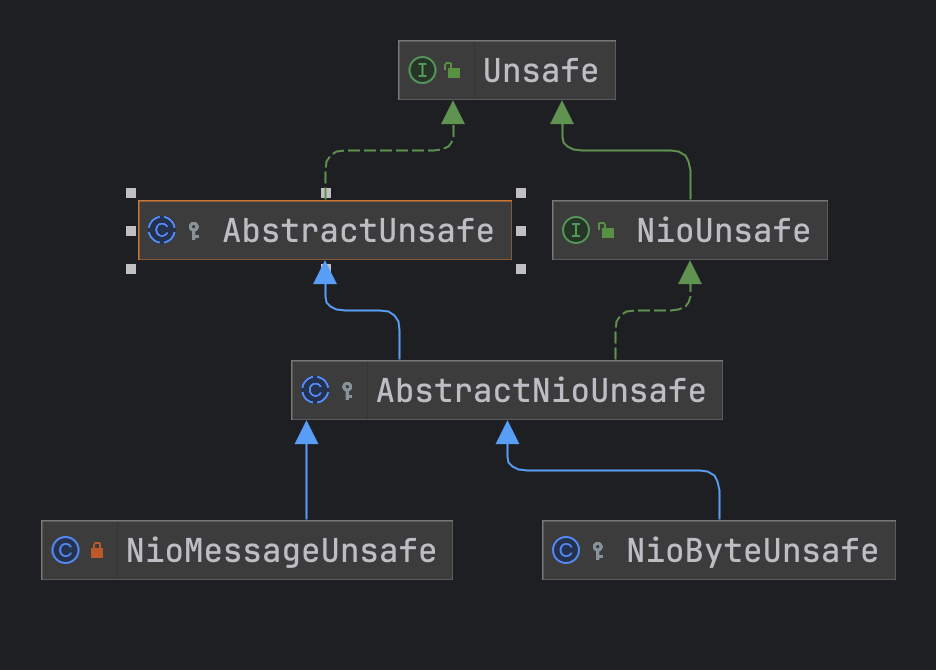


### ServerSocketChannel（服务端）

标记接口，继承至 **Channel** 接口，通过 **ServerChannel.aceept()** 来创建一个 **Channel**，实现的例子就是 **NioServerSocketChannel**

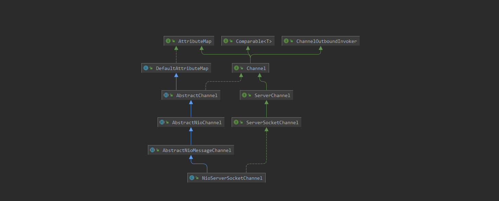

```java
public interface ServerSocketChannel extends ServerChannel {
    //配置对象
    @Override
    ServerSocketChannelConfig config();
    //本地地址
    @Override
    InetSocketAddress localAddress();
    //远程连接地址
    @Override
    InetSocketAddress remoteAddress();
}
```

### SocketChannel（客户端）

客户端管道对象

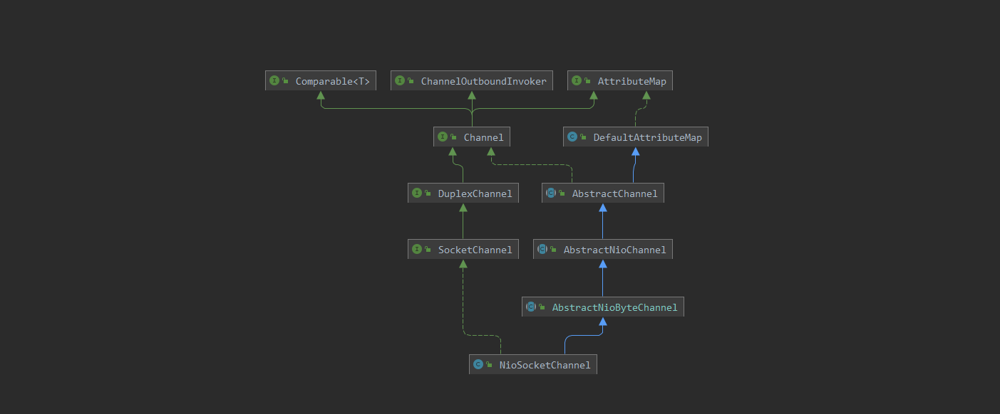

```java
public interface SocketChannel extends DuplexChannel {
    @Override
    ServerSocketChannel parent();

    //配置对象
    SocketChannelConfig config();
    //本地地址
    InetSocketAddress localAddress();
    //远程地址
    InetSocketAddress remoteAddress();
}
```


## 2. ChannelHandler

 **ChannelHandler** 接口提供了ChannelHandler被 **ChannelHandlerContext** 加入或移除时的钩子 

```java
public interface ChannelHandler {
    //将其加入到 Context上下文中
    void handlerAdded(ChannelHandlerContext ctx) throws Exception;
    //从上下文中移除
    void handlerRemoved(ChannelHandlerContext ctx) throws Exception;
    //捕获异常
    void exceptionCaught(ChannelHandlerContext ctx, Throwable cause) throws Exception;
    
    @Inherited
    @Documented
    @Target(ElementType.TYPE)
    @Retention(RetentionPolicy.RUNTIME)
    @interface Sharable {
        // no value
    }
}
```

**ChannelHandler** 又分为入栈和出栈，**ChannelInboundHandler、ChannelOutboundHandler**

### 2.1 ChannelOutboundHandler

```java
public interface ChannelOutboundHandler extends ChannelHandler {
    //当bind操作时触发
    void bind(ChannelHandlerContext ctx, SocketAddress localAddress, ChannelPromise promise) throws Exception;

    //当connect操作时触发
    void connect(
            ChannelHandlerContext ctx, SocketAddress remoteAddress,
            SocketAddress localAddress, ChannelPromise promise) throws Exception;

    //断开disconnect时触发
    void disconnect(ChannelHandlerContext ctx, ChannelPromise promise) throws Exception;

    //关闭close操作时触发
    void close(ChannelHandlerContext ctx, ChannelPromise promise) throws Exception;

    //从EventLoop移除时触发
    void deregister(ChannelHandlerContext ctx, ChannelPromise promise) throws Exception;

    //当读取时触发
    void read(ChannelHandlerContext ctx) throws Exception;

    //当写操作时触发
    void write(ChannelHandlerContext ctx, Object msg, ChannelPromise promise) throws Exception;

    //当刷新操作时触发
    void flush(ChannelHandlerContext ctx) throws Exception;
}
```

### 2.2 ChannelInboundHandler

```java
public interface ChannelInboundHandler extends ChannelHandler {

    //管道注册到 EventLoop时触发
    void channelRegistered(ChannelHandlerContext ctx) throws Exception;

    //管道从 EventLoop移除时触发
    void channelUnregistered(ChannelHandlerContext ctx) throws Exception;

    //管道激活后触发（如连接）
    void channelActive(ChannelHandlerContext ctx) throws Exception;

    //Channel未激活后触发（如连接关闭）
    void channelInactive(ChannelHandlerContext ctx) throws Exception;

    //当Channel读取到数据后触发
    void channelRead(ChannelHandlerContext ctx, Object msg) throws Exception;

    //当Channel读取完成后触发
    void channelReadComplete(ChannelHandlerContext ctx) throws Exception;

    //用户自定义事件触发
    void userEventTriggered(ChannelHandlerContext ctx, Object evt) throws Exception;

    //管道的isWritable发生变化后触发
    void channelWritabilityChanged(ChannelHandlerContext ctx) throws Exception;

    //发生异常时触发
    @Override
    @SuppressWarnings("deprecation")
    void exceptionCaught(ChannelHandlerContext ctx, Throwable cause) throws Exception;
}
```

**ChannelInboundHandler、ChannelOutboundHandler** 中的方法子类不可能都实现，所以就提供了 **ChannelInboundHandlerAdapter、ChannelOutboundHandlerAdapter** 两个类将所有方法都进行了默认实现，用户只需要自己实现对应的方法就行

```java
public class ChannelInboundHandlerAdapter extends ChannelHandlerAdapter implements ChannelInboundHandler {

    //方法名都一一对应，其中Skip用于标识方法是否需要跳过
    @Skip
    @Override
    public void channelRegistered(ChannelHandlerContext ctx) throws Exception {
        ctx.fireChannelRegistered();
        
    }
    
    @Skip
    @Override
    public void channelUnregistered(ChannelHandlerContext ctx) throws Exception {
        ctx.fireChannelUnregistered();
    }
}
```

如果用户需要同时处理 **入栈、出栈** 的方法，可以通过 **ChannelDuplexHandler** 实现

```java
public class ChannelDuplexHandler extends ChannelInboundHandlerAdapter implements ChannelOutboundHandler {
    @Skip
    @Override
    public void bind(ChannelHandlerContext ctx, SocketAddress localAddress,
                     ChannelPromise promise) throws Exception {
        ctx.bind(localAddress, promise);
    }
    // ... 省略其他ChannelOutboundHandler方法实现
}
```

## 3. ChannelPipeline

有了ChannelHandler之后存在以下几个问题：

- 单个 **ChannelHandler** 无法处理整个网络请求，往往一个 **ChannelHandler** 只会处理一次请求的部分业务。比如编解码和业务处理往往是不同的Handler。
- 当存在多个 **ChannelHandler** 的情况下，如何编排 **ChannelHandler**
- Channel接口继承了 **ChannelOutboundInvoker** 接口，可以触发 **ChannelOutboundHandler出栈Handler** 执行，如何触发入栈Handler执行。

**ChannelPipeline** 就是为了解决这些问题而生的，他不但继承了ChannelOutboundInvoker接口可以触发出栈事件，同时继承了 **ChannelInboundInvoker** 可以触发入栈事件。这些 **fireXXX** 与 **ChannelInboundHandler** 的方法一一对应

```java
public interface ChannelPipeline
        extends ChannelInboundInvoker, ChannelOutboundInvoker, Iterable<Entry<String, ChannelHandler>> {

    //将 Handler 添加到队首
    ChannelPipeline addFirst(String name, ChannelHandler handler);

    ChannelPipeline addFirst(EventExecutorGroup group, String name, ChannelHandler handler);

    //添加到队尾
    ChannelPipeline addLast(String name, ChannelHandler handler);

    ChannelPipeline addLast(EventExecutorGroup group, String name, ChannelHandler handler);

    //添加到某个 Handler之前
    ChannelPipeline addBefore(String baseName, String name, ChannelHandler handler);

    ChannelPipeline addBefore(EventExecutorGroup group, String baseName, String name, ChannelHandler handler);

    //添加到某个 Handler之后
    ChannelPipeline addAfter(String baseName, String name, ChannelHandler handler);

    ChannelPipeline addAfter(EventExecutorGroup group, String baseName, String name, ChannelHandler handler);

    //添加多个到队首
    ChannelPipeline addFirst(ChannelHandler... handlers);

    ChannelPipeline addFirst(EventExecutorGroup group, ChannelHandler... handlers);

    //添加多个到队尾
    ChannelPipeline addLast(ChannelHandler... handlers);

    ChannelPipeline addLast(EventExecutorGroup group, ChannelHandler... handlers);

    //移除某个 handler
    ChannelPipeline remove(ChannelHandler handler);

    ChannelHandler remove(String name);

    <T extends ChannelHandler> T remove(Class<T> handlerType);

    //移除队首
    ChannelHandler removeFirst();

    //移除队尾
    ChannelHandler removeLast();

    //替换
    ChannelPipeline replace(ChannelHandler oldHandler, String newName, ChannelHandler newHandler);

    ChannelHandler replace(String oldName, String newName, ChannelHandler newHandler);

    <T extends ChannelHandler> T replace(Class<T> oldHandlerType, String newName,
                                         ChannelHandler newHandler);

    //返回队首
    ChannelHandler first();

    //返回队首的上下文
    ChannelHandlerContext firstContext();

    //返回队尾
    ChannelHandler last();

    //队尾的上下文
    ChannelHandlerContext lastContext();

    //获取某个handler
    ChannelHandler get(String name);

    <T extends ChannelHandler> T get(Class<T> handlerType);

    //获取某个handler的上下文
    ChannelHandlerContext context(ChannelHandler handler);

    //对应名称的上下文
    ChannelHandlerContext context(String name);

    ChannelHandlerContext context(Class<? extends ChannelHandler> handlerType);

    //返回管道
    Channel channel();

    //获取所有handler的名称
    List<String> names();

    //转换成map
    Map<String, ChannelHandler> toMap();

    /**
     * 下面是覆写了触发入栈方法的实现
     */
    @Override
    ChannelPipeline fireChannelRegistered();

    @Override
    ChannelPipeline fireChannelUnregistered();

    @Override
    ChannelPipeline fireChannelActive();

    @Override
    ChannelPipeline fireChannelInactive();

    @Override
    ChannelPipeline fireExceptionCaught(Throwable cause);

    @Override
    ChannelPipeline fireUserEventTriggered(Object event);

    @Override
    ChannelPipeline fireChannelRead(Object msg);

    @Override
    ChannelPipeline fireChannelReadComplete();

    @Override
    ChannelPipeline fireChannelWritabilityChanged();

    @Override
    ChannelPipeline flush();
}
```

在创建 **Channel** 管道时，例如：**AbstractChannel** 中启动 **pipline** 实际创建的是 **DefaultChannelPipline** 进行处理，在添加到 **pipeline** 时实际是以 **DefaultChannelHandlerContext** 类型包装了一层，在 **pipeline** 进行传递的是 **ChannelHandlerContext** 的类型

## 4. ChannelHandlerContext

 **ChannelHandlerContext** 是一个上下文对象，持有 **Channel/ChannelHandler/ChannelPipeline** 重要组件。同时它也继承了 **ChannelInboundInvoker** 和 **ChannelOutboundInvoker**，可以触发入栈和出栈事件；而 **ChannelHandlerContext** 的链表结构是在 **AbstractChannelHandlerContext** 中体现

```java
abstract class AbstractChannelHandlerContext implements ChannelHandlerContext, ResourceLeakHint {
    //下一个节点
    volatile AbstractChannelHandlerContext next;
    //前置节点
    volatile AbstractChannelHandlerContext prev;
    //用于标识 @Skip 注解是否需要跳过的方法
    private final int executionMask;
    
	//用于寻找是否需要执行的 ChannelHandler
    private AbstractChannelHandlerContext findContextInbound(int mask) {
    	AbstractChannelHandlerContext ctx = this;
    	EventExecutor currentExecutor = executor();
        do {
            ctx = ctx.next;
            // 判断是否要跳过下一个AbstractChannelHandlerContext
        } while (skipContext(ctx, currentExecutor, mask, MASK_ONLY_INBOUND));
        return ctx;
    }
}
```

## 5. EventLoop

 **EventLoop **译为 **事件循环**，事件驱动的编程模型都有 **EventLoop** 这个概念（如javascript）。Netty的EventLoop可以认为是 **EventLoopGroup** 的一个特殊实现，它是一个线程构成的线程池服务。 

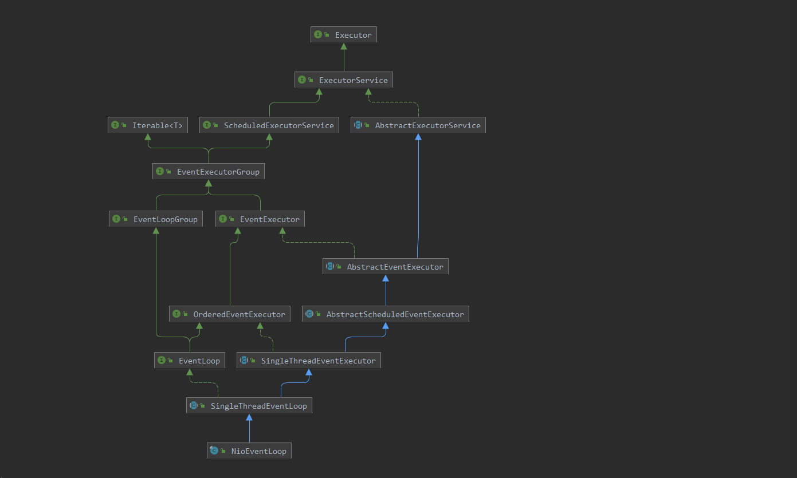

 **NioEventLoop** 是对于JDK NIO的事件循环处理，**每个NioEventLoop都持有一个Selector**，处理 **Selector** 上的 **SelectionKey** 事件。 

```java
public final class NioEventLoop extends SingleThreadEventLoop {
   
    private Selector selector;
    
    protected void run() {
        int selectCnt = 0;
        for (;;) {
            //轮询是否有事件发生
            select();
            //处理事件
            processSelectedKeys();
            // 执行任务
            runAllTasks();
        }
    }
}
```

父类  **SingleThreadEventExecutor** 绑定线程，并持有任务队列

```java
public abstract class SingleThreadEventExecutor extends AbstractScheduledEventExecutor implements OrderedEventExecutor {
    // 任务队列
    private final Queue<Runnable> taskQueue;
    // EventLoop绑定的线程
    private volatile Thread thread;
    // JDK Executor 单线程提供服务
    private final Executor executor;
}
```

## 6. EventLoopGroup

**EventLoopGroup** 管理多个 **EventLoop** ，主要负责选择 **EventLoop** 并注册 **Channel** 到对应的 **EventLoop**上。接口作用和方法职责在javadoc上很清楚，两个 **register** 方法的目的都是一样的，将Channel注册到EventLoop上

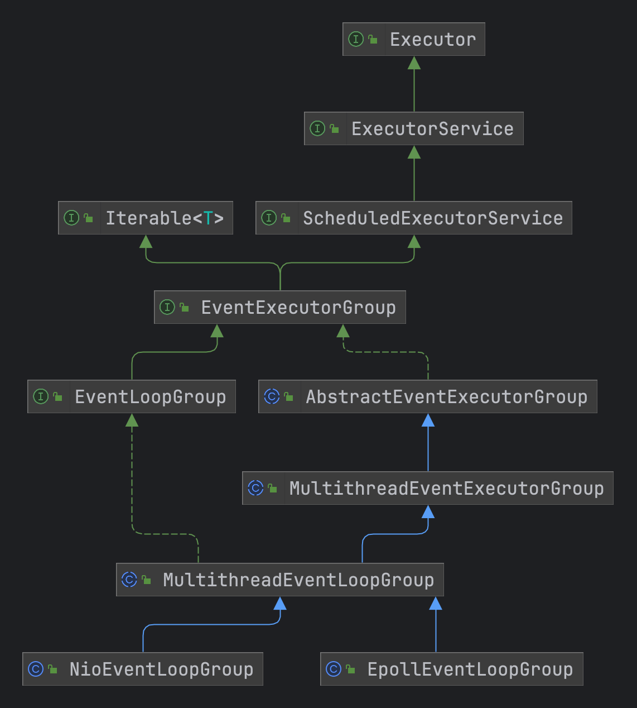

```java
public interface EventLoopGroup extends EventExecutorGroup {
    /**
     * 返回一个 EventLoop 对象用于跟channel进行注册，每一个channel对象都会对应一个 EventLoop 用于进行数据的处理
     */
    @Override
    EventLoop next();

    /**
     * 注册channel跟EventLoop进行关联
     */
    ChannelFuture register(Channel channel);

    /**
     * 注册一个 ChannelPromise 对象实际是对 channel 进行包装的，可以添加监听器等功能
     */
    ChannelFuture register(ChannelPromise promise);
}
```


# 二、源码解析

源码版本为：**4.1.78.Final**

## 1. 服务端启动流程

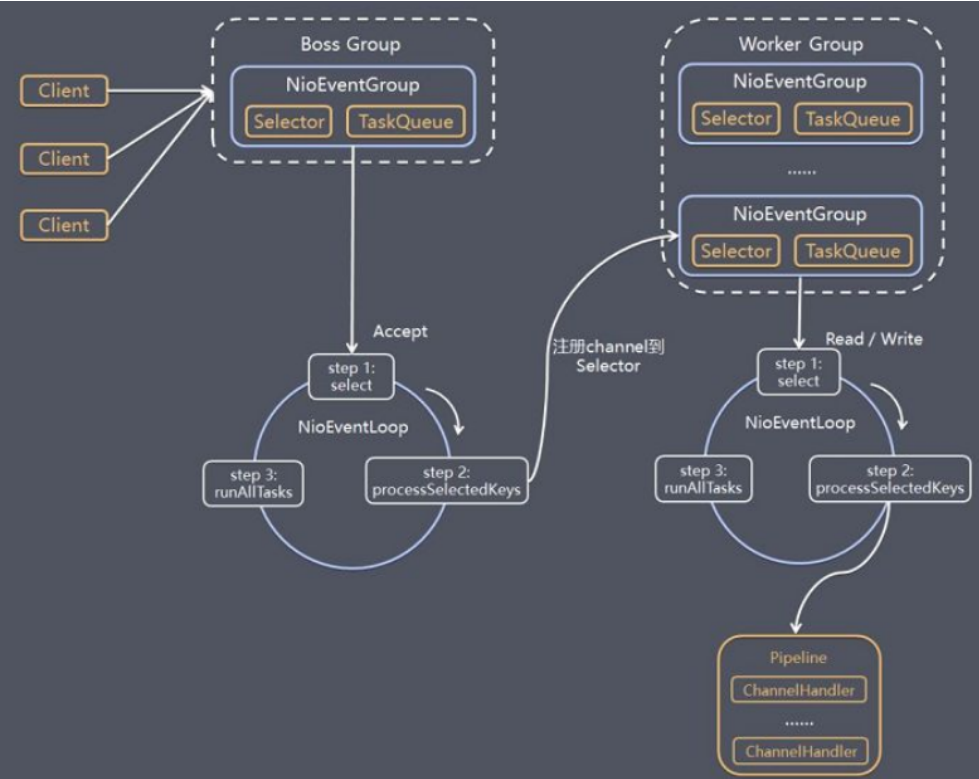

先从一个简单的例子开始解析：

- 创建ServerBootstrap服务端的启动器
- 指定主服务的线程池和处理线程池
  - 根据上面的处理模型：bossGroup用于处理客户端的连接，并且线程池中有任务来处理客户端的连接请求，然后将对应的channel管道又注册到workGroup线程中
  - 然后workGroup的任务也进行循环处理将对应的读写事件又交给handler进行处理
- 配置channel管道应该使用到类型
- 配置对应tcp的一些参数
- 指定子线程中的处理类
- 绑定端口，进行阻塞

```java
public void bind(int port) {
    NioEventLoopGroup bossGroup = new NioEventLoopGroup();
    NioEventLoopGroup workGroup = new NioEventLoopGroup();
    try {
        ServerBootstrap serverBootstrap = new ServerBootstrap();
        serverBootstrap
            .group(bossGroup, workGroup)
            //选择服务器channel的实现
            .channel(NioServerSocketChannel.class)
            .option(ChannelOption.SO_BACKLOG, 1024)
            .childHandler(new ChildChannelHandler());
        ChannelFuture channelFuture = serverBootstrap.bind(port).sync();
        //等待服务端监听端口关闭
        channelFuture.channel().closeFuture().sync();
    } catch (InterruptedException e) {
        e.printStackTrace();
    } finally {
        bossGroup.shutdownGracefully();
        workGroup.shutdownGracefully();
    }
}
```

### 1.1 ServerBootstrap

ServerBootstrap实现AbstractBootstrap并且指定了泛型内部的类型；**AbstractBootstrap** 其中只保存处理客户端连接请求的管道配置，而**ServerBootstrap** 则保存当客户端发送对应的读写事件时的处理管道配置

```java
public abstract class AbstractBootstrap<B extends AbstractBootstrap<B, C>, C extends Channel> implements Cloneable {
  //boss线程组，用于处理连接事件
    volatile EventLoopGroup group;
    @SuppressWarnings("deprecation")
    //管道工厂类，通过工厂来创建管道的类型，默认工厂类ReflectiveChannelFactory
    private volatile ChannelFactory<? extends C> channelFactory;
    private volatile SocketAddress localAddress;
    // 父级启动器配置属性
    private final Map<ChannelOption<?>, Object> options = new LinkedHashMap<ChannelOption<?>, Object>();
  	// 自定义的属性
    private final Map<AttributeKey<?>, Object> attrs = new ConcurrentHashMap<AttributeKey<?>, Object>();
  	// 主服务的管道处理类
    private volatile ChannelHandler handler;
}
```

创建时指定事件循环组，配置对应的相关配置信息给options中添加对应的数据配置（[Netty常用Option配置说明](https://www.cnblogs.com/acestart/p/14801869.html)）

```java
public class ServerBootstrap extends AbstractBootstrap<ServerBootstrap, ServerChannel> { 
		//子管道的配置属性
    private final Map<ChannelOption<?>, Object> childOptions = new LinkedHashMap<ChannelOption<?>, Object>();
    //子管道的属性
    private final Map<AttributeKey<?>, Object> childAttrs = new ConcurrentHashMap<AttributeKey<?>, Object>();
    //管道配置类，通过 ServerBootstrapConfig可以获取到 ServerBootstrap中绑定的属性
    private final ServerBootstrapConfig config = new ServerBootstrapConfig(this);
    //子管道的事件循环组
    private volatile EventLoopGroup childGroup;
    //子管道的处理器
    private volatile ChannelHandler childHandler;
  
  	/**
     * 创建事件循环组，默认可以使用 NioEventLoopGroup进行创建，指定主线程池以及子线程池
     * childGroup：用于指定当客户端发送读写事件时进行处理的线程池
     */
  	public ServerBootstrap group(EventLoopGroup parentGroup, EventLoopGroup childGroup) {
        super.group(parentGroup);
        if (this.childGroup != null) {
            throw new IllegalStateException("childGroup set already");
        }
        this.childGroup = ObjectUtil.checkNotNull(childGroup, "childGroup");
        return this;
    }
  
  	public <T> B option(ChannelOption<T> option, T value) {
        ObjectUtil.checkNotNull(option, "option");
        synchronized (options) {
            if (value == null) {
                options.remove(option);
            } else {
                options.put(option, value);
            }
        }
        return self();
    }
}
```

管道和配置相关的信息绑定好了就可以绑定对应的端口启动服务了，调用 **doBind()** 方法进行管道的启动

- initAndRegister()：方法创建对应类型的channel管道，对channel管道进行初始化的配置，将管道注册到对应的bossGroup中
- 绑定完成后执行对应的handler的bind()方法

```java
private ChannelFuture doBind(final SocketAddress localAddress) {
      /**
       * 创建一个 ChannelFuture 任务用于异步执行的任务，初始化并且进行管道（channel）的注册
       */
      final ChannelFuture regFuture = initAndRegister();
      //获取到管道
      final Channel channel = regFuture.channel();
      if (regFuture.cause() != null) {
          return regFuture;
      }
      //判断初始化管道任务是否已经完成
      if (regFuture.isDone()) {
          // At this point we know that the registration was complete and successful.
          ChannelPromise promise = channel.newPromise();
          //执行端口的绑定操作
          doBind0(regFuture, channel, localAddress, promise);
          return promise;
      } else {
          // Registration future is almost always fulfilled already, but just in case it's not.
          final PendingRegistrationPromise promise = new PendingRegistrationPromise(channel);
          regFuture.addListener(new ChannelFutureListener() {
              @Override
              public void operationComplete(ChannelFuture future) throws Exception {
                  Throwable cause = future.cause();
                  if (cause != null) {
                      // 管道启动失败后设置失败原因
                      promise.setFailure(cause);
                  } else {
                      // 启动成功
                      promise.registered();
                      // 执行端口的绑定操作
                      doBind0(regFuture, channel, localAddress, promise);
                  }
              }
          });
          return promise;
      }
  }
```

- init()：方法调用的是 ServerBootstrap 复写的方法，其中指定了一些配置后就创建了一个 **ChannelInitializer** 用于在客户端链接到来时，将对应的channel注册到workGroup中来处理对应的读写数据
- config().group().register(channel)：用于将管道注册到bossGroup来监听客户端链接事件

```java
final ChannelFuture initAndRegister() {
        Channel channel = null;
        try {
            //创建主线程的管道，根据管道的类型通过工厂对象进行创建，目前使用的是 NioServerSocketChannel，默认工厂对象使用ReflectiveChannelFactory
            channel = channelFactory.newChannel();
            /**
             * 初始化管道，其中会在实现类 ServerBootstrap 中添加一个 ChannelInitializer类型用于绑定管道处理器
             * 在主线程组中添加了一个 ServerBootstrapAcceptor 的处理器，用于在客户端连接到来时绑定指定的管道处理器
             * 使用的ChannelHandler的子实现 DefaultChannelHandlerContext
             */
            init(channel);
        } catch (Throwable t) {
            if (channel != null) {
                channel.unsafe().closeForcibly();
                return new DefaultChannelPromise(channel, GlobalEventExecutor.INSTANCE).setFailure(t);
            }
            return new DefaultChannelPromise(new FailedChannel(), GlobalEventExecutor.INSTANCE).setFailure(t);
        }
        /**
         * 在 NioEventLoopGroup实现了 MultithreadEventLoopGroup 中绑定一个端口监听的任务，注册管道跟 EventLoop 进行关联
         * 这里一般使用的是 NioEventLoopGroup 继承至  MultithreadEventLoopGroup
         */
        ChannelFuture regFuture = config().group().register(channel);
        if (regFuture.cause() != null) {
            if (channel.isRegistered()) {
                channel.close();
            } else {
                channel.unsafe().closeForcibly();
            }
        }
        return regFuture;
    }
```

```java
/**
     * 初始化管道服务，先调用 bind() 绑定端口号，bind() 方法中再调用 init() 方法注册管道的处理器
     *
     * @param channel 这里指定使用的管道类型，一般为 NioServerSocketChannel
     */
    @Override
    void init(Channel channel) {
        //这里设置管道的配置属性
        setChannelOptions(channel, newOptionsArray(), logger);
        setAttributes(channel, newAttributesArray());
        //通过指定管道的类型来创建管道的处理链条，基本上管道都继承 AbstractChannel 这个抽象类，默认创建的pipline类型是 DefaultChannelPipeline
        ChannelPipeline p = channel.pipeline();
        //子线程组
        final EventLoopGroup currentChildGroup = childGroup;
        //子线程处理器
        final ChannelHandler currentChildHandler = childHandler;
        //构建子线程的参数信息
        final Entry<ChannelOption<?>, Object>[] currentChildOptions = newOptionsArray(childOptions);
        //构建子线程的属性
        final Entry<AttributeKey<?>, Object>[] currentChildAttrs = newAttributesArray(childAttrs);
        /**
         * 创建一个 ChannelInitializer 实现了初始化管道方法，在 channel 进行初始化时就会执行，每一个handler都会包装成为一个 DefaultChannelHandlerContext
         * 通过pipline进行添加时，会判断当前pipline是否已经在管道注册完成后执行过（registered属性），如果没有注册都会被包装成 PendingHandlerCallback 任务等待
         * 管道初始化注册后在执行handler的添加事件 handlerAdded()
         */
        p.addLast(new ChannelInitializer<Channel>() {
            @Override
            public void initChannel(final Channel ch) {
                //获取到 DefaultChannelPipeline
                final ChannelPipeline pipeline = ch.pipeline();
                //获取到父级的handler处理器，一般都是为空的
                ChannelHandler handler = config.handler();
                if (handler != null) {
                    pipeline.addLast(handler);
                }
                //添加一个线程任务，用于绑定子线程的 ChannelHandler
                ch.eventLoop().execute(new Runnable() {
                    @Override
                    public void run() {
                        //创建一个 ServerBootstrapAcceptor 接收器，会把配置的 childHandler 注册到父级的pipline中
                        pipeline.addLast(new ServerBootstrapAcceptor(
                                ch, currentChildGroup, currentChildHandler, currentChildOptions, currentChildAttrs));
                    }
                });
            }
        });
    }
```

### 1.2 NioEventLoopGroup

管道注册到bossGroup中进行客户端连接的监听，我们这里使用的是**NioEventLoopGroup** 来进行处理，通过依赖关系可以看到调用 **register方法** 最终是由 **MultithreadEventLoopGroup** 来实现的方法

```java
ChannelFuture regFuture = config().group().register(channel)
```

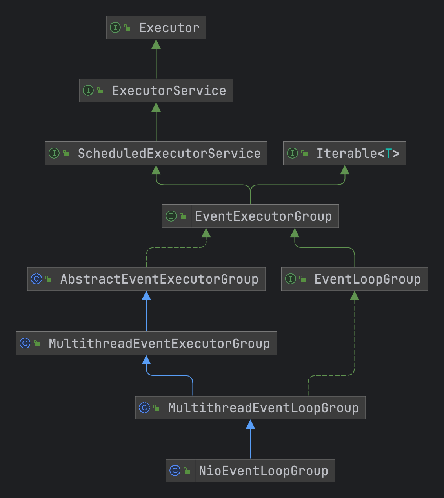

**NioEventLoopGroup.register()** 方法又会创建一个 **NioEventloop** 对象来注册对应的管道，也是实际执行的线程任务，next()方法调用到父类中的chooer属性来选择bossGorup中管理的 **EventExecutor** 事件执行器

```java
public abstract class MultithreadEventExecutorGroup extends AbstractEventExecutorGroup {
    //创建的 NioEventLoop 实现循环对象，一个Group管理多个
    private final EventExecutor[] children;
    //设置为只读
    private final Set<EventExecutor> readonlyChildren;
    //创建所有任务完成操作的任务数量
    private final AtomicInteger terminatedChildren = new AtomicInteger();
    //创建一个所有任务完成的监听器，在完成之后执行状态值的变更
    private final Promise<?> terminationFuture = new DefaultPromise(GlobalEventExecutor.INSTANCE);
    /**
     * 这里根据创建的个数来选择创建选择器
     * 实现类有两个：
     * PowerOfTwoEventExecutorChooser
     * GenericEventExecutorChooser
     */
    private final EventExecutorChooserFactory.EventExecutorChooser chooser;
}
```

```java
public ChannelFuture register(Channel channel) {
    /**
     * 调用父类的方法获取到 EventExecutorChooserFactory.EventExecutorChooser 类型，这里会根据线程的数量进行创建，
     * 默认传的是0，然后会进行计算  Math.max(1, 处理器 * 2)
     * 实现类的类型
     * GenericEventExecutorChooser
     * PowerOfTwoEventExecutorChooser：线程长度超过2创建
     * next() 方法返回的是 EventExecutor接口类型，实现类型是 NioEventLoop 继承至 SingleThreadEventLoop
     */
    return next().register(channel);
}
```


### 1.3 NioEventLoop

NioEventLoopGroup创建出NioEventLoop对象来进行管道的注册和事件的处理，调用 **NioMessageUnsafe.register()**

```java
public final class NioEventLoop extends SingleThreadEventLoop { 
  	/**
     * 包装之后的Selector：SelectedSelectionKeySetSelector
     * 通过 UNSAFE修改偏移量的方式修改了其中的属性 selectedKeys 来替换为 SelectedSelectionKeySet，这样每次到来事件优先存入到了数组当中也就是selectedKeys属性
     */
    private Selector selector;
    //未包装过的Selector
    private Selector unwrappedSelector;
    /**
     * 提前创建的key集合，保存待处理的key，
     */
    private SelectedSelectionKeySet selectedKeys;
  	//Selector支持器
    private final SelectorProvider provider;
  	/**
     * 选择策略
     * SELECT：获取是否有任务进行执行，并且调整select的阻塞策略
     * CONTINUE：进行下一次的循环
     * BUSY_WAIT：自旋，NIO不支持
     */
    private final SelectStrategy selectStrategy;
}

public abstract class SingleThreadEventLoop extends SingleThreadEventExecutor implements EventLoop {
  
    //调用到 SingleThreadEventLoop
  public ChannelFuture register(final ChannelPromise promise) {
      ObjectUtil.checkNotNull(promise, "promise");
      //这里会调用到 NioServerSocketChannel.newUnsafe()方法创建一个 NioMessageUnsafe对象
      promise.channel().unsafe().register(this, promise);
      return promise;
  }
}

public abstract class SingleThreadEventExecutor extends AbstractScheduledEventExecutor implements OrderedEventExecutor {
  //当前EventLoop绑定的线程，doStartThread()方法中进行绑定的
  	private volatile Thread thread;
   //默认线程池ThreadPerTaskExecutor
    private final Executor executor;
}

```

### 1.4 NioMessageUnsafe

通过依赖图可以看到我们指定的 **NioServerSocketChannel** 继承的路线，创建 **Unsafe** 类则是由 **AbstractNioMessageCahnnel** 中的 **newUnsafe()** 方法创建的类型为 **NioMessageUnsafe**

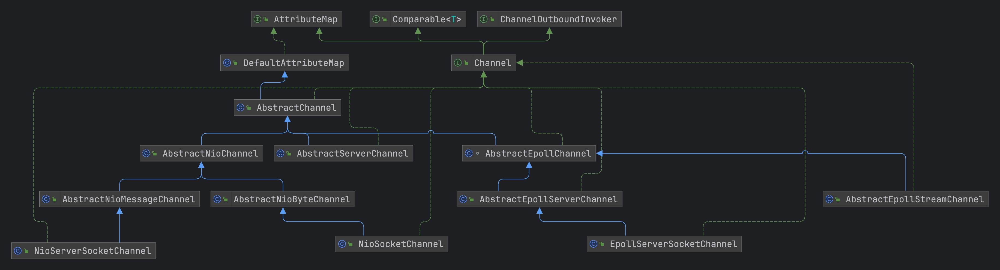

NioEventLoop调用管道中的Unsafe对象来进行注册，用到Unsafe实现类为**NioMessageUnsafe**中没有实现**register()** 方法，调用到 **AbstractChannel#AbstractUnsafe内部类的register方法**

```java
public abstract class SingleThreadEventLoop extends SingleThreadEventExecutor implements EventLoop {
  
    //调用到 SingleThreadEventLoop
  public ChannelFuture register(final ChannelPromise promise) {
      ObjectUtil.checkNotNull(promise, "promise");
      //这里会调用到 NioServerSocketChannel.newUnsafe()方法创建一个 NioMessageUnsafe对象
      promise.channel().unsafe().register(this, promise);
      return promise;
  }
}
```

register方法绑定了一下AbstractChannel中的EventLoop对象，然后提交异步任务执行 **register0()**，**注意：register0()是创建Nio管道的异步任务，会在NioEventLoop.run()异步任务中执行**

```java
public final void register(EventLoop eventLoop, final ChannelPromise promise) {
            ObjectUtil.checkNotNull(eventLoop, "eventLoop");
            //当前管道是否已经被注册了
            if (isRegistered()) {
                promise.setFailure(new IllegalStateException("registered to an event loop already"));
                return;
            }
            //判断是否是 NioEventLoop，只处理 NioEventLoop类型的事件
            if (!isCompatible(eventLoop)) {
                promise.setFailure(
                        new IllegalStateException("incompatible event loop type: " + eventLoop.getClass().getName()));
                return;
            }
            //设置当前管道跟对应的 EventLoop对象关联上
            AbstractChannel.this.eventLoop = eventLoop;
            //判断当前线程是否已经有线程在 EventLoop事件循环中执行，这里采用的NioEventLoop类型，继承至 SingleThreadEventExecutor单线程执行器
            if (eventLoop.inEventLoop()) {
                //如果当前线程已经在EventLoop中注册，直接调用注册方法
                register0(promise);
            } else {
                try {
                    /**
                     * 如果没有线程开始执行，这里会创建一个线程并且将任务存放到队列之中然后调用 NioEventGroup.run() ,这个方法的主要目的主要是用于注册管道
                     * NioEventLoop继承至 SingleThreadEventExecutor，这里调用的execute() 方法在SingleThreadEventExecutor进行复写
                     */
                    eventLoop.execute(new Runnable() {
                        @Override
                        public void run() {
                            register0(promise);
                        }
                    });
                } catch (Throwable t) {
                    logger.warn(
                            "Force-closing a channel whose registration task was not accepted by an event loop: {}",
                            AbstractChannel.this, t);
                    closeForcibly();
                    closeFuture.setClosed();
                    safeSetFailure(promise, t);
                }
            }
        }
```

### 1.5 SingleThreadEventExecutor

**register0()** 方法通过 **eventLoop.execute()** 来进行异步任务的提交，会提交到相应的队列当中等待 **NioEventLoop开始处理事件时在执行注册**，这里是调用到 **NioEventLoop的父类SingleThreadEventExecutor.execute() 方法**

```java
private void execute(Runnable task, boolean immediate) {
        //判断当前执行的线程是否跟EventLoop绑定的线程一样
        boolean inEventLoop = inEventLoop();
        //将任务添加到 taskQueue 队列之中，开启Selector注册的任务也会添加到这里面，也就是调用 register0() 方法
        addTask(task);
        //如果任务不一样，那么直接启动线程，调用 doStartThread() 方法，其中会提交一个任务去执行 SingleThreadEventExecutor.this.run()
        if (!inEventLoop) {
            startThread();
          //是否关闭线程池
            if (isShutdown()) {
                boolean reject = false;
                try {
                  //移除任务
                    if (removeTask(task)) {
                        reject = true;
                    }
                } catch (UnsupportedOperationException e) {
                }
                //拒绝策略
                if (reject) {
                    reject();
                }
            }
        }
        //添加了任务是否立刻唤醒线程进行任务的执行
        if (!addTaskWakesUp && immediate) {
            wakeup(inEventLoop);
        }
    }
```

**startThread()方法内部调用doStartThread()，而doStartThread()方法调用了SingleThreadEventExecutor.this.run()，run()方法交给了子类来实现，也就是NioEventLoop**

- 根据策略来判断selector选择器的阻塞时间
  - selectNowSupplier：selector选择器立即返回一个准备好的事件
  - hasTasks：判断taskQueue队列是否有任务或者tailTask是否有事件
  - 目前根据返回的数据来进行执行的策略：
    - CONTINUE：-2继续进入下一次循环，自旋
    - BUSY_WAIT：-3忙循环，NIO不支持
    - SELECT：-1选择，计算Selector读取时间的阻塞时间
- 计算好速率，根据 **ioRatio** 来判断执行 taskQueue中任务的速度
- 然后循环的处理Selector中的事件

```java
protected void run() {
        int selectCnt = 0;
        for (;;) {
            try {
                int strategy;
                try {
                    /**
                     * 计算执行的策略，会根据 taskQueue 队列中或者判断管道中是否有事件
                     * 根据流程分析下来，当前任务执行时，Nio管道并没有进行注册，任务由 AbstractChannel#AbstractUnsafe.register()方法提交了一个异步任务到taskQueue
                     * 所以这里默认执行会返回0，以下都不会执行
                     */
                    strategy = selectStrategy.calculateStrategy(selectNowSupplier, hasTasks());
                    switch (strategy) {
                        //进入自旋
                    case SelectStrategy.CONTINUE:
                        continue;
                        //NIO不支持 BUSY_WAIT，直接切换到 SELECT执行，从管道中获取到事件
                    case SelectStrategy.BUSY_WAIT:
                        // fall-through to SELECT since the busy-wait is not supported with NIO
                    case SelectStrategy.SELECT:
                        //计算下一次事件获取的终止事件
                        long curDeadlineNanos = nextScheduledTaskDeadlineNanos();
                        if (curDeadlineNanos == -1L) {
                            curDeadlineNanos = NONE; // nothing on the calendar
                        }
                        //设置下一次唤醒的纳秒时间
                        nextWakeupNanos.set(curDeadlineNanos);
                        try {
                            //先判断 taskQueue 队列中是否有任务，这里会先获取到开启管道连接的任务，然后才去监听管道里面的事件
                            if (!hasTasks()) {
                                //轮询是否有任务
                                strategy = select(curDeadlineNanos);
                            }
                        } finally {
                            nextWakeupNanos.lazySet(AWAKE);
                        }
                        // fall through
                    default:
                    }
                } catch (IOException e) {
                    // 如果出现IO异常，那么重新开启一个Nio Selector选择器
                    rebuildSelector0();
                    selectCnt = 0;
                    //休眠1秒
                    handleLoopException(e);
                    continue;
                }
                //循环次数进行统计
                selectCnt++;
                //被取消key的计数器
                cancelledKeys = 0;
                needsToSelectAgain = false;
                //获取到io速率，默认的值是50
                final int ioRatio = this.ioRatio;
                boolean ranTasks;
                //如果速率为100，直接执行管道中的事件以及运行所有队列中的任务
                if (ioRatio == 100) {
                    try {
                        if (strategy > 0) {
                            processSelectedKeys();
                        }
                    } finally {
                        // 确保taskQueue中的任务都已经执行了
                        ranTasks = runAllTasks();
                    }
                } else if (strategy > 0) { //这里判断以下上面是否从管道中获取到了事件
                    final long ioStartTime = System.nanoTime();
                    try {
                        //处理事件
                        processSelectedKeys();
                    } finally {
                        // Ensure we always run tasks.
                        final long ioTime = System.nanoTime() - ioStartTime;
                        //执行任务队列中的任务
                        ranTasks = runAllTasks(ioTime * (100 - ioRatio) / ioRatio);
                    }
                } else {
                    //获取到 taskQueue 队列的执行任务，也是这里会执行 AbstractChannel#AbstractUnsafe.register() 注册管道的方法
                    ranTasks = runAllTasks(0); // This will run the minimum number of tasks
                }
            } catch (CancelledKeyException e) {
            } catch (Error e) {
                throw e;
            } catch (Throwable t) {
                //出现异常后休眠1秒再执行
                handleLoopException(t);
            } finally {
                ;
            }
        }
    }
```

上面在循环处理事件时，调用**runAllTasks()**来执行创建Selector的任务。**register0()方法的目的是来创建一个Nio的管道，然后指定对应感兴趣的事件类型，这个事件类型是NioServerSocketChannel在构造方法中指定的类型**

```java
public NioServerSocketChannel(ServerSocketChannel channel) {
    //指定bossGroup线程池处理 OP_ACCEPT事件,指定管道需要监听的事件（readInterestOp属性）
    super(null, channel, SelectionKey.OP_ACCEPT);
    config = new NioServerSocketChannelConfig(this, javaChannel().socket());
}
```

比较核心的代码是 **javaChannel().register(eventLoop().unwrappedSelector(), 0, this);** 他的目的是将当前的管道跟NioEventLoop.Selector的选择器进行关联；服务端执行到 **isActive()** 方法因为还没有客户端连接所以这里就会直接执行完毕。等后续调用 **bind()** 方法时会调用 **HeadContext.read()** 方法来将管道的**interestOps**设置为16，也就是 **SelectionKey.OP_ACCEPT** 时间用于监听连接

```java
private void register0(ChannelPromise promise) {
    try {
        if (!promise.setUncancellable() || !ensureOpen(promise)) {
            return;
        }
        boolean firstRegistration = neverRegistered;
        //执行注册管道的方法，通过java中的NIO注册对应的管道 SelectionKey
        doRegister();
        neverRegistered = false;
        registered = true;

        //调用 handlerAdded() 事件方法
        pipeline.invokeHandlerAddedIfNeeded();
        //将任务状态设置为成功
        safeSetSuccess(promise);
        //调用管道注册的事件，这里会调用 ChannelInitializer抽象类中的 initChannel() 方法开始执行各种handler的注入
        pipeline.fireChannelRegistered();
        // 管道是否建立连接
        if (isActive()) {
            //是否是第一次注册
            if (firstRegistration) {
                //调用管道启动的事件
                pipeline.fireChannelActive();
            } else if (config().isAutoRead()) {
              //监听指定的事件，bossGroup指定的是OP_ACCEPT类型
                beginRead();
            }
        }
    } catch (Throwable t) {
        // Close the channel directly to avoid FD leak.
        closeForcibly();
        closeFuture.setClosed();
        safeSetFailure(promise, t);
    }
}

//创建Nio的管道进行注册，默认什么事件都不监听
protected void doRegister() throws Exception {
    boolean selected = false;
    for (;;) {
        try {
            //开始管道注册，默认不监听任何的事件，返回的SelectionKey也是初始的，interestOps也为0
            selectionKey = javaChannel().register(eventLoop().unwrappedSelector(), 0, this);
            return;
        } catch (CancelledKeyException e) {
        }
    }
}
//select创建好之后，调用selectionKey.interestOps设置感兴趣的事件
protected void doBeginRead() throws Exception {
    final SelectionKey selectionKey = this.selectionKey;
    if (!selectionKey.isValid()) {
        return;
    }
    readPending = true;
    //这里在默认开启管道监听的时候，监听的ops设置为0，所以这里返回的interestOps也为0
    final int interestOps = selectionKey.interestOps();
    //&上readInterestOp，这里readInterestOp是SelectionKey.OP_ACCEPT
    if ((interestOps & readInterestOp) == 0) {
        //添加监听OP_ACCEPT事件
        selectionKey.interestOps(interestOps | readInterestOp);
    }
}
```

### 1.6 服务端事件处理

**NioEventLoop.run()** 自旋进行事件的处理，这里处理的方式为两支，一种是优化过的方式，一种是按照原有方式直接从Selector中获取事件的方式：

- processSelectedKeysOptimized：前提是 processSelectedKeys不为null，根据前面netty进行Selector创建时，是对原生的Selector类型进行包装增强过，代码在 **openSelector()** 中，大致的思路就是将 **原生Selector替换为自己实现的SelectedSelectionKeySet类是通过Unsafe直接通过偏移量进行修改的**，每次事件来了之后优先添加到 SelectedSelectionKeySet 中的数组进行缓存上，后续直接拿出来处理即可
- processSelectedKeysPlain：直接从原生Selector中获取到事件进行处理，实时的

```java
private void processSelectedKeys() {
    if (selectedKeys != null) {
        processSelectedKeysOptimized();
    } else {
        processSelectedKeysPlain(selector.selectedKeys());
    }
}
```

最终调用处理事件的方法是 **processSelectedKey()**

```java
private void processSelectedKey(SelectionKey k, AbstractNioChannel ch) {
        final AbstractNioChannel.NioUnsafe unsafe = ch.unsafe();
  //key是否是有效
        if (!k.isValid()) {
            final EventLoop eventLoop;
            try {
                eventLoop = ch.eventLoop();
            } catch (Throwable ignored) {
                return;
            }
          //事件循环器与管道中的事件循环器是否一样，是否是其他线程创建的
            if (eventLoop == this) {
                unsafe.close(unsafe.voidPromise());
            }
            return;
        }

        try {
            int readyOps = k.readyOps();
            //事件是否是OP_CONNECT连接事件
            if ((readyOps & SelectionKey.OP_CONNECT) != 0) {
                //重新构建管道需要监听的事件类型
                int ops = k.interestOps();
                ops &= ~SelectionKey.OP_CONNECT;
                k.interestOps(ops);
                unsafe.finishConnect();
            }
            //写事件，去刷新缓存中的数据
            if ((readyOps & SelectionKey.OP_WRITE) != 0) {
                ch.unsafe().forceFlush();
            }
          //处理 OP_READ和OP_ACCEPT 读和接受连接事件
            if ((readyOps & (SelectionKey.OP_READ | SelectionKey.OP_ACCEPT)) != 0 || readyOps == 0) {
                //处理对应的读事件或者接收事件 NioMessageUnsafe，根据netty的模型，在第一次获取到读请求时，就会将管道注册到 worker group中进行处理
                unsafe.read();
            }
        } catch (CancelledKeyException ignored) {
            unsafe.close(unsafe.voidPromise());
        }
    }
```

**NioMessageUnsafe** 中只实现了一个read()方法来处理当客户端连接请求到来时，将其传递给 **workGroup** 进行处理，上面在进行初始化管道时就已经注册了一个 **ServerBootstrapAcceptor** 类

```java
private final class NioMessageUnsafe extends AbstractNioUnsafe {

        private final List<Object> readBuf = new ArrayList<Object>();

        @Override
        public void read() {
            //服务端触发读事件的时候执行
            assert eventLoop().inEventLoop();
            final ChannelConfig config = config();
            //处理管道
            final ChannelPipeline pipeline = pipeline();
            //ByteBuf分配器，根据配置进行重置
            final RecvByteBufAllocator.Handle allocHandle = unsafe().recvBufAllocHandle();
            allocHandle.reset(config);

            boolean closed = false;
            Throwable exception = null;
            try {
                try {
                    do {
                        //将客户端channel进行包装一层，由 io.netty.channel.socket.nio.NioServerSocketChannel.doReadMessages 进行实现，包装的对象为 NioSocketChannel 客户端的套接字管道
                        int localRead = doReadMessages(readBuf);
                        if (localRead == 0) {
                            break;
                        }
                        if (localRead < 0) {
                            closed = true;
                            break;
                        }
                        allocHandle.incMessagesRead(localRead);
                    } while (continueReading(allocHandle));
                } catch (Throwable t) {
                    exception = t;
                }
                int size = readBuf.size();
                for (int i = 0; i < size; i ++) {
                    readPending = false;
                    //触发读事件，第一个事件处理时，这里配合 ServerBootstrapAcceptor 将数据的处理事件交给workGroup进行处理（将管道跟真正处理的 workGroup 进行关联）
                    pipeline.fireChannelRead(readBuf.get(i));
                }
                readBuf.clear();
                allocHandle.readComplete();
                //触发主服务的处理链读取完成的事件
                pipeline.fireChannelReadComplete();
                if (exception != null) {
                    closed = closeOnReadError(exception);
                    //触发异常事件
                    pipeline.fireExceptionCaught(exception);
                }
                if (closed) {
                    inputShutdown = true;
                    if (isOpen()) {
                        close(voidPromise());
                    }
                }
            } finally {
                if (!readPending && !config.isAutoRead()) {
                    removeReadOp();
                }
            }
        }
    }


//调用NioServerSocketChannel.doReadMessages，将原生的SocketChannel管道进行包装传递给字类进行处理 NioSocketChannel
protected int doReadMessages(List<Object> buf) throws Exception {
    SocketChannel ch = SocketUtils.accept(javaChannel());

    try {
        if (ch != null) {
            buf.add(new NioSocketChannel(this, ch));
            return 1;
        }
    } catch (Throwable t) {
        logger.warn("Failed to create a new channel from an accepted socket.", t);
        try {
            ch.close();
        } catch (Throwable t2) {
            logger.warn("Failed to close a socket.", t2);
        }
    }
    return 0;
}
```

当客户端的连接执行到了 **unsafe.read();** 调用到上面方法时，就会执行到 **ServerBootstrapAcceptor.read()** 将管道注册到 **workGroup** 上面，整个绑定的流程

```java
public void channelRead(ChannelHandlerContext ctx, Object msg) {
    final Channel child = (Channel) msg;
    //将指定的子处理器，绑定到当前连接客户端的管道中
    child.pipeline().addLast(childHandler);
    setChannelOptions(child, childOptions, logger);
    setAttributes(child, childAttrs);
    try {
        //由子workEventLoop进行具体的执行，netty的模型又是 bossGroup进行接收管道的注册，接收到数据之后再将channel管道跟workGroup进行绑定，由workGroup进行处理
        childGroup.register(child).addListener(new ChannelFutureListener() {
            @Override
            public void operationComplete(ChannelFuture future) throws Exception {
                if (!future.isSuccess()) {
                    forceClose(child, future.cause());
                }
            }
        });
    } catch (Throwable t) {
        forceClose(child, t);
    }
}
```

注意 **childGroup.register(child)** 子管道的绑定流程是 **NioSocketChannel** 进行绑定的，他的继承顺序如下

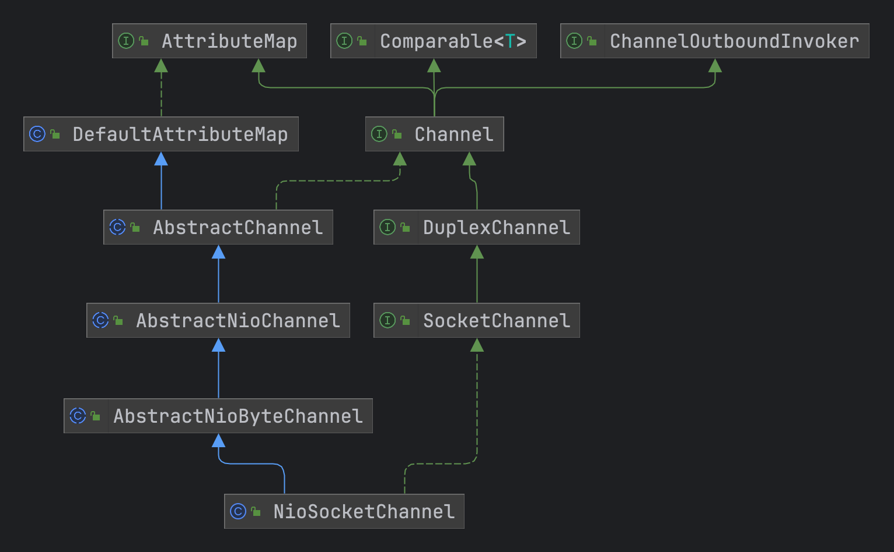

**AbstractNioByteChannel** 构造方法中指定了当前管道需要监听的事件，客户端创建的 **Unsfae** 也不一样，使用的是 **NioByteUnsafe**，当服务端接收到了客户端的连接后，通过上面 **doReadMessages()** 方法可以看到实际将 **channel** 管道包装成了 **NioSocketChannel**然后交给了 **ServerBootstrapAcceptor** 进行处理走客户端的注册流程。也就是说服务端的收到了客户端的监听后，会在注册一个客户端的Bootstrap来用于进行双向通信


## 2. 客户端启动流程

客户端的启动流程用到的启动器则是 **Bootstrap** 跟服务端继承的类是一样的，只是通过泛型进行区分

```java
public class Bootstrap extends AbstractBootstrap<Bootstrap, Channel> { 

}
```

连接客户端，初始化管道并且注册跟服务端一致，调用的是 **AbstractBootstrap.initAndRegister()**

```java
private ChannelFuture doResolveAndConnect(final SocketAddress remoteAddress, final SocketAddress localAddress) {
        //初始化管道，调用父类
        final ChannelFuture regFuture = initAndRegister();
        final Channel channel = regFuture.channel();
        //管道初始化是否成功
        if (regFuture.isDone()) {
            if (!regFuture.isSuccess()) {
                return regFuture;
            }
            //解析地址并且连接对方
            return doResolveAndConnect0(channel, remoteAddress, localAddress, channel.newPromise());
        } else {
          //管道还没有注册成功创建一个异步的任务等待管道注册好就执行解析连接超过
            final PendingRegistrationPromise promise = new PendingRegistrationPromise(channel);
            regFuture.addListener(new ChannelFutureListener() {
                @Override
                public void operationComplete(ChannelFuture future) throws Exception {
                    Throwable cause = future.cause();
                    if (cause != null) {
                        promise.setFailure(cause);
                    } else {
                        promise.registered();
                        doResolveAndConnect0(channel, remoteAddress, localAddress, promise);
                    }
                }
            });
            return promise;
        }
    }
```

初始化和注册的流程与服务端一致，只不过用到的管道类和Unsafe通讯类不一样，客户端用到的是 **NioSocketChannel 和 NioByteUnsafe**

```java
private ChannelFuture doResolveAndConnect0(final Channel channel, SocketAddress remoteAddress,
                                               final SocketAddress localAddress, final ChannelPromise promise) {
    try {
        final EventLoop eventLoop = channel.eventLoop();
        AddressResolver<SocketAddress> resolver;
        try {
            //使用DefaultAddressResolverGroup去解析EventLoop应该使用哪个解析器来解析地址
            resolver = this.resolver.getResolver(eventLoop);
        } catch (Throwable cause) {
            channel.close();
            return promise.setFailure(cause);
        }
        //当前解析器是否支持当前的地址或者判断当前地址是否已经被解析过
        if (!resolver.isSupported(remoteAddress) || resolver.isResolved(remoteAddress)) {
            //如果不支持或者已经被解析过，直接进行连接
            doConnect(remoteAddress, localAddress, promise);
            return promise;
        }
      //解析远程地址
        final Future<SocketAddress> resolveFuture = resolver.resolve(remoteAddress);
        if (resolveFuture.isDone()) {
            final Throwable resolveFailureCause = resolveFuture.cause();

            if (resolveFailureCause != null) {
                // Failed to resolve immediately
                channel.close();
                promise.setFailure(resolveFailureCause);
            } else {
                //远程地址解析成功直接连接
                doConnect(resolveFuture.getNow(), localAddress, promise);
            }
            return promise;
        }
        //添加一个监听器等待地址解析完成后进行连接
        resolveFuture.addListener(new FutureListener<SocketAddress>() {
            @Override
            public void operationComplete(Future<SocketAddress> future) throws Exception {
                if (future.cause() != null) {
                    channel.close();
                    promise.setFailure(future.cause());
                } else {
                    doConnect(future.getNow(), localAddress, promise);
                }
            }
        });
    } catch (Throwable cause) {
        promise.tryFailure(cause);
    }
    return promise;
}

//doConnect方法就是通过channel管道中的NioEventLoop提交一个异步任务去连接远程地址
private static void doConnect(
            final SocketAddress remoteAddress, final SocketAddress localAddress, final ChannelPromise connectPromise) {
      final Channel channel = connectPromise.channel();
      channel.eventLoop().execute(new Runnable() {
          @Override
          public void run() {
              if (localAddress == null) {
                //channel.connect方法点击进去发现是通过pipline.connect()进行调用的，然后可以看到是通过tail.connect()进行远程的调用，从尾部的处理链条（netty的handler是一个链条数据结构）向前进行调用
                  channel.connect(remoteAddress, connectPromise);
              } else {
                  channel.connect(remoteAddress, localAddress, connectPromise);
              }
              connectPromise.addListener(ChannelFutureListener.CLOSE_ON_FAILURE);
          }
      });
  }
```

**channel.connect()方法点击进去发现是通过** pipline.connect()**进行调用的，然后可以看到是通过**tail.connect()**进行远程的调用，从尾部的处理链条（netty的handler是一个链条数据结构）向前进行调用，也就是说调用整个处理链中实现了**connect()** 方法的处理类，通过整个处理链的分析，实际上调用到了**HeadContext.connect()** 方法。

**注意：netty创建pipline处理链时，会默认给链条头部创建一个HeadContext和尾部创建一个TailContext 类来实现入栈和出栈的最后一次处理，具体的源码后续处理链解析**

通过 **channel.connect()** 源码进行追溯最终是调用到了 HeadContext.connect() 的方法中，由**unsafe.connect()**来进行连接处理

```java
//HeadContext定义在DefaultChannelPipeline当中
public void connect(
        ChannelHandlerContext ctx,
        SocketAddress remoteAddress, SocketAddress localAddress,
        ChannelPromise promise) {
    unsafe.connect(remoteAddress, localAddress, promise);
}

//执行连接 unsafe.connect
public final void connect(
                final SocketAddress remoteAddress, final SocketAddress localAddress, final ChannelPromise promise) {
    try {
        boolean wasActive = isActive();
      //执行连接，调用 NioSocketChannel.doConnect()中
        if (doConnect(remoteAddress, localAddress)) {
            fulfillConnectPromise(promise, wasActive);
        } else {
            //创建一个定时任务来判断连接是否成功，判断连接是否超时
        }
    } catch (Throwable t) {
        promise.tryFailure(annotateConnectException(t, remoteAddress));
        closeIfClosed();
    }
}
```

直接通过指定的地址去进行连接，然后监听 **OP_CONNECT** 事件，这个时候监听完成之后，就可以回到 **NioEventLoop.run()** 的方法中进行对应的事件处理了

```java
protected boolean doConnect(SocketAddress remoteAddress, SocketAddress localAddress) throws Exception {
    if (localAddress != null) {
        doBind0(localAddress);
    }
    boolean success = false;
    try {
        //javaChannel()是由 NioSocketChannel.newChannel() 方法创建的SocketChannel套接字管道
        boolean connected = SocketUtils.connect(javaChannel(), remoteAddress);
        if (!connected) {
            // 注册connect事件
            selectionKey().interestOps(SelectionKey.OP_CONNECT);
        }
        success = true;
        return connected;
    } finally {
        if (!success) {
            doClose();
        }
    }
}
```

## 3. 事件处理

回到 **NioEventLoop** 中的事件处理方法 **processSelectedKey()**。都是通过unsafe类进行调用，下面分为服务端和客户端的流程进行说明

- 服务端：调用 NioMessageUnsafe，将客户端的连接交给了 ServerBootstrapAcceptor 进行子管道的注册，然后在走客户端（NioSocketChannel）的注册流程。相当于服务端创建监听连接，当客户端连接来了之后将其封装成客户端的流程再进行事件组的注册，最后数据消费是通过客户端的创建的管道进行监听
- 客户端：调用NioByteUnsafe，直接从channel管道中读取字节数据包装成Bytebuf类交给后续pipline进行对应的处理

```java
private void processSelectedKey(SelectionKey k, AbstractNioChannel ch) {
        final AbstractNioChannel.NioUnsafe unsafe = ch.unsafe();
    try {
        int readyOps = k.readyOps();
        if ((readyOps & SelectionKey.OP_CONNECT) != 0) {
            int ops = k.interestOps();
            //取消监听 OP_CONNECT 事件，先通过取反运算符取消指定位的监听，然后在跟原来的进行取模运算实现取消指定位监听
            ops &= ~SelectionKey.OP_CONNECT;
            //重试设置感兴趣的事件
            k.interestOps(ops);
            //调用finishConnect()方法
            unsafe.finishConnect();
        }
        //写事件，需要先释放一下缓冲区中的数据
        if ((readyOps & SelectionKey.OP_WRITE) != 0) {
            ch.unsafe().forceFlush();
        }
        if ((readyOps & (SelectionKey.OP_READ | SelectionKey.OP_ACCEPT)) != 0 || readyOps == 0) {
            //处理对应的读事件或者接收事件，这里接收事件处理时服务端用 NioMessageUnsafe，客户端用 NioByteUnsafe ，根据netty的模型，在第一次获取到读请求时，就会将管道注册到 worker group中进行处理
            unsafe.read();
        }
    } catch (CancelledKeyException ignored) {
        unsafe.close(unsafe.voidPromise());
    }
}
```

## 4. 处理链（ChannelPipelline）

netty提供的管道处理链，核心的实现方式就是通过链表的方式来进行调用实现，使用的是 **DefaultChannelPipeline**

### 4.1 核心方法

```java
public interface ChannelPipeline
        extends ChannelInboundInvoker, ChannelOutboundInvoker, Iterable<Entry<String, ChannelHandler>> {

    //将 Handler 添加到队首
    ChannelPipeline addFirst(String name, ChannelHandler handler);
    ChannelPipeline addFirst(EventExecutorGroup group, String name, ChannelHandler handler);
    //添加到队尾
    ChannelPipeline addLast(String name, ChannelHandler handler);
    ChannelPipeline addLast(EventExecutorGroup group, String name, ChannelHandler handler);
    //添加到某个 Handler之前
    ChannelPipeline addBefore(String baseName, String name, ChannelHandler handler);
    ChannelPipeline addBefore(EventExecutorGroup group, String baseName, String name, ChannelHandler handler);
    //添加到某个 Handler之后
    ChannelPipeline addAfter(String baseName, String name, ChannelHandler handler);
    ChannelPipeline addAfter(EventExecutorGroup group, String baseName, String name, ChannelHandler handler);
    //添加多个到队首
    ChannelPipeline addFirst(ChannelHandler... handlers);
    ChannelPipeline addFirst(EventExecutorGroup group, ChannelHandler... handlers);
    //添加多个到队尾
    ChannelPipeline addLast(ChannelHandler... handlers);
    ChannelPipeline addLast(EventExecutorGroup group, ChannelHandler... handlers);
    //移除某个 handler
    ChannelPipeline remove(ChannelHandler handler);
    ChannelHandler remove(String name);
    <T extends ChannelHandler> T remove(Class<T> handlerType);
    //移除队首
    ChannelHandler removeFirst();
    //移除队尾
    ChannelHandler removeLast();
    //替换
    ChannelPipeline replace(ChannelHandler oldHandler, String newName, ChannelHandler newHandler);
    ChannelHandler replace(String oldName, String newName, ChannelHandler newHandler);
    <T extends ChannelHandler> T replace(Class<T> oldHandlerType, String newName,
                                         ChannelHandler newHandler);
    //返回队首
    ChannelHandler first();
    //返回队首的上下文
    ChannelHandlerContext firstContext();
    //返回队尾
    ChannelHandler last();
    //队尾的上下文
    ChannelHandlerContext lastContext();
    //获取某个handler
    ChannelHandler get(String name);
    <T extends ChannelHandler> T get(Class<T> handlerType);
    //获取某个handler的上下文
    ChannelHandlerContext context(ChannelHandler handler);
    //对应名称的上下文
    ChannelHandlerContext context(String name);
    ChannelHandlerContext context(Class<? extends ChannelHandler> handlerType);
    //返回管道
    Channel channel();
    //获取所有handler的名称
    List<String> names();
    //转换成map
    Map<String, ChannelHandler> toMap();
    /**
     * 下面是覆写了触发入栈方法的实现
     */
    @Override
    ChannelPipeline fireChannelRegistered();
    @Override
    ChannelPipeline fireChannelUnregistered();
    @Override
    ChannelPipeline fireChannelActive();
    @Override
    ChannelPipeline fireChannelInactive();
    @Override
    ChannelPipeline fireExceptionCaught(Throwable cause);
    @Override
    ChannelPipeline fireUserEventTriggered(Object event);
    @Override
    ChannelPipeline fireChannelRead(Object msg);
    @Override
    ChannelPipeline fireChannelReadComplete();
    @Override
    ChannelPipeline fireChannelWritabilityChanged();
    @Override
    ChannelPipeline flush();
}
```

### 4.2 属性

- head：设置头部节点，头部节点也是处理入栈和出栈的节点，例如：write方法通过unsafe类将数据写入管道中进行缓存，等数据达到容量限制后就进行发送；还有就是服务端开始监听数据时进行订阅管道
- tail：设置尾部节点

```java
public class DefaultChannelPipeline implements ChannelPipeline {
    private static final AtomicReferenceFieldUpdater<DefaultChannelPipeline, MessageSizeEstimator.Handle> ESTIMATOR =
            AtomicReferenceFieldUpdater.newUpdater(
                    DefaultChannelPipeline.class, MessageSizeEstimator.Handle.class, "estimatorHandle");
    //记录 handler 的头部节点
    final AbstractChannelHandlerContext head;
    //记录 handler 的尾部节点
    final AbstractChannelHandlerContext tail;
    //管道
    private final Channel channel;
    //启动成功的结果任务
    private final ChannelFuture succeededFuture;
    private final VoidChannelPromise voidPromise;
    private final boolean touch = ResourceLeakDetector.isEnabled();

    private Map<EventExecutorGroup, EventExecutor> childExecutors;
    private volatile MessageSizeEstimator.Handle estimatorHandle;
    //当前pipline是否是第一次被注册
    private boolean firstRegistration = true;
    /**
     * 等待处理器的回调类，如果管道还没有注册成功，那么handler触发的事件也会暂时挂起
     */
    private PendingHandlerCallback pendingHandlerCallbackHead;

    /**
     * 当前pipline是否已经在eventLoop上被注册过
     */
    private boolean registered;

    protected DefaultChannelPipeline(Channel channel) {
        this.channel = ObjectUtil.checkNotNull(channel, "channel");
        succeededFuture = new SucceededChannelFuture(channel, null);
        voidPromise =  new VoidChannelPromise(channel, true);
        //设置尾部节点
        tail = new TailContext(this);
        //设置头部节点，头部节点也是处理入栈和出栈的节点，例如：write方法通过unsafe类将数据写入管道中
        head = new HeadContext(this);
        head.next = tail;
        tail.prev = head;
    }
}
```

## 5. 缓存区（ChannelOutboundBuffer）

缓存区的目的是当调用 **write()** 方法时数据都会存入到 **ChannelOutboundBuffer** 当中进行暂时存储，等到了缓存达到最大限制后再写入到管道数据中，一般写入数据都是通过实现 **MessageToByteEncoder** 抽象类来实现的比较多

通过write()方法可以看到最终调用了 **ChannelHandlerContext** 来查找实现了 **write()** 方法的handler

```java
public abstract class MessageToByteEncoder<I> extends ChannelOutboundHandlerAdapter {
@Override  
public void write(ChannelHandlerContext ctx, Object msg, ChannelPromise promise) throws Exception {  
    ByteBuf buf = null;  
    try {  
        // 判断传入的消息类型是否是当前适配器可以处理的类型，使用TypeParameterMatcher  
        if (this.acceptOutboundMessage(msg)) {  
            @SuppressWarnings("unchecked")  
            I cast = (I) msg;  
            // 根据传入的消息类型，创建一个ByteBuf开辟对应的空间  
            buf = this.allocateBuffer(ctx, cast, this.preferDirect);  
            try {  
                // 调用encode对数据进行编码，交给子类来实现，字节数据传入buf缓存中  
                this.encode(ctx, cast, buf);  
            } finally {  
                // 释放掉消息的引用指针  
                ReferenceCountUtil.release(cast);  
            }  
            // buf是否可读  
            if (buf.isReadable()) {  
                ctx.write(buf, promise);  
            } else {  
                // 不可读直接释放掉数据  
                buf.release();  
                ctx.write(Unpooled.EMPTY_BUFFER, promise);  
            }  
            buf = null;  
        } else {  
            ctx.write(msg, promise);  
        }  
    } catch (EncoderException e) {  
        throw e;  
    } catch (Throwable e) {  
        throw new EncoderException(e);  
    } finally {  
        if (buf != null) {  
            buf.release();  
        }  
    }  
}

}
```

通过前面的处理链的注册可以看到出栈时执行到的是 **HeadContext** 类中的 **write()** 方法

```java
final class HeadContext extends AbstractChannelHandlerContext  
        implements ChannelOutboundHandler, ChannelInboundHandler {

	@Override  
	public void write(ChannelHandlerContext ctx, Object msg, ChannelPromise promise) {  
	// 通过AbstractUnsafe调用
	    unsafe.write(msg, promise);  
	}
}
```

通过 **AbstractUnsafe** 中的 **write()** 方法来将数据写入到缓冲区，**flush0()** 方法来实现将缓冲区的数据写入到管道中

```java
protected abstract class AbstractUnsafe implements Unsafe {

private volatile ChannelOutboundBuffer outboundBuffer = new ChannelOutboundBuffer(AbstractChannel.this);

	@Override  
	public final void write(Object msg, ChannelPromise promise) {  
	    this.assertEventLoop();  
	    // 获取到当前输出的缓冲区  
	    ChannelOutboundBuffer outboundBuffer = this.outboundBuffer;  
	    // 缓冲区回空，直接释放消息并且执行异常链  
	    if (outboundBuffer == null) {  
	        try {  
	            // release message now to prevent resource-leak  
	            ReferenceCountUtil.release(msg);  
	        } finally {  
	                    this.newClosedChannelException(AbstractChannel.this.initialCloseCause, "write(Object, ChannelPromise)"));  
	        } 
	        return;  
	    }  
	  
	    int size;  
	    try {  
	        // 判断当前消息类型是否支持发送，子类来实现支持 ByteBuf类型来发送数据，这里也会将buf转换为直接ThreadLocalDirectByteBuf  
	        msg = AbstractChannel.this.filterOutboundMessage(msg);  
	        // 获取到消息大小估算器，来估计一下消息的大小
	        size = AbstractChannel.this.pipeline.estimatorHandle().size(msg);  
	        if (size < 0) {  
	            size = 0;  
	        }  
	    } catch (Throwable t) {  
	        try {  
	            ReferenceCountUtil.release(msg);  
	        } finally {  
	            this.safeSetFailure(promise, t);  
	        }  
	        return;
	    }  
	  
	    // 将数据写入到缓冲区暂存
	    outboundBuffer.addMessage(msg, size, promise);  
	}

	protected void flush0() {  
	    // 避免重复调用  
	    if (this.inFlush0) {  
	        // Avoid re-entrance  
	        return;  
	    }  
	    // 判断出栈buffer缓冲区是否为空  
	    final ChannelOutboundBuffer outboundBuffer = this.outboundBuffer;  
	    if (outboundBuffer == null || outboundBuffer.isEmpty()) {  
	        return;  
	    }  
	    this.inFlush0 = true;  	  
	    // 如果通道处于非活动状态，则将所有待处理的写入请求标记为失败。  
	    if (!AbstractChannel.this.isActive()) {  
	        try {  
	            // 检查是否需要生成对应的异常信息，通过后续的处理器执行  
	            if (!outboundBuffer.isEmpty()) {
	                if (AbstractChannel.this.isOpen()) {  
	                    outboundBuffer.failFlushed(new NotYetConnectedException(), true);  
	                } else {  
outboundBuffer.failFlushed(this.newClosedChannelException(AbstractChannel.this.initialCloseCause, "flush0()"), false);  
	                }  
	            }  
	        } finally {  
	            this.inFlush0 = false;  
	        }  
	        return;  
	    }  
	  
	    try {  
	        // 执行数据写入  
	        AbstractChannel.this.doWrite(outboundBuffer);  
	    } catch (Throwable t) {  
	        this.handleWriteError(t);  
	    } finally {  
	        this.inFlush0 = false;  
	    }  
	}
}
```


缓冲区的源码

```java
public final class ChannelOutboundBuffer {

	// 每一个channel有一个对应的ChannelOutboundBuffer  
	private final Channel channel;    
	// Entry(flushedEntry) --> ... Entry(unflushedEntry) --> ... Entry(tailEntry)  
	// flushedEntry是第一个被发送到对端的Entry对象  
	private Entry flushedEntry;  
	// unflushedEntry是第一个不被发送到对端的Entry对象，通过flushedEntry、unflushedEntry之间的位置关系可知，flushedEntry、unflushedEntry之间的Entry都是要被发送到对端的  
	private Entry unflushedEntry;  
	// 链表尾端的Entry  
	private Entry tailEntry;  
	// 需要被发送到对端的Entry对象数量  
	private int flushed;  
	// nioBufferCount是所有Entry对象中，所有ByteBuffer对象数量  
	private int nioBufferCount;  
	// nioBufferSize是所有Entry对象中，所有ByteBuffer对象占用的字节数  
	private long nioBufferSize;  
	//是否刷新失败  
	private boolean inFail;  
	// 总共等待发送的原子化更新器  
	private static final AtomicLongFieldUpdater<ChannelOutboundBuffer> TOTAL_PENDING_SIZE_UPDATER =  
	        AtomicLongFieldUpdater.newUpdater(ChannelOutboundBuffer.class, "totalPendingSize");
	@SuppressWarnings("UnusedDeclaration")  
	// 总共等待发送的字节数  
	private volatile long totalPendingSize;  
	private static final AtomicIntegerFieldUpdater<ChannelOutboundBuffer> UNWRITABLE_UPDATER =  
	        AtomicIntegerFieldUpdater.newUpdater(ChannelOutboundBuffer.class, "unwritable");
}
```

通过**write()** 方法实际就是创建了 **Entry** 对象并且添加到对应的缓冲链中，等待**flush**调用时发送数据

```java
public void addMessage(Object msg, int size, ChannelPromise promise) {  
    // 创建Entry对象，Entry对象用来记录发送的字节数  
    Entry entry = Entry.newInstance(msg, size, total(msg), promise);  
    // 尾部节点为空，将第一个节点置为空  
    if (this.tailEntry == null) {  
        this.flushedEntry = null;  
    } else {  
        // 添加节点到尾部节点后面  
        Entry tail = this.tailEntry;  
        tail.next = entry;  
    }  
    // 尾部节点置为当前节点  
    this.tailEntry = entry;  
    if (this.unflushedEntry == null) {  
        this.unflushedEntry = entry;  
    }  
    // 添加等待发送数据的字节数  
    this.incrementPendingOutboundBytes(entry.pendingSize, false);  
}
```

## 6. ByteBuf

### 6.1 继承结构

ByteBuf是随机可访问且顺序访问的字节序列。为byte数组和ByteBuffer提供抽象视图；通过继承图，可以分为两个分支：

- PooledByteBuf：池化缓存池
- UnpooledByteBuf：非池化缓存池

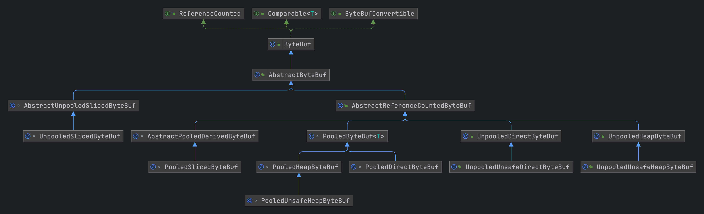

平时用到比较多的则是使用到了 **非池化堆Buf**，又分为了 **堆外内存** 和 **堆内内存**，在代码中使用到比较多

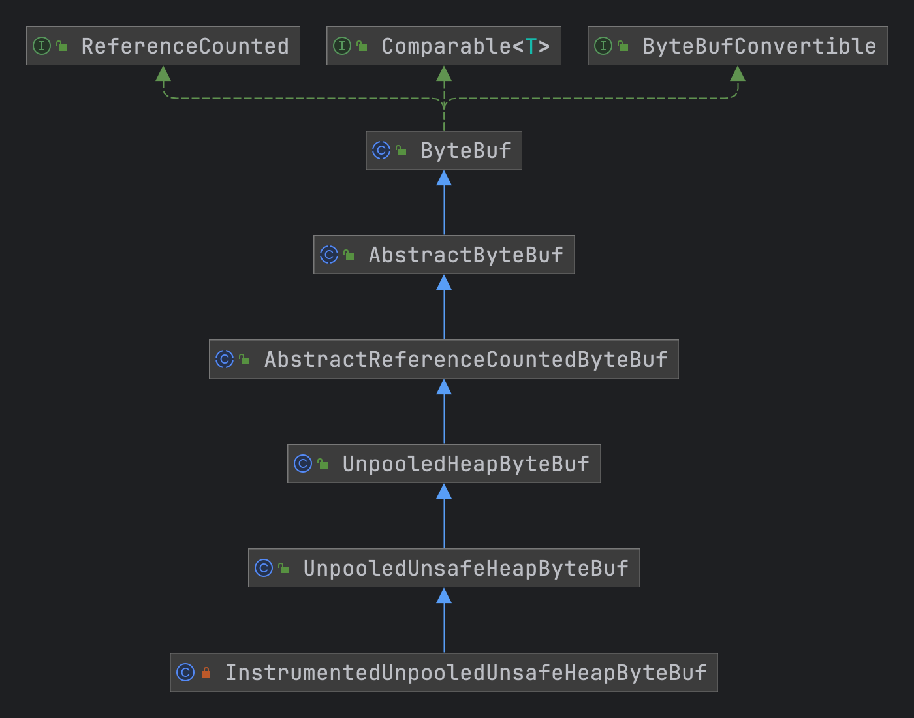

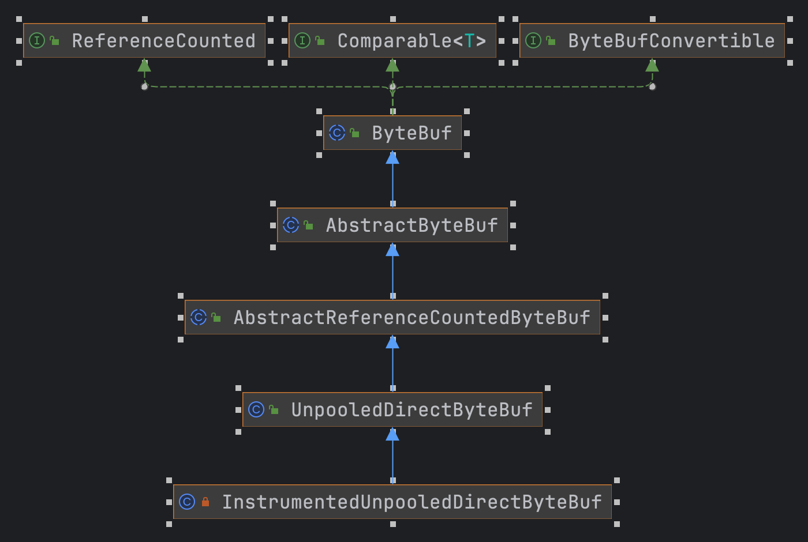

当接收到数据时netty则采用了 **池化的堆外缓存** ，通过**零拷贝** 技术来提高性能

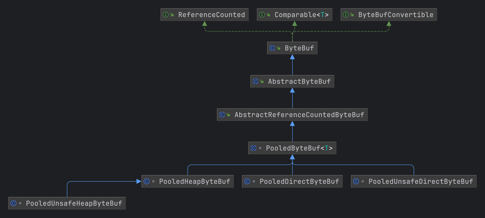

### 6.2 数据结构

```text
+---------------------+---------------------+---------------------+
| discardable bytes   |    readable bytes   |  writable bytes     |
|---------------------|---------------------|---------------------|
|                     |                     |                     |
0     <=          readerIndex     <=      writerIndex   <-      capacity
```

- discardable bytes：可丢弃的字节
- readable bytes：可读的字节
- writable bytes：可写的字节

### 6.3 Api

- readerIndex()/writerIndex()：获取到读和写的索引
- readerIndex(int readerIndex)/writerIndex(int writerIndex)：设置读写下标
- discardReadBytes：丢弃discardable bytes
- clear：重置读写index为0
- 搜索：
  - indexOf(int, int, byte)：获取到符合字节的索引
  - bytesBefore(int, int, byte)：返回符合字节之前的buf，从指定索引开始
  - bytesBefore(byte)：返回符合字节之前的buf
  - forEachByte(int, int, ByteProcessor)：遍历buf
- 标记和重置：
  - markReaderIndex()/markWriterIndex()：标记当前index的位置
  - resetReaderIndex()/resetWriterIndex()：重置当前index为之前标记的index
- 拷贝Buffer：
  - 视图拷贝：底层数据存储是一份，只是复制一份视图，读写指针两个对象互不干涉
    - retainedDuplicate()
    - retainedSlice()
    - retainedSlice(int, int)
    - readRetainedSlice(int)
    - duplicate()：不会修改当前ByteBuf的读写index
    - slice()：不会修改当前ByteBuf的读写index
    - slice(int, int)：不会修改当前ByteBuf的读写index
    - readSlice(int)：会修改当前ByteBuf读index
  - 完全拷贝：一个全新的ByteBuf，内容与老ByteBuf一致，底层数据存储是两份
    - copy()：全新buf

### 6.4 实现类

#### ReferenceCounted

实现**ReferenceCounted**接口代表这个对象具有**引用计数功能**，但是需要**显示释放对象**。言外之意，这里只是定义了一个引用计数对象的计数器操作方法，实际释放对象占用资源，需要客户端自己显示调用。比如release减少计数到0，不一定是在release方法中做资源释放，需要客户端自己释放。

```java
public interface ReferenceCounted {
    // 返回引用计数
    int refCnt();
    // 增加引用计数
    ReferenceCounted retain(int increment);
    // 减少引用计数
    boolean release(int decrement);
    // 记录当前实例，用以内存泄露分析，hint入参只是为了debug的额外信息
    ReferenceCounted touch(Object hint);
}
```

#### WrappedByteBuf

一个简单的包装类，所有ByteBuf的抽象方法，都委托实际包装的ByteBuf实现

```java
class WrappedByteBuf extends ByteBuf {

    protected final ByteBuf buf;

    protected WrappedByteBuf(ByteBuf buf) {
        this.buf = ObjectUtil.checkNotNull(buf, "buf");
    }
}
```

#### EmptyByteBuf

空ByteBuf，大部分方法抛出IndexOutOfBoundsException，容量capcity和最大容量maxCapacity都为0

```java
public final class EmptyByteBuf extends ByteBuf {
 // 当前容量
    @Override
    public int capacity() {
        return 0;
    }

    // 扩容
    @Override
    public ByteBuf capacity(int newCapacity) {
        throw new ReadOnlyBufferException();
    }

    // 最大容量
    @Override
    public int maxCapacity() {
        return 0;
    }

    // 读
    @Override
    public byte getByte(int index) {
        throw new IndexOutOfBoundsException();
    }

    // 写
    @Override
    public ByteBuf writeByte(int value) {
        throw new IndexOutOfBoundsException();
    }
}
```

#### CompositeByteBuf

组合buffer，可以将多个buf构建成一个ByteBuf，例如下面解析JT808数据包时将7E标识符进行替换

```java
public ByteBuf doEscapeForReceive(ByteBuf byteBuf) throws Jt808MsgEscapeException {
      final int readableBytes = byteBuf.readableBytes();

      final byte delimiter = 0x7d;
      int from = byteBuf.readerIndex();
      int indexOf = byteBuf.indexOf(from, readableBytes, delimiter);
      if (indexOf < 0) {
          return byteBuf.retain();
      }

      final List<ByteBuf> byteBufList = new ArrayList<>();
      do {
          final byte current = byteBuf.getByte(indexOf);
          final byte next = byteBuf.getByte(indexOf + 1);
          if (current == 0x7d && next == 0x01) {
              if (from <= indexOf) {
                  // xxx7D01xxx --> xxx7Dxxx
                  byteBufList.add(byteBuf.retainedSlice(from, indexOf - from + 1));
              }
              //byteBufList.add(allocator.buffer().writeByte(0x7d));
              from = indexOf + 2;
          } else if (current == 0x7d && next == 0x02) {
              if (from <= indexOf) {
                  // xxx7D02xxx --> xxx7Exxx
                  byteBufList.add(byteBuf.retainedSlice(from, indexOf - from + 1));
              }
              byteBuf.setByte(indexOf, 0x7E);
              //byteBufList.add(allocator.buffer().writeByte(0x7e));
              from = indexOf + 2;
          } else {
              log.warn("0x7d should be followed by 0x01 or 0x02, but " + next);
              if (from <= indexOf) {
                  byteBufList.add(byteBuf.retainedSlice(from, indexOf - from + 1));
              }
              from = indexOf + 1;
          }
      } while (from < readableBytes && (indexOf = byteBuf.indexOf(from, readableBytes, delimiter)) >= 0);

      byteBufList.add(byteBuf.retainedSlice(from, readableBytes - from));
      return allocator.compositeBuffer(byteBufList.size()).addComponents(true, byteBufList);
  }
```
#### AbstractByteBuf

**AbstractByteBuf**是ByteBuf的**骨架**实现

##### **成员变量**

```java
public abstract class AbstractByteBuf extends ByteBuf {
    // 是否校验引用计数为0时的ByteBuf访问，默认true
    static final boolean checkAccessible;
    // 是否做下标校验，如readIndex是否超过writeIndex，writeIndex是否超过capacity，默认true
    private static final boolean checkBounds;
    // 泄露检测
    static final ResourceLeakDetector<ByteBuf> leakDetector =
            ResourceLeakDetectorFactory.instance().newResourceLeakDetector(ByteBuf.class);
    // 读下标
    int readerIndex;
    // 写下标
    int writerIndex;
    // 标记读下标
    private int markedReaderIndex;
    // 标记写下标
    private int markedWriterIndex;
    // 最大容量
    private int maxCapacity;
}
```

##### 代表方法

```java
// 查询读index
@Override
public int readerIndex() {
    return readerIndex;
}
// 设置读index
@Override
public ByteBuf readerIndex(int readerIndex) {
 // 校验下标是否溢出
    if (checkBounds) {
        checkIndexBounds(readerIndex, writerIndex, capacity());
    }
    this.readerIndex = readerIndex;
    return this;
}
// 是否可读
@Override
public boolean isReadable() {
    return writerIndex > readerIndex;
}
// 可读字节
@Override
public int readableBytes() {
    return writerIndex - readerIndex;
}
// 清空读写下标
@Override
public ByteBuf clear() {
    readerIndex = writerIndex = 0;
    return this;
}
// 标记当前读index
@Override
public ByteBuf markReaderIndex() {
    markedReaderIndex = readerIndex;
    return this;
}
// 重置读index到标记位置
@Override
public ByteBuf resetReaderIndex() {
    readerIndex(markedReaderIndex);
    return this;
}
// 获取index位置的字节数据
@Override
public byte getByte(int index) {
 // 校验下标是否溢出
    checkIndex(index);
    // 子类实现实际逻辑
    return _getByte(index);
}
protected abstract byte _getByte(int index);
// 读取当前readIndex位置的字节
@Override
public byte readByte() {
    checkReadableBytes0(1);
    int i = readerIndex;
    // 子类实现
    byte b = _getByte(i);
    readerIndex = i + 1;
    return b;
}
```

##### 创建衍生Buf

视图拷贝。注意这里duplicate和slice实例化了AbstractDerivedByteBuf （非池化衍生Buffer）的子类返回

```java
// 整个ByteBuf的视图拷贝，构造UnpooledDuplicatedByteBuf
@Override
public ByteBuf duplicate() {
    ensureAccessible();
    return new UnpooledDuplicatedByteBuf(this);
}
// 在duplicate的基础上调用retain增加引用计数
@Override
public ByteBuf retainedDuplicate() {
    return duplicate().retain();
}
// 切片视图拷贝，构造UnpooledSlicedByteBuf
@Override
public ByteBuf slice(int index, int length) {
    ensureAccessible();
    return new UnpooledSlicedByteBuf(this, index, length);
}
// 在slice的基础上调用retain增加引用计数
@Override
public ByteBuf retainedSlice(int index, int length) {
    return slice(index, length).retain();
}
```

#### AbstractReferenceCountedByteBuf

**AbstractReferenceCountedByteBuf**实现了ReferenceCounted接口的所有方法，即引用计数

**成员变量**

```java
public abstract class AbstractReferenceCountedByteBuf extends AbstractByteBuf {
    // refCnt字段的内存地址偏移量
    private static final long REFCNT_FIELD_OFFSET =
            ReferenceCountUpdater.getUnsafeOffset(AbstractReferenceCountedByteBuf.class, "refCnt");
    // refCnt字段的原子更新器
    private static final AtomicIntegerFieldUpdater<AbstractReferenceCountedByteBuf> AIF_UPDATER =
            AtomicIntegerFieldUpdater.newUpdater(AbstractReferenceCountedByteBuf.class, "refCnt");
    // 委托ReferenceCountUpdater实现ReferenceCounted
    private static final ReferenceCountUpdater<AbstractReferenceCountedByteBuf> updater = new ReferenceCountUpdater<AbstractReferenceCountedByteBuf>() {
        @Override
        protected AtomicIntegerFieldUpdater<AbstractReferenceCountedByteBuf> updater() {
            return AIF_UPDATER;
        }
        @Override
        protected long unsafeOffset() {
            return REFCNT_FIELD_OFFSET;
        }
    };
    // 初始虚拟引用计数为2
    private volatile int refCnt = updater.initialValue();
  
  	protected AbstractReferenceCountedByteBuf(int maxCapacity) {
        super(maxCapacity);
        //设置引用计数器默认值为2
        updater.setInitialValue(this);
    }
}
```

看到AbstractReferenceCountedByteBuf的成员变量主要是两个。

**updater，ReferenceCountUpdater实例**。ReferenceCounted接口的所有方法实现基本都是委托ReferenceCountUpdater实现原子更新的，只不过ReferenceCountUpdater是个抽象类，需要子类传入**AtomicIntegerFieldUpdater原子更新器**和**unsafeOffset引用计数字段偏移量**。

另一个是refCnt，记录了当前引用计数的**虚拟值**，这个虚拟值为2，实际引用次数是1。具体逻辑需要看ReferenceCountUpdater的实现。**ReferenceCountUpdater每增加1个引用计数，refCnt会增加2**。

**增加计数**

```java
@Override
public ByteBuf retain(int increment) {
    return updater.retain(this, increment);
}
```

**减少计数**

首先调用ReferenceCountUpdater对refCnt做原子更新；然后执行**handleRelease**方法，实际释放资源（回收当前ByteBuf），比如池化ByteBuf归还到池中，非池化ByteBuf直接释放，非池化HeapByteBuf把底层byte数组赋值为空数组，非池化DirectByteBuf把JDK的ByteBuffer释放。

```java
@Override
public boolean release(int decrement) {
    return handleRelease(updater.release(this, decrement));
}

private boolean handleRelease(boolean result) {
    if (result) {
        deallocate();
    }
    return result;
}
/**
 * Called once {@link #refCnt()} is equals 0.
 */
protected abstract void deallocate();
```

#### ReferenceCountUpdater

```java
private T retain0(T instance, final int increment, final int rawIncrement) {
        // x86下面的XADD指令的性能高于CMPXCHG指令，compareAndSet 方法底层是通过 CMPXCHG 指令实现的，而 getAndAdd 方法底层是 XADD 指令
      int oldRef = updater().getAndAdd(instance, rawIncrement);
      //如果为奇数，那么当前对象应该被释放了
      if (oldRef != 2 && oldRef != 4 && (oldRef & 1) != 0) {
          throw new IllegalReferenceCountException(0, increment);
      }
      // don't pass 0!
      //判断 oldRef 是否为0如果为0，需要将数据进行回滚
      if ((oldRef <= 0 && oldRef + rawIncrement >= 0)
              || (oldRef >= 0 && oldRef + rawIncrement < oldRef)) {
          // overflow case
          updater().getAndAdd(instance, -rawIncrement);
          throw new IllegalReferenceCountException(realRefCnt(oldRef), increment);
      }
      return instance;
  }
```

```java
public final boolean release(T instance) {
    int rawCnt = nonVolatileRawCnt(instance);
    /**
     * 先判断引用计数器是否等于2（最终引用的释放），如果等于2，先尝试释放期望为2，如果成功了直接返回，如果期望为2释放失败
     * 在调用 retryRelease0() 通过死循环进行减1的操作
     *
     * 如果不等于2那么就执行非最终版本的释放，非最终版的释放，返回都为false
     *
     * toLiveRealRefCnt()：获取到实际引用次数，如果是偶数就用 raw/2，如果是奇数就抛出异常
     */
    return rawCnt == 2 ? tryFinalRelease0(instance, 2) || retryRelease0(instance, 1)
            : nonFinalRelease0(instance, 1, rawCnt, toLiveRealRefCnt(rawCnt, 1));
}
```

**为什么引用计数器是需要使用奇数？**

```java
/**
 * 默认引用计数器为1，每次调用都进行加1；当释放和被申请的次数相等时，就调用回收方法
 * 如果为0，说明对象被意外、错误地引用了抛出  IllegalReferenceCountException 异常
 *
 * refcnt为什么为偶数？
 * 场景：一个obj的refcnt为1，有三个线程修改这个obj的引用计数
 * 线程1：执行release() 方法修改refcnt为0，这时应该进一步执行deallocate()释放对象，在释放前切换到线程2
 * 线程2：执行了retain() 方法修改refcnt为1，发现oldRef，修改前的数为0，这时认为这个对象已经被回收了，就执行数据的回滚，然后抛出异常
 * 线程3：由于上面修改和回滚是两步操作，所以在回滚前 refcnt为1，这时线程3调用了 retain() 将值修改了2，oldRef为1，认为是一个存活的对象，不会抛出异常，
 *       这时切回线程1，执行deallocate() 方法直接释放了对象
 *
 * 修改为使用偶数后：refcnt初始值为2，默认认为已经引用了一次，每次引用加2
 * 线程1：调用release()方法，修改refcnt为1，这时应该进一步执行deallocate()释放对象，在释放前切换到线程2
 * 线程2：调用retain()方法，应该修改refcnt为3，但是oldRef的值为1，奇数认为此对象已经被回收，在回滚数据前切换了线程
 * 线程3：调用retain()方法，在线程2执行回滚前时进行切换修改了refcnt应该为5（retain方法每次都会加2），但是发现oldRef为3，奇数抛出异常
 *
 * 此外用2的倍数，而不是3的倍数或者其他，原因应该是2的倍数位运算更加方便
 */
```


