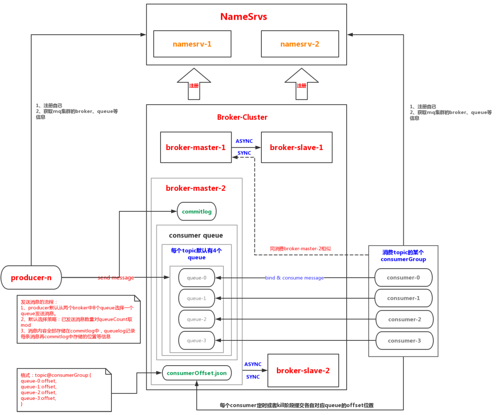

# RocketMq

## 一、基本概念

### 1. 消息模型

Producer、Broker、Consumer三部分组成

### 2. Producer（消息生产者）

RocketMQ提供多种发送方式，同步发送、异步发送、顺序发送、单向发送。同步和异步方式均需要Broker返回确认信息，单向发送不需要。 

### 3. Consumer（消息消费者）

一个消息消费者会从Broker服务器拉取消息、并将其提供给应用程序。从用户应用的角度而言提供了两种消费形式：**拉取式消费 (pull consumer)**、**推动式消费(push consumer)**。

### 4. Topic（主题）

表示一类消息的集合，每个主题包含若干条消息，每条消息只能属于一个主题，是RocketMQ进行消息订阅的基本单位。每个Topic默认都会创建4个队列

### 5. Broker Server（代理服务器）

消息中转角色，负责存储消息、转发消息。代理服务器在RocketMQ系统中负责接收从生产者发送来的消息并存储、同时为消费者的拉取请求作准备。代理服务器也存储消息相关的元数据，包括消费者组、消费进度偏移和主题和队列消息等。 

### 6. Name Server（名字服务）

名称服务充当路由消息的提供者。生产者或消费者能够通过名字服务查找各主题相应的Broker IP列表。多个Namesrv实例组成集群，但相互独立，没有信息交换。

### 7. 拉取式消费（Pull Consumer）

Consumer消费的一种类型，应用通常主动调用Consumer的拉消息方法从Broker服务器拉消息、主动权由应用控制。一旦获取了批量消息，应用就会启动消费过程。

### 8. 推动式消费（Push Consumer）

Consumer消费的一种类型，该模式下Broker收到数据后会主动推送给消费端，该消费模式一般实时性较高。基于拉取式消费深度封装，进行长轮询的拉取消息。

### 9. 生产者组（Producer Group）

同一类Producer的集合，这类Producer发送同一类消息且发送逻辑一致。如果发送的是事物消息且原始生产者在发送之后崩溃，则Broker服务器会联系同一生产者组的其他生产者实例以提交或回溯消费。

### 10. 消费者组（Consumer Group）

同一类Consumer的集合，这类Consumer通常消费同一类消息且消费逻辑一致。消费者组使得在消息消费方面，实现负载均衡和容错的目标变得非常容易。要注意的是，消费者组的消费者实例必须订阅完全相同的Topic。RocketMQ 支持两种消息模式：集群消费 （Clustering）和广播消费（Broadcasting）

### 11. 集群消费（Clustering）

集群消费模式下,相同Consumer Group的每个Consumer实例平均分摊消息。

### 12. 广播消费（Broadcasting）

广播消费模式下，相同Consumer Group的每个Consumer实例都接收全量的消息。

### 13. 普通顺序消息（Normal Ordered Message）

普通顺序消费模式下，消费者通过同一个消费队列收到的消息是有顺序的，不同消息队列收到的消息则可能是无顺序的。 

### 14. 严格顺序消息（Strictly Ordered Message）

严格顺序消息模式下，消费者收到的所有消息均是有顺序的。

### 15. 消息（Message）

RocketMQ中每个消息拥有唯一的Message ID，且可以携带具有业务标识的Key。系统提供了通过Message ID和Key查询消息的功能。 

### 16. 标签（Tag）

为消息设置的标志，用于同一主题下区分不同类型的消息。来自同一业务单元的消息，可以根据不同业务目的在同一主题下设置不同标签。标签能够有效地保持代码的清晰度和连贯性，并优化RocketMQ提供的查询系统。消费者可以根据Tag实现对不同子主题的不同消费逻辑，实现更好的扩展性。 

## 二、RocketMq模块划分

| remoting      | 远程通讯模块：netty+fastjson                 |
| ------------- | -------------------------------------------- |
| 名称          | 作用                                         |
| broker        | broker模块：c端和p端消息存储逻辑             |
| client        | 客户端api：producer、consumer端接受与发送api |
| common        | 公共组件：常量、基类、数据结构               |
| tools         | 运维tools：命令行工具                        |
| store         | 存储模块：消息、索引、commitlog存储          |
| namesrv       | 服务管理模块：服务注册topic等信息存储        |
| logappender   | 日志适配模块                                 |
| example       | Demo例子                                     |
| filtersrv     | 消息过滤模块                                 |
| srvutil       | 辅助模块                                     |
| filter        | 过滤模块：消息过滤模块                       |
| distribution  | 部署、运维相关zip包中的代码                  |
| openmessaging | 兼容分布式消息模块                           |

## 三、RocketMq特性

### 1. producer端

#### 1.1 发送方式

- Sync：同步方式发送，等待结果后才返回
- Async：异步的方式发送，发送完后，立刻返回
- Oneway：发出去之后什么都不用管直接返回

#### 1.2 发送结果

- SEND_OK：消息发送成功，但是不一定就是可靠，要确保消息不会丢失，还用启用同步Master服务或者同步刷盘，即SYNC_MASTER或SYNC_FLUSH
- FLUSH_DISK_TIMEOUT：消息发送成功但是服务器刷盘超时。消息进入队列了，只有服务宕机才会丢失，如果Broker服务器设置了刷盘方式为同步刷盘，即FlushDiskType=SYNC_FLUSH（默认同步刷盘），超过了默认刷盘时间5s，就返回该状态
- FLUSH_SLAVE_TIMEOUT：消息发送成功，但是服务器同步salve时超时
- SLAVE_NOT_AVAILABLE：消息发送成功，但是此时salve不可用