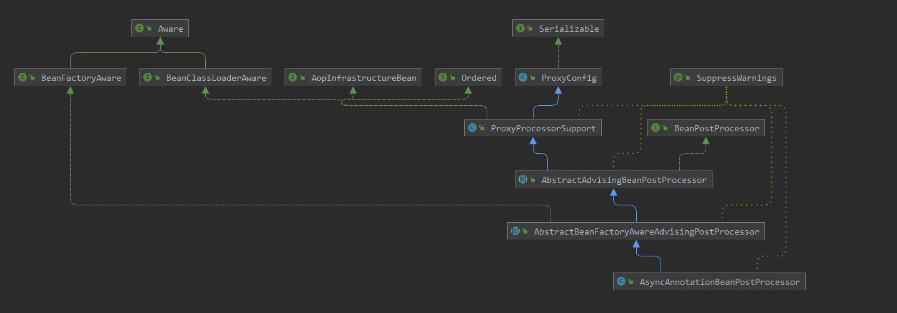
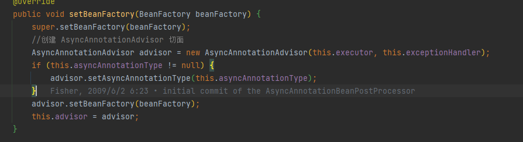
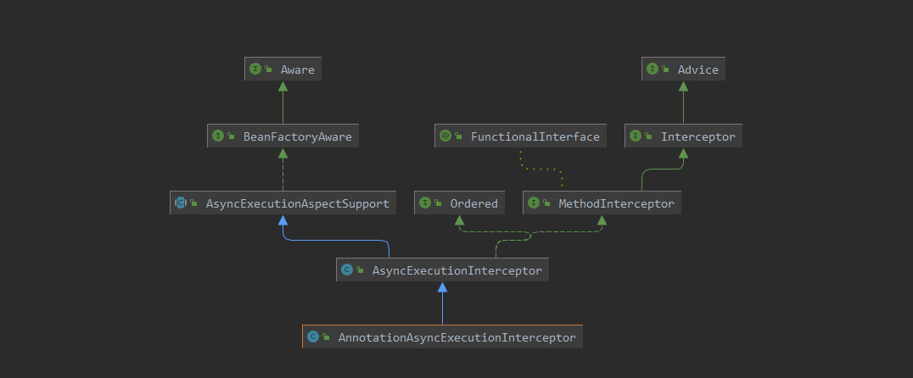

### @EnableAsync注解

```java
	/**
	 * 可自定义扫描的注解
	 */
	Class<? extends Annotation> annotation() default Annotation.class;

	/**
	 * 代理的class
	 */
	boolean proxyTargetClass() default false;

	/**
	 * 使用代理的模式
	 */
	AdviceMode mode() default AdviceMode.PROXY;

	/**
	 * 注解处理的顺序
	 */
	int order() default Ordered.LOWEST_PRECEDENCE;
```


### ProxyAsyncConfiguration

```java
	@Bean(name = TaskManagementConfigUtils.ASYNC_ANNOTATION_PROCESSOR_BEAN_NAME)
	@Role(BeanDefinition.ROLE_INFRASTRUCTURE)
	public AsyncAnnotationBeanPostProcessor asyncAdvisor() {
		Assert.notNull(this.enableAsync, "@EnableAsync annotation metadata was not injected");
		AsyncAnnotationBeanPostProcessor bpp = new AsyncAnnotationBeanPostProcessor();
        //将从容器中获取到的 Executor 和 ExceptionHandler设置到对象中
		bpp.configure(this.executor, this.exceptionHandler);
		Class<? extends Annotation> customAsyncAnnotation = this.enableAsync.getClass("annotation");
		if (customAsyncAnnotation != AnnotationUtils.getDefaultValue(EnableAsync.class, "annotation")) {
            //设置自定义的 异步注解
			bpp.setAsyncAnnotationType(customAsyncAnnotation);
		}
        //设置代理对象
		bpp.setProxyTargetClass(this.enableAsync.getBoolean("proxyTargetClass"));
        //设置加载顺序
		bpp.setOrder(this.enableAsync.<Integer>getNumber("order"));
		return bpp;
	}

	/**
	 * 获取到注解是否开启异步代理
	 */
	@Override
	public void setImportMetadata(AnnotationMetadata importMetadata) {
		this.enableAsync = AnnotationAttributes.fromMap(
				importMetadata.getAnnotationAttributes(EnableAsync.class.getName()));
		if (this.enableAsync == null) {
			throw new IllegalArgumentException(
					"@EnableAsync is not present on importing class " + importMetadata.getClassName());
		}
	}

	/**
	 * 从容器中找到实现了 AsyncConfigurer 类，然后获取到自定义的 线程执行器和异常处理器
	 */
	@Autowired
	void setConfigurers(ObjectProvider<AsyncConfigurer> configurers) {
		Supplier<AsyncConfigurer> configurer = SingletonSupplier.of(() -> {
			List<AsyncConfigurer> candidates = configurers.stream().collect(Collectors.toList());
			if (CollectionUtils.isEmpty(candidates)) {
				return null;
			}
			if (candidates.size() > 1) {
				throw new IllegalStateException("Only one AsyncConfigurer may exist");
			}
			return candidates.get(0);
		});
		this.executor = adapt(configurer, AsyncConfigurer::getAsyncExecutor);
		this.exceptionHandler = adapt(configurer, AsyncConfigurer::getAsyncUncaughtExceptionHandler);
	}
	
	//这里会返回一个Supplier对象用于在 AsyncExecutionAspectSupport 当中设置默认的线程池
	private <T> Supplier<T> adapt(Supplier<AsyncConfigurer> supplier, Function<AsyncConfigurer, T> provider) {
		return () -> {
            //如果不配置 AsyncConfigurer 这里就会返回null
			AsyncConfigurer configurer = supplier.get();
			return (configurer != null ? provider.apply(configurer) : null);
		};
	}
```


### AsyncAnnotationBeanPostProcessor



#### 1. setBeanFactory() 

实现了 **BeanFactoryAware** 接口，初始化 AsyncAnnotationBeanPostProcessor 时会调用内部的**setBeanFactory() **方法设置切面



#### 2. postProcessAfterInitialization

方法在容器创建好之后执行，给bean对象创建一个代理对象


### AsyncAnnotationAdvisor

```java
	public AsyncAnnotationAdvisor(
			@Nullable Supplier<Executor> executor, @Nullable Supplier<AsyncUncaughtExceptionHandler> exceptionHandler) {

		Set<Class<? extends Annotation>> asyncAnnotationTypes = new LinkedHashSet<>(2);
        //添加注解的类型
		asyncAnnotationTypes.add(Async.class);
		try {
			asyncAnnotationTypes.add((Class<? extends Annotation>)
					ClassUtils.forName("javax.ejb.Asynchronous", AsyncAnnotationAdvisor.class.getClassLoader()));
		}
		catch (ClassNotFoundException ex) {
			
		}
        //构建一个切面
		this.advice = buildAdvice(executor, exceptionHandler);
        //构建一个切点，通过注解
		this.pointcut = buildPointcut(asyncAnnotationTypes);
	}
```

### AnnotationAsyncExecutionInterceptor



```java
	/**
	 * 通过父类的构造器，设置一个默认的线程池的获取方式
	 */
	public AsyncExecutionAspectSupport(@Nullable Executor defaultExecutor, AsyncUncaughtExceptionHandler exceptionHandler) {
        // defaultExecutor就是在 ProxyAsyncConfiguration 中设置的Supplier对象，如果获取不到就调用
		this.defaultExecutor = new SingletonSupplier<>(defaultExecutor, () -> getDefaultExecutor(this.beanFactory));
		this.exceptionHandler = SingletonSupplier.of(exceptionHandler);
	}
```

#### 1. getExecutorQualifier()

```java
protected String getExecutorQualifier(Method method) {
    //获取到方法上面的注解，获取到vlue值，然后通过value值去确定线程池
		Async async = AnnotatedElementUtils.findMergedAnnotation(method, Async.class);
		if (async == null) {
			async = AnnotatedElementUtils.findMergedAnnotation(method.getDeclaringClass(), Async.class);
		}
		return (async != null ? async.value() : null);
	}
```

#### 2. invoke()

```java
public Object invoke(final MethodInvocation invocation) throws Throwable {
    //获取到目标类
		Class<?> targetClass = (invocation.getThis() != null ? AopUtils.getTargetClass(invocation.getThis()) : null);
    //获取到方法
		Method specificMethod = ClassUtils.getMostSpecificMethod(invocation.getMethod(), targetClass);
		final Method userDeclaredMethod = BridgeMethodResolver.findBridgedMethod(specificMethod);
    //确定异步使用的线程池 默认使用 SimpleAsyncTaskExecutor
		AsyncTaskExecutor executor = determineAsyncExecutor(userDeclaredMethod);
		if (executor == null) {
			throw new IllegalStateException();
		}
		//包装成 Callable 类的任务
		Callable<Object> task = () -> {
			try {
				Object result = invocation.proceed();
				if (result instanceof Future) {
					return ((Future<?>) result).get();
				}
			}
			catch (ExecutionException ex) {
				handleError(ex.getCause(), userDeclaredMethod, invocation.getArguments());
			}
			catch (Throwable ex) {
				handleError(ex, userDeclaredMethod, invocation.getArguments());
			}
			return null;
		};
		//提交方法执行
		return doSubmit(task, executor, invocation.getMethod().getReturnType());
	}
```

#### 3. determineAsyncExecutor()

```java
protected AsyncTaskExecutor determineAsyncExecutor(Method method) {
    //初始获取的会是null
		AsyncTaskExecutor executor = this.executors.get(method);
		if (executor == null) {
			Executor targetExecutor;
            //调用复写的方法通过注解来获取到对应的value来确定容器中的线程池名称
			String qualifier = getExecutorQualifier(method);
			if (StringUtils.hasLength(qualifier)) {
				targetExecutor = findQualifiedExecutor(this.beanFactory, qualifier);
			}
			else {
                //调用默认的 SingletonSupplier 对象来获取到对应的默认线程池。如果设置的对象都没有获取到，就会调用 getDefaultExecutor() 方法
				targetExecutor = this.defaultExecutor.get();
			}
			if (targetExecutor == null) {
				return null;
			}
			executor = (targetExecutor instanceof AsyncListenableTaskExecutor ?
					(AsyncListenableTaskExecutor) targetExecutor : new TaskExecutorAdapter(targetExecutor));
            //缓存上
			this.executors.put(method, executor);
		}
		return executor;
	}
```

#### 4. getDefaultExecutor() 

AsyncExecutionInterceptor复写的方法，如果都容器中都没有获取到对应的线程池，那么就返回 SimpleAsyncTaskExecutor

```java
	@Override
	@Nullable
	protected Executor getDefaultExecutor(@Nullable BeanFactory beanFactory) {
        //调用父类方法去获取线程池
		Executor defaultExecutor = super.getDefaultExecutor(beanFactory);
		return (defaultExecutor != null ? defaultExecutor : new SimpleAsyncTaskExecutor());
	}
```

### 面试题

spring中Async注解是使用线程池进行异步处理，还是使用单线程？
答：根据spring容器中配置的 **ObjectProvider\<AsyncConfigurer> configurers** 配置对象进行配置线程池还是单线程进行异步处理；如果没有指定配置对象那么默认就会去容器中查找 **TaskExecutor** 类型如果抛出异常就会去找名称为  **taskExecutor** 类型为 **Executor** 的线程池；如果都没有则使用默认 **SimpleAsyncTaskExecutor** 单线程进行异步处理

