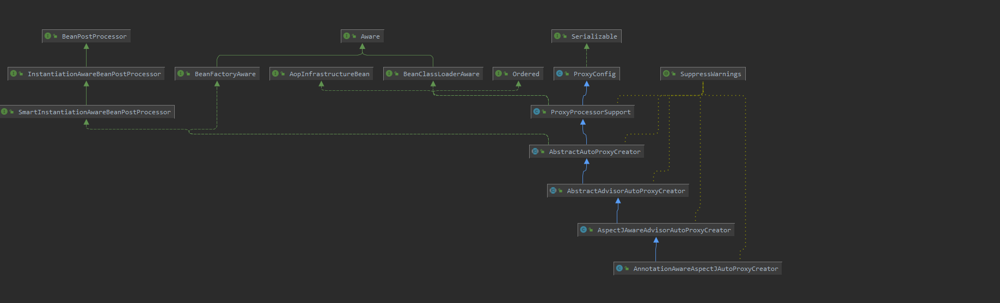
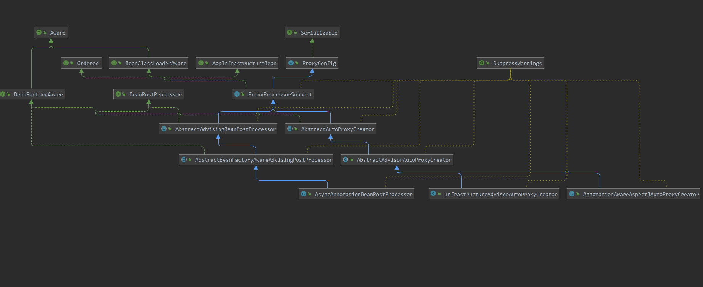

## 1. EnableAspectJAutoProxy

spring中开启用于处理动态代理的注解，用于对Aspectj框架中的@Aspect注解进行解析，对bean对象进行动态代理

```java
@Target(ElementType.TYPE)
@Retention(RetentionPolicy.RUNTIME)
@Documented
//导入处理类
@Import(AspectJAutoProxyRegistrar.class)
public @interface EnableAspectJAutoProxy {
	//是否代理目标class
	boolean proxyTargetClass() default false;

	//是否需要暴露代理对象，如果为true，就在 AopContext中获取到代理对象
	boolean exposeProxy() default false;
}
```


### 1.1 相关注解

@Around、@After、@Before 等注解是Aspectj框架中提供的功能，而spring中提供了对当前注解的解析

## 一、注解处理

### 1. AspectJAutoProxyRegistrar

**AspectJAutoProxyRegistrar** 实现了 **ImportBeanDefinitionRegistrar** 接口，当前接口的处理会在 **ConfigurationClassPostProcessor** 中进行扫描并且处理（这个类主要是做配置类还有对应路径下面bean的扫描，这个类很重要，spring对组件的扫描就是这个类来实现；后续再看这个类）；

这个类所要做的事就是向容器中注入一个 **AnnotationAwareAspectJAutoProxyCreator** 对象用于切面的扫描以及处理

```java
	public void registerBeanDefinitions(
			AnnotationMetadata importingClassMetadata, BeanDefinitionRegistry registry) {

		//注册Aop相关的处理类。向容器中注入 AnnotationAwareAspectJAutoProxyCreator bean的名称为（org.springframework.aop.config.internalAutoProxyCreator）
		AopConfigUtils.registerAspectJAnnotationAutoProxyCreatorIfNecessary(registry);

		//解析出当前@EnableAspectJAutoProxy注解中的属性
		AnnotationAttributes enableAspectJAutoProxy =
				AnnotationConfigUtils.attributesFor(importingClassMetadata, EnableAspectJAutoProxy.class);
		//根据对应的属性值来对上面创建的 AnnotationAwareAspectJAutoProxyCreator 设置对应的属性
		if (enableAspectJAutoProxy != null) {
			//如果为 true的话，把上面的 org.springframework.aop.config.internalAutoProxyCreator 其中属性proxyTargetClass设置为true
			if (enableAspectJAutoProxy.getBoolean("proxyTargetClass")) {
				AopConfigUtils.forceAutoProxyCreatorToUseClassProxying(registry);
			}
			//将其中属性exposeProxy设置为true
			if (enableAspectJAutoProxy.getBoolean("exposeProxy")) {
				AopConfigUtils.forceAutoProxyCreatorToExposeProxy(registry);
			}
		}
	}
```

### 2.  AnnotationAwareAspectJAutoProxyCreator

下面是当前类的依赖图，其中只看比较重要的类



- BeanPostProcessor：顶级接口其中定义了两个方法
  - postProcessBeforeInitialization：创建bean之后调用初始化方法之前时会进行调用
  - postProcessAfterInitialization：创建bean之后调用初始化方法之后会进行调用，这里一般进行bean对象的代理
- InstantiationAwareBeanPostProcessor：子接口提供了以下两个比较重要的方法
  - postProcessBeforeInstantiation：在创建bean之前的阶段会执行，体现在aop处理中，会提前查找出所有的切面并且进行缓存
  - postProcessAfterInstantiation：目前还没有看到用的地方
  - postProcessAfterInstantiation：在对bean对象属性进行赋值时之前进行调用
  - postProcessProperties：处理value值

下图是 @Async注解、@Transactional、@Aspect注解处理器的依赖图；其中事务和AspectJ注解处理都实现了 **AbstractAutoProxyCreator** 类，而@Async注解则走的另外的逻辑。其中方法的目的都是 扫描出对应 **Advisor** 增强器来；而**AbstractAdvisingBeanPostProcessor** 则是可以指定增强器来执行；具体逻辑后续详细看



从上面依赖图以及代码中可以看到 **AnnotationAwareAspectJAutoProxyCreator** 是 **AbstractAutoProxyCreator** 实现类，在整个依赖链上只有 **AbstractAutoProxyCreator** 实现了 **postProcessBeforeInstantiation() ** 方法，该方法的目的就是在创建bean对象之前，就将切面找出来进行缓存上所以我们重点看这个方法是如何查找切面的

### 3. AbstractAutoProxyCreator

#### 3.1 postProcessBeforeInstantiation()

主要是判断了是否以及存在于 **targetSourcedBeans** 、**advisedBeans** 池中，前者是缓存的代理目标对象，后者这是缓存上切面增强器对象

```java
public Object postProcessBeforeInstantiation(Class<?> beanClass, String beanName) {
		//获取到缓存key的名称，如果是FactoryBean的实现类，需要将bean的名称添加上 &符号
		Object cacheKey = getCacheKey(beanClass, beanName);
		//判断bean的名称是否为空，目标资源池中是否有当前bean
		if (!StringUtils.hasLength(beanName) || !this.targetSourcedBeans.contains(beanName)) {
			//判断切面池中是否有缓存key，如果有，则不需要进行代理
			if (this.advisedBeans.containsKey(cacheKey)) {
				return null;
			}
			/**
			 * isInfrastructureClass() 主要判断是否是下面类型的实现类，如果是则添加到切面池中进行缓存上
			 * Advice、Pointcut、Advisor、AopInfrastructureBean;
			 *
			 * 而shouldSkip中通过子类实现方法，就会去找出所有的切面。父类的shouldSkip主要判断了bean名称是否为空以及是否是 .ORIGINAL 结尾的bean
			 */
			if (isInfrastructureClass(beanClass) || shouldSkip(beanClass, beanName)) {
				this.advisedBeans.put(cacheKey, Boolean.FALSE);
				return null;
			}
		}
		/**
		 * 创建一个自定义的目标源对象，而spring中代理对象代理的是TargetSource对象，而不是目标bean对象。
		 * 因为一个代理对象只能代理一个target，每次需要调用的target也都是唯一且固定；
		 * 如果改成了TargetSource来进行代理的话，就可以实现代理池，或者运行时代理对象热替换等高级功能。类型于一个适配器的感觉，怎么调由 TargetSource 内部来实现；可以自己实现BeanPostProcessor来对当前类进行干预，并且设置目标对象
		 */
		TargetSource targetSource = getCustomTargetSource(beanClass, beanName);
		if (targetSource != null) {
			if (StringUtils.hasLength(beanName)) {
				//将目标源对象缓存起来
				this.targetSourcedBeans.add(beanName);
			}
			//找出适合的增强器
			Object[] specificInterceptors = getAdvicesAndAdvisorsForBean(beanClass, beanName, targetSource);
			//创建代理对象
			Object proxy = createProxy(beanClass, beanName, specificInterceptors, targetSource);
			//将代理对象缓存起来
			this.proxyTypes.put(cacheKey, proxy.getClass());
			//返回代理对象
			return proxy;
		}

		return null;
	}
```

###### shouldSkip()

由子类 **AspectJAwareAdvisorAutoProxyCreator** 进行复写了；其中调用的方法以下：

- org.springframework.aop.framework.autoproxy.AbstractAdvisorAutoProxyCreator#findEligibleAdvisors()
  - 其中子类org.springframework.aop.aspectj.annotation.AnnotationAwareAspectJAutoProxyCreator#findCandidateAdvisors() 实现了该方法所以优先调用子类方法
- org.springframework.aop.framework.autoproxy.AbstractAutoProxyCreator#shouldSkip

```java
protected boolean shouldSkip(Class<?> beanClass, String beanName) {
		//调用父类 AbstractAdvisorAutoProxyCreator 中的方法；
		List<Advisor> candidateAdvisors = findCandidateAdvisors();
		//如果查询出来的增强器为 AspectJPointcutAdvisor 类型并i切面名称等于bean的名称 直接返回true
		for (Advisor advisor : candidateAdvisors) {
			if (advisor instanceof AspectJPointcutAdvisor &&
					((AspectJPointcutAdvisor) advisor).getAspectName().equals(beanName)) {
				return true;
			}
		}
		//调用 AbstractAutoProxyCreator 中的方法进行判断
		return super.shouldSkip(beanClass, beanName);
	}
```

###### findCandidateAdvisors()

**findCandidateAdvisors()** 方法由AnnotationAwareAspectJAutoProxyCreator进行最终实现

```java
protected List<Advisor> findCandidateAdvisors() {
    /**
	 * 	先调用父类的方法，通过 this.advisorRetrievalHelper.findAdvisorBeans(); 找出所有的 Advisor
	 */
    List<Advisor> advisors = super.findCandidateAdvisors();
    // 判断切换构造器是否为空，在父类设置bean工厂时就进行实例化 setBeanFactory
    if (this.aspectJAdvisorsBuilder != null) {
        //获取到容器中所有的类，并且通过 isEligibleAspectBean() 用表达式进行判断是否是合法的bean
        advisors.addAll(this.aspectJAdvisorsBuilder.buildAspectJAdvisors());
    }
    return advisors;
}
```

org.springframework.aop.framework.autoproxy.AbstractAdvisorAutoProxyCreator#findCandidateAdvisors

```java
protected List<Advisor> findCandidateAdvisors() {
    Assert.state(this.advisorRetrievalHelper != null, "No BeanFactoryAdvisorRetrievalHelper available");
    //调用增强查找工具类。通过当前工具类，会从bean工厂中查找出 Advisor.class 的实现类；查找出来之后会将其进行创建
    return this.advisorRetrievalHelper.findAdvisorBeans();
}
```

**org.springframework.aop.aspectj.annotation.BeanFactoryAspectJAdvisorsBuilder#buildAspectJAdvisors** : 当前方法主要是获取出了容器中所有bean名称，根据是否是单例对象存入不同的缓存池中，如果是单例存入 **advisorsCache** 缓存中，缓存的数据 bean名称+Advisor 增强；如果不是单例则会存入 **aspectFactoryCache** ，存入的数据 bean名称+元数据工厂对象；其中会根据 **ReflectiveAspectJAdvisorFactory** 中的 getAdvisors() 方法会将 @Before、@After等注解处理成对应的Advisor

```java
public List<Advisor> buildAspectJAdvisors() {
		List<String> aspectNames = this.aspectBeanNames;
		if (aspectNames == null) {
			synchronized (this) {
				//获取到缓存的切面名称
				aspectNames = this.aspectBeanNames;
				if (aspectNames == null) {
					List<Advisor> advisors = new ArrayList<>();
					aspectNames = new ArrayList<>();
					//获取出容器中所有的对象
					String[] beanNames = BeanFactoryUtils.beanNamesForTypeIncludingAncestors(
							this.beanFactory, Object.class, true, false);
					for (String beanName : beanNames) {
						//判断是是合法的bean。调用 AnnotationAwareAspectJAutoProxyCreator.isEligibleBean() 方法，如果表达式为空默认返回true
						if (!isEligibleBean(beanName)) {
							continue;
						}
						Class<?> beanType = this.beanFactory.getType(beanName, false);
						if (beanType == null) {
							continue;
						}
						//判断是否有 @Aspect注解
						if (this.advisorFactory.isAspect(beanType)) {
							aspectNames.add(beanName);
							//创建切面元数据对象
							AspectMetadata amd = new AspectMetadata(beanType, beanName);
							//判断是否是单例
							if (amd.getAjType().getPerClause().getKind() == PerClauseKind.SINGLETON) {
								//创建元数据工厂对象，通过工厂对象来进行创建
								MetadataAwareAspectInstanceFactory factory =
										new BeanFactoryAspectInstanceFactory(this.beanFactory, beanName);
								/**
								 * org.springframework.aop.aspectj.annotation.ReflectiveAspectJAdvisorFactory.getAdvisors
								 * 当前方法为将 @Aspect 注解中的 @Before @After 等注册包装成增强器进行返回;具体看下面
								 */
								List<Advisor> classAdvisors = this.advisorFactory.getAdvisors(factory);
								//判断是否是单例，如果是单例，只需要直接存名称跟增强器关联就行了
								if (this.beanFactory.isSingleton(beanName)) {
									//将当前切面对象进行缓存上
									this.advisorsCache.put(beanName, classAdvisors);
								}
								else {
									//如果不是单例，直接存工厂对象
									this.aspectFactoryCache.put(beanName, factory);
								}
								advisors.addAll(classAdvisors);
							}
							else {
								MetadataAwareAspectInstanceFactory factory =
										new PrototypeAspectInstanceFactory(this.beanFactory, beanName);
								this.aspectFactoryCache.put(beanName, factory);
								advisors.addAll(this.advisorFactory.getAdvisors(factory));
							}
						}
					}
					this.aspectBeanNames = aspectNames;
					return advisors;
				}
			}
		}

		if (aspectNames.isEmpty()) {
			return Collections.emptyList();
		}
		List<Advisor> advisors = new ArrayList<>();
		for (String aspectName : aspectNames) {
			//根据从单例切面池中获取出来是否为空进行判断从哪个缓存池中进行获取
			List<Advisor> cachedAdvisors = this.advisorsCache.get(aspectName);
			if (cachedAdvisors != null) {
				advisors.addAll(cachedAdvisors);
			}
			else {
				MetadataAwareAspectInstanceFactory factory = this.aspectFactoryCache.get(aspectName);
				advisors.addAll(this.advisorFactory.getAdvisors(factory));
			}
		}
		//返回增强器
		return advisors;
	}
```

###### getAdvisors()

调用方法 **org.springframework.aop.aspectj.annotation.ReflectiveAspectJAdvisorFactory#getAdvisors** 将 @Aspect 注解中相关注解进行处理对应的 **Advisor** 对象

最后所有的 @After、@Before等注解都会被处理成  **InstantiationModelAwarePointcutAdvisorImpl** 增强器

```java
public List<Advisor> getAdvisors(MetadataAwareAspectInstanceFactory aspectInstanceFactory) {
		//获取切面的类
		Class<?> aspectClass = aspectInstanceFactory.getAspectMetadata().getAspectClass();
		//获取切面名称
		String aspectName = aspectInstanceFactory.getAspectMetadata().getAspectName();
		//校验是否有注解 @Aspect、是否是抽象类，是否是切面
		validate(aspectClass);
		//使用装饰器模式，创建一个懒加载实例化工厂将切面对象进行缓存起来，避免多次创建
		MetadataAwareAspectInstanceFactory lazySingletonAspectInstanceFactory =
				new LazySingletonAspectInstanceFactoryDecorator(aspectInstanceFactory);
		List<Advisor> advisors = new ArrayList<>();
		//获取切面对象中的所有方法，排除Pointcut的方法，包括Object的方法
		for (Method method : getAdvisorMethods(aspectClass)) {
			//其中返回的对象为 InstantiationModelAwarePointcutAdvisorImpl
			Advisor advisor = getAdvisor(method, lazySingletonAspectInstanceFactory, 0, aspectName);
			if (advisor != null) {
				advisors.add(advisor);
			}
		}
		//判断是否是懒加载实例化当前工厂，如果是拦截在实例化，在集合头部添加一个 SyntheticInstantiationAdvisor 增强器以达到懒加载的目的
		if (!advisors.isEmpty() && lazySingletonAspectInstanceFactory.getAspectMetadata().isLazilyInstantiated()) {
			Advisor instantiationAdvisor = new SyntheticInstantiationAdvisor(lazySingletonAspectInstanceFactory);
			advisors.add(0, instantiationAdvisor);
		}

		// 处理 @DeclareParents 注解
		for (Field field : aspectClass.getDeclaredFields()) {
			Advisor advisor = getDeclareParentsAdvisor(field);
			if (advisor != null) {
				advisors.add(advisor);
			}
		}
		return advisors;
	}
```

#### 3.2 postProcessAfterInitialization()

当前方法在bean对象创建并且初始化完成之后进行执行，查看是否需要进行代理，创建代理对象

```java
public Object postProcessAfterInitialization(@Nullable Object bean, String beanName) {
		if (bean != null) {
			//处理key
			Object cacheKey = getCacheKey(bean.getClass(), beanName);
			//判断当前对象是否已经存在于早期引用池当中，返回的bean对象是真实的对象，如果跟当前的bean不一样，就执行代理；防止多次创建代理对象；如果有存在早期引用，这时候bean工厂中会暴露代理对象出去
			if (this.earlyProxyReferences.remove(cacheKey) != bean) {
				return wrapIfNecessary(bean, beanName, cacheKey);
			}
		}
		return bean;
	}
```

###### wrapIfNecessary()

**org.springframework.aop.framework.autoproxy.AbstractAutoProxyCreator#wrapIfNecessary** : 对bean对象进行代理

```java
protected Object wrapIfNecessary(Object bean, String beanName, Object cacheKey) {
		//判断目标对象是否存在以及代理资源对象是否存在
		if (StringUtils.hasLength(beanName) && this.targetSourcedBeans.contains(beanName)) {
			return bean;
		}
		//判断是否是切面bean
		if (Boolean.FALSE.equals(this.advisedBeans.get(cacheKey))) {
			return bean;
		}
		//判断是否基础类，是否应该跳过
		if (isInfrastructureClass(bean.getClass()) || shouldSkip(bean.getClass(), beanName)) {
			this.advisedBeans.put(cacheKey, Boolean.FALSE);
			return bean;
		}

		// 找到合适的增强器
		Object[] specificInterceptors = getAdvicesAndAdvisorsForBean(bean.getClass(), beanName, null);
		if (specificInterceptors != DO_NOT_PROXY) {
			//设置当前需要被通知的对象为true
			this.advisedBeans.put(cacheKey, Boolean.TRUE);
			//根据代理的对象是否有接口创建对应的代理类型 有接口就是Jdk代理，没有接口就是Cjlib代理
			Object proxy = createProxy(
					bean.getClass(), beanName, specificInterceptors, new SingletonTargetSource(bean));
			//设置代理类型
			this.proxyTypes.put(cacheKey, proxy.getClass());
			return proxy;
		}
		//没有找到对应的增强器
		this.advisedBeans.put(cacheKey, Boolean.FALSE);
		return bean;
	}
```

###### getAdvicesAndAdvisorsForBean()

**org.springframework.aop.framework.autoproxy.AbstractAdvisorAutoProxyCreator#getAdvicesAndAdvisorsForBean** ：根据bean对象获取到适合的增强器

```java
protected Object[] getAdvicesAndAdvisorsForBean(
			Class<?> beanClass, String beanName, @Nullable TargetSource targetSource) {
		//找到合适的增强器
		List<Advisor> advisors = findEligibleAdvisors(beanClass, beanName);
		if (advisors.isEmpty()) {
			return DO_NOT_PROXY;
		}
		return advisors.toArray();
	}

----------------------------------分割线---------------------------------------
    
    
protected List<Advisor> findEligibleAdvisors(Class<?> beanClass, String beanName) {
    //将所有的增强器获取出来，包括@Aspect注解的增强器
    List<Advisor> candidateAdvisors = findCandidateAdvisors();
    //获取到适配当前class是否匹配的增强器
    List<Advisor> eligibleAdvisors = findAdvisorsThatCanApply(candidateAdvisors, beanClass, beanName);
    //给增强器链中首部添加了一个 ExposeInvocationInterceptor 拦截器，用于暴露当前直接的 MethodInvocation对象
    extendAdvisors(eligibleAdvisors);
    if (!eligibleAdvisors.isEmpty()) {
        //对增强器进行排序，根据注解 @Order以及是否实现了 Ordered接口 进行排序
        eligibleAdvisors = sortAdvisors(eligibleAdvisors);
    }
    return eligibleAdvisors;
}

----------------------------------分割线---------------------------------------

protected List<Advisor> findAdvisorsThatCanApply(
			List<Advisor> candidateAdvisors, Class<?> beanClass, String beanName) {
	//将bean名称进行本地线程保存
    ProxyCreationContext.setCurrentProxiedBeanName(beanName);
    try {
        /**
		 * 其中增强器有两种实现
		 * IntroductionAdvisor：该接口只提供了获取 ClassFilter的方法，是对class类进行匹配
		 * PointcutAdvisor：该接口提供了 ClassFilter以及MethodMatch进行匹配，优先对类进行匹配，如果类匹配成功了再对方法进行匹配
		 * 实际就是调用了 MthodMatcher和ClassFilter的方法
		 */
        return AopUtils.findAdvisorsThatCanApply(candidateAdvisors, beanClass);
    }
    finally {
        ProxyCreationContext.setCurrentProxiedBeanName(null);
    }
}
```

###### createProxy()

根据 **TargetSource** 对象进行创建代理对象，spring默认会给bean对象创建一个 **SingletonTargetSource** 对象进行代理


```java
protected Object createProxy(Class<?> beanClass, @Nullable String beanName,
			@Nullable Object[] specificInterceptors, TargetSource targetSource) {

		if (this.beanFactory instanceof ConfigurableListableBeanFactory) {
			AutoProxyUtils.exposeTargetClass((ConfigurableListableBeanFactory) this.beanFactory, beanName, beanClass);
		}
		//创建一个代理工厂对象
		ProxyFactory proxyFactory = new ProxyFactory();
		//复制当前处理器的属性值
		proxyFactory.copyFrom(this);
		//这里用到了注解当中 proxyTargetClass 属性，是否代理目标class；默认false；这个属性为影响进行代理的方法
		if (proxyFactory.isProxyTargetClass()) {
			//判断class是否是 Proxy 实现类，这里处理jdk代理对象接口
			if (Proxy.isProxyClass(beanClass)) {
				for (Class<?> ifc : beanClass.getInterfaces()) {
					//将当前class的所有接口添加到代理工厂当中
					proxyFactory.addInterface(ifc);
				}
			}
		}
		else {
			//检查bean定义中是否有属性 preserveTargetClass 为true；确定是否应该使用目标类的接口进行代理，而不是使用代理的
			if (shouldProxyTargetClass(beanClass, beanName)) {
				proxyFactory.setProxyTargetClass(true);
			}
			else {
				//获取所有的接口添加到代理工厂对象中，如果没有接口设置ProxyTargetClass为true，使用CGLIB进行代理
				evaluateProxyInterfaces(beanClass, proxyFactory);
			}
		}

		//将 Advisor进行包装，对 Advice通知类型也进行包装；默认返回 DefaultPointcutAdvisor类型
		Advisor[] advisors = buildAdvisors(beanName, specificInterceptors);
		proxyFactory.addAdvisors(advisors);
		proxyFactory.setTargetSource(targetSource);
		//调用自定义的代理工厂
		customizeProxyFactory(proxyFactory);
		//设置是否冻结代理对象
		proxyFactory.setFrozen(this.freezeProxy);
		//设置是否预过滤
		if (advisorsPreFiltered()) {
			proxyFactory.setPreFiltered(true);
		}
		ClassLoader classLoader = getProxyClassLoader();
		if (classLoader instanceof SmartClassLoader && classLoader != beanClass.getClassLoader()) {
			classLoader = ((SmartClassLoader) classLoader).getOriginalClassLoader();
		}
		//创建代理对象
		return proxyFactory.getProxy(classLoader);
	}
```


###### getProxy()

```java
public Object getProxy(@Nullable ClassLoader classLoader) {
    //通过对应的代理工厂获取到代理对象
    return createAopProxy().getProxy(classLoader);
}
—————————————————————————————————————分割线———————————————————————————————————————————————————
//创建对应的代理工厂对象
public AopProxy createAopProxy(AdvisedSupport config) throws AopConfigException {
    /**
		 * NativeDetector.inNativeImage() ： 检验org.graalvm.nativeimage.imagecode配置是否不为null
		 * config.isOptimize()：默认为false，
		 * config.isProxyTargetClass() : 根据前面设置的值，true或者false
		 * hasNoUserSuppliedProxyInterfaces(): 没有接口或者有一个SpringProxy的实现类就返回true
		 */
    if (!NativeDetector.inNativeImage() &&
        (config.isOptimize() || config.isProxyTargetClass() || hasNoUserSuppliedProxyInterfaces(config))) {
        //这个时候targetClass 是 SingletonTargetSource 类
        Class<?> targetClass = config.getTargetClass();
        if (targetClass == null) {
            throw new AopConfigException("TargetSource cannot determine target class: " +
                                         "Either an interface or a target is required for proxy creation.");
        }
        //SingletonTargetSource 如果是接口，或者Proxy的实现类；使用jdk代理
        if (targetClass.isInterface() || Proxy.isProxyClass(targetClass)) {
            return new JdkDynamicAopProxy(config);
        }
        //使用CGLIB进行代理
        return new ObjenesisCglibAopProxy(config);
    }
    else {
        return new JdkDynamicAopProxy(config);
    }
}

—————————————————————————————————————分割线———————————————————————————————————————————————————
@Override
public Object getProxy(@Nullable ClassLoader classLoader) {
    if (logger.isTraceEnabled()) {
        logger.trace("Creating JDK dynamic proxy: " + this.advised.getTargetSource());
    }
    //执行代理对象创建返回：JdkDynamicAopProxy类型的代理对象
    return Proxy.newProxyInstance(classLoader, this.proxiedInterfaces, this);
}
```


## 二、代码执行

### 1. JdkDynamicAopProxy

通过代理之后，返回的是 **JdkDynamicAopProxy** 代理对象，执行时就执行到 **invoke** 方法

**invoke** 方法主要先判断执行的方法是否是equals或者hashcode等方法，以及是否是DecoratingProxy、Advised的实现类；获取到增强器链条通过创建的 **ReflectiveMethodInvocation** 的类进行调用

```java
public Object invoke(Object proxy, Method method, Object[] args) throws Throwable {
		Object oldProxy = null;
		boolean setProxyContext = false;
		//this.advised 对象就是 ProxyFactory
		TargetSource targetSource = this.advised.targetSource;
		Object target = null;
		try {
			//AopUtils.isEqualsMethod() 判断方法是否为空，判断是否是 equals方法
			if (!this.equalsDefined && AopUtils.isEqualsMethod(method)) {
				return equals(args[0]);
			}
			//判断是否是hashCode方法
			else if (!this.hashCodeDefined && AopUtils.isHashCodeMethod(method)) {
				return hashCode();
			}
			//判断类型是否是 DecoratingProxy
			else if (method.getDeclaringClass() == DecoratingProxy.class) {
				return AopProxyUtils.ultimateTargetClass(this.advised);
			}
			//判断是否是接口以及是否是 Advised 的实现类；调用代理工厂中的方法
			else if (!this.advised.opaque && method.getDeclaringClass().isInterface() &&
					method.getDeclaringClass().isAssignableFrom(Advised.class)) {
				return AopUtils.invokeJoinpointUsingReflection(this.advised, method, args);
			}

			Object retVal;
			//是否需要将代理对象进行暴露 AopContext
			if (this.advised.exposeProxy) {
				oldProxy = AopContext.setCurrentProxy(proxy);
				setProxyContext = true;
			}
			//真实的bean对象
			target = targetSource.getTarget();
			Class<?> targetClass = (target != null ? target.getClass() : null);
			// 获取到所有的增强器并且对增强器进行包装
			List<Object> chain = this.advised.getInterceptorsAndDynamicInterceptionAdvice(method, targetClass);
			if (chain.isEmpty()) {
				Object[] argsToUse = AopProxyUtils.adaptArgumentsIfNecessary(method, args);
				//直接调用方法如果增强链为空
				retVal = AopUtils.invokeJoinpointUsingReflection(target, method, argsToUse);
			}
			else {
				//创建 ReflectiveMethodInvocation类型进行执行
				MethodInvocation invocation =
						new ReflectiveMethodInvocation(proxy, target, method, args, targetClass, chain);
				retVal = invocation.proceed();
			}
			//获取到返回值的类型，先判断是否等于目标bean对象并且是否是代理对象，如果是 就把代理对象设置给返回值中
			Class<?> returnType = method.getReturnType();
			if (retVal != null && retVal == target &&
					returnType != Object.class && returnType.isInstance(proxy) &&
					!RawTargetAccess.class.isAssignableFrom(method.getDeclaringClass())) {
				retVal = proxy;
			}
			else if (retVal == null && returnType != Void.TYPE && returnType.isPrimitive()) {
				throw new AopInvocationException(
						"Null return value from advice does not match primitive return type for: " + method);
			}
			return retVal;
		}
		finally {
			//最后释放targetSource对象，默认实现的SingtonTargetSource方法什么都没有做
			if (target != null && !targetSource.isStatic()) {
				targetSource.releaseTarget(target);
			}
			//如果暴露了代理对象需要重新存入老的代理对象
			if (setProxyContext) {
				AopContext.setCurrentProxy(oldProxy);
			}
		}
	}
```

#### 1.1 getInterceptorsAndDynamicInterceptionAdvice

根据目标类以及方法，获取到适合的增强器

```java
public List<Object> getInterceptorsAndDynamicInterceptionAdvice(Method method, @Nullable Class<?> targetClass) {
    //创建一个方法的缓存对象
    MethodCacheKey cacheKey = new MethodCacheKey(method);
    List<Object> cached = this.methodCache.get(cacheKey);
    if (cached == null) {
        //根据增强器的类型，对增强器进行适配
        cached = this.advisorChainFactory.getInterceptorsAndDynamicInterceptionAdvice(
            this, method, targetClass);
        //将方法和增强器进行缓存
        this.methodCache.put(cacheKey, cached);
    }
    return cached;
}
```

当前方法主要是根据 **Advisor** 的类型进行调用对应的方法

- PointcutAdvisor：支持类和方法进行过滤；例子如 @Async 的增强器，其中使用了默认的ClassFilter，所有的class类都会进行匹配。因为只需要匹配类中的方法，而 IntroductionAdvisor 只能匹配class类
- IntroductionAdvisor：只支持了对class类进行过滤；

其中 **registry.getInterceptors(advisor)** 方法会将 Advisor 中定义的 Advice对象取出来根据类型进行转换成统一的 **MethodInterceptor** 进行返回；然后在将 **MethodInterceptor** 对象封装成 **InterceptorAndDynamicMethodMatcher** 对象用于后续的执行。

使用了适配器目前默认支持的三种适配器类型：

- MethodBeforeAdviceAdapter
- AfterReturningAdviceAdapter
- ThrowsAdviceAdapter

```java
public List<Object> getInterceptorsAndDynamicInterceptionAdvice(
			Advised config, Method method, @Nullable Class<?> targetClass) {
		/**
		 * 创建一个默认增强器适配器工厂，主要目的用于适配器的转换;
		 * 判断 Advice是否是 MethodInterceptor类型，如果不是则通过适配器对Advice进行转换
		 * 默认支持的有三种 MethodBeforeAdviceAdapter、AfterReturningAdviceAdapter、ThrowsAdviceAdapter
		 */
		AdvisorAdapterRegistry registry = GlobalAdvisorAdapterRegistry.getInstance();
		Advisor[] advisors = config.getAdvisors();
		List<Object> interceptorList = new ArrayList<>(advisors.length);
		Class<?> actualClass = (targetClass != null ? targetClass : method.getDeclaringClass());
		Boolean hasIntroductions = null;

		for (Advisor advisor : advisors) {
			/**
			 * 判断增强器的类型：
			 * PointcutAdvisor：优先判断class是否过滤，再通过方法匹配器进行方法的匹配
			 * IntroductionAdvisor：直接判断class是否过滤
			 * 以上两种类型都不是，直接添加增强器链当中
			 */
			if (advisor instanceof PointcutAdvisor) {
				// Add it conditionally.
				PointcutAdvisor pointcutAdvisor = (PointcutAdvisor) advisor;
				if (config.isPreFiltered() || pointcutAdvisor.getPointcut().getClassFilter().matches(actualClass)) {
					//获取方法匹配器
					MethodMatcher mm = pointcutAdvisor.getPointcut().getMethodMatcher();
					boolean match;
					if (mm instanceof IntroductionAwareMethodMatcher) {
						//调用 IntroductionAdvisor 类型的匹配器
						if (hasIntroductions == null) {
							hasIntroductions = hasMatchingIntroductions(advisors, actualClass);
						}
						match = ((IntroductionAwareMethodMatcher) mm).matches(method, actualClass, hasIntroductions);
					}
					else {
						//直接调用进行匹配
						match = mm.matches(method, actualClass);
					}
					if (match) {
						//将 Advice 进行包装，包装成 MethodInterceptor类型
						MethodInterceptor[] interceptors = registry.getInterceptors(advisor);
						if (mm.isRuntime()) {
							for (MethodInterceptor interceptor : interceptors) {
								//将 MethodInterceptor 再进行统一包装成 InterceptorAndDynamicMethodMatcher
								interceptorList.add(new InterceptorAndDynamicMethodMatcher(interceptor, mm));
							}
						}
						else {
							interceptorList.addAll(Arrays.asList(interceptors));
						}
					}
				}
			}
			else if (advisor instanceof IntroductionAdvisor) {
				IntroductionAdvisor ia = (IntroductionAdvisor) advisor;
				if (config.isPreFiltered() || ia.getClassFilter().matches(actualClass)) {
					Interceptor[] interceptors = registry.getInterceptors(advisor);
					interceptorList.addAll(Arrays.asList(interceptors));
				}
			}
			else {
				Interceptor[] interceptors = registry.getInterceptors(advisor);
				interceptorList.addAll(Arrays.asList(interceptors));
			}
		}
		return interceptorList;
	}
```


#### 1.2 getInterceptors()

```java
public MethodInterceptor[] getInterceptors(Advisor advisor) throws UnknownAdviceTypeException {
		List<MethodInterceptor> interceptors = new ArrayList<>(3);
		Advice advice = advisor.getAdvice();
		if (advice instanceof MethodInterceptor) {
			interceptors.add((MethodInterceptor) advice);
		}
		/**
		 * 查看适配器是否支持当前通知类型，目前有三种
		 * MethodBeforeAdviceAdapter、AfterReturningAdviceAdapter、ThrowsAdviceAdapter
		 */
		for (AdvisorAdapter adapter : this.adapters) {
			if (adapter.supportsAdvice(advice)) {
				interceptors.add(adapter.getInterceptor(advisor));
			}
		}
		if (interceptors.isEmpty()) {
			throw new UnknownAdviceTypeException(advisor.getAdvice());
		}
		return interceptors.toArray(new MethodInterceptor[0]);
	}
```


### 2. ReflectiveMethodInvocation

根据增强器的类型判断是否需要执行增强器，这里 **PointcutAdvisor** 类型不太明白为什么前面在获取拦截器的时候执行了一次方法匹配，到这里还需要再次执行一次匹配。看源码上面注释写的 **“前面进行的是静态代码匹配，而这一步是对动态方法的匹配”** 这个静态匹配和动态匹配，猜测应该是在获取到拦截器后还未开始后续执行的时候，代码被其他线程中进行动态更改了

```java
public Object proceed() throws Throwable {
		//如果当前执行到的索引位置，跟增强器的数量一样，直接执行目标方法
		if (this.currentInterceptorIndex == this.interceptorsAndDynamicMethodMatchers.size() - 1) {
			return invokeJoinpoint();
		}
		//获取增强器
		Object interceptorOrInterceptionAdvice =
				this.interceptorsAndDynamicMethodMatchers.get(++this.currentInterceptorIndex);
    	//这里只有前面获取拦截器时只有 PointcutAdvisor 类型的会封装成当前类型，然后获取到方法再执行匹配
		if (interceptorOrInterceptionAdvice instanceof InterceptorAndDynamicMethodMatcher) {
			InterceptorAndDynamicMethodMatcher dm =
					(InterceptorAndDynamicMethodMatcher) interceptorOrInterceptionAdvice;
			Class<?> targetClass = (this.targetClass != null ? this.targetClass : this.method.getDeclaringClass());
			//如果增强器的类型为 InterceptorAndDynamicMethodMatcher，先匹配再执行其中的拦截器
			if (dm.methodMatcher.matches(this.method, targetClass, this.arguments)) {
				return dm.interceptor.invoke(this);
			}
			else {
				return proceed();
			}
		}
		else {
			//直接执行增强器的方法
			return ((MethodInterceptor) interceptorOrInterceptionAdvice).invoke(this);
		}
	}
```

### 3. 执行类

前面在对注解 @Before、@Around、@After等注解处理时会创建一下类型的通知：

- Around：AspectJAroundAdvice
- Before：AspectJMethodBeforeAdvice，通过 MethodBeforeAdviceAdapter 进行适配，创建 MethodBeforeAdviceInterceptor
- After：AspectJAfterAdvice
- AfterReturnnig：AspectJAfterReturningAdvice，通过AfterReturningAdviceAdapter进行适配，创建 AfterReturningAdviceInterceptor
- AfterThrowing：AspectJAfterThrowingAdvice

#### 3.1 AspectJMethodBeforeAdvice

```java
@Override
public void before(Method method, Object[] args, @Nullable Object target) throws Throwable {
    invokeAdviceMethod(getJoinPointMatch(), null, null);
}
------------------------------------分割线----------------------------------

protected Object invokeAdviceMethod(
    @Nullable JoinPointMatch jpMatch, @Nullable Object returnValue, @Nullable Throwable ex)
    throws Throwable {
	//先进行参数的绑定，再执行方法
    return invokeAdviceMethodWithGivenArgs(argBinding(getJoinPoint(), jpMatch, returnValue, ex));
}
```

#### 3.2 AspectJAfterAdvice

```java
public Object invoke(MethodInvocation mi) throws Throwable {
    try {
        //先将拦截器链中所有的拦截器都执行了，然后再执行源方法
        return mi.proceed();
    }
    finally {
        //再执行after的方法
        invokeAdviceMethod(getJoinPointMatch(), null, null);
    }
}
```

#### 3.3 AspectJAroundAdvice

```java
public Object invoke(MethodInvocation mi) throws Throwable {
    if (!(mi instanceof ProxyMethodInvocation)) {
        throw new IllegalStateException("MethodInvocation is not a Spring ProxyMethodInvocation: " + mi);
    }
    ProxyMethodInvocation pmi = (ProxyMethodInvocation) mi;
    //将执行器类包装成 MethodInvocationProceedingJoinPoint类型
    ProceedingJoinPoint pjp = lazyGetProceedingJoinPoint(pmi);
    //通过point的表达式获取到对应的匹配器，返回null
    JoinPointMatch jpm = getJoinPointMatch(pmi);
    //执行切面的方法,先根据方法的参数进行传入的参数进行绑定
    return invokeAdviceMethod(pjp, jpm, null, null);
}
```

#### 3.4 AspectJAfterReturningAdvice

```java
public Object invoke(MethodInvocation mi) throws Throwable {
    //先将拦截器链中所有的拦截器都执行了，然后再执行源方法，获取到返回值后执行
    Object retVal = mi.proceed();
    this.advice.afterReturning(retVal, mi.getMethod(), mi.getArguments(), mi.getThis());
    return retVal;
}
```

#### 3.5 AspectJAfterThrowingAdvice

```java
public Object invoke(MethodInvocation mi) throws Throwable {
    try {
        //继续执行拦截器链
        return mi.proceed();
    }
    catch (Throwable ex) {
        //抛出异常后判断是需要需要执行拦异常拦截
        if (shouldInvokeOnThrowing(ex)) {
            invokeAdviceMethod(getJoinPointMatch(), null, ex);
        }
        throw ex;
    }
}
```

### 4. 执行链

```text
ReflectiveMethodInvocation暂且叫：inv

AspectJAroundAdvice：执行环绕通知后需要通过 inv.proceed 执行后续拦截器，后续的拦截器才会执行
AspectJMethodBeforeAdvice 执行前置通知，不需要inv.proceed()，因为在增强器方法中已经写了
AspectJAfterAdvice：先通过inv.proceed执行后续的拦截器，等所有拦截器都执行完了之后会在 finally代码块中执行after方法
AspectJAfterReturningAdvice：拦截器执行完获得返回值后就会执行afterReturning方法
AspectJAfterThrowingAdvice：在所有抛出异常后会执行
基本就是按照顺序一层一层的调用方法，然后按照 FILO 的顺序执行
执行完所有的拦截器后，就会执行本体方法
if (this.currentInterceptorIndex == this.interceptorsAndDynamicMethodMatchers.size() - 1) {
	return invokeJoinpoint();
}
```

