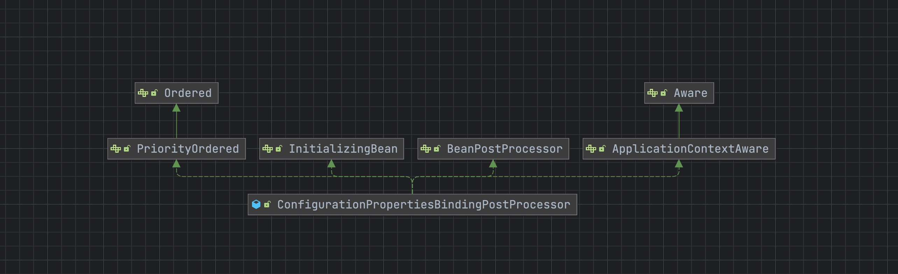

# 配置注入原理

## 一、@EnableConfigurationProperties注解

@EnableConfigurationProperties 注解表示开启一个配置,将制定的配置对象属性跟配置类进行绑定

```java
@Target(ElementType.TYPE)
@Retention(RetentionPolicy.RUNTIME)
@Documented
@Import(EnableConfigurationPropertiesRegistrar.class)
public @interface EnableConfigurationProperties {

	/**
	 * The bean name of the configuration properties validator.
	 * @since 2.2.0
	 */
	String VALIDATOR_BEAN_NAME = "configurationPropertiesValidator";

	/**
	 * Convenient way to quickly register
	 * {@link ConfigurationProperties @ConfigurationProperties} annotated beans with
	 * Spring. Standard Spring Beans will also be scanned regardless of this value.
	 * @return {@code @ConfigurationProperties} annotated beans to register
	 */
	Class<?>[] value() default {};

}
```

## 二、EnableConfigurationPropertiesRegistrar

```java
@Import(EnableConfigurationPropertiesRegistrar.class)
```

配置的处理器注册类,会将对应的配置类注入到spring的容器当中等待后续的处理器进行属性的绑定

```java
class EnableConfigurationPropertiesRegistrar implements ImportBeanDefinitionRegistrar {

	@Override
	public void registerBeanDefinitions(AnnotationMetadata metadata, BeanDefinitionRegistry registry) {
		/**
		 * 注入：
		 * ConfigurationPropertiesBindingPostProcessor（其中又注入一下两个bean）
		 * 		ConfigurationPropertiesBinder.Factory
		 * 		ConfigurationPropertiesBinder  用于进行配置绑定的类
		 *
		 * BoundConfigurationProperties：用来记录配置名称与配置信息的映射类
		 *
		 * ConfigurationBeanFactoryMetadata：用于获取配置类中的工厂方法，主要是处理 bean是否通过 @Bean的工厂方法进行配置注入的
		 */
		registerInfrastructureBeans(registry);
		ConfigurationPropertiesBeanRegistrar beanRegistrar = new ConfigurationPropertiesBeanRegistrar(registry);
		//读取出 EnableConfigurationProperties 注解中指定的配置类并且将其注入到spring容器当中
		getTypes(metadata).forEach(beanRegistrar::register);
	}

	/**
	 * 获取到注解中
	 *
	 * @param metadata
	 * @return
	 */
	private Set<Class<?>> getTypes(AnnotationMetadata metadata) {
		return metadata.getAnnotations().stream(EnableConfigurationProperties.class)
				.flatMap((annotation) -> Arrays.stream(annotation.getClassArray(MergedAnnotation.VALUE)))
				.filter((type) -> void.class != type).collect(Collectors.toSet());
	}

	@SuppressWarnings("deprecation")
	static void registerInfrastructureBeans(BeanDefinitionRegistry registry) {
		//向容器中注入 ConfigurationPropertiesBindingPostProcessor
		ConfigurationPropertiesBindingPostProcessor.register(registry);
		//注入 BoundConfigurationProperties
		BoundConfigurationProperties.register(registry);
		//注入 ConfigurationBeanFactoryMetadata
		ConfigurationBeanFactoryMetadata.register(registry);
	}

}
```

## 三、ConfigurationPropertiesBindingPostProcessor

配置对象的处理器,实现了 **BeanPostProcessor** 接口,在bean创建前后会进行执行



### 1. postProcessBeforeInitialization()

当前处理器实现了初始化对象执行前的方法会进行数据的绑定

```java
@Override
public Object postProcessBeforeInitialization(Object bean, String beanName) throws BeansException {
  bind(ConfigurationPropertiesBean.get(this.applicationContext, bean, beanName));
  return bean;
}
```

### 2. ConfigurationPropertiesBean

ConfigurationPropertiesBean对象会将需要绑定的对象进行包装,其中包含了需要处理的注解、类型的描述等

```java
public static ConfigurationPropertiesBean get(ApplicationContext applicationContext, Object bean, String beanName) {
  //查找工厂方法，可能是通过自动配置类进行注入的配置
  Method factoryMethod = findFactoryMethod(applicationContext, beanName);
  //对其进行包装成 ConfigurationPropertiesBean，会处理 ConfigurationProperties 注解
  return create(beanName, bean, bean.getClass(), factoryMethod);
}

private static ConfigurationPropertiesBean create(String name, Object instance, Class<?> type, Method factory) {
		//通过类、方法查找 ConfigurationProperties 注解用于进行配置
		ConfigurationProperties annotation = findAnnotation(instance, type, factory, ConfigurationProperties.class);
		if (annotation == null) {
			return null;
		}
		//获取到 Validated 注解进行处理
		Validated validated = findAnnotation(instance, type, factory, Validated.class);
		Annotation[] annotations = (validated != null) ? new Annotation[] { annotation, validated }
				: new Annotation[] { annotation };
		//根据是工厂方法还是类型进行类型的解析，如果是工厂方法直接解析返回值，如果是class类型直接解析类型
		ResolvableType bindType = (factory != null) ? ResolvableType.forMethodReturnType(factory)
				: ResolvableType.forClass(type);
		//根据类型和注解进行绑定
		Bindable<Object> bindTarget = Bindable.of(bindType).withAnnotations(annotations);
		if (instance != null) {
			bindTarget = bindTarget.withExistingValue(instance);
		}
		return new ConfigurationPropertiesBean(name, instance, annotation, bindTarget);
	}
```

### 3. bind()

```java
private void bind(ConfigurationPropertiesBean bean) {
  //判断是否为空,并且是否已经被绑定数据了
		if (bean == null || hasBoundValueObject(bean.getName())) {
			return;
		}
		try {
			//通过注解的前缀进行数据与处理器的绑定，获取获取到 ConfigurationProperties的 prex
			this.binder.bind(bean);
		}
		catch (Exception ex) {
			throw new ConfigurationPropertiesBindException(bean, ex);
		}
	}
```

## 四、ConfigurationPropertiesBinder

ConfigurationPropertiesBinder 是配置对象核心的绑定器,会优先去spring容器中进行获取,也就是在 **EnableConfigurationPropertiesRegistrar** 中进行注入的

### 1. bind()

这里进行绑定器的获取总共用到了4个包装器

- BoundConfigurationProperties:默认执行配置的类

- IgnoreTopLevelConverterNotFoundBindHandler:默认的处理器
- IgnoreErrorsBindHandler:忽略绑定错误的处理器
- NoUnboundElementsBindHandler:不要忽略未知字段的处理器
- ValidationBindHandler: Validator字段验证器的列表不为空的包装器

```java
BindResult<?> bind(ConfigurationPropertiesBean propertiesBean) {
  //获取到配置对象的描述信息
  Bindable<?> target = propertiesBean.asBindTarget();
  //获取到配置注解
  ConfigurationProperties annotation = propertiesBean.getAnnotation();
  BindHandler bindHandler = getBindHandler(target, annotation);
  // getBinder() 获取到 Binder 对象，其中会包含环境的配置信息
  return getBinder().bind(annotation.prefix(), target, bindHandler);
}


/**
	 * 获取到配置绑定到处理器
	 * 1. 第一步获取容器中配置到 BoundConfigurationProperties，被包装成了 IgnoreTopLevelConverterNotFoundBindHandler
	 * 2. 如果需要忽略异常字段，那么将上面的 IgnoreTopLevelConverterNotFoundBindHandler 包装成 IgnoreErrorsBindHandler
	 * 3. 如果不需要忽略未知的字段 那么在将上面的 IgnoreErrorsBindHandler 进行包装为 NoUnboundElementsBindHandler
	 * 4. 如果验证器列表不为空，那么在包装为 ValidationBindHandler
	 *
	 * @param <T>        parameter
	 * @param target     target
	 * @param annotation annotation
	 * @return the bind handler
	 * @since y.y.y
	 */
private <T> BindHandler getBindHandler(Bindable<T> target, ConfigurationProperties annotation) {
		/**
		 * 配置到 Validated 注解到字段，构建验证器列表
		 * 1. 先从spring中获取到名称为configurationPropertiesValidator并且类型为 Validator 到bean
		 * 2. 然后判断是否引入了 jsr303 到依赖，并且注入 ConfigurationPropertiesJsr303Validator
		 * 3. 然后在判断当前类是否实现了 Validator
		 */
		List<Validator> validators = getValidators(target);
		//将配置的 BoundConfigurationProperties bean对象包装成 IgnoreTopLevelConverterNotFoundBindHandler
		BindHandler handler = getHandler();
		//判断是否忽略异常到字段
		if (annotation.ignoreInvalidFields()) {
			handler = new IgnoreErrorsBindHandler(handler);
		}
		//是否不需要忽略未知到字段
		if (!annotation.ignoreUnknownFields()) {
			UnboundElementsSourceFilter filter = new UnboundElementsSourceFilter();
			handler = new NoUnboundElementsBindHandler(handler, filter);
		}
		//验证器是否为空
		if (!validators.isEmpty()) {
			handler = new ValidationBindHandler(handler, validators.toArray(new Validator[0]));
		}
		//执行容器中实现了 ConfigurationPropertiesBindHandlerAdvisor 的类
		for (ConfigurationPropertiesBindHandlerAdvisor advisor : getBindHandlerAdvisors()) {
			handler = advisor.apply(handler);
		}
		return handler;
	}

/**
	 * Binder 转换器，需要的参数
	 * Iterable<ConfigurationPropertySource>：容器中的配置属性类
	 * PropertySourcesPlaceholdersResolver：解析占位符
	 * ConversionService：属性转换器
	 * PropertyEditorRegistry：自定义的属性转换器
	 * defaultBindHandler：默认绑定器是空，执行的时候外部传递进去
	 * ConfigurationPropertiesBindConstructorProvider：构造函数绑定器
	 *
	 * @return the binder
	 * @since y.y.y
	 */
private Binder getBinder() {
		if (this.binder == null) {
			this.binder = new Binder(getConfigurationPropertySources(), getPropertySourcesPlaceholdersResolver(),
					getConversionService(), getPropertyEditorInitializer(), null,
					ConfigurationPropertiesBindConstructorProvider.INSTANCE);
		}
		return this.binder;
	}
```

## 五、Binder

执行的绑定器,其中比较核心的属性

```java
/**
 * 数据配置
 */
private final Iterable<ConfigurationPropertySource> sources;

/**
 * 占位符解析器
 */
private final PlaceholdersResolver placeholdersResolver;

/**
 * 数据转换器
 */
private final ConversionService conversionService;

/**
 * 自定义配置转换器的初始化起
 */
private final Consumer<PropertyEditorRegistry> propertyEditorInitializer;

/**
 * 默认的处理器
 */
private final BindHandler defaultBindHandler;

/**
 * 数据对象的绑定器，用于绑定数据
 */
private final List<DataObjectBinder> dataObjectBinders;
```

