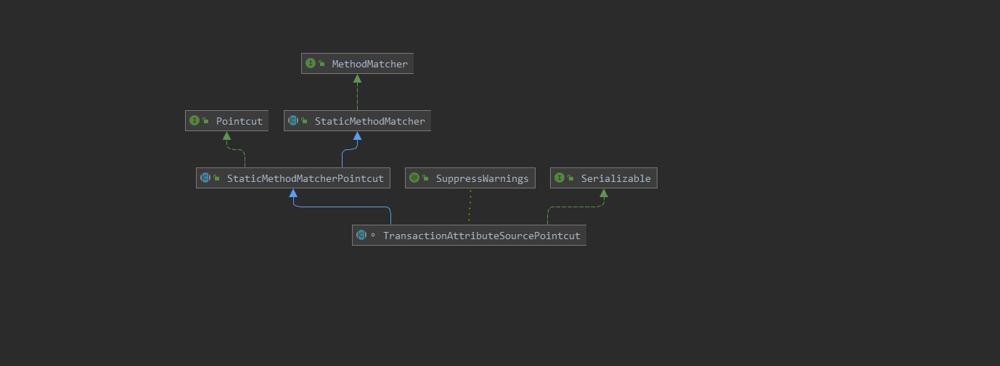
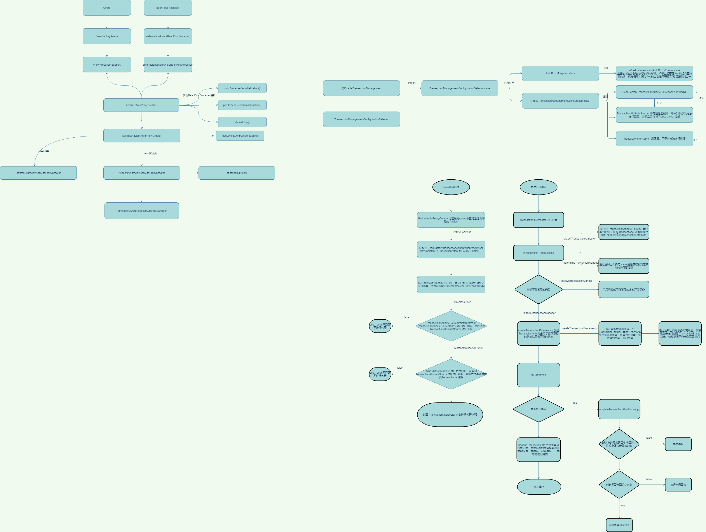

# 一、spring事务源码

## 1. 注解

```java
@Target(ElementType.TYPE)
@Retention(RetentionPolicy.RUNTIME)
@Documented
@Import(TransactionManagementConfigurationSelector.class)
public @interface EnableTransactionManagement {

	/**
	 * 是否采用CGLIB进行代理
	 */
	boolean proxyTargetClass() default false;

	/**
	 * 代理模型使用JDK作为通知模型
	 */
	AdviceMode mode() default AdviceMode.PROXY;

	/**
	 * 优先级
	 */
	int order() default Ordered.LOWEST_PRECEDENCE;

}
```

## 2. 注册类

### 2.1 selectImports()

**TransactionManagementConfigurationSelector** : 导入自动代理的配置对象，会注入 **org.springframework.aop.config.internalAutoProxyCreator** 处理器到容器中，如果已经存在则会根据下面的优先级进行设置

```java
public class TransactionManagementConfigurationSelector extends AdviceModeImportSelector<EnableTransactionManagement> {

	/**
	 * 根据通知模型返回对应的代理配置类
	 */
	@Override
	protected String[] selectImports(AdviceMode adviceMode) {
		switch (adviceMode) {
			case PROXY:
                //注册自动代理的扫描类
				return new String[] {AutoProxyRegistrar.class.getName(),
                                     //注入事务代理配置对象
						ProxyTransactionManagementConfiguration.class.getName()};
			case ASPECTJ:
                //返回 Aspectj代理对象方式
				return new String[] {determineTransactionAspectClass()};
			default:
				return null;
		}
	}

	private String determineTransactionAspectClass() {
		return (ClassUtils.isPresent("javax.transaction.Transactional", getClass().getClassLoader()) ?
				TransactionManagementConfigUtils.JTA_TRANSACTION_ASPECT_CONFIGURATION_CLASS_NAME :
				TransactionManagementConfigUtils.TRANSACTION_ASPECT_CONFIGURATION_CLASS_NAME);
	}

}
```

### 2.2 registerOrEscalateApcAsRequired()

注入事务创建器，如果已经存在了代理创建器的话，会根据优先级进行注入；

```java
private static BeanDefinition registerOrEscalateApcAsRequired(
			Class<?> cls, BeanDefinitionRegistry registry, @Nullable Object source) {

		Assert.notNull(registry, "BeanDefinitionRegistry must not be null");
		//首先判断是否有 org.springframework.aop.config.internalAutoProxyCreator bean
		if (registry.containsBeanDefinition(AUTO_PROXY_CREATOR_BEAN_NAME)) {
			//获取到 org.springframework.aop.config.internalAutoProxyCreator
			BeanDefinition apcDefinition = registry.getBeanDefinition(AUTO_PROXY_CREATOR_BEAN_NAME);
			//判断类型是否跟当前注册的一样，如果不一样需要根据优先级进行设置
			if (!cls.getName().equals(apcDefinition.getBeanClassName())) {
				/**
				 * 设置优先级，通过注解注入切面器的优先级最高,事务优先级最低，aop切面的最高
				 * InfrastructureAdvisorAutoProxyCreator
				 * AspectJAwareAdvisorAutoProxyCreator
				 * AnnotationAwareAspectJAutoProxyCreator
				 */
				int currentPriority = findPriorityForClass(apcDefinition.getBeanClassName());
				int requiredPriority = findPriorityForClass(cls);
				if (currentPriority < requiredPriority) {
					apcDefinition.setBeanClassName(cls.getName());
				}
			}
			return null;
		}
		//创建bean定义注册到容器中
		RootBeanDefinition beanDefinition = new RootBeanDefinition(cls);
		beanDefinition.setSource(source);
		beanDefinition.getPropertyValues().add("order", Ordered.HIGHEST_PRECEDENCE);
		beanDefinition.setRole(BeanDefinition.ROLE_INFRASTRUCTURE);
		registry.registerBeanDefinition(AUTO_PROXY_CREATOR_BEAN_NAME, beanDefinition);
		return beanDefinition;
	}
```





## 3. 配置类

**ProxyTransactionManagementConfiguration** 

```java
@Configuration(proxyBeanMethods = false)
@Role(BeanDefinition.ROLE_INFRASTRUCTURE)
public class ProxyTransactionManagementConfiguration extends AbstractTransactionManagementConfiguration {

	/**
	 * 创建增强器
	 */
	@Bean(name = TransactionManagementConfigUtils.TRANSACTION_ADVISOR_BEAN_NAME)
	@Role(BeanDefinition.ROLE_INFRASTRUCTURE)
	public BeanFactoryTransactionAttributeSourceAdvisor transactionAdvisor(
			TransactionAttributeSource transactionAttributeSource, TransactionInterceptor transactionInterceptor) {

		BeanFactoryTransactionAttributeSourceAdvisor advisor = new BeanFactoryTransactionAttributeSourceAdvisor();
		advisor.setTransactionAttributeSource(transactionAttributeSource);
		advisor.setAdvice(transactionInterceptor);
		if (this.enableTx != null) {
			advisor.setOrder(this.enableTx.<Integer>getNumber("order"));
		}
		return advisor;
	}

	/**
	 * 创建直接属性资源对象，其中主要的目的就是用于 Pointcut用来匹配方法注解
	 * 其中注解的匹配会根据依赖路径下面是否包含 javax.transaction.Transactional， javax.ejb.TransactionAttribute 来创建注解解析器
	 * 默认支持 SpringTransactionAnnotationParser解析器，用于匹配spring中的 @Transactional
	 * SpringTransactionAnnotationParser、JtaTransactionAnnotationParser、Ejb3TransactionAnnotationParser
	 */
	@Bean
	@Role(BeanDefinition.ROLE_INFRASTRUCTURE)
	public TransactionAttributeSource transactionAttributeSource() {
		return new AnnotationTransactionAttributeSource();
	}

	/**
	 * 创建一个事务拦截器（Advice）
	 * @param transactionAttributeSource
	 * @return
	 */
	@Bean
	@Role(BeanDefinition.ROLE_INFRASTRUCTURE)
	public TransactionInterceptor transactionInterceptor(TransactionAttributeSource transactionAttributeSource) {
		TransactionInterceptor interceptor = new TransactionInterceptor();
		interceptor.setTransactionAttributeSource(transactionAttributeSource);
		if (this.txManager != null) {
			//设置事务管理器
			interceptor.setTransactionManager(this.txManager);
		}
		return interceptor;
	}

}
```

当前抽象类实现了接口 **ImportAware** 这个接口会在 **ConfigurationClassPostProcessor** 中注入一个名称 **ConfigurationClassPostProcessor.class.getName() + ".importRegistry";** 注册工厂，会返回 **ConfigurationClassPostProcessor** 对象中的 **importStack** 属性，当前属性用于记录当前类是由谁进行导入的;

```java
@Configuration
public abstract class AbstractTransactionManagementConfiguration implements ImportAware {

	@Nullable
	protected AnnotationAttributes enableTx;

	@Nullable
	protected TransactionManager txManager;


	/**
	 * 在 ConfigurationClassPostProcessor 中会注入一个 ImportAwareBeanPostProcessor 在bean创建完之后会处理 ImportAware的注解
	 * 获取到当前bean对象是由谁进行注入的元数据
	 */
	@Override
	public void setImportMetadata(AnnotationMetadata importMetadata) {
		this.enableTx = AnnotationAttributes.fromMap(
				importMetadata.getAnnotationAttributes(EnableTransactionManagement.class.getName()));
		if (this.enableTx == null) {
			throw new IllegalArgumentException(
					"@EnableTransactionManagement is not present on importing class " + importMetadata.getClassName());
		}
	}

	/**
	 * 自动注入容器中 实现了 TransactionManagementConfigurer 可以用于获取事务管理器
	 */
	@Autowired(required = false)
	void setConfigurers(Collection<TransactionManagementConfigurer> configurers) {
		if (CollectionUtils.isEmpty(configurers)) {
			return;
		}
		if (configurers.size() > 1) {
			throw new IllegalStateException("Only one TransactionManagementConfigurer may exist");
		}
		TransactionManagementConfigurer configurer = configurers.iterator().next();
		this.txManager = configurer.annotationDrivenTransactionManager();
	}


	/**
	 * 设置事务事件工厂，默认支持 TransactionalEventListener 注解的方法
	 * @return
	 */
	@Bean(name = TransactionManagementConfigUtils.TRANSACTIONAL_EVENT_LISTENER_FACTORY_BEAN_NAME)
	@Role(BeanDefinition.ROLE_INFRASTRUCTURE)
	public static TransactionalEventListenerFactory transactionalEventListenerFactory() {
		return new TransactionalEventListenerFactory();
	}

}
```


## 4. Advisor

上面的配置类可以看到spring注入了一个 **BeanFactoryTransactionAttributeSourceAdvisor** 增强器，当前增强器中返回的比较重要的属性：

- advice： TransactionInterceptor；用于方法拦截的通知
- transactionAttributeSource：TransactionAttributeSource；用于匹配方法中是否有 @Transactional
- pointcut：TransactionAttributeSourcePointcut；抽象类，复写了getTransactionAttributeSource() 方法，并且返回 transactionAttributeSource属性

在aop的源码中我们看到，在spring找出所有 **Advisor** 之后会调用其中 **Pointcut** 里面的 **classFilter** 属性进行匹配，然后再调用 **methodMatcher** 进行方法匹配。

spring先匹配类，创建**Pointcut** 时，默认创建了 **TransactionAttributeSourceClassFilter** 类型的过滤器；可以看到该类型是一个内部类，先匹配是否是一些基础类型，然后再通过上面复写的方法获取到 **transactionAttributeSource** 来进行匹配，配置类中注入的类型是 **AnnotationTransactionAttributeSource**

```java
abstract class TransactionAttributeSourcePointcut extends StaticMethodMatcherPointcut implements Serializable {

	protected TransactionAttributeSourcePointcut() {
		setClassFilter(new TransactionAttributeSourceClassFilter());
	}
}

-------------------------------------分割线--------------------------------------
    /**
     * 通过Pointcut调用classFilter进行匹配时调用
     */
    private class TransactionAttributeSourceClassFilter implements ClassFilter {

        @Override
        public boolean matches(Class<?> clazz) {
            if (TransactionalProxy.class.isAssignableFrom(clazz) ||
                TransactionManager.class.isAssignableFrom(clazz) ||
                PersistenceExceptionTranslator.class.isAssignableFrom(clazz)) {
                return false;
            }
            //获取到 transactionAttributeSource，由于上面已经复写了
            TransactionAttributeSource tas = getTransactionAttributeSource();
            return (tas == null || tas.isCandidateClass(clazz));
        }
    }
    /**
     * org.springframework.transaction.annotation.AnnotationTransactionAttributeSource#isCandidateClass
     * 其中遍历的 annotationParsers 是默认创建的注解解析器
     * 默认会构建：SpringTransactionAnnotationParser
     */
    public boolean isCandidateClass(Class<?> targetClass) {
		for (TransactionAnnotationParser parser : this.annotationParsers) {
            //当前判断的方法通过 AnnotationUtils.isCandidateClass(targetClass, Transactional.class); 进行匹配，只判断了一下注解类型和目标class的前缀，就返回了true
			if (parser.isCandidateClass(targetClass)) {
				return true;
			}
		}
		return false;
	}
```


看上面的依赖图能够发现 **TransactionAttributeSourcePointcut** 本身类就实现了 **MethodMatcher** 类型，获取方法匹配时默认就会返回本身，所以调用方法匹配时，会调用到自己的 **matches()**

```java
abstract class TransactionAttributeSourcePointcut extends StaticMethodMatcherPointcut implements Serializable {

	@Override
	public boolean matches(Method method, Class<?> targetClass) {
		TransactionAttributeSource tas = getTransactionAttributeSource();
        // 调用AnnotationTransactionAttributeSource中的 getTransactionAttribute();但是 tas中并没有这个方法，当前方法在父类中 AbstractFallbackTransactionAttributeSource
		return (tas == null || tas.getTransactionAttribute(method, targetClass) != null);
	}
}
```


```java
public TransactionAttribute getTransactionAttribute(Method method, @Nullable Class<?> targetClass) {
		if (method.getDeclaringClass() == Object.class) {
			return null;
		}
    	//获取方法的缓存key对象
		Object cacheKey = getCacheKey(method, targetClass);
       //缓存中是否存在缓存的对象
		TransactionAttribute cached = this.attributeCache.get(cacheKey);
		if (cached != null) {
            //获取到缓存后查看是否是默认的类型
			if (cached == NULL_TRANSACTION_ATTRIBUTE) {
				return null;
			}
			else {
				return cached;
			}
		}
		else {
            //这里会通过方法去解析注解上面是否有 @Transactional 注解，并且把注解解析成 RuleBasedTransactionAttribute 对象进行返回
			TransactionAttribute txAttr = computeTransactionAttribute(method, targetClass);
			if (txAttr == null) {
				this.attributeCache.put(cacheKey, NULL_TRANSACTION_ATTRIBUTE);
			}
			else {
				String methodIdentification = ClassUtils.getQualifiedMethodName(method, targetClass);
				if (txAttr instanceof DefaultTransactionAttribute) {
					DefaultTransactionAttribute dta = (DefaultTransactionAttribute) txAttr;
					dta.setDescriptor(methodIdentification);
					dta.resolveAttributeStrings(this.embeddedValueResolver);
				}
				if (logger.isTraceEnabled()) {
					logger.trace("Adding transactional method '" + methodIdentification + "' with attribute: " + txAttr);
				}
                //存入缓存中
				this.attributeCache.put(cacheKey, txAttr);
			}
			return txAttr;
		}
	}
```


```java
protected TransactionAttribute computeTransactionAttribute(Method method, @Nullable Class<?> targetClass) {
		if (allowPublicMethodsOnly() && !Modifier.isPublic(method.getModifiers())) {
			return null;
		}
		//这里获取到最原始的方法；会判断方法是否是复写的方法，如果是复写的方法，获取到接口上的方法等。获取到方法后，会将方法进行缓存上
		Method specificMethod = AopUtils.getMostSpecificMethod(method, targetClass);

		//获取到方法中是否具有 @Transactional 注解，如果有注解，将注解中的属性解析成 RuleBasedTransactionAttribute 对象
		TransactionAttribute txAttr = findTransactionAttribute(specificMethod);
		if (txAttr != null) {
			return txAttr;
		}
		//如果方法上面获取不到 @Transactional 会尝试通过类进行获取
		txAttr = findTransactionAttribute(specificMethod.getDeclaringClass());
		if (txAttr != null && ClassUtils.isUserLevelMethod(method)) {
			return txAttr;
		}

		//如果解析出的方法，跟传入的方法不一样，再尝试从原方法中获取
		if (specificMethod != method) {
			txAttr = findTransactionAttribute(method);
			if (txAttr != null) {
				return txAttr;
			}
			//再尝试从原方法定义的class中获取
			txAttr = findTransactionAttribute(method.getDeclaringClass());
			if (txAttr != null && ClassUtils.isUserLevelMethod(method)) {
				return txAttr;
			}
		}

		return null;
	}
```

## 5. Advice

**org.springframework.transaction.interceptor.TransactionInterceptor** : 目标方法拦截器

```java
public Object invoke(MethodInvocation invocation) throws Throwable {
		//计算出目标类
		Class<?> targetClass = (invocation.getThis() != null ? AopUtils.getTargetClass(invocation.getThis()) : null);
		//调用父类 TransactionAspectSupport 中的方法，并且设置一个回调方法，这个回调方法直接调用本体方法
		return invokeWithinTransaction(invocation.getMethod(), targetClass, new CoroutinesInvocationCallback() {
			@Override
			@Nullable
			public Object proceedWithInvocation() throws Throwable {
				return invocation.proceed();
			}
			@Override
			public Object getTarget() {
				return invocation.getThis();
			}
			@Override
			public Object[] getArguments() {
				return invocation.getArguments();
			}
		});
	}
```


### 5.1 invokeWithinTransaction()

```java
protected Object invokeWithinTransaction(Method method, @Nullable Class<?> targetClass,
			final InvocationCallback invocation) throws Throwable {
		TransactionAttributeSource tas = getTransactionAttributeSource();
		//获取根据 @Transactional 注解解析成的 RuleBasedTransactionAttribute 对象，其中指定了事务的一些属性
		final TransactionAttribute txAttr = (tas != null ? tas.getTransactionAttribute(method, targetClass) : null);
		/**
		 * 获取到事务管理器
		 * 1. 优先通过注解 @Transactional 来获取到管理器
		 * 2. 通过设置当前类中 transactionManagerBeanName 属性值获取管理器
		 * 3. 通过获取spring容器中实现了 TransactionManager 接口进行获取，如果获取不到直接抛出异常 NoSuchBeanDefinitionException
		 */
		final TransactionManager tm = determineTransactionManager(txAttr);

		//如果当前的事务管理类型为 ReactiveTransactionManager 执行当前分支，使用响应式事务管理器；只看平常使用的最多的
		if (this.reactiveAdapterRegistry != null && tm instanceof ReactiveTransactionManager) {
			..............
		}

		//强转成 PlatformTransactionManager 类型的事务管理器
		PlatformTransactionManager ptm = asPlatformTransactionManager(tm);
		//获取属性中的 descriptor 属性，默认为null，返回的应该是方法的名称
		final String joinpointIdentification = methodIdentification(method, targetClass, txAttr);

		/**
		 * 比较重要的几个类型
		 * TransactionInfo：最外层包裹的对象，用来整体描述事务的信息，包括了保存老的事务信息，每个方法都会创建一个
		 * 例如：A --> B --> C  三个方法，那么就是 txInfoA中是新的事务，没有老的事务，执行到B 创建一个 txInfoB之后，发现 transactionInfoHolder里面已经有了 就会取出来把 txInfoA保存txInfoB
		 * 当中，C 也是同理；等方法执行完之后，会在 cleanupTransactionInfo(txInfo)中，将老的事务取出来，重新设置到 transactionInfoHolder 当中
		 *
		 * TransactionStatus：事务的状态信息，用于描述事务的回滚点，是否同步，是否提交、是否是新事务等属性
		 * DataSourceTransactionObject：用来保存连接对象，以及创建回滚点（用于嵌套事务）
		 * ConnectHolder：连接持有器
		 */
		if (txAttr == null || !(ptm instanceof CallbackPreferringPlatformTransactionManager)) {
			//主要判断事务管理器是否是 CallbackPreferringPlatformTransactionManager 类型，如果类型是DataSourceTransactionManager 就会走当前分支
			//创建事务信息对象, 其中包含 DefaultTransactionStatus 对象，里面保存了暂停的事务的信息
			TransactionInfo txInfo = createTransactionIfNecessary(ptm, txAttr, joinpointIdentification);

			Object retVal;
			try {
				//执行本体方法
				retVal = invocation.proceedWithInvocation();
			}
			catch (Throwable ex) {
				/**
				 * 抛出异常后会进行回滚，如果是嵌套事务进行执行，那么会根据正在执行事务方法创建一个回滚点，通过回滚点进行回滚
				 * 这里会继续向外层抛出异常，如果上层try catch了异常，那么外层不会回滚事务，如果没有捕获，会继续回滚
				 * 如果A是REQUIRED  B是NESTED
				 * A --> B;   A创建一个新的事务，B创建一个子事务并且创建一个回滚点，B抛出异常了，这里面会根据回滚点进行回滚，继续向外层抛出异常
				 * 			  A如果try catch了就不会执行回滚，反之就执行回滚
				 *
				 * 如果所有的事务方法都是 REQUIRED 等级
				 * A -- > B ; B方法抛出异常，这里面将连接对象中 rollbackOnly 设置为true，然后由 A事务方法来进行所有的数据回滚
				 */
				completeTransactionAfterThrowing(txInfo, ex);
				throw ex;
			}
			finally {
				/**
				 * 清除事务时，需要将老的事务设置到 transactionInfoHolder 当中。如果是新的事务，这里面设置的就是null
				 * 为什么要将老的事务设置到里面呢？
				 * 因为 一个事务方法，可能会调用其他的事务方法，而同一时间 transactionInfoHolder 中只会设置当前正在执行的事务，所以需要将上层的事务设置到当前正在执行里面
				 * 例如：事务A方法 ----> 事务B方法
				 * txInfoA先执行保存到 transactionInfoHolder 中，代表当前正在执行的是事务A
				 * 事务A方法调用了事务B方法，这个时候txInfoB中会保存 txInfoA的信息，然后将 transactionInfoHolder 的信息进行替换为 txInfoB，等到事务B方法执行完之后
				 * 在这里会将 transactionInfoHolder 中替换为 txInfoB里面保存的 txInfoA，想象一下 方法栈的模型，FILO。最后事务提交的肯定是 txInfoA
				 */
				cleanupTransactionInfo(txInfo);
			}

			if (retVal != null && vavrPresent && VavrDelegate.isVavrTry(retVal)) {
				// Set rollback-only in case of Vavr failure matching our rollback rules...
				TransactionStatus status = txInfo.getTransactionStatus();
				if (status != null && txAttr != null) {
					retVal = VavrDelegate.evaluateTryFailure(retVal, txAttr, status);
				}
			}
			//执行事务提交
			commitTransactionAfterReturning(txInfo);
			return retVal;
		}
```

### 5.2 createTransactionIfNecessary()

调用 **AbstractPlatformTransactionManager.getTransaction()** 获取到对应的 **TransactionStatus** 对象

```java
protected TransactionInfo createTransactionIfNecessary(@Nullable PlatformTransactionManager tm,
			@Nullable TransactionAttribute txAttr, final String joinpointIdentification) {
		//如果事务没有指定名称，默认使用方法名作为事事务的名称
		if (txAttr != null && txAttr.getName() == null) {
			//将事务进行包装
			txAttr = new DelegatingTransactionAttribute(txAttr) {
				@Override
				public String getName() {
					return joinpointIdentification;
				}
			};
		}

		TransactionStatus status = null;
		if (txAttr != null) {
			if (tm != null) {
				//通过事务的属性获取到事务状态对象，调用 AbstractPlatformTransactionManager 类中的方法
				status = tm.getTransaction(txAttr);
			}
			else {
				if (logger.isDebugEnabled()) {
					logger.debug("Skipping transactional joinpoint [" + joinpointIdentification +
							"] because no transaction manager has been configured");
				}
			}
		}
		/**
		 * 创建 TransactionInfo 对象，将事务信息进行替换设置到 transactionInfoHolder当中
		 */
		return prepareTransactionInfo(tm, txAttr, joinpointIdentification, status);
	}
```

### 5.3 getTransaction()

- 获取到 transaction，根据实现类进行获取到什么样的对象以 **DataSourceTransactionManager** 事务管理器为例子，返回的对象 **DataSourceTransactionObject** 标记对象是否是新的事务，从连接池中获取到 **ConnectionHolder** 对象，其中保存连接对象是采用 ThreadLocal进行传递，保证同一个线程使用一个连接器，而 ThreadLocal 保存的又是一个Map，以数据源为Key，连接器对象为 value，可以保证同一个线程使用多个数据源的连接器

```java
public final TransactionStatus getTransaction(@Nullable TransactionDefinition definition)
			throws TransactionException {
		//判断事务定义是否为空，如果为空创建一个默认的
		TransactionDefinition def = (definition != null ? definition : TransactionDefinition.withDefaults());

		/**
		 * 创建一个 DataSourceTransactionObject 通过数据源中获取到 ConnectionHolder对象，其中缓存采用的ThreadLocal进行缓存获取到的数据是一个Map key是数据源 value是一个连接持有器
		 * 会通过 TransactionSynchronizationManager获取到当前线程的连接持有器，获取是一个Map，其中key就是采用的数据源，value则是连接持有器，如果当前线程已经开启过事务，那么在
		 * 这个地方就会获取到 ConnectionHolder 对象并且设置到 DataSourceTransactionObject
		 */
		Object transaction = doGetTransaction();
		boolean debugEnabled = logger.isDebugEnabled();
		//这里就会判断当前线程是否已经拿到了连接持有器，并且连接持有器是开启的状态
		if (isExistingTransaction(transaction)) {
			//如果存在事务，需要判断其事务传播等级
			return handleExistingTransaction(def, transaction, debugEnabled);
		}
		//判断事务超时时间是否小于 -1
		if (def.getTimeout() < TransactionDefinition.TIMEOUT_DEFAULT) {
			throw new InvalidTimeoutException("Invalid transaction timeout", def.getTimeout());
		}

		//支持一个已经存在的事务，如果当前没有事务存在，抛出异常
		if (def.getPropagationBehavior() == TransactionDefinition.PROPAGATION_MANDATORY) {
			throw new IllegalTransactionStateException(
					"No existing transaction found for transaction marked with propagation 'mandatory'");
		}
		//根据默认的事务传播机制 PROPAGATION_REQUIRED 如果没有事务则开始一个新的事务
		else if (def.getPropagationBehavior() == TransactionDefinition.PROPAGATION_REQUIRED ||
				def.getPropagationBehavior() == TransactionDefinition.PROPAGATION_REQUIRES_NEW ||
				def.getPropagationBehavior() == TransactionDefinition.PROPAGATION_NESTED) {
			//获取到暂停资源持有器，如果是新创建的事务 这里会返回null
			SuspendedResourcesHolder suspendedResources = suspend(null);
			if (debugEnabled) {
				logger.debug("Creating new transaction with name [" + def.getName() + "]: " + def);
			}
			try {
				return startTransaction(def, transaction, debugEnabled, suspendedResources);
			}
			catch (RuntimeException | Error ex) {
				resume(null, suspendedResources);
				throw ex;
			}
		}
		else {
			if (def.getIsolationLevel() != TransactionDefinition.ISOLATION_DEFAULT && logger.isWarnEnabled()) {
				logger.warn("Custom isolation level specified but no actual transaction initiated; " +
						"isolation level will effectively be ignored: " + def);
			}
			boolean newSynchronization = (getTransactionSynchronization() == SYNCHRONIZATION_ALWAYS);
			return prepareTransactionStatus(def, null, true, newSynchronization, debugEnabled, null);
		}
	}

------------------------------------------------------------------------------------------------------
    @Override
	protected Object doGetTransaction() {
		DataSourceTransactionObject txObject = new DataSourceTransactionObject();
		//设置事务是否允许保存点，默认为true
		txObject.setSavepointAllowed(isNestedTransactionAllowed());
		/**
		 * 获取到数据源对象，将数据源进行缓存
		 * getResource(obtainDataSource()):根据数据源对象去 ThreadLocal<Map<Object, Object>> 获取到对应的 Map 然后根据数据源回去到连接对象
		 */
		ConnectionHolder conHolder =
				(ConnectionHolder) TransactionSynchronizationManager.getResource(obtainDataSource());
		txObject.setConnectionHolder(conHolder, false);
		return txObject;
	}

```

### 5.4 startTransaction()

```java
private TransactionStatus startTransaction(TransactionDefinition definition, Object transaction,
			boolean debugEnabled, @Nullable SuspendedResourcesHolder suspendedResources) {

		boolean newSynchronization = (getTransactionSynchronization() != SYNCHRONIZATION_NEVER);
		//创建新的事务，包含了当前事务的状态，是否可读，是否是新事务
		DefaultTransactionStatus status = newTransactionStatus(
				definition, transaction, true, newSynchronization, debugEnabled, suspendedResources);
		//开始一个新的事务
		doBegin(transaction, definition);
		prepareSynchronization(status, definition);
		return status;
	}
```

### 5.5 doBegin()

获取到连接对象，如果没有则创建一个 **ConnectionHolder** 然后设置到 **DataSourceTransactionObject** 对象中，后续再执行事务方法时，就会将 **DataSourceTransactionObject** 对象中是否为新事务的属性设置为false

```java
protected void doBegin(Object transaction, TransactionDefinition definition) {
		DataSourceTransactionObject txObject = (DataSourceTransactionObject) transaction;
		Connection con = null;

		try {
			//判断是否有连接其持有器（前面创建时通过ThreadLocal获取是为空） 或者连接持有器是否是与事务同步（默认为false）
			if (!txObject.hasConnectionHolder() ||
					txObject.getConnectionHolder().isSynchronizedWithTransaction()) {
				//获取到连接
				Connection newCon = obtainDataSource().getConnection();
				if (logger.isDebugEnabled()) {
					logger.debug("Acquired Connection [" + newCon + "] for JDBC transaction");
				}
				//给当前对象设置上连接持有器，设置连接持有器为true（代表新的连接持有器）
				txObject.setConnectionHolder(new ConnectionHolder(newCon), true);
			}
			//设置与事务同步
			txObject.getConnectionHolder().setSynchronizedWithTransaction(true);
			con = txObject.getConnectionHolder().getConnection();
			//给连接设置是否只读，去给连接对象设置默认的隔离级别
			Integer previousIsolationLevel = DataSourceUtils.prepareConnectionForTransaction(con, definition);
			txObject.setPreviousIsolationLevel(previousIsolationLevel);
			txObject.setReadOnly(definition.isReadOnly());
			//判断是否是自动提交，如果默认为自动提交的话，将自动提交设置为false不需要自动提交
			if (con.getAutoCommit()) {
				txObject.setMustRestoreAutoCommit(true);
				if (logger.isDebugEnabled()) {
					logger.debug("Switching JDBC Connection [" + con + "] to manual commit");
				}
				con.setAutoCommit(false);
			}
			//开启事务连接，如果是只读的话，将当前连接设置为只读模式
			prepareTransactionalConnection(con, definition);
			//获取连接持有器，设置事务为活跃
			txObject.getConnectionHolder().setTransactionActive(true);

			int timeout = determineTimeout(definition);
			if (timeout != TransactionDefinition.TIMEOUT_DEFAULT) {
				txObject.getConnectionHolder().setTimeoutInSeconds(timeout);
			}

			// 判断是否是新的连接持有器，绑定当前连接持有器到当前线程，value是一个Map其中 key对应数据源，value对应当前连接持有器
			if (txObject.isNewConnectionHolder()) {
				TransactionSynchronizationManager.bindResource(obtainDataSource(), txObject.getConnectionHolder());
			}
		}

		catch (Throwable ex) {
			if (txObject.isNewConnectionHolder()) {
				DataSourceUtils.releaseConnection(con, obtainDataSource());
				txObject.setConnectionHolder(null, false);
			}
			throw new CannotCreateTransactionException("Could not open JDBC Connection for transaction", ex);
		}
	}
```

### 5.6 handleExistingTransaction()

方法中会根据注解中的传播机制来进行判断，进入到当前方法中，可以肯定的是已经存在运行中的事务

- PROPAGATION_NEVER：不支持事务运行，抛出异常
- PROPAGATION_NOT_SUPPORTED: 如果存在事务，会将原来已经运行的事务暂停，就是将事务从 **ThreadLocal ** 中移除掉，并且将连接持有器置为空，然后会创建一个空的事务返回出去
- PROPAGATION_REQUIRES_NEW：将存在的事务暂停，通过 **suspend()**，然后调用 **startTransaction() **开启一个新的事务 
- PROPAGATION_NESTED: 创建一个嵌套事务。
  - DefaultTransactionStatus.createAndHoldSavepoint()，会根据当前创建的对象 **transaction (DataSourceTransactionObject)** 创建一个回原点
  - 如果不支持使用嵌套执行，会开启一个新的事务

```java
private TransactionStatus handleExistingTransaction(
			TransactionDefinition definition, Object transaction, boolean debugEnabled)
			throws TransactionException {
		/**
		 * suspend() 方法
		 * 1. 会判断 TransactionSynchronizationManager.isSynchronizationActive() 是否有同步获取的事务在里面，默认在新的开启时会创建一个ArrayList
		 * 		- 如果 synchronizations 不为空会将其中所有的 synchronization 进行停止，就是跟当前线程解绑
		 * 	    - 如果当前创建的事务不为空，也一同会进行暂停
		 * 	    - 		//将当前正在运行的事务名称设置为空
		 * 				TransactionSynchronizationManager.setCurrentTransactionName(null);
		 * 				//设置只读为false
		 * 				TransactionSynchronizationManager.setCurrentTransactionReadOnly(false);
		 * 				//设置当前线程的隔离等级为空
		 * 				TransactionSynchronizationManager.setCurrentTransactionIsolationLevel(null);
		 * 				//设置实际活跃的事务状态为false
		 * 				boolean wasActive = TransactionSynchronizationManager.isActualTransactionActive();
		 * 				TransactionSynchronizationManager.setActualTransactionActive(false);
		 * 		- 然后创建一个资源停止持有器 SuspendedResourcesHolder，包含了所有暂停了的事务
		 */

		//判断事务的传播性，始终以非事务方式执行，但是执行要这个方法里面是存在事务的，抛出异常
		if (definition.getPropagationBehavior() == TransactionDefinition.PROPAGATION_NEVER) {
			throw new IllegalTransactionStateException(
					"Existing transaction found for transaction marked with propagation 'never'");
		}
		//不支持事务执行，并且暂停当前正在执行的事务
		if (definition.getPropagationBehavior() == TransactionDefinition.PROPAGATION_NOT_SUPPORTED) {
			if (debugEnabled) {
				logger.debug("Suspending current transaction");
			}
			Object suspendedResources = suspend(transaction);
			boolean newSynchronization = (getTransactionSynchronization() == SYNCHRONIZATION_ALWAYS);
			//只执行创建事务状态对象，并不开启
			return prepareTransactionStatus(
					definition, null, false, newSynchronization, debugEnabled, suspendedResources);
		}
		//将之前所有的运行或同步的事务都进行暂停，然后创建一个新的事务
		if (definition.getPropagationBehavior() == TransactionDefinition.PROPAGATION_REQUIRES_NEW) {
			if (debugEnabled) {
				logger.debug("Suspending current transaction, creating new transaction with name [" +
						definition.getName() + "]");
			}
			//将前面开启的事务暂停
			SuspendedResourcesHolder suspendedResources = suspend(transaction);
			try {
				//开启新的事务
				return startTransaction(definition, transaction, debugEnabled, suspendedResources);
			}
			catch (RuntimeException | Error beginEx) {
				resumeAfterBeginException(transaction, suspendedResources, beginEx);
				throw beginEx;
			}
		}

		//进行嵌套事务
		if (definition.getPropagationBehavior() == TransactionDefinition.PROPAGATION_NESTED) {
			//是否允许嵌套执行，默认为false，创建时会设置true
			if (!isNestedTransactionAllowed()) {
				throw new NestedTransactionNotSupportedException(
						"Transaction manager does not allow nested transactions by default - " +
						"specify 'nestedTransactionAllowed' property with value 'true'");
			}
			if (debugEnabled) {
				logger.debug("Creating nested transaction with name [" + definition.getName() + "]");
			}
			//使用嵌套端点保存
			if (useSavepointForNestedTransaction()) {
				//创建一个事务状态对象，然后返回出去
				DefaultTransactionStatus status =
						prepareTransactionStatus(definition, transaction, false, false, debugEnabled, null);
				/**
				 * 创建事务回滚点步骤
				 * 使用了 this.transaction 属性，这个对象就是上面创建的 DataSourceTransactionObject 对象，每次创建回滚点就会获取到其中持有的 ConnectionHolder 连接持有器对象
				 * 调用其中的 conHolder.createSavepoint(); 方法，每一个连接持有器都有一个 savepointCounter 属性，每创建一次 +1，设置的回滚点id就为 SAVEPOINT_1 这样的格式
				 * 例如：A --> B --> C
				 * 上面三个方法，
				 * A方法的事务传播等级为 REQUIRED
				 * B方法的事务传播等级为 NESTED 如果有事务进行嵌套执行
				 * C方法的事务传播等级为 NESTED
				 *
				 * A 执行调用了 B方法，那么B方法会获取到连接对象然后将回滚点+1，这个时候id就为 SAVEPOINT_1
				 * B 方法调用了 C方法，那么C方法就会创建一个回滚点+1，这个时候id就为 SAVEPOINT_2
				 * 如果 C方法执行出现了异常，这个时候实际持有的 TransactionInfo 对象呢就是 C方法的，就会判断是否有回滚点，如果有回滚点就会获取到然后直接回滚到对应的点位
				 * C方法执行完之后，会将B方法绑定到 transactionInfoHolder 缓存中，查看是否有异常信息进行抛出，如果有那么按照上面的继续执行
				 */
				status.createAndHoldSavepoint();
				return status;
			}
			else {
				//如果不使用嵌套端点保存，那么直接开启事务
				return startTransaction(definition, transaction, debugEnabled, null);
			}
		}
		if (debugEnabled) {
			logger.debug("Participating in existing transaction");
		}
		//是否验证存在的事务的隔离级别和是否只读，默认false
		if (isValidateExistingTransaction()) {
			if (definition.getIsolationLevel() != TransactionDefinition.ISOLATION_DEFAULT) {
				//获取到事务隔离等级
				Integer currentIsolationLevel = TransactionSynchronizationManager.getCurrentTransactionIsolationLevel();
				if (currentIsolationLevel == null || currentIsolationLevel != definition.getIsolationLevel()) {
					Constants isoConstants = DefaultTransactionDefinition.constants;
					throw new IllegalTransactionStateException("Participating transaction with definition [" +
							definition + "] specifies isolation level which is incompatible with existing transaction: " +
							(currentIsolationLevel != null ?
									isoConstants.toCode(currentIsolationLevel, DefaultTransactionDefinition.PREFIX_ISOLATION) :
									"(unknown)"));
				}
			}
			if (!definition.isReadOnly()) {
				if (TransactionSynchronizationManager.isCurrentTransactionReadOnly()) {
					throw new IllegalTransactionStateException("Participating transaction with definition [" +
							definition + "] is not marked as read-only but existing transaction is");
				}
			}
		}
		//同步的状态，SYNCHRONIZATION_NEVER(2) 从不进行事务同步，SYNCHRONIZATION_ALWAYS(0) 始终进行事务同步，为true始终进行事务同步，每次创建都要设置当前事务到 ThreadLocal中
		boolean newSynchronization = (getTransactionSynchronization() != SYNCHRONIZATION_NEVER);
		//如果执行到这里，准备创建事务状态时，设置是否是新的事务为false，就不会设置到 TransactionSynchronizationManager 当前线程中
		return prepareTransactionStatus(definition, transaction, false, newSynchronization, debugEnabled, null);
	}
```

### 5.7 createAndHoldSavepoint()

嵌套事务会创建一个还原点，这里的 **SavepointManager** 会根据对应的事务管理器创建的对象 **DataSourceTransactionObject**

最后调用到 **org.springframework.jdbc.datasource.JdbcTransactionObjectSupport#createSavepoint** 然后通过连接持有器进行创建回滚点

```java
public void createAndHoldSavepoint() throws TransactionException {
		setSavepoint(getSavepointManager().createSavepoint());
	}

--------------------------------------分割线-----------------------------------
    protected SavepointManager getSavepointManager() {
    //返回创建的事务如果是采用的DataSourceTransactionManager   DataSourceTransactionObject对象
		Object transaction = this.transaction;
		if (!(transaction instanceof SavepointManager)) {
			throw new NestedTransactionNotSupportedException(
					"Transaction object [" + this.transaction + "] does not support savepoints");
		}
		return (SavepointManager) transaction;
	}
--------------------------------------分割线-----------------------------------
    public Object createSavepoint() throws TransactionException {
    //获取到连接器
		ConnectionHolder conHolder = getConnectionHolderForSavepoint();
		try {
			if (!conHolder.supportsSavepoints()) {
				throw new NestedTransactionNotSupportedException(
						"Cannot create a nested transaction because savepoints are not supported by your JDBC driver");
			}
			if (conHolder.isRollbackOnly()) {
				throw new CannotCreateTransactionException(
						"Cannot create savepoint for transaction which is already marked as rollback-only");
			}
            //通过持有器创建一个还原点
			return conHolder.createSavepoint();
		}
		catch (SQLException ex) {
			throw new CannotCreateTransactionException("Could not create JDBC savepoint", ex);
		}
	}
--------------------------------------分割线-----------------------------------
    public Savepoint createSavepoint() throws SQLException {
		this.savepointCounter++;
		return getConnection().setSavepoint(SAVEPOINT_NAME_PREFIX + this.savepointCounter);
	}
```


以上所有的方法是在执行本体方法之前，根据事务注解的属性进行创建事务会封装成 **TransactionInfo** 对象其中保存了 **TransactionStatus**、**DataSourceTransactionObject** 等属性通过 **transactionInfoHolder** 来跟当前线程进行绑定，如果遇见事务方法调用事务方法，那么会在 **TransactionInfo** 设置上 **oldTransactionInfo** 属性（上一个事务方法的状态信息）；后续来看如何进行回滚

### 5.8 completeTransactionAfterThrowing()

在执行方法之后抛出异常信息后需要执行的逻辑：

- 会根据注解中配置的异常类来进行拦截并且决定是否需要回滚
- 如果不支持抛出异常类型的回滚，那么会执行进行事务的提交

```java
protected void completeTransactionAfterThrowing(@Nullable TransactionInfo txInfo, Throwable ex) {
		if (txInfo != null && txInfo.getTransactionStatus() != null) {
			if (logger.isTraceEnabled()) {
				logger.trace("Completing transaction for [" + txInfo.getJoinpointIdentification() +
						"] after exception: " + ex);
			}
			//判断当前异常是否可以支持回滚，将注解中的异常信息属性用来进行比对，这里就是为什么如果不指定异常抛出异常后也不会回滚的原因
			if (txInfo.transactionAttribute != null && txInfo.transactionAttribute.rollbackOn(ex)) {
				try {
					//获取到事务的状态进行回滚
					txInfo.getTransactionManager().rollback(txInfo.getTransactionStatus());
				}
				catch (TransactionSystemException ex2) {
					logger.error("Application exception overridden by rollback exception", ex);
					ex2.initApplicationException(ex);
					throw ex2;
				}
				catch (RuntimeException | Error ex2) {
					logger.error("Application exception overridden by rollback exception", ex);
					throw ex2;
				}
			}
			else {
				try {
					//如果异常信息不支持，那么会判断 rollbackOnly 是否需要回滚，如果为false就不会进行回滚，会直接进行提交
					txInfo.getTransactionManager().commit(txInfo.getTransactionStatus());
				}
				catch (TransactionSystemException ex2) {
					logger.error("Application exception overridden by commit exception", ex);
					ex2.initApplicationException(ex);
					throw ex2;
				}
				catch (RuntimeException | Error ex2) {
					logger.error("Application exception overridden by commit exception", ex);
					throw ex2;
				}
			}
		}
	}
```

### 5.9 rollback()

回滚函数，通过前面注解标记的传播机制，如果是嵌套事务，那么会给每一个事务方法创建一个 **Savepoint** 回滚点对象，后续回滚时通过回滚点对象可以回滚到对应的地方

```java
public final void rollback(TransactionStatus status) throws TransactionException {
		if (status.isCompleted()) {
			throw new IllegalTransactionStateException(
					"Transaction is already completed - do not call commit or rollback more than once per transaction");
		}
		DefaultTransactionStatus defStatus = (DefaultTransactionStatus) status;
		processRollback(defStatus, false);
	}
```

```java
private void processRollback(DefaultTransactionStatus status, boolean unexpected) {
		try {
			boolean unexpectedRollback = unexpected;

			try {//调用所有同步中的事务 beforeCompletion 方法，只有在为新的同步事务，才会执行
				triggerBeforeCompletion(status);
				//判断是否有回滚点，如果有回滚点，则只需要回滚到对应的回滚点
				if (status.hasSavepoint()) {
					if (status.isDebug()) {
						logger.debug("Rolling back transaction to savepoint");
					}
                    /**
					 * 回滚到对应的回滚点
					 * 这里通过 status对象获取到前面嵌套事务创建的回滚点进行回滚，数据源实现不一样，这里的回滚点的创建也不一样
					 * 例如：SingleConnectionDataSource 数据源返回的连接对象就是 ConnectImpl，通过ConnectImpl会创建一个 MysqlSavepoint 对象（每一个事务方法都会创建一个单独的回滚点对象）
					 * 回滚完成之后就会清空回滚点对象
					 * 注一点的是，回滚的实现方式，需要通过数据源里面的连接对象进行实现
					 */
					status.rollbackToHeldSavepoint();
				}
				else if (status.isNewTransaction()) {
					if (status.isDebug()) {
						logger.debug("Initiating transaction rollback");
					}
                    //如果是新事务，那么直接回滚
					doRollback(status);
				}
				else {
					if (status.hasTransaction()) {
						if (status.isLocalRollbackOnly() || isGlobalRollbackOnParticipationFailure()) {
							if (status.isDebug()) {
								logger.debug("Participating transaction failed - marking existing transaction as rollback-only");
							}
                            //设置当前事务为回滚
							doSetRollbackOnly(status);
						}
						else {
							if (status.isDebug()) {
								logger.debug("Participating transaction failed - letting transaction originator decide on rollback");
							}
						}
					}
					else {
						logger.debug("Should roll back transaction but cannot - no transaction available");
					}
					// Unexpected rollback only matters here if we're asked to fail early
					if (!isFailEarlyOnGlobalRollbackOnly()) {
						unexpectedRollback = false;
					}
				}
			}
			catch (RuntimeException | Error ex) {
				triggerAfterCompletion(status, TransactionSynchronization.STATUS_UNKNOWN);
				throw ex;
			}
			//触发后续回滚后的钩子函数
			triggerAfterCompletion(status, TransactionSynchronization.STATUS_ROLLED_BACK);

			if (unexpectedRollback) {
				throw new UnexpectedRollbackException(
						"Transaction rolled back because it has been marked as rollback-only");
			}
		}
		finally {
			cleanupAfterCompletion(status);
		}
	}
```

### 5.10 commit()

```java
protected void commitTransactionAfterReturning(@Nullable TransactionInfo txInfo) {
		if (txInfo != null && txInfo.getTransactionStatus() != null) {
			if (logger.isTraceEnabled()) {
				logger.trace("Completing transaction for [" + txInfo.getJoinpointIdentification() + "]");
			}
            //获取到事务管理器，提交事务
			txInfo.getTransactionManager().commit(txInfo.getTransactionStatus());
		}
	}
```

## 6. 流程图




# 二、实践

## 1. 多数据源

在上面看了源码之后，我们会发现spring是如何去获取到对应的数据源的，通过获取到数据源，我们可以实现一个多数据源切换的 **DataSource** 类，下面的代码中我们在spring容器中指定了事务管理器，以及数据源，这是操作数据库中必须配置的

```java
public class TransactionalConfig {

	@Bean
	public PlatformTransactionManager platformTransactionManager(DataSource dataSource) {
		return new DataSourceTransactionManager(dataSource);
	}

	@Bean
	public DataSource dataSource() {
		SingleConnectionDataSource dataSource = new SingleConnectionDataSource();
		dataSource.setUrl("jdbc:mysql:///order?useUnicode=true&characterEncoding=UTF-8&useSSL=false&serverTimezone=Asia" +
						  "/Shanghai&useAffectedRows=true");
		dataSource.setUsername("root");
		dataSource.setDriverClassName("com.mysql.jdbc.Driver");
		dataSource.setPassword("root");
		return dataSource;
	}
}
```

下面就是在spring开启事务的时候，需要从数据源中获取到连接，那么我们就可以自定义数据源的获取方式

```java
protected void doBegin(Object transaction, TransactionDefinition definition) {
		DataSourceTransactionObject txObject = (DataSourceTransactionObject) transaction;
		Connection con = null;

		try {
			//判断是否有连接其持有器（前面创建时通过ThreadLocal获取是为空） 或者连接持有器是否是与事务同步（默认为false）
			if (!txObject.hasConnectionHolder() ||
					txObject.getConnectionHolder().isSynchronizedWithTransaction()) {
				//获取到连接
				Connection newCon = obtainDataSource().getConnection();
				//给当前对象设置上连接持有器，设置连接持有器为true（代表新的连接持有器）
				txObject.setConnectionHolder(new ConnectionHolder(newCon), true);
			}
			.......省略
		}
	}
```

spring给我们提供了可变的数据源实现，查看一下里面的源码就会发现

```java
public class MultiDataSource extends AbstractRoutingDataSource {

    /**
     * 获取到指定的数据源
     * @return
     */
    @Override
    protected Object determineCurrentLookupKey() {
        //这个key可以由前面对接口进行aop代理，然后通过不同的接口获取到不同的数据源key
        return MultiDataSourceHolder.getDataSourceKey();
    }
}
```

**AbstractRoutingDataSource** 类就对 **getConnection()** 方法进行了复写，这样就可以对多数据源进行切换

```java
public Connection getConnection() throws SQLException {
        return this.determineTargetDataSource().getConnection();
    }

protected DataSource determineTargetDataSource() {
        Assert.notNull(this.resolvedDataSources, "DataSource router not initialized");
    //通过子类进行实现获取到需要的key
        Object lookupKey = this.determineCurrentLookupKey();
    //从map中获取到数据源
        DataSource dataSource = (DataSource)this.resolvedDataSources.get(lookupKey);
        if (dataSource == null && (this.lenientFallback || lookupKey == null)) {
            dataSource = this.resolvedDefaultDataSource;
        }

        if (dataSource == null) {
            throw new IllegalStateException("Cannot determine target DataSource for lookup key [" + lookupKey + "]");
        } else {
            return dataSource;
        }
    }
```

## 2. 跨线程事务（暂定）

由于事务中采用的是 **ThreadLocal<Map<Object, Object>>** 进行连接的保存，而事务开启也是在 **Connection** 对象上面开启事务，如果涉及到多线程那么就获取不到一开始的连接对象；下面的方式比较繁琐，等后续会对其进行组件封装

```java
public int insert(Pep record) {
        //测试异步线程提交事务是否会回滚
        System.out.println("插入主表信息:"+record.toString());
        Sallery sallery = new Sallery();
        sallery.setRemarks("备注信息");
        sallery.setSallery(new BigDecimal(2000));
        //手动创建一个事务定义，用于指定事务的传播机制
        DefaultTransactionDefinition defaultTransactionDefinition = new DefaultTransactionDefinition();
        defaultTransactionDefinition.setPropagationBehavior(TransactionDefinition.PROPAGATION_REQUIRED);
        TransactionStatus status = platformTransactionManager.getTransaction(defaultTransactionDefinition);

        AtomicBoolean atomicBoolean = new AtomicBoolean(false);
        //创建2个线程进行处理
        CountDownLatch countDownLatch = new CountDownLatch(2);
        //创建子线程
        Thread thread = new Thread(new ChildrenTask(sallery,atomicBoolean,countDownLatch));
        thread.start();
        //下面是主线程事务的运行
        try {
            if(atomicBoolean.get()){
                System.out.println("子线程出现异常信息，回滚数据");
                throw new RuntimeException();
            }
            pepMapper.insert(record);
            countDownLatch.countDown();
            countDownLatch.await();
            if(atomicBoolean.get()){
                throw new RuntimeException();
            }
            platformTransactionManager.commit(status);
        } catch (Exception e) {
            System.out.println("捕获异常，回滚事务");
            countDownLatch.countDown();
            platformTransactionManager.rollback(status);
        }
        return 1;
    }

public class ChildrenTask implements Runnable {

        private Sallery sallery;
        private AtomicBoolean atomicBoolean;
        private CountDownLatch countDownLatch;
        private DefaultTransactionDefinition transactionDefinition;

        public ChildrenTask(Sallery sallery,AtomicBoolean atomicBoolean,CountDownLatch countDownLatch) {
            this.sallery = sallery;
            this.atomicBoolean = atomicBoolean;
            this.countDownLatch = countDownLatch;
        }

        @Override
        public void run() {
            if(this.atomicBoolean.get()){
                System.out.println("子线程出现异常信息，回滚数据");
                return;
            }
            //子线程创建新的事务，当线程都没问题时，提交事务，其中一个出现问题，全部回滚
            this.transactionDefinition = new DefaultTransactionDefinition();
            this.transactionDefinition.setPropagationBehavior(TransactionDefinition.PROPAGATION_REQUIRES_NEW);
            TransactionStatus status = platformTransactionManager.getTransaction(this.transactionDefinition);
            try {
                salleryMapper.insert(sallery);
                int i = 1 / 0;
                countDownLatch.countDown();
                countDownLatch.await();
                if(this.atomicBoolean.get()){
                   throw new RuntimeException();
                }
                platformTransactionManager.commit(status);
            } catch (Exception e){
                System.out.println("子线程出现异常信息，回滚数据");
                atomicBoolean.set(true);
                countDownLatch.countDown();
                platformTransactionManager.rollback(status);
            }
        }
    }
```

