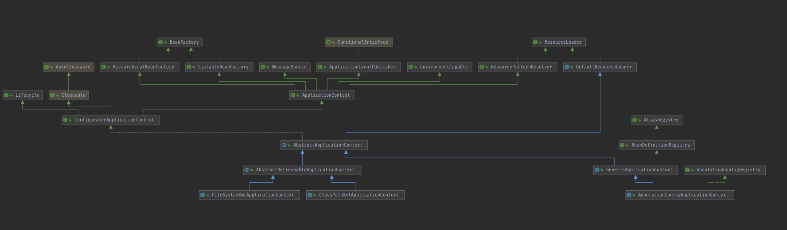
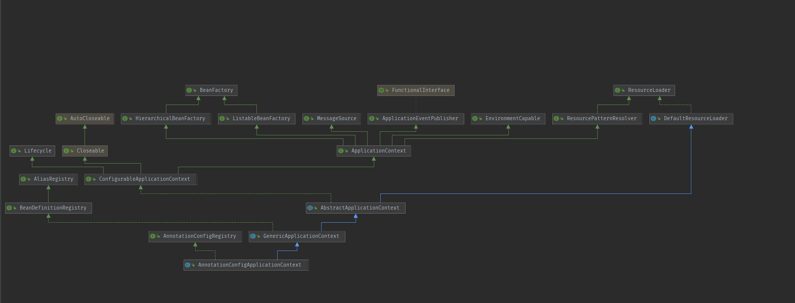
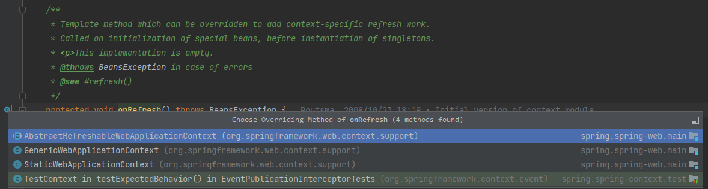
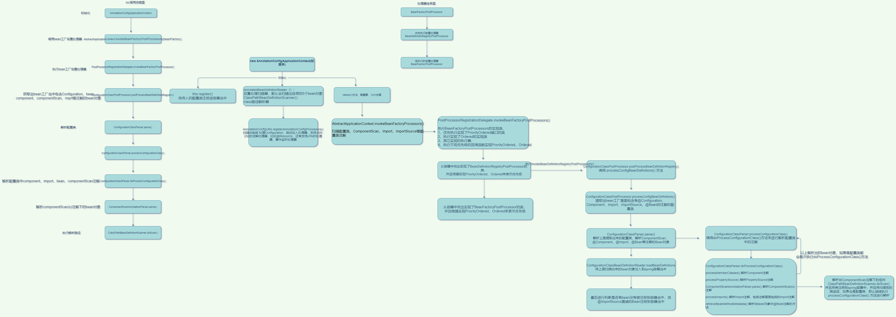
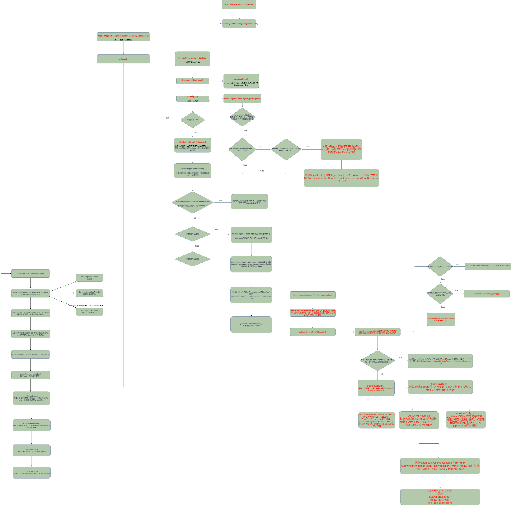

# 一、spring模块

- spring-core
- spring-beans
- spring-context：以core和beans模块为基础构建，提供上下文的构建
- spring-context-support：整合第三方库
- spring-expression：提供表达式支持
- spring-aop：切面模块
- spring-aspects：提供AspetJ的集成
- spring-instrument：类加载器的实现
- spring-instrument-tomcat：模块包含了支持Tomcat的植入代理
- spring-messaging：用于消息转递，类似于基于Spring MVC注释的编程模型
- spring-jdbc：模块提供了一个JDBC –抽象层
- spring-tx：模块支持用于实现特殊接口和所有POJO（普通Java对象）的类的编程和声明式事务 管理
- spring-orm：模块为流行的对象关系映射(object-relational mapping )API提供集成层，包括JPA和Hibernate。使用spring-orm模块，您可以将这些O / R映射框架与Spring提供的所有其他功能结合使用，例如前面提到的简单声明性事务管理功能
- spring-oxm：模块提供了一个支持对象/ XML映射实现的抽象层
- spring-jms：模块(Java Messaging Service) 包含用于生产和消费消息的功能。
- spring-web：模块提供基本的面向Web的集成功能，例如多部分文件上传功能，以及初始化一个使用了Servlet侦听器和面向Web的应用程序上下文的IoC容器。它还包含一个HTTP客户端和Spring的远程支持的Web相关部分。
- spring-webmvc：模块（也称为Web-Servlet模块）包含用于Web应用程序的Spring的模型-视图-控制器(MVC)和REST Web Services实现。

# 二、上下文

### 1. 常用上下文



- BeanFactory：提供了最基础的方法
- ApplicationContext：提供更多的企业级功能（BeanFactory子接口），只负责实例化，配置，组装之前的bean，容器通过读取元数据进行实例化、配置和组装
  - ClassPathXmlApplicationContext：通过classpath路径下xml方式来初始化上下文
  - FileSystemXmlApplicationContext：通过文件路径来初始化上下文
  - AnnotationConfigApplicationContext：根据注解的方式来初始化上下文（重点）。支持web的变种形式  AnnotationConfigWebApplicationContext
- ResourceLoader：统一资源加载接口，主要提供了文件的加载

### 2. AnnotationConfigApplicationContext



#### 2.1 成员变量

- AnnotatedBeanDefinitionReader：主要提供了Bean的读取，以及各种处理器的提前注入，包括了自动注入的处理器（AutowiredAnnotationBeanPostProcessor）
- ClassPathBeanDefinitionScanner：主要提供了查询Classpath路径下面的Bean对象，并且转换为BeanDefinition后注册到容器当中

#### 2.2 构造方法

提供了4个构造函数，一般使用的最多的是传入 Class对象的构造函数比较多。


```java
public AnnotationConfigApplicationContext(Class<?>... componentClasses) {
		/**
		 * 先调用父类 GenericApplicationContext() 构造方法创建出工厂类 DefaultListableBeanFactory
		 * DefaultListableBeanFactory 中 又调用父类 AbstractAutowireCapableBeanFactory() 构造方法
		 * 设置 三个 ignoredDependencyInterfaces 忽略依赖检查和自动装配
		 * 	BeanNameAware
		 * 	BeanFactoryAware
		 * 	BeanClassLoaderAware
		 */
		this();
		/**
		 * 将传进来的配置类 转换成BeanDefinition 并且put到map中  this.aliasMap.put(alias, name);
		 * 使用 register() 进行注册的bean定义是使用的 AnnotatedGenericBeanDefinition 类
		 * 使用 scan() 方法进行扫描的bean定义是使用的 ScannedGenericBeanDefinition 类进行包装
		 * 默认spring自身的bean定义是使用的 RootBeanDefinition 类进行包装
		 */
		register(componentClasses);
		/**
		 * 最重要的方法，其中调用12个方法，执行Bean注入以及处理
		 */
		refresh();
	}
```

#### 2.3 register()

```java
public void register(Class<?>... componentClasses) {
		Assert.notEmpty(componentClasses, "At least one component class must be specified");
		StartupStep registerComponentClass = this.getApplicationStartup().start("spring.context.component-classes.register")
				.tag("classes", () -> Arrays.toString(componentClasses));
       //调用 AnnotatedBeanDefinitionReader 中的 register() 方法，将传入的Class，包装成BeanDefinition对象注册到容器当中
		this.reader.register(componentClasses);
		registerComponentClass.end();
	}
```

#### 2.4 refresh()

refresh方法是直接调用的 AbstractApplicationContext 对象中的方法，调用12个方法

```java
public void refresh() throws BeansException, IllegalStateException {
		synchronized (this.startupShutdownMonitor) {
			StartupStep contextRefresh = this.applicationStartup.start("spring.context.refresh");
            //准备加载上下文，包括初始化配置资源（由子类实现），创建早期事件监听器，环境配置文件的校验
			prepareRefresh();
            //获取到bean工厂，其中会调用 refreshBeanFactory 方法也是由子类实现
			ConfigurableListableBeanFactory beanFactory = obtainFreshBeanFactory();
            //初始化bean工厂，注入一些需要忽略的依赖接口，直接将环境创建为对象存入单例池当中
			prepareBeanFactory(beanFactory);
			try {
                //可以对bean工厂进行一些后置处理（子类实现）
				postProcessBeanFactory(beanFactory);
                //执行实现了 BeanFactoryPostProcessor接口的类，可手动添加
				invokeBeanFactoryPostProcessors(beanFactory);
                //执行Bean的扫描类，从bean工厂中查询出 BeanPostProcessor 接口的实现；
                //其中在构造方法中的 reader对象创建时就注入了 ConfigurationClassPostProcessor类
				registerBeanPostProcessors(beanFactory);
                //
				initMessageSource();
                //初始化事件广播器
				initApplicationEventMulticaster();
                //初始化其它特殊的bean对象，springboot中 tomcat的创建就在这里
				onRefresh();
                //注册监听器
				registerListeners();
                //执行bean对象的创建，将所有bean定义创建成对象存入到容器当中
				finishBeanFactoryInitialization(beanFactory);
                //最后发布完成创建的事件
				finishRefresh();
			}
			catch (BeansException ex) {
				if (logger.isWarnEnabled()) {
					logger.warn("Exception encountered during context initialization - " +
							"cancelling refresh attempt: " + ex);
				}
				destroyBeans();
				cancelRefresh(ex);
				throw ex;
			}
			finally {
				resetCommonCaches();
				contextRefresh.end();
			}
		}
	}
```

##### 2.4.1 prepareRefresh()

```java
protected void prepareRefresh() {
		this.startupDate = System.currentTimeMillis();
    	//切换容器的状态
		this.closed.set(false);
		this.active.set(true);
		//初始化配置资源，通过子类来实现
		initPropertySources();
    	//主要是获取所有被标记为required的配置类都是可以解析的
		getEnvironment().validateRequiredProperties();
		//创建早期事件监听器
		if (this.earlyApplicationListeners == null) {
			this.earlyApplicationListeners = new LinkedHashSet<>(this.applicationListeners);
		}
		else {
			this.applicationListeners.clear();
			this.applicationListeners.addAll(this.earlyApplicationListeners);
		}
		this.earlyApplicationEvents = new LinkedHashSet<>();
	}
```

##### 2.4.2 obtainFreshBeanFactory()

当前方法在 AbstractRefreshableApplicationContext 类中实现，目前AnnotationConfigApplicationContext 并没有使用到

```java
protected ConfigurableListableBeanFactory obtainFreshBeanFactory() {
    //刷新内部工厂，AbstractRefreshableApplicationContext 类中实现该方法，主要是将原来的beanFactory先干掉，然后创建新的
    refreshBeanFactory();
    //获取到beanFactory
    return getBeanFactory();
}
```

##### 2.4.3 prepareBeanFactory()

当前方法的主要目的是注册一些beanPostProcessor处理器，例如：ApplicationContextAwareProcessor 处理环境或者应用程序的注入，以及设置需要忽略的依赖注入类型；**ApplicationContextAwareProcessor** 上下文注入处理器，是在一开始就直接new出来的然后被添加的容器中，所以后续通过容器进行创建bean的话就会直接进行处理，用的非常多

```java
protected void prepareBeanFactory(ConfigurableListableBeanFactory beanFactory) {
		// 获取当前上下文使用的类加载器
		beanFactory.setBeanClassLoader(getClassLoader());
		//设置SPEL 是否忽略表达式配置，通过spring.properties进行标记 spring.spel.ignore
		if (!shouldIgnoreSpel) {
			beanFactory.setBeanExpressionResolver(new StandardBeanExpressionResolver(beanFactory.getBeanClassLoader()));
		}
		beanFactory.addPropertyEditorRegistrar(new ResourceEditorRegistrar(this, getEnvironment()));

		// Configure the bean factory with context callbacks.
		/**
		 * 如果bean是以下接口的实现类，就会执行以下对应的方法
		 *
		 * EnvironmentAware
		 * EmbeddedValueResolverAware
		 * ResourceLoaderAware
		 * ApplicationEventPublisherAware
		 * MessageSourceAware
		 * ApplicationContextAware
		 * ApplicationStartupAware
		 */
		beanFactory.addBeanPostProcessor(new ApplicationContextAwareProcessor(this));
		//设置需要忽略依赖注入的类
		beanFactory.ignoreDependencyInterface(EnvironmentAware.class);
		beanFactory.ignoreDependencyInterface(EmbeddedValueResolverAware.class);
		beanFactory.ignoreDependencyInterface(ResourceLoaderAware.class);
		beanFactory.ignoreDependencyInterface(ApplicationEventPublisherAware.class);
		beanFactory.ignoreDependencyInterface(MessageSourceAware.class);
		beanFactory.ignoreDependencyInterface(ApplicationContextAware.class);
		beanFactory.ignoreDependencyInterface(ApplicationStartupAware.class);

	
		beanFactory.registerResolvableDependency(BeanFactory.class, beanFactory);
		beanFactory.registerResolvableDependency(ResourceLoader.class, this);
		beanFactory.registerResolvableDependency(ApplicationEventPublisher.class, this);
		beanFactory.registerResolvableDependency(ApplicationContext.class, this);

		// Register early post-processor for detecting inner beans as ApplicationListeners.
		//添加 Listener的后置处理器，在bean创建完成后，会判断是否是 ApplicationListener的实现类，如果是，会将其添加到上下文中
		beanFactory.addBeanPostProcessor(new ApplicationListenerDetector(this));

		// Detect a LoadTimeWeaver and prepare for weaving, if found.
		if (!NativeDetector.inNativeImage() && beanFactory.containsBean(LOAD_TIME_WEAVER_BEAN_NAME)) {
			//设置 LoadTimeWeaver 类型的对象注入：LoadTimeWeaver代码的织入
			beanFactory.addBeanPostProcessor(new LoadTimeWeaverAwareProcessor(beanFactory));
			// 设置类型的临时匹配 ClassLoader
			beanFactory.setTempClassLoader(new ContextTypeMatchClassLoader(beanFactory.getBeanClassLoader()));
		}

		// Register default environment beans.
		//直接注册对象到单例池中
		if (!beanFactory.containsLocalBean(ENVIRONMENT_BEAN_NAME)) {
			//注册环境对象到单例池种
			beanFactory.registerSingleton(ENVIRONMENT_BEAN_NAME, getEnvironment());
		}
		if (!beanFactory.containsLocalBean(SYSTEM_PROPERTIES_BEAN_NAME)) {
			//注册系统配置类
			beanFactory.registerSingleton(SYSTEM_PROPERTIES_BEAN_NAME, getEnvironment().getSystemProperties());
		}
		if (!beanFactory.containsLocalBean(SYSTEM_ENVIRONMENT_BEAN_NAME)) {
			//注册系统环境对象
			beanFactory.registerSingleton(SYSTEM_ENVIRONMENT_BEAN_NAME, getEnvironment().getSystemEnvironment());
		}
		if (!beanFactory.containsLocalBean(APPLICATION_STARTUP_BEAN_NAME)) {
			//注册应用程序启动对象
			beanFactory.registerSingleton(APPLICATION_STARTUP_BEAN_NAME, getApplicationStartup());
		}
	}
```

##### 2.4.4 postProcessBeanFactory()

允许在spring初始化完成之后，向其中再注入一些特殊的postProcessBean，由子类进行实现

```java
protected void postProcessBeanFactory(ConfigurableListableBeanFactory beanFactory) {
	
}
```

##### 2.4.5 invokeBeanFactoryPostProcessors()

其中方法主要是调用了**PostProcessorRegistrationDelegate.invokeBeanFactoryPostProcessors()** 方法；其中通过 **getBeanFactoryPostProcessors()** 去获取到实现了 **BeanFactoryPostProcessor** 接口的对象；方法具体实现看下面

```java
protected void invokeBeanFactoryPostProcessors(ConfigurableListableBeanFactory beanFactory) {
		/**
		 * 1、判断 beanFactory 的类型是否是 BeanDefinitionRegistry
		 * 2、获取到实现了 BeanDefinitionRegistryPostProcessor 的bean对象
		 * 		ConfigurationClassPostProcessor 早先在 初始化时就注入了的配置处理类，根据其实现了 PriorityOrdered，Ordered 来决定执行顺序
		 * 3、invokeBeanFactoryPostProcessors() 执行其中所有 beanFactoryPostProcessor中的postProcessBeanFactory() 方法
		 * 4、invokeBeanFactoryPostProcessors() 执行其中类型 不是BeanDefinitionRegistryPostProcessor的后置处理器
		 *
		 * 执行 BeanFactoryPostProcessors：包括执行自定义的BeanFactoryPostProcessors类，以及加载配置类，扫描包路径下的Bean对象
		 * 优先执行 PriorityOrdered的实现类，并且这里会将Bean容器中加载的@Configuration类加载出来，包括将@Import注解以及ComponentScan等注解下面的类，注册到Bean容器中
		 * 然后执行 Ordered的BeanFactoryPostProcessors
		 */
		PostProcessorRegistrationDelegate.invokeBeanFactoryPostProcessors(beanFactory, getBeanFactoryPostProcessors());
    //判断配置文件中是否有 org.graalvm.nativeimage.imagecode，以及容器中是否有 loadTimeWeaver bean对象
		if (!NativeDetector.inNativeImage() && beanFactory.getTempClassLoader() == null && beanFactory.containsBean(LOAD_TIME_WEAVER_BEAN_NAME)) {
            //设置代码植入处理器
			beanFactory.addBeanPostProcessor(new LoadTimeWeaverAwareProcessor(beanFactory));
			beanFactory.setTempClassLoader(new ContextTypeMatchClassLoader(beanFactory.getBeanClassLoader()));
		}
	}
```

###### 1. invokeBeanFactoryPostProcessors()

当前方法主要是获取 实现了 **BeanFactoryPostProcessors**、**BeanDefinitionRegistryPostProcessor** 的类，并且根据 PriorityOrdered、Ordered接口的实现来觉得执行的顺序。其中最主要的是：**ConfigurationClassPostProcessor** 处理类，他扫描出了所有的组件，后续再研究

```java
public static void invokeBeanFactoryPostProcessors(
			ConfigurableListableBeanFactory beanFactory, List<BeanFactoryPostProcessor> beanFactoryPostProcessors) {
		Set<String> processedBeans = new HashSet<>();

		if (beanFactory instanceof BeanDefinitionRegistry) {
			//强转beanFactory， DefaultListableBeanFactory 是其实现类
			BeanDefinitionRegistry registry = (BeanDefinitionRegistry) beanFactory;
			//其它实现了 BeanFactoryPostProcessor的子类
			List<BeanFactoryPostProcessor> regularPostProcessors = new ArrayList<>();
			//实现了 BeanDefinitionRegistryPostProcessor 的子类
			List<BeanDefinitionRegistryPostProcessor> registryProcessors = new ArrayList<>();
			//遍历bean工厂中的 beanFactoryPostProcessors
			/**
			 * BeanFactoryPostProcessor
			 * BeanDefinitionRegistryPostProcessor：BeanFactoryPostProcessor子接口，定义了 postProcessBeanDefinitionRegistry() bean定义注册方法
			 *
			 */
			for (BeanFactoryPostProcessor postProcessor : beanFactoryPostProcessors) {
				if (postProcessor instanceof BeanDefinitionRegistryPostProcessor) {
					BeanDefinitionRegistryPostProcessor registryProcessor =
							(BeanDefinitionRegistryPostProcessor) postProcessor;
					//调用实现了 BeanDefinitionRegistryPostProcessor 接口的方法
					registryProcessor.postProcessBeanDefinitionRegistry(registry);
					//将registryProcessor对象添加到 registryProcessors list中
					registryProcessors.add(registryProcessor);
				}
				else {
					//否则添加到 regularPostProcessors
					regularPostProcessors.add(postProcessor);
				}
			}
			List<BeanDefinitionRegistryPostProcessor> currentRegistryProcessors = new ArrayList<>();
			/**
			 * 获取到实现了BeanDefinitionRegistryPostProcessor接口的处理器：重点是 ConfigurationClassPostProcessor
			 */
			String[] postProcessorNames =
					beanFactory.getBeanNamesForType(BeanDefinitionRegistryPostProcessor.class, true, false);
			for (String ppName : postProcessorNames) {
				//是否实现了 PriorityOrdered 接口
				if (beanFactory.isTypeMatch(ppName, PriorityOrdered.class)) {
					//先将其对应的处理器进行实例化
					currentRegistryProcessors.add(beanFactory.getBean(ppName, BeanDefinitionRegistryPostProcessor.class));
					processedBeans.add(ppName);
				}
			}
			//排序
			sortPostProcessors(currentRegistryProcessors, beanFactory);
			registryProcessors.addAll(currentRegistryProcessors);
			/**
			 * 会去执行配置类 ConfigurationClassPostProcessor，并且扫描对应的包下的组件
			 */
			invokeBeanDefinitionRegistryPostProcessors(currentRegistryProcessors, registry, beanFactory.getApplicationStartup());
			currentRegistryProcessors.clear();
			/**
			 * 执行实现了 Ordered接口的 BeanFactoryPostProcessor，是否存在processedBeans中，如果存在了 就代表已经执行过
			 */
			postProcessorNames = beanFactory.getBeanNamesForType(BeanDefinitionRegistryPostProcessor.class, true, false);
			for (String ppName : postProcessorNames) {
				if (!processedBeans.contains(ppName) && beanFactory.isTypeMatch(ppName, Ordered.class)) {
					currentRegistryProcessors.add(beanFactory.getBean(ppName, BeanDefinitionRegistryPostProcessor.class));
					processedBeans.add(ppName);
				}
			}
			sortPostProcessors(currentRegistryProcessors, beanFactory);
			registryProcessors.addAll(currentRegistryProcessors);
			invokeBeanDefinitionRegistryPostProcessors(currentRegistryProcessors, registry, beanFactory.getApplicationStartup());
			currentRegistryProcessors.clear();
			boolean reiterate = true;
			while (reiterate) {
				reiterate = false;
				//获取实现了BeanDefinitionRegistryPostProcessor的类，并且没有实现 PriorityOrdered\Ordered等接口的类
				postProcessorNames = beanFactory.getBeanNamesForType(BeanDefinitionRegistryPostProcessor.class, true, false);
				for (String ppName : postProcessorNames) {
					if (!processedBeans.contains(ppName)) {
						currentRegistryProcessors.add(beanFactory.getBean(ppName, BeanDefinitionRegistryPostProcessor.class));
						processedBeans.add(ppName);
						reiterate = true;
					}
				}
				sortPostProcessors(currentRegistryProcessors, beanFactory);
				registryProcessors.addAll(currentRegistryProcessors);
				//执行没有实现 PriorityOrdered\Ordered 接口的类
				invokeBeanDefinitionRegistryPostProcessors(currentRegistryProcessors, registry, beanFactory.getApplicationStartup());
				currentRegistryProcessors.clear();
			}

			//执行所有BeanDefinitionRegistryPostProcessor中的postProcessBeanFactory() 方法
			invokeBeanFactoryPostProcessors(registryProcessors, beanFactory);
			//执行其他实现了 BeanFactoryPostProcessor 的 postProcessBeanFactory方法
			invokeBeanFactoryPostProcessors(regularPostProcessors, beanFactory);
		}

		else {
			// 执行实现了 BeanFactoryPostProcessor接口的方法
			invokeBeanFactoryPostProcessors(beanFactoryPostProcessors, beanFactory);
		}

		/**
		 * 扫描出自定义的 BeanFactoryPostProcessors
		 */
		String[] postProcessorNames =
				beanFactory.getBeanNamesForType(BeanFactoryPostProcessor.class, true, false);

		// Separate between BeanFactoryPostProcessors that implement PriorityOrdered,
		// Ordered, and the rest.
		List<BeanFactoryPostProcessor> priorityOrderedPostProcessors = new ArrayList<>();
		List<String> orderedPostProcessorNames = new ArrayList<>();
		List<String> nonOrderedPostProcessorNames = new ArrayList<>();
		for (String ppName : postProcessorNames) {
			if (processedBeans.contains(ppName)) {
				// skip - already processed in first phase above
			}
			else if (beanFactory.isTypeMatch(ppName, PriorityOrdered.class)) {
				priorityOrderedPostProcessors.add(beanFactory.getBean(ppName, BeanFactoryPostProcessor.class));
			}
			else if (beanFactory.isTypeMatch(ppName, Ordered.class)) {
				orderedPostProcessorNames.add(ppName);
			}
			else {
				nonOrderedPostProcessorNames.add(ppName);
			}
		}

		// First, invoke the BeanFactoryPostProcessors that implement PriorityOrdered.
		sortPostProcessors(priorityOrderedPostProcessors, beanFactory);
		invokeBeanFactoryPostProcessors(priorityOrderedPostProcessors, beanFactory);

		// Next, invoke the BeanFactoryPostProcessors that implement Ordered.
		List<BeanFactoryPostProcessor> orderedPostProcessors = new ArrayList<>(orderedPostProcessorNames.size());
		for (String postProcessorName : orderedPostProcessorNames) {
			orderedPostProcessors.add(beanFactory.getBean(postProcessorName, BeanFactoryPostProcessor.class));
		}
		sortPostProcessors(orderedPostProcessors, beanFactory);
		invokeBeanFactoryPostProcessors(orderedPostProcessors, beanFactory);

		// Finally, invoke all other BeanFactoryPostProcessors.
		List<BeanFactoryPostProcessor> nonOrderedPostProcessors = new ArrayList<>(nonOrderedPostProcessorNames.size());
		for (String postProcessorName : nonOrderedPostProcessorNames) {
			/**
			 * 会去bean工厂里面获取到BeanFactoryPostProcessor字类实现
			 */
			nonOrderedPostProcessors.add(beanFactory.getBean(postProcessorName, BeanFactoryPostProcessor.class));
		}
		/**
		 * 最后执行自定义的BeanFactoryPostProcessor
		 */
		invokeBeanFactoryPostProcessors(nonOrderedPostProcessors, beanFactory);

		// Clear cached merged bean definitions since the post-processors might have
		// modified the original metadata, e.g. replacing placeholders in values...
		beanFactory.clearMetadataCache();
	}
```


##### 2.4.6 registerBeanPostProcessors()

当前方法主要作用是将实现了 **BeanPostProcessor** 接口的类取出来进行创建，并且添加到容器的 BeanPostProcessors集合中进行缓存起来

```java
public static void registerBeanPostProcessors(
			ConfigurableListableBeanFactory beanFactory, AbstractApplicationContext applicationContext) {
		
		//从spring容器中获取出实现了 BeanPostProcessor 的处理类
		String[] postProcessorNames = beanFactory.getBeanNamesForType(BeanPostProcessor.class, true, false);

		int beanProcessorTargetCount = beanFactory.getBeanPostProcessorCount() + 1 + postProcessorNames.length;
		//添加一个 BeanPostProcessorChecker 校验器,用于在创建bean期间的日志输出
		beanFactory.addBeanPostProcessor(new BeanPostProcessorChecker(beanFactory, beanProcessorTargetCount));

		List<BeanPostProcessor> priorityOrderedPostProcessors = new ArrayList<>();
		List<BeanPostProcessor> internalPostProcessors = new ArrayList<>();
		List<String> orderedPostProcessorNames = new ArrayList<>();
		List<String> nonOrderedPostProcessorNames = new ArrayList<>();
		//根据实现的对应 PriorityOrdered、Ordered添加到对应的集合中
		for (String ppName : postProcessorNames) {
			if (beanFactory.isTypeMatch(ppName, PriorityOrdered.class)) {
				BeanPostProcessor pp = beanFactory.getBean(ppName, BeanPostProcessor.class);
				priorityOrderedPostProcessors.add(pp);
				if (pp instanceof MergedBeanDefinitionPostProcessor) {
					internalPostProcessors.add(pp);
				}
			}
			else if (beanFactory.isTypeMatch(ppName, Ordered.class)) {
				orderedPostProcessorNames.add(ppName);
			}
			else {
				nonOrderedPostProcessorNames.add(ppName);
			}
		}
		sortPostProcessors(priorityOrderedPostProcessors, beanFactory);
		//首先将 实现PriorityOrdered 添加到BeanPostProcessors中
		registerBeanPostProcessors(beanFactory, priorityOrderedPostProcessors);
		//将实现了 Ordered的添加到 BeanPostProcessors中
		List<BeanPostProcessor> orderedPostProcessors = new ArrayList<>(orderedPostProcessorNames.size());
		for (String ppName : orderedPostProcessorNames) {
			BeanPostProcessor pp = beanFactory.getBean(ppName, BeanPostProcessor.class);
			orderedPostProcessors.add(pp);
			if (pp instanceof MergedBeanDefinitionPostProcessor) {
				internalPostProcessors.add(pp);
			}
		}
		sortPostProcessors(orderedPostProcessors, beanFactory);
    	//添加到 BeanPostProcessors中
		registerBeanPostProcessors(beanFactory, orderedPostProcessors);

		//添加没有实现PriorityOrdered、Ordered的类
		List<BeanPostProcessor> nonOrderedPostProcessors = new ArrayList<>(nonOrderedPostProcessorNames.size());
		for (String ppName : nonOrderedPostProcessorNames) {
			BeanPostProcessor pp = beanFactory.getBean(ppName, BeanPostProcessor.class);
			nonOrderedPostProcessors.add(pp);
			if (pp instanceof MergedBeanDefinitionPostProcessor) {
				internalPostProcessors.add(pp);
			}
		}
		registerBeanPostProcessors(beanFactory, nonOrderedPostProcessors);
		sortPostProcessors(internalPostProcessors, beanFactory);
		registerBeanPostProcessors(beanFactory, internalPostProcessors);
		beanFactory.addBeanPostProcessor(new ApplicationListenerDetector(applicationContext));
	}
```


##### 2.4.7 initMessageSource()

初始化 **MessageSource** 的对象，主要用于支持国际化；执行流程，先去容器中查找，如果有直接赋值，没有则创建一个 **DelegatingMessageSource**

```java
protected void initMessageSource() {
		ConfigurableListableBeanFactory beanFactory = getBeanFactory();
		//首先查找容器中是否含有 messageSource名称的bean对象；containsLocalBean() 方法会忽略父级容器中的bean对象
		if (beanFactory.containsLocalBean(MESSAGE_SOURCE_BEAN_NAME)) {
			//获取到容器中的对象，赋值给当前上下文
			this.messageSource = beanFactory.getBean(MESSAGE_SOURCE_BEAN_NAME, MessageSource.class);
			
			if (this.parent != null && this.messageSource instanceof HierarchicalMessageSource) {
				HierarchicalMessageSource hms = (HierarchicalMessageSource) this.messageSource;
				if (hms.getParentMessageSource() == null) {
					hms.setParentMessageSource(getInternalParentMessageSource());
				}
			}
			if (logger.isTraceEnabled()) {
				logger.trace("Using MessageSource [" + this.messageSource + "]");
			}
		}
		else {
			//如果容器中没有 直接创建一个初始 messageSource然后直接注册到单例池中
			DelegatingMessageSource dms = new DelegatingMessageSource();
			dms.setParentMessageSource(getInternalParentMessageSource());
			this.messageSource = dms;
			beanFactory.registerSingleton(MESSAGE_SOURCE_BEAN_NAME, this.messageSource);
			if (logger.isTraceEnabled()) {
				logger.trace("No '" + MESSAGE_SOURCE_BEAN_NAME + "' bean, using [" + this.messageSource + "]");
			}
		}
	}
```


##### 2.4.8 initApplicationEventMulticaster()

初始化事件广播器，在这一步的时候才对广播器进行初始化，也就是说在这一步之前就发布的事件会被存入到早期事件集合当中，并且等待registerListeners() 方法注册监听器后就直接处理早期事件；否则后续发布的事件就进行惰性执行

```java
protected void initApplicationEventMulticaster() {
		ConfigurableListableBeanFactory beanFactory = getBeanFactory();
		//先判断容器是否存在，如果存在就使用容器中的，如果没有就创建新的。可以使用@Component来通过IOC扫描到容器中
		if (beanFactory.containsLocalBean(APPLICATION_EVENT_MULTICASTER_BEAN_NAME)) {
			this.applicationEventMulticaster =
					beanFactory.getBean(APPLICATION_EVENT_MULTICASTER_BEAN_NAME, ApplicationEventMulticaster.class);
			if (logger.isTraceEnabled()) {
				logger.trace("Using ApplicationEventMulticaster [" + this.applicationEventMulticaster + "]");
			}
		}
		else {
			//不能使用beanFactoryPostProcessor() 方法中创建，因为是直接new出来的，根本不会通过ioc容器
			this.applicationEventMulticaster = new SimpleApplicationEventMulticaster(beanFactory);
			//new出来之后 存入单例池当中
			beanFactory.registerSingleton(APPLICATION_EVENT_MULTICASTER_BEAN_NAME, this.applicationEventMulticaster);
			if (logger.isTraceEnabled()) {
				logger.trace("No '" + APPLICATION_EVENT_MULTICASTER_BEAN_NAME + "' bean, using " +
						"[" + this.applicationEventMulticaster.getClass().getSimpleName() + "]");
			}
		}
	}
```


##### 2.4.9 onRefresh()

初始化其他特殊的bean在特定上下文子容器中；一般与web上下文相关的容器有关




##### 2.4.10 registerListeners()

```java
protected void registerListeners() {
		//首先获取到所有的 ApplicationListeners 监听器
		for (ApplicationListener<?> listener : getApplicationListeners()) {
			//将监听器添加到广播器当中
			getApplicationEventMulticaster().addApplicationListener(listener);
		}

		/**
		 * 获取容器当中实现了 ApplicationListener接口的事件监听器，并且将其存入广播器当中
		 */
		String[] listenerBeanNames = getBeanNamesForType(ApplicationListener.class, true, false);
		for (String listenerBeanName : listenerBeanNames) {
			getApplicationEventMulticaster().addApplicationListenerBean(listenerBeanName);
		}

		/**
		 * 然后获取到早期事件，并且开始处理，这里就是在容器初始化时就已经发布的早期事件，需要在添加完监听器之后就执行的事件
		 * 主要目的就是提供spring在开始创建容器的时候就可以发布各种事件及时进行加载
		 */
		Set<ApplicationEvent> earlyEventsToProcess = this.earlyApplicationEvents;
		this.earlyApplicationEvents = null;
		if (!CollectionUtils.isEmpty(earlyEventsToProcess)) {
			for (ApplicationEvent earlyEvent : earlyEventsToProcess) {
				getApplicationEventMulticaster().multicastEvent(earlyEvent);
			}
		}
	}
```

##### 2.4.11 finishBeanFactoryInitialization()

**preInstantiateSingletons()** 方法比较重要，目的就是开始创建bean对象，在创建之前会设置参数转换器，设置嵌入值解析器，提前创建 LoadTimeWeaverAware接口实现了，去掉临时加载器，冻结bean定义

```java
protected void finishBeanFactoryInitialization(ConfigurableListableBeanFactory beanFactory) {
		// 创建 ConversionService 转换器，用于参数进行转换绑定
		if (beanFactory.containsBean(CONVERSION_SERVICE_BEAN_NAME) &&
				beanFactory.isTypeMatch(CONVERSION_SERVICE_BEAN_NAME, ConversionService.class)) {
			beanFactory.setConversionService(
					beanFactory.getBean(CONVERSION_SERVICE_BEAN_NAME, ConversionService.class));
		}
		//判断是否设置了嵌入值解析器，如果没有设置解析器，直接添加一个默认的
		if (!beanFactory.hasEmbeddedValueResolver()) {
			beanFactory.addEmbeddedValueResolver(strVal -> getEnvironment().resolvePlaceholders(strVal));
		}
		//获取到容器中是否有实现了 LoadTimeWeaverAware 接口，如果有直接进行创建；尽量早一点进行创建
		String[] weaverAwareNames = beanFactory.getBeanNamesForType(LoadTimeWeaverAware.class, false, false);
		for (String weaverAwareName : weaverAwareNames) {
			getBean(weaverAwareName);
		}
		//将临时类加载器设置为空
		beanFactory.setTempClassLoader(null);
		//冻结bean定义，不能再更改bean定义；后续就不能在进行更改了
		beanFactory.freezeConfiguration();
		//开始提前处理单例的对象，不会处理懒加载对象
		beanFactory.preInstantiateSingletons();
	}
```

###### 1. preInstantiateSingletons()

当前方法主要目的判断 bean是否是 **FactoryBean** 的实现类，如果是就先进行普通对象的创建，然后判断是否是 **SmartFactoryBean** 接口的实现类，通过当前接口可以标记对应的 FactoryBean 是否是懒加载；最后创建完之后执行 **SmartInitializingSingleton ** 接口的实现方法

```java
public void preInstantiateSingletons() throws BeansException {
		if (logger.isTraceEnabled()) {
			logger.trace("Pre-instantiating singletons in " + this);
		}
		List<String> beanNames = new ArrayList<>(this.beanDefinitionNames);
		for (String beanName : beanNames) {
			//合并bean定义，将所有类型的bean定义都合并成 RootBeanDefinition进行处理
			RootBeanDefinition bd = getMergedLocalBeanDefinition(beanName);
			//判断当前类是否是抽象类、是否是单例、是否是懒加载
			if (!bd.isAbstract() && bd.isSingleton() && !bd.isLazyInit()) {
				//判断当前bean 是否实现了 FactoryBean
				if (isFactoryBean(beanName)) {
					//获取 &beanName 开头的对象，get() 方法中会处理 &字符，将其转换会正常的bean对象的名称，但是会跟 &beanName进行关联上。先创建普通的对象
					Object bean = getBean(FACTORY_BEAN_PREFIX + beanName);
					if (bean instanceof FactoryBean) {
						FactoryBean<?> factory = (FactoryBean<?>) bean;
						//判断是否需要直接进行初始化，如果为false，就不需要进行
						boolean isEagerInit;
						if (System.getSecurityManager() != null && factory instanceof SmartFactoryBean) {
							isEagerInit = AccessController.doPrivileged(
									(PrivilegedAction<Boolean>) ((SmartFactoryBean<?>) factory)::isEagerInit,
									getAccessControlContext());
						}
						else {
							isEagerInit = (factory instanceof SmartFactoryBean &&
									((SmartFactoryBean<?>) factory).isEagerInit());
						}
						//如果为true直接给当前bean进行代理对象的创建
						if (isEagerInit) {
							getBean(beanName);
						}
					}
				}
				else {
					//普通对象的创建
					getBean(beanName);
				}
			}
		}

		//等待实例化完成之后会调用 SmartInitializingSingleton接口实现的回调函数
		for (String beanName : beanNames) {
			Object singletonInstance = getSingleton(beanName);
			//判断是否是 SmartInitializingSingleton 实现类，并且执行实现方法，典型的例子就是 （RestTemplate 注入拦截器在此进行注入）
			if (singletonInstance instanceof SmartInitializingSingleton) {
				StartupStep smartInitialize = this.getApplicationStartup().start("spring.beans.smart-initialize")
						.tag("beanName", beanName);
				SmartInitializingSingleton smartSingleton = (SmartInitializingSingleton) singletonInstance;
				if (System.getSecurityManager() != null) {
					AccessController.doPrivileged((PrivilegedAction<Object>) () -> {
						smartSingleton.afterSingletonsInstantiated();
						return null;
					}, getAccessControlContext());
				}
				else {
					smartSingleton.afterSingletonsInstantiated();
				}
				smartInitialize.end();
			}
		}
	}
```

##### finishRefresh()

最后一步方法调用  **Lifecycle** 接口生命周期回调函数；

```java
protected void finishRefresh() {
		//清除 ResourceCaches 缓存
		clearResourceCaches();
		initLifecycleProcessor();
		//处理容器中 Lifecycle 接口的实现类，主要是生命周期的回调类，会调用start
		getLifecycleProcessor().onRefresh();
		//发布上下文刷新事件
		publishEvent(new ContextRefreshedEvent(this));
        //检测 Graalvm 配置，网上了解到 Graalvm 是一种打包技术，详细的大家可以去了解以下
		if (!NativeDetector.inNativeImage()) {
			//判断本地是否有 org.graalvm.nativeimage.imagecode 配置属性
			LiveBeansView.registerApplicationContext(this);
		}
	}
```


## 三、流程图





