# 1. ServletWebServerApplicationContext

**spring web** 容器的源码启动流程，前面讲了 **AnnotationConfigApplicationContext** 的启动流程，这一次来看一下 **spring web** 的启动流程是怎样的，内置的 **tomcat** 是如何启动？并且又是在何时将 **DispatcheServlet** 挂载到 **tomcat** 中的？

## 1.1 依赖图

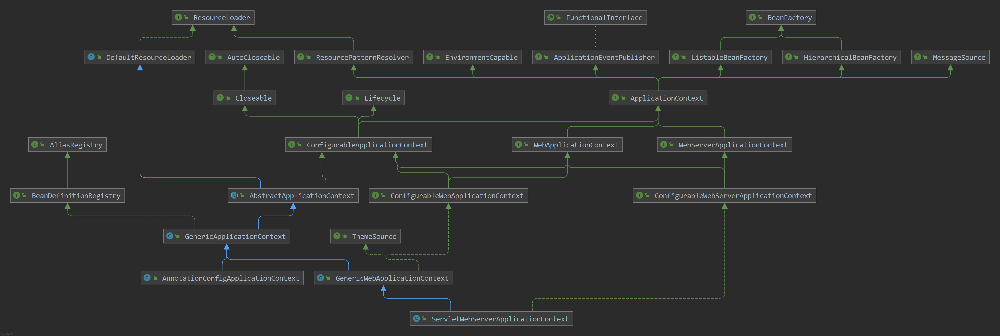

从上面的依赖图中可以看到 **ServletWebServerApplicationContext** 与 **AnnotationConfigApplicationContext** 容器同都是继承至 **AbstractApplicationContext** 类，而 **ServletWebServerApplicationContext** 容器是 **org.springframework.boot.web.servlet.context** 提供出来的能力；而**AnnotationConfigApplicationContext** 则是由 **org.springframework.context.annotation** 提供出来的能力，一个是 springboot提供，一个是spring提供。

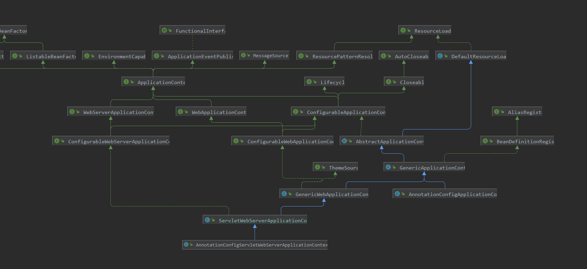

## 1.2 启动方式

通过 **SpringApplication** 的启动能够知道最终调用的都是 **Context** 类的 **refresh()** 方法，下面是截取的 **SpringApplication** 的源码

```java
protected void refresh(ApplicationContext applicationContext) {
		Assert.isInstanceOf(ConfigurableApplicationContext.class, applicationContext);
    refresh((ConfigurableApplicationContext) applicationContext);
}
//这里的 applicationContext 类型根据初始化时进行确认，spring boot web的类型就是 AnnotationConfigServletWebServerApplicationContext
protected void refresh(ConfigurableApplicationContext applicationContext) {
    applicationContext.refresh();
}
```

## 1.3 AnnotationConfigServletWebServerApplicationContext

通过上面的 **SpringApplication.run()** 方法知道了 springboot是如何启动上下文的，那么下面就来看一下 web 容器是如何启动的

### 1.3.1 prepareBeanFactory()

下面的代码截取的 **AbstractApplicationContext** 的 **refresh()** 方法里面被复写的方法（只截取了一部分需要用到的）

```java
try {
    //在 AnnotationConfigServletWebServerApplicationContext 进行复写了
    postProcessBeanFactory(beanFactory);
    // 用于执行刷新方法，创建tomcat容器
    onRefresh();
}
```

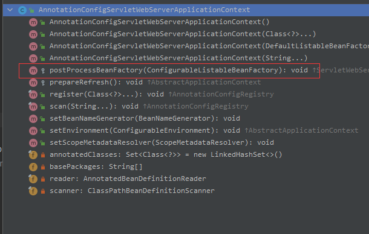

上面是 **AbstractApplicationContext.refresh()** 的方法，下面是复写；可以看到这个方法在 **refresh()** 调用时只注册了一个注入器，扫描了指定的包路径，注册指定的配置对象后就没有做什么特别的事了

```java
@Override
protected void postProcessBeanFactory(ConfigurableListableBeanFactory beanFactory) {
    //调用父类 添加 WebApplicationContextServletContextAwareProcessor 注入器，对实现了 ServletContextAware,ServletConfigAware的bean进行注入
    super.postProcessBeanFactory(beanFactory);
    if (this.basePackages != null && this.basePackages.length > 0) {
        //扫描指定的包路径
        this.scanner.scan(this.basePackages);
    }
    if (!this.annotatedClasses.isEmpty()) {
        //将传入的配置类进行注册
        this.reader.register(ClassUtils.toClassArray(this.annotatedClasses));
    }
}
```

### 1.3.2 onRefresh()

**AbstractApplicationContext.onRefresh()** 方法什么都没有做，交由子类实现，下面发现最低级的实现类是 **ServletWebServerApplicationContext** 也就是 **AnnotationConfigServletWebServerApplicationContext** 的父类

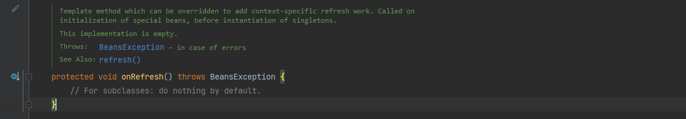

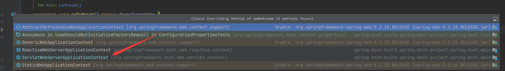

下面看一下 **ServletWebServerApplicationContext.onRefresh()** 如何实现的

```java
protected void onRefresh() {
    //先调用父级进行主题功能的初始化：UiApplicationContextUtils.initThemeSource(this)
    super.onRefresh();
    try {
        //创建web服务
        createWebServer();
    }
    catch (Throwable ex) {
        throw new ApplicationContextException("Unable to start web server", ex);
    }
}
```

下面进行创建 **ServletContext** 上下文

- 首先通过容器中找 **ServletWebServerFactory** 类型进行创建
- 通过 **ServletWebServerFactory** 创建一个 **WebServer** 对象，其中调用 **getSelfInitializer()** 返回的是一个函数对象，实际调用的是 **ServletWebServerApplicationContext.selfInitialize()** 方法
- 注册两个 **SmartLifecycle** 类型的类，一个用于容器启动完成后启动 **WebServer** ，发布 **Servlet** 初始化完成事件，一个用于注册容器关闭时，同时关闭 **WebServer** 服务
- 最后初始化配置属性

```java
private void createWebServer() {
		WebServer webServer = this.webServer;
		//获取到 ServletContext 的上下文容器
		ServletContext servletContext = getServletContext();
		if (webServer == null && servletContext == null) {
            
			//获取到spring容器中的 ServletWebServerFactory对象用于上下文的创建，如果有多个则取一个，这里以 tomcat为例，返回的 TomcatServletWebServerFactory 类型
			ServletWebServerFactory factory = getWebServerFactory();
            
			//创建tomcat服务，getSelfInitializer() 返回一个函数接口，调用当前 ServletWebServerApplicationContext.selfInitialize(ServletContext) 方法
			this.webServer = factory.getWebServer(getSelfInitializer());
            
			//注册一个容器关闭的回调类
			getBeanFactory().registerSingleton("webServerGracefulShutdown",
					new WebServerGracefulShutdownLifecycle(this.webServer));
            
			//注册一个webServer启动的容器生命周期函数，spring容器启动完成之后，发布 ServletWebServerInitializedEvent 事件
			getBeanFactory().registerSingleton("webServerStartStop",
					new WebServerStartStopLifecycle(this, this.webServer));
		}
		else if (servletContext != null) {
			try {
				getSelfInitializer().onStartup(servletContext);
			}
			catch (ServletException ex) {
				throw new ApplicationContextException("Cannot initialize servlet context", ex);
			}
		}
		//初始化配置属性
		initPropertySources();
	}
```

#### getWebServer()

```java
//通过工厂方法创建 WebServer 服务，创建好之后调用 getSelfInitializer() 返回的函数接口
this.webServer = factory.getWebServer(getSelfInitializer());
```

这里实际创建了一个 **tomcat** 实例对象，使用的是 **apache--embed** 提供的依赖，这里没有使用过，就大致描述一下；**prepareContext(tomcat.getHost(), initializers)** 将 springboot 的 **initializers** 封装成 **TomcatStarter** 这个类实现了 **ServletContainerInitializer** 这个接口是 **apache** 包提供的，在这个类里面去调用 **getSelfInitializer()** 返回的函数接口，最后 **getTomcatWebServer()** 创建一个 **TomcatWebServer** 然后启动 tomcat

```java
@Override
	public WebServer getWebServer(ServletContextInitializer... initializers) {
		if (this.disableMBeanRegistry) {
			Registry.disableRegistry();
		}
		//创建一个 tomcat 实例
		Tomcat tomcat = new Tomcat();
		File baseDir = (this.baseDirectory != null) ? this.baseDirectory : createTempDir("tomcat");
		//设置tomcat的基本路径
		tomcat.setBaseDir(baseDir.getAbsolutePath());
		//设置连接器，并且指定类型为默认的 http1.1
		Connector connector = new Connector(this.protocol);
		//是否抛出异常
		connector.setThrowOnFailure(true);
		//添加服务
		tomcat.getService().addConnector(connector);
		customizeConnector(connector);
		tomcat.setConnector(connector);
		tomcat.getHost().setAutoDeploy(false);
		//配置引擎
		configureEngine(tomcat.getEngine());
		for (Connector additionalConnector : this.additionalTomcatConnectors) {
			tomcat.getService().addConnector(additionalConnector);
		}
		//准备上下文，这里面主要是创建了一个 TomcatEmbeddedContext 上下文进行属性的设置，并且设置了一个 TomcatStarter 用于调用上面传入的 initializers
		prepareContext(tomcat.getHost(), initializers);
        //创建 TomcatWebServer 进行初始化，然后启动tomcat
		return getTomcatWebServer(tomcat);
	}
```


#### selfInitialize()

返回的 **ServletContextInitializer** 的函数式接口

```java
private org.springframework.boot.web.servlet.ServletContextInitializer getSelfInitializer() {
    return this::selfInitialize;
}
```

这个函数会在 tomcat 启动时调用，用于将

```java
private void selfInitialize(ServletContext servletContext) throws ServletException {
    //准备web容器上下文
    prepareWebApplicationContext(servletContext);
    //注册生命周期的范围
    registerApplicationScope(servletContext);
    //将上下文容器以及上下文的配置注入到单例池中
    WebApplicationContextUtils.registerEnvironmentBeans(getBeanFactory(), servletContext);
    // 获取到容器中的 ServletContextInitializer进行执行
    for (ServletContextInitializer beans : getServletContextInitializerBeans()) {
        beans.onStartup(servletContext);
    }
}
```

下面代码就是获取到 **ServletContextInitializer** 的大致流程；

```java
// ServletContextInitializerBeans 实现了 Collection 集合,实现了 iterator() 方法，所以这里遍历的时候，实际使用的是 内部的 this.sortedList 属性
protected Collection<ServletContextInitializer> getServletContextInitializerBeans() {
    return new ServletContextInitializerBeans(getBeanFactory());
}
```

```java
public ServletContextInitializerBeans(ListableBeanFactory beanFactory,
			Class<? extends ServletContextInitializer>... initializerTypes) {
		this.initializers = new LinkedMultiValueMap<>();
		//是否有传入的初始化类型，如果没有创建一个 单例的list，其中类型为 ServletContextInitializer
		this.initializerTypes = (initializerTypes.length != 0) ? Arrays.asList(initializerTypes)
				: Collections.singletonList(ServletContextInitializer.class);
		/**
		 * 这里面遍历，initializerTypes 添加Servlet初始化器，从容器中获取到 ServletContextInitializer 类型
		 * 其中比较重要的是 
		 * 	ServletRegistrationBean 用于 servlet 对象跟 tomcat 容器进行挂载的
		 * 	FilterRegistrationBean  用于注册过滤器
		 * 	DelegatingFilterProxyRegistrationBean 这个类型不确定是什么，但是应该是用于来注册过滤器的代理
		 * 	ServletListenerRegistrationBean 用于注册监听器
		 */
		addServletContextInitializerBeans(beanFactory);
		//用于添加适配器，用于是适配 ServletRegistrationBean、FilterRegistrationBean
		addAdaptableBeans(beanFactory);
		List<ServletContextInitializer> sortedInitializers = this.initializers.values().stream()
				.flatMap((value) -> value.stream().sorted(AnnotationAwareOrderComparator.INSTANCE))
				.collect(Collectors.toList());
		//进行排序后的list
		this.sortedList = Collections.unmodifiableList(sortedInitializers);
		//打印日志
		logMappings(this.initializers);
	}
```

其中 **ServletRegistrationBean** 可以看到在 springboot自动装配时，就以及将其注入到容器中包括创建好了 **DispatcherServlet** 对象

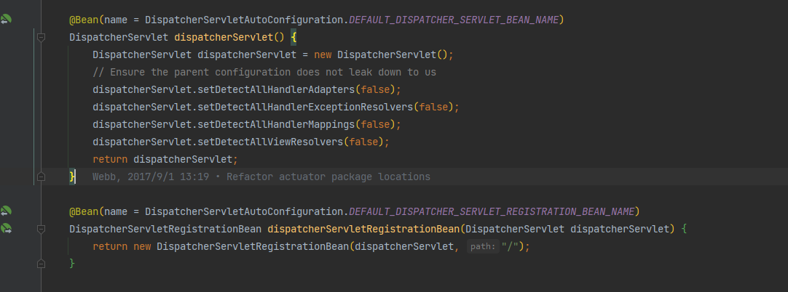

#### onStartup()

这个方法是 **ServletContextInitializer** 的实现进行调用，这里着重看 **Servlet** 的挂载

## 1.4 **RegistrationBean** 

下面是 **RegistrationBean** 体系的依赖实现

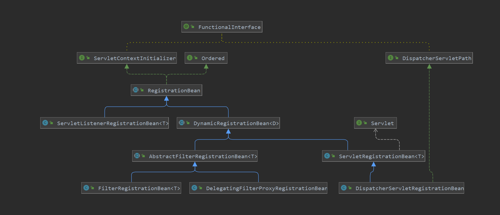

### 1.4.1 DispatcherServletRegistrationBean

由于是 springboot 自动装配创建的对象，所以其中的属性都会赋值上对应的值

```java
public final void onStartup(ServletContext servletContext) throws ServletException {
		//获取到描述符，由子类进行实现
		String description = getDescription();
		if (!isEnabled()) {
			logger.info(StringUtils.capitalize(description) + " was not registered (disabled)");
			return;
		}
		//进行注册，注册方法通过子类实现
		register(description, servletContext);
	}
```

#### register

```java
protected final void register(String description, ServletContext servletContext) {
		//添加 servlet
		D registration = addRegistration(description, servletContext);
		if (registration == null) {
			logger.info(StringUtils.capitalize(description) + " was not registered (possibly already registered?)");
			return;
		}
		//对其路径进行配置
		configure(registration);
	}
```

#### addRegistration

将对应的名称注入到 **servlet** 中

```java
protected ServletRegistration.Dynamic addRegistration(String description, ServletContext servletContext) {
    	//获取到servlet的名称
		String name = getServletName();
        //通过名称进行注册 servlet
		return servletContext.addServlet(name, this.servlet);
	}
```

#### configure

将url进行添加到 **servlet** 中，**DispatcherServletRegistrationBean** 中

```java
//先调用父类设置是否支持异步，设置初始化参数
		super.configure(registration);
        //获取到url进行设置
		String[] urlMapping = StringUtils.toStringArray(this.urlMappings);
        //如果为空，需要设置默认映射路径 /
		if (urlMapping.length == 0 && this.alwaysMapUrl) {
			urlMapping = DEFAULT_MAPPINGS;
		}
        //添加映射路径
		if (!ObjectUtils.isEmpty(urlMapping)) {
			registration.addMapping(urlMapping);
		}
		registration.setLoadOnStartup(this.loadOnStartup);
        //设置多配置项
		if (this.multipartConfig != null) {
			registration.setMultipartConfig(this.multipartConfig);
		}
```

### 1.4.2 FilterRegistrationBean

过滤器注册Bean，可以通过当前类动态的向 **tomcat** 中添加 **Filter** ；可以看到上面的依赖图，**FilterRegistrationBean** 跟 **DispatcherServletRegistrationBean** 都继承至 **DynamicRegistrationBean** 的对象，入口都是从 **onStartUp()** 然后调用覆写的 **register()** 方法

#### register

```java
protected final void register(String description, ServletContext servletContext) {
		//添加 servlet
		D registration = addRegistration(description, servletContext);
		if (registration == null) {
			logger.info(StringUtils.capitalize(description) + " was not registered (possibly already registered?)");
			return;
		}
		//对其路径进行配置
		configure(registration);
	}
```

#### addRegistration

```java
protected Dynamic addRegistration(String description, ServletContext servletContext) {
    //获取到 Filter对象，根据名称添加到上下文中
    Filter filter = getFilter();
    return servletContext.addFilter(getOrDeduceName(filter), filter);
}
```

#### configure

其中 **Filter** 会根据设置的 **DispatcherType** 进行选择执行，根据 Servlet 的类型进行判断，所以一个 **Filter** 可能会多次执行，所以 spring中所有的 FIlter 都继承了 **OncePerRequestFilter** 这样让 **Filter** 只会执行一次

```java
protected void configure(FilterRegistration.Dynamic registration) {
		//调用父类设置当前 Filter 是否支持异步操作
		super.configure(registration);
		/**
		 * 获取到当前 Dispatcher的类型
		 * 	FORWARD : 将请求进行转发，例如 Servlet1 转发到 Servlet2 中
		 * 	INCLUDE  : 分配任务给另外一个 Servlet 执行
		 *  REQUEST
		 *  ASYNC  : 内部通过线程进行异步执行
		 *  ERROR
		 */
		EnumSet<DispatcherType> dispatcherTypes = this.dispatcherTypes;
		if (dispatcherTypes == null) {
			//如果为空，就根据 Filter 的类型进行判断当前的 Dispatcher 的类型，如果实现了 OncePerRequestFilter，无论是什么类型的Servlet， Filter 都只会执行一次
			T filter = getFilter();
			if (ClassUtils.isPresent("org.springframework.web.filter.OncePerRequestFilter",
					filter.getClass().getClassLoader()) && filter instanceof OncePerRequestFilter) {
				dispatcherTypes = EnumSet.allOf(DispatcherType.class);
			}
			else {
				dispatcherTypes = EnumSet.of(DispatcherType.REQUEST);
			}
		}
		Set<String> servletNames = new LinkedHashSet<>();
		//根据注入的 ServletRegistrationBean 获取到Sevlet 的名称
		for (ServletRegistrationBean<?> servletRegistrationBean : this.servletRegistrationBeans) {
			servletNames.add(servletRegistrationBean.getServletName());
		}
		servletNames.addAll(this.servletNames);
		//下面就根据 Filter 设置的拦截路径根据对应的 Filter 进行映射，设置了拦截路径之后就可以根据对应的请求执行拦截
		if (servletNames.isEmpty() && this.urlPatterns.isEmpty()) {
            //拦截路径为空，设置默认的拦截路径 /*  所有路径都会拦截
			registration.addMappingForUrlPatterns(dispatcherTypes, this.matchAfter, DEFAULT_URL_MAPPINGS);
		}
		else {
			if (!servletNames.isEmpty()) {
				registration.addMappingForServletNames(dispatcherTypes, this.matchAfter,
						StringUtils.toStringArray(servletNames));
			}
			if (!this.urlPatterns.isEmpty()) {
				registration.addMappingForUrlPatterns(dispatcherTypes, this.matchAfter,
						StringUtils.toStringArray(this.urlPatterns));
			}
		}
	}
```

## 1.5 tomcat回调Initiallizers

下面的源码会比较绕，因为 **tomcat** 包中，大部分的类都实现了 **LifecycBase** 这个类，所以调用对应的 **start()** 方法都会先调父类，然后在调子类的覆写方法，下面调用的方法栈

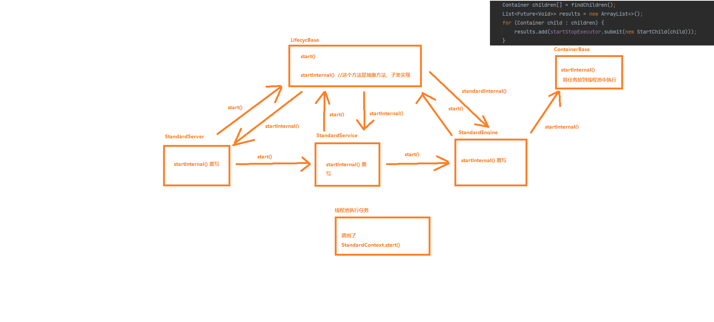

通过上面的源码可以发现在 **TomcatServletWebServerFactory** 中调用 **getWebServer()** 方法，创建了一个 **Tomcat** 实例对象，其中 **tomcat.getHost()** 会创建一个 **StandardHost** 对象存入到 **Tomcat** 对象的引擎当中

```java
public WebServer getWebServer(ServletContextInitializer... initializers) {
		if (this.disableMBeanRegistry) {
			Registry.disableRegistry();
		}
		//创建一个 tomcat 实例
		Tomcat tomcat = new Tomcat();
		File baseDir = (this.baseDirectory != null) ? this.baseDirectory : createTempDir("tomcat");
		//设置tomcat的基本路径
		tomcat.setBaseDir(baseDir.getAbsolutePath());
		//设置连接器，并且指定类型为默认的 http1.1
		Connector connector = new Connector(this.protocol);
		//是否抛出异常
		connector.setThrowOnFailure(true);
		//添加服务
		tomcat.getService().addConnector(connector);
		customizeConnector(connector);
		tomcat.setConnector(connector);
		tomcat.getHost().setAutoDeploy(false);
		//配置引擎
		configureEngine(tomcat.getEngine());
		for (Connector additionalConnector : this.additionalTomcatConnectors) {
			tomcat.getService().addConnector(additionalConnector);
		}
		//准备上下文，这里面主要是创建了一个 TomcatEmbeddedContext 上下文进行属性的设置，并且设置了一个 TomcatStarter 用于调用上面传入的 initializers
		prepareContext(tomcat.getHost(), initializers);
		//创建 TomcatWebServer 进行初始化，然后启动tomcat
		return getTomcatWebServer(tomcat);
	}
```

这一串逻辑最后添加就是 **tomcat --> engine ----> host ----> TomcatEmbeddedContext ---> TomcatStarter ---> ServletContextInitializer**

```java
protected void prepareContext(Host host, ServletContextInitializer[] initializers) {
    File documentRoot = getValidDocumentRoot();
    TomcatEmbeddedContext context = new TomcatEmbeddedContext();
    //........省略部分方法
    ServletContextInitializer[] initializersToUse = mergeInitializers(initializers);
    //将 TomcatEmbeddedContext 存入到 host的子节点中
    host.addChild(context);
    configureContext(context, initializersToUse);
    postProcessContext(context);
}

//在这个方法里面对上面创建的 TomcatEmbeddedContext 进行配置
protected void configureContext(Context context, ServletContextInitializer[] initializers) {
		TomcatStarter starter = new TomcatStarter(initializers);
        if (context instanceof TomcatEmbeddedContext) {
            TomcatEmbeddedContext embeddedContext = (TomcatEmbeddedContext) context;
            //给当前上下文设置 start
            embeddedContext.setStarter(starter);
            embeddedContext.setFailCtxIfServletStartFails(true);
        }
		//......省略部分内容
	}
```

下面没有 **Tomcat** 的源码所以直接截图了，下面方法，重点在 **addChild()** 添加子节点方法中


下面的代码就是在创建 **TomcatWebServer** 直接初始化，调用 **tomcat.start()** 的方法

```java
protected TomcatWebServer getTomcatWebServer(Tomcat tomcat) {
    return new TomcatWebServer(tomcat, getPort() >= 0, getShutdown());
}

//调用初始化方法
public TomcatWebServer(Tomcat tomcat, boolean autoStart, Shutdown shutdown) {
		......
		initialize();
}

private void initialize() throws WebServerException {
		logger.info("Tomcat initialized with port(s): " + getPortsDescription(false));
		synchronized (this.monitor) {
			try {
				addInstanceIdToEngineName();
                //获取到上下文信息，给上下文添加一个生命周期的监听器
				Context context = findContext();
				context.addLifecycleListener((event) -> {
					if (context.equals(event.getSource()) && Lifecycle.START_EVENT.equals(event.getType())) {
						removeServiceConnectors();
					}
				});
				//启动tomcat服务然后调用 initialization
				this.tomcat.start();
				rethrowDeferredStartupExceptions();

				try {
					ContextBindings.bindClassLoader(context, context.getNamingToken(), getClass().getClassLoader());
				}
				catch (NamingException ex) {
				}
                //启动守护线程，等待tomcat的启动完成
				startDaemonAwaitThread();
			}
			catch (Exception ex) {
				stopSilently();
				destroySilently();
				throw new WebServerException("Unable to start embedded Tomcat", ex);
			}
		}
	}
```

下面就是全截图

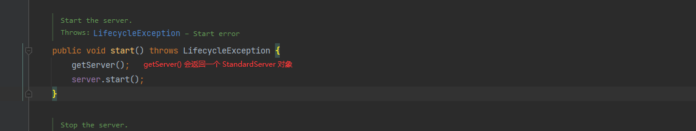

会创建一个 StandardSerivce 存入到 server中

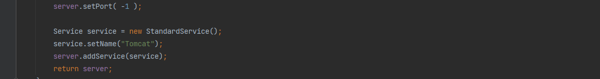

**server.start()** 调用的是父类 **LifecycleBase** 的方法


调用到了 **StandardServer** 的 **startInternal()** 方法，其中调用了上面创建的 **StandardService** 的 **start()** 方法，由于 **StandardServer** 和 **StandardService** 两个对象都实现了 **LifecycleBase** 对象，所以调用的 **start()** 方法都是父类的，然后父类又调用 **startInternal()** 方法，最终调用到 **StandardService** 的 **startInternal()** 方法

上面流程就是：server ---> base.start ----> server.startInernal---> service.start ---> base.start ----> service.startInernal

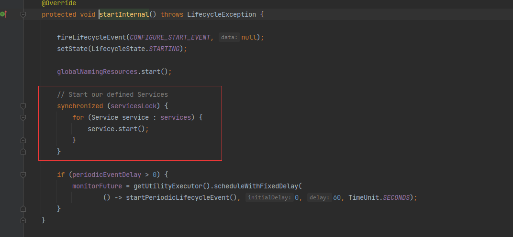

下面的代码就是 **StandardService.startInternal()**  的方法，可以看到实际上调用了 **Engine** 的 **start()** 而 **Engine** 的 **start()** 方法还是调用了父类 **LifecycleBase** 的，然后通过父类调用子类实现的 **startInternal()**

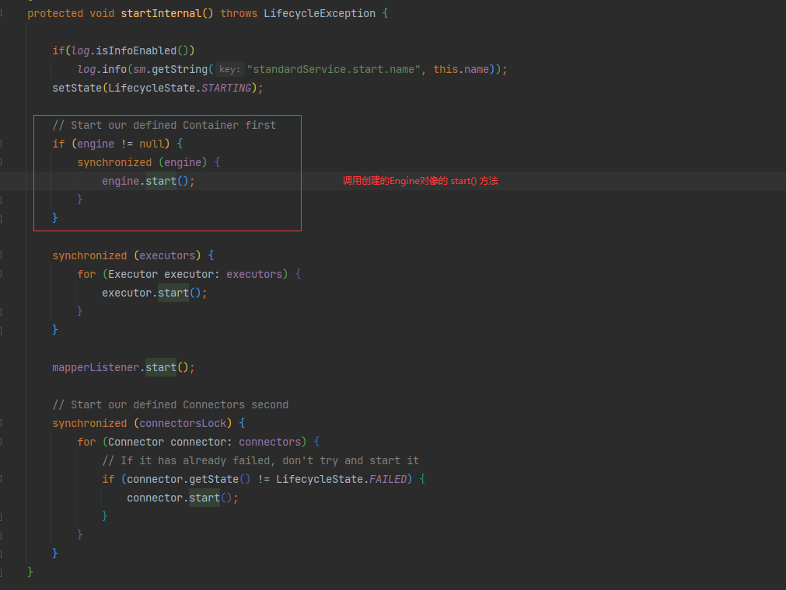

下面就是 **StandardEngine** 的调用，调用到 **ContainerBase** 的方法

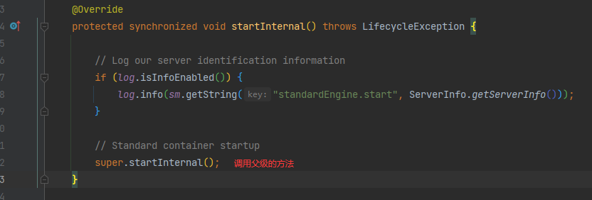


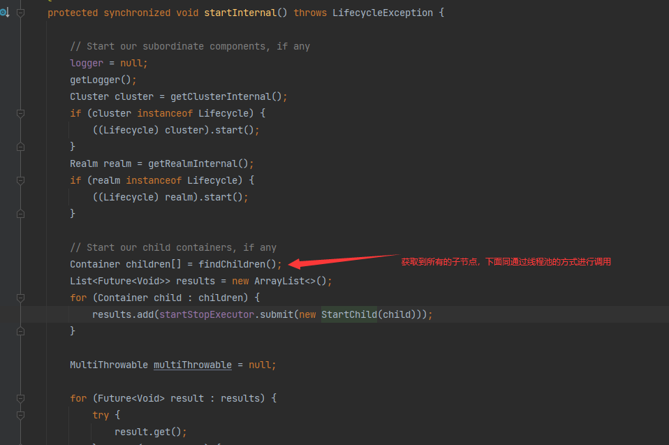

下面的代码会调用到 **StandardContext** 的 **startInteral()** 方法中，在最下面的代码中就回去到了所有的 **initializers** 前面的代码看到是通过 **TomcatStarter** 去实现了 **ServletContainerInitializer** 接口，所以这里就可以调用到springboot添加的回调函数

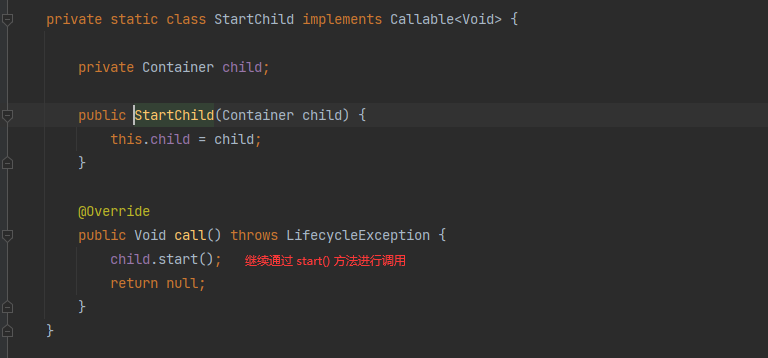

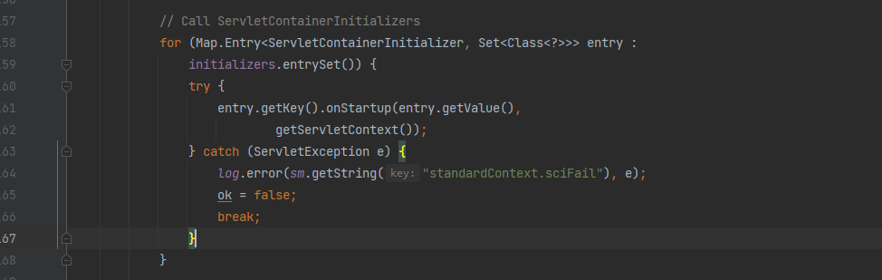

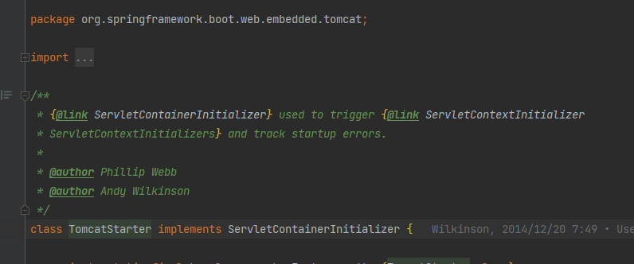

# 2. 总结

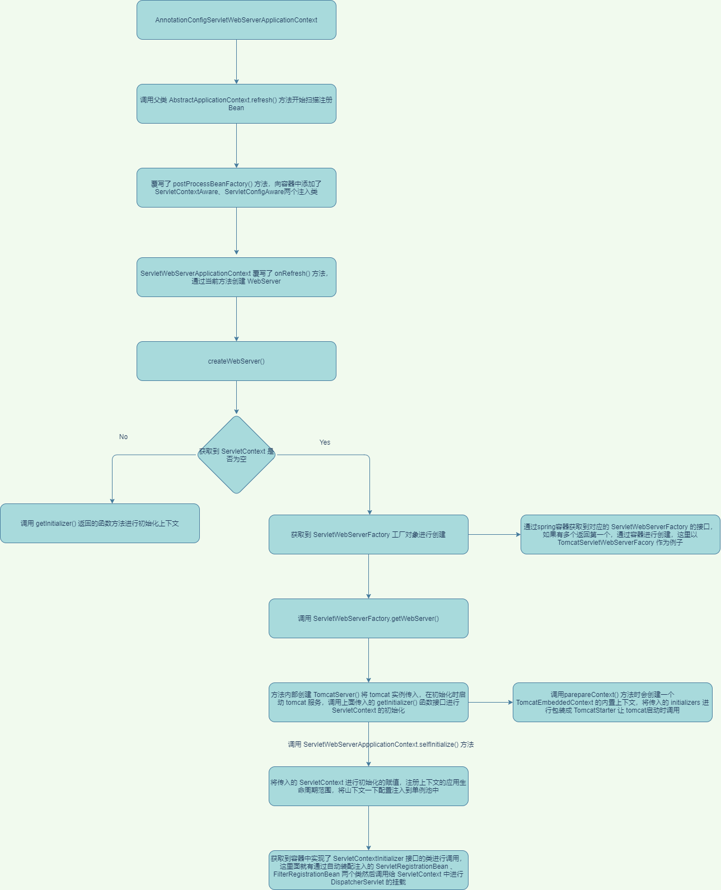


​	通过上面的源码分析可以知道Springboot通过 **AnnotationConfigServletWebServerApplication** 去覆写了 spring **AbstractApplicationContext** 中的 **onRefresh()** 方法用于创建 **WebServer** 对象进行内置的 tomcat 启动，并且通过 springboot 自动装配将实现了 **ServletContextInitializerBeans** 接口的类型在 tomcat 启动之后进行回调，而 **DispatcherServletRegistrationBean** 实现了 **ServletContextInitializerBeans** 接口将 **Servlet** 挂载到了 tomcat当中

