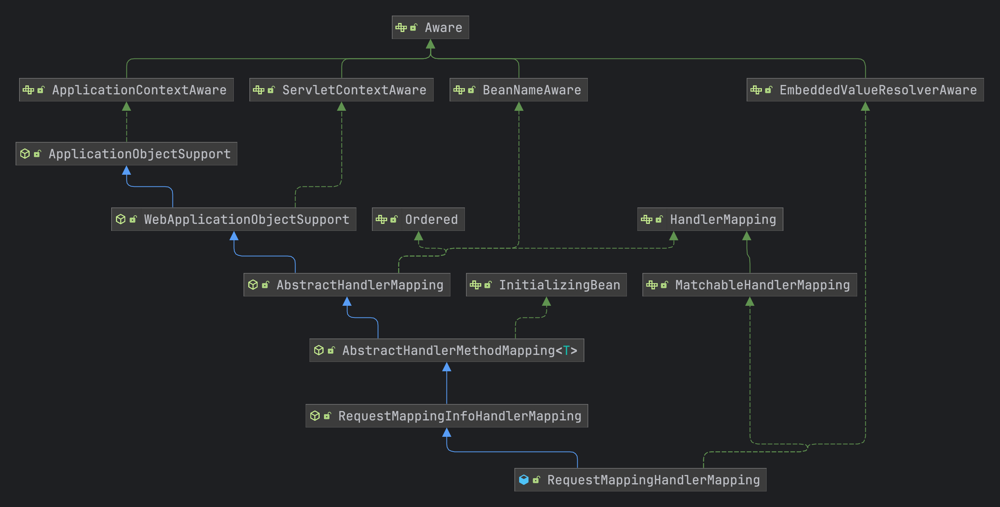
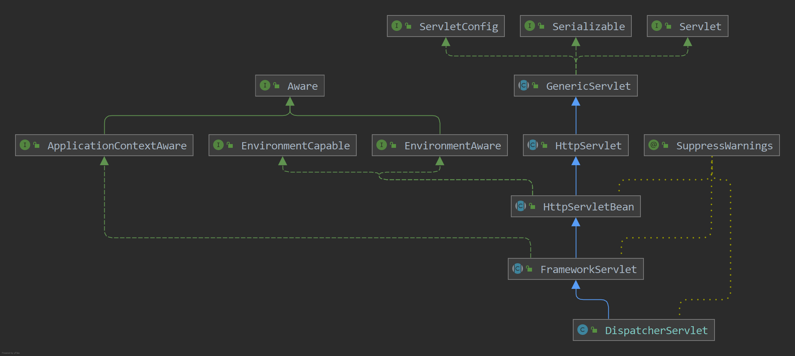

# Spring MVC源码流程

源码版本 5.3.x
## 1. Spring Boot挂载DispatcherServlet？

在 **Springboot** 启动时我们都知道内部内置了一个 **tomcat** 的容器，然后将 **DispatcherServlet** 挂载到了容器的内部从而实现了 **Spring MVC** 机制，下面的链接说明了如何将 **DispatcherServlet** 挂载到了 **Spring Boot** 中

[SpringBoot如何挂载DispatcherServlet](https://blog.csdn.net/weixin_43915643/article/details/125421616)

## 2. 配置类

### 2.1 WebMvcConfigurationSupport

spring mvc的配置类 **@EnableWebMvc** 注解会导入的配置类，用于注入spring mvc中的一些核心的配置类，其中有的一些核心配置方法如下：

- requestMappingHandlerMapping：用于创建 **RequestMappingHandlerMapping** 用于处理 **@RequestMapping** 注解的类
- mvcPatternParser：创建 **PathPatternParser** 路径表达式解析器
- mvcUrlPathHelper：创建 **UrlPathHelper** url路径解析器，用于解析http请求的路径
- mvcPathMatcher：创建 **PathMatcher** 路径匹配器
- viewControllerHandlerMapping：用于创建视图控制器的方法，创建的类为 **SimpleUrlHandlerMapping**
- requestMappingHandlerAdapter：创建处理器的适配器，比较重要 **RequestMappingHandlerAdapter**
- httpRequestHandlerAdapter：http请求的处理器适配器，**HttpRequestHandlerAdapter**

### 2.2 WebMvcConfigurer

```java
public interface WebMvcConfigurer {

	/**
	 * 配置路径匹配器
	 */
	default void configurePathMatch(PathMatchConfigurer configurer) {
	}

	/**
	 * 配置内容协商主要的作用
	 * 1. 根据请求头来进行内容协商：例如，Accept: application/json 表示客户端希望接收 JSON 格式的数据
	 * 2. 根据文件扩展名进行内容协商：例如，/resource.json 表示客户端希望接收 JSON 格式的数据
	 * 3. 根据参数进行内容协商: 例如，/resource?format=json 表示客户端希望接收 JSON 格式的数据
	 * 4. 配置默认的内容类型，当无法从请求中确定内容类型时使用
	 * 5. 配置媒体类型解析器（Media Type Resolvers），用于将请求映射到具体的内容类型
	 */
	default void configureContentNegotiation(ContentNegotiationConfigurer configurer) {
	}

	/**
	 * 配置异步支持器
	 */
	default void configureAsyncSupport(AsyncSupportConfigurer configurer) {
	}

	/**
	 * 配置默认的Servlet
	 */
	default void configureDefaultServletHandling(DefaultServletHandlerConfigurer configurer) {
	}

	/**
	 * Add {@link Converter Converters} and {@link Formatter Formatters} in addition to the ones
	 * registered by default.
	 */
	default void addFormatters(FormatterRegistry registry) {
	}

	/**
	 * 添加拦截器
	 */
	default void addInterceptors(InterceptorRegistry registry) {
	}

	/**
	 * 添加静态资源处理器，例如：js、html等
	 */
	default void addResourceHandlers(ResourceHandlerRegistry registry) {
	}

	/**
	 * 添加跨域映射器
	 */
	default void addCorsMappings(CorsRegistry registry) {
	}

	/**
	 * 添加视图解析器
	 */
	default void addViewControllers(ViewControllerRegistry registry) {
	}

	/**
	 * 配置视图解析器
	 */
	default void configureViewResolvers(ViewResolverRegistry registry) {
	}

	/**
	 * 添加参数解析器
	 */
	default void addArgumentResolvers(List<HandlerMethodArgumentResolver> resolvers) {
	}

	/**
	 * 添加返回值处理器
	 */
	default void addReturnValueHandlers(List<HandlerMethodReturnValueHandler> handlers) {
	}

	/**
	 * 配置消息转换器
	 */
	default void configureMessageConverters(List<HttpMessageConverter<?>> converters) {
	}

	/**
	 * 扩展或者修改HttpMessageConverter消息转换器 
	 */
	default void extendMessageConverters(List<HttpMessageConverter<?>> converters) {
	}

	/**
	 * 配置异常处理解析器
	 */
	default void configureHandlerExceptionResolvers(List<HandlerExceptionResolver> resolvers) {
	}

	/**
	 * 异常处理解析器
	 */
	default void extendHandlerExceptionResolvers(List<HandlerExceptionResolver> resolvers) {
	}

	/**
	 * 参数校验器
	 */
	@Nullable
	default Validator getValidator() {
		return null;
	}

	/**
	 * Provide a custom {@link MessageCodesResolver} for building message codes
	 * from data binding and validation error codes. Leave the return value as
	 * {@code null} to keep the default.
	 */
	@Nullable
	default MessageCodesResolver getMessageCodesResolver() {
		return null;
	}
}
```


## 3. 初始化

### 3.1 RequestMappingHandlerMapping

请求映射器的处理器，用于解析 @RequestMapping 注解，将对应的controller中的方法解析成对应的 **HandlerMethod**



### 3.2 AbstractHandlerMethodMapping

继承的核心方法主要是在 **AbstractHandlerMethodMapping** 中的 **afterPropertiesSet()** 方法中进行初始化处理，因为实现了 **InitializingBean** 接口，所以容器启动时就会进行初始化的解析

```java
@Override
public void afterPropertiesSet() {
  //调用初始化 handler方法，RequestMappingHandlerMapping子类将这个方法进行覆写了，只在里面配置相关配置信息，然后调用父类
  initHandlerMethods();
}
```

从spring容器中会获取到所有的bean对象

```java
protected void initHandlerMethods() {
		//获取到spring容器中所有的bean的名称
		for (String beanName : getCandidateBeanNames()) {
			//这里判断了一下bean的名称是否是 scopedTarget. 开头的，如果是的话，就不处理了，因为这个是spring内部使用的
			if (!beanName.startsWith(SCOPED_TARGET_NAME_PREFIX)) {
				//处理Bean对象
				processCandidateBean(beanName);
			}
		}
		handlerMethodsInitialized(getHandlerMethods());
	}
```

处理的方法主要的步骤是

- 先调用子类实现的方法 **isHandler()** 方法判断是否是需要处理的类，这里是 **RequestMappingHandlerMapping**进行实现的方法
- 将所有的方法中所有标识了 **@RequestMapping** 注解的方法全部解析为 **RequestMappingInfo** 类
- 最后将对应的关系，目标类、执行的方法、映射的配置类（RequestMappingInfo）注册到 **MappingRegistry** 中

```java
protected void processCandidateBean(String beanName) {
		Class<?> beanType = null;
		try {
			//通过spring容器获取到bean的类型
			beanType = obtainApplicationContext().getType(beanName);
		}
		catch (Throwable ex) {
			// An unresolvable bean type, probably from a lazy bean - let's ignore it.
			if (logger.isTraceEnabled()) {
				logger.trace("Could not resolve type for bean '" + beanName + "'", ex);
			}
		}
		//判断bean对象是否有 RequestMapping或者Controller注解
		if (beanType != null && isHandler(beanType)) {
			//处理 mvc请求类的方法
			detectHandlerMethods(beanName);
		}
	}
```

```java
protected void detectHandlerMethods(Object handler) {
		//获取到处理bean的类型
		Class<?> handlerType = (handler instanceof String ?
				obtainApplicationContext().getType((String) handler) : handler.getClass());

		if (handlerType != null) {
			Class<?> userType = ClassUtils.getUserClass(handlerType);
			//将所有的方法都解析为 RequestMappingInfo 类型
			Map<Method, T> methods = MethodIntrospector.selectMethods(userType,
					(MethodIntrospector.MetadataLookup<T>) method -> {
						try {
							//将method方法对象转换为 T 的泛型对象，是由 RequestMappingHandlerMapping实现所以T是RequestMappingInfo类型
							return getMappingForMethod(method, userType);
						}
						catch (Throwable ex) {
							throw new IllegalStateException("Invalid mapping on handler class [" +
									userType.getName() + "]: " + method, ex);
						}
					});
			if (logger.isTraceEnabled()) {
				logger.trace(formatMappings(userType, methods));
			}
			else if (mappingsLogger.isDebugEnabled()) {
				mappingsLogger.debug(formatMappings(userType, methods));
			}
			methods.forEach((method, mapping) -> {
				//将方法对象转换为可执行的方法对象
				Method invocableMethod = AopUtils.selectInvocableMethod(method, userType);
				//将bean和执行方法以及 RequestMappingInfo对象注册到mappingRegistry中，进行关联起来
				registerHandlerMethod(handler, invocableMethod, mapping);
			});
		}
	}
```

### 3.3 MappingRegistry

- 先将类和方法创建一个 **HandlerMethod** 关联类
- 存入到缓存中的是 **RequestMappingInfo** 作为key，value值创建一个 **MappingRegistration** 对象，里面保存了映射的路径、目标的对象等信息

```java
public void register(T mapping, Object handler, Method method) {
			this.readWriteLock.writeLock().lock();
			try {
				HandlerMethod handlerMethod = createHandlerMethod(handler, method);
				validateMethodMapping(handlerMethod, mapping);

				Set<String> directPaths = AbstractHandlerMethodMapping.this.getDirectPaths(mapping);
				for (String path : directPaths) {
					this.pathLookup.add(path, mapping);
				}

				String name = null;
				if (getNamingStrategy() != null) {
					name = getNamingStrategy().getName(handlerMethod, mapping);
					addMappingName(name, handlerMethod);
				}
				/**
				 * 处理 @CrossOrigin 注解，将注解构建成为 CorsConfiguration 配置对象
				 * 先获取到类上面的 @CrossOrigin 注解，在获取到方法上面的 @CrossOrigin 注解
				 */
				CorsConfiguration corsConfig = initCorsConfiguration(handler, method, mapping);
				if (corsConfig != null) {
					corsConfig.validateAllowCredentials();
					this.corsLookup.put(handlerMethod, corsConfig);
				}

				this.registry.put(mapping,
						new MappingRegistration<>(mapping, handlerMethod, directPaths, name, corsConfig != null));
			}
			finally {
				this.readWriteLock.writeLock().unlock();
			}
		}
```


### 3.4 DispatcherServlet

下面就是 **DispatcherServlet** 的继承图，从 **HttpServlet** 截至到上面部分都是 **Javax.servlet.http** 所提供的功能，而 **HttpServletBean** 开始就是 **spring** 实现的功能



DispatcherServlet比较核心的属性有以下：

- MultipartResolver：文件的解析器
- LocaleResolver：国际化的解析器
- ThemeResolver：主题解析器
- **HandlerMapping**：处理器映射器，从容器中获取出的 **List** 

#### 3.4.1 init()

在 tomcat 启动时并不会去对 **DispatcherServlet** 进行初始化，而是会在 **tomcat** 接收到请求时，如果 **Dispatcher** 还没有被初始化时，这时就会调用 **DispatcherServlet** 的 **init()** 方法进行初始化。初始化方法 **init()** 定义在 **GenericServlet** 中，交给子类进行实现，实际实现类是 **HttpServletBean** 类中对其进行实现

```java
public final void init() throws ServletException {

		//设置Servlet的配置属性
		PropertyValues pvs = new ServletConfigPropertyValues(getServletConfig(), this.requiredProperties);
		//判断配置属性是否是空的
		if (!pvs.isEmpty()) {
			try {
				//将当前HttpServletBean创建一个 BeanWrapperImpl包装实现类
				BeanWrapper bw = PropertyAccessorFactory.forBeanPropertyAccess(this);
				//获取到资源加载器
				ResourceLoader resourceLoader = new ServletContextResourceLoader(getServletContext());
				//注册自定义编辑器
				bw.registerCustomEditor(Resource.class, new ResourceEditor(resourceLoader, getEnvironment()));
				//初始化
				initBeanWrapper(bw);
				//注入配置信息
				bw.setPropertyValues(pvs, true);
			}
			catch (BeansException ex) {
				if (logger.isErrorEnabled()) {
					logger.error("Failed to set bean properties on servlet '" + getServletName() + "'", ex);
				}
				throw ex;
			}
		}
		//初始化DispatcherServlet，将所有请求的方法和适配器类初始化出来
		initServletBean();
	}
```

#### 3.4.2 initServletBean()

**initServletBean() 方法交给子类来进行实现**

```java
protected void initServletBean() throws ServletException {
}
```

实际实现的类是 **FrameworkServlet.initServletBean()** 进行初始化，然后调用 **initWebApplicationContext()** 继续交给子类进行实现

```java
protected final void initServletBean() throws ServletException {
		try {
			//初始化web应用的上下文
			this.webApplicationContext = initWebApplicationContext();
			initFrameworkServlet();
		}
		catch (ServletException | RuntimeException ex) {
			logger.error("Context initialization failed", ex);
			throw ex;
		}
	}
```

#### 3.4.3 initWebApplicationContext()

**initWebApplicationContext() ** 方法调用 **onRefresh()** 进行初始化

```java
protected WebApplicationContext initWebApplicationContext() {
		WebApplicationContext rootContext =
				WebApplicationContextUtils.getWebApplicationContext(getServletContext());
		WebApplicationContext wac = null;

		if (this.webApplicationContext != null) {
			// A context instance was injected at construction time -> use it
			wac = this.webApplicationContext;
			if (wac instanceof ConfigurableWebApplicationContext) {
				ConfigurableWebApplicationContext cwac = (ConfigurableWebApplicationContext) wac;
				if (!cwac.isActive()) {
					if (cwac.getParent() == null) {
						cwac.setParent(rootContext);
					}
					configureAndRefreshWebApplicationContext(cwac);
				}
			}
		}
		if (wac == null) {
			wac = findWebApplicationContext();
		}
		if (wac == null) {
			wac = createWebApplicationContext(rootContext);
		}

		if (!this.refreshEventReceived) {
			synchronized (this.onRefreshMonitor) {
        //进行初始化
				onRefresh(wac);
			}
		}
		if (this.publishContext) {
			String attrName = getServletContextAttributeName();
			getServletContext().setAttribute(attrName, wac);
		}
		return wac;
	}
```

#### 3.4.4 onRefresh()

**onRefresh** 方法交给子类进行实现，具体的子类是 **DispatcherServlet** 类，也是核心类

```java
protected void onRefresh(ApplicationContext context) {
  initStrategies(context);
}
```

#### 3.4.5 initStrategies()

```java
/**
	 * WebMvcConfigurationSupport：给容器中添加了很多的组件，
	 * 	例如：RequestMappingHandlerMapping 用于处理@RequestMapping 注解的类，RequestMappingHandlerAdapter处理器适配器，SimpleUrlHandlerMapping
	 * 	处理静态资源（通过WebMvcConfigurer进行注册静态资源的处理路径）
	 *
	 * @EnableWebMvc：注解导入了 DelegatingWebMvcConfiguration 它继承至 WebMvcConfigurationSupport，其中通过自动注入注入了所有的 WebMvcConfigurer 实现类
	 */
	protected void initStrategies(ApplicationContext context) {
		//初始化多部分文件解析器，请求头中是否有 multipart/form-data 属性，文件上传
		initMultipartResolver(context);
		//初始化本地化解析器
		initLocaleResolver(context);
		//初始化主题解析器
		initThemeResolver(context);
		/**
		 * 初始化处理器映射器，获取到容器中所有 HandlerMapping 实现类
		 * 配置时只需要配置 AbstractHandlerMethodMapping 的实现类就可以自动扫描出所有的 @RequestMapping 的类到容器中
		 * AbstractHandlerMethodMapping：实现了 InitializingBean 接口会调用 afterPropertiesSet() 去容器中获取到所有的bean对象，
		 * 								然后进行判断bean对象@Controller注解或者@RequestMapping注解，然后获取到其中的方法中含有
		 * 								注解@RequestMapping的方法，将其注册到内部的 MappingRegistry容器中
		 */
		initHandlerMappings(context);
		/**
		 * 初始化处理器是配置，接口类型是 HandlerAdapter 接口
		 * 使用的实现类：RequestMappingHandlerAdapter；其中会处理 @ControllerAdvice注解
		 */
		initHandlerAdapters(context);
		/**
		 * 从spring中获取到所有的异常处理器，然后将其注册到容器中
		 * HandlerExceptionResolver：
		 * 	ExceptionHandlerExceptionResolver.afterPropertiesSet() 中取读取到 @ControllerAdvice 注解的类
		 * 	然后通过ExceptionHandlerMethodResolver 处理@ExceptionHandler，进行异常方法的映射
		 * 	对于异常的执行来说是通过 DispatcherServlet.processDispatchResult() 中进行处理的
		 */
		initHandlerExceptionResolvers(context);
		//请求视图名称转换器
		initRequestToViewNameTranslator(context);
		//视图解析器
		initViewResolvers(context);
		//初始化缓存管理器
		initFlashMapManager(context);
	}
```

#### 2.4.6 initMultipartResolver

直接从容器中获取到对应类型的bean对象

```java
private void initMultipartResolver(ApplicationContext context) {
		try {
			this.multipartResolver = context.getBean(MULTIPART_RESOLVER_BEAN_NAME, MultipartResolver.class);
	}
```

#### 2.4.7 initLocaleResolver

```java
private void initLocaleResolver(ApplicationContext context) {
		try {
			this.localeResolver = context.getBean(LOCALE_RESOLVER_BEAN_NAME, LocaleResolver.class);
		}
		catch (NoSuchBeanDefinitionException ex) {
			// We need to use the default.
			this.localeResolver = getDefaultStrategy(context, LocaleResolver.class);
		}
	}
```

#### 2.4.8 initHandlerMappings

初始化构建处理器映射器，将 **RequestMappingHandlerMapping** 配置的类读取出来，请求来时通过处理器映射器来获取到对应的 **@RequestMapping** 标识的方法

```java
private void initHandlerMappings(ApplicationContext context) {
		this.handlerMappings = null;
		//判断是否需要构建所有的 HandlerMapping 接口的实现类，如果不需要构建所有的，只需要找到名称为 handlerMapping 的bean对象
		if (this.detectAllHandlerMappings) {
			// WebMvcConfigurationSupport 中配置了默认的请求处理器映射器以及资源处理器等包括 RequestMappingHandlerAdapter
			Map<String, HandlerMapping> matchingBeans =
					BeanFactoryUtils.beansOfTypeIncludingAncestors(context, HandlerMapping.class, true, false);
			if (!matchingBeans.isEmpty()) {
				this.handlerMappings = new ArrayList<>(matchingBeans.values());
				// We keep HandlerMappings in sorted order.
				AnnotationAwareOrderComparator.sort(this.handlerMappings);
			}
		}
		else {
			try {
				HandlerMapping hm = context.getBean(HANDLER_MAPPING_BEAN_NAME, HandlerMapping.class);
				this.handlerMappings = Collections.singletonList(hm);
			}
			catch (NoSuchBeanDefinitionException ex) {
				// Ignore, we'll add a default HandlerMapping later.
			}
		}
		if (this.handlerMappings == null) {
			this.handlerMappings = getDefaultStrategies(context, HandlerMapping.class);
			if (logger.isTraceEnabled()) {
				logger.trace("No HandlerMappings declared for servlet '" + getServletName() +
						"': using default strategies from DispatcherServlet.properties");
			}
		}

		for (HandlerMapping mapping : this.handlerMappings) {
			if (mapping.usesPathPatterns()) {
				this.parseRequestPath = true;
				break;
			}
		}
	}
```

#### 3.4.9 initHandlerAdapters

读取到对应的处理器适配器，通过适配器来执行对应的方法

```java
private void initHandlerAdapters(ApplicationContext context) {
		this.handlerAdapters = null;
		//判断是否需要加载出所有的spring中的 HandlerAdapter 实现类，如果不需要加入的话只会加载默认的名称叫 handlerAdapter 的适配器
		if (this.detectAllHandlerAdapters) {
			//通过spring容器加载出所有的 HandlerAdapter 实现类
			Map<String, HandlerAdapter> matchingBeans =
					BeanFactoryUtils.beansOfTypeIncludingAncestors(context, HandlerAdapter.class, true, false);
			if (!matchingBeans.isEmpty()) {
				this.handlerAdapters = new ArrayList<>(matchingBeans.values());
				//根据@Order进行排序
				AnnotationAwareOrderComparator.sort(this.handlerAdapters);
			}
		}
		else {
			try {
				HandlerAdapter ha = context.getBean(HANDLER_ADAPTER_BEAN_NAME, HandlerAdapter.class);
				this.handlerAdapters = Collections.singletonList(ha);
			}
			catch (NoSuchBeanDefinitionException ex) {
				// Ignore, we'll add a default HandlerAdapter later.
			}
		}
		if (this.handlerAdapters == null) {
			this.handlerAdapters = getDefaultStrategies(context, HandlerAdapter.class);
			if (logger.isTraceEnabled()) {
				logger.trace("No HandlerAdapters declared for servlet '" + getServletName() +
						"': using default strategies from DispatcherServlet.properties");
			}
		}
	}
```

#### 2.4.10 initHandlerExceptionResolvers

初始化异常相关的处理类

```java
private void initHandlerExceptionResolvers(ApplicationContext context) {
		this.handlerExceptionResolvers = null;

		if (this.detectAllHandlerExceptionResolvers) {
			// Find all HandlerExceptionResolvers in the ApplicationContext, including ancestor contexts.
			Map<String, HandlerExceptionResolver> matchingBeans = BeanFactoryUtils
					.beansOfTypeIncludingAncestors(context, HandlerExceptionResolver.class, true, false);
			if (!matchingBeans.isEmpty()) {
				this.handlerExceptionResolvers = new ArrayList<>(matchingBeans.values());
				// We keep HandlerExceptionResolvers in sorted order.
				AnnotationAwareOrderComparator.sort(this.handlerExceptionResolvers);
			}
		}
		else {
			try {
				HandlerExceptionResolver her =
						context.getBean(HANDLER_EXCEPTION_RESOLVER_BEAN_NAME, HandlerExceptionResolver.class);
				this.handlerExceptionResolvers = Collections.singletonList(her);
			}
			catch (NoSuchBeanDefinitionException ex) {
				// Ignore, no HandlerExceptionResolver is fine too.
			}
		}
		if (this.handlerExceptionResolvers == null) {
			this.handlerExceptionResolvers = getDefaultStrategies(context, HandlerExceptionResolver.class);
			if (logger.isTraceEnabled()) {
				logger.trace("No HandlerExceptionResolvers declared in servlet '" + getServletName() +
						"': using default strategies from DispatcherServlet.properties");
			}
		}
	}
```


## 4. 请求处理

### 4.1 DispatcherServlet

#### 4.1.1 doDispatch()

真正处理请求的方法

```java
protected void doDispatch(HttpServletRequest request, HttpServletResponse response) throws Exception {
		HttpServletRequest processedRequest = request;
		//处理器执行链
		HandlerExecutionChain mappedHandler = null;
		//是否多部分请求解析（文件上传）
		boolean multipartRequestParsed = false;
		//向http请求中的 Attribute 属性中设置一个异步管理器
		WebAsyncManager asyncManager = WebAsyncUtils.getAsyncManager(request);

		try {
			//模型和视图对象
			ModelAndView mv = null;
			//捕获的异常
			Exception dispatchException = null;

			try {
				/**
				 * 检查http请求是否是文件上传，如果是文件上传的话将其包装为 DefaultMultipartHttpServletRequest 并且对文件对象进行解析
				 */
				processedRequest = checkMultipart(request);
				multipartRequestParsed = (processedRequest != request);

				/**
				 * 根据请求的路径获取到对应的handler处理器
				 * HandlerExecutionChain：执行的请求链类，最终使用的是里面的 handler
				 *
				 * AbstractHandlerMethodMapping：这个抽象类是所有的处理器映射器的父类，在配置到容器中后通过 afterPropertiesSet() 方法会将所有的方法进行初始化
				 * 而具体的实现类则是 RequestMappingHandlerMapping
				 */
				mappedHandler = getHandler(processedRequest);
				if (mappedHandler == null) {
					//处理没有找到对应的处理器映射器
					noHandlerFound(processedRequest, response);
					return;
				}

				/**
				 * 根据处理器找到对应的处理器适配器
				 * 返回的是 RequestMappingHandlerAdapter 适配器进行处理
				 */
				HandlerAdapter ha = getHandlerAdapter(mappedHandler.getHandler());

				// Process last-modified header, if supported by the handler.
				String method = request.getMethod();
				boolean isGet = HttpMethod.GET.matches(method);
				if (isGet || HttpMethod.HEAD.matches(method)) {
					long lastModified = ha.getLastModified(request, mappedHandler.getHandler());
					if (new ServletWebRequest(request, response).checkNotModified(lastModified) && isGet) {
						return;
					}
				}
				/**
				 * 获取到拦截器进行执行
				 */
				if (!mappedHandler.applyPreHandle(processedRequest, response)) {
					return;
				}

				/**
				 * 真正执行请求处理的适配器
				 * RequestMappingHandlerAdapter，最终调用到的父类方法是 AbstractHandlerMethodAdapter.handle()
				 * 其中通过从处理器映射器获取到的handler进行处理
				 * 说明：
				 * RequestMappingHandlerAdapter中初始了很多的处理，例如：http消息的转换、返回值的处理等，在 afterPropertiesSet() 中初始化了很多的处理器
				 */
				mv = ha.handle(processedRequest, response, mappedHandler.getHandler());

				if (asyncManager.isConcurrentHandlingStarted()) {
					return;
				}
				//根据请求设置默认的视图名称
				applyDefaultViewName(processedRequest, mv);
				//执行拦截器的后置处理
				mappedHandler.applyPostHandle(processedRequest, response, mv);
			}
			catch (Exception ex) {
				dispatchException = ex;
			}
			catch (Throwable err) {
				// As of 4.3, we're processing Errors thrown from handler methods as well,
				// making them available for @ExceptionHandler methods and other scenarios.
				dispatchException = new NestedServletException("Handler dispatch failed", err);
			}
			//处理请求结果
			processDispatchResult(processedRequest, response, mappedHandler, mv, dispatchException);
		}
		catch (Exception ex) {
			//触发拦截器的完成处理
			triggerAfterCompletion(processedRequest, response, mappedHandler, ex);
		}
		catch (Throwable err) {
			triggerAfterCompletion(processedRequest, response, mappedHandler,
					new NestedServletException("Handler processing failed", err));
		}
		finally {
			if (asyncManager.isConcurrentHandlingStarted()) {
				// Instead of postHandle and afterCompletion
				if (mappedHandler != null) {
					mappedHandler.applyAfterConcurrentHandlingStarted(processedRequest, response);
				}
			}
			else {
				// Clean up any resources used by a multipart request.
				if (multipartRequestParsed) {
					cleanupMultipart(processedRequest);
				}
			}
		}
	}
```

#### 4.1.2 getHandler()

获取指定处理的 **HandlerMapping** 实现类，通过下面的实现图，分为以下几个比较实用，这里springmvc我们使用的是 **RequestMappingHandlerMapping**

- RequestMappingHandlerMapping：spring mvc使用的处理器映射器
- RouterFunctionMapping：函数式处理器映射器
- BeanNameUrlHandlerMapping：bean名称处理器映射器


代码中返回的是一个**HandlerExecutionChain** 实体类

```java
protected HandlerExecutionChain getHandler(HttpServletRequest request) throws Exception {  
    if (this.handlerMappings != null) {  
       for (HandlerMapping mapping : this.handlerMappings) {  
          //调用 RequestMappingHandlerMapping 继承的类 AbstractHandlerMapping.getHandler()
          HandlerExecutionChain handler = mapping.getHandler(request);  
          if (handler != null) {  
             return handler;  
          }  
       }  
    }  
    return null;  
}
```

调用 **AbstractHandlerMapping.getHandler(request);** 来创建处理器执行器链

```java
public final HandlerExecutionChain getHandler(HttpServletRequest request) throws Exception {  
    // 调用子类实现的方法来读取到匹配的handler  
    Object handler = this.getHandlerInternal(request);  
    // 如果返回为空直接返回默认的handler  
    if (handler == null) {  
       handler = this.getDefaultHandler();  
    }  
    // 如果没有指定默认的直接返回  
    if (handler == null) {  
       return null;  
    }  
    // 如果返回的handler是字符串，则从spring容器中获取对应的bean  
    if (handler instanceof String) {  
       String handlerName = (String) handler;  
       handler = this.obtainApplicationContext().getBean(handlerName);  
    }  
  
    // 解析url请求路径并且进行缓存  
    if (!ServletRequestPathUtils.hasCachedPath(request)) {  
       this.initLookupPath(request);  
    }  
  
    // 创建处理器链，并且将拦截器设置进去  
    HandlerExecutionChain executionChain = this.getHandlerExecutionChain(handler, request);  
  
    if (this.logger.isTraceEnabled()) {  
       this.logger.trace("Mapped to " + handler);  
    }  
    else if (this.logger.isDebugEnabled() && !DispatcherType.ASYNC.equals(request.getDispatcherType())) {  
       this.logger.debug("Mapped to " + executionChain.getHandler());  
    }  
  
    // 判断当前handler是否配置的处理跨域请求的handler  
    if (this.hasCorsConfigurationSource(handler) || CorsUtils.isPreFlightRequest(request)) {  
       CorsConfiguration config = this.getCorsConfiguration(handler, request);  
       if (this.getCorsConfigurationSource() != null) {  
          CorsConfiguration globalConfig = this.getCorsConfigurationSource().getCorsConfiguration(request);  
          config = (globalConfig != null ? globalConfig.combine(config) : config);  
       }  
       if (config != null) {  
          config.validateAllowCredentials();  
       }  
       executionChain = this.getCorsHandlerExecutionChain(request, executionChain, config);  
    }  
  
    return executionChain;  
}
```

spring mvc的默认实现调用的 **AbstractHandlerMethodMapping** 中的方法，通过解析请求的路径来获取到对应的handler处理器

```java
protected HandlerMethod getHandlerInternal(HttpServletRequest request) throws Exception {  
    //获取到请求的路径出来  
    String lookupPath = this.initLookupPath(request);  
    //加上读锁  
    this.mappingRegistry.acquireReadLock();  
    try {  
       //通过请求的地址去获取到 HandlerMethod对象  
       HandlerMethod handlerMethod = this.lookupHandlerMethod(lookupPath, request);  
       //先判断当前 HandlerMethod 中存储的bean信息是否是名称，如果是名称的话通过spring容器进行创建出来  
       return (handlerMethod != null ? handlerMethod.createWithResolvedBean() : null);  
    }  
    finally {  
       //释放锁  
       this.mappingRegistry.releaseReadLock();  
    }  
}
```

比较简单，返回的是执行方法的本身和拦截器
```java
public class HandlerExecutionChain {  
    /**  
     * handler类型是HandlerMethod  
     */    
     private final Object handler;  
  
    /**  
     * 注入的拦截器  
     */  
    private final List<HandlerInterceptor> interceptorList = new ArrayList<>();
}
```

**HandlerMethod** 用于保存需要调用的对应的bean对象和方法

```java
public class HandlerMethod {  
  
    /** Logger that is available to subclasses. */  
    protected static final Log logger = LogFactory.getLog(HandlerMethod.class);  
  
    // 对应的target对象  
    private final Object bean;  
  
    // bean工厂  
    @Nullable  
    private final BeanFactory beanFactory;  
  
    // spring context 容器对象  
    @Nullable  
    private final MessageSource messageSource;  
  
    // bean的类型  
    private final Class<?> beanType;  
  
    // 要执行的方法  
    private final Method method;  
  
    // 桥接方法  
    private final Method bridgedMethod;  
  
    // 方法的参数  
    private final MethodParameter[] parameters;  
  
    @Nullable  
    private HttpStatus responseStatus;  
  
    @Nullable  
    private String responseStatusReason;  
  
    @Nullable  
    private HandlerMethod resolvedFromHandlerMethod;  
  
    @Nullable  
    private volatile List<Annotation[][]> interfaceParameterAnnotations;  
  
    private final String description;
}
```

#### 4.1.3 getHandlerAdapter()

获取完处理器后，需要通过对应的适配器来执行对应的方法

```java
protected HandlerAdapter getHandlerAdapter(Object handler) throws ServletException {  
    if (this.handlerAdapters != null) {  
       for (HandlerAdapter adapter : this.handlerAdapters) {  
          //调用方法 org.springframework.web.servlet.mvc.method.AbstractHandlerMethodAdapter.supports()          
          if (adapter.supports(handler)) {  
             return adapter;  
          }  
       }  
    }  
    throw new ServletException("No adapter for handler [" + handler +  
          "]: The DispatcherServlet configuration needs to include a HandlerAdapter that supports this handler");  
}
```

通过下面实现图，spring实现的几个

- RequestMappingHandlerAdapter：springmvc的映射适配器
- HandlerFunctionAdapter：函数式适配器
- SimpleControllerHandlerAdapter：处理Controller实现类
- SimpleServletHandlerAdapter：处理Servlet实现类


#### 4.1.4 handle()

真正调用的是通过 RequestMappingHandlerAdapter.handle() 方法

### 4.2 RequestMappingHandlerAdapter

最终 **doDispatch()** 方法调用的类就是 **RequestMappingHandlerAdapter.invokeHandlerMethod()** 方法

#### 4.2.1 invokeHandlerMethod()

```java
protected ModelAndView invokeHandlerMethod(HttpServletRequest request,
			HttpServletResponse response, HandlerMethod handlerMethod) throws Exception {
		//包装请求对象
		ServletWebRequest webRequest = new ServletWebRequest(request, response);
		try {
			/**
			 * ServletRequestDataBinderFactory：构建一个参数绑定的工厂，会将当前mvc bean对象中 有 @InitBinder 注解的方法读取出来
			 * 再对请求接口转换时用于参数的转换
			 */
			WebDataBinderFactory binderFactory = getDataBinderFactory(handlerMethod);
			/**
			 * 构建 ModelFactory工厂，读取出所有的 @ModelAttribute 方法
			 */
			ModelFactory modelFactory = getModelFactory(handlerMethod, binderFactory);

			//包装一下请求的方法对象
			ServletInvocableHandlerMethod invocableMethod = createInvocableHandlerMethod(handlerMethod);
			//参数解析器 HandlerMethodArgumentResolverComposite
			if (this.argumentResolvers != null) {
				invocableMethod.setHandlerMethodArgumentResolvers(this.argumentResolvers);
			}
			//返回值处理器 HandlerMethodReturnValueHandlerComposite
			if (this.returnValueHandlers != null) {
				invocableMethod.setHandlerMethodReturnValueHandlers(this.returnValueHandlers);
			}
			invocableMethod.setDataBinderFactory(binderFactory);
			invocableMethod.setParameterNameDiscoverer(this.parameterNameDiscoverer);

			//模型视图容器，如果参数中或者返回值有ModelAndView相关的则会使用
			ModelAndViewContainer mavContainer = new ModelAndViewContainer();
			mavContainer.addAllAttributes(RequestContextUtils.getInputFlashMap(request));
			modelFactory.initModel(webRequest, mavContainer, invocableMethod);
			mavContainer.setIgnoreDefaultModelOnRedirect(this.ignoreDefaultModelOnRedirect);
			//StandardServletAsyncWebRequest 创建一个web的异步请求
			AsyncWebRequest asyncWebRequest = WebAsyncUtils.createAsyncWebRequest(request, response);
			asyncWebRequest.setTimeout(this.asyncRequestTimeout);

			WebAsyncManager asyncManager = WebAsyncUtils.getAsyncManager(request);
			asyncManager.setTaskExecutor(this.taskExecutor);
			asyncManager.setAsyncWebRequest(asyncWebRequest);
			//注册拦截器
			asyncManager.registerCallableInterceptors(this.callableInterceptors);
			//结果拦截器
			asyncManager.registerDeferredResultInterceptors(this.deferredResultInterceptors);

			if (asyncManager.hasConcurrentResult()) {
				Object result = asyncManager.getConcurrentResult();
				mavContainer = (ModelAndViewContainer) asyncManager.getConcurrentResultContext()[0];
				asyncManager.clearConcurrentResult();
				LogFormatUtils.traceDebug(logger, traceOn -> {
					String formatted = LogFormatUtils.formatValue(result, !traceOn);
					return "Resume with async result [" + formatted + "]";
				});
				invocableMethod = invocableMethod.wrapConcurrentResult(result);
			}
			//执行方法
			invocableMethod.invokeAndHandle(webRequest, mavContainer);
			if (asyncManager.isConcurrentHandlingStarted()) {
				return null;
			}

			return getModelAndView(mavContainer, modelFactory, webRequest);
		}
		finally {
			webRequest.requestCompleted();
		}
	}
```

#### 4.2.2 invokeAndHandle()

执行方法比较简单：

- 执行请求（调用方法）
- 设置请求的响应状态
- 处理返回值

```java
public void invokeAndHandle(ServletWebRequest webRequest, ModelAndViewContainer mavContainer,  
       Object... providedArgs) throws Exception {  
       //执行方法后获取到结果值进行处理  
    Object returnValue = invokeForRequest(webRequest, mavContainer, providedArgs);  
    // 给响应设置状态码  
    setResponseStatus(webRequest);  
  
    if (returnValue == null) {  
       if (isRequestNotModified(webRequest) || getResponseStatus() != null || mavContainer.isRequestHandled()) {  
          disableContentCachingIfNecessary(webRequest);  
          mavContainer.setRequestHandled(true);  
          return;  
       }  
    }  
    else if (StringUtils.hasText(getResponseStatusReason())) {  
       mavContainer.setRequestHandled(true);  
       return;  
    }  
  
    mavContainer.setRequestHandled(false);  
    Assert.state(this.returnValueHandlers != null, "No return value handlers");  
    try {  
	    //处理返回值
       this.returnValueHandlers.handleReturnValue(  
             returnValue, getReturnValueType(returnValue), mavContainer, webRequest);  
    }  
    catch (Exception ex) {  
       if (logger.isTraceEnabled()) {  
          logger.trace(formatErrorForReturnValue(returnValue), ex);  
       }  
       throw ex;  
    }  
}
```

下面是执行请求是来进行参数解析的实现类：

- PathVariableMapMethodArgumentResolver：@PathVariable注解的处理
- RequestResponseBodyMethodProcessor：@RequestBody注解的处理同时也是ResponseBody的处理器


```java
public Object invokeForRequest(NativeWebRequest request, @Nullable ModelAndViewContainer mavContainer,  
       Object... providedArgs) throws Exception {  
  
    /**  
     * 通过 HandlerMethodArgumentResolverComposite 中构建的参数解析器对请求的参数进行解析  
     */  
    Object[] args = getMethodArgumentValues(request, mavContainer, providedArgs);  
    if (logger.isTraceEnabled()) {  
       logger.trace("Arguments: " + Arrays.toString(args));  
    }  
    // 调用方法  
    return doInvoke(args);  
}
```

返回值的处理方式和实现类与请求参数的类似

```java
public void handleReturnValue(@Nullable Object returnValue, MethodParameter returnType,  
       ModelAndViewContainer mavContainer, NativeWebRequest webRequest) throws Exception {  
    /**  
     * 根据返回值和返回值的类型来选择对应的处理器  
     * 循环便利HandlerMethodReturnValueHandler  
     */    
     HandlerMethodReturnValueHandler handler = this.selectHandler(returnValue, returnType);  
    if (handler == null) {  
       throw new IllegalArgumentException("Unknown return value type: " + returnType.getParameterType().getName());  
    }  
    // 执行对应的返回值处理器  
    handler.handleReturnValue(returnValue, returnType, mavContainer, webRequest);  
}
```

**HandlerMethodReturnValueHandler** 的实现类在进行返回值处理时会执行对应的切面也就是 **@ControllerAdvice** 注解标识的类或者 **RequestBodyAdvice 、ResponseBodyAdvice** 接口的实现类，在返回值写入Response中时进行处理，而处理的逻辑则抽取到了 **AbstractMessageConverterMethodProcessor** 类中。代码主要执行的逻辑根据请求头中的 **MediaType** 来选择对应的转换器

```java
protected <T> void writeWithMessageConverters(@Nullable T value, MethodParameter returnType,  
       ServletServerHttpRequest inputMessage, ServletServerHttpResponse outputMessage)  
       throws IOException, HttpMediaTypeNotAcceptableException, HttpMessageNotWritableException {  
    //返回值数据  
    Object body;  
    //方法的返回值类型  
    Class<?> valueType;  
    //目标值类型  
    Type targetType;  
  
    if (value instanceof CharSequence) {  
       body = value.toString();  
       valueType = String.class;  
       targetType = String.class;  
    }
    else {  
       body = value;  
       valueType = getReturnValueType(body, returnType);  
       targetType = GenericTypeResolver.resolveType(getGenericType(returnType), returnType.getContainingClass());  
    }  
  
    //判断返回值或者参数的类型是 InputStream 流  
    if (isResourceType(value, returnType)) {  
       //设置头信息为bytes  
       outputMessage.getHeaders().set(HttpHeaders.ACCEPT_RANGES, "bytes");  
       ....
    }  
  
    MediaType selectedMediaType = null;  
    //获取到请求头中的内容类型  
    MediaType contentType = outputMessage.getHeaders().getContentType();  
    boolean isContentTypePreset = contentType != null && contentType.isConcrete();  
    if (isContentTypePreset) {  
       if (logger.isDebugEnabled()) {  
          logger.debug("Found 'Content-Type:" + contentType + "' in response");  
       }  
       selectedMediaType = contentType;  
    }  
    else {  
       ...
    }  
  
    if (selectedMediaType != null) {  
       selectedMediaType = selectedMediaType.removeQualityValue();  
       //获取到 http消息转换器，这里根据请求头中的http类型来进行转换  
       for (HttpMessageConverter<?> converter : this.messageConverters) {  
          GenericHttpMessageConverter genericConverter = (converter instanceof GenericHttpMessageConverter ?  
                (GenericHttpMessageConverter<?>) converter : null);  
          //先判断目标类型和返回值类型以及http的类型是否匹配  
          if (genericConverter != null ?  
                ((GenericHttpMessageConverter) converter).canWrite(targetType, valueType, selectedMediaType) :  
                converter.canWrite(valueType, selectedMediaType)) {  
             //先执行切面的beforeBodyWrite方法  
             body = getAdvice().beforeBodyWrite(body, returnType, selectedMediaType,  
                   (Class<? extends HttpMessageConverter<?>>) converter.getClass(),  
                   inputMessage, outputMessage);  
             //如果body不为空的话执行写入  
             if (body != null) {  
                Object theBody = body;  
                LogFormatUtils.traceDebug(logger, traceOn ->  
                      "Writing [" + LogFormatUtils.formatValue(theBody, !traceOn) + "]");  
                addContentDispositionHeader(inputMessage, outputMessage);  
                /**  
                 * 如果通过 @ControllerAdvice 对返回的数据进行统一封装的话，如果返回值类型是String类型，而切面里面对返回值进行了封装的话  
                 * 这里就会出现转换错误，因为这里的 targetType的类型还是String， selectedMediaType的类型 MediaType.TEXT_PLAIN文本类型  
                 * 就会选择 StringHttpMessageConverter 进行转换，而这个转换器是不支持对返回值进行封装的，所以这里就会报错  
                 */  
                if (genericConverter != null) {  
                   genericConverter.write(body, targetType, selectedMediaType, outputMessage);  
                }  
                else {  
                   ((HttpMessageConverter) converter).write(body, selectedMediaType, outputMessage);  
                }  
             }  
             else {  
                if (logger.isDebugEnabled()) {  
                   logger.debug("Nothing to write: null body");  
                }  
             }  
             return;  
          }  
       }  
    }  
  
    if (body != null) {  
       Set<MediaType> producibleMediaTypes =  
             (Set<MediaType>) inputMessage.getServletRequest()  
                   .getAttribute(HandlerMapping.PRODUCIBLE_MEDIA_TYPES_ATTRIBUTE);  
  
       if (isContentTypePreset || !CollectionUtils.isEmpty(producibleMediaTypes)) {  
          throw new HttpMessageNotWritableException(  
                "No converter for [" + valueType + "] with preset Content-Type '" + contentType + "'");  
       }  
       throw new HttpMediaTypeNotAcceptableException(getSupportedMediaTypes(body.getClass()));  
    }  
}
```

## 5. 请求响应切面

请求响应的切面主要是在请求和写入响应值是进行前置或者后主处理的逻辑，spring中提供了两个接口来进行实现并且通过 **RequestResponseBodyAdviceChain** 来进行组装

- RequestBodyAdvice
- ResponseBodyAdvice

### 5.1 初始化

初始化逻辑则是在 **RequestMappingHandlerAdapter.afterPropertiesSet()** 中进行初始化

```java
public void afterPropertiesSet() {  
    /**  
     * 读取出容器中所有的 @ControllerAdvice，将其包装成 ControllerAdviceBean  
     * 其中区分出一下三种通知类型  
     *     initBinderAdviceCache：包含@InitBinder注解的类  
     *     modelAttributeAdviceCache：包含@ModelAttribute注解的类  
     *     requestResponseBodyAdvice：实现了 RequestBodyAdvice\ResponseBodyAdvice 的类  
     */  
    initControllerAdviceCache();  
  
    if (this.argumentResolvers == null) {  
       //设置参数的解析器，这里会配置很多自定义的默认参数解析器  
       List<HandlerMethodArgumentResolver> resolvers = getDefaultArgumentResolvers();  
       this.argumentResolvers = new HandlerMethodArgumentResolverComposite().addResolvers(resolvers);  
    }  
    if (this.initBinderArgumentResolvers == null) {  
       //设置默认的参数绑定器  
       List<HandlerMethodArgumentResolver> resolvers = getDefaultInitBinderArgumentResolvers();  
       this.initBinderArgumentResolvers = new HandlerMethodArgumentResolverComposite().addResolvers(resolvers);  
    }  
    if (this.returnValueHandlers == null) {  
       //设置默认的返回值处理器  
       List<HandlerMethodReturnValueHandler> handlers = getDefaultReturnValueHandlers();  
       this.returnValueHandlers = new HandlerMethodReturnValueHandlerComposite().addHandlers(handlers);  
    }  
}
```

```java
private void initControllerAdviceCache() {  
    if (getApplicationContext() == null) {  
       return;  
    }  
    //获取到所有的 @ControllerAdvice 注解标记的类，用于执行通知  
    List<ControllerAdviceBean> adviceBeans = ControllerAdviceBean.findAnnotatedBeans(getApplicationContext());  
  
    List<Object> requestResponseBodyAdviceBeans = new ArrayList<>();  
  
    for (ControllerAdviceBean adviceBean : adviceBeans) {  
       Class<?> beanType = adviceBean.getBeanType();  
       if (beanType == null) {  
          throw new IllegalStateException("Unresolvable type for ControllerAdviceBean: " + adviceBean);  
       }  
       //处理方法中包含了 @ModelAttribute 注解的  
       Set<Method> attrMethods = MethodIntrospector.selectMethods(beanType, MODEL_ATTRIBUTE_METHODS);  
       if (!attrMethods.isEmpty()) {  
          this.modelAttributeAdviceCache.put(adviceBean, attrMethods);  
       }  
       //获取到方法中 @InitBinder 注解标记的类  
       Set<Method> binderMethods = MethodIntrospector.selectMethods(beanType, INIT_BINDER_METHODS);  
       if (!binderMethods.isEmpty()) {  
          this.initBinderAdviceCache.put(adviceBean, binderMethods);  
       }  
       //用于判断切面是否实现了以下两个接口  
       if (RequestBodyAdvice.class.isAssignableFrom(beanType) || ResponseBodyAdvice.class.isAssignableFrom(beanType)) {  
          requestResponseBodyAdviceBeans.add(adviceBean);  
       }  
    }  
  
    if (!requestResponseBodyAdviceBeans.isEmpty()) {  
       this.requestResponseBodyAdvice.addAll(0, requestResponseBodyAdviceBeans);  
    }   
}
```

### 5.2 调用

切面调用的类分别为：

- AbstractMessageConverterMethodArgumentResolver：处理请求读取参数时调用切面
- AbstractMessageConverterMethodProcessor：处理响应值时调用切面

## 6. 统一异常

spring在处理异常时可以自定义异常处理器来统一处理整个处理链中的异常，提供了 **HandlerExceptionResolver** 接口

- ExceptionHandlerExceptionResolver：全局异常的解析器

### 6.1 初始化

异常处理器的初始化是在 **DispatcherServlet.initHandlerExceptionResolvers** 就将容器中对应的处理器读取出来进行初始化

```java
private void initHandlerExceptionResolvers(ApplicationContext context) {  
    this.handlerExceptionResolvers = null;  
  
    if (this.detectAllHandlerExceptionResolvers) {  
       // 从容器中获取到所有的解析器 
       Map<String, HandlerExceptionResolver> matchingBeans = BeanFactoryUtils  
             .beansOfTypeIncludingAncestors(context, HandlerExceptionResolver.class, true, false);  
       if (!matchingBeans.isEmpty()) {  
          this.handlerExceptionResolvers = new ArrayList<>(matchingBeans.values());  
          // We keep HandlerExceptionResolvers in sorted order.  
          AnnotationAwareOrderComparator.sort(this.handlerExceptionResolvers);  
       }  
    }  
    else {
	   //如果没有添加所有的解析器，只需要从容器中添加默认解析器
       try {  
          HandlerExceptionResolver her =  
                context.getBean(HANDLER_EXCEPTION_RESOLVER_BEAN_NAME, HandlerExceptionResolver.class);  
          this.handlerExceptionResolvers = Collections.singletonList(her);  
       }  
       catch (NoSuchBeanDefinitionException ex) {  
          // Ignore, no HandlerExceptionResolver is fine too.  
       }  
    }  
  
    // Ensure we have at least some HandlerExceptionResolvers, by registering  
    // default HandlerExceptionResolvers if no other resolvers are found.    
    if (this.handlerExceptionResolvers == null) {  
       this.handlerExceptionResolvers = getDefaultStrategies(context, HandlerExceptionResolver.class);  
       if (logger.isTraceEnabled()) {  
          logger.trace("No HandlerExceptionResolvers declared in servlet '" + getServletName() +  
                "': using default strategies from DispatcherServlet.properties");  
       }  
    }  
}
```

**ExceptionHandlerExceptionResolver** 则是默认实现类，初始化时同样的套路通过 **afterPropertiesSet()** 方法来进行初始化

```java
public void afterPropertiesSet() {  
    // 首先将 ControllerAdvice中包含了@ExceptionHandler 切面进行初始化
    initExceptionHandlerAdviceCache();  
    // 异常的参数解析器  
    if (this.argumentResolvers == null) {  
       List<HandlerMethodArgumentResolver> resolvers = getDefaultArgumentResolvers();  
       this.argumentResolvers = new HandlerMethodArgumentResolverComposite().addResolvers(resolvers);  
    }  
    // 返回值解析器进行初始化  
    if (this.returnValueHandlers == null) {  
       List<HandlerMethodReturnValueHandler> handlers = getDefaultReturnValueHandlers();  
       this.returnValueHandlers = new HandlerMethodReturnValueHandlerComposite().addHandlers(handlers);  
    }
}
```

### 6.2 调用

调用时则是 **doDispatch()** 执行出现了异常创建一个异常，然后统一调用 **processDispatchResult()** 来判断异常是否为空时进行处理

```java
protected void doDispatch(HttpServletRequest request, HttpServletResponse response) throws Exception {  
  
    try {  
       ......
       }  
       catch (Exception ex) {  
          dispatchException = ex;  
       }  
       catch (Throwable err) {  
          // As of 4.3, we're processing Errors thrown from handler methods as well,  
          // making them available for @ExceptionHandler methods and other scenarios.          
          dispatchException = new NestedServletException("Handler dispatch failed", err);  
       }  
       //处理请求结果  
       processDispatchResult(processedRequest, response, mappedHandler, mv, dispatchException);  
    }  
    catch (Exception ex) {  
       //触发拦截器的完成处理  
       triggerAfterCompletion(processedRequest, response, mappedHandler, ex);  
    }  
    catch (Throwable err) {  
       triggerAfterCompletion(processedRequest, response, mappedHandler,  
             new NestedServletException("Handler processing failed", err));  
    }  
    finally {  
       if (asyncManager.isConcurrentHandlingStarted()) {  
          // Instead of postHandle and afterCompletion  
          if (mappedHandler != null) {  
             mappedHandler.applyAfterConcurrentHandlingStarted(processedRequest, response);  
          }  
       }  
       else {  
          // Clean up any resources used by a multipart request.  
          if (multipartRequestParsed) {  
             cleanupMultipart(processedRequest);  
          }  
       }  
    }  
}
```

### 6.3 默认实现

异常的调用逻辑则跟请求时保持一致的逻辑

```java
protected ModelAndView doResolveHandlerMethodException(HttpServletRequest request,  
       HttpServletResponse response, @Nullable HandlerMethod handlerMethod, Exception exception) {  
      
    // 获取到对应的 @ExceptionHandler 注解标识的可以处理的方法  
    ServletInvocableHandlerMethod exceptionHandlerMethod = this.getExceptionHandlerMethod(handlerMethod, exception);  
    if (exceptionHandlerMethod == null) {  
       return null;  
    }
      
    // 解析对应的参数  
    if (this.argumentResolvers != null) {  
       exceptionHandlerMethod.setHandlerMethodArgumentResolvers(this.argumentResolvers);  
    }  
    if (this.returnValueHandlers != null) {  
       exceptionHandlerMethod.setHandlerMethodReturnValueHandlers(this.returnValueHandlers);  
    }  
  
    ServletWebRequest webRequest = new ServletWebRequest(request, response);  
    ModelAndViewContainer mavContainer = new ModelAndViewContainer();  
  
    ArrayList<Throwable> exceptions = new ArrayList<>();  
    try {  
       if (this.logger.isDebugEnabled()) {  
          this.logger.debug("Using @ExceptionHandler " + exceptionHandlerMethod);  
       }  
       // Expose causes as provided arguments as well  
       Throwable exToExpose = exception;  
       while (exToExpose != null) {  
          exceptions.add(exToExpose);  
          Throwable cause = exToExpose.getCause();  
          exToExpose = (cause != exToExpose ? cause : null);  
       }  
       Object[] arguments = new Object[exceptions.size() + 1];  
       exceptions.toArray(arguments);  // efficient arraycopy call in ArrayList  
       arguments[arguments.length - 1] = handlerMethod;  
       exceptionHandlerMethod.invokeAndHandle(webRequest, mavContainer, arguments);  
    }  
    catch (Throwable invocationEx) {  
       
    }  
}
```

## 7. RouterFunctionMapping

函数接口式映射器，主要的使用方式是可以通过webflux来实现响应式请求

### 7.1 使用

通过定义好对应的**RouterFunction**函数接口就可以实现，默认实现为**BuiltRouterFunction**

```java
@Configuration  
public class RouterConfig {
    @Bean
    public RouterFunction<ServerResponse> helloRoute() {
	    // 创建 RouterFunctionBuilder 进行构建路由器
        return RouterFunctions.route()  
                .GET("/hello", request -> ServerResponse.ok().body("Hello World"))  
                .build();  
    }
}
```

### 7.2 初始化

在 **WebMvcConfigurationSupport** 中自动装配了 **RouterFunctionMapping** 类来作为函数映射器

```java
public RouterFunctionMapping routerFunctionMapping(  
       @Qualifier("mvcConversionService") FormattingConversionService conversionService,  
       @Qualifier("mvcResourceUrlProvider") ResourceUrlProvider resourceUrlProvider) {  
  
    RouterFunctionMapping mapping = new RouterFunctionMapping();  
    mapping.setOrder(3); 
    //设置拦截器
    mapping.setInterceptors(getInterceptors(conversionService, resourceUrlProvider)); 
    //配置跨域配置
    mapping.setCorsConfigurations(getCorsConfigurations());
    //消息转换器
    mapping.setMessageConverters(getMessageConverters());  
	//路径解析器
    PathPatternParser patternParser = getPathMatchConfigurer().getPatternParser();  
    if (patternParser != null) {  
       mapping.setPatternParser(patternParser);  
    }  
    return mapping;  
}
```

**RouterFunctionMapping**实现了**InitializingBean**在加载时进行初始化

```java
public void afterPropertiesSet() throws Exception {  
    //判断是否有routerFunction  
    if (this.routerFunction == null) {  
       //从spring容器中初始化RouterFunction，注意RouterFunction是一个链表的形式进行整合  
       this.initRouterFunction();  
    }  
    //初始化messageConverters  
    if (CollectionUtils.isEmpty(this.messageConverters)) {  
       this.initMessageConverters();  
    }  
    //初始化PathPatternParser路径解析器  
    if (this.routerFunction != null) {  
       PathPatternParser patternParser = this.getPatternParser();  
       if (patternParser == null) {  
          patternParser = new PathPatternParser();  
          this.setPatternParser(patternParser);  
       }  
       RouterFunctions.changeParser(this.routerFunction, patternParser);  
    }  
}
```

### 7.3 函数路由

spring通过**RouterFunction**来组装函数式路由，下面是路由接口的方法定义

```java
@FunctionalInterface  
public interface RouterFunction<T extends ServerResponse> {  
  
    /**  
     * 判断路由是否匹配当前请求
     */    
     Optional<HandlerFunction<T>> route(ServerRequest request);  
  
    /**  
     * 将两个路由进行合并组合
     */    
     default RouterFunction<T> and(RouterFunction<T> other) {  
       return new RouterFunctions.SameComposedRouterFunction<>(this, other);  
    }  
  
    /**  
     * 将两个路由进行合并组合
     */    
     default RouterFunction<?> andOther(RouterFunction<?> other) {  
       return new RouterFunctions.DifferentComposedRouterFunction(this, other);  
    }  
  
    /**  
     * 添加一个新的路由到链表中
     */    
     default RouterFunction<T> andRoute(RequestPredicate predicate, HandlerFunction<T> handlerFunction) {  
       return and(RouterFunctions.route(predicate, handlerFunction));  
    }  
  
    /**  
     * 添加一个嵌入的路由
     */    
     default RouterFunction<T> andNest(RequestPredicate predicate, RouterFunction<T> routerFunction) {  
       return and(RouterFunctions.nest(predicate, routerFunction));  
    }  
  
    /**  
     * 根据函数进行路由的过滤
     */    
     default <S extends ServerResponse> RouterFunction<S> filter(HandlerFilterFunction<T, S> filterFunction) {  
       return new RouterFunctions.FilteredRouterFunction<>(this, filterFunction);  
    }  
  
    /**  
     * 使用路由访问器来访问所有的路由器
     */    
     default void accept(RouterFunctions.Visitor visitor) {  
       visitor.unknown(this);  
    }  
  
    /**  
     * 路由设置属性值
     */    
     default RouterFunction<T> withAttribute(String name, Object value) {  
       Assert.hasLength(name, "Name must not be empty");  
       Assert.notNull(value, "Value must not be null");  
  
       Map<String, Object> attributes = new LinkedHashMap<>();  
       attributes.put(name, value);  
       return new RouterFunctions.AttributesRouterFunction<>(this, attributes);  
    }  
  
    /**  
     * 设置属性值
     */    
     default RouterFunction<T> withAttributes(Consumer<Map<String, Object>> attributesConsumer) {  
       Assert.notNull(attributesConsumer, "AttributesConsumer must not be null");  
  
       Map<String, Object> attributes = new LinkedHashMap<>();  
       attributesConsumer.accept(attributes);  
       return new RouterFunctions.AttributesRouterFunction<>(this, attributes);  
    }   
}
```

函数构建时是通过构建器模式进行函数构建**RouterFunctionBuilder**

```java
class RouterFunctionBuilder implements RouterFunctions.Builder {  
  
    private final List<RouterFunction<ServerResponse>> routerFunctions = new ArrayList<>();  
  
    private final List<HandlerFilterFunction<ServerResponse, ServerResponse>> filterFunctions = new ArrayList<>();  
  
    private final List<HandlerFilterFunction<ServerResponse, ServerResponse>> errorHandlers = new ArrayList<>();  
  
  
    @Override  
    public RouterFunctions.Builder add(RouterFunction<ServerResponse> routerFunction) {  
       Assert.notNull(routerFunction, "RouterFunction must not be null");  
       this.routerFunctions.add(routerFunction);  
       return this;  
    }
    
	public RouterFunction<ServerResponse> build() {  
	    if (this.routerFunctions.isEmpty()) {  
	       throw new IllegalStateException("No routes registered. Register a route with GET(), POST(), etc.");  
	    }
	    RouterFunction<ServerResponse> result = new BuiltRouterFunction(this.routerFunctions);  
	  
	    if (this.filterFunctions.isEmpty() && this.errorHandlers.isEmpty()) {  
	       return result;  
	    }  
	    else { 
		    // 将所有的routerFunction进行合并过滤一遍
	       HandlerFilterFunction<ServerResponse, ServerResponse> filter =  
	             Stream.concat(this.filterFunctions.stream(), this.errorHandlers.stream())  
	                   .reduce(HandlerFilterFunction::andThen)  
	                   .orElseThrow(IllegalStateException::new);  
	  
	       return result.filter(filter);  
	    }  
	}
}
```

默认实现的函数接口如下，当请求来时调用**route()** 方法来进行请求的判断是否符合请求，如果符合就放回处理的函数接口

```java
private static final class DefaultRouterFunction<T extends ServerResponse> extends AbstractRouterFunction<T> {  
  
    private final RequestPredicate predicate;  
  
    private final HandlerFunction<T> handlerFunction;  
  
    public DefaultRouterFunction(RequestPredicate predicate, HandlerFunction<T> handlerFunction) {  
       this.predicate = predicate;  
       this.handlerFunction = handlerFunction;  
    }  
  
    @Override  
    public Optional<HandlerFunction<T>> route(ServerRequest request) {  
       if (this.predicate.test(request)) {  
          return Optional.of(this.handlerFunction);  
       }  
       else {
          return Optional.empty();  
       }  
    }  
  
    @Override  
    public void accept(Visitor visitor) {  
       visitor.route(this.predicate, this.handlerFunction);  
    }  
  
}
```

而通过**and()** 方法进行构建的函数接口**SameComposedRouterFunction** 分别划分为一级和二级，一级表示上一级的处理函数，二级则表示关联的下一级，当调用**route()** 先判断一级再判断二级以此类推

```java
static final class SameComposedRouterFunction<T extends ServerResponse> extends AbstractRouterFunction<T> {  
  
    private final RouterFunction<T> first;  
  
    private final RouterFunction<T> second;  
  
    public SameComposedRouterFunction(RouterFunction<T> first, RouterFunction<T> second) {  
       this.first = first;  
       this.second = second;  
    }
  
    @Override  
    public Optional<HandlerFunction<T>> route(ServerRequest request) {  
       Optional<HandlerFunction<T>> firstRoute = this.first.route(request);  
       if (firstRoute.isPresent()) {  
          return firstRoute;  
       }
       else {  
          return this.second.route(request);  
       }  
    }  
  
    @Override  
    public void accept(Visitor visitor) {  
       this.first.accept(visitor);  
       this.second.accept(visitor);  
    }  
}
```
