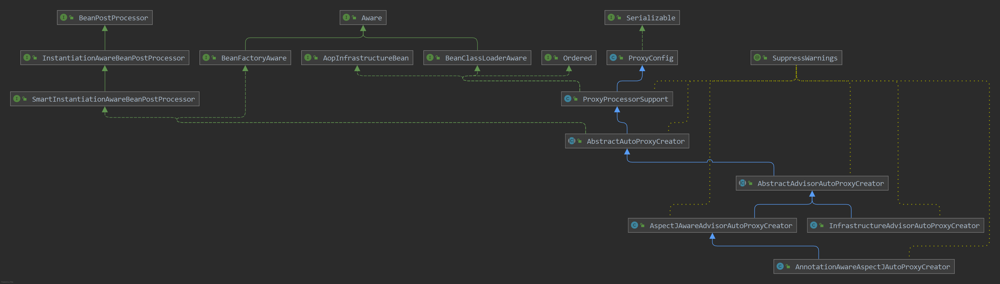
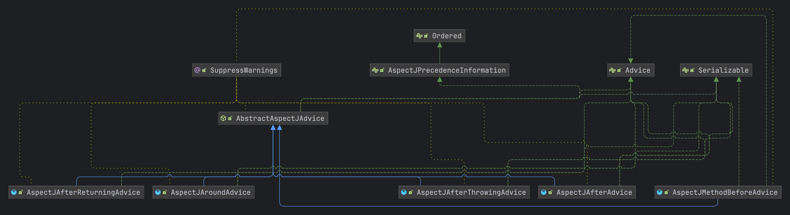
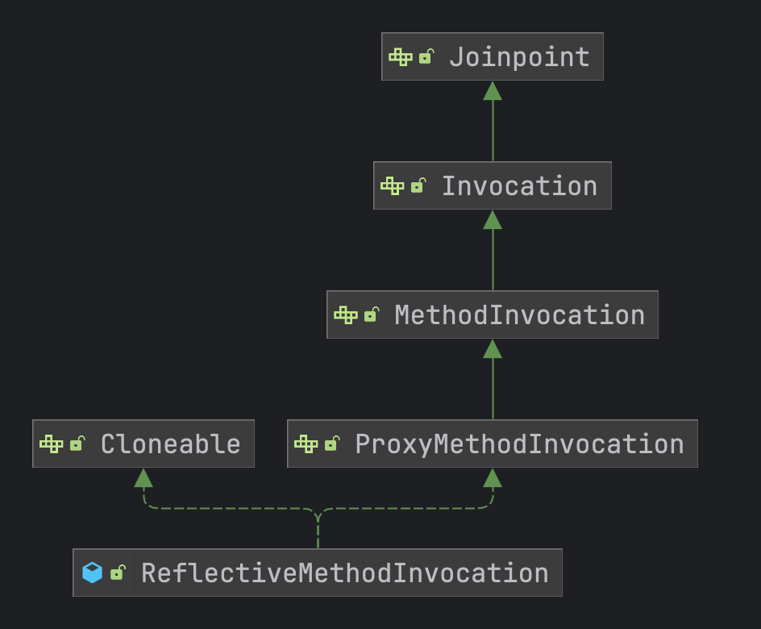
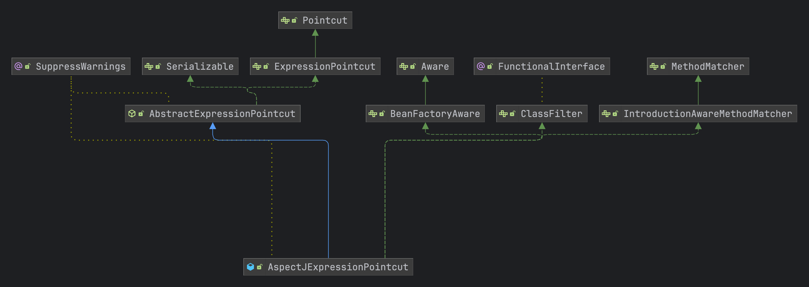
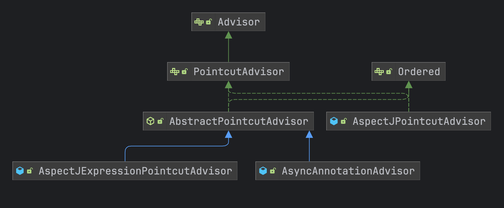

# Spring AOP体系源码

在spring中我们知道 `AOP` 切面是对事务、动态代理等功能增强的实现，现在我们就看看spring中是如何扫描并且创建出对应的代理对象并且添加切面的

 ## 1. 创建器(Creator)

下面三个扫描器，是在spring启动时根据是否开启 AOP、事务等功能时会自动注入类，根据优先级来进行注入

- InfrastructureAdvisorAutoProxyCreator：事务自动扫描器
- AspectJAwareAdvisorAutoProxyCreator：动态织入自动扫描器
- AnnotationAwareAspectJAutoProxyCreator：注解自动扫描器

其中继承体系，**AnnotationAwareAspectJAutoProxyCreator** 注解扫描器是等级最低的扫描器，它们都继承自 **AbstractAutoProxyCreator** 类

## 2. 通知类(Advice)

通知类在于aop切面执行时分别在不同的切点中执行的类，主要有：

- AspectJAfterReturningAdvice：方法执行成功了才会执行，异常不会执行
- AspectJAroundAdvice：环绕执行，前后都会进行执行
- AspectJAfterThrowingAdvice：抛出异常后执行
- AspectJAfterAdvice：不管方法执行成功还是失败都会执行
- AspectJMethodBeforeAdvice：方法之前执行s

## 3. 连接点(Joinpoint)

切点类也是真正动态代理执行的方法，在 **JdkDynamicAopProxy** 中创建 **ReflectiveMethodInvocation** 进行执行

## 4. 切点(Pointcut)

**Pointcut** 切点用于判断指定的方法或者类是否需要通过通知来执行，顶级 Pointcut定义两个属性：

- MethodMacher：用于判断方法
- ClassFilter：用于判断class类

## 4. 增强器(Advisor)

增强器则是用于聚合 **切点和通知类** 的类，里面会包含两个则属性

