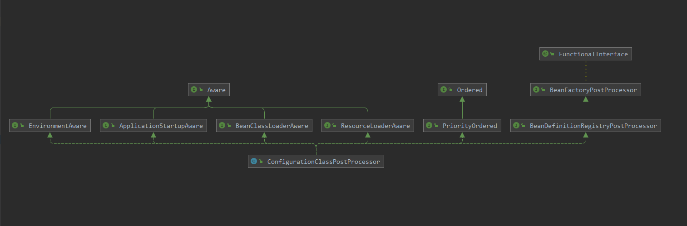
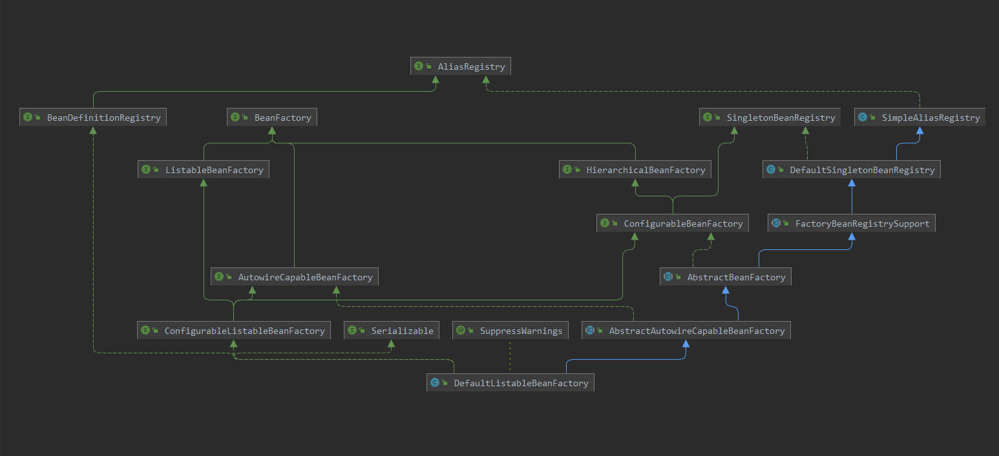
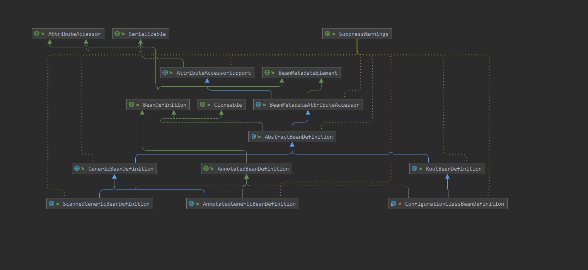

# 一、Bean扫描

前面分析了 **AnnotationConfigApplicationContext** 类中 **refresh** 方法的执行过程，本次就来研究一下spring bean的创建过程以及是如何进行依赖注入的

## 1. 成员类

在bean的创建过程中首先会将对应包下面的 **@Component** 注解标记的类扫描出来，在 **AnnotationConfigApplicationContext** 类的创建时为创建 **AnnotatedBeanDefinitionReader** 与 **ClassPathBeanDefinitionScanner** 两个成员类，一个用于读取数据，一个用于扫描类

```java
public AnnotationConfigApplicationContext() {
    //定义各种后置处理器
    StartupStep createAnnotatedBeanDefReader = this.getApplicationStartup().start("spring.context.annotated-bean-reader.create");
    this.reader = new AnnotatedBeanDefinitionReader(this);
    createAnnotatedBeanDefReader.end();
    this.scanner = new ClassPathBeanDefinitionScanner(this);
}
```

### 1.1 ClassPathBeanDefinitionScanner

```java
public ClassPathBeanDefinitionScanner(BeanDefinitionRegistry registry, boolean useDefaultFilters,
			Environment environment, @Nullable ResourceLoader resourceLoader) {
    this.registry = registry;
    //使用默认过滤器,默认会设置为true
    if (useDefaultFilters) {
        registerDefaultFilters();
    }
    //设置环境
    setEnvironment(environment);
    //设置资源加载器
    setResourceLoader(resourceLoader);
}

-----------------------------分割线------------------------------------

protected void registerDefaultFilters() {
    // 添加 Component、ManagedBean、Named等注解，便于扫描扫描含有注解的类
    this.includeFilters.add(new AnnotationTypeFilter(Component.class));
    ClassLoader cl = ClassPathScanningCandidateComponentProvider.class.getClassLoader();
    try {
        this.includeFilters.add(new AnnotationTypeFilter(
            ((Class<? extends Annotation>) ClassUtils.forName("javax.annotation.ManagedBean", cl)), false));
        logger.trace("JSR-250 'javax.annotation.ManagedBean' found and supported for component scanning");
    }
    catch (ClassNotFoundException ex) {
        
    }
    try {
        this.includeFilters.add(new AnnotationTypeFilter(
            ((Class<? extends Annotation>) ClassUtils.forName("javax.inject.Named", cl)), false));
        logger.trace("JSR-330 'javax.inject.Named' annotation found and supported for component scanning");
    }
    catch (ClassNotFoundException ex) {
        
    }
}
```

### 1.2 AnnotatedBeanDefinitionReader

```java
public AnnotatedBeanDefinitionReader(BeanDefinitionRegistry registry, Environment environment) {
    Assert.notNull(registry, "BeanDefinitionRegistry must not be null");
    Assert.notNull(environment, "Environment must not be null");
    this.registry = registry;
    //创建一个条件处理器
    this.conditionEvaluator = new ConditionEvaluator(registry, environment, null);
    //将各种注解的处理器注册到容器当中
    AnnotationConfigUtils.registerAnnotationConfigProcessors(this.registry);
}
```

以下方法会注册容器中最初始的几个处理：

- ConfigurationClassPostProcessor：org.springframework.context.annotation.internalConfigurationAnnotationProcessor 组件扫描器，用于扫描配置类中的ComponentScan、Component、Bean等注解
- AutowiredAnnotationBeanPostProcessor：org.springframework.context.annotation.internalAutowiredAnnotationProcessor  自动注入处理器
- CommonAnnotationBeanPostProcessor：org.springframework.context.annotation.internalCommonAnnotationProcessor JSR-250注解处理器，如@Resouce
- PersistenceAnnotationBeanPostProcessor：org.springframework.context.annotation.internalPersistenceAnnotationProcessor  JPA支持后置处理器
- EventListenerMethodProcessor：org.springframework.context.event.internalEventListenerProcessor  事件监听处理器
- DefaultEventListenerFactory：org.springframework.context.event.internalEventListenerFactory  默认事件工厂类

```java
public static Set<BeanDefinitionHolder> registerAnnotationConfigProcessors(
			BeanDefinitionRegistry registry, @Nullable Object source) {
		DefaultListableBeanFactory beanFactory = unwrapDefaultListableBeanFactory(registry);
		if (beanFactory != null) {
			//设置依赖匹配器
			if (!(beanFactory.getDependencyComparator() instanceof AnnotationAwareOrderComparator)) {
				beanFactory.setDependencyComparator(AnnotationAwareOrderComparator.INSTANCE);
			}
			//设置自动注入解析器
			if (!(beanFactory.getAutowireCandidateResolver() instanceof ContextAnnotationAutowireCandidateResolver)) {
				beanFactory.setAutowireCandidateResolver(new ContextAnnotationAutowireCandidateResolver());
			}
		}
		/**
		 * BeanDefinitionHolder中存的是RootBeanDefinition
		 */
		Set<BeanDefinitionHolder> beanDefs = new LinkedHashSet<>(8);
		//注册配置类的处理器
		if (!registry.containsBeanDefinition(CONFIGURATION_ANNOTATION_PROCESSOR_BEAN_NAME)) {
			RootBeanDefinition def = new RootBeanDefinition(ConfigurationClassPostProcessor.class);
			def.setSource(source);
			beanDefs.add(registerPostProcessor(registry, def, CONFIGURATION_ANNOTATION_PROCESSOR_BEAN_NAME));
		}

		//配置自动注入注解的处理器
		if (!registry.containsBeanDefinition(AUTOWIRED_ANNOTATION_PROCESSOR_BEAN_NAME)) {
			RootBeanDefinition def = new RootBeanDefinition(AutowiredAnnotationBeanPostProcessor.class);
			def.setSource(source);
			beanDefs.add(registerPostProcessor(registry, def, AUTOWIRED_ANNOTATION_PROCESSOR_BEAN_NAME));
		}

		//处理JSR-250的注解处理器，如@Resouce
		if (jsr250Present && !registry.containsBeanDefinition(COMMON_ANNOTATION_PROCESSOR_BEAN_NAME)) {
			RootBeanDefinition def = new RootBeanDefinition(CommonAnnotationBeanPostProcessor.class);
			def.setSource(source);
			beanDefs.add(registerPostProcessor(registry, def, COMMON_ANNOTATION_PROCESSOR_BEAN_NAME));
		}

		// JPA 支持后置处理器
		if (jpaPresent && !registry.containsBeanDefinition(PERSISTENCE_ANNOTATION_PROCESSOR_BEAN_NAME)) {
			RootBeanDefinition def = new RootBeanDefinition();
			try {
				def.setBeanClass(ClassUtils.forName(PERSISTENCE_ANNOTATION_PROCESSOR_CLASS_NAME,
						AnnotationConfigUtils.class.getClassLoader()));
			}
			catch (ClassNotFoundException ex) {
				throw new IllegalStateException(
						"Cannot load optional framework class: " + PERSISTENCE_ANNOTATION_PROCESSOR_CLASS_NAME, ex);
			}
			def.setSource(source);
			beanDefs.add(registerPostProcessor(registry, def, PERSISTENCE_ANNOTATION_PROCESSOR_BEAN_NAME));
		}

		//EventListenerProcessor 事件监听处理器
		if (!registry.containsBeanDefinition(EVENT_LISTENER_PROCESSOR_BEAN_NAME)) {
			RootBeanDefinition def = new RootBeanDefinition(EventListenerMethodProcessor.class);
			def.setSource(source);
			beanDefs.add(registerPostProcessor(registry, def, EVENT_LISTENER_PROCESSOR_BEAN_NAME));
		}
		//EventListenerFactory 事件监听工厂类
		if (!registry.containsBeanDefinition(EVENT_LISTENER_FACTORY_BEAN_NAME)) {
			RootBeanDefinition def = new RootBeanDefinition(DefaultEventListenerFactory.class);
			def.setSource(source);
			beanDefs.add(registerPostProcessor(registry, def, EVENT_LISTENER_FACTORY_BEAN_NAME));
		}

		return beanDefs;
	}
```

## 2. 组件扫描

**AnnotationConfigApplicationContext** 类中有一个构造方法其中需要传入配置对象，而这个配置对象指定了需要扫描的组件路径；而对配置路径进行处理的则是 **ConfigurationClassPostProcessor** 

```java
public AnnotationConfigApplicationContext(Class<?>... componentClasses) {
		/**
		 * 先调用父类 GenericApplicationContext() 构造方法创建出工厂类 DefaultListableBeanFactory
		 * DefaultListableBeanFactory 中 又调用父类 AbstractAutowireCapableBeanFactory() 构造方法
		 * 设置 三个 ignoredDependencyInterfaces 忽略依赖检查和自动装配
		 * 	BeanNameAware
		 * 	BeanFactoryAware
		 * 	BeanClassLoaderAware
		 */
		this();
		/**
		 * 将传进来的配置类 转换成BeanDefinition 并且put到map中  this.aliasMap.put(alias, name);
		 * 使用 register() 进行注册的bean定义是使用的 AnnotatedGenericBeanDefinition 类
		 * 使用 scan() 方法进行扫描的bean定义是使用的 ScannedGenericBeanDefinition 类进行包装
		 * 默认spring自身的bean定义是使用的 RootBeanDefinition 类进行包装
		 */
		register(componentClasses);
		/**
		 * 最重要的方法，其中调用12个方法
		 */
		refresh();
	}
//例如下面这个类
@ComponentScan(basePackages = "com.spring.mytest")
@Configuration
public class ComponeentConfig {

}
```

### 2.1 ConfigurationClassPostProcessor



当前类实现了 **BeanDefinitionRegistryPostProcessor** 以及 **BeanFactoryPostProcessor** 也就是会在**refrsh()** 方法中的 **invokeBeanFactoryPostProcessors()** 进行处理

#### 2.1.1 invokeBeanFactoryPostProcessors

```java
protected void invokeBeanFactoryPostProcessors(ConfigurableListableBeanFactory beanFactory) {
		/**
		 * 1、判断 beanFactory 的类型是否是 BeanDefinitionRegistry
		 * 2、获取到实现了 BeanDefinitionRegistryPostProcessor 的bean对象
		 * 		ConfigurationClassPostProcessor 早先在 初始化时就注入了的配置处理类，根据其实现了 PriorityOrdered，Ordered 来决定执行顺序
		 * 3、invokeBeanFactoryPostProcessors() 执行其中所有 beanFactoryPostProcessor中的postProcessBeanFactory() 方法
		 * 4、invokeBeanFactoryPostProcessors() 执行其中类型 不是BeanDefinitionRegistryPostProcessor的后置处理器
		 *
		 * 执行 BeanFactoryPostProcessors：包括执行自定义的BeanFactoryPostProcessors类，以及加载配置类，扫描包路径下的Bean对象
		 * 优先执行 PriorityOrdered的实现类，并且这里会将Bean容器中加载的@Configuration类加载出来，包括将@Import注解以及ComponentScan等注解下面的类，注册到Bean容器中
		 * 然后执行 Ordered的BeanFactoryPostProcessors
		 */
		PostProcessorRegistrationDelegate.invokeBeanFactoryPostProcessors(beanFactory, getBeanFactoryPostProcessors());
		if (!NativeDetector.inNativeImage() && beanFactory.getTempClassLoader() == null && beanFactory.containsBean(LOAD_TIME_WEAVER_BEAN_NAME)) {
			beanFactory.addBeanPostProcessor(new LoadTimeWeaverAwareProcessor(beanFactory));
			beanFactory.setTempClassLoader(new ContextTypeMatchClassLoader(beanFactory.getBeanClassLoader()));
		}
	}
```

调用**org.springframework.context.support.PostProcessorRegistrationDelegate#invokeBeanFactoryPostProcessors()**

- 首先获取到容器中 BeanDefinitionRegistryPostProcessor 的实现类
- 判断其是否实现了 PriorityOrdered、Ordered等接口进行优先级的排序，然后通过spring容器进行创建，然后执行
- 再执行其中实现了BeanFactoryPostProcessor 的方法
- 然后获取到实现了 BeanFactoryPostProcessor 的实现类
- 判断其是否实现了 PriorityOrdered、Ordered等接口进行优先级的排序，然后通过spring容器进行创建，然后执行

```java
public static void invokeBeanFactoryPostProcessors(
			ConfigurableListableBeanFactory beanFactory, List<BeanFactoryPostProcessor> beanFactoryPostProcessors) {
		Set<String> processedBeans = new HashSet<>();

		if (beanFactory instanceof BeanDefinitionRegistry) {
			//强转beanFactory， DefaultListableBeanFactory 是其实现类
			BeanDefinitionRegistry registry = (BeanDefinitionRegistry) beanFactory;
			//其它实现了 BeanFactoryPostProcessor的子类
			List<BeanFactoryPostProcessor> regularPostProcessors = new ArrayList<>();
			//实现了 BeanDefinitionRegistryPostProcessor 的子类
			List<BeanDefinitionRegistryPostProcessor> registryProcessors = new ArrayList<>();
			//遍历bean工厂中的 beanFactoryPostProcessors
			/**
			 * BeanFactoryPostProcessor
			 * BeanDefinitionRegistryPostProcessor：BeanFactoryPostProcessor子接口，定义了 postProcessBeanDefinitionRegistry() bean定义注册方法
			 *
			 */
			for (BeanFactoryPostProcessor postProcessor : beanFactoryPostProcessors) {
				if (postProcessor instanceof BeanDefinitionRegistryPostProcessor) {
					BeanDefinitionRegistryPostProcessor registryProcessor =
							(BeanDefinitionRegistryPostProcessor) postProcessor;
					//调用实现了 BeanDefinitionRegistryPostProcessor 接口的方法
					registryProcessor.postProcessBeanDefinitionRegistry(registry);
					//将registryProcessor对象添加到 registryProcessors list中
					registryProcessors.add(registryProcessor);
				}
				else {
					//否则添加到 regularPostProcessors
					regularPostProcessors.add(postProcessor);
				}
			}
			List<BeanDefinitionRegistryPostProcessor> currentRegistryProcessors = new ArrayList<>();

			// First, invoke the BeanDefinitionRegistryPostProcessors that implement PriorityOrdered.
			/**
			 * 获取到实现了BeanDefinitionRegistryPostProcessor接口的处理器：重点是 ConfigurationClassPostProcessor
			 */
			String[] postProcessorNames =
					beanFactory.getBeanNamesForType(BeanDefinitionRegistryPostProcessor.class, true, false);
			for (String ppName : postProcessorNames) {
				//是否实现了 PriorityOrdered 接口
				if (beanFactory.isTypeMatch(ppName, PriorityOrdered.class)) {
					//先将其对应的处理器进行实例化
					currentRegistryProcessors.add(beanFactory.getBean(ppName, BeanDefinitionRegistryPostProcessor.class));
					processedBeans.add(ppName);
				}
			}
			//排序
			sortPostProcessors(currentRegistryProcessors, beanFactory);
			registryProcessors.addAll(currentRegistryProcessors);
			/**
			 * 会去执行配置类 ConfigurationClassPostProcessor，并且扫描对应的包下的组件
			 */
			invokeBeanDefinitionRegistryPostProcessors(currentRegistryProcessors, registry, beanFactory.getApplicationStartup());
			currentRegistryProcessors.clear();

			// Next, invoke the BeanDefinitionRegistryPostProcessors that implement Ordered.
			/**
			 * 执行实现了 Ordered接口的 BeanFactoryPostProcessor，是否存在processedBeans中，如果存在了 就代表已经执行过
			 */
			postProcessorNames = beanFactory.getBeanNamesForType(BeanDefinitionRegistryPostProcessor.class, true, false);
			for (String ppName : postProcessorNames) {
				if (!processedBeans.contains(ppName) && beanFactory.isTypeMatch(ppName, Ordered.class)) {
					currentRegistryProcessors.add(beanFactory.getBean(ppName, BeanDefinitionRegistryPostProcessor.class));
					processedBeans.add(ppName);
				}
			}
			sortPostProcessors(currentRegistryProcessors, beanFactory);
			registryProcessors.addAll(currentRegistryProcessors);
			invokeBeanDefinitionRegistryPostProcessors(currentRegistryProcessors, registry, beanFactory.getApplicationStartup());
			currentRegistryProcessors.clear();
			boolean reiterate = true;
			while (reiterate) {
				reiterate = false;
				//获取实现了BeanDefinitionRegistryPostProcessor的类，并且没有实现 PriorityOrdered\Ordered等接口的类
				postProcessorNames = beanFactory.getBeanNamesForType(BeanDefinitionRegistryPostProcessor.class, true, false);
				for (String ppName : postProcessorNames) {
					if (!processedBeans.contains(ppName)) {
						currentRegistryProcessors.add(beanFactory.getBean(ppName, BeanDefinitionRegistryPostProcessor.class));
						processedBeans.add(ppName);
						reiterate = true;
					}
				}
				sortPostProcessors(currentRegistryProcessors, beanFactory);
				registryProcessors.addAll(currentRegistryProcessors);
				//执行没有实现 PriorityOrdered\Ordered 接口的类
				invokeBeanDefinitionRegistryPostProcessors(currentRegistryProcessors, registry, beanFactory.getApplicationStartup());
				currentRegistryProcessors.clear();
			}

			//执行所有BeanDefinitionRegistryPostProcessor中的postProcessBeanFactory() 方法
			invokeBeanFactoryPostProcessors(registryProcessors, beanFactory);
			//执行其他实现了 BeanFactoryPostProcessor 的 postProcessBeanFactory方法
			invokeBeanFactoryPostProcessors(regularPostProcessors, beanFactory);
		}

		else {
			invokeBeanFactoryPostProcessors(beanFactoryPostProcessors, beanFactory);
		}
		/**
		 * 扫描出自定义的 BeanFactoryPostProcessors
		 */
		String[] postProcessorNames =
				beanFactory.getBeanNamesForType(BeanFactoryPostProcessor.class, true, false);
		List<BeanFactoryPostProcessor> priorityOrderedPostProcessors = new ArrayList<>();
		List<String> orderedPostProcessorNames = new ArrayList<>();
		List<String> nonOrderedPostProcessorNames = new ArrayList<>();
		for (String ppName : postProcessorNames) {
			if (processedBeans.contains(ppName)) {
			}
			else if (beanFactory.isTypeMatch(ppName, PriorityOrdered.class)) {
				priorityOrderedPostProcessors.add(beanFactory.getBean(ppName, BeanFactoryPostProcessor.class));
			}
			else if (beanFactory.isTypeMatch(ppName, Ordered.class)) {
				orderedPostProcessorNames.add(ppName);
			}
			else {
				nonOrderedPostProcessorNames.add(ppName);
			}
		}
		sortPostProcessors(priorityOrderedPostProcessors, beanFactory);
		invokeBeanFactoryPostProcessors(priorityOrderedPostProcessors, beanFactory);
		List<BeanFactoryPostProcessor> orderedPostProcessors = new ArrayList<>(orderedPostProcessorNames.size());
		for (String postProcessorName : orderedPostProcessorNames) {
			orderedPostProcessors.add(beanFactory.getBean(postProcessorName, BeanFactoryPostProcessor.class));
		}
		sortPostProcessors(orderedPostProcessors, beanFactory);
		invokeBeanFactoryPostProcessors(orderedPostProcessors, beanFactory);
		List<BeanFactoryPostProcessor> nonOrderedPostProcessors = new ArrayList<>(nonOrderedPostProcessorNames.size());
		for (String postProcessorName : nonOrderedPostProcessorNames) {
			/**
			 * 会去bean工厂里面获取到BeanFactoryPostProcessor字类实现
			 */
			nonOrderedPostProcessors.add(beanFactory.getBean(postProcessorName, BeanFactoryPostProcessor.class));
		}
		/**
		 * 最后执行自定义的BeanFactoryPostProcessor
		 */
		invokeBeanFactoryPostProcessors(nonOrderedPostProcessors, beanFactory);
		beanFactory.clearMetadataCache();
	}
```

#### 2.1.2 postProcessBeanDefinitionRegistry

```java
public void postProcessBeanDefinitionRegistry(BeanDefinitionRegistry registry) {
    //根据bean工厂生成注册id，防止进行重复执行
		int registryId = System.identityHashCode(registry);
		if (this.registriesPostProcessed.contains(registryId)) {
			throw new IllegalStateException(
					"postProcessBeanDefinitionRegistry already called on this post-processor against " + registry);
		}
		if (this.factoriesPostProcessed.contains(registryId)) {
			throw new IllegalStateException(
					"postProcessBeanFactory already called on this post-processor against " + registry);
		}
		this.registriesPostProcessed.add(registryId);

		processConfigBeanDefinitions(registry);
	}
-------------------------------------------分割线-----------------------------------------
 public void processConfigBeanDefinitions(BeanDefinitionRegistry registry) {
		List<BeanDefinitionHolder> configCandidates = new ArrayList<>();
		//先去获取容器所有的bean定义名称，优先返回被冻结的bean定义名称，如果没有就返回beanDefinitionNames数组，已经定义到spring容器中
		String[] candidateNames = registry.getBeanDefinitionNames();

		for (String beanName : candidateNames) {
			/**
			 * AnnotatedGenericBeanDefinition、ScannedGenericBeanDefinition 继承了 GenericBeanDefinition 继承 AbstractBeanDefinition 继承
			 * BeanMetadataAttributeAccessor
			 * RootBeanDefinition 继承 AbstractBeanDefinition 继承 BeanMetadataAttributeAccessor
			 */
			BeanDefinition beanDef = registry.getBeanDefinition(beanName);
			//判断是否 configurationClass 属性，如果有，就代表已经作为一个配置类，准备进行解析
			if (beanDef.getAttribute(ConfigurationClassUtils.CONFIGURATION_CLASS_ATTRIBUTE) != null) {
				if (logger.isDebugEnabled()) {
					logger.debug("Bean definition has already been processed as a configuration class: " + beanDef);
				}
			}
			/**
			 * 目的是解析Bean工厂当中是否有含有 @Configuration，并且获取@order注解，设置加载顺序，并且在元数据信息里面设置 configurationClass
			 */
			else if (ConfigurationClassUtils.checkConfigurationClassCandidate(beanDef, this.metadataReaderFactory)) {
				configCandidates.add(new BeanDefinitionHolder(beanDef, beanName));
			}
		}
		if (configCandidates.isEmpty()) {
			return;
		}
		/**
		 * 根据Order注解中的值进行排序
		 */
		configCandidates.sort((bd1, bd2) -> {
			int i1 = ConfigurationClassUtils.getOrder(bd1.getBeanDefinition());
			int i2 = ConfigurationClassUtils.getOrder(bd2.getBeanDefinition());
			return Integer.compare(i1, i2);
		});
		SingletonBeanRegistry sbr = null;
		if (registry instanceof SingletonBeanRegistry) {
			sbr = (SingletonBeanRegistry) registry;
			if (!this.localBeanNameGeneratorSet) {
				//获取一个bean名称生成器
				BeanNameGenerator generator = (BeanNameGenerator) sbr.getSingleton(
						AnnotationConfigUtils.CONFIGURATION_BEAN_NAME_GENERATOR);
				if (generator != null) {
					//初始化一个 componentScan扫描器，主要处理componentScans 和 componentScan
					this.componentScanBeanNameGenerator = generator;
					//初始化一个bean名称的生成器，主要目的是将扫描出的配置类，封装成bean定义注册到spring容器中
					this.importBeanNameGenerator = generator;
				}
			}
		}

		if (this.environment == null) {
			this.environment = new StandardEnvironment();
		}

		// 初始化一个 Configuration注解的解析器，通过注解解析器，对上面获取到的配置类进行解析
		ConfigurationClassParser parser = new ConfigurationClassParser(
				this.metadataReaderFactory, this.problemReporter, this.environment,
				this.resourceLoader, this.componentScanBeanNameGenerator, registry);

		//将需要解析的类转换成set
		Set<BeanDefinitionHolder> candidates = new LinkedHashSet<>(configCandidates);
		//创建已经被解析的配置对象set
		Set<ConfigurationClass> alreadyParsed = new HashSet<>(configCandidates.size());
		do {
			StartupStep processConfig = this.applicationStartup.start("spring.context.config-classes.parse");
			/**
			 * 解析配置类，只会注册包扫描的bean
			 */
			parser.parse(candidates);
			parser.validate();
			//获取出所有解析的类
			Set<ConfigurationClass> configClasses = new LinkedHashSet<>(parser.getConfigurationClasses());
			//从中移除已经加载了的类
			configClasses.removeAll(alreadyParsed);

			//创建配置类bean定义读取器
			if (this.reader == null) {
				this.reader = new ConfigurationClassBeanDefinitionReader(
						registry, this.sourceExtractor, this.resourceLoader, this.environment,
						this.importBeanNameGenerator, parser.getImportRegistry());
			}
			/**
			 * 将上面扫描出的配置类信息，作为bean定义注册到spring容器当中
			 */
			this.reader.loadBeanDefinitions(configClasses);
			//将已经被注册的bean定义添加到被已经被解析的集合中
			alreadyParsed.addAll(configClasses);
			processConfig.tag("classCount", () -> String.valueOf(configClasses.size())).end();

			//临时保存需要清空
			candidates.clear();
			/**
			 * 验证 扫描包之后Bean容器中的数量是否大于 最开始时Bean容器中的数量
			 */
			if (registry.getBeanDefinitionCount() > candidateNames.length) {
				String[] newCandidateNames = registry.getBeanDefinitionNames();
				/**
				 * 最开始时的Bean对象集合，在还没有开始解析配置对象的时候
				 */
				Set<String> oldCandidateNames = new HashSet<>(Arrays.asList(candidateNames));
				Set<String> alreadyParsedClasses = new HashSet<>();
				/**
				 * 将扫描出的类，添加到已经解析好的集合当中
				 */
				for (ConfigurationClass configurationClass : alreadyParsed) {
					alreadyParsedClasses.add(configurationClass.getMetadata().getClassName());
				}
				for (String candidateName : newCandidateNames) {
					/**
					 * 判定已经解析好的对象是否存在于Bean容器中，如果不存在就继续执行添加
					 */
					if (!oldCandidateNames.contains(candidateName)) {
						BeanDefinition bd = registry.getBeanDefinition(candidateName);
						if (ConfigurationClassUtils.checkConfigurationClassCandidate(bd, this.metadataReaderFactory) &&
								!alreadyParsedClasses.contains(bd.getBeanClassName())) {
							candidates.add(new BeanDefinitionHolder(bd, candidateName));
						}
					}
				}
				candidateNames = newCandidateNames;
			}
		}
		while (!candidates.isEmpty());
		/**
		 * 将parser解析器中的ImportRegistry作为Bean注册到Bean容器中
		 */
		if (sbr != null && !sbr.containsSingleton(IMPORT_REGISTRY_BEAN_NAME)) {
			sbr.registerSingleton(IMPORT_REGISTRY_BEAN_NAME, parser.getImportRegistry());
		}
		if (this.metadataReaderFactory instanceof CachingMetadataReaderFactory) {
			((CachingMetadataReaderFactory) this.metadataReaderFactory).clearCache();
		}
	}   

```


#### 2.1.3 parse()

调用 **org.springframework.context.annotation.ConfigurationClassParser#parse()** 方法对配置类进行解析，


```java
public void parse(Set<BeanDefinitionHolder> configCandidates) {
		for (BeanDefinitionHolder holder : configCandidates) {
			BeanDefinition bd = holder.getBeanDefinition();
			try {
				/**
				 * 判断当前bean是否是系统自行注册（RootBeanDefinition）
				 * 还是用户注册 (ConfigurationClassBeanDefinition,AnnotationGenericBeanDefinition,ScannerGenericBeanDefinition)
				 */
				if (bd instanceof AnnotatedBeanDefinition) {
					parse(((AnnotatedBeanDefinition) bd).getMetadata(), holder.getBeanName());
				}
				//系统注册走当前分支
				else if (bd instanceof AbstractBeanDefinition && ((AbstractBeanDefinition) bd).hasBeanClass()) {
					parse(((AbstractBeanDefinition) bd).getBeanClass(), holder.getBeanName());
				}
				else {
					parse(bd.getBeanClassName(), holder.getBeanName());
				}
			}
			catch (BeanDefinitionStoreException ex) {
				throw ex;
			}
			catch (Throwable ex) {
				throw new BeanDefinitionStoreException(
						"Failed to parse configuration class [" + bd.getBeanClassName() + "]", ex);
			}
		}

		this.deferredImportSelectorHandler.process();
	}


----------------------------------------分割线---------------------------------------------
    
 protected void processConfigurationClass(ConfigurationClass configClass, Predicate<String> filter) throws IOException {
		//处理条件注解 @Conditional，是否应该跳过
		if (this.conditionEvaluator.shouldSkip(configClass.getMetadata(), ConfigurationPhase.PARSE_CONFIGURATION)) {
			return;
		}
		//首先判断配置类缓存中是否存在
		ConfigurationClass existingClass = this.configurationClasses.get(configClass);
		if (existingClass != null) {
			//判断当前对象是否是通过 Imported注解进行导入
			if (configClass.isImported()) {
				//判断存在的配置对象是否也是Imported导入
				if (existingClass.isImported()) {
					//将两个配置对象进行合并
					existingClass.mergeImportedBy(configClass);
				}
				return;
			}
			else {
				//否则移除掉配置文件
				this.configurationClasses.remove(configClass);
				this.knownSuperclasses.values().removeIf(configClass::equals);
			}
		}
		//将 ConfigurationClass 对象转换为 SourceClass
		SourceClass sourceClass = asSourceClass(configClass, filter);
		do {
			/**
			 * 对当前配置类中的各种配置注解进行解析
			 */
			sourceClass = doProcessConfigurationClass(configClass, sourceClass, filter);
		}
		while (sourceClass != null);
		//将已经处理了的配置类，保存到缓存中，方便外层进行获取
		this.configurationClasses.put(configClass, configClass);
	}
```

#### 2.1.4 doProcessConfigurationClass()

当前方法主要是将 @Component注解进行解析，包括成员类中是否也包含了当前注解；处理@PropertySource文件；处理配置类中 @ComponenScan 注解，并且扫描对应的包路径下面的类

```java
protected final SourceClass doProcessConfigurationClass(
			ConfigurationClass configClass, SourceClass sourceClass, Predicate<String> filter)
			throws IOException {
		/**
		 * 判定当前配置是否有 @Component注解包括其中的内部类
		 */
		if (configClass.getMetadata().isAnnotated(Component.class.getName())) {
			// Recursively process any member (nested) classes first
			processMemberClasses(configClass, sourceClass, filter);
		}
		//解析@PropertySource注解引入的配置文件
		for (AnnotationAttributes propertySource : AnnotationConfigUtils.attributesForRepeatable(
				sourceClass.getMetadata(), PropertySources.class,
				org.springframework.context.annotation.PropertySource.class)) {
			if (this.environment instanceof ConfigurableEnvironment) {
				processPropertySource(propertySource);
			}
			else {
				logger.info("Ignoring @PropertySource annotation on [" + sourceClass.getMetadata().getClassName() +
						"]. Reason: Environment must implement ConfigurableEnvironment");
			}
		}
		/**
		 * 获取到 ComponentScan注解扫描对应的包下面的组件，并且解析下面类中的Configuration注解
		 */
		Set<AnnotationAttributes> componentScans = AnnotationConfigUtils.attributesForRepeatable(
				sourceClass.getMetadata(), ComponentScans.class, ComponentScan.class);
		if (!componentScans.isEmpty() &&
				!this.conditionEvaluator.shouldSkip(sourceClass.getMetadata(), ConfigurationPhase.REGISTER_BEAN)) {
			for (AnnotationAttributes componentScan : componentScans) {
				/**
				 * 将扫描到的类包装成 BeanDefinitionHolder并且注册到Bean容器中，并且再去获取到是否含有Configuration注解，递归
				 */
				Set<BeanDefinitionHolder> scannedBeanDefinitions =
						this.componentScanParser.parse(componentScan, sourceClass.getMetadata().getClassName());
				for (BeanDefinitionHolder holder : scannedBeanDefinitions) {
					BeanDefinition bdCand = holder.getBeanDefinition().getOriginatingBeanDefinition();
					if (bdCand == null) {
						bdCand = holder.getBeanDefinition();
					}
					if (ConfigurationClassUtils.checkConfigurationClassCandidate(bdCand, this.metadataReaderFactory)) {
						parse(bdCand.getBeanClassName(), holder.getBeanName());
					}
				}
			}
		}

		/**
		 * getImports(sourceClass)：递归调用@Import中包含的所有
		 * 查看当前类中是否含有 @Import注解
		 * getImports(sourceClass):获取到Import注解中是否包含Import注解
		 * Import中 可以实现  ImportSelector 和 ImportBeanDefinitionRegistrar 两个接口或者不需要实现
		 * ImportSelector：调用 selectImports() 方法，将返回的对象继续作为Import类进行解析 循环调用processImports()方法
		 * ImportBeanDefinitionRegistrar：将会将其添加到 ConfigClass中i mportBeanDefinitionRegistrar属性中由 ConfigurationClassPostProcessor：
		 * this.reader.loadBeanDefinitions(configClasses) 中进行调用，并且将其注册到容器中
		 *
		 * ImportSelector：Import导入配置类可以实现当前接口；只需要注册到容器中，可以实现 ImportBeanDefinitionRegistrar
		 */
		processImports(configClass, sourceClass, getImports(sourceClass), filter, true);

		// Process any @ImportResource annotations
		/**
		 * 解析当前配置中是否含有 @ImportResource 注解
		 */
		AnnotationAttributes importResource =
				AnnotationConfigUtils.attributesFor(sourceClass.getMetadata(), ImportResource.class);
		if (importResource != null) {
			String[] resources = importResource.getStringArray("locations");
			Class<? extends BeanDefinitionReader> readerClass = importResource.getClass("reader");
			for (String resource : resources) {
				String resolvedResource = this.environment.resolveRequiredPlaceholders(resource);
				configClass.addImportedResource(resolvedResource, readerClass);
			}
		}

		/**
		 * 扫描当前配置类中 是否含有 @Bean注解定义的方法，并且将其添加到BeanMethod中，执行后添加到Bean容器中
		 */
		Set<MethodMetadata> beanMethods = retrieveBeanMethodMetadata(sourceClass);
		for (MethodMetadata methodMetadata : beanMethods) {
			configClass.addBeanMethod(new BeanMethod(methodMetadata, configClass));
		}

		//获取接口上方法中包含了 @Bean注解的方法
		processInterfaces(configClass, sourceClass);

		//获取到当前类是否有父类，并且还没有解析，返回出去，外层进行循环解析
		if (sourceClass.getMetadata().hasSuperClass()) {
			String superclass = sourceClass.getMetadata().getSuperClassName();
			if (superclass != null && !superclass.startsWith("java") &&
					!this.knownSuperclasses.containsKey(superclass)) {
				this.knownSuperclasses.put(superclass, configClass);
				// Superclass found, return its annotation metadata and recurse
				return sourceClass.getSuperClass();
			}
		}

		// No superclass -> processing is complete
		return null;
	}
```

#### 2.1.5 processImports()

当前方法对配置类中@Import注解进行处理，循环递归获取所有注解中包含的@Import注解，然后根据类型执行相应的方法，如果实现了 **ImportSelector** 类型，那么直接执行 **selectImports()** 方法；如果实现了 **ImportBeanDefinitionRegistrar** 类，就将其添加到 **ConfigurationClass** 类中的 importBeanDefinitionRegistrars 属性，在后续配置处理完之后会在 **org.springframework.context.annotation.ConfigurationClassBeanDefinitionReader#loadBeanDefinitions** 方法中进行处理

```java

private void processImports(ConfigurationClass configClass, SourceClass currentSourceClass,
			Collection<SourceClass> importCandidates, Predicate<String> exclusionFilter,
			boolean checkForCircularImports) {

		if (importCandidates.isEmpty()) {
			return;
		}
		if (checkForCircularImports && isChainedImportOnStack(configClass)) {
			this.problemReporter.error(new CircularImportProblem(configClass, this.importStack));
		}
		else {
			//导入堆栈中，证明当前配置类已经开始在解析
			this.importStack.push(configClass);
			try {
				for (SourceClass candidate : importCandidates) {
					//处理当前Import是否是 ImportSelector 的实现类
					if (candidate.isAssignable(ImportSelector.class)) {
						Class<?> candidateClass = candidate.loadClass();
						ImportSelector selector = ParserStrategyUtils.instantiateClass(candidateClass, ImportSelector.class,
								this.environment, this.resourceLoader, this.registry);
						Predicate<String> selectorFilter = selector.getExclusionFilter();
						if (selectorFilter != null) {
							exclusionFilter = exclusionFilter.or(selectorFilter);
						}
						if (selector instanceof DeferredImportSelector) {
							this.deferredImportSelectorHandler.handle(configClass, (DeferredImportSelector) selector);
						}
						else {
							//调用 selector 中实现了的 selectImports 方法，将返回的类名称转换成 SourceClass进行处理，然后通过 processImports()进行循环递归处理
							String[] importClassNames = selector.selectImports(currentSourceClass.getMetadata());
							Collection<SourceClass> importSourceClasses = asSourceClasses(importClassNames, exclusionFilter);
							//获取到 selectImports 方法返回的class类后，继续作为Import导入的类进行解析
							processImports(configClass, currentSourceClass, importSourceClasses, exclusionFilter, false);
						}
					}
					//如果导入的值实现了 ImportBeanDefinitionRegistrar接口，那么就将其添加到 importBeanDefinitionRegistrars 中
					else if (candidate.isAssignable(ImportBeanDefinitionRegistrar.class)) {
						Class<?> candidateClass = candidate.loadClass();
						ImportBeanDefinitionRegistrar registrar =
								ParserStrategyUtils.instantiateClass(candidateClass, ImportBeanDefinitionRegistrar.class,
										this.environment, this.resourceLoader, this.registry);
						// 提供给外层解析完之后，this.reader.loadBeanDefinitions(configClasses); 当中进行调用，并且直接注册到spring容器中
						configClass.addImportBeanDefinitionRegistrar(registrar, currentSourceClass.getMetadata());
					}
					else {
						//都没有实现，就将其保存到 imports 当中，并且继续作为一个配置类进行处理
						this.importStack.registerImport(
								currentSourceClass.getMetadata(), candidate.getMetadata().getClassName());
						processConfigurationClass(candidate.asConfigClass(configClass), exclusionFilter);
					}
				}
			}
			catch (BeanDefinitionStoreException ex) {
				throw ex;
			}
			catch (Throwable ex) {
				throw new BeanDefinitionStoreException(
						"Failed to process import candidates for configuration class [" +
						configClass.getMetadata().getClassName() + "]", ex);
			}
			finally {
				this.importStack.pop();
			}
		}
	}
```

#### 2.1.6 loadBeanDefinitions()

```java
private void loadBeanDefinitionsForConfigurationClass(
			ConfigurationClass configClass, TrackedConditionEvaluator trackedConditionEvaluator) {

		//判断配置类是否需要跳过，处理 @Conditional 条件注解
		if (trackedConditionEvaluator.shouldSkip(configClass)) {
			String beanName = configClass.getBeanName();
			if (StringUtils.hasLength(beanName) && this.registry.containsBeanDefinition(beanName)) {
				this.registry.removeBeanDefinition(beanName);
			}
			this.importRegistry.removeImportingClass(configClass.getMetadata().getClassName());
			return;
		}
		//判断当前类是通过import 导入还是通过其他方式导入
		if (configClass.isImported()) {
			registerBeanDefinitionForImportedConfigurationClass(configClass);
		}
		/**
		 * 获取到配置类中的 @Bean 方法并且push到Bean容器中
		 */
		for (BeanMethod beanMethod : configClass.getBeanMethods()) {
			loadBeanDefinitionsForBeanMethod(beanMethod);
		}
		/**
		 * 从 ImportedResource导入的配置文件中导入Bean
		 */
		loadBeanDefinitionsFromImportedResources(configClass.getImportedResources());
		/**
		 * 获取到导入的Registrar类 比如 Aop的配置类 AspectJAutoProxyRegistrar，并且向容器中注册 AnnotationAwareAspectJAutoProxyCreator（aop）处理器
		 */
		loadBeanDefinitionsFromRegistrars(configClass.getImportBeanDefinitionRegistrars());
	}
```

##### registerBeanDefinitionForImportedConfigurationClass()

```java
private void registerBeanDefinitionForImportedConfigurationClass(ConfigurationClass configClass) {
		AnnotationMetadata metadata = configClass.getMetadata();
		AnnotatedGenericBeanDefinition configBeanDef = new AnnotatedGenericBeanDefinition(metadata);

		ScopeMetadata scopeMetadata = scopeMetadataResolver.resolveScopeMetadata(configBeanDef);
		configBeanDef.setScope(scopeMetadata.getScopeName());
		//生成bea的名称
		String configBeanName = this.importBeanNameGenerator.generateBeanName(configBeanDef, this.registry);
		/**
		 * 解析当前配置类中是否存在一下注解，并且设置对应的值
		 * Lazy
		 * Primary
		 * DependsOn
		 * Role
		 * Description
		 */
		AnnotationConfigUtils.processCommonDefinitionAnnotations(configBeanDef, metadata);

		BeanDefinitionHolder definitionHolder = new BeanDefinitionHolder(configBeanDef, configBeanName);
		definitionHolder = AnnotationConfigUtils.applyScopedProxyMode(scopeMetadata, definitionHolder, this.registry);
		//注册到spring容器当中
		this.registry.registerBeanDefinition(definitionHolder.getBeanName(), definitionHolder.getBeanDefinition());
		configClass.setBeanName(configBeanName);

		if (logger.isTraceEnabled()) {
			logger.trace("Registered bean definition for imported class '" + configBeanName + "'");
		}
	}
```

##### loadBeanDefinitionsForBeanMethod()

构建@Bean注解标记的方法的beanDefinetion

```java
private void loadBeanDefinitionsForBeanMethod(BeanMethod beanMethod) {
		ConfigurationClass configClass = beanMethod.getConfigurationClass();
		MethodMetadata metadata = beanMethod.getMetadata();
		String methodName = metadata.getMethodName();

		// Do we need to mark the bean as skipped by its condition?
		//验证当前bean方法创建的对象是否需要跳过
		if (this.conditionEvaluator.shouldSkip(metadata, ConfigurationPhase.REGISTER_BEAN)) {
			configClass.skippedBeanMethods.add(methodName);
			return;
		}
		if (configClass.skippedBeanMethods.contains(methodName)) {
			return;
		}

		//获取到@Bean注解的属性
		AnnotationAttributes bean = AnnotationConfigUtils.attributesFor(metadata, Bean.class);
		Assert.state(bean != null, "No @Bean annotation attributes");

		// Consider name and any aliases
		//获取注册bean的别名
		List<String> names = new ArrayList<>(Arrays.asList(bean.getStringArray("name")));
		String beanName = (!names.isEmpty() ? names.remove(0) : methodName);

		// Register aliases even when overridden
		for (String alias : names) {
			//将别名注册到spring容器中
			this.registry.registerAlias(beanName, alias);
		}

		// Has this effectively been overridden before (e.g. via XML)?
		/**
		 * 验证当前bean定义是否可以覆盖已经存在的bean定义
		 * 1、验证当前bean类型是否是 ConfigurationClassBeanDefinition 配置类进行创建
		 * 2、验证是否是 ScannedGenericBeanDefinition 进行创建
		 * 3、根据角色进行判断，如果大于就保留现有的
		 * 4、最后在判断 isAllowBeanDefinitionOverriding 是否为true
		 */
		if (isOverriddenByExistingDefinition(beanMethod, beanName)) {
			if (beanName.equals(beanMethod.getConfigurationClass().getBeanName())) {
				throw new BeanDefinitionStoreException(beanMethod.getConfigurationClass().getResource().getDescription(),
						beanName, "Bean name derived from @Bean method '" + beanMethod.getMetadata().getMethodName() +
						"' clashes with bean name for containing configuration class; please make those names unique!");
			}
			return;
		}

		ConfigurationClassBeanDefinition beanDef = new ConfigurationClassBeanDefinition(configClass, metadata, beanName);
		beanDef.setSource(this.sourceExtractor.extractSource(metadata, configClass.getResource()));
		//是否是静态方法
		if (metadata.isStatic()) {
			// static @Bean method
			if (configClass.getMetadata() instanceof StandardAnnotationMetadata) {
				beanDef.setBeanClass(((StandardAnnotationMetadata) configClass.getMetadata()).getIntrospectedClass());
			}
			else {
				beanDef.setBeanClassName(configClass.getMetadata().getClassName());
			}
			beanDef.setUniqueFactoryMethodName(methodName);
		}
		else {
			// instance @Bean method
			beanDef.setFactoryBeanName(configClass.getBeanName());
			beanDef.setUniqueFactoryMethodName(methodName);
		}

		if (metadata instanceof StandardMethodMetadata) {
			beanDef.setResolvedFactoryMethod(((StandardMethodMetadata) metadata).getIntrospectedMethod());
		}
		/**
		 * 设置自动注入模式
		 * AUTOWIRE_CONSTRUCTOR：按照构造方法注入
		 * AUTOWIRE_BY_TYPE：按照类型注入
		 * AUTOWIRE_BY_NAME：按照名字注入
		 * AUTOWIRE_NO：不需要注入
		 * AUTOWIRE_AUTODETECT：按照自省的方式进行注入
		 */
		beanDef.setAutowireMode(AbstractBeanDefinition.AUTOWIRE_CONSTRUCTOR);
		beanDef.setAttribute(org.springframework.beans.factory.annotation.RequiredAnnotationBeanPostProcessor.
				SKIP_REQUIRED_CHECK_ATTRIBUTE, Boolean.TRUE);
		AnnotationConfigUtils.processCommonDefinitionAnnotations(beanDef, metadata);

		Autowire autowire = bean.getEnum("autowire");
		if (autowire.isAutowire()) {
			beanDef.setAutowireMode(autowire.value());
		}

		boolean autowireCandidate = bean.getBoolean("autowireCandidate");
		if (!autowireCandidate) {
			beanDef.setAutowireCandidate(false);
		}

		String initMethodName = bean.getString("initMethod");
		if (StringUtils.hasText(initMethodName)) {
			beanDef.setInitMethodName(initMethodName);
		}

		String destroyMethodName = bean.getString("destroyMethod");
		beanDef.setDestroyMethodName(destroyMethodName);

		ScopedProxyMode proxyMode = ScopedProxyMode.NO;
		//获取到bean定义的作用范围
		AnnotationAttributes attributes = AnnotationConfigUtils.attributesFor(metadata, Scope.class);
		if (attributes != null) {
			beanDef.setScope(attributes.getString("value"));
			proxyMode = attributes.getEnum("proxyMode");
			if (proxyMode == ScopedProxyMode.DEFAULT) {
				proxyMode = ScopedProxyMode.NO;
			}
		}

		// Replace the original bean definition with the target one, if necessary
		BeanDefinition beanDefToRegister = beanDef;
		if (proxyMode != ScopedProxyMode.NO) {
			BeanDefinitionHolder proxyDef = ScopedProxyCreator.createScopedProxy(
					new BeanDefinitionHolder(beanDef, beanName), this.registry,
					proxyMode == ScopedProxyMode.TARGET_CLASS);
			beanDefToRegister = new ConfigurationClassBeanDefinition(
					(RootBeanDefinition) proxyDef.getBeanDefinition(), configClass, metadata, beanName);
		}

		if (logger.isTraceEnabled()) {
			logger.trace(String.format("Registering bean definition for @Bean method %s.%s()",
					configClass.getMetadata().getClassName(), beanName));
		}
		//将bean定义注册到spring中
		this.registry.registerBeanDefinition(beanName, beanDefToRegister);
	}
```


以上就是容器在初始化时，如何将组件进行扫描到容器当中的，只读了比较重要的一些代码处理，只要知道spring是如何进行扫描的后续就可以进行模仿写代码

# 二、Bean创建



以下就是 **BeanDefinition** 的结构：

- AbstractBeanDefinition：抽象bean定义，通用父类
- GennericBeanDefinition：通用bean定义

- ScannedGennericBeanDefinition：通过 scanner 扫描出来会封装成的对象
- AnnotatedGennericBeanDefinition：默认会将传入的注解类进行封装成当前bean定义进行处理
- ConfigurationClassBeanDefinition：在扫描@Cnfiguration注解后，在进行处理时，会将其封装成当前类型进行处理
- RootBeanDefinition：最终注入的根bean定义，在进行创建bean时会将其他的bean定义类型进行合并




这一次主要研究在 **refresh** 方法执行完扫描bean之后是如何对 bean进行创建的过程；调用过程就在 **refresh().finishBeanFactoryInitialization()** 方法中： **beanFactory.preInstantiateSingletons()**

## 1. preInstantiateSingletons()

```java
public void preInstantiateSingletons() throws BeansException {
		if (logger.isTraceEnabled()) {
			logger.trace("Pre-instantiating singletons in " + this);
		}
		List<String> beanNames = new ArrayList<>(this.beanDefinitionNames);
		for (String beanName : beanNames) {
			//合并bean定义，将所有类型的bean定义都合并成 RootBeanDefinition进行处理
			RootBeanDefinition bd = getMergedLocalBeanDefinition(beanName);
			//判断当前类是否是抽象类、是否是单例、是否是懒加载
			if (!bd.isAbstract() && bd.isSingleton() && !bd.isLazyInit()) {
				//判断当前bean 是否实现了 FactoryBean
				if (isFactoryBean(beanName)) {
					//获取 &beanName 开头的对象，get() 方法中会处理 &字符，将其转换会正常的bean对象的名称，但是会跟 &beanName进行关联上。先创建普通的对象
					Object bean = getBean(FACTORY_BEAN_PREFIX + beanName);
					if (bean instanceof FactoryBean) {
						FactoryBean<?> factory = (FactoryBean<?>) bean;
						//判断是否需要直接进行初始化，如果为false，就不需要进行
						boolean isEagerInit;
						if (System.getSecurityManager() != null && factory instanceof SmartFactoryBean) {
							isEagerInit = AccessController.doPrivileged(
									(PrivilegedAction<Boolean>) ((SmartFactoryBean<?>) factory)::isEagerInit,
									getAccessControlContext());
						}
						else {
							isEagerInit = (factory instanceof SmartFactoryBean &&
									((SmartFactoryBean<?>) factory).isEagerInit());
						}
						//如果为true直接给当前bean进行代理对象的创建
						if (isEagerInit) {
							getBean(beanName);
						}
					}
				}
				else {
					//普通对象的创建
					getBean(beanName);
				}
			}
		}
		//等待实例化完成之后会调用 SmartInitializingSingleton接口实现的回调函数
		for (String beanName : beanNames) {
			Object singletonInstance = getSingleton(beanName);
			//判断是否是 SmartInitializingSingleton 实现类，并且执行实现方法，典型的例子就是 （RestTemplate 注入拦截器在此进行注入）
			if (singletonInstance instanceof SmartInitializingSingleton) {
				StartupStep smartInitialize = this.getApplicationStartup().start("spring.beans.smart-initialize")
						.tag("beanName", beanName);
				SmartInitializingSingleton smartSingleton = (SmartInitializingSingleton) singletonInstance;
				if (System.getSecurityManager() != null) {
					AccessController.doPrivileged((PrivilegedAction<Object>) () -> {
						smartSingleton.afterSingletonsInstantiated();
						return null;
					}, getAccessControlContext());
				}
				else {
					smartSingleton.afterSingletonsInstantiated();
				}
				smartInitialize.end();
			}
		}
	}
```

## 2. getBean()

重点的创建方法，调用 **doGetBean()** 方法

```java
protected <T> T doGetBean(
			String name, @Nullable Class<T> requiredType, @Nullable Object[] args, boolean typeCheckOnly)
			throws BeansException {

		//处理名称，会处理是否是 FactoryBean的实现类
		String beanName = transformedBeanName(name);
		Object beanInstance;
		/**
		 * 从三级缓存中拿去数据
		 * singletonObjects：首先从单例池当中获取数据；
		 * 判断是否是再在创建对象池中，earlySingletonObjects：从早期单例池中获取数据
		 * 都没有的话则从 ，singletonFactories：单例工厂中获取数据，获取的对象是 ObjectFactory函数接口
		 */
		Object sharedInstance = getSingleton(beanName);
		if (sharedInstance != null && args == null) {
			if (logger.isTraceEnabled()) {
				//判断是否是单例循环创建引用：就是正在创建的对象并且是循环引用
				if (isSingletonCurrentlyInCreation(beanName)) {
					logger.trace("Returning eagerly cached instance of singleton bean '" + beanName +
							"' that is not fully initialized yet - a consequence of a circular reference");
				}
				else {
					logger.trace("Returning cached instance of singleton bean '" + beanName + "'");
				}
			}
			//获取到的对象不会空时，对FactoryBean的对象进行创建
			beanInstance = getObjectForBeanInstance(sharedInstance, name, beanName, null);
		}

		else {
			/**
			 * 判断对象是否是原型对象循环依赖。因为原型对象没有进行单例缓存，多例对象是不会进行缓存的
			 */
			if (isPrototypeCurrentlyInCreation(beanName)) {
				throw new BeanCurrentlyInCreationException(beanName);
			}
			/**
			 * 获取父级bean容器，如果存在父容器并且其中不存在bean定义就走父类的容器创建流程
			 */
			BeanFactory parentBeanFactory = getParentBeanFactory();
			if (parentBeanFactory != null && !containsBeanDefinition(beanName)) {
				String nameToLookup = originalBeanName(name);
				if (parentBeanFactory instanceof AbstractBeanFactory) {
					return ((AbstractBeanFactory) parentBeanFactory).doGetBean(
							nameToLookup, requiredType, args, typeCheckOnly);
				}
				else if (args != null) {
					return (T) parentBeanFactory.getBean(nameToLookup, args);
				}
				else if (requiredType != null) {
					return parentBeanFactory.getBean(nameToLookup, requiredType);
				}
				else {
					return (T) parentBeanFactory.getBean(nameToLookup);
				}
			}
			//如果设置为false，标记当前bean已经被创建
			if (!typeCheckOnly) {
				markBeanAsCreated(beanName);
			}

			StartupStep beanCreation = this.applicationStartup.start("spring.beans.instantiate")
					.tag("beanName", name);
			try {
				if (requiredType != null) {
					beanCreation.tag("beanType", requiredType::toString);
				}
				//合并bean定义
				RootBeanDefinition mbd = getMergedLocalBeanDefinition(beanName);
				//检查当前类是否是抽象类，抽象类不能实例化
				checkMergedBeanDefinition(mbd, beanName, args);
				//处理 @dependsOn注解
				String[] dependsOn = mbd.getDependsOn();
				if (dependsOn != null) {
					for (String dep : dependsOn) {
						if (isDependent(beanName, dep)) {
							throw new BeanCreationException(mbd.getResourceDescription(), beanName,
									"Circular depends-on relationship between '" + beanName + "' and '" + dep + "'");
						}
						//注册依赖关系，就是两个map，进行双向绑定
						registerDependentBean(dep, beanName);
						try {
							//将依赖类进行实例化
							getBean(dep);
						}
						catch (NoSuchBeanDefinitionException ex) {
							throw new BeanCreationException(mbd.getResourceDescription(), beanName,
									"'" + beanName + "' depends on missing bean '" + dep + "'", ex);
						}
					}
				}
				if (mbd.isSingleton()) {
					/**
					 * 创建单例对象
					 * 1.首先会从单例池进行获取，如果获取到直接返回
					 * 2.将bean放入  singletonsCurrentlyInCreation 池中标志当前bean正在创建
					 * 3. 调用createBean()方法
					 * 4. 移除 singletonsCurrentlyInCreation 中正在创建的引用
					 * 5. 将bean放入单例池当中
					 */
					sharedInstance = getSingleton(beanName, () -> {
						try {
							return createBean(beanName, mbd, args);
						}
						catch (BeansException ex) {
							destroySingleton(beanName);
							throw ex;
						}
					});
					//进行处理 FactoryBean 对bean对象进行代理
					beanInstance = getObjectForBeanInstance(sharedInstance, name, beanName, mbd);
				}
				//如果是原型对象
				else if (mbd.isPrototype()) {
					Object prototypeInstance = null;
					try {
						//调用创建之前的处理
						beforePrototypeCreation(beanName);
						//直接执行创建
						prototypeInstance = createBean(beanName, mbd, args);
					}
					finally {
						//创建原型之后的处理
						afterPrototypeCreation(beanName);
					}
					//处理FactoryBean
					beanInstance = getObjectForBeanInstance(prototypeInstance, name, beanName, mbd);
				}

				else {
					//获取到返回的名称
					String scopeName = mbd.getScope();
					if (!StringUtils.hasLength(scopeName)) {
						throw new IllegalStateException("No scope name defined for bean '" + beanName + "'");
					}
					//自定义范围，可以通过 registerScope() 进行生命周期范围的设置
					Scope scope = this.scopes.get(scopeName);
					if (scope == null) {
						throw new IllegalStateException("No Scope registered for scope name '" + scopeName + "'");
					}
					try {
						Object scopedInstance = scope.get(beanName, () -> {
							beforePrototypeCreation(beanName);
							try {
								//进行创建
								return createBean(beanName, mbd, args);
							}
							finally {
								afterPrototypeCreation(beanName);
							}
						});
						//处理bean是否是FactoryBean
						beanInstance = getObjectForBeanInstance(scopedInstance, name, beanName, mbd);
					}
					catch (IllegalStateException ex) {
						throw new ScopeNotActiveException(beanName, scopeName, ex);
					}
				}
			}
			catch (BeansException ex) {
				beanCreation.tag("exception", ex.getClass().toString());
				beanCreation.tag("message", String.valueOf(ex.getMessage()));
				cleanupAfterBeanCreationFailure(beanName);
				throw ex;
			}
			finally {
				beanCreation.end();
			}
		}

		return adaptBeanInstance(name, beanInstance, requiredType);
	}
```


## 3. createBean()

**org.springframework.beans.factory.support.AbstractAutowireCapableBeanFactory#createBean()** 执行创建bean，并且会在

**resolveBeforeInstantiation()** 方法中就将aop相关的切面找出来进行缓存起来

```java
protected Object createBean(String beanName, RootBeanDefinition mbd, @Nullable Object[] args)
			throws BeanCreationException {

		if (logger.isTraceEnabled()) {
			logger.trace("Creating instance of bean '" + beanName + "'");
		}
		RootBeanDefinition mbdToUse = mbd;
		//解析出bean的class
		Class<?> resolvedClass = resolveBeanClass(mbd, beanName);
		if (resolvedClass != null && !mbd.hasBeanClass() && mbd.getBeanClassName() != null) {
			//设置beanclass对象
			mbdToUse = new RootBeanDefinition(mbd);
			mbdToUse.setBeanClass(resolvedClass);
		}
		try {
			mbdToUse.prepareMethodOverrides();
		}
		catch (BeanDefinitionValidationException ex) {
			throw new BeanDefinitionStoreException(mbdToUse.getResourceDescription(),
					beanName, "Validation of method overrides failed", ex);
		}

		try {
			/**
			 * 执行：InstantiationAwareBeanPostProcessor 处理器的  postProcessBeforeInstantiation 方法
			 * 在aop中会将切面切点解析出来缓存上，不会返回bean的代理对象，因为bean都还没有实例化成功，是不能代理的
			 */
			Object bean = resolveBeforeInstantiation(beanName, mbdToUse);
			if (bean != null) {
				return bean;
			}
		}
		catch (Throwable ex) {
			throw new BeanCreationException(mbdToUse.getResourceDescription(), beanName,
					"BeanPostProcessor before instantiation of bean failed", ex);
		}

		try {
			/**
			 * 执行创建bean对象
			 */
			Object beanInstance = doCreateBean(beanName, mbdToUse, args);
			if (logger.isTraceEnabled()) {
				logger.trace("Finished creating instance of bean '" + beanName + "'");
			}
			return beanInstance;
		}
		catch (BeanCreationException | ImplicitlyAppearedSingletonException ex) {
			throw ex;
		}
		catch (Throwable ex) {
			throw new BeanCreationException(
					mbdToUse.getResourceDescription(), beanName, "Unexpected exception during bean creation", ex);
		}
	}
```

## 4. getSingleton()

当前方法主要将对象存入  **singletonsCurrentlyInCreation** 当前正在创建的单例池中，如果当前需要注入的依赖在这个池当中，那么就会去 **singletonFactories** 工厂方法池中获取早期依赖对象，**spring就是通过 单例池、早期单例对象池、单例工厂方法池三级缓存解决的循环依赖**

```java
public Object getSingleton(String beanName, ObjectFactory<?> singletonFactory) {
		Assert.notNull(beanName, "Bean name must not be null");
		synchronized (this.singletonObjects) {
			//单例池查看是否能够获取到bean对象
			Object singletonObject = this.singletonObjects.get(beanName);
			if (singletonObject == null) {
				if (this.singletonsCurrentlyInDestruction) {
					throw new BeanCreationNotAllowedException(beanName,
							"Singleton bean creation not allowed while singletons of this factory are in destruction " +
							"(Do not request a bean from a BeanFactory in a destroy method implementation!)");
				}
				if (logger.isDebugEnabled()) {
					logger.debug("Creating shared instance of singleton bean '" + beanName + "'");
				}
				//创建之前标志当前类 准备创建了，并且将其放入 singletonsCurrentlyInCreation当中
				beforeSingletonCreation(beanName);
				boolean newSingleton = false;
				boolean recordSuppressedExceptions = (this.suppressedExceptions == null);
				if (recordSuppressedExceptions) {
					this.suppressedExceptions = new LinkedHashSet<>();
				}
				try {
					//调用 crateBean()方法进行创建bean对象
					singletonObject = singletonFactory.getObject();
					newSingleton = true;
				}
				catch (IllegalStateException ex) {
					singletonObject = this.singletonObjects.get(beanName);
					if (singletonObject == null) {
						throw ex;
					}
				}
				catch (BeanCreationException ex) {
					if (recordSuppressedExceptions) {
						for (Exception suppressedException : this.suppressedExceptions) {
							ex.addRelatedCause(suppressedException);
						}
					}
					throw ex;
				}
				finally {
					if (recordSuppressedExceptions) {
						this.suppressedExceptions = null;
					}
					//移除bean早期引用对象
					afterSingletonCreation(beanName);
				}
				//创建成功了直接放入单例池中
				if (newSingleton) {
					//将bean对象放入单例池当中，并且移除掉早期依赖对象
					addSingleton(beanName, singletonObject);
				}
			}
			return singletonObject;
		}
	}
```


## 5. doCreateBean()

```java
protected Object doCreateBean(String beanName, RootBeanDefinition mbd, @Nullable Object[] args)
			throws BeanCreationException {

		// Instantiate the bean.
		BeanWrapper instanceWrapper = null;
		if (mbd.isSingleton()) {
			instanceWrapper = this.factoryBeanInstanceCache.remove(beanName);
		}
		if (instanceWrapper == null) {
			/**
			 * 创建实例对象的包装器，是一个早期对象。只能解决属性的循环依赖，不能解决构造器的依赖，因为早期对象的的缓存慢了一步
			 * 如果按照构造函数的方式进行创建出现了循环引用，那么就会报错，因为这一步创建对象时 并没有放入到缓存当中
			 * 1. 先获取工厂方法，如果有按照工厂方法的方式进行创建
			 * 2. 获取 @Autowire 是否打在构造函数上面
			 * 3. 使用默认的构造函数进行实例化
			 * 4. 通过 SmartInstantiationAwareBeanPostProcessor.determineCandidateConstructors() 类来确认构造函数
			 * 属性注入这里比较复杂，代码比较多，就不贴上代码了，需要的可以拉取我的git spring源码进行阅读
			 * */
			instanceWrapper = createBeanInstance(beanName, mbd, args);
		}
		//获取创建的实例对象
		Object bean = instanceWrapper.getWrappedInstance();
		Class<?> beanType = instanceWrapper.getWrappedClass();
		if (beanType != NullBean.class) {
			mbd.resolvedTargetType = beanType;
		}
		synchronized (mbd.postProcessingLock) {
			if (!mbd.postProcessed) {
				try {
					//执行 MergedBeanDefinitionPostProcessor 接口的方法，允许用户修改 BeanDefinition
					applyMergedBeanDefinitionPostProcessors(mbd, beanType, beanName);
				}
				catch (Throwable ex) {
					throw new BeanCreationException(mbd.getResourceDescription(), beanName,
							"Post-processing of merged bean definition failed", ex);
				}
				mbd.postProcessed = true;
			}
		}
		/**
		 * 将bean定义包装成ObjectFactory 并且放入singletonFactories，作为早期对象解决循环依赖
		 * 早期对象：还没有给属性进行赋值
		 */
		boolean earlySingletonExposure = (mbd.isSingleton() && this.allowCircularReferences &&
				isSingletonCurrentlyInCreation(beanName));
		if (earlySingletonExposure) {
			if (logger.isTraceEnabled()) {
				logger.trace("Eagerly caching bean '" + beanName +
						"' to allow for resolving potential circular references");
			}
			//这里进行了早期对象暴露，此时还没有进行代理对象的创建，但是调用了 getEarlyBeanReference() 方法中，会提前将对象进行代理，进行缓存上
			addSingletonFactory(beanName, () -> getEarlyBeanReference(beanName, mbd, bean));
		}

		// Initialize the bean instance.
		Object exposedObject = bean;
		try {
			//给属性进行赋值，并且检查依赖
			populateBean(beanName, mbd, instanceWrapper);
			//初始化bean执行实现的接口方法，当前返回的对象可能是代理对象
			exposedObject = initializeBean(beanName, exposedObject, mbd);
		}
		catch (Throwable ex) {
			if (ex instanceof BeanCreationException && beanName.equals(((BeanCreationException) ex).getBeanName())) {
				throw (BeanCreationException) ex;
			}
			else {
				throw new BeanCreationException(
						mbd.getResourceDescription(), beanName, "Initialization of bean failed", ex);
			}
		}

		if (earlySingletonExposure) {
			//获取到早期依赖对象
			Object earlySingletonReference = getSingleton(beanName, false);
			if (earlySingletonReference != null) {
				//如果暴露的对象跟刚创建时的一样，如果一样将早期引用赋值给暴露的对象
				if (exposedObject == bean) {
					exposedObject = earlySingletonReference;
				}
				else if (!this.allowRawInjectionDespiteWrapping && hasDependentBean(beanName)) {
					//获取当前bean的依赖关系
					String[] dependentBeans = getDependentBeans(beanName);
					Set<String> actualDependentBeans = new LinkedHashSet<>(dependentBeans.length);
					for (String dependentBean : dependentBeans) {
						//移除掉 factoryBeanObjectCache 缓存
						if (!removeSingletonIfCreatedForTypeCheckOnly(dependentBean)) {
							actualDependentBeans.add(dependentBean);
						}
					}
					if (!actualDependentBeans.isEmpty()) {
						throw new BeanCurrentlyInCreationException(beanName,
								"Bean with name '" + beanName + "' has been injected into other beans [" +
								StringUtils.collectionToCommaDelimitedString(actualDependentBeans) +
								"] in its raw version as part of a circular reference, but has eventually been " +
								"wrapped. This means that said other beans do not use the final version of the " +
								"bean. This is often the result of over-eager type matching - consider using " +
								"'getBeanNamesForType' with the 'allowEagerInit' flag turned off, for example.");
					}
				}
			}
		}

		try {
			registerDisposableBeanIfNecessary(beanName, bean, mbd);
		}
		catch (BeanDefinitionValidationException ex) {
			throw new BeanCreationException(
					mbd.getResourceDescription(), beanName, "Invalid destruction signature", ex);
		}

		return exposedObject;
	}
```

## 6. getEarlyBeanReference()

当前方法通过添加函数接口 **ObjectFactory** 添加早期对象工厂类 addSingletonFactory(beanName, () -> getEarlyBeanReference(beanName, mbd, bean)); 便于后续属性注入时进行获取，就算出现循环依赖也不会出现问题

```java
protected void addSingletonFactory(String beanName, ObjectFactory<?> singletonFactory) {
		Assert.notNull(singletonFactory, "Singleton factory must not be null");
		synchronized (this.singletonObjects) {
			if (!this.singletonObjects.containsKey(beanName)) {
				this.singletonFactories.put(beanName, singletonFactory);
				this.earlySingletonObjects.remove(beanName);
				this.registeredSingletons.add(beanName);
			}
		}
	}

-----------------------------------------分割线----------------------------------------------

protected Object getEarlyBeanReference(String beanName, RootBeanDefinition mbd, Object bean) {
		Object exposedObject = bean;
		if (!mbd.isSynthetic() && hasInstantiationAwareBeanPostProcessors()) {
			for (SmartInstantiationAwareBeanPostProcessor bp : getBeanPostProcessorCache().smartInstantiationAware) {
				//如果引入了AOP的对象会调用AbstractAutoProxyCreator中的方法，对bean对象进行代理，所以这里存入的是代理对象
				exposedObject = bp.getEarlyBeanReference(exposedObject, beanName);
			}
		}
		return exposedObject;
	}
```


## 7. populateBean()

当前方法通过实现了 **InstantiationAwareBeanPostProcessor** 接口对bean对象内部进行属性的赋值  **AutowiredAnnotationBeanPostProcessor** 处理器对其中 @Autowired 注解进行属性赋值，通过 **PropertyValues** 模式对内部参数模型进行构建，后续 **applyPropertyValues()方法** 对属性进行处理

```java
protected void populateBean(String beanName, RootBeanDefinition mbd, @Nullable BeanWrapper bw) {
		if (bw == null) {
			if (mbd.hasPropertyValues()) {
				throw new BeanCreationException(
						mbd.getResourceDescription(), beanName, "Cannot apply property values to null instance");
			}
			else {
				// Skip property population phase for null instance.
				return;
			}
		}
		if (!mbd.isSynthetic() && hasInstantiationAwareBeanPostProcessors()) {
			for (InstantiationAwareBeanPostProcessor bp : getBeanPostProcessorCache().instantiationAware) {
				if (!bp.postProcessAfterInstantiation(bw.getWrappedInstance(), beanName)) {
					return;
				}
			}
		}

		PropertyValues pvs = (mbd.hasPropertyValues() ? mbd.getPropertyValues() : null);

		//推断注入模型 如果@Bean定义的方式可以指定根据名称还是类型进行注入，那么内部的数据对引用数据都会进行赋值
		int resolvedAutowireMode = mbd.getResolvedAutowireMode();
		/**
		 * 解析注入模型，是通过名字注入还是通过类型
		 */
		if (resolvedAutowireMode == AUTOWIRE_BY_NAME || resolvedAutowireMode == AUTOWIRE_BY_TYPE) {
			MutablePropertyValues newPvs = new MutablePropertyValues(pvs);
			//@Autowired 自动注入模式
			if (resolvedAutowireMode == AUTOWIRE_BY_NAME) {
				autowireByName(beanName, mbd, bw, newPvs);
			}
			if (resolvedAutowireMode == AUTOWIRE_BY_TYPE) {
				autowireByType(beanName, mbd, bw, newPvs);
			}
			pvs = newPvs;
		}
		//查询是否有实现了 InstantiationAwareBeanPostProcessor 接口类
		boolean hasInstAwareBpps = hasInstantiationAwareBeanPostProcessors();
		boolean needsDepCheck = (mbd.getDependencyCheck() != AbstractBeanDefinition.DEPENDENCY_CHECK_NONE);

		PropertyDescriptor[] filteredPds = null;
		if (hasInstAwareBpps) {
			if (pvs == null) {
				pvs = mbd.getPropertyValues();
			}
			for (InstantiationAwareBeanPostProcessor bp : getBeanPostProcessorCache().instantiationAware) {
				//AutowiredAnnotationBeanPostProcessor  获取到@Autowired注解的字段并且进行赋值，如果引用的对象没有获取到，那么直接进行初始化。在当前方法之间 spring就已经将类进行早期依赖暴露，所以这里就算解析了循环依赖 也可以获取到属性
				PropertyValues pvsToUse = bp.postProcessProperties(pvs, bw.getWrappedInstance(), beanName);
				if (pvsToUse == null) {
					if (filteredPds == null) {
						filteredPds = filterPropertyDescriptorsForDependencyCheck(bw, mbd.allowCaching);
					}
					pvsToUse = bp.postProcessPropertyValues(pvs, filteredPds, bw.getWrappedInstance(), beanName);
					if (pvsToUse == null) {
						return;
					}
				}
				pvs = pvsToUse;
			}
		}
		if (needsDepCheck) {
			if (filteredPds == null) {
				filteredPds = filterPropertyDescriptorsForDependencyCheck(bw, mbd.allowCaching);
			}
			checkDependencies(beanName, mbd, filteredPds, pvs);
		}

		if (pvs != null) {
			//处理 PropertyValues，将其中的属性进行赋值
			applyPropertyValues(beanName, mbd, bw, pvs);
		}
	}
```

## 8. initializeBean()

调用类中的初始化方法，如果有代理对象会在 **applyBeanPostProcessorsAfterInitialization**() 中进行代理

```java
protected Object initializeBean(String beanName, Object bean, @Nullable RootBeanDefinition mbd) {
		if (System.getSecurityManager() != null) {
			AccessController.doPrivileged((PrivilegedAction<Object>) () -> {
				invokeAwareMethods(beanName, bean);
				return null;
			}, getAccessControlContext());
		}
		else {
			/**
			 * 执行bean实现的回调接口  BeanNameAware、BeanClassLoaderAware、BeanFactoryAware
			 */
			invokeAwareMethods(beanName, bean);
		}

		Object wrappedBean = bean;
		if (mbd == null || !mbd.isSynthetic()) {
			//执行后置处理器的before方法
			wrappedBean = applyBeanPostProcessorsBeforeInitialization(wrappedBean, beanName);
		}

		try {
			//调用 InitializingBean 接口的方法，如果有自定义，调用自定义的初始化方法
			invokeInitMethods(beanName, wrappedBean, mbd);
		}
		catch (Throwable ex) {
			throw new BeanCreationException(
					(mbd != null ? mbd.getResourceDescription() : null),
					beanName, "Invocation of init method failed", ex);
		}
		if (mbd == null || !mbd.isSynthetic()) {
			//调用后置处理器的after方法。创建aop的代理对象返回的
			wrappedBean = applyBeanPostProcessorsAfterInitialization(wrappedBean, beanName);
		}

		return wrappedBean;
	}
```

