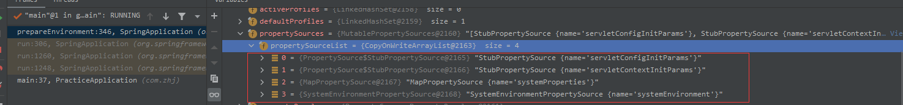
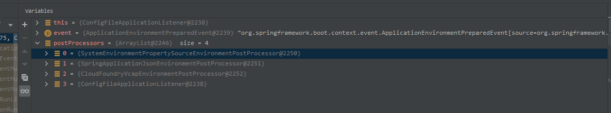
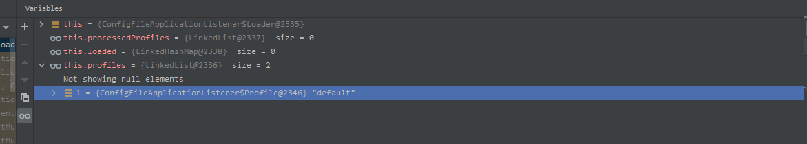
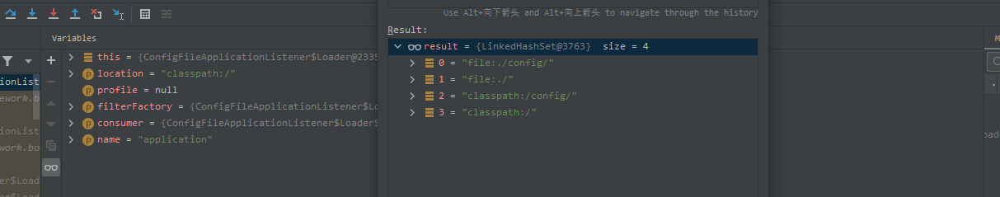
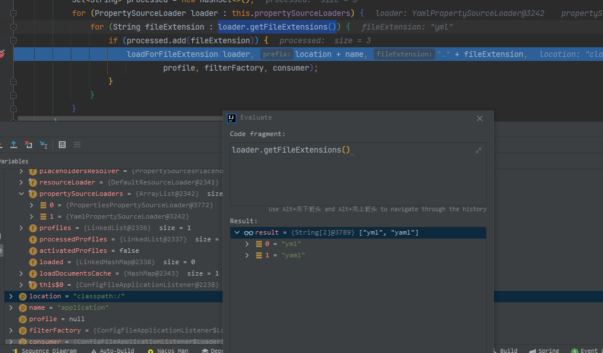
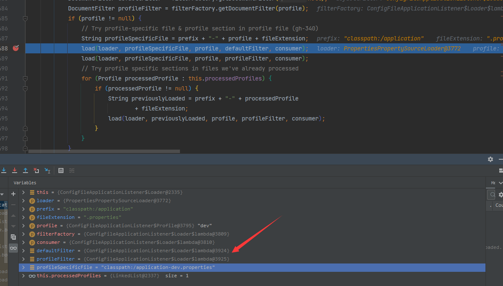
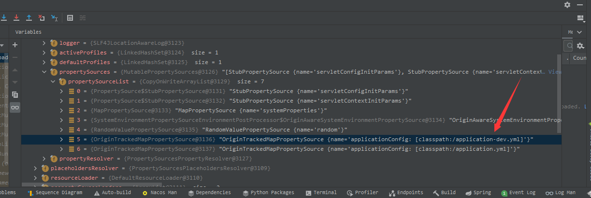

## 一、SpringBoot配置文件的加载

主要研究SpringApllication.run() 方法中 prepareEnvironment() 方法

```java
public ConfigurableApplicationContext run(String... args) {
		
		try {
			ConfigurableEnvironment environment = prepareEnvironment(listeners,
					applicationArguments);
        }
}

```

### 1. prepareEnvironment()

```java
private ConfigurableEnvironment prepareEnvironment(
			SpringApplicationRunListeners listeners,
			ApplicationArguments applicationArguments) {
    // 创建对应的环境根据应用程序的类型
		ConfigurableEnvironment environment = getOrCreateEnvironment();
    //获取到启动的参数，通过参数配置环境
		configureEnvironment(environment, applicationArguments.getSourceArgs());
    //发布环境准备的事件（重点方法）
		listeners.environmentPrepared(environment);
    //将环境绑定到应用程序当中
		bindToSpringApplication(environment);
		if (!this.isCustomEnvironment) {
			environment = new EnvironmentConverter(getClassLoader())
					.convertEnvironmentIfNecessary(environment, deduceEnvironmentClass());
		}
		ConfigurationPropertySources.attach(environment);
		return environment;
	}
```

#### 2. getOrCreateEnvironment()

根据 **this.webApplicationType** 会创建 **StandardServletEnvironment** 对象；会注册 4个配置对象到对象的List中

- servletConfigInitParams：空对象
- servletContextInitParams：空对象
- systemProperties：应用程序启动的相关配置
- systemEnvironment：环境遍历相关的配置



```java
private ConfigurableEnvironment getOrCreateEnvironment() {
    if (this.environment != null) {
        return this.environment;
    }
    //根据应用的类型选择环境，这里会创建一个 StandardServletEnvironment 对象
    switch (this.webApplicationType) {
        case SERVLET:
            return new StandardServletEnvironment();
        case REACTIVE:
            return new StandardReactiveWebEnvironment();
        default:
            return new StandardEnvironment();
    }
}
```

#### 3. configureEnvironment()

配置环境的一些配置信息，设置转换器用作参数的转换

```java
protected void configureEnvironment(ConfigurableEnvironment environment,
			String[] args) {
		if (this.addConversionService) {
			ConversionService conversionService = ApplicationConversionService
					.getSharedInstance();
			environment.setConversionService(
					(ConfigurableConversionService) conversionService);
		}
    	//设置默认的配置文件类，根据传入的参数注入指定的配置信息
		configurePropertySources(environment, args);
    	//设置配置的环境
		configureProfiles(environment, args);
	}
```

#### 4. environmentPrepared()

发布环境配置的时间，这是重点方法，根据环境读取到对应的配置文件；

```java
//通过事件广播器，发布应用环境准备的事件
public void environmentPrepared(ConfigurableEnvironment environment) {
		this.initialMulticaster.multicastEvent(new ApplicationEnvironmentPreparedEvent(
				this.application, this.args, environment));
	}
```

ResolvableType：其中包括了事件的类型，父类类型，以及实现的接口，还有泛型类型

```java
public void multicastEvent(ApplicationEvent event) {
    //第一个参数是事件对象，第二个参数，根据事件解析出对应的事件类型对象（ResolvableType）
        this.multicastEvent(event, this.resolveDefaultEventType(event));
    }
```

```java
public void multicastEvent(ApplicationEvent event, @Nullable ResolvableType eventType) {
        ResolvableType type = eventType != null ? eventType : this.resolveDefaultEventType(event);
    //获取到对应的监听器，其中使用了缓存的方式将对应的事件类型跟监听器缓存起来，便于后续获取；其中使用了 GenericApplicationListenerAdapter 适配器的方式来提供给不同的监听器用来进行适配
        Iterator var4 = this.getApplicationListeners(event, type).iterator();

        while(var4.hasNext()) {
            ApplicationListener<?> listener = (ApplicationListener)var4.next();
            Executor executor = this.getTaskExecutor();
            if (executor != null) {
                //如果设置了线程池，就使用异步的方式进行执行
                executor.execute(() -> {
                    this.invokeListener(listener, event);
                });
            } else {
                //执行监听器执行的监听器为：ConfigFileApplicationListener
                this.invokeListener(listener, event);
            }
        }

    }
```

### 2. ConfigFileApplicationListener

```java
@Override
	public void onApplicationEvent(ApplicationEvent event) {
        //根据事件的类型执行相应的方法
		if (event instanceof ApplicationEnvironmentPreparedEvent) {
			onApplicationEnvironmentPreparedEvent(
					(ApplicationEnvironmentPreparedEvent) event);
		}
		if (event instanceof ApplicationPreparedEvent) {
			onApplicationPreparedEvent(event);
		}
	}
```

#### 1. onApplicationEnvironmentPreparedEvent

通过SpringFactoriesLoader.loadFactories(EnvironmentPostProcessor.class,getClass().getClassLoader()); 的方法找到 spring.factories 中 **EnvironmentPostProcessor** 的实现类执行处理，目前加载出来的对象如下图：



其中还会将**ConfigFileApplicationListener** 也添加到处理器当中进行处理可以看到当前类也实现了 **EnvironmentPostProcessor** 类

```java
private void onApplicationEnvironmentPreparedEvent(
			ApplicationEnvironmentPreparedEvent event) {
    //加载 EnvironmentPostProcessor 的实现类
		List<EnvironmentPostProcessor> postProcessors = loadPostProcessors();
    //将 ConfigFileApplicationListener 添加到处理链当中。配置文件的读取也是由 ConfigFileApplicationListener进行处理
		postProcessors.add(this);
		AnnotationAwareOrderComparator.sort(postProcessors);
		for (EnvironmentPostProcessor postProcessor : postProcessors) {
			postProcessor.postProcessEnvironment(event.getEnvironment(),
					event.getSpringApplication());
		}
	}
```


#### 2. postProcessEnvironment

当前方法调用了内部方法 addPropertySources(environment, application.getResourceLoader());

#### 3. addPropertySources()

其中创建了 Loder对象,，并且调用了load() 方法

> ```java
> new Loader(environment, resourceLoader).load();
> ```

#### 4. load()

**initializeProfiles()** 方法中就会将环境对象中启动的配置环境初始化出来放到 **this.profiles** 这个队列中

```java
public void load() {
			this.profiles = new LinkedList<>();
			this.processedProfiles = new LinkedList<>();
			this.activatedProfiles = false;
			this.loaded = new LinkedHashMap<>();
    //初始化环境。会将环境中的默认环境添加当 this.profiles 当中，初始会有两个元素一个是空的，一个"default"
			initializeProfiles();
			while (!this.profiles.isEmpty()) {
       			//取出环境进行处理
				Profile profile = this.profiles.poll();
				if (profile != null && !profile.isDefaultProfile()) {
					addProfileToEnvironment(profile.getName());
				}
                //加载路径下的配置文件
				load(profile, this::getPositiveProfileFilter,
                     //加载文件后将数据添加到环境配置中
						addToLoaded(MutablePropertySources::addLast, false));
				this.processedProfiles.add(profile);
			}
    //重置环境中的配置环境，设置使用的环境
			resetEnvironmentProfiles(this.processedProfiles);
			load(null, this::getNegativeProfileFilter,
					addToLoaded(MutablePropertySources::addFirst, true));
    //文件加载完成之后就直接添加到环境当中
			addLoadedPropertySources();
		}
```

初始时的环境配置



**getSearchLocations()** 获取到需要搜寻的路径，优先读取 **spring配置中的指定的路径： spring.config.additional-location、spring.config.location**

- file:./config/
- file:./config/*/
- file:./
- classpath:/config/
- classpath:/

**getSearchNames()** ：获取到需要搜寻的名称，默认读取 **spring.config.name 指定的配置文件，默认就是 application**

```java
private void load(Profile profile, DocumentFilterFactory filterFactory,
				DocumentConsumer consumer) {
    //获取到所以的配置文件的路径：初始时有4个文件的路径
			getSearchLocations().forEach((location) -> {
				boolean isFolder = location.endsWith("/");
                //这里拼接对应配置路径
				Set<String> names = isFolder ? getSearchNames() : NO_SEARCH_NAMES;
                //遍历处理
				names.forEach(
						(name) -> load(location, name, profile, filterFactory, consumer));
			});
		}

private void load(String location, String name, Profile profile,
				DocumentFilterFactory filterFactory, DocumentConsumer consumer) {
			if (!StringUtils.hasText(name)) {
				for (PropertySourceLoader loader : this.propertySourceLoaders) {
					if (canLoadFileExtension(loader, location)) {
						load(loader, location, profile,
								filterFactory.getDocumentFilter(profile), consumer);
						return;
					}
				}
			}
    // propertySourceLoaders : 会有两个处理类 YamlPropertySourceLoader和PropertiesPropertySourceLoader
			Set<String> processed = new HashSet<>();
    //获取到处理类
			for (PropertySourceLoader loader : this.propertySourceLoaders) {
                //处理类支持处理的文件后缀yml
				for (String fileExtension : loader.getFileExtensions()) {
					if (processed.add(fileExtension)) {
                        //加载对应路径的配置文件信息
						loadForFileExtension(loader, location + name, "." + fileExtension,
								profile, filterFactory, consumer);
					}
				}
			}
		}
```





最后根据路径和环境拼接出配置文件的路径信息



最后添加到环境当中




## 二、SpringCloud配置文件的加载

**探究Nacos是如何在springboot启动时加载到对应的配置文件**，**nacos** 加载配置时需要知道以下几个类

- NacosPropertySourceLocator：配置读取器
- NacosConfigProperties：指定的配置对象
- NacosConfigManager：配置管理器
- ConfigService：配置服务
- PropertySourceBootstrapConfiguration：spring cloud提供的统一配置属性bootstrap装配类
- NacosConfigBootstrapConfiguration：nacos提供的bootstrap环境装配类

### 1. bootstrap

首先我们知道 **spring cloud** 微服务在启动时优先读取的是 **bootstrap.yml** 的文件，因为这个文件的优先级最高，为什么最高呢？我们可以看一看启动的代码。下面是 **SpringApplication.run()** 里面调用环境准备的方法

```java
private ConfigurableEnvironment prepareEnvironment(SpringApplicationRunListeners listeners,
			ApplicationArguments applicationArguments) {
		// Create and configure the environment
		ConfigurableEnvironment environment = getOrCreateEnvironment();
    //配置以下需要启动的环境，这里面实际配置是 this.additionalProfiles 这个默认的环境
		configureEnvironment(environment, applicationArguments.getSourceArgs());
		ConfigurationPropertySources.attach(environment);
    //发布一个环境准备完毕的时间
		listeners.environmentPrepared(environment);
    //将环境对象和上下文绑定起来
		bindToSpringApplication(environment);
		if (!this.isCustomEnvironment) {
			environment = new EnvironmentConverter(getClassLoader()).convertEnvironmentIfNecessary(environment,
					deduceEnvironmentClass());
		}
		ConfigurationPropertySources.attach(environment);
		return environment;
	}
```

注意：重点在 **environmentPrepared()** 这个发布事件中，引入了spring cloud时会有一个类叫 **BootstrapApplicationListener**；这个类我们就叫做 bootstrap 应用容器

```java
public class BootstrapApplicationListener
		implements ApplicationListener<ApplicationEnvironmentPreparedEvent>, Ordered {

@Override
	public void onApplicationEvent(ApplicationEnvironmentPreparedEvent event) {
		//获取到容器的配置环境对象
		ConfigurableEnvironment environment = event.getEnvironment();
		//判断是否开启全局上下文的选项 spring.cloud.bootstrap.enabled
		if (!environment.getProperty("spring.cloud.bootstrap.enabled", Boolean.class,
				true)) {
			return;
		}
		// 判断一下环境中是否已经存在名称叫 bootstrap 的配置文件
		if (environment.getPropertySources().contains(BOOTSTRAP_PROPERTY_SOURCE_NAME)) {
			return;
		}
		ConfigurableApplicationContext context = null;
		//读取配置文件的名称，这里获取环境里面有没有指定bootstrap的名称，默认就为 bootstrap，这里也对应上了上面
		String configName = environment
				.resolvePlaceholders("${spring.cloud.bootstrap.name:bootstrap}");
		//从spring容器中读取出上下文初始化器执行
		for (ApplicationContextInitializer<?> initializer : event.getSpringApplication()
				.getInitializers()) {
			//只执行 ParentContextApplicationContextInitializer 的类型
			if (initializer instanceof ParentContextApplicationContextInitializer) {
				context = findBootstrapContext(
						(ParentContextApplicationContextInitializer) initializer,
						configName);
			}
		}
		//如果没用 ParentContextApplicationContextInitializer 类型的执行器，这里上下文对象则是空的
		if (context == null) {
			/**
			 * 构建一个上下文对象，注意：这里就是导致spring boot引入spring cloud时启动了两次容器，全局上下文的容器在这里也会单独进行一次的创建，但是这里面只会
			 * 将 BootstrapConfiguration 类型的配置类进行加载，其他的配置类不会进行加载，例如：nacos中的配置信息加载
			 * 
			 * 为什么只会加载对应的配置类？因为这里指定了spring容器的引导配置类为 class org.springframework.cloud.bootstrap.BootstrapImportSelectorConfiguration，这个配置类只注入了Nacos加载配置相关的类，正常的容器是会将 @SpringBootApplication标识的类注入进行，然后就会扫描到其他的配置信息
			 */
			context = bootstrapServiceContext(environment, event.getSpringApplication(),
					configName);
			event.getSpringApplication()
					.addListeners(new CloseContextOnFailureApplicationListener(context));
		}
		apply(context, event.getSpringApplication(), environment);
	}
    
    
    
    //创建一个子容器用于加载bootstrap相关的配置
private ConfigurableApplicationContext bootstrapServiceContext(
			ConfigurableEnvironment environment, final SpringApplication application,
			String configName) {
		//创建一个标准环境对象
		StandardEnvironment bootstrapEnvironment = new StandardEnvironment();
		MutablePropertySources bootstrapProperties = bootstrapEnvironment
				.getPropertySources();
		//将配置都置空
		for (PropertySource<?> source : bootstrapProperties) {
			bootstrapProperties.remove(source.getName());
		}
		//获取到 bootstrap的配置文件的路径，因为这是去从主流程的容器中获取，里面都没有配置所以都读取出来的是空的
		String configLocation = environment
				.resolvePlaceholders("${spring.cloud.bootstrap.location:}");
		String configAdditionalLocation = environment
				.resolvePlaceholders("${spring.cloud.bootstrap.additional-location:}");
		Map<String, Object> bootstrapMap = new HashMap<>();
		//将配置文件的名称放入到 bootstrapMap 中 这个 configName 默认就是 bootstrap
		bootstrapMap.put("spring.config.name", configName);
		bootstrapMap.put("spring.main.web-application-type", "none");
		if (StringUtils.hasText(configLocation)) {
			bootstrapMap.put("spring.config.location", configLocation);
		}
		if (StringUtils.hasText(configAdditionalLocation)) {
			bootstrapMap.put("spring.config.additional-location",
					configAdditionalLocation);
		}
		//在环境配置文件的第一个位置添加一个名称为 bootstrap 的配置文件，这是一个临时配置文件对象
		bootstrapProperties.addFirst(
				new MapPropertySource(BOOTSTRAP_PROPERTY_SOURCE_NAME, bootstrapMap));
		//这里是获取到外部传入的环境对象，将两个配置文件进行合并一下
		for (PropertySource<?> source : environment.getPropertySources()) {
			if (source instanceof StubPropertySource) {
				continue;
			}
			bootstrapProperties.addLast(source);
		}
		/**
		 * 构建一个 SpringApplication 的构建器出来，这里面构建时并没有传入主要的启动类
		 */
		SpringApplicationBuilder builder = new SpringApplicationBuilder()
				.profiles(environment.getActiveProfiles()).bannerMode(Mode.OFF)
				.environment(bootstrapEnvironment)
				.registerShutdownHook(false).logStartupInfo(false)
				.web(WebApplicationType.NONE);
		final SpringApplication builderApplication = builder.application();
		//从调用栈获取出的main方法的类，这里面如果没有解析出main方法的类，那么就默认会取父级容器的main方法的类
		if (builderApplication.getMainApplicationClass() == null) {
			/**
			 * 从spring boot的启动类中获取到main方法的类
			 */
			builder.main(application.getMainApplicationClass());
		}
		if (environment.getPropertySources().contains("refreshArgs")) {
			/**
			 * 将当前启动的普通容器设置到新的容器中
			 */
			builderApplication
					.setListeners(filterListeners(builderApplication.getListeners()));
		}
		/**
		 * 添加 BootstrapImportSelectorConfiguration 类到容器中，这个类作为自动装配类会优先加载
		 * spring.factories文件中 BootstrapConfiguration.class 标记的类，而这个配置类中又会添加到
		 * SpringApplication中的 primarySources 中，所以会优先加载，例如：NacosPropertySourceLocator 配置加载器就需要在这里面进行
		 * 加载优先级更高。SpringApplication.prepareContext() 方法中就会将 primarySources中的类加载到容器中
		 */
		builder.sources(BootstrapImportSelectorConfiguration.class);
		//开器上下文的执行
		final ConfigurableApplicationContext context = builder.run();
		context.setId("bootstrap");
		addAncestorInitializer(application, context);
		//将 bootstrap 临时文件移除
		bootstrapProperties.remove(BOOTSTRAP_PROPERTY_SOURCE_NAME);
		//合并两个配置文件，实际上就是将上面创建的bootstrap加载的配置文件合并到外部传入的配置文件中
		mergeDefaultProperties(environment.getPropertySources(), bootstrapProperties);
		return context;
	}

}
```

spring cloud启动子容器的时候指定了容器的引导类，SpringApplication会将PrimarySources注入到SpringBeanFactory中后续进行加载，正常的情况下是会注入 @SpringBootApplication注解的类


```java
private void prepareContext(DefaultBootstrapContext bootstrapContext, ConfigurableApplicationContext context,
			ConfigurableEnvironment environment, SpringApplicationRunListeners listeners,
			ApplicationArguments applicationArguments, Banner printedBanner) {
		if (!AotDetector.useGeneratedArtifacts()) {
			// Load the sources
			Set<Object> sources = getAllSources();
			Assert.notEmpty(sources, "Sources must not be empty");
			load(context, sources.toArray(new Object[0]));
		}
		listeners.contextLoaded(context);
	}
```

**bootstrapServiceContext()** 这个方法呢目的是创建一个 **bootstrap子容器** 主要的目的是加载 **BootstrapImportSelectorConfiguration** 这个配置类中需要提前导入加载的类，这个类会去 **spring.factories** 中指定的下面的配置；

```text
org.springframework.cloud.bootstrap.BootstrapConfiguration=\
com.alibaba.cloud.nacos.NacosConfigBootstrapConfiguration
```

**bootstrapServiceContext()** 方法里面构建了一个 **bootstrap** 的配置文件对象设置到了对应的子环境中，下面这段代码配置了容器需要加载的配置文件名称 **spring.config.name**，这个属性就是在 **ConfigFileApplicationListener** 里面会进行读取需要配置的名称

```java
Map<String, Object> bootstrapMap = new HashMap<>();
//将配置文件的名称放入到 bootstrapMap 中 这个 configName 默认就是 bootstrap
bootstrapMap.put("spring.config.name", configName);
bootstrapMap.put("spring.main.web-application-type", "none");
if (StringUtils.hasText(configLocation)) {
    bootstrapMap.put("spring.config.location", configLocation);
}
if (StringUtils.hasText(configAdditionalLocation)) {
    bootstrapMap.put("spring.config.additional-location",
                     configAdditionalLocation);
}
```

### 2. PropertySourceBootstrapConfiguration

上面讲完了 **bootstrap.yml** 文件的加载，当我们启动了一个 **bootstrap容器** 之后，会去默认加载 **BootstrapConfiguration** 下面所有的装配类

```text
org.springframework.cloud.bootstrap.BootstrapConfiguration=\
org.springframework.cloud.bootstrap.config.PropertySourceBootstrapConfiguration,\
```

这个类是 spring cloud提供的通用类，下面会注入所有的 **PropertySourceLocator** ，然后在 **initialize()** 方法中进行调用；

```java
@Configuration(proxyBeanMethods = false)
@EnableConfigurationProperties(PropertySourceBootstrapProperties.class)
public class PropertySourceBootstrapConfiguration implements
		ApplicationContextInitializer<ConfigurableApplicationContext>, Ordered {
    
    /**
	 * 自定注入所有的实现类 PropertySourceLocator
	 */
	@Autowired(required = false)
	private List<PropertySourceLocator> propertySourceLocators = new ArrayList<>();
    
    @Override
	public void initialize(ConfigurableApplicationContext applicationContext) {
		//将nacos中的配置构建为 PropertySource 配置属性对象
		List<PropertySource<?>> composite = new ArrayList<>();
		//根据@Order注解进行排序
		AnnotationAwareOrderComparator.sort(this.propertySourceLocators);
		boolean empty = true;
		//获取到环境对象
		ConfigurableEnvironment environment = applicationContext.getEnvironment();
		//循环遍历
		for (PropertySourceLocator locator : this.propertySourceLocators) {
			//调用实现方法进行构建配置对象 PropertySource
			Collection<PropertySource<?>> source = locator.locateCollection(environment);
			//如果配置出来的 PropertySource 为空，那么直接跳过到下一个
			if (source == null || source.size() == 0) {
				continue;
			}
			List<PropertySource<?>> sourceList = new ArrayList<>();
			//根据配置出来的 PropertySource 在进行包装，除了 EnumerablePropertySource枚举类型配置源，其他的都是 SimpleBootstrapPropertySource
			for (PropertySource<?> p : source) {
				if (p instanceof EnumerablePropertySource) {
					EnumerablePropertySource<?> enumerable = (EnumerablePropertySource<?>) p;
					sourceList.add(new BootstrapPropertySource<>(enumerable));
				}
				else {
					sourceList.add(new SimpleBootstrapPropertySource(p));
				}
			}
			logger.info("Located property source: " + sourceList);
			composite.addAll(sourceList);
			empty = false;
		}
		//如果配置部位空的话
		if (!empty) {
			MutablePropertySources propertySources = environment.getPropertySources();
			//解析日志配置的占位符
			String logConfig = environment.resolvePlaceholders("${logging.config:}");
			LogFile logFile = LogFile.get(environment);
			for (PropertySource<?> p : environment.getPropertySources()) {
				if (p.getName().startsWith(BOOTSTRAP_PROPERTY_SOURCE_NAME)) {
					propertySources.remove(p.getName());
				}
			}
			insertPropertySources(propertySources, composite);
			reinitializeLoggingSystem(environment, logConfig, logFile);
			setLogLevels(applicationContext, environment);
			handleIncludedProfiles(environment);
		}
	}
}
```

这里需要说明以下 **bootstrap** 的加载跟主流程的容器加载是分开的，**bootstrap** 加载完之后，会将配置文件和 **ApplicationContextInitializer** 跟主流程的容器进行合并，所以这就是为什么 **bootstrap** 的文件优先级最高

### 3. NacosConfigBootstrapConfiguration

这个配置类主要是注入了 **NacosPropertySourceLocator**、**NacosConfigManager** 、**NacosConfigProperties** 三个bean对象，主要是查看 **NacosPropertySourceLocator**

### 4. NacosPropertySourceLocator

这个类就是通过 **ConfigService** 去根据配置的应用名称、命名空间等去拉取配置

```java
public class NacosPropertySourceLocator implements PropertySourceLocator {
    private NacosConfigManager nacosConfigManager;
    
    @Override
	public PropertySource<?> locate(Environment env) {
		nacosConfigProperties.setEnvironment(env);
		ConfigService configService = nacosConfigManager.getConfigService();

		if (null == configService) {
			log.warn("no instance of config service found, can't load config from nacos");
			return null;
		}
		long timeout = nacosConfigProperties.getTimeout();
		nacosPropertySourceBuilder = new NacosPropertySourceBuilder(configService,
				timeout);
        //先获取到配置文件中指定的名称
		String name = nacosConfigProperties.getName();

        //获取到配置的前缀
		String dataIdPrefix = nacosConfigProperties.getPrefix();
		if (StringUtils.isEmpty(dataIdPrefix)) {
			dataIdPrefix = name;
		}

        //如果配置都为空，那么直接获取 spring.application.name 配置的名称
		if (StringUtils.isEmpty(dataIdPrefix)) {
			dataIdPrefix = env.getProperty("spring.application.name");
		}

        //创建一个配置名称为 nacos 的聚合配置属性对象
		CompositePropertySource composite = new CompositePropertySource(
				NACOS_PROPERTY_SOURCE_NAME);
        //加载共享配置文件，分组为默认
		loadSharedConfiguration(composite);
        //加载扩展配置文件
		loadExtConfiguration(composite);
        //加载配置文件
		loadApplicationConfiguration(composite, dataIdPrefix, nacosConfigProperties, env);
		return composite;
	}
    
    
    private void loadApplicationConfiguration(
			CompositePropertySource compositePropertySource, String dataIdPrefix,
			NacosConfigProperties properties, Environment environment) {
        //获取到指定的文件后缀，默认是properties
		String fileExtension = properties.getFileExtension();
        //获取到配置的分组
		String nacosGroup = properties.getGroup();
		// 加载没有带后缀的配置文件例如：product 因为这里直接将服务名称作为了dataId
		loadNacosDataIfPresent(compositePropertySource, dataIdPrefix, nacosGroup,
				fileExtension, true);
		// 加载带后缀的配置文件例如：product.properties
		loadNacosDataIfPresent(compositePropertySource,
				dataIdPrefix + DOT + fileExtension, nacosGroup, fileExtension, true);
		// 根据激活的环境去拼接对应的配置文件名称并且进行加载
		for (String profile : environment.getActiveProfiles()) {
			String dataId = dataIdPrefix + SEP1 + profile + DOT + fileExtension;
            /**
             * 1. 先通过 NacosPropertySourceRepository 判断配置文件是否已经加载了
             * 2. 在 nacosPropertySourceBuilder 通过 configService 加载配置文件，加载完成了后会将其注册到 NacosPropertySourceRepository
             * 3. 在上下文创建完成后根据配置文件再注册对应的监听器 NacosContextRefresher
             */
			loadNacosDataIfPresent(compositePropertySource, dataId, nacosGroup,
					fileExtension, true);
		}

	}
}
```

### 5. NacosConfigService

nacos提供的配置服务，这个配置服务就是通过 http请求加线程池轮询去监听配置变动（2.0之前）

```java
public class NacosConfigService implements ConfigService {
    
    //http代理服务，发起http请求的
    private final HttpAgent agent;
    
    //用于轮询读取远程配置的变动并且通知注册的监听器
    private final ClientWorker worker;
    
    
    public NacosConfigService(Properties properties) throws NacosException {
        //严重参数
        ValidatorUtils.checkInitParam(properties);
        //初始化命名空间的名称
        initNamespace(properties);
        //通过 ServiceLoader 加载出来的 ConfigFilter 实现类，然后将其添加到 ConfigFilterChainManager 中
        this.configFilterChainManager = new ConfigFilterChainManager(properties);
        //启动服务端列表管理器
        ServerListManager serverListManager = new ServerListManager(properties);
        serverListManager.start();
        /**
         * 启动本地配置信息处理器，2.0之前采用的http长轮询的方式进行监听，2.0之后采用rpc的方式进行监听
         * 通过一个阻塞队列进行线程的阻塞，默认是5秒钟便会唤醒一次，然后进行一次配置变动的监听更新，如果
         * 有监听器进行注册，那么会立即执行一次
         */
        this.worker = new ClientWorker(this.configFilterChainManager, serverListManager, properties);
        // will be deleted in 2.0 later versions
        agent = new ServerHttpAgent(serverListManager);

    }
    
    public String getConfig(String dataId, String group, long timeoutMs) throws NacosException {
        return this.getConfigInner(this.namespace, dataId, group, timeoutMs);
    }

    public String getConfigAndSignListener(String dataId, String group, long timeoutMs, Listener listener) throws NacosException {
        String content = this.getConfig(dataId, group, timeoutMs);
        this.worker.addTenantListenersWithContent(dataId, group, content, Arrays.asList(listener));
        return content;
    }

    public void addListener(String dataId, String group, Listener listener) throws NacosException {
        this.worker.addTenantListeners(dataId, group, Arrays.asList(listener));
    }

    public boolean publishConfig(String dataId, String group, String content) throws NacosException {
        return this.publishConfig(dataId, group, content, ConfigType.getDefaultType().getType());
    }

    public boolean publishConfig(String dataId, String group, String content, String type) throws NacosException {
        return this.publishConfigInner(this.namespace, dataId, group, (String)null, (String)null, (String)null, content, type);
    }

    public boolean removeConfig(String dataId, String group) throws NacosException {
        return this.removeConfigInner(this.namespace, dataId, group, (String)null);
    }

    public void removeListener(String dataId, String group, Listener listener) {
        this.worker.removeTenantListener(dataId, group, listener);
    }
    
}
```

### 6. 总结

nacos读取配置的流程就是，引入spring cloud依赖，在启动容器时，发布了一个 **BootstrapApplicationListener** 事件，启动一个 **bootstrap** 容器来读取 **spring.factories** 中 **org.springframework.cloud.bootstrap.BootstrapConfiguration** 定义的装配类，就会加载到 **NacosConfigBootstrapConfiguration、PropertySourceBootstrapConfiguration** 两个装配类，而 **PropertySourceBootstrapConfiguration** 会注入所有的 **PropertySourceLocator** 类来进行加载配置。


