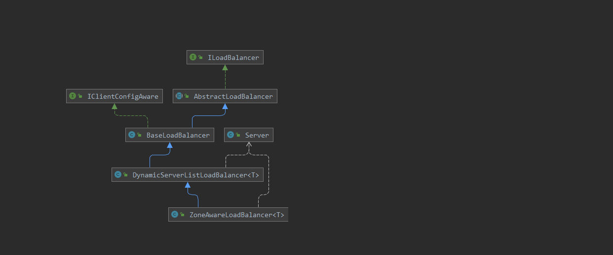
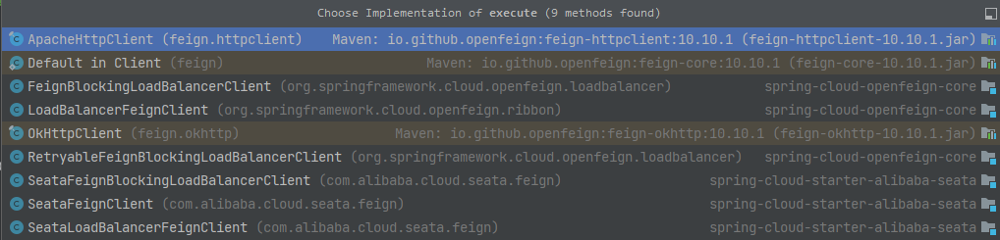
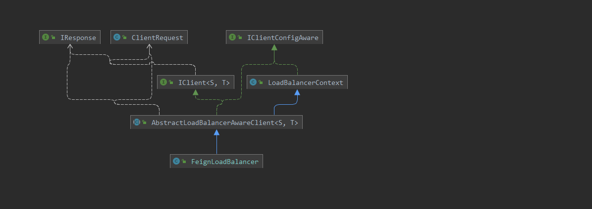
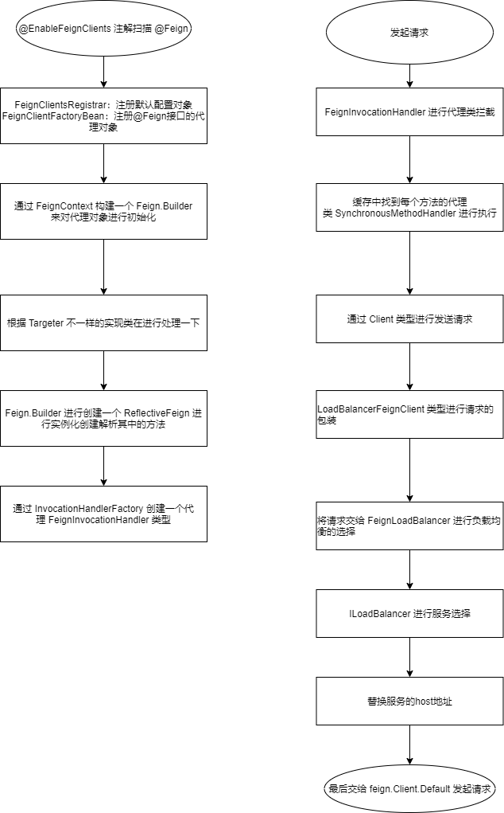

# OpenFeign

基于 **OpenFeign 2.2.6.RELEASE版本进行源码阅读**

```xml
<dependency>
    <groupId>org.springframework.cloud</groupId>
    <artifactId>spring-cloud-starter-openfeign</artifactId>
    <version>2.2.6.RELEASE</version>
</dependency>
```

一键拉取 **spring-cloud-common、spring-cloud-alibaba、spring-cloud-netflix、spring-cloud-openfeign** 源码

> https://gitee.com/haijun1998/spring-cloud-git.git

## 1. 注解

- EnableFeignClients：开启openFeign接口的处理（导入了 **FeignClientsRegistrar** 对注解进行处理）
- FeignClient：标记openFeign的接口

## 2. FeignClientsRegistrar

@FeignClient注解的注册类

- 第一步注册 **@EnableFeignClients** 中指定的默认配置类
  - bean定义的名称为 **default.** 开头
  - 通过 **FeignClientSpecification** 进行包装
- 第二步处理 **@EnableFeignClients** 指定扫描的路径
  - 先注册 **@FeignClient** 指定的配置文件对象将其包装成 **FeignClientSpecification**
  - 将 **@FeignClient** 的接口通过 **FeignClientFactoryBean** 代理类进行实现

```java
class FeignClientsRegistrar
		implements ImportBeanDefinitionRegistrar, ResourceLoaderAware, EnvironmentAware {
    @Override
	public void registerBeanDefinitions(AnnotationMetadata metadata,
			BeanDefinitionRegistry registry) {
		/**
		 * 注解注解上面标记的 defaultConfiguration 配置对象，配置类通过class进行表示
		 * 使用 FeignClientSpecification 对其进行包装
		 */
		registerDefaultConfiguration(metadata, registry);
		/**
		 * 处理 @FeignClient 注解并且会将注解中配置的 configuration 属性也注册到容器当中
		 * bean定义的名称 @FeignClient[name].FeignClientSpecification.class.name，然后将接口注入
		 * 然后将接口包装成 FeignClientFactoryBean 类型
		 */
		registerFeignClients(metadata, registry);
	}
}
```

## 3. FeignClientFactoryBean

**@FeignClient** 的动态代理类，在通过注入使用到时才会进行创建

```java
class FeignClientFactoryBean
		implements FactoryBean<Object>, InitializingBean, ApplicationContextAware {
    /**
	 * 接口的类型
	 */
	private Class<?> type;

	/**
	 * 指定的名称
	 */
	private String name;

	/**
	 * 服务的请求接口地址
	 */
	private String url;

	/**
	 * 上下文id，如果没有直接指定会通过 serviceId或者name进行获取
	 */
	private String contextId;

	/**
	 * 调用路径
	 */
	private String path;

	/**
	 * 解码器找不到时是否返回404
	 */
	private boolean decode404;

	/**
	 * 是否需要继承父上下文
	 */
	private boolean inheritParentContext = true;

	/**
	 * spring容器
	 */
	private ApplicationContext applicationContext;

	/**
	 * 回调类
	 */
	private Class<?> fallback = void.class;

	/**
	 * 回调类的工厂类
	 */
	private Class<?> fallbackFactory = void.class;

	/**
	 * 读取超时的时间
	 */
	private int readTimeoutMillis = new Request.Options().readTimeoutMillis();

	/**
	 * 连接超时的时间
	 */
	private int connectTimeoutMillis = new Request.Options().connectTimeoutMillis();
}
```

**getObject()** 获取到动态代理对象，通过 **Feign.Builder** 进行构建，而 **Feign.Builder** 又根据是否导入了 **hystrix** 的依赖进行自动配置

- DefaultTarget：当class路径下面没有 feign.hystrix.HystrixFeign 类时就创建当前
- HystrixTargeter：当路径下面有 feign.hystrix.HystrixFeign 创建当前

**Feign.Builder** 会从容器中获取到对应需要的组件配置进行默认值的初始化

- logger
- Encoder：SpringEncoder
- Decoder：默认类型 OptionalDecoder中内嵌的 SpringDecoder类型进行处理
- Contract：默认类型 SpringMvcContract
- Logger.Level：日志等级
- Retryer：重试器
- ErrorDecoder：错误编码器
- Request.Options：配置对象来设置连接超时和读取超时的时间
- RequestInterceptor：请求拦截器
- QueryMapEncoder：查询映射编码器
- ExceptionPropagationPolicy：异常传播的策略

```java
public Object getObject() throws Exception {
		return getTarget();
}
/**
	 * 当前方法主要是通过从容器中获取到 Feign.Builder 类型进行配置，而 Feign.Builder 有两个实现类目前
	 * DefaultTarget：当class路径下面没有 feign.hystrix.HystrixFeign 类时就创建当前
	 * HystrixTargeter：当路径下面有 feign.hystrix.HystrixFeign 创建当前
	 */
	<T> T getTarget() {
		//从spring中获取到 FeignContext 对象，在 FeignAutoConfiguration 进行的自动导入
		FeignContext context = applicationContext.getBean(FeignContext.class);
		/**
		 * 根据上下文创建 Builder 进行创建
		 * context 继承至 NamedContextFactory 会为每个接口都创建一个容器进行存储
		 * 从容器中获取了 Feign.Builder 类型进行构建，并且通过配置信息进行配置，以下属性都是通过子容器中的配置进行获取
		 * 
		 * Logger.Level：日志级别
		 * Retryer：重试器
		 * ErrorDecoder：错误解码
		 * FeignErrorDecoderFactory：错误解码工厂
		 * Request.Options：配置读取和连接超时的时间
		 * RequestInterceptor：请求的拦截器
		 * QueryMapEncoder：查询映射的编码
		 * ExceptionPropagationPolicy：异常传播的策略
		 */
		Feign.Builder builder = feign(context);
		/**
		 * 处理url地址，如果没有指定url地址，拼接url地址为 http://name属性的值
		 */
		if (!StringUtils.hasText(url)) {
			if (!name.startsWith("http")) {
				url = "http://" + name;
			}
			else {
				url = name;
			}
			url += cleanPath();
			return (T) loadBalance(builder, context,
					new HardCodedTarget<>(type, name, url));
		}
		//如果指定了url，并且不是http开头，默认拼接上http
		if (StringUtils.hasText(url) && !url.startsWith("http")) {
			url = "http://" + url;
		}
		//处理以下 /
		String url = this.url + cleanPath();
		/**
		 * 从容器中获取到客户端对象，这个 Client 接口就是后续执行请求的类
		 * 一般都是通过组件自定义实现，是否是负载的客户端等
		 */
		Client client = getOptional(context, Client.class);
		if (client != null) {
			if (client instanceof LoadBalancerFeignClient) {
				// not load balancing because we have a url,
				// but ribbon is on the classpath, so unwrap
				client = ((LoadBalancerFeignClient) client).getDelegate();
			}
			if (client instanceof FeignBlockingLoadBalancerClient) {
				// not load balancing because we have a url,
				// but Spring Cloud LoadBalancer is on the classpath, so unwrap
				client = ((FeignBlockingLoadBalancerClient) client).getDelegate();
			}
			builder.client(client);
		}
		/**
		 * 获取到 Targeter 通过target类型进行创建接口的代理对象有两个实现类
		 * DefaultTarget：当class路径下面没有 feign.hystrix.HystrixFeign 类时就创建当前
		 * HystrixTargeter：当路径下面有 feign.hystrix.HystrixFeign 创建当前
		 */
		Targeter targeter = get(context, Targeter.class);
		return (T) targeter.target(this, builder, context,
				new HardCodedTarget<>(type, name, url));
	}
```

## 4. Targeter

目标构造器，会根据不同的方式进行构建，目前有两个构建器

- DefaultTargeter：默认的目标构建器
- HystrixTargeter：hystrix的构建器

### 4.1 DefaultTargeter

没有做什么操作直接调用了构建方法

```java
class DefaultTargeter implements Targeter {

	@Override
	public <T> T target(FeignClientFactoryBean factory, Feign.Builder feign,
			FeignContext context, Target.HardCodedTarget<T> target) {
		return feign.target(target);
	}

}
```

### 4.2 HystrixTargeter

需要进行回调函数的处理，最终调用到  **feign.hystrix.HystrixFeign.Builder** 方法中

```java
class HystrixTargeter implements Targeter {

	@Override
	public <T> T target(FeignClientFactoryBean factory, Feign.Builder feign,
			FeignContext context, Target.HardCodedTarget<T> target) {
		//判断以下如果类型不是 Hystrix 提供的类型直接通过传递的target进行创建
		if (!(feign instanceof feign.hystrix.HystrixFeign.Builder)) {
			return feign.target(target);
		}
		//builder都是 HystrixFeign.Builder
		feign.hystrix.HystrixFeign.Builder builder = (feign.hystrix.HystrixFeign.Builder) feign;
		//计算出回调函数的名称
		String name = StringUtils.isEmpty(factory.getContextId()) ? factory.getName()
				: factory.getContextId();
		//从容器中获取到 SetterFactory
		SetterFactory setterFactory = getOptional(name, context, SetterFactory.class);
		if (setterFactory != null) {
			builder.setterFactory(setterFactory);
		}
		//获取到接口中的回调函数类
		Class<?> fallback = factory.getFallback();
		if (fallback != void.class) {
			//如果存在回调函数类，那么直接通过容器进行创建
			return targetWithFallback(name, context, target, builder, fallback);
		}
		//如果指定的是回调工厂类，那么通过工厂对象进行创建
		Class<?> fallbackFactory = factory.getFallbackFactory();
		if (fallbackFactory != void.class) {
			return targetWithFallbackFactory(name, context, target, builder,
					fallbackFactory);
		}

		return feign.target(target);
	}
```

## 5. Feign.Builder

feign包里面提供的构建器是一个抽象类，其它的扩展都是继承 **feign.Feign.Builder**，**HystrixFeign.Builder** 也继承至 当前类 **feign.Feign.Builder**

```java
public static class Builder {
        private final List<RequestInterceptor> requestInterceptors = new ArrayList();
        private Level logLevel;
        private Contract contract;
        private Client client;
        private Retryer retryer;
        private Logger logger;
        private Encoder encoder;
        private Decoder decoder;
        private QueryMapEncoder queryMapEncoder;
        private ErrorDecoder errorDecoder;
        private Options options;
        private InvocationHandlerFactory invocationHandlerFactory;
        private boolean decode404;
        private boolean closeAfterDecode;
        private ExceptionPropagationPolicy propagationPolicy;
        private boolean forceDecoding;
        private List<Capability> capabilities;

        public Builder() {
            //默认日志等级
            this.logLevel = Level.NONE;
            //默认的处理 @Headers、@RequestLine、@Body、@Headers、@Param等注解
            this.contract = new Default();
            //默认客户端
            this.client = new feign.Client.Default((SSLSocketFactory)null, (HostnameVerifier)null);
            //默认的重试器
            this.retryer = new feign.Retryer.Default();
            this.logger = new NoOpLogger();
            //编码
            this.encoder = new feign.codec.Encoder.Default();
            //解码
            this.decoder = new feign.codec.Decoder.Default();
            //查询映射编码
            this.queryMapEncoder = new FieldQueryMapEncoder();
            //错误解码
            this.errorDecoder = new feign.codec.ErrorDecoder.Default();
            //读取超时连接超时的配置
            this.options = new Options();
            // InvocationHandlerFactory 动态代理的实现接口工厂
            this.invocationHandlerFactory = new feign.InvocationHandlerFactory.Default();
            //关闭后进行编码
            this.closeAfterDecode = true;
            //异常传播策略
            this.propagationPolicy = ExceptionPropagationPolicy.NONE;
            //是否强制解码
            this.forceDecoding = false;
            //其它的能力支持
            this.capabilities = new ArrayList();
        }
    
    public Feign build() {
        //获取到客户端
            Client client = (Client)Capability.enrich(this.client, this.capabilities);
        //获取到重试器
            Retryer retryer = (Retryer)Capability.enrich(this.retryer, this.capabilities);
        //拦截器
            List<RequestInterceptor> requestInterceptors = (List)this.requestInterceptors.stream().map((ri) -> {
                return (RequestInterceptor)Capability.enrich(ri, this.capabilities);
            }).collect(Collectors.toList());
        //日志
            Logger logger = (Logger)Capability.enrich(this.logger, this.capabilities);
        //默认的处理 @Headers、@RequestLine、@Body、@Headers、@Param等注解
            Contract contract = (Contract)Capability.enrich(this.contract, this.capabilities);
        //配置
            Options options = (Options)Capability.enrich(this.options, this.capabilities);
        //编码
            Encoder encoder = (Encoder)Capability.enrich(this.encoder, this.capabilities);
        //解码
            Decoder decoder = (Decoder)Capability.enrich(this.decoder, this.capabilities);
        //代理类的工厂接口，通过当前工厂可以实现创建不同类型的动态代理类
            InvocationHandlerFactory invocationHandlerFactory = (InvocationHandlerFactory)Capability.enrich(this.invocationHandlerFactory, this.capabilities);
            QueryMapEncoder queryMapEncoder = (QueryMapEncoder)Capability.enrich(this.queryMapEncoder, this.capabilities);
        //接口中的方法解析出来之后需要通过当前工厂类进行创建包装后的接口 MethodHandler
            Factory synchronousMethodHandlerFactory = new Factory(client, retryer, requestInterceptors, logger, this.logLevel, this.decode404, this.closeAfterDecode, this.propagationPolicy, this.forceDecoding);
        //用于解析接口中的方法
            ParseHandlersByName handlersByName = new ParseHandlersByName(contract, options, encoder, decoder, queryMapEncoder, this.errorDecoder, synchronousMethodHandlerFactory);
        //最终创建反射类型的Feign，通过调用内部的 newInstance() 进行动态代理的创建
            return new ReflectiveFeign(handlersByName, invocationHandlerFactory, queryMapEncoder);
        }
}
```

### 5.1 HystrixFeign.Builder

可以发现它继承了 **feign.Feign.Builder** 类型，最终调用都会调用到父类的 **build()** 方法；调用 **HystrixFeign.Builder.build()** 方法修改了动态代理的实现方式以及封装了一下 **Contract** 类型用于接口的解析

```java
public static final class Builder extends feign.Feign.Builder {
    public Feign build() {
            return this.build((FallbackFactory)null);
        }
        Feign build(final FallbackFactory<?> nullableFallbackFactory) {
            //指定以下当前HystrixFeign需要创建代理类的类型
            super.invocationHandlerFactory(new InvocationHandlerFactory() {
                public InvocationHandler create(Target target, Map<Method, MethodHandler> dispatch) {
                    return new HystrixInvocationHandler(target, dispatch, Builder.this.setterFactory, nullableFallbackFactory);
                }
            });
            //对解析接口的类型包装一层
            super.contract(new HystrixDelegatingContract(this.contract));
            //调用父类进行构建
            return super.build();
        }
}
```

## 6. Feign

feign再对接口方法进行解析时用到的比较重要的几个类

- InvocationHandlerFactory：用于创建动态代理的处理实现类，默认是创建 **FeignInvocationHandler**，Hystrix进行重新实现了创建的是 **HystrixInvocationHandler** 类型
- Contract：用于解析接口中的方法，默认是 Contract.Default 类型，hystrix进行了复写创建的是 **HystrixDelegatingContract类**， 当前类将接口的方法解析为 **List<MethodMetadata\>** 方法的元数据对象
- ReflectiveFeign.ParseHandlersByName：根据 Conract 解析出来的元数据 **List<MethodMetadata\>** 去调用 SynchronousMethodHandler.Factory 给每一个方法都创建一个 **MethodHandler** 类型，默认是 **SynchronousMethodHandler**
- SynchronousMethodHandler.Factory：工厂方法，用于在解析接口方法之后为每个 **MethodMetadata** 创建一个用于包装方法的代理实现类

将接口解析后的 **Feign** 接口类型，定义一个抽象方法，传入接口的类型然后创建动态代理类

```java
public abstract class Feign {
    public Feign() {
    }
    public abstract <T> T newInstance(Target<T> var1);
}
```

### 6.1 ReflectiveFeign

```java
public class ReflectiveFeign extends Feign {
    //用于解析接口中方法的类
    private final ReflectiveFeign.ParseHandlersByName targetToHandlersByName;
    //动态代理的创建工厂
    private final InvocationHandlerFactory factory;
    //查询映射编码器
    private final QueryMapEncoder queryMapEncoder;
    
    public <T> T newInstance(Target<T> target) {
        //先通过 ParseHandlersByName 将接口中的每个方法解析为对应的 MethodHandler 类型
        Map<String, MethodHandler> nameToHandler = this.targetToHandlersByName.apply(target);
        //缓存方法对应每个方法的处理类
        Map<Method, MethodHandler> methodToHandler = new LinkedHashMap();
        //默认方法的处理去
        List<DefaultMethodHandler> defaultMethodHandlers = new LinkedList();
        Method[] var5 = target.type().getMethods();
        int var6 = var5.length;

        for(int var7 = 0; var7 < var6; ++var7) {
            Method method = var5[var7];
            if (method.getDeclaringClass() != Object.class) {
                //如果是默认类型的方法就存储 defaultMethodHandlers
                if (Util.isDefault(method)) {
                    DefaultMethodHandler handler = new DefaultMethodHandler(method);
                    defaultMethodHandlers.add(handler);
                    methodToHandler.put(method, handler);
                } else {
                    //将方法存入 methodToHandler，这里会构建key，格式是 接口名称#(参数名称,参数名称2)
                    methodToHandler.put(method, nameToHandler.get(Feign.configKey(target.type(), method)));
                }
            }
        }
		/**
		 * 创建代理类有两种类型：
		 * 默认：FeignInvocationHandler
		 * hystrix：HystrixInvocationHandler
		*/
        InvocationHandler handler = this.factory.create(target, methodToHandler);
        T proxy = Proxy.newProxyInstance(target.type().getClassLoader(), new Class[]{target.type()}, handler);
        //给默认的函数也绑定上对应的代理类型
        Iterator var12 = defaultMethodHandlers.iterator();

        while(var12.hasNext()) {
            DefaultMethodHandler defaultMethodHandler = (DefaultMethodHandler)var12.next();
            defaultMethodHandler.bindTo(proxy);
        }
		//返回代理类
        return proxy;
    }
}
```

## 7. InvocationHandler

接口的动态代理类有两个实现方式

### 7.1 FeignInvocationHandler

默认的代理类没有做什么特别的操作，区分了一下 **equals、hashcode、toString** 方法后就直接通过 **this.dispatch** 去获取到需要执行的方法执行了

```java
public Object invoke(Object proxy, Method method, Object[] args) throws Throwable {
            if (!"equals".equals(method.getName())) {
                if ("hashCode".equals(method.getName())) {
                    return this.hashCode();
                } else {
                    return "toString".equals(method.getName()) ? this.toString() : ((MethodHandler)this.dispatch.get(method)).invoke(args);
                }
            } else {
                try {
                    Object otherHandler = args.length > 0 && args[0] != null ? Proxy.getInvocationHandler(args[0]) : null;
                    return this.equals(otherHandler);
                } catch (IllegalArgumentException var5) {
                    return false;
                }
            }
        }
```

### 7.2 HystrixInvocationHandler

熔断器的动态代理处理类，其中所有的操作都放在了 **HystrixCommand** ，采用大量的 **RxJava** 响应式编程进行的编程，目前还没有学习过看不了。

## 8. MethodHandler

方法处理器，接口中的每一个方法都会对应一个当前类型

### 8.1 SynchronousMethodHandler

```java
final class SynchronousMethodHandler implements MethodHandler {
    //方法对应的元数据信息
    private final MethodMetadata metadata;
    // HardCodedTarget 传入的类型，里面只包含了接口类型、名称、url地址
    private final Target<?> target;
    //客户端
    private final Client client;
    //重试器
    private final Retryer retryer;
    //请求拦截器
    private final List<RequestInterceptor> requestInterceptors;
    private final Logger logger;
    private final Level logLevel;
    //构建参数模板工厂类，会根据参数构建一个 RequestTemplate
    private final feign.RequestTemplate.Factory buildTemplateFromArgs;
    private final Options options;
    //异常传播策略
    private final ExceptionPropagationPolicy propagationPolicy;
    //编码
    private final Decoder decoder;
    //异步响应handler,根据 forceDecoding 是否强制解码进行创建
    private final AsyncResponseHandler asyncResponseHandler;
    
    public Object invoke(Object[] argv) throws Throwable {
        //根据传入的参数构建一个 RequestTemplate 请求对象的模板对象，后续会根据它进行创建Request
        RequestTemplate template = this.buildTemplateFromArgs.create(argv);
        //通过传入的参数来获取到 Options 里面的读超时连接超时等问题
        Options options = this.findOptions(argv);
        //复制一份重试器
        Retryer retryer = this.retryer.clone();
		//默认为true死循环，根据 retryer 定义下一次进行重试的时间
        while(true) {
            try {
                //执行请求并且进行解码
                return this.executeAndDecode(template, options);
            } catch (RetryableException var9) {
                RetryableException e = var9;

                try {
                    //继续重试或者传播异常
                    retryer.continueOrPropagate(e);
                } catch (RetryableException var8) {
                    Throwable cause = var8.getCause();
                    //根据配置的异常传播策略判断是否需要向外抛出异常
                    if (this.propagationPolicy == ExceptionPropagationPolicy.UNWRAP && cause != null) {
                        throw cause;
                    }

                    throw var8;
                }

                if (this.logLevel != Level.NONE) {
                    this.logger.logRetry(this.metadata.configKey(), this.logLevel);
                }
            }
        }
    }
    
    /**
     * 执行请求并且进行数据解码
     */
    Object executeAndDecode(RequestTemplate template, Options options) throws Throwable {
        //执行请求的拦截器，然后通过 RequestTemplate 创建Request对象
        Request request = this.targetRequest(template);
        if (this.logLevel != Level.NONE) {
            this.logger.logRequest(this.metadata.configKey(), this.logLevel, request);
        }

        long start = System.nanoTime();

        Response response;
        try {
            /**
             * 通过客户端进行执行 client，这个客户端可以通过三方组件自行实现
             * 默认使用的是 Client.Default实现 直接开启url连接
             * 例如ribbon实现的client：LoadBalancerFeignClient
             * 例如seata实现的：SeataFeignClient、SeataLoadBalancerFeignClient
             * 具体ribbon是如何实现负载的后续通过ribbon的源码进行分析
             */
            response = this.client.execute(request, options);
            //复制一次response对象设置 request 和 requestTemplate
            response = response.toBuilder().request(request).requestTemplate(template).build();
        } catch (IOException var13) {
            if (this.logLevel != Level.NONE) {
                this.logger.logIOException(this.metadata.configKey(), this.logLevel, var13, this.elapsedTime(start));
            }

            throw FeignException.errorExecuting(request, var13);
        }

        long elapsedTime = TimeUnit.NANOSECONDS.toMillis(System.nanoTime() - start);
        //如果编码器不为空的话直接执行编码，结果直接返回
        if (this.decoder != null) {
            return this.decoder.decode(response, this.metadata.returnType());
        } else {
            //下面是直接通过异步处理的方式来执行请求的结果
            CompletableFuture<Object> resultFuture = new CompletableFuture();
            this.asyncResponseHandler.handleResponse(resultFuture, this.metadata.configKey(), response, this.metadata.returnType(), elapsedTime);

            try {
                if (!resultFuture.isDone()) {
                    throw new IllegalStateException("Response handling not done");
                } else {
                    return resultFuture.join();
                }
            } catch (CompletionException var12) {
                Throwable cause = var12.getCause();
                if (cause != null) {
                    throw cause;
                } else {
                    throw var12;
                }
            }
        }
    }
}
```

## 9. Client

feign中定义的客户端顶级接口，在 **FeignClientFactoryBean** 中进行创建代理对象时就会从容器中去找是否有 **Client** 的实现类，目前有多个实现类，引入的组件不同可能 **Client** 的实现不同

- LoadBalancerFeignClient：feign提供的默认负载客户端
- FeignBlockingLoadBalancerClient：spring cloud提供的自定义负载策略器，目前用不到



### 9.1 LoadBalancerFeignClient

**LoadBalancerFeignClient** 实现了 Feign中的 **Client** 接口其中 **CachingSpringLoadBalancerFactory** 对 **ribbon** 中的 **SpringClientFactory** 进行了包装；

**SpringClientFactory** 作为 **ribbon** 中的配置名称配置工厂对 **ribbon** 中的容器进行管理实现了 **NamedContextFactory<RibbonClientSpecification\>** ， **SpringClientFactory** 可以根据对应的客户端名称去获取到 **ILoadBalancer** 进行服务的选择；

**SpringClientFactory** 的自动装配是在 **RibbonAutoConfiguration** 中进行的装配

```java
//创建的默认客户端
	private final Client delegate;

	//对ribbon中的 SpringClientFactory 对象进行包装
	private CachingSpringLoadBalancerFactory lbClientFactory;

public Response execute(Request request, Request.Options options) throws IOException {
		try {
			//创建uri对象
			URI asUri = URI.create(request.url());
			//获取到服务的名称
			String clientName = asUri.getHost();
			URI uriWithoutHost = cleanUrl(request.url(), clientName);
			//创建请求对象
			FeignLoadBalancer.RibbonRequest ribbonRequest = new FeignLoadBalancer.RibbonRequest(
					this.delegate, request, uriWithoutHost);
			//根据客户端名称去获取到属于自己的配置文件对象
			IClientConfig requestConfig = getClientConfig(options, clientName);
			/**
			 * 通过 CachingSpringLoadBalancerFactory 创建客户端，其中获取到的是 FeignLoadBalancer类
			 * 实际调用的是父类：AbstractLoadBalancerAwareClient#executeWithLoadBalancer() 方法
			 * 方法中用到了 LoadBalancerCommand对象通过RxJava响应式编程进行编写的，重点方法是 submit() 方法中通过
			 * selectServer()进行对应的服务选择，通过调用 LoadBalancerContext 中调用 ILoadBalancer.choose() 进行服务的选择
			 */
			return lbClient(clientName)
					.executeWithLoadBalancer(ribbonRequest, requestConfig).toResponse();
		}
		catch (ClientException e) {
			IOException io = findIOException(e);
			if (io != null) {
				throw io;
			}
			throw new RuntimeException(e);
		}
	}
```

**LoadBalancerFeignClient** 在 **DefaultFeignLoadBalancedConfiguration** 中进行自动装配其中最重要的属性是 **CachingSpringLoadBalancerFactory** 这个类里面包装了 **ribbon** 中的客户端工厂

```java
public class CachingSpringLoadBalancerFactory {

	/**
	 * ribbon中进行自动配置的负载客户端工厂类
	 */
	protected final SpringClientFactory factory;

	/**
	 * 负载的重试工厂
	 */
	protected LoadBalancedRetryFactory loadBalancedRetryFactory = null;
	/**
	 * Feign的负载缓存
	 */
	private volatile Map<String, FeignLoadBalancer> cache = new ConcurrentReferenceHashMap<>();
}
```

**create()** 方法通过 **LoadBalancerFeignClient.execute()** 中通过 **ribbon** 的负载工厂进行创建一个客户端进行执行返回的类型是 **FeignLoadBalancer**

```java
public FeignLoadBalancer create(String clientName) {
		//获取缓存中是否保存了
		FeignLoadBalancer client = this.cache.get(clientName);
		if (client != null) {
			return client;
		}
		//通过springClientFactory工厂中获取到配置，默认是 RibbonClientConfiguration 中进行自动装配的
		IClientConfig config = this.factory.getClientConfig(clientName);
		//获取到ribbon中定义的负载器，默认是 RibbonClientConfiguration 中进行自动装配的 ZoneAwareLoadBalancer
		ILoadBalancer lb = this.factory.getLoadBalancer(clientName);
		//继续获取服务内省器
		ServerIntrospector serverIntrospector = this.factory.getInstance(clientName,
				ServerIntrospector.class);
		//再根据是否存在重试工厂创建两个feign的负载器
		client = this.loadBalancedRetryFactory != null
				? new RetryableFeignLoadBalancer(lb, config, serverIntrospector,
						this.loadBalancedRetryFactory)
				: new FeignLoadBalancer(lb, config, serverIntrospector);
		//进行缓存
		this.cache.put(clientName, client);
		return client;
	}
```

## 10. FeignLoadBalancer

核心的实现都在父类 **AbstractLoadBalancerAwareClient** 中



最终 **Feign** 会为每一个接口都创建一个 **FeignLoadBalancer** 进行负载的客户端，通过 **FeignLoadBalancer** 进行服务的选择然后替换掉服务的请求地址；通过 **LoadBalancerFeignClient** 可以看到实际调用的是 **executeWithLoadBalancer()** 方法也是其父类 **AbstractLoadBalancerAwareClient** 中实现的

> lbClient(clientName).executeWithLoadBalancer(ribbonRequest, requestConfig).toResponse();

```java
public T executeWithLoadBalancer(final S request, final IClientConfig requestConfig) throws ClientException {
    //创建一个 LoadBalancerCommand
        LoadBalancerCommand<T> command = buildLoadBalancerCommand(request, requestConfig);

        try {
            //通过函数接口提交一个 ServerOperation的函数接口需要接收的参数是 Server 接口基本上nacos、eureka、zk做服务的负载都实现了这个接口
            return command.submit(
                new ServerOperation<T>() {
                    @Override
                    public Observable<T> call(Server server) {
                        //通过服务的地址进行请求的替换
                        URI finalUri = reconstructURIWithServer(server, request.getUri());
                        //替换服务地址
                        S requestForServer = (S) request.replaceUri(finalUri);
                        try {
                            //最后通过内部的默认 feign.Client.Default 客户端来发起请求
                            return Observable.just(AbstractLoadBalancerAwareClient.this.execute(requestForServer, requestConfig));
                        } 
                        catch (Exception e) {
                            return Observable.error(e);
                        }
                    }
                })
                .toBlocking()
                .single();
        } catch (Exception e) {
            Throwable t = e.getCause();
            if (t instanceof ClientException) {
                throw (ClientException) t;
            } else {
                throw new ClientException(e);
            }
        }
        
    }
```

### 10.1 LoadBalancerCommand

**LoadBalancerCommand** 中最重要的方法就是 **submit()** 来提交一个函数接口 **ServerOperation<T\>**，方法中的核心又是 **selectServer()** 方法来选择一个实例服务

```java
省略代码
Observable<T> o = 
                (server == null ? selectServer() : Observable.just(server))
```

**selectServer()** 方法又是通过 **ILoadBalancer** 类型通过服务名称选择一个服务

```java
ILoadBalancer lb = getLoadBalancer();
if (lb != null){
    Server svc = lb.chooseServer(loadBalancerKey);
    if (svc == null){
        throw new ClientException(ClientException.ErrorType.GENERAL,
                                  "Load balancer does not have available server for client: "
                                  + clientName);
    }
    return svc;
}
            
```

### 10.2 ILoadBalancer

**ILoadBalancer** 接口主要的实现类是 **ZoneAwareLoadBalancer** 类型，这个类型是在 **RibbonClientConfiguration** 中进行自动装配这是 **ribbon** 中提供的能力后续在 **ribbon** 中的源码继续分析

```java
public interface ILoadBalancer {

	/**
	 * 添加服务
	 */
	public void addServers(List<Server> newServers);
	
	/**
	 * 根据名称选择一个服务
	 */
	public Server chooseServer(Object key);
	
	/**
	 * 标记服务下线
	 */
	public void markServerDown(Server server);
	
	/**
	 * 参数如果为true，应该返回活跃的服务列表
	 */
	@Deprecated
	public List<Server> getServerList(boolean availableOnly);

	/**
	 * 只返回可获得的服务
     */
    public List<Server> getReachableServers();

    /**
     * 返回所有服务包括了可获得和不可获得的
     */
	public List<Server> getAllServers();
}
```



## 总结


