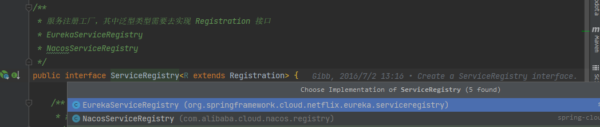
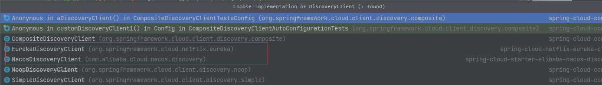

# spring cloud commons

spring cloud提供的通用抽象包，组件的实现基本上都依赖于当前包的接口定义实现功能，下面就是梳理一下当前包中都提供了哪些比较重要的接口

## 1. 服务注册

### 1.1 DiscoveryClient

**DiscoveryClient** 是一个顶级的接口类，用于定义客户端的发现功能

```java
public interface DiscoveryClient extends Ordered {
	/**
	 * 默认的排序
	 */
	int DEFAULT_ORDER = 0;
	/**
	 * 客户端描述
	 */
	String description();
	/**
	 * 根据服务id获取到对应的服务实例
	 */
	List<ServiceInstance> getInstances(String serviceId);
	/**
	 * 获取到所有的服务名称
	 */
	List<String> getServices();
	/**
	 * 获取到默认的排序
	 */
	@Override
	default int getOrder() {
		return DEFAULT_ORDER;
	}
}
```

目前通过实现可以看到有 **eureka和nacos** 的实现类，而导入客户端发现功能的是通过 **@EnableDiscoveryClient** 注解进行导入



Spring Cloud Commons 提供了 **@EnableDiscoveryClient** 注解。这将寻找 **META-INF/spring.factories** 文件中 **DiscoveryClient** 接口的实现类，但是一般 **nacos和eureka** 并没有通过配置文件的方式进行导入，都是通过自动装配类进行导入的

```java
@Target(ElementType.TYPE)
@Retention(RetentionPolicy.RUNTIME)
@Documented
@Inherited
@Import(EnableDiscoveryClientImportSelector.class)
public @interface EnableDiscoveryClient {

	/**
	 * 是否自动注册服务，默认为true
	 */
	boolean autoRegister() default true;

}
```

导入的 **EnableDiscoveryClientImportSelector** 中将 **spring.factories** 中  **DiscoveryClient** 的实现类加载出来然后注册到容器中

```java
public class EnableDiscoveryClientImportSelector
		extends SpringFactoryImportSelector<EnableDiscoveryClient> {

	@Override
	public String[] selectImports(AnnotationMetadata metadata) {
        //父类方法会通过泛型注解的类型去 spring.factories 文件中进行加载
		String[] imports = super.selectImports(metadata);
		//获取到注解上的数据信息
		AnnotationAttributes attributes = AnnotationAttributes.fromMap(
				metadata.getAnnotationAttributes(getAnnotationClass().getName(), true));
		//是否进行自动注册
		boolean autoRegister = attributes.getBoolean("autoRegister");
		//如果需要自动注册直接导入：AutoServiceRegistrationConfiguration
		if (autoRegister) {
			List<String> importsList = new ArrayList<>(Arrays.asList(imports));
			importsList.add(
					"org.springframework.cloud.client.serviceregistry.AutoServiceRegistrationConfiguration");
			imports = importsList.toArray(new String[0]);
		}
		else {
			//判断环境的类型，然后指定自动注册属性为false （spring.cloud.service-registry.auto-registration.enabled）
			Environment env = getEnvironment();
			if (ConfigurableEnvironment.class.isInstance(env)) {
				ConfigurableEnvironment configEnv = (ConfigurableEnvironment) env;
				LinkedHashMap<String, Object> map = new LinkedHashMap<>();
				map.put("spring.cloud.service-registry.auto-registration.enabled", false);
				MapPropertySource propertySource = new MapPropertySource(
						"springCloudDiscoveryClient", map);
				configEnv.getPropertySources().addLast(propertySource);
			}

		}

		return imports;
	}
}
```

### 1.2 ServiceInstance

服务实例的接口用于定义当前服务的信息，实现类中会通过下面的 **Registration** 子接口进行限定操作

```java
public interface ServiceInstance {

	/**
	 * 获取到当前实例的id
	 */
	default String getInstanceId() {
		return null;
	}

	/**
	 * 获取到服务的id
	 */
	String getServiceId();

	/**
	 * host主机名
	 */
	String getHost();

	/**
	 * 端口
	 */
	int getPort();

	/**
	 * 是否采用https进行通信
	 */
	boolean isSecure();

	/**
	 * 获取到服务的uri地址
	 */
	URI getUri();

	/**
	 * 扩展的元数据信息
	 */
	Map<String, String> getMetadata();

	/**
	 * 获取不同实现的方案
	 */
	default String getScheme() {
		return null;
	}

}
```

#### Registration

**Registration** 接口什么都没有定义，继承了 **ServiceInstance** 中的所有接口方法来定义当前服务的信息

```java
/**
 * 注册服务信息接口，什么都没有定义，主要是通过父级接口 ServiceInstance
 * EurekaRegistration
 * NacosRegistration
 */
public interface Registration extends ServiceInstance {

}
```

### 1.3 AutoServiceRegistration

自定服务注册接口，其中也什么都没有定义，都交给子类 **AbstractAutoServiceRegistration** 进行功能实现

```java
public interface AutoServiceRegistration {

}
```

当前抽象类是 **commons** 提供的一个泛型类，抽出来作为一个父类实现了一些基本的方法，其中泛型限定在必须实现了 **Registration** 接口，上面我们可以看到 **Registration** 什么都没有做方法都定义在了 **ServiceInstance** 之中；当前抽象类还实现了监听器，在发布 **WebServerInitializedEvent** 事件时进行处理

```java
public abstract class AbstractAutoServiceRegistration<R extends Registration>
		implements AutoServiceRegistration, ApplicationContextAware,
		ApplicationListener<WebServerInitializedEvent> {
            
}
```

### 1.4 ServiceRegistry

服务注册工厂，从源码中可以看到 **Eureka和Nacos** 都各自对其进行了复写



```java
public interface ServiceRegistry<R extends Registration> {

	/**
	 * 注册一个实例
	 */
	void register(R registration);

	/**
	 * 取消服务注册
	 */
	void deregister(R registration);

	/**
	 * 一个生命周期的方法，用于关闭 ServiceRegistry
	 */
	void close();

	/**
	 * 设置实例信息的状态信息
	 */
	void setStatus(R registration, String status);

	/**
	 * 获取到实例信息的状态值
	 */
	<T> T getStatus(R registration);

}
```

### 1.5 AutoServiceRegistrationAutoConfiguration

服务自动注册的装配类并没有做什么特别的事，只导入了一个 **AutoServiceRegistrationConfiguration** 配置类

```java
@Configuration(proxyBeanMethods = false)
//导入了当前配置类 AutoServiceRegistrationConfiguration 里面是定义的空配置类
@Import(AutoServiceRegistrationConfiguration.class)
//先判断 spring.cloud.service-registry.auto-registration.enabled 属性是否存在，默认为true需要进行自动注册
@ConditionalOnProperty(value = "spring.cloud.service-registry.auto-registration.enabled",
		matchIfMissing = true)
public class AutoServiceRegistrationAutoConfiguration {

	/**
	 * 注入服务自动注册类
	 */
	@Autowired(required = false)
	private AutoServiceRegistration autoServiceRegistration;

	/**
	 * 服务自动注册的配置类
	 */
	@Autowired
	private AutoServiceRegistrationProperties properties;

	@PostConstruct
	protected void init() {
		//如果服务自动注册为空，并且开启快速失败，直接抛出异常
		if (this.autoServiceRegistration == null && this.properties.isFailFast()) {
			throw new IllegalStateException("Auto Service Registration has "
					+ "been requested, but there is no AutoServiceRegistration bean");
		}
	}

}
```

### 1.6 AutoServiceRegistrationConfiguration

导入了服务自动注册的配置类

```java
@Configuration(proxyBeanMethods = false)
@EnableConfigurationProperties(AutoServiceRegistrationProperties.class)
@ConditionalOnProperty(value = "spring.cloud.service-registry.auto-registration.enabled",
		matchIfMissing = true)
public class AutoServiceRegistrationConfiguration {

}
```

### 1.7 ServiceRegistryAutoConfiguration

```java
@Configuration(proxyBeanMethods = false)
public class ServiceRegistryAutoConfiguration {

	@ConditionalOnBean(ServiceRegistry.class)
	@ConditionalOnClass(Endpoint.class)
	protected class ServiceRegistryEndpointConfiguration {

		/**
		 * 这里需要获取到当前服务的注册信息，根据注册中心的不同，实现类也不同
		 * NacosRegistration、EurekaRegistration
		 */
		@Autowired(required = false)
		private Registration registration;

		/**
		 * 判断端点在使用到的实现技术上是否可以开启使用，注册一个 ServiceRegistryEndpoint 端点服务接口
		 */
		@Bean
		@ConditionalOnAvailableEndpoint
		public ServiceRegistryEndpoint serviceRegistryEndpoint(
				ServiceRegistry serviceRegistry) {
			ServiceRegistryEndpoint endpoint = new ServiceRegistryEndpoint(
					serviceRegistry);
			endpoint.setRegistration(this.registration);
			return endpoint;
		}

	}

}
```

**spring cloud commons** 包中抽出了一些通用的顶级接口用于定义好服务注册的标准，不同的微服务组件通过自己实现接口来实现微服务的服务注册与发现；

- ServiceInstance：定义了当前客户端信息的基础的顶级接口，其中定义了当前客户端的一些基础信息的获取
- Registration：继承了 **ServiceInstance** 接口，当前接口什么都没有定义
- ServiceRegistry<R extends Registration\>：当前接口定义了服务注册的标准api，当客户端启动时如何进行注册以及注销包括设置服务的状态信息，实现类例如：**NacosServiceRegistry**
- AutoServiceRegistration：服务自动注册的接口，当前功能主要是在开启了服务启动时（**spring.cloud.service-registry.auto-registration.enabled**）自动注册提供的标准接口，但是其中并没有定义任何的api方法
- AbstractAutoServiceRegistration<R extends Registration\>：**AutoServiceRegistration** 接口的一个抽象实现类，其中做了一些基础的方法处理，例如：**WebServerInitializedEvent** 事件的处理；实现类可以看 **NacosAutoServiceRegistration**
- DiscoveryClient：定义客户端服务发现的功能，主要用于当前客户端是否可以从远程获取到服务的注册表的信息；实现类例如：**NacosDiscoveryClient**、**EurekaDiscoveryClient** 直接通过服务的名称就可以直接去拉取对应的服务信息

通过 **spring cloud commons** 包的自动装配类可以发现并没有做任何的功能性实现，都是定义出顶级的接口和抽出一些公共的方法，都是交给子类实现

## 2. 负载均衡

### 2.1 @LoadBalanced

负载均衡的注解，具体的源码解析可以看 [@Qualifier源码解析](https://blog.csdn.net/weixin_43915643/article/details/129518136?spm=1001.2014.3001.5501)

```java
@Target({ ElementType.FIELD, ElementType.PARAMETER, ElementType.METHOD })
@Retention(RetentionPolicy.RUNTIME)
@Documented
@Inherited
@Qualifier
public @interface LoadBalanced {

}
```

### 2.2 ServiceInstanceChooser

服务实例选择器，定义接口用于子类进行实现可以通过服务的id来进行实例的选择，返回的是一个 **ServiceInstance** 服务实例信息

```java
/**
 * service实例选择器接口
 */
public interface ServiceInstanceChooser {

	/**
	 * 根据serviceId获取到具体的一个 ServiceInstance 实例对象
	 */
	ServiceInstance choose(String serviceId);

}
```

### 2.3 LoadBalancerClient

负载均衡的客户端接口，通过子类 **RibbonLoadBalancerClient** 来进行功能的实现

```java
/**
 * 负载客户端，继承了 ServiceInstanceChooser
 * RibbonLoadBalancerClient：实现了当前客户端，在 RibbonAutoConfiguration 自动装配中创建
 * BlockingLoadBalancerClient
 */
public interface LoadBalancerClient extends ServiceInstanceChooser {

	/**
	 * 执行根据服务id和负载的请求对象
	 */
	<T> T execute(String serviceId, LoadBalancerRequest<T> request) throws IOException;

	/**
	 * 执行根据传入的服务实例和负载的请求对象
	 */
	<T> T execute(String serviceId, ServiceInstance serviceInstance,
			LoadBalancerRequest<T> request) throws IOException;

	/**
	 * 根据service的实例重新构建uri地址
	 */
	URI reconstructURI(ServiceInstance instance, URI original);

}
```

### 2.4 RestTemplateCustomizer

RestTemplate自定义配置器，负载均衡拦截器的植入就是在这里进行添加通过 **LoadBalancerAutoConfiguration** 自动装配类

```java
public interface RestTemplateCustomizer {

	/**
	 * RestTemplate 自定义配置器
	 *
	 * @param restTemplate restTemplate对象
	 */
	void customize(RestTemplate restTemplate);

}
```

### 2.5 LoadBalancerRequestTransformer

用于自定义 **HttpRequest** 进行转换的接口，目的是将普通的 **HttpRequest** 类转换为支持负载均衡请求的类

```java
@Order(LoadBalancerRequestTransformer.DEFAULT_ORDER)
public interface LoadBalancerRequestTransformer {

	/**
	 * Order for the load balancer request tranformer.
	 */
	int DEFAULT_ORDER = 0;

	/**
	 * 转换HttpRequest对象
	 *
	 * @param request 需要发起请求的request
	 * @param instance	服务实例信息
	 * @return
	 */
	HttpRequest transformRequest(HttpRequest request, ServiceInstance instance);

}
```

### 2.6 LoadBalancerRequest<T\>

```java
/**
 * 负载请求的实体，返回值是泛型类
 */
public interface LoadBalancerRequest<T> {

	//通过具体的服务实例发起请求
	T apply(ServiceInstance instance) throws Exception;

}
```

### 2.7 LoadBalancerRequestFactory

负载均衡请求实例的工厂，通过方法 **createRequest()** 创建一个 **LoadBalancerRequest** 接口的实例对象用于支持负载均衡；

```java
public class LoadBalancerRequestFactory {

	/**
	 * 注入负载的客户端，RibbonAutoConfiguration中配置的 RibbonLoadBalancerClient
	 */
	private LoadBalancerClient loadBalancer;

	private List<LoadBalancerRequestTransformer> transformers;

	public LoadBalancerRequestFactory(LoadBalancerClient loadBalancer,
			List<LoadBalancerRequestTransformer> transformers) {
		this.loadBalancer = loadBalancer;
		this.transformers = transformers;
	}

	public LoadBalancerRequestFactory(LoadBalancerClient loadBalancer) {
		this.loadBalancer = loadBalancer;
	}

	/**
	 * 将普通的请求对象转换为 LoadBalancerRequest 接口的实现
	 * @param request
	 * @param body
	 * @param execution
	 * @return
	 */
	public LoadBalancerRequest<ClientHttpResponse> createRequest(
			final HttpRequest request, final byte[] body,
			final ClientHttpRequestExecution execution) {
		return instance -> {
			//包装一层http请求，让其可以拥有重写uri的能力通过负载工厂
			HttpRequest serviceRequest = new ServiceRequestWrapper(request, instance,
					this.loadBalancer);
			//通过 transformers 进行转换请求
			if (this.transformers != null) {
				for (LoadBalancerRequestTransformer transformer : this.transformers) {
					serviceRequest = transformer.transformRequest(serviceRequest,
							instance);
				}
			}
			return execution.execute(serviceRequest, body);
		};
	}

}
```

**LoadBalancerRequestFactory** 中包含多个 **LoadBalancerRequestTransformer** ，然后通过工厂方法创建 **LoadBalancerRequest**实例，这三个接口进行搭配使用

总结：ribbon组件通过 **RibbonLoadBalancerClient** 去实现 **LoadBalancerClient** 然后通过 **LoadBalancerAutoConfiguration** 自动装配中注入 **RestTemplate** bean对象后进行自定义添加拦截器 **LoadBalancerInterceptor** 和通过 **RibbonLoadBalancerClient** 实现负载

### 2.8 **com.netflix.loadbalancer** 

以下是 **com.netflix.loadbalancer** 提供的负载均衡相关的接口

#### 2.8.1 ILoadBalancer

顶级的负载均衡策略接口，通过子类实现，在spring中一般使用默认的实现 **ZoneAwareLoadBalancer** 通过 **RibbonClientConfiguration** 自动装配进行配置

```java
public interface ILoadBalancer {

	/**
	 *添加服务列表
	 */
	public void addServers(List<Server> newServers);
	
	/**
	 * 选择一个服务实例
	 */
	public Server chooseServer(Object key);
	
	/**
	 * 标记服务已经宕机
	 */
	public void markServerDown(Server server);
    
	@Deprecated
	public List<Server> getServerList(boolean availableOnly);

	/**
	 * 获取到只能访问的服务
     */
    public List<Server> getReachableServers();

    /**
     * 获取到所有的服务
     */
	public List<Server> getAllServers();
}
```

#### 2.8.2 IRule

负载均衡的规则，这里一般也使用默认的 **ZoneAvoidanceRule** 通过 **RibbonClientConfiguration** 自动装配进行配置

```java
public interface IRule{
    /*
     * 根据key选择服务
     */
    public Server choose(Object key);
    /*
     * 设置负载均衡器
     */
    public void setLoadBalancer(ILoadBalancer lb);
    /*
     * 获取负载均衡器
     */
    public ILoadBalancer getLoadBalancer();    
}
```

#### 2.8.3 Server

定义的服务类，一般通过子类进行复写，例如：**NacosServer** 、**ZookeeperServer**

```java
public class Server {
    //主机
    private String host;
    //端口
    private int port = 80;
    //限定
    private String scheme;
    //服务的id
    private volatile String id;
    //是否活跃
    private volatile boolean isAliveFlag;
    //区分的区域
    private String zone = UNKNOWN_ZONE;
    //是否准备好
    private volatile boolean readyToServe = true;
	//元数据信息
    private MetaInfo simpleMetaInfo
}
```

#### 2.8.4 ServerList

服务列表的接口，这个接口就是交给子类进行实现用来获取所有的服务实例的接口，服务进行初始化时，会掉用 **getUpdatedListOfServers()** 获取到服务列表；具体初始化调用是在 **ZoneAwareLoadBalancer** 构造函数中调用**restOfInit()** 进行初始化服务列表的

```java
public interface ServerList<T extends Server> {
	/**
     * 获取到初始的服务列表
     */
    public List<T> getInitialListOfServers();
    /**
     * 获取到更新后的服务列表，周期为30秒（可配置）
     */
    public List<T> getUpdatedListOfServers();   
}
```

## 3. 服务调用

### 3.1 NamedContextFactory

spring cloud common中提供的一个名称上下文工厂，在 **openFeign** 中就用于上下文的指定，是一个泛型抽象类，**C extends NamedContextFactory.Specification**，其中可以根据名字来对应不同的上下文容器

- FeignContext：feign中用于进行接口配置的上下文
- SpringClientFactory：ribbon中用于负载获取的客户端工厂（在openFeign中进行负载的入口）

```java
public abstract class NamedContextFactory<C extends NamedContextFactory.Specification>
		implements DisposableBean, ApplicationContextAware {
    /**
	 * 配置资源的名称
	 */
	private final String propertySourceName;

	/**
	 * 配置名称
	 */
	private final String propertyName;

	/**
	 * 通过名称和容器进行对应，1个名称对应一个容器
	 * openFeign 的实现就是一个接口就会对应一个上下文的容器
	 */
	private Map<String, AnnotationConfigApplicationContext> contexts = new ConcurrentHashMap<>();

	/**
	 * 指定配置对象
	 */
	private Map<String, C> configurations = new ConcurrentHashMap<>();

	/**
	 * 父级的全局容器
	 */
	private ApplicationContext parent;

	/**
	 * 默认配置类型
	 */
	private Class<?> defaultConfigType;
    
    //核心方法，创建子容器
    protected AnnotationConfigApplicationContext createContext(String name) {
		//创建一个spring的普通注解上下文
		AnnotationConfigApplicationContext context = new AnnotationConfigApplicationContext();
		//当前 configurations 包含了容器中所有的配置对象，如果是feign，这个配置的类型就是 FeignClientSpecification
		if (this.configurations.containsKey(name)) {
			//将配置文件注册到容器中
			for (Class<?> configuration : this.configurations.get(name)
					.getConfiguration()) {
				context.register(configuration);
			}
		}
		//注册默认的配置文件对象
		for (Map.Entry<String, C> entry : this.configurations.entrySet()) {
			if (entry.getKey().startsWith("default.")) {
				for (Class<?> configuration : entry.getValue().getConfiguration()) {
					context.register(configuration);
				}
			}
		}
		//初始化一些环境的配置进行，并且注入配置资源的名称可以读取yaml配置文件中的配置信息
		context.register(PropertyPlaceholderAutoConfiguration.class,
				this.defaultConfigType);
		context.getEnvironment().getPropertySources().addFirst(new MapPropertySource(
				this.propertySourceName,
				Collections.<String, Object>singletonMap(this.propertyName, name)));
		if (this.parent != null) {
			// 给当前容器设置父容器，如果子容器获取不到再去父容器中获取
			context.setParent(this.parent);
			context.setClassLoader(this.parent.getClassLoader());
		}
		//生成容器上下文展示的名称
		context.setDisplayName(generateDisplayName(name));
		//刷新容器
		context.refresh();
		return context;
	}
}
```


