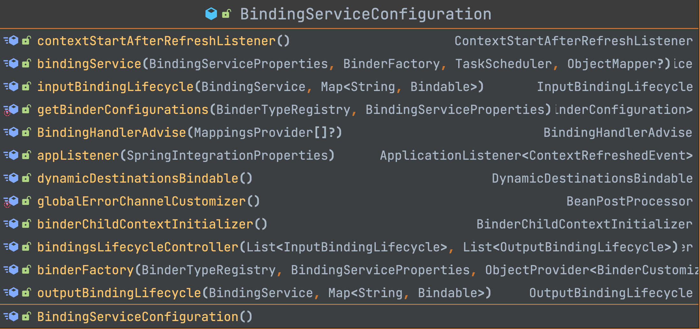
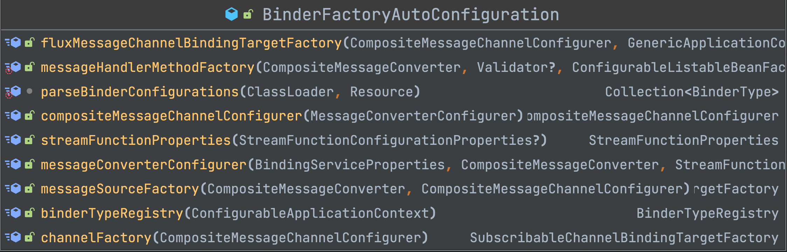
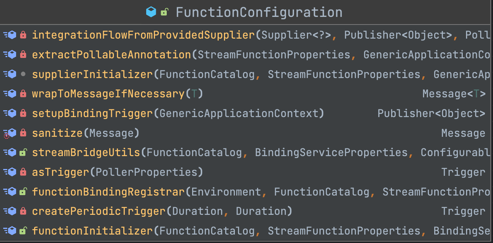
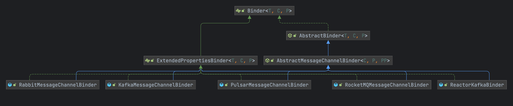
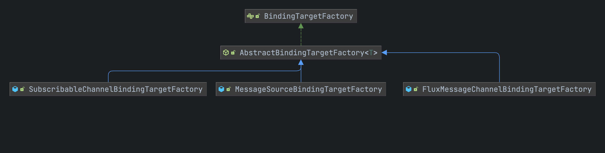
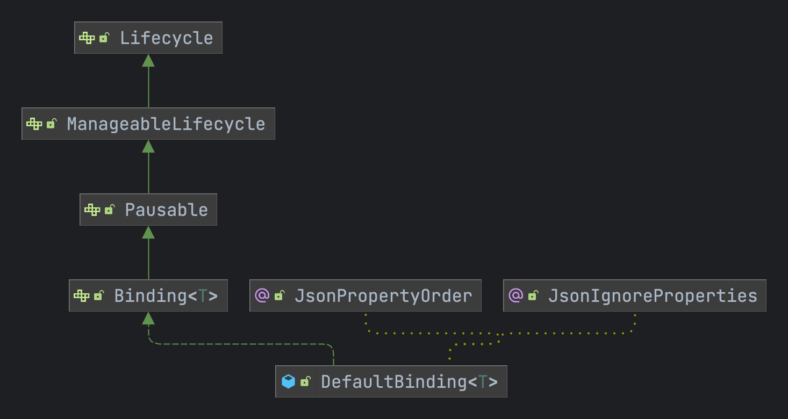
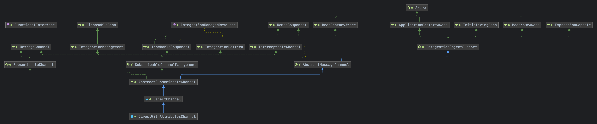

# Spring Cloud Stream

## 一、简介

spring cloud stream是spring cloud抽象出来用于屏蔽各种中间件的对接而提供的组件,使用者只需要掌握spring cloud stream的配置信息就可以实现各种消息中间件的使用.目前主流的中间件如下:

- rabbitmq
- rocketmq
- kafka
- activemq

> [spring cloud stream官方使用文档](https://docs.spring.io/spring-cloud-stream/docs/current/reference/html/spring-cloud-stream.html#spring-cloud-stream-preface-notable-deprecations)

官方所提供的架构图


spring cloud stream抽象出了几个比较核心的组件

- Binder:绑定器,通过各个中间件提供商来进行实现,屏蔽了不同中间的不同实现
- Binding:用于绑定容器的生产者和消费者
- Input:输入流,用于对应消费者
- Output:输出流,用于对应生产者

## 二、实战

[SpringCloud之Stream消息驱动RocketMQ讲解_spring cloud stream rocketmq-CSDN博客](https://blog.csdn.net/u012060033/article/details/131271733)

### 1. rocketmq

**spring-cloud-starter-stream-rocketmq** 实现了 rocketmq和spring cloud stream的集成

#### 配置

```yaml
spring:
  cloud:
    stream:
      function:
        definition: producer;consumer;
      rocketmq:
        binder:
          name-server: rocketmq.server:9876
        bindings:
          producer-out-0:
            producer:
              group: atom-demo-producer
          consumer-in-0:
            consumer:
              group: atom-demo-consumer
      bindings:
        producer-out-0: #输出到对应到topic名称为 atom-demo-topic，内容为json
          destination: atom-demo-topic
          content-type: application/json
        consumer-in-0: #构建消费者
          destination: atom-demo-topic
          content-type: text/plain
  application:
    name: atom-mq-spring-boot-sample
server:
  port: 8900
```

#### 依赖

- jdk17
- spring cloud alibaba:2023.0.0.0-RC1
- spring cloud stream:4.1.0

```xml
<dependency>
    <groupId>com.alibaba.cloud</groupId>
    <artifactId>spring-cloud-starter-stream-rocketmq</artifactId>
    <version>2023.0.0.0-RC1</version>
</dependency>
```
#### 代码

生产者

```java
@SpringBootApplication
public class RocketmqApplication {

    @Resource
    private StreamBridge streamBridge;

    /**
     * After
     *
     * @since 2024.2.0
     */
    protected void after() {
        Message<String> message = new GenericMessage<>("hello world");
        //跟配置文件中的生产者名称需要对应上，需要用哪一个生产者来发送消息
        this.streamBridge.send("producer-out-0", message);
    }
}
```

消费者的bean名称需要跟配置文件中的 **spring.cloud.stream.function.definition** 对应上

```java
@Configuration
public class AtomConsumerConfiguration {


    /**
     * Receive input
     *
     * @return the consumer
     * @since 2024.2.0
     */
    @Bean
    public Consumer<Message<String>> consumer() {
        return message -> System.out.println("接收到消息：" + message.getPayload());
    }

}
```

## 三、源码

![[images/构建流程.svg]]

### 1. 自动装配

**spring cloud stream** 作为顶级依赖,定义了基础接口类供后续各种中间件的实现以及无缝衔接,在通过自动装配类来跟 **spring boot** 进行自动绑定生产者和消费者,**spring cloud stream** 定义的比较核心的自动装配类如下

- BindingServiceProperties：消息生产者和消费者的配置类
- BindingServiceConfiguration：绑定服务自动装配(核心)
	- BindingHandlerAdvise：配置的增强器,用于指定一些默认的配置交给子类来实现
	- binderFactory: 绑定器的工厂方法,用于根据配置创建中间件的绑定器,默认使用 DefaultBinderFactory
	- getBinderConfigurations：用于对配置 spring.cloud.stream.binders 指定的配置转换为 BinderConfiguration 类型
	- binderChildContextInitializer：创建了一个绑定器工厂的初始化器,用于调用 ApplicationContextInitializer 类型
	- bindingService：绑定服务也是核心,通过Binder创建Binding
	- outputBindingLifecycle：创建生产者的绑定器,默认OutputBindingLifecycle
	- inputBindingLifecycle：创建消费者的绑定器,默认为InputBindingLifecycle
	- bindingsLifecycleController：消费者和生产者生命周期的控制器



- BinderFactoryAutoConfiguration：绑定器需要的一些工厂类自动装配类
	- messageHandlerMethodFactory: 消息处理的工厂方法,用于创建方法的执行器,默认使用DefaultMessageHandlerMethodFactory
	- binderTypeRegistry: META-INF/spring.binders 中指定的类型注册工厂例如: 默认使用DefaultBinderTypeRegistry
	- rocketmq: com.alibaba.cloud.stream.binder.rocketmq.autoconfigurate.RocketMQBinderAutoConfiguration
	- kafka: org.springframework.cloud.stream.binder.kafka.config.KafkaBinderConfiguration
	- streamFunctionProperties：映射spring.cloud.stream.function.bindings 配置,默认使用StreamFunctionProperties
	- messageConverterConfigurer：消息转换器的配置类,默认 MessageConverterConfigurer,需要读取spring容器中的CompositeMessageConverter的bean
	- compositeMessageChannelConfigurer：聚合管道的配置类,将StreamFunctionProperties配置的信息进行绑定管道



- FunctionConfiguration：函数映射的自动装配，通过配置文件和代码中定义的函数式接口进行绑定
	- functionBindingRegistrar：继承了 **InitializingBean** 启动时扫描出所有的函数接口创建代理工厂进行关联消费者和生产者,默认使用的是 FunctionBindingRegistrar




#### FunctionBindingRegistrar

解析的是 **spring.cloud.stream.function.bindgins** 配置的消费者和生产的对应函数名称，会将配置文件中定义好的函数接口分别创建一个 **BindableFunctionProxyFactory** 提供给 **InputBindingLifecycle与InputBindingLifecycle** 进行创建对应的消费者和生产者

```java
private static class FunctionBindingRegistrar implements InitializingBean, ApplicationContextAware, EnvironmentAware {
  
	@Override  
	public void afterPropertiesSet() throws Exception {  
	    /**  
	     *     * 如果 spring.cloud.function.definition配置属性定义了数据，那么优先使用spring.cloud.function.definition配置  
	     * 如果没有配置definition属性并且开启了 spring.cloud.stream.function.autodetect 自动探测函数则通过函数工厂获取到所有的函数名称  
	     */  
	    this.determineFunctionName(this.functionCatalog, this.environment);  
	    //处理spring中定义的函数接口bean对象  
	    if (StringUtils.hasText(this.streamFunctionProperties.getDefinition())) {  
	       /**  
	        * 通过配置的函数名称从spring容器中获取到对应的bean名称，将配置的definition属性中的函数进行处理  
	        * 处理字符串中使用 ,或者;或者｜进行分割函数名称  
	        */  
	       String[] functionDefinitions = this.filterEligibleFunctionDefinitions();  
	       for (String functionDefinition : functionDefinitions) {  
	          //根据定义的名称获取到对应的函数包装类，这是去spring中通过名称进行获取函数接口  
	          FunctionInvocationWrapper function = this.functionCatalog.lookup(functionDefinition);  
	          if (function != null) {  
	             //根据函数的类型来判断是消费者还是生产者，如果是Supplier类型那么就是生产者，如果是Consumer、RoutingFunction函数就是消费者  
	             if (function.isSupplier()) {  
	                this.inputCount = 0;  
	                //方法输出的返回值个数  
	                this.outputCount = this.getOutputCount(function, true);  
	             }  
	             // 判断函数是否是Consumer或者是RoutingFunction类型  
	             else if (function.isConsumer() || function.isRoutingFunction()) {  
	                // 计算函数的输入参数个数  
	                this.inputCount = FunctionTypeUtils.getInputCount(function);  
	                this.outputCount = 0;  
	             }  
	             else {  
	                this.inputCount = FunctionTypeUtils.getInputCount(function);  
	                // 是否是BiConsumer类型  
	                if (function.isWrappedBiConsumer()) {  
	                   this.outputCount = 0;  
	                }  
	                else {  
	                   this.outputCount = this.getOutputCount(function, false);  
	                }  
	             }  
	             AtomicReference<BindableFunctionProxyFactory> proxyFactory = new AtomicReference<>();  
	             //创建默认的函数代理工厂 BindableFunctionProxyFactory             if (function.isInputTypePublisher()) {  
	                //如果是 Mono或者Flux等响应式的话 需要设置支持的特性配置  
	                final SupportedBindableFeatures supportedBindableFeatures = new SupportedBindableFeatures();  
	                supportedBindableFeatures.setPollable(false);  
	                supportedBindableFeatures.setReactive(true);  
	                proxyFactory.set(new BindableFunctionProxyFactory(functionDefinition,  
	                   this.inputCount, this.outputCount, this.streamFunctionProperties, supportedBindableFeatures));  
	             }  
	             else {  
	                proxyFactory.set(new BindableFunctionProxyFactory(functionDefinition,  
	                   this.inputCount, this.outputCount, this.streamFunctionProperties));  
	             }  
	             //将BindableFunctionProxyFactory注入到spring容器中，InputBindingLifecycle和OutputBindingLifecycle中会去获取对应的BindableFunctionProxyFactory  
	             ((GenericApplicationContext) this.applicationContext).registerBean(functionDefinition + "_binding",  
	                BindableFunctionProxyFactory.class, () -> proxyFactory.get());  
	          }  
	          else {  
	             this.logger.warn("The function definition '" + this.streamFunctionProperties.getDefinition() +  
	                   "' is not valid. The referenced function bean or one of its components does not exist");  
	          }  
	       }  
	    }  
	    /**  
	     * 根据 spring.cloud.stream 配置中配置的 inputBindings，outputBindings创建对应的 BindableFunctionProxyFactory 代理绑定工厂  
	     */  
	    this.createStandAloneBindingsIfNecessary(this.applicationContext.getBean(BindingServiceProperties.class));
	}
}
```

#### BeanFactoryAwareFunctionRegistry

这个 **spring .cloud.function** 提供的用于注册bean中函数接口的工厂类型


比较核心的方法就是 **lookup、getNames** 方法

- lookup
  - 方法的目的是根据第一的函数接口名称从容器中查询出来
  - 将函数接口解析为 FunctionRegistration 类型
  - 根据函数的类型进行包装
  - 最后注册到 functionRegistrations 缓存当中
- getNames
  - 通过类型去查询,如果传入的类型为空,直接返回容器中所有的 Function、Supplier、Consumer、BiFunction、BiConsumer、FunctionRegistration等类型
  - 如果不为空则根据类型去容器中查询

#### AbstractBindingLifecycle

通过自动装配 **BindingServiceConfiguration** 中装配并且通过 **BindingsLifecycleController** 控制器来调用对应的方法来自动进行创建消费者和生产者

- InputBindingLifecycle：创建消费者
- OutputBindingLifecycle：创建生产者

比较核心的方法就是 **doStartWithBindable()** 通过 **Bindable** 也就是上面创建的 **BindableFunctionProxyFactory** 来进行调用并且通过 **BindingService** 来进行创建

```java
void doStartWithBindable(Bindable bindable) {  
    Collection<Binding<Object>> bindableBindings = bindable  
          .createAndBindOutputs(this.bindingService);  
    if (!CollectionUtils.isEmpty(bindableBindings)) {  
       this.outputBindings.addAll(bindableBindings);  
    }  
}

@Override  
public Collection<Binding<Object>> createAndBindOutputs(  
    BindingService bindingService) {  
    List<Binding<Object>> bindings = new ArrayList<>();  
    // 遍历输出的持有器  
    for (Map.Entry<String, BoundTargetHolder> boundTargetHolderEntry : this.outputHolders  
       .entrySet()) {  
       BoundTargetHolder boundTargetHolder = boundTargetHolderEntry.getValue();  
       // key值为函数的名称  
       String outputTargetName = boundTargetHolderEntry.getKey();  
       // boundTargetHolder.getBoundTarget() 则为创建的消息管道
       if (boundTargetHolderEntry.getValue().isBindable()) {  
          bindings.add(bindingService.bindProducer(  
             boundTargetHolder.getBoundTarget(), outputTargetName));  
       }  
    }  
    return bindings;  
}
```


#### 相关配置类

- StreamFunctionConfigurationProperties: 用于映射 **spring.cloud.stream.function** 配置属性
- BindingServiceProperties: 用于映射 **spring.cloud.stream** 属性
- StreamFunctionProperties:stream函数的配置用于代码内部转换使用
- BinderProperties:绑定器的配置
- BindingProperties:绑定关系的配置
- StreamFunctionProperties:函数转换的配置
- ConsumerProperties:消费者配置
- ProducerProperties:生产者配置
- ExtendedProducerProperties:扩展配置类用于包含子类的扩展信息
- RocketMQBinderConfigurationProperties:rocketmq绑定器的额外映射配置,用于配置扩展信息的
- RocketMQExtendedBindingProperties:用于配置文件中 **spring.cloud.stream.rocketmq**

![[images/Stream配置包含关系.svg]]


### 2. BindingService

BindingService创建消费者和生产者的核心方法

```java
public class BindingService {  
    /**  
     * 配置信息 spring.cloud.stream 映射的  
     */  
    private final BindingServiceProperties bindingServiceProperties;  
  
    /**  
     * 生产者的绑定关系  
     */  
    private final Map<String, Binding<?>> producerBindings = new HashMap<>();  
  
    /**  
     * 消费者的绑定关系
     */  
    private final Map<String, List<Binding<?>>> consumerBindings = new HashMap<>();  
  
    /**  
     * 任务定时器  
     */  
    private final TaskScheduler taskScheduler;  
  
    /**  
     * Binder 的工厂类  
     */  
    private final BinderFactory binderFactory;

}
```

执行生产者的绑定:

- output：指定的消息管道类型，目前默认 DirectWithAttributesChannel
- outputName：指定的生产者的名称，也就是在配置文件中指定的
- cache：是否将生产者和管道的创建的绑定器进行缓存
- binder：是否指定了绑定器，没有指定就从spring容器中进行获取

```java
public <T> Binding<T> bindProducer(T output, String outputName, boolean cache, @Nullable Binder<T, ?, ProducerProperties> binder) {  
    // 读取spring.cloud.stream.bindings.<name>.destination 的配置名称  
    String bindingTarget = this.bindingServiceProperties.getBindingDestination(outputName);  
    // 获取到输入的消息管道类型，默认使用的是DirectWithAttributesChannel  
    Class<?> outputClass = output.getClass();  
    // 判断管道消息是否实现了 advised    if (output instanceof Advised advisedOutput) {  
       outputClass = Stream.of(advisedOutput.getProxiedInterfaces()).filter(c -> !c.getName().contains("org.springframework")).findFirst()  
             .orElse(outputClass);  
    }  
    // 如果传入的binder绑定器为空，那么需要通过this.binderFactory绑定器工厂来进行获取，Binder也就是通过各个厂商来进行实现  
    if (binder == null) {  
       binder = (Binder<T, ?, ProducerProperties>) this.getBinder(outputName, outputClass);  
    }  
    // 获取到生产者  
    ProducerProperties producerProperties = this.bindingServiceProperties  
          .getProducerProperties(outputName);  
  
    // 如果绑定器实现了ExtendedPropertiesBinder，那么就会将扩展的生产者配置信息和生产者配置信息进行合并  
    if (binder instanceof ExtendedPropertiesBinder extendedPropertiesBinder) {  
       Object extension = extendedPropertiesBinder.getExtendedProducerProperties(outputName);  
       ExtendedProducerProperties extendedProducerProperties = new ExtendedProducerProperties<>(  
             extension);  
       BeanUtils.copyProperties(producerProperties, extendedProducerProperties);  
  
       producerProperties = extendedProducerProperties;  
    }
    // 设置绑定名称  
    producerProperties.populateBindingName(outputName);  
    // 验证  
    this.validate(producerProperties);  
    /**  
     * 执行生产者信息进行绑定，将对应的消息管道和对应的消息生产者进行绑定  
     * 判断是否指定了重试次数 bindingRetryInterval，默认是重试30次  
     */  
    Binding<T> binding = this.doBindProducer(output, bindingTarget, binder,  
          producerProperties);  
    // 更新分区数  
    ProducerProperties originalProducerProperties = this.bindingServiceProperties  
       .getProducerProperties(outputName);  
    if (originalProducerProperties.getPartitionCount() < producerProperties.getPartitionCount()) {  
       originalProducerProperties.setPartitionCount(producerProperties.getPartitionCount());  
    }  
    if (cache) {  
       this.producerBindings.put(outputName, binding);  
    }  
    return binding;  
}
```


### 2. Binder

**Binder** 通过spring cloud stream抽象为中间件跟spring cloud的连接器,通过各个中间件厂商来分别进行实现,下面是 **Binder** 的依赖关系图可以看到 **rocketmq、kafka、rabbitmq** 等都实现了自己中间件的 **Binder** 绑定器



绑定器方法三个泛型类型：
- T具体绑定的类型子类确定
- C消费者配置
- P生产者配置
```java
public interface Binder<T, C extends ConsumerProperties, P extends ProducerProperties> {

	/**
	 * 返回当前绑定器的标识符
	 *
	 * @return instance identity of this binder
	 */
	default String getBinderIdentity() {
		return String.valueOf(this.hashCode());
	}

	/**
	 * 开始绑定消费者
	 *
	 * @param name 消费者的名称
	 * @param group 消费者分组，同一个分组消息共享
	 * @param inboundBindTarget 绑定一个接口consumer方法
	 * @param consumerProperties 消费者配置
	 * @return the setup binding
	 */
	Binding<T> bindConsumer(String name, String group, T inboundBindTarget,
			C consumerProperties);

	/**
	 * 生产者
	 * 
	 * @param name 名称
	 * @param outboundBindTarget 绑定生产者
	 * @param producerProperties 生产者配置
	 * @return the setup binding
	 */
	Binding<T> bindProducer(String name, T outboundBindTarget, P producerProperties);

}
```

通过继承的接口图,整个继承图是子类都继承抽象类 **AbstractMessageChannelBinder**, 然后继承 **AbstractBinder**

AbstractBinder:三个泛型指定了配置类型,继承了 InitializingBean 在初始化会调用 **afterPropertiesSet()** 方法设置一下表达式的解析器,然后调用 **onInit()**

```java
public abstract class AbstractBinder<T, C extends ConsumerProperties, P extends ProducerProperties>
		implements ApplicationContextAware, InitializingBean, Binder<T, C, P> {
  
  public final void afterPropertiesSet() throws Exception {
		Assert.notNull(this.applicationContext,
				"The 'applicationContext' property must not be null");
		if (this.evaluationContext == null) {
			this.evaluationContext = ExpressionUtils
					.createStandardEvaluationContext(getBeanFactory());
		}
		onInit();
	}
  
  protected void onInit() throws Exception {
		// no-op default
	}
}
```

**AbstractMessageChannelBinder** :三个泛型指定了

- C:消费者配置
- P:消费者配置
- PP: 继承ProvisioningProvider的实现类用于创建生产者和消费者的**目的地(也就是topic信息)**
- MessageChannel:指定了当前的消息管类型也就是接口中的 **T** 类型

```java
public abstract class AbstractMessageChannelBinder<C extends ConsumerProperties, P extends ProducerProperties, PP extends ProvisioningProvider<C, P>>
		extends AbstractBinder<MessageChannel, C, P> implements
		PollableConsumerBinder<MessageHandler, C>, ApplicationEventPublisherAware {
}
```

下面以 **rocketmq为例子**,继承了 **AbstractMessageChannelBinder**,指定了泛型的具体类型

- ExtendedConsumerProperties:消费者配置
- ExtendedProducerProperties:生产者的配置
- RocketMQTopicProvisioner:根据配置信息创建对应的消费者和生产的对象配置

```java
public class RocketMQMessageChannelBinder extends
		AbstractMessageChannelBinder<ExtendedConsumerProperties<RocketMQConsumerProperties>, ExtendedProducerProperties<RocketMQProducerProperties>, RocketMQTopicProvisioner>
		implements
		ExtendedPropertiesBinder<MessageChannel, RocketMQConsumerProperties, RocketMQProducerProperties> {
  
}
```

#### 2.1 方法说明

一般子类实现都需要继承 **AbstractMessageChannelBinder** ,而 **AbstractMessageChannelBinder** 又继承至 **AbstractBinder**

##### AbstractBinder

###### 属性

- applicationContext:spring容器
- evaluationContext:表达式解析
- consumerBindingRetryTemplates:消费重试器

###### 方法

- onInit:bean加载完成的回调函数
- doBindConsumer: 抽象方法交给子类实现
- doBindProducer: 抽象方法交给子类实现
- bindConsumer:绑定消费者,检查了一下分组是否合法,调用doBindConsumer
- bindProducer:直接调用了 doBindProducer
- buildRetryTemplate:根据配置构建重试器

###### AbstractMessageChannelBinder

###### 属性

- provisioningProvider:子类实现的配置解析例如rocketmq: **RocketMQTopicProvisioner**

###### 方法

- doBindProducer：执行创建生产者,将大部分公共逻辑进行编写了,最终交给中间件实现的方法是 **createProducerMessageHandler()** 方法创建自己的 **MessageChannel**,例如rocketmq :RocketMQProducerMessageHandler
- doBindConsumer：执行创建消费者,最终创建由 **createConsumerEndpoint()** 方法让子类进行创建 **MessageProducer**,例如rocketmq: **RocketMQInboundChannelAdapter**,然后父类创建一个包装类 **DefaultBinding** 

#### 2.1 绑定消费者

**doBindConsumer** 方法是 **AbstractMessageChannelBinder** 抽取的公共方法 **createConsumerEndpoint()** 方法交给了子类进行实现

```java
public final Binding<MessageChannel> doBindConsumer(String name, String group,
			MessageChannel inputChannel, final C properties) throws BinderException {
		//spring-message 提供的消息生产者的顶级接口
		MessageProducer consumerEndpoint = null;
		try {
			//根据配置对象来创建消费者的topic信息
			ConsumerDestination destination = this.provisioningProvider
					.provisionConsumerDestination(name, group, properties);
			//根据消息头的模型来添加 EmbeddedHeadersChannelInterceptor 增强的拦截器
			if (HeaderMode.embeddedHeaders.equals(properties.getHeaderMode())) {
				enhanceMessageChannel(inputChannel);
			}
			/**
			 * 创建消费者的端点 MessageProducer，用于跟消息管道进行绑定，对于消费者来说 mq-->服务 mq就是消息的生产者，所以创建的是 MessageProducer
			 * 而对于生产者的消息发送来说，服务 --> mq 就需要创建 MessageHandler，用来处理程序发出的消息
			 */
			consumerEndpoint = createConsumerEndpoint(destination, group, properties);
			//设置好输入管道，对于mq来说服务就是输入方，服务收到消息将消息发送到订阅的管道中
			consumerEndpoint.setOutputChannel(inputChannel);
			//消费者自定义的配置执行器
			this.consumerCustomizer.configure(consumerEndpoint, name, group);
			//判断创建的消息生产者是否实现了 InitializingBean，这里默认就会执行，会进行消息监听器的订阅以及创建mq的消费者
			if (consumerEndpoint instanceof InitializingBean initializingConsumerEndpoint) {
				initializingConsumerEndpoint.afterPropertiesSet();
			}
			//如果配置自动启动，这里也会执行，默认为true，启动是
			if (properties.isAutoStartup() && consumerEndpoint instanceof Lifecycle consumerEndpointWithLifecycle) {
				consumerEndpointWithLifecycle.start();
			}
			//创建默认的绑定关系
			BindingServiceProperties bsp = this.getBindingServiceProperties();
			Binding<MessageChannel> binding = new DefaultBinding<MessageChannel>(name,
					group, inputChannel, consumerEndpoint instanceof Lifecycle consumerEndpointWithLifecycle
							? consumerEndpointWithLifecycle : null) {
				//省略
			};
			doPublishEvent(new BindingCreatedEvent(binding));
			return binding;
		}
		catch (Exception e) {
			//省略
		}
	}
```

现在以 **rocketmq** 的创建生产者消息的处理器为例子

```java
protected MessageHandler createProducerMessageHandler(ProducerDestination destination,
			ExtendedProducerProperties<RocketMQProducerProperties> extendedProducerProperties,
			MessageChannel channel, MessageChannel errorChannel) throws Exception {
		if (!extendedProducerProperties.getExtension().getEnabled()) {
			throw new RuntimeException("Binding for channel " + destination.getName()
					+ " has been disabled, message can't be delivered");
		}
		//将生产者的配置和扩展配置进行合并
		RocketMQProducerProperties mqProducerProperties = RocketMQUtils
				.mergeRocketMQProperties(binderConfigurationProperties,
						extendedProducerProperties.getExtension());
		//创建rocketmq适配的消息生产者处理器
		RocketMQProducerMessageHandler messageHandler = new RocketMQProducerMessageHandler(
				destination, extendedProducerProperties, mqProducerProperties);
		//设置上下文
		messageHandler.setApplicationContext(this.getApplicationContext());
		if (errorChannel != null) {
			messageHandler.setSendFailureChannel(errorChannel);
		}
		//设置拦截器
		MessageConverterConfigurer.PartitioningInterceptor partitioningInterceptor = ((AbstractMessageChannel) channel)
				.getInterceptors().stream()
				.filter(channelInterceptor -> channelInterceptor instanceof MessageConverterConfigurer.PartitioningInterceptor)
				.map(channelInterceptor -> ((MessageConverterConfigurer.PartitioningInterceptor) channelInterceptor))
				.findFirst().orElse(null);
		//设置spring工厂
		messageHandler.setPartitioningInterceptor(partitioningInterceptor);
		messageHandler.setBeanFactory(this.getApplicationContext().getBeanFactory());
		//设置错误消息的处理策略
		messageHandler.setErrorMessageStrategy(this.getErrorMessageStrategy());
		return messageHandler;
	}
```

#### 2.2 绑定生产者

创建生产者

```java
public final Binding<MessageChannel> doBindProducer(final String destination,
			MessageChannel outputChannel, final P producerProperties)
			throws BinderException {
		final MessageHandler producerMessageHandler;
		final ProducerDestination producerDestination;
		try {
			//获取到消息生产者到配置
			producerDestination = this.provisioningProvider
					.provisionProducerDestination(destination, producerProperties);
			BindingProperties bp = null;
			//获取到绑定服务到配置
			BindingServiceProperties bsp = this.getBindingServiceProperties();
			if (bsp != null) {
				//设置topic到名称
				String bindingName = StringUtils.hasText(producerProperties.getBindingName()) ? producerProperties.getBindingName() : destination;
				bp = bsp.getBindingProperties(bindingName);
			}
			//是否定义了错误信息的管道
			SubscribableChannel errorChannel = (bp != null && StringUtils.hasText(bp.getErrorHandlerDefinition())) || producerProperties.isErrorChannelEnabled()
					? registerErrorInfrastructure(producerDestination, producerProperties.getBindingName()) : null;
			//创建消息的处理器 MessageHandler
			producerMessageHandler = createProducerMessageHandler(producerDestination,
					producerProperties, outputChannel, errorChannel);
			//自定配置消息处理器
			customizeProducerMessageHandler(producerMessageHandler, producerDestination.getName());
			if (producerMessageHandler instanceof InitializingBean initializingHandler) {
				initializingHandler.afterPropertiesSet();
			}
		}
		catch (Exception e) {
			//创建失败抛出异常
		}
		//如果配置了自动启动那么生产者直接开始启动
		if (producerProperties.isAutoStartup()
			&& producerMessageHandler instanceof Lifecycle ProducerMessageHandlerWithLifeCycle) {
			ProducerMessageHandlerWithLifeCycle.start();
		}
		//处理输入管道
		this.postProcessOutputChannel(outputChannel, producerProperties);

		AtomicReference<ReactiveStreamsConsumer> reactiveStreamsConsumerRef = new AtomicReference<>();
		//如果当前消息的管道为订阅管道信息，那么将消息管道和生产者进行关联，现在生产者和消费者都实现了 SubscribableChannel 接口
		if (outputChannel instanceof SubscribableChannel subscribableOutputChannel) {
			/**
			 * 订阅管道信息，目前使用streamBridge发送的默认都会创建 DirectWithAttributesChannel，默认会给 UnicastingDispatcher 属性里面添加上当前topic对应mq的生产者
			 * 发送消息时就会从 UnicastingDispatcher 回去到当前mq的生产者实例也就是上面创建的 MessageHandler
			 * rocketmq创建的是 RocketMQProducerMessageHandler
			 */
			subscribableOutputChannel
				.subscribe(new SendingHandler(producerMessageHandler,
					HeaderMode.embeddedHeaders
						.equals(producerProperties.getHeaderMode()),
					this.headersToEmbed, useNativeEncoding(producerProperties)));
		}
		else if (outputChannel instanceof FluxMessageChannel) {
			//处理响应式管道
		else {
			throw new IllegalStateException("No capable binding targets found.");
		}
		BindingServiceProperties bsp = this.getBindingServiceProperties();
		//创建一个默认的绑定关系
		Binding<MessageChannel> binding = new DefaultBinding<MessageChannel>(destination,
				outputChannel, producerMessageHandler instanceof Lifecycle producerMessageHandlerWithLifecycle
			? producerMessageHandlerWithLifecycle : null) {
			//省略
		};
		Lifecycle companion = null;
		String outputChannelName = ((AbstractMessageChannel) outputChannel).getBeanName();
		String companionLifecycleName = outputChannelName + "_spca";
		if (this.getApplicationContext().containsBean(companionLifecycleName)) {
			companion = this.getApplicationContext().getBean(companionLifecycleName, Lifecycle.class);
		}
		((DefaultBinding<?>) binding).setCompanion(companion);

		doPublishEvent(new BindingCreatedEvent(binding));
		return binding;
	}
```

rocketmq创建生产者消息处理器

```java
protected MessageHandler createProducerMessageHandler(ProducerDestination destination,
			ExtendedProducerProperties<RocketMQProducerProperties> extendedProducerProperties,
			MessageChannel channel, MessageChannel errorChannel) throws Exception {
		//将生产者的配置和扩展配置进行合并
		RocketMQProducerProperties mqProducerProperties = RocketMQUtils
				.mergeRocketMQProperties(binderConfigurationProperties,
						extendedProducerProperties.getExtension());
		//创建rocketmq适配的消息生产者处理器
		RocketMQProducerMessageHandler messageHandler = new RocketMQProducerMessageHandler(
				destination, extendedProducerProperties, mqProducerProperties);
		//设置上下文
		messageHandler.setApplicationContext(this.getApplicationContext());
		if (errorChannel != null) {
			messageHandler.setSendFailureChannel(errorChannel);
		}
		//设置拦截器
		MessageConverterConfigurer.PartitioningInterceptor partitioningInterceptor = ((AbstractMessageChannel) channel)
				.getInterceptors().stream()
				.filter(channelInterceptor -> channelInterceptor instanceof MessageConverterConfigurer.PartitioningInterceptor)
				.map(channelInterceptor -> ((MessageConverterConfigurer.PartitioningInterceptor) channelInterceptor))
				.findFirst().orElse(null);
		//设置spring工厂
		messageHandler.setPartitioningInterceptor(partitioningInterceptor);
		messageHandler.setBeanFactory(this.getApplicationContext().getBeanFactory());
		//设置错误消息的处理策略
		messageHandler.setErrorMessageStrategy(this.getErrorMessageStrategy());
		return messageHandler;
	}
```

#### 2.3 相关接口

这里消费者和生产者都实现了spring cloud的规范,操作最顶级的接口,子类只需要实现这两个接口就可以 (stream哒生产者和消费者所定义的角度不一样)

- MessageHandler:消息生产者
- MessageProducer:消息的消费者

```java
public interface MessageHandler {
    void handleMessage(Message<?> message) throws MessagingException;
}
```

```java
public interface MessageProducer {
  //设置数据的管道
    void setOutputChannel(MessageChannel outputChannel);
  
    default void setOutputChannelName(String outputChannel) {
        throw new UnsupportedOperationException("This MessageProducer does not support setting the channel by name.");
    }
    //获取输出管道
    MessageChannel getOutputChannel();
}
```


### 3. Bindable

Bindable 主要的目的是用户将当前服务中的 **函数方法或者其他的类** 跟对应的消费者或者生产者进行绑定, **Bindable依赖于 BindingTargetFactory** 进行处理,其中会通过 **FunctionConfiguration** 配置类型将容器中的函数接口bean创建为 **BindableFunctionProxyFactory** 进行关联


BindableFunctionProxyFactory 工厂代理器来执行启动时将函数接口和消费topic进行绑定，是由 **FunctionConfiguration.FunctionBindingRegistrar** 进行注册到spring容器中进行创建函数和消费关联的

```java
private static class FunctionBindingRegistrar implements InitializingBean, ApplicationContextAware, EnvironmentAware {

	public void afterPropertiesSet() throws Exception {  
	    /**  
	     * 如果 spring.cloud.function.definition配置属性定义了数据，那么优先使用spring.cloud.function.definition配置  
	     */  
	    this.determineFunctionName(functionCatalog, environment);  
	    //处理spring中定义的函数接口bean对象  
	    if (StringUtils.hasText(streamFunctionProperties.getDefinition())) {  
	       //通过配置的函数名称从spring容器中获取到对应的bean名称  
	       String[] functionDefinitions = this.filterEligibleFunctionDefinitions();  
	       for (String functionDefinition : functionDefinitions) {  
	          //根据定义的名称获取到对应的函数包装类，这是去spring中通过名称进行获取函数接口  
	          FunctionInvocationWrapper function = functionCatalog.lookup(functionDefinition);  
	          if (function != null) {  
	             //根据函数的类型来判断是消费者还是生产者，如果是Supplier类型那么就是生产者，如果是Consumer、RoutingFunction函数就是消费者  
	             if (function.isSupplier()) {  
	                this.inputCount = 0;  
	                //方法输出的返回值个数  
	                this.outputCount = this.getOutputCount(function, true);  
	             }  
	             else if (function.isConsumer() || function.isRoutingFunction()) {  
	                this.inputCount = FunctionTypeUtils.getInputCount(function);  
	                this.outputCount = 0;  
	             }  
	             else {  
	                this.inputCount = FunctionTypeUtils.getInputCount(function);  
	                if (function.isWrappedBiConsumer()) {  
	                   this.outputCount = 0;  
	                }  
	                else {  
	                   this.outputCount = this.getOutputCount(function, false);  
	                }  
	             }  
	             AtomicReference<BindableFunctionProxyFactory> proxyFactory = new AtomicReference<>();  
	             //创建默认的函数代理工厂 BindableFunctionProxyFactory             if (function.isInputTypePublisher()) {  
	                //如果是 Mono或者Flux等响应式的话 需要设置支持的特性配置  
	                final SupportedBindableFeatures supportedBindableFeatures = new SupportedBindableFeatures();  
	                supportedBindableFeatures.setPollable(false);  
	                supportedBindableFeatures.setReactive(true);  
	  
	                proxyFactory.set(new BindableFunctionProxyFactory(functionDefinition,  
	                   this.inputCount, this.outputCount, this.streamFunctionProperties, supportedBindableFeatures));  
	             }  
	             else {  
	                proxyFactory.set(new BindableFunctionProxyFactory(functionDefinition,  
	                   this.inputCount, this.outputCount, this.streamFunctionProperties));  
	             }  
	             //注入到bean工厂  
	             ((GenericApplicationContext) this.applicationContext).registerBean(functionDefinition + "_binding",  
	                BindableFunctionProxyFactory.class, () -> proxyFactory.get());  
	          }  
	          else {  
	             logger.warn("The function definition '" + streamFunctionProperties.getDefinition() +  
	                   "' is not valid. The referenced function bean or one of its components does not exist");  
	          }  
	       }  
	    }  
	    //根据 spring.cloud.stream 配置中配置的 inputBindings，outputBindings创建对应的 BindableFunctionProxyFactory 代理绑定工厂  
	    this.createStandAloneBindingsIfNecessary(applicationContext.getBean(BindingServiceProperties.class));  
	  
	}

}

```

每一个函数都会创建一个 **BindableFunctionProxyFactory** 函数代理接口

```java
public class BindableFunctionProxyFactory extends BindableProxyFactory implements ApplicationContextAware {

	/**  
	 * 函数接口的输入参数数量，如果不是Mono等响应式的话一般是1或者0  
	 */private final int inputCount;  
	  
	/**  
	 * 函数接口输出数量  
	 */  
	private final int outputCount;  
	  
	/**  
	 * 函数名称，会根据参数的个数决定最终绑定的名称  
	 */  
	private final String functionDefinition;  
	  
	/**  
	 * 函数配置，会将 StreamFunctionConfigurationProperties bindings属性进行映射  
	 */  
	private final StreamFunctionProperties functionProperties;  
	  
	/** 管道绑定支持那种方式，轮询和响应式 */  
	private final SupportedBindableFeatures supportedBindableFeatures;


	public void afterPropertiesSet() {  
	    populateBindingTargetFactories(beanFactory);  
	    Assert.notEmpty(BindableFunctionProxyFactory.this.bindingTargetFactories,  
	          "'bindingTargetFactories' cannot be empty");  
	  
	    if (this.inputCount > 0) {  
	       for (int i = 0; i < inputCount; i++) {  
	          //给每一个消费者后面都追加in-i的名称，将名称都注入到  inputHolders进行缓存，然后BindingService进行绑定  
	          this.createInput(this.buildInputNameForIndex(i));  
	       }  
	    }  
	  
	    if (this.outputCount > 0) {  
	       for (int i = 0; i < outputCount; i++) {  
	          this.createOutput(this.buildOutputNameForIndex(i));  
	       }  
	    }  
	}


	private void createInput(String name) {  
	    //根据拼接的函数名称跟配置文件中绑定的名称进行映射，名称都是为 xxx-in-index index为输入参数的索引值，一般都为1  
	    if (this.functionProperties.getBindings().containsKey(name)) {  
	       name = this.functionProperties.getBindings().get(name);  
	    }  
	    //更新管道的名称和函数的名称相互关联上  
	    updateChannelNameToFunctionName(name);  
	    /**  
	     * 根据支持的类型来创建管道  
	     * 1. 轮训的方式 PollableMessageSource  
	     * 2. 响应式 FluxMessageChannel  
	     * 3. 默认的订阅管道 SubscribableChannel  
	     */    if (this.supportedBindableFeatures.isPollable()) {  
	       PollableMessageSource pollableSource = (PollableMessageSource) getBindingTargetFactory(PollableMessageSource.class).createInput(name);  
	       // 判断spring容器中是否包含该名称的bean，如果没有则注册该名称的bean
	       if (context != null && !context.containsBean(name)) {  
	          context.registerBean(name, PollableMessageSource.class, () -> pollableSource);  
	       }  
	       this.inputHolders.put(name, new BoundTargetHolder(pollableSource, true));  
	    }  
	    else if (this.supportedBindableFeatures.isReactive()) {  
	       this.inputHolders.put(name,  
	          new BoundTargetHolder(getBindingTargetFactory(FluxMessageChannel.class)  
	             .createInput(name), true));  
	    }  
	    else {  
	       //默认都采用 SubscribableChannel 管道进行数据订阅，通过BindingTargetFactory工厂类型进行创建SubscribableChannelBindingTargetFactory  
	       this.inputHolders.put(name,  
	             new BoundTargetHolder(getBindingTargetFactory(SubscribableChannel.class)  
	                   .createInput(name), true));  
	    }  
	}

}
```


AbstractBindingLifecycle 会注入所有的 **Bindable** 实现类来执行函数和对应topic的绑定操作
- InputBindingLifecycle：消费者绑定器
- OutputBindingLifecycle：生产者绑定器

```java
public abstract class AbstractBindingLifecycle implements SmartLifecycle {
	
	private final Map<String, Bindable> bindables;

	public void start() {  
	    if (!this.running) {  
	       if (this.context != null) {  
	          this.bindables.putAll(context.getBeansOfType(Bindable.class));  
	       }  
	       //开始对生产者和消费者进行绑定  
	       this.bindables.values().forEach(this::doStartWithBindable);  
	       this.running = true;  
	    }  
	}

}
```

### 4. BindingTargetFactory

BindingTargetFactory 用于根据对应的名称创建 **MessageChannel** 消息管道，根据不同类型的管道通过工厂类进行创建

- FluxMessageChannel：FluxMessageChannelBindingTargetFactory
- SubscribeChannel：SubscribableChannelBindingTargetFactory



### 5. Binding

目前 Binding 就使用了一个 **DefaultBinding** 类来记录一下绑定的相关信息



### 7. MessageChannel



消息管道,spring cloud定义的规范接口用于关联服务中的业务代码和mq, 业务代码和mq只需要关注往管道中发送

```java
public interface MessageChannel {
    default boolean send(Message<?> message) {
        return this.send(message, -1L);
    }
    boolean send(Message<?> message, long timeout);
}
```

以发送消息为例,创建的是 **DirectWithAttributesChannel** ,对于业务代码来说,业务程序创建了一个生产者,那么就会创建一个 **DirectWithAttributesChannel** 让**BindingService** 对其进行绑定,然后通过 **Binder** 创建一个消息到处理器,然后将 **MessageChannel和中间创建的MessageHandler**通过 **subscribe()** 方法来进行订阅,也就是保存一下 **MessageHandler**,后续发送的时候就直接取处理器就可以了

##### 7.1 DirectWithAttributesChannel

本身没有做什么复杂的操作,主要的逻辑都由父类进行实现,整个调用的逻辑就是, **StreamBridge创建了DirectWithAttributesChannel** 并且在通过 **BindingService** 创建了一个中间的消息处理器,然后调用 **DirectWithAttributesChannel.send()** 方法通过内部的消息分发器进行数据的分发

```java
public class DirectWithAttributesChannel extends DirectChannel {

	private final Map<String, Object> attributes = new HashMap<>();

  //将mq创建的消息处理器跟当前的消息管道进行绑定
	@Override
	public boolean subscribe(MessageHandler handler) {
		return this.getDispatcher().getHandlerCount() == 1 ? false : super.subscribe(handler);
	}
  
  //最终处理交给了 MessageDispatcher 消息分发器进行发送
  protected boolean doSend(Message<?> message, long timeout) {
        try {
            return this.getRequiredDispatcher().dispatch(message);
        } catch (MessageDispatchingException var6) {
            
        }
    }
}
```

##### 7.2 MessageDispatcher

消息分发的接口

```java
public interface MessageDispatcher {
    boolean addHandler(MessageHandler handler);
    boolean removeHandler(MessageHandler handler);
  //进行消息分发
    boolean dispatch(Message<?> message);
    int getHandlerCount();
}

public abstract class AbstractDispatcher implements MessageDispatcher {
    protected final Log logger = LogFactory.getLog(this.getClass());
    private final OrderedAwareCopyOnWriteArraySet<MessageHandler> handlers = new OrderedAwareCopyOnWriteArraySet();
    private volatile int maxSubscribers = Integer.MAX_VALUE;
    private volatile MessageHandler theOneHandler;
    private final Lock lock = new ReentrantLock();

    public AbstractDispatcher() {
    }

    public boolean addHandler(MessageHandler handler) {
        this.lock.lock();

        boolean var3;
        try {
            Assert.notNull(handler, "handler must not be null");
            Assert.isTrue(this.handlers.size() < this.maxSubscribers, "Maximum subscribers exceeded");
          //添加消息处理器
            boolean added = this.handlers.add(handler);
            if (this.handlers.size() == 1) {
                this.theOneHandler = handler;
            } else {
                this.theOneHandler = null;
            }

            var3 = added;
        } finally {
            this.lock.unlock();
        }

        return var3;
    }
  //最终执行的方法
  protected boolean tryOptimizedDispatch(Message<?> message) {
        MessageHandler handler = this.theOneHandler;
        if (handler != null) {
            try {
                handler.handleMessage(message);
                return true;
            } catch (Exception var4) {
                throw IntegrationUtils.wrapInDeliveryExceptionIfNecessary(message, () -> {
                    return "Dispatcher failed to deliver Message";
                }, var4);
            }
        } else {
            return false;
        }
    }
}
```

以 **UnicastingDispatcher** 实现为例子

```java
public class UnicastingDispatcher extends AbstractDispatcher {
  //直接调用了当前类的方法
    private final MessageHandler dispatchHandler = this::doDispatch;
  //定义异步执行
    private final Executor executor;
    private boolean failover = true;
    private LoadBalancingStrategy loadBalancingStrategy;
    private MessageHandlingTaskDecorator messageHandlingTaskDecorator = (task) -> {
        return task;
    };
  
  private boolean doDispatch(Message<?> message) {
        if (this.tryOptimizedDispatch(message)) {
            return true;
        } else {
            boolean success = false;
          //获取到handler的迭代器
            Iterator<MessageHandler> handlerIterator = this.getHandlerIterator(message);
            if (!handlerIterator.hasNext()) {
                throw new MessageDispatchingException(message, "Dispatcher has no subscribers");
            } else {
                List<RuntimeException> exceptions = null;

                while(!success && handlerIterator.hasNext()) {
                    MessageHandler handler = (MessageHandler)handlerIterator.next();

                    try {
                        handler.handleMessage(message);
                        success = true;
                    } catch (Exception var9) {
                        RuntimeException runtimeException = IntegrationUtils.wrapInDeliveryExceptionIfNecessary(message, () -> {
                            return "Dispatcher failed to deliver Message";
                        }, var9);
                        if (exceptions == null) {
                            exceptions = new ArrayList();
                        }

                        exceptions.add(runtimeException);
                        boolean isLast = !handlerIterator.hasNext();
                        if (!isLast && this.failover) {
                            this.logExceptionBeforeFailOver(var9, handler, message);
                        }

                        this.handleExceptions(exceptions, message, isLast);
                    }
                }

                return success;
            }
        }
    }
}
```

## 四、框架封装

如果需要进行其他的中间件封装,需要优先实现下面的组件

### 1. 配置相关

相面列举一下配置类相关需要进行适配spring cloud stream标准的类

- ProducerProperties:生产者的配置(可以不实现父类)
- ConsumerProperties:消费者的配置(可以不实现父类)
- 创建一个用于映射 binder 配置的装配类

```java
@ConfigurationProperties("spring.cloud.stream.mqtt.binder")
public class AtomMqttBinderConfigurationProperties {
    
}
```

- 实现一个 **BinderSpecificPropertiesProvider** 接口类型用于获取到自定义的消费者和生产者的配置,实现的方法就是返回上面定义的配置

```java
public class AtomMqttSpecificPropertiesProvider implements BinderSpecificPropertiesProvider {

    /**
     * Producer
     */
    private AtomMqttProducerProperties producer = new AtomMqttProducerProperties();

    /**
     * Consumer
     */
    private AtomMqttConsumerProperties consumer = new AtomMqttConsumerProperties();

}
```

- 实现 **AbstractExtendedBindingProperties** 实现binding的配置类,泛型抽象类,这是比较核心的类,会注入 **bindings** 映射关系的配置,这里指定了配置类和对应配置类topic的解析器

```java
@ConfigurationProperties("spring.cloud.stream.mqtt")
public class AtomMqttExtendedBindingProperties
    extends AbstractExtendedBindingProperties<AtomMqttConsumerProperties,
    AtomMqttProducerProperties,
    AtomMqttSpecificPropertiesProvider> {

    /**
     * DEFAULTS_PREFIX
     */
    private static final String DEFAULTS_PREFIX = "spring.cloud.stream.mqtt.default";

    @Override
    public String getDefaultsPrefix() {
        return DEFAULTS_PREFIX;
    }

    @Override
    public Class<? extends BinderSpecificPropertiesProvider> getExtendedPropertiesEntryClass() {
        return AtomMqttSpecificPropertiesProvider.class;
    }


}
```

- 创建一个topic的解析器,用于根据不同的实现来解析指定的类,实现接口 **ProvisioningProvider**

```java
public class AtomMqttTopicProvisioner
    implements ProvisioningProvider<ExtendedConsumerProperties<AtomMqttConsumerProperties>,
    ExtendedProducerProperties<AtomMqttProducerProperties>> {


    /**
     * Provision producer destination
     *
     * @param name       name
     * @param properties properties
     * @return the producer destination
     * @throws ProvisioningException provisioning exception
     * @since 2024.2.0
     */
    @Override
    public ProducerDestination provisionProducerDestination(String name, ExtendedProducerProperties<AtomMqttProducerProperties> properties) throws ProvisioningException {
        return null;
    }

    /**
     * Provision consumer destination
     *
     * @param name       name
     * @param group      group
     * @param properties properties
     * @return the consumer destination
     * @throws ProvisioningException provisioning exception
     * @since 2024.2.0
     */
    @Override
    public ConsumerDestination provisionConsumerDestination(String name, String group, ExtendedConsumerProperties<AtomMqttConsumerProperties> properties) throws ProvisioningException {
        return null;
    }

    /**
     * Check topic
     *
     * @param topic topic
     * @since 2024.2.0
     */
    private void checkTopic(String topic) {
        try {
            Validators.checkTopic(topic);
        }
        catch (MqttException e) {
            throw new AssertionError(e);
        }
    }
}
```

