## spring 5.3.x源码构建

### 一、fork spring仓库

把spring的仓库导入到自己的gitee仓库中，拉去速度更快。下面是我自己的仓库地址

拉取出5.3.x版本的spring源码

**git clone -b 5.3.x https://gitee.com/haijun1998/spring-framework.git**

### 二、安装gralde

根据编译spring版本来决定使用什么版本的gradle。查看源码下 **\gradle\wrapper\gradle-wrapper.properties** 中需要什么版本

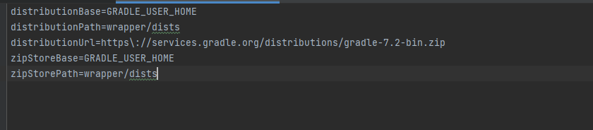

下载好gradle-7.2版本，配置环境变量

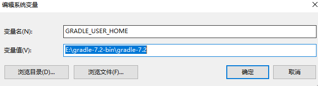

防止spring每次编译都去下载gradle安装包，将distributionUrl改成本地文件路径

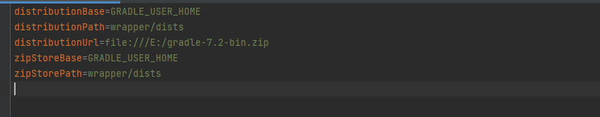

### 三、编译spring

导入spring源码到idea中，加入依赖

```gradle
buildscript { 
	repositories { 
		maven { url "https://repo.spring.io/plugins-release" } 
	} 
 }
```

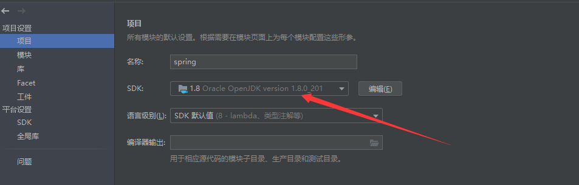

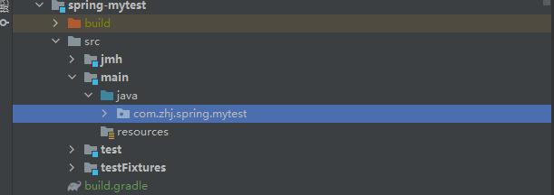

```gradle
repositories {
	//新增以下2个阿里云镜像 
	maven { url 'https://maven.aliyun.com/nexus/content/groups/public/' } 
	maven { url 'https://maven.aliyun.com/nexus/content/repositories/jcenter' } 		     mavenCentral() 
	maven { url "https://repo.spring.io/libs-spring-framework-build" } 
	maven { url "https://repo.spring.io/milestone" }  
	//新增spring插件库 
	maven { url "https://repo.spring.io/plugins-release" } 
}
```

设置项目sdk版本


**找到spring-oxm以及spring-core下的compileTestjava进行编译**

编译成功后，编译整个工程，spring>build>build

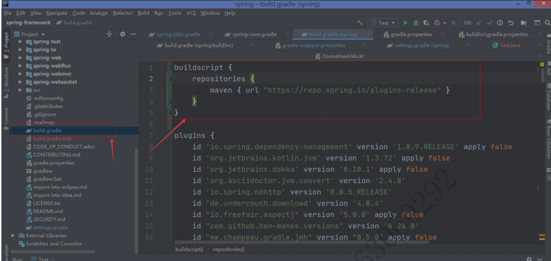

### 四、创建新的子模块

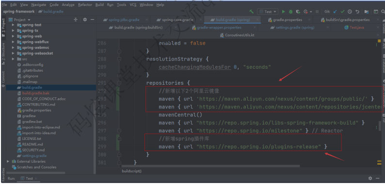

引入依赖

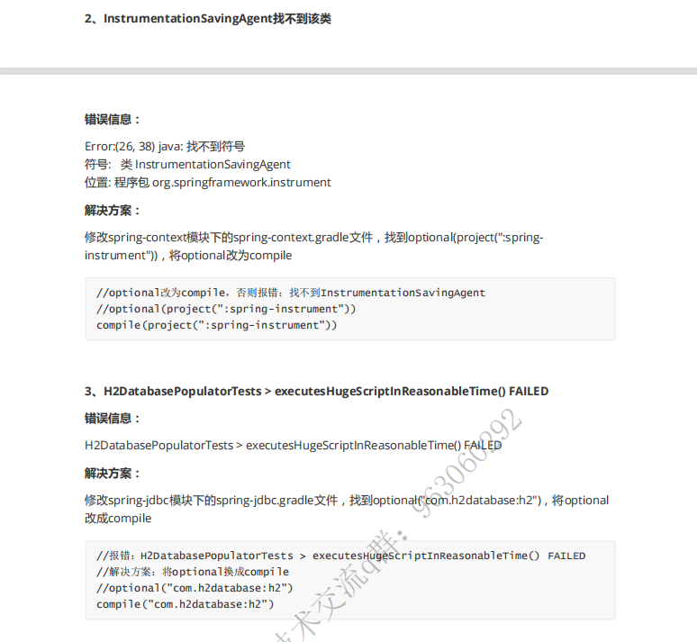

**再次编译spring项目，成功后运行测试代码**

```java
@Configuration
public class ApplicationTestDemo {

	public static void main(String[] args) {
		System.out.println("hello");
		AnnotationConfigApplicationContext configApplicationContext = new AnnotationConfigApplicationContext(ApplicationTestDemo.class);
		A a = configApplicationContext.getBean(A.class);
		System.out.println(a.name);
	}

	@Bean
	public A a(){
		return new A();
	}

	public static class A {
		public String name = "我是张三啊";
	}

}
```

**最后可以去掉spring模块下面的 src/checkstyle/checkstyle.xml**，内容注释掉，风格检查

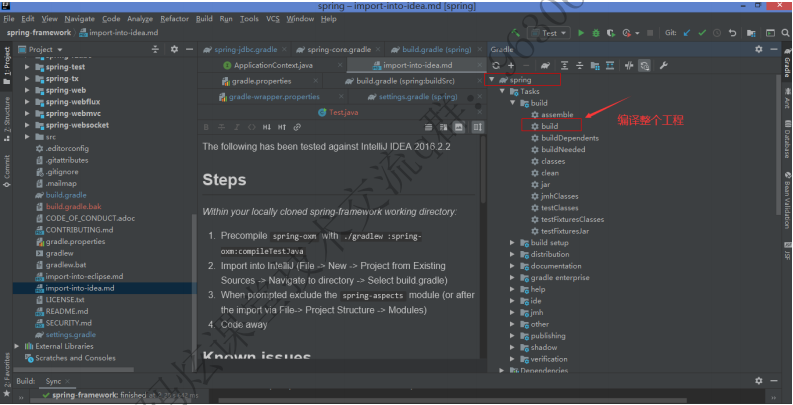

### 五、异常问题

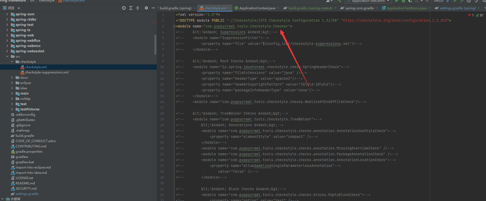

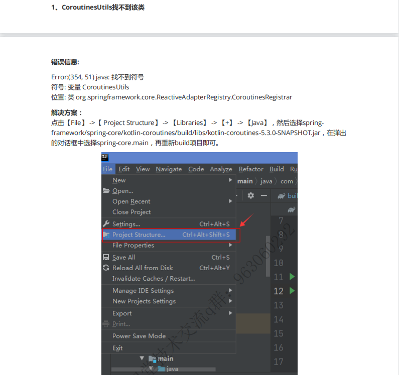

### 六、模块说明

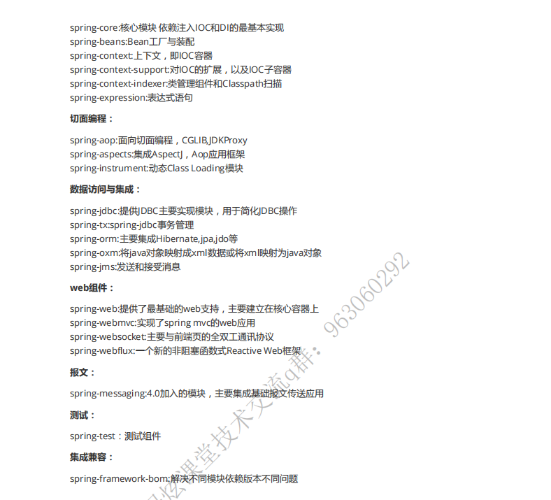

