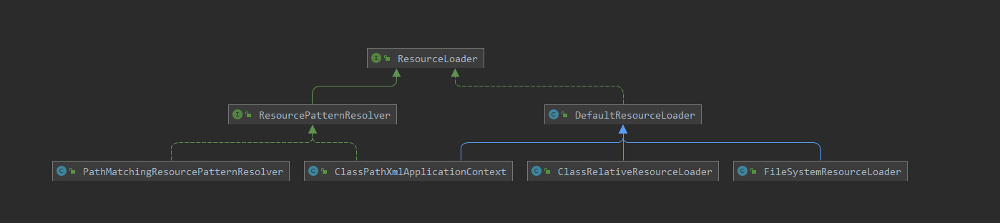
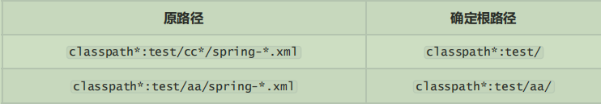

## 1. Resource

spring中对文件资源的定义，并且进行区分



- FileSystemResource：对文件系统进行的封装，FileSystemResource 使用 NIO2 API进行读/写交互
- ByteArrayResource：对字节数组进行的封装，如果通过 InputStream 形式访问该类型的资源，该实现会根据字节数组的数据构造一个相应的 ByteArrayInputStream。
- UrlResource：对 java.net.URL 类型资源的封装。内部委派 URL 进行具体的资源操作
- ClassPathResource：class path 类型资源的实现。使用给定的 ClassLoader 或者给定的 Class 来加载资源
- InputStreamResource：将给定的 InputStream 作为一种资源的 Resource 的实现类
- AbstractResource：提供了资源的默认实现。如果需要自定义Resource的实现，直接继承AbstractResource就行了

## 2. ResourceLoader

spring中资源和资源定位是分开进行的，Resource定义了统一资源，ResourceLoader就定义了统一加载资源

```java
public interface ResourceLoader {

	/** Pseudo URL prefix for loading from the class path: "classpath:". */
	String CLASSPATH_URL_PREFIX = ResourceUtils.CLASSPATH_URL_PREFIX;

	/**
	 * 支持以下三种方式的路径进行加载
	 * "file:C:/test.dat".
	 * "classpath:test.dat".
	 * "WEB-INF/test.dat".
	 */
	Resource getResource(String location);

	@Nullable
	ClassLoader getClassLoader();
}

```


### 2.1 DefaultResourceLoader

```java
public class DefaultResourceLoader implements ResourceLoader {

	@Nullable
	private ClassLoader classLoader;

	private final Set<ProtocolResolver> protocolResolvers = new LinkedHashSet<>(4);

	private final Map<Class<?>, Map<Resource, ?>> resourceCaches = new ConcurrentHashMap<>(4);

	public DefaultResourceLoader() {
	}
	public DefaultResourceLoader(@Nullable ClassLoader classLoader) {
		this.classLoader = classLoader;
	}

	/**
	 * 添加一个自定义的协议解析
	 */
	public void addProtocolResolver(ProtocolResolver resolver) {
		Assert.notNull(resolver, "ProtocolResolver must not be null");
		this.protocolResolvers.add(resolver);
	}

    /**
	 * 通过路径使用协议解析器，解析出一个Resource资源对象
	 * 该对象的两个子类实现了:getResourceByPath() 方法，ResourceLoader的核心方法封装在这里
	 */
	@Override
	public Resource getResource(String location) {
		Assert.notNull(location, "Location must not be null");

		for (ProtocolResolver protocolResolver : getProtocolResolvers()) {
			Resource resource = protocolResolver.resolve(location, this);
			if (resource != null) {
				return resource;
			}
		}
		//判断路径是否是以指定的路径开头，调用指定的方法，返回指定的Resource对象
		if (location.startsWith("/")) {
			return getResourceByPath(location);
		}
		else if (location.startsWith(CLASSPATH_URL_PREFIX)) {
			return new ClassPathResource(location.substring(CLASSPATH_URL_PREFIX.length()), getClassLoader());
		}
		else {
			try {
				URL url = new URL(location);
				return (ResourceUtils.isFileURL(url) ? new FileUrlResource(url) : new UrlResource(url));
			}
			catch (MalformedURLException ex) {
				return getResourceByPath(location);
			}
		}
	}
    
    protected Resource getResourceByPath(String path) {
		return new ClassPathContextResource(path, getClassLoader());
	}

}
```

### 2.2 ProtocolResolver

用户自定义策略解析器。允许用户自定义策略加载器，而不需要去实现ResourceLoader，有了策略解析器，DefaultResourceLoader都不需要继承，直接实现 ProtocolResolver 即可

```java
@FunctionalInterface
public interface ProtocolResolver {

	/**
	 * 
	 */
	@Nullable
	Resource resolve(String location, ResourceLoader resourceLoader);

}

```

如果 DefaultResourceLoader 没有解析到对应的资源路径，就会抛出 MalformedURLException 异常并且调用getResourceByPath(location); 构建一个 ClassPathContextResource 资源对象

```java
ResourceLoader resourceLoader = new DefaultResourceLoader(); 
Resource fileResource1 = resourceLoader.getResource("D:/Users/chenming673/Documents/spark.txt"); 

System.out.println("fileResource1 is FileSystemResource:" + (fileResource1 instanceof FileSystemResource)); Resource fileResource2 = resourceLoader.getResource("/Users/chenming673/Documents/spark.txt"); 

System.out.println("fileResource2 is ClassPathResource:" + (fileResource2 instanceof ClassPathResource)); 

Resource urlResource1 = resourceLoader.getResource("file:/Users/chenming673/Documents/spark.txt"); 

System.out.println("urlResource1 is UrlResource:" + (urlResource1 instanceof UrlResource)); Resource urlResource2 =resourceLoader.getResource("http://www.baidu.com"); 

System.out.println("urlResource1 is urlResource:" + (urlResource2 instanceof UrlResource));
```

### 2.3 ResourcePatternResolver

ResourceLoader的getResource()方法只能返回单个资源对象，而ResourcePatternResolver接口则定义了根据路径返回多个资源对象

```java
public interface ResourcePatternResolver extends ResourceLoader {

	/**
	 * 解析 classpath* 的协议
	 */
	String CLASSPATH_ALL_URL_PREFIX = "classpath*:";

	/**
	 * 获取多个资源对象
	 */
	Resource[] getResources(String locationPattern) throws IOException;
}
```

#### PathMatchingResourcePatternResolver

```java
public class PathMatchingResourcePatternResolver implements ResourcePatternResolver { 
    //创建了一个 DefaultResourceLoader加载器
    private final ResourceLoader resourceLoader;
    
    //ant风格的匹配器  **/*.xml 格式的路径
    private PathMatcher pathMatcher = new AntPathMatcher();
    
    /**
     * 通过调用默认的 DefaultResourceLoader加载器返回Resource对象
     */
    @Override
	public Resource getResource(String location) {
		return getResourceLoader().getResource(location);
	}
    
    @Override
	public Resource[] getResources(String locationPattern) throws IOException {
		Assert.notNull(locationPattern, "Location pattern must not be null");
        //查看是否是 classpath* 的协议类型
		if (locationPattern.startsWith(CLASSPATH_ALL_URL_PREFIX)) {
            //包含通配符
			if (getPathMatcher().isPattern(locationPattern.substring(CLASSPATH_ALL_URL_PREFIX.length()))) {
				// a class path resource pattern
				return findPathMatchingResources(locationPattern);
			}
			else {
				// 不包含通配符
				return findAllClassPathResources(locationPattern.substring(CLASSPATH_ALL_URL_PREFIX.length()));
			}
		}
		else {
			// 匹配"*/" 或者 "war:" 协议的路
			int prefixEnd = (locationPattern.startsWith("war:") ? locationPattern.indexOf("*/") + 1 :
					locationPattern.indexOf(':') + 1);
            //匹配是否有 *
			if (getPathMatcher().isPattern(locationPattern.substring(prefixEnd))) {
				// a file pattern
				return findPathMatchingResources(locationPattern);
			}
			else {
				// a single resource with the given name
				return new Resource[] {getResourceLoader().getResource(locationPattern)};
			}
		}
	}
    
    
    /**
     * 获取到class路径以及jar包下的所有Resource资源对象
     */
    protected Resource[] findAllClassPathResources(String location) throws IOException {
		String path = location;
		if (path.startsWith("/")) {
			path = path.substring(1);
		}
        //真正执行的方法
		Set<Resource> result = doFindAllClassPathResources(path);
		if (logger.isTraceEnabled()) {
			logger.trace("Resolved classpath location [" + location + "] to resources " + result);
		}
		return result.toArray(new Resource[0]);
	}
    
}
```

确定根路径的方法 determineRootDir() 方法



```java
protected Resource[] findPathMatchingResources(String locationPattern) throws IOException {
        //确定路径的根路径
		String rootDirPath = determineRootDir(locationPattern);
		String subPattern = locationPattern.substring(rootDirPath.length());
		Resource[] rootDirResources = getResources(rootDirPath);
		Set<Resource> result = new LinkedHashSet<>(16);
		for (Resource rootDirResource : rootDirResources) {
			rootDirResource = resolveRootDirResource(rootDirResource);
			URL rootDirUrl = rootDirResource.getURL();
			if (equinoxResolveMethod != null && rootDirUrl.getProtocol().startsWith("bundle")) {
				URL resolvedUrl = (URL) ReflectionUtils.invokeMethod(equinoxResolveMethod, null, rootDirUrl);
				if (resolvedUrl != null) {
					rootDirUrl = resolvedUrl;
				}
				rootDirResource = new UrlResource(rootDirUrl);
			}
            //vfs资源
			if (rootDirUrl.getProtocol().startsWith(ResourceUtils.URL_PROTOCOL_VFS)) {
				result.addAll(VfsResourceMatchingDelegate.findMatchingResources(rootDirUrl, subPattern, getPathMatcher()));
			}
            //jar包资源
			else if (ResourceUtils.isJarURL(rootDirUrl) || isJarResource(rootDirResource)) {
				result.addAll(doFindPathMatchingJarResources(rootDirResource, rootDirUrl, subPattern));
			}
			else {
				result.addAll(doFindPathMatchingFileResources(rootDirResource, subPattern));
			}
		}
		if (logger.isTraceEnabled()) {
			logger.trace("Resolved location pattern [" + locationPattern + "] to resources " + result);
		}
		return result.toArray(new Resource[0]);
	}

/**
 * 确定根路径方法
 */
protected String determineRootDir(String location) {
		int prefixEnd = location.indexOf(':') + 1;
		int rootDirEnd = location.length();
		while (rootDirEnd > prefixEnd && getPathMatcher().isPattern(location.substring(prefixEnd, rootDirEnd))) {
			rootDirEnd = location.lastIndexOf('/', rootDirEnd - 2) + 1;
		}
		if (rootDirEnd == 0) {
			rootDirEnd = prefixEnd;
		}
		return location.substring(0, rootDirEnd);
	}
```

## 小结

spring提供了Resource和ResourceLoader两个接口来抽象整个资源以及定位。而AbstractResource为Resource的抽象实现，后续只需要继承就可以了；DefaultResourceLoader 同样也是 ResourceLoader 的实现，可以通过实现 ProtocolResolver 来实现自定义加载策略； ResourcePatternResolver接口是对 ResourceLoader 的扩展，其 PathMatchingResourcePatternResolver 是一个集大成者，它同时实现了 getResource 和 getResources方法

