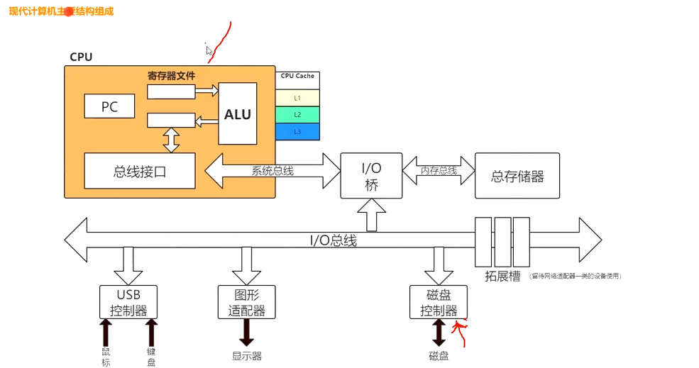
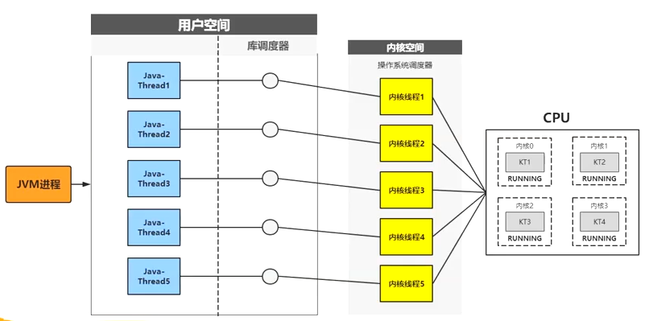
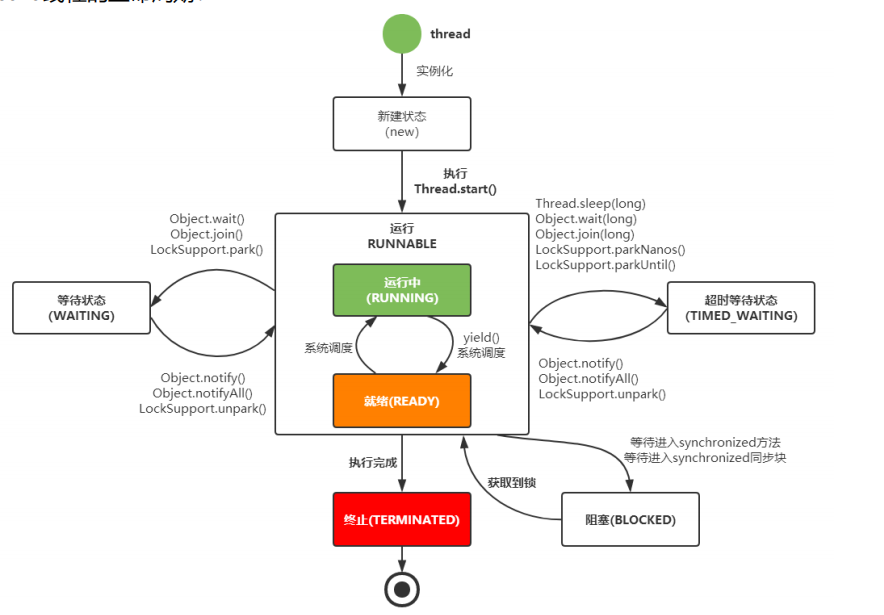
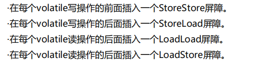
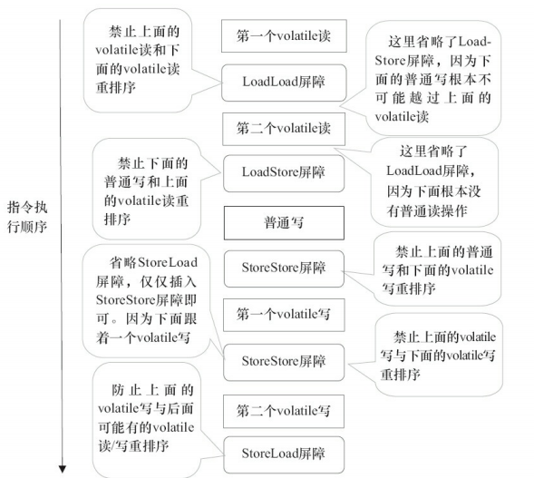
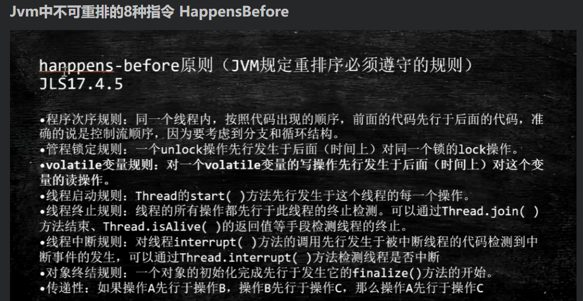
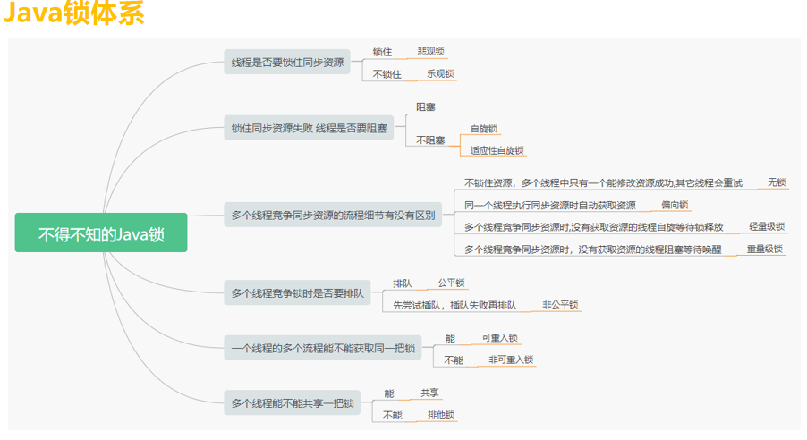
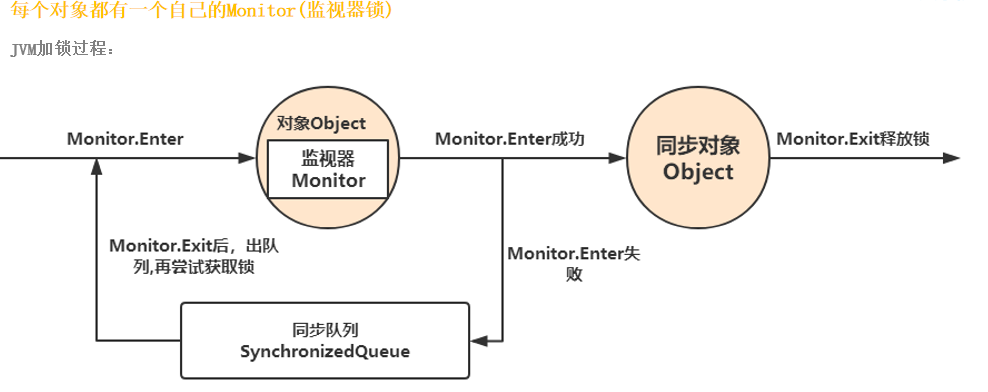
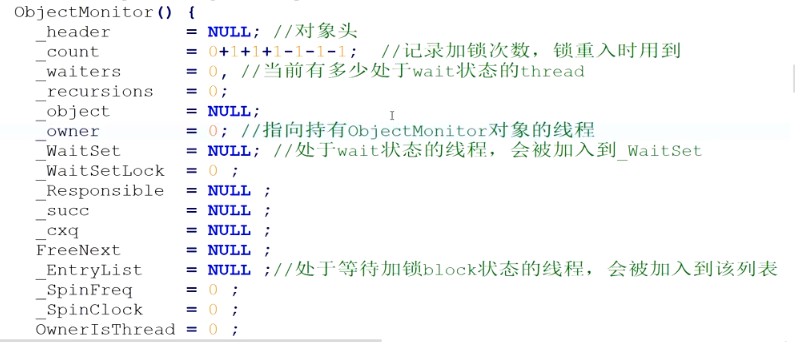
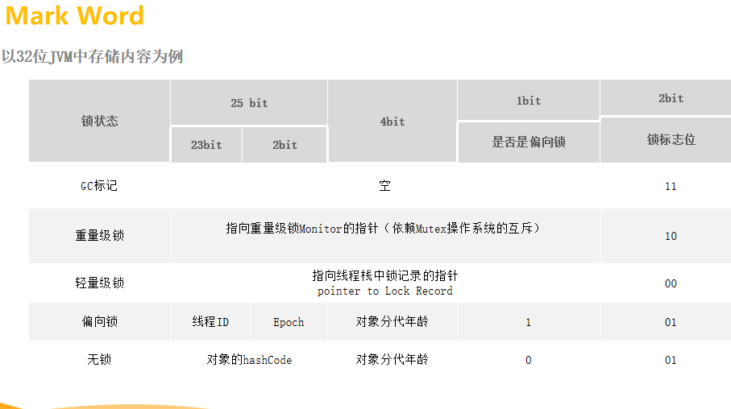

# 并发编程

## 一、现代计算机的理论模型



```java
独写速度：寄存器 > L1 > L2 > L3 > 内存条
cpu是通过系统总线去内存条中进行数据交互，每次cpu都会提前把指令copy到cpu cache中以便于提高效率
例如：
 main{
 	a = 1
 }
 cpu先去内存中load到L3然后逐级复制到L1，等写了之后cpu在写回L1然后逐级到L3，同步回内存中是cpu来决定。可以使用 #Lock Mesi缓存一致性协议强制数据在写了之后同步回内存中。
     1、总线加锁：在内存读取时，会给总线进行加锁，其它cpu就不能读写了
     2、缓存一致性协议（MESI）
```

## 二、缓存一致性协议（MESI）

### 1、状态

- M：修改，当前缓存行进行数据修改
- E：独享、互斥
- S：共享
- I：无效

### 2、例子

```java
main{
	volatile a = 1
}
/**
缓存行：cpu的最小存储单元有可能32字节、64、128字节。
	当cpu1读取了volatile关键字描述的（使用#Lock来标识使用MESI）a = 1到缓存当中，总线会一直监听当前内存区域的数据（总线嗅探机制），并且将当前内存数据标识为E状态；
	当cpu2也来读取了a = 1这个数据到缓存中，那么将这个数据的状态变成S共享的状态。
	当cpu1修改了 a = 1，那么会将其缓存行锁住，并且将状态改成M修改状态。
	修改的数据只存在于当前cpu的缓存当中，当cpu1修改完后同步回主内存时，cpu2通过总线嗅探机制嗅探到bus中a的状态为M并且将 a = 1的状态改变为I无效状态，并且将整个缓存行丢弃掉。这时候后cpu1中的a又会改成E独享。
**/
```

### 3、问题

- 如果同一时间都要对a = 1进行修改会怎么办？
  - cpu会在一个指令周期内进行裁决，谁赢谁的有效。
- 什么情况下MESI会失效？
  - 如果 a的存储长度大于一个缓存行。如果横跨两个缓存行的话就不能进行加锁，只能加总线锁
  - cpu不支持MESI协议

## 三、什么是线程？

> 进程是系统分配资源的基本单位，线程是调度cpu的基本单位。每个线程都有一个程序计数器，一组寄存器（保存当前线程的工作变量），栈帧。

### 1、线程分类

- 用户级线程（ULT）：软件自己创建的线程，用户级线程只能软件自己来维护栈帧。用户级线程依赖于主进程，并不拥有cpu的使用权限，只能使用一个cpu，如果线程1阻塞了，后面的就会卡住。可以避免大量上下文切换
- 内核级线程（KLT）：只有内核空间才能创建内核级线程，只有内核级线程才能去争抢cpu资源

### 2、空间划分

- 内核空间：提供交互接口，内核空间才有ring0级别
- 用户空间：软件例如：ps，jvm都运行在用户空间，如果要操作内核空间，就通过调用接口。jvm就需要内核空间去调度cpu

### 3、cpu特权级别

#### （1）为什么需要划分特权级别？

​	安全问题，如果都有ring0级别，那么任何软件都可以修改内核空间里面的东西，可以相互攻击软件

- Ring0：ring0级别才能创建内核线程
- Ring3：最低级别

### 4、jvm使用什么线程？

- 1.2前用的ULT
- 1.2之后用的KLT

### 5、Java线程与内核线程的关系



- 通过new Thread()方法去调用底层的库通过linux提供的pthread库，然后通过系统内核空间去创建内核线程争抢cpu资源，内核空间会创建栈帧保存汇编指令

### 6、Java线程的生命周期状态图



### 7、线程上下文的切换

- 如果线程被阻塞，cpu会将线程中的指令集、中间数据、程序指针以及中间数据会刷新到主内存内核空间中的Tss（任务状态段）里面保存起来，等到下一次切换的时候又会将起重新读取出来，并且线程会重新去主存中读取一次数据

## 四、JMM模型

### （1）什么是JMM模型？

- 基于CPU多核缓存存储架构抽象出来的一套规范，其中线程的工作内存就类似于CPU的cache段，主内存就相当于内存条，最后线程就到CPU中去运行。主要的目的就是屏蔽操作系统架构的不同。
- JVM进程，他去申请的空间，大部分操作的是逻辑空间不是物理空间，逻辑空间是由系统已经划分好的
- JMM是围绕原子性、有序性、可见性展开，是一组规则，通过这组规则去访问程序中共享数据和私有数据的访问方式。比如一个线程去将主内存中的值读取到工作内存中时其它线程是看不到，所以就定义了JMM标准来控制数据的读取

### （2）JMM内存关系图


### （3）Java内存模型内存交互操作（8大内存操作）

- 1、lock（锁定）：将主内存的变量标记为一条线程独占

- 2、unlock（解锁）：将主内存的变量释放出来

- 3、read（读取）：将主内存中的变量读取出来

- 4、load（载入）：将读取出来的变量load到工作内存中的副本当中

- 5、use（使用）：将变量传递给执行引擎进行使用

- 6、assign（赋值）：执行引擎进行赋值

- 7、store（存储）：执行引擎将数据写回工作内存的副本变量当中

- 8、write（写入）：将工作内存中的副本数据写回主内存中

  **注意：read和load，store和write，需要一同出现，但不一定是连续性，比如a、b同时访问可能会出现read a，read b，load b，load a**

### （4）Java内存模型内存交互操作规则

- 不允许read和load、store和write单独出现，就是read操作后工作内存不接受，或者发起store操作后主内存不接受
- 不允许一个线程丢弃它最近的一次assign操作，变量发生改变后必须同步会主内存
- 不允许一个线程在没有发生assign操作时，发起同步回主内存操作
- 一个变量只能在主内存中“诞生”，也就是说一个变量在use、store操作之前必须进行了load或者assign操作
- 一个变量同一时间只能有一个线程lock，但是可以被同一个线程多次lock，只有执行相同次数的unlock变量才会被解锁
- 如果对一个变量执行lock操作，那么会清空工作内存中该变量的值，在执行引擎使用到时，会重新执行load或assign初始化值
- 如果一个变量没有执行lock操作，那么就不允许执行unlock操作，也不允许unlock一个被其他线程锁住的变量
- 对一个变量执行unlock之前，必须执行store、write操作，同步回主内存当中

### （5）volatile原理

- JMM层面 read、load、use、assign、store、write必须是连续性的，即修改后会同步回主存，使用时必须从主存中刷新来保证volatile变量的可见性
- 底层实现：通过汇编lock指令来锁定缓存行区域并写回主存区域，其它缓存中的数据则变为失效状态
- 指令重排序发生阶段：编译器优化重排序、指令并行重排序、内存系统重排序、最终执行指令排序

### （6）内存屏障（禁止指令重排）

Memory Barrier：cpu指令，强制刷出各种cpu的缓存数据。X86不会对读-读、读-写和写-写操作做重排序，因此在X86处理器中会省略掉这3种操作类型对应的内存屏障。在X86中，JMM仅需 在volatile写后面插入一个StoreLoad屏障即可正确实现volatile写-读的内存 

语义

- 第一个操作为volatile读时，第二操作不论是什么都不能重排序
- 第二个操作为volatile写时，第一个操作不论是什么都不能重排序
- 第一个为volatile写时，第二个volatile为读时不能重排序



- StoreStore：会保证在此指令上面的所有普通变量操作都刷新会主内存中
- LoadLoad：禁止指令后面的普通读和volatile读重排序
- LoadStore：禁止指令后面的普通写操作和volatile读重排序



### （7）HappensBefore

总结：规定操作变量在什么情况下对后面的步骤可见。如果两个操作无法从happens-before中推导出来，那么虚拟机可以对其进行任意的重排序



- 程序次序规则：同一个线程前面的所有写操作对后面的操作可见
- 管程锁定规则：如果线程1解锁了a，线程2锁定了a，那么线程1解锁a之前的写操作都对线程2可见
- volatile变量规则：如果线程1写入了v1，接着线程2读取了v1，那么线程1写入以及之前的写操作都对线程2可见
- 线程启动规则：假定线程A在执行过程中，通过执行ThreadB.start()来启动线程B，那么线程A对共享变量的修改在线程B开始执行前可见。线程B启动后未必可见
- 线程终止规则：线程1在写入的所有变量，在其他任意线程2调用t1.join()，或者t1.isAlive()成功返回后，都对t2可见
- 线程中断原则：线程t1写入的所有变量，调用Thread.interrupt()，被打断的线程t2，可以看到t1的全部操作

```java
Thread t2 = new Thread(() -> {
    try {
        Thread.sleep(1000);
    } catch (InterruptedException e) {
        e.printStackTrace();
    }
    System.out.println("类似："+isActive);
});

Thread t1 = new Thread(() -> {
    isActive = true;
    t2.interrupt();
});
t1.start();
t2.start();
```

- 对象终结原则：对象调用finalize()方法时，对象初始化完成的任意操作，同步到全部主存同步到全部cache。

  > 在程序运行过程中，所有的变更会先在寄存器或本地cache中完成，然后才会被拷贝到主存以跨越内存栅栏（本地或工作内存到主存之间的拷贝动作），此种跨越序列或顺序称为happens-before。
  >
  > **注：happens-before本质是顺序，重点是跨越内存栅栏**
  >  通常情况下，写操作必须要happens-before读操作，即写线程需要在所有读线程跨越内存栅栏之前完成自己的跨越动作，其所做的变更才能对其他线程可见。

  例子：CopyOnWriteArrayList 线程A和线程B要执行的以下代码，最后结果b=1吗？

  | 线程A           | 线程B       |
  | --------------- | ----------- |
  | a = 1           | list.get(0) |
  | list.set(0,""); | int b = a;  |

  执行顺序流1：

  | 步骤 | 线程A          | 线程B       |
  | ---- | -------------- | ----------- |
  | a    | a = 1          |             |
  | b    | list.set(0,"") |             |
  | c    |                | list.get(0) |
  | d    |                | int b = a   |

  执行顺序2：

  | 步骤 | 线程A          | 线程B       |
  | ---- | -------------- | ----------- |
  | a    | a = 1          |             |
  | b    |                | list.get(0) |
  | c    | list.set(0,"") |             |
  | d    |                | int b = a   |

  ```
  分析：
  CopyOnWriteArrayList 源码当中所有的操作都是对一个volatile变量进行操作，必然会涉及到 volatile变量规则。
  volatile变量规则：一个volatile变量的写操作要先于后面对该变量的所有读操作。
  a happens-before b  简写为 hb(a,b)
  顺序流1：
  根据程序次序规则可以得出：hb(a,b) hb(c,d)，如果希望b = 1，那么就需要hb(b,c)，由于volatile变量规则，所以 b一定等于1
  顺序流2：hb(a,c) hb(b,d) 如果希望b = 1 那么就需要改成 hb(a,b)或者 hb(c,d)，然后上述没有条件，所以 b不一定等于1
  ```

### （8）总线风暴

> ​	使用volatile变量或者CAS修改了工作内存中的变量时，工作内存中产生了大量的无效变量，然后就需要通过总线去跟主内存进行交互，而总线的带宽又是有限的，大量的主存交互就占用了带宽。部分代码可以使用sync关键字去加锁

### （9）面试题

> 怎样在不使用sync和volatile关键字的情况下添加内存屏障？
>
> 可以使用Unsafe手动加内存屏障，只能通过反射获取到Unsafe类

## 五、同步

> 共享可变的数据（临界资源）

### 1、锁类型

- 显示锁：ReentrantLock，实现juc里面的Lock接口，实现是基于AQS实现，需要手动加锁跟解锁
- 隐式锁：synchronized加锁机制，JVM内置锁，不需要手动加锁与解锁，JVM会自动去加锁解锁

### 2、锁体系



### 3、加锁方式

#### （1）如果需要跨方法加锁该怎么做？

可以使用Unsafe里面monitorEnter方法加锁以及monitorExit解锁

#### （2）monitor指令是如何实现的？

​	每个对象创建之初都会去在内部维护一个Monitor对象（监视器锁），基于进入与退出Monitor对象方式与代码块同步，依赖的操作系统底层的Mutex Lcok（互斥锁）实现，互斥量是由操作系统来维护的。

- 同步实例方法：如果synchronized加在方法上就是给对象加锁，并且对象交给spring容器来管理，那么作用域就必须是单例，如果是原生的方式那么同步就无效
- 同步类方法，锁当前类对象
- 同步代码块，锁是括号里面的对象

### 4、JVM加锁过程



#### （1）Monitor对象结构



### 5、对象的内存结构

#### （1）class对象的内存结构

- 对象头（Mark Word）：比如hash码，对象所属的年代，锁的状态标志，偏向锁（线程）ID，偏向时间，数组长度（数组对象），元数据指针（class对象）;64位和32位的存储稍微有点出入，但是整体的逻辑都一样。**会随着锁的升级存的内容也跟着改变**
- 对象实例数据
- 对齐填充位：对象的大小必须是8字节的整数倍（强制性）

#### （2）面试题

实例对象内存中存储在哪？

​	如果实例对象存储在堆区时：实例对象数据存储在堆区，实例的引用存中栈上，实例的元数据（class）存在方法区（元空间）

实例对象一定是存在堆区？

​	不一定，如果实例对象没有线程逃逸。如果线程循环方法50w次创建50w个对象，但是堆空间的大小远远小于50w个对象，那么对象就有可能存储在线程栈上。JIT编译器会对代码进行**逃逸分析**，逃逸分析就是判断创建的对象是否被其它线程所引用到

- 锁粗化：

```java
StringBuffer stb
	stb.append("1");  //正常逻辑是会加4次锁，那么就会进行4次上下文的切换，但是jvm会进行优化 加一个大的锁，进行锁的粗化
	stb.append("2");
	stb.append("3");
	stb.append("4");
```

- 锁消除：

```java
//jvm经过逃逸分析，发现对象并没有被它线程所引用，所以就进行优化，消除了锁
synchronized (new Object()){

}
```

### 6、锁的膨胀升级

> 无锁--->偏向锁--->轻量级锁--->重量级锁，整个升级过程是不可逆
> 开启偏向锁：-XX:+UseBiasedLocking -XX:BiasedLockingStartupDelay=0
> 关闭偏向锁：-XX:-UseBiasedLocking


- 偏向锁：最后两位标志位表示是否被线程占有，并且检查是否是当前线程ID。
- 轻量级：线程交替执行场景，当t1线程进入同步块还没有退出释放锁时，t2开始执行获取同步块的锁，发现t1还没有释放，但是这时jvm觉得没有必要让t2阻塞，就让t2进行自旋（不会丢失cpu的使用权）。
  - java1.7版本后：自适应自旋，自旋的次数由jvm来计算
  - 在当前线程开辟一块空间LockRecord，并且拷贝一份Mark Word到线程栈中，Mark Word中前30位记录线程栈中的LockRecord指针。
  - 解锁的时候判断Mark Word当中是否对应当前线程的线程栈中的Mark Word，然后对比内容是否一样
- 重量级锁：T2线程通过CAS修改Mark Word失败之后进入自旋，失败达到一定次数之后就会进行锁膨胀，升级为重量级锁。并且Mark Word中前30位不在指向Lock Record，而是通过调用**Pthread_mutex_lock**使得线程阻塞，并且T1释放锁时会按照轻量级锁的释放方式来释放如果释放失败，同样会释放锁并且唤醒所有阻塞的线程。



