# 1. 什么是时序数据库？

时序数据库全称为时间序列数据库。 即时间序列数据，按时间维度顺序记录且索引的数据。 

 时间序列数据主要由 `电力行业`、`化工行业`、`气象行业`、`地理信息` 等各类型实时监测、检查与分析设备所采集、产生的数据，这些工业数据的典型特点是：产生频率快（每一个监测点一秒钟内可产生多条数据）、严重依赖于采集时间（每一条数据均要求对应唯一的时间）、测点多信息量大（常规的实时监测系统均有成千上万的监测点，监测点每秒钟都产生数据，每天产生几十GB的数据量）。 

例如：每秒都会上报的汽车 `GPS` 点位、无人驾驶每秒都需要进行采集的车辆状态信息、证券交易、虚拟机容器以及程序的状态等；上述的数据都会带有很明显的时间序列，每时每刻都在进行采集，跟随时间进行改变，而且数据量很大

# 2. 时序数据库

 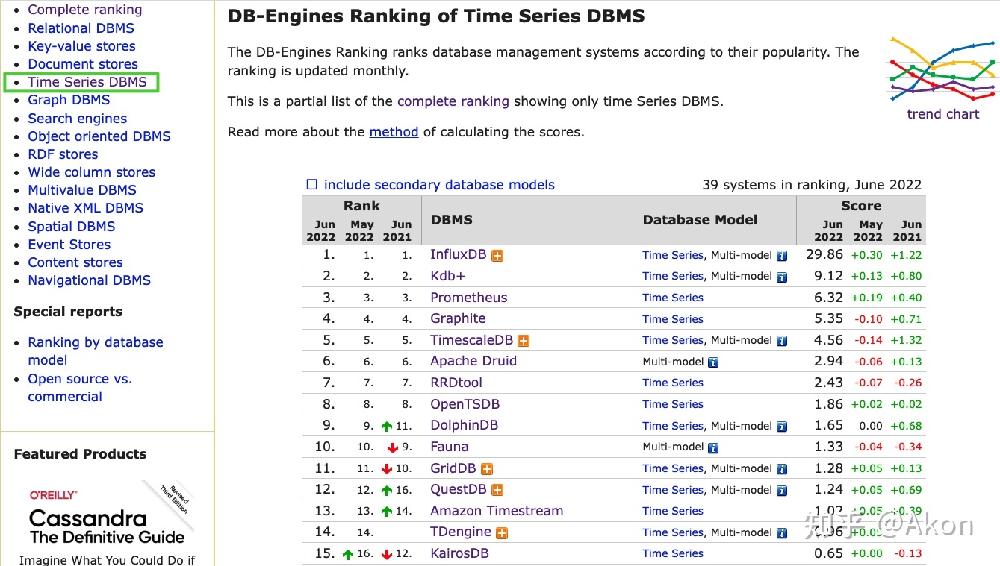 

## 2.1 特点

- 所有采集的数据都是时序的

- 每个采集点的数据源唯一

- 通常不会对数据进行删除、修改操作

- 数据存储一般有保留期限设置，按照日期进行删除

- 数据以写入为主，查询操作主要是按照指定时间段进行查询、分析

- 往往需要对存储的数据进行统计、聚合等进行实时计算

- 存储的数据量巨大

 

## 2.2 时序数据库 vs 关系型数据

- 时序数据库一般有很高的数据压缩率，即使海量数据存储的情况下，也可以对数据进行压缩存放，存储成本很低，这得益于时序数据库存储方式，一般是采用 `列式存储`，存储成本低；例如：https://www.taosdata.com/user-cases/3626.html

- 与普通数据库相比，`写入性能` 更好，即使在海量设备、`测点` 的情况下，依然能有很优秀的性能。 
-  时序数据库的数据采集频率较快，存储的数据量也巨大。用户一般可以根据自己业务要求设置数据的保留期限，比如 10 年、50 年。 普通的数据建库不会有这种功能
- 索引结构不同，关系型数据库一般采用 `B+` 和 `B` 树；但在时序数据库中，写入明显高于查询，大多数是采用 **LSM Tree（Log Structured Merge Tree）**，LSM Tree 通常能够承受比 Btree 更高的 `写入吞吐量`


# 3. Tdengine

## 3.1 特点

 TDengine 是一款开源、高性能、云原生的 `时序数据库`，且针对物联网、车联网、工业互联网、金融、IT 运维等场景进行了优化。除核心的时序数据库功能外，TDengine 还提供 `缓存、数据订阅、流式计算` 等其它功能以降低系统复杂度及研发和运维成本。 

## 3.2 为什么选择 Tdengine？

### 优点

开源、**免费**、性能高、文档详细（提供了中文）、sql语法（上手难度低）

与典型的 **NoSQL** 存储模型相比，**Tdengine** 将标签数据与时序数据完全分离存储，其中具有的优势：

- 能够极大地降低标签数据存储的冗余度：一般的 NoSQL 数据库或时序数据库，采用的 K-V 存储，其中的 Key 包含时间戳、设备 ID、各种标签。每条记录都带有这些重复的内容，浪费存储空间。而且如果应用要在历史数据上增加、修改或删除标签，需要遍历数据，重写一遍，操作成本极其昂贵。
- 能够实现极为高效的多表之间的聚合查询：做多表之间聚合查询时，先把符合标签过滤条件的表查找出来，然后再查找这些表相应的数据块，这样大幅减少要扫描的数据集，从而大幅提高查询效率
- 而 **Tdengine** 内部自动对数据进行了分片存储通过一个时间段一个数据文件来实现时序数据分区的 ，而一般典型的 **NoSQL** 都没有在内部做数据的分片，需要自己在代码中进行编码

### 缺点

本地开发环境部署需要依赖 c 环境的库，安装比较麻烦，生态还不是很完全，对java而言没有提供对应的 orm 框架，mybatis不支持需要使用pgsql的方言进行支持（对现有业务的改造很麻烦）

## 3.3 性能测试报告

TDengine与InfluxDB的查询测试报告：https://www.taosdata.com/engineering/5969.html

TDengine与InfluxDB的写入测试报告：https://www.taosdata.com/engineering/3248.html

# 4. 代码实战

## 4.1 安装

https://docs.taosdata.com/get-started/package/ 官网网站提供了很详细的安装文档，提供了多种安装方式，我这里采用 `docker-compose` 的方式进行安装，可以跳过安装直接使用我的服务器体验 **150.158.10.192:6030**

```yml
version: '3'
services:
  tdengine:
    image: tdengine/tdengine:3.0.1.5
    container_name: tdengine-server
    hostname: tdengine-server
    ports:
      - "6030:6030"
      - "6041:6041"
#      - "6043-6049:6043-6049" 提供给第三方的接口可以根据需要是否打开
#      - "6043-6049:6043-6049/udp"
    volumes:
      - "/usr/local/soft/tdengine/conf/taos.cfg:/etc/taos/taos.cfg"
#      - "/usr/local/soft/tdengine/data:/var/lib/taos"  #数据目录
#      - "/usr/local/soft/tdengine/log:/var/log/taos"   #日志目录
    environment:
      TAOS_FQDN: tdengine-server
```

`Tdegine` 采用 `FQDN` 的方式进行解析，`FQDN` 由两部分组成 **hostname.domain:port** hostname是主机的名称，domain则是 `Tdengine` 所在的域名，解析时通过 `domain` 找到所在主机，通过 `hostname` 找到对应的节点；`hostname` 就是配置在 `/etc/hosts` 中，这样的目的时就算 ip地址改了，只需要修改 `/etc/hosts` 中的地址就行；如果是采用的安装包安装，这里将ip配置到 `/etc/hosts` 就行

```cfg

# 配置tdengine-server（这里是直接配置容器的名称）
firstEp                   tdengine-server:6030

# 配置tdengine的域名解析
fqdn                      tdengine-server

# 服务端口
serverPort                6030
```

如果是安装包就到安装的路径下 `bin` 目录执行 `taos` 命令，如果是容器，进入容器直接执行 `taos` 就行，注意默认的账号密码是 `taos` 与 `taosdata` 如果不修改这里会自动填入

> taos -u root -p #密码 taosdata

> alter user root pass 'root'  #修改密码

## 4.2  taosBenchmark 

 可以使用 TDengine 的自带工具 **taosBenchmark** 快速体验 TDengine 的写入速度，通过 **taosBenchmark** 可以快速插入1亿条数据，具体体验可以看看官方文档 **https://docs.taosdata.com/get-started/docker/**

## 4.3 客户端安装

如果使用 **Java Connector** 进行连接 **taos** 数据，需要使用到 **taos.dll** 的c语言库的支持，这里就需要在win10系统上面安装客户端，访问下面的连接进行客户端下载

> https://www.taosdata.com/assets-download/3.0/TDengine-client-3.0.1.5-Windows-x64.exe

上面客户端安装成功之后，路径就是下面的结构，在安装成功之后会默认将 **driver** 路径下面的 **taos.dll** 文件拷贝到 win10 的系统库路径下面

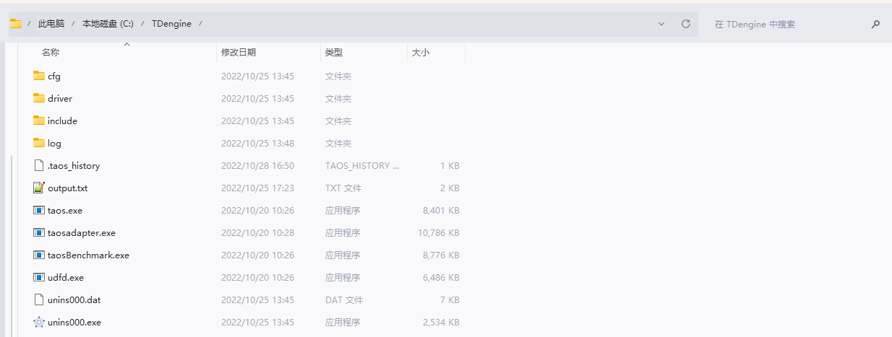

### 配置客户端

打开 **cfg/taos.cfg** 文件，只需要将 **firstEp** 改成服务端的ip地址和端口就行了，注意 **tdengine** 是我配置在 **hosts** 中的，配置好就可以使用 **taos.exe** 来进行操作了

```cfg
firstEp                   tdengine:6030
```

## 4.4 Java Connector

使用 **Java Connector** 进行操作，如果出现了包路径的问题，先检查一下 **C:\Windows\System32** 路径下是否存在 **taos.dll**

```xml
<properties>
    <tdengine.version>3.0.0</tdengine.version>
</properties>

<dependencies>
    <dependency>
        <groupId>com.taosdata.jdbc</groupId>
        <artifactId>taos-jdbcdriver</artifactId>
        <version>${tdengine.version}</version>
    </dependency>
</dependencies>
```


```java
public class TdEngineDemo {

    public static void main(String[] args) throws SQLException, InterruptedException {
        TdEngineDemo tdEngineDemo = new TdEngineDemo();
        Connection conn = tdEngineDemo.getConn();
    }

    private Connection getConn() throws SQLException {
        String jdbcUrl = "jdbc:TAOS://tencent.server:6030?user=root&password=taosdata";
        Properties properties = new Properties();
        properties.setProperty(TSDBDriver.PROPERTY_KEY_CHARSET, "UTF-8");
        properties.setProperty(TSDBDriver.PROPERTY_KEY_LOCALE, "en_US.UTF-8");
        properties.setProperty(TSDBDriver.PROPERTY_KEY_TIME_ZONE, "UTC-8");
        return DriverManager.getConnection(jdbcUrl, properties);
    }
}
```

## 4.5 实践例子

模拟我们现在公司 **IoT** 采集汽车的点位的各项状态信息 

### 超级表

在 **Tdengine** 中所谓的超级表，简单理解可以算是一个 **模板集合表** ，所有的 **子表** 都要依靠 **超级表** 来进行创建，所谓的 **集合** 就是通过对应的 **TAG** 我们可以从超级表中找到对应的子表信息，具体例子可以看下面例子

### 子表

**子表** 真正存放数据集合的表

### 实例

下面是实战代码，具体步骤：

- 创建连接
- 先创建 **Iot** 数据库
- 提前先创建超级表，字段为：time（时间戳，每个表第一列必须是时间戳）、deviceName（设备名称）、positio（设备点位）、speed（速度）；标识符tags : deviceId（设备id）
- 执行对应的设备数据插入

```java
public class TdEngineDemo {

    public static void main(String[] args) throws SQLException, InterruptedException {
        TdEngineDemo tdEngineDemo = new TdEngineDemo();
        Connection conn = tdEngineDemo.getConn();
        tdEngineDemo.insert(conn);
    }

    private Connection getConn() throws SQLException {
        String jdbcUrl = "jdbc:TAOS://tencent.server:6030?user=root&password=taosdata";
        Properties properties = new Properties();
        properties.setProperty(TSDBDriver.PROPERTY_KEY_CHARSET, "UTF-8");
        properties.setProperty(TSDBDriver.PROPERTY_KEY_LOCALE, "en_US.UTF-8");
        properties.setProperty(TSDBDriver.PROPERTY_KEY_TIME_ZONE, "UTC-8");
        return DriverManager.getConnection(jdbcUrl, properties);
    }

    private void createTable(Connection connection) {
        try (Statement sta = connection.createStatement()) {
            sta.execute("create database if not exists iot");
            sta.executeUpdate("use iot");
            //创建超级表，id
            sta.execute("create stable if not exists device_stat(time timestamp, deviceName VARCHAR(32), positio VARCHAR(32), speed INT)" +
                        " " +
                        "tags (deviceId VARCHAR(32))");
        } catch (SQLException throwables) {
            throwables.printStackTrace();
        }
    }

    private void insert(Connection conn) throws InterruptedException {
        //创建表
        createTable(conn);
        String sql = "insert into ? using device_stat tags(?) values(?, ?, ?, ?)";
        run(conn, sql);
    }

    //执行数据的插入
    private void run(Connection conn, String sql) throws InterruptedException {
        //遍历5次，每次给2个设备表里面插入10条数据
        for (int i = 0; i < 5; i++) {
            extracted(conn, sql);
        }
        try {
            conn.close();
        } catch (SQLException e) {
            e.printStackTrace();
        }
    }

    private void extracted(Connection conn, String sql) {
        try (TSDBPreparedStatement pst = conn.prepareStatement(sql).unwrap(TSDBPreparedStatement.class)) {
            //创建两个设备表
            for (int i = 1; i <= 2; i++) {
                //每个设备插入10条数据
                for (int i1 = 0; i1 < 10; i1++) {
                    String deviceId = "d" + i;
                    String tableName = "device_stat_" + deviceId;
                    pst.setTableName(tableName);
                    //设置tag
                    pst.setTagNString(0, deviceId);

                    pst.setTimestamp(0, toArray(Timestamp.from(Instant.now()).getTime()));
                    pst.setString(1, toArray(("设备:" + deviceId)), 30);
                    //设置随机点位
                    pst.setString(2, toArray(LocationUtils.getRandomPoint("104.070799,30.545794")), 30);
                    //设置速度
                    pst.setInt(3, toArray(new Random().nextInt(50)));
                    pst.columnDataAddBatch();
                }
            }
            pst.columnDataExecuteBatch();
            System.out.println("执行插入数据............");
        } catch (SQLException throwables) {
            throwables.printStackTrace();
        }
    }

    private static <T> ArrayList<T> toArray(T v) {
        ArrayList<T> result = new ArrayList<>();
        result.add(v);
        return result;
    }
}
```

执行完代码后，会发现插入了两张子表 **device_stat_d1、device_stat_d2** 两个设备的信息

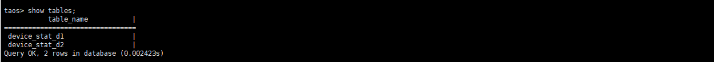

如果要查询某一个设备的信息，我们可以通过两种方式进行查询，第一张是通过超级表指定 **tag** 进行查询

> select * from device_stat where deviceId = 'd1';

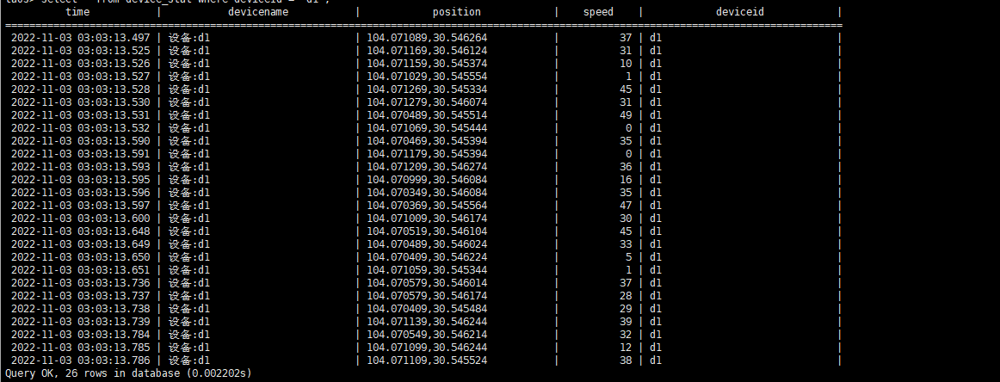

第二种方式直接按照指定数据库名称进行查询

>select * from device_stat_d1;

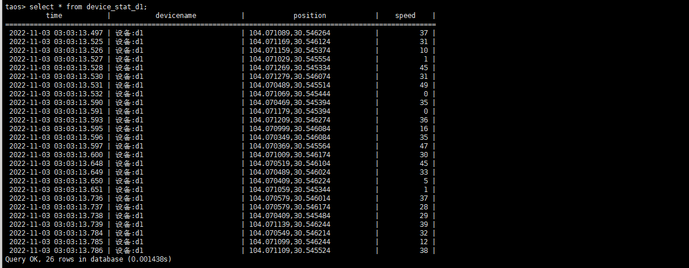

### 查询函数

https://docs.taosdata.com/taos-sql/function/

- 查询最后时间上报的设备：select LAST(*) from device_stat;  这会返回当前超级表下面所有设备中最后时间上报的设备信息
- 查询设备的平均速度：select AVG(speed) from device_stat_d1;
- 统计最大速度和最小速度之差：select SPREAD(speed) from device_stat_d1;

## 4.6 mybatisplus整合

更多的例子：https://github.com/taosdata/TDengine/tree/3.0/examples/JDBC

### maven依赖

加入 **maven** 依赖，使用了 **mybatis plus** 作为 **orm** 框架，**druid** 作为数据源连接池

```xml
<properties>
		<tdengine.version>3.0.0</tdengine.version>
		<mybatis.plus.version>3.1.2</mybatis.plus.version>
		<druid.version>1.1.17</druid.version>
	</properties>


<dependencies>

    <dependency>
        <groupId>org.springframework.boot</groupId>
        <artifactId>spring-boot-starter</artifactId>
    </dependency>

    <dependency>
        <groupId>org.springframework.boot</groupId>
        <artifactId>spring-boot-starter-web</artifactId>
    </dependency>

    <dependency>
        <groupId>com.baomidou</groupId>
        <artifactId>mybatis-plus-boot-starter</artifactId>
        <version>${mybatis.plus.version}</version>
    </dependency>

    <dependency>
        <groupId>com.alibaba</groupId>
        <artifactId>druid-spring-boot-starter</artifactId>
        <version>${druid.version}</version>
    </dependency>

    <dependency>
        <groupId>com.taosdata.jdbc</groupId>
        <artifactId>taos-jdbcdriver</artifactId>
        <version>${tdengine.version}</version>
    </dependency>

    <dependency>
        <groupId>org.springframework.boot</groupId>
        <artifactId>spring-boot-starter-test</artifactId>
        <scope>test</scope>
    </dependency>
</dependencies>
```

### 配置文件

```yml
spring:
  datasource:
    driver-class-name: com.taosdata.jdbc.TSDBDriver
    url: jdbc:TAOS://tencent-server:6030/iot?charset=UTF-8&locale=en_US.UTF-8&timezone=UTC-8
    password: taosdata
    username: root
mybatis-plus:
  configuration:
    map-underscore-to-camel-case: false
  mapper-locations: classpath:mapper/*.xml
```

分页插件使用 **pstgresql** 的方言

```java
@Configuration
public class MybatisPlusConfig {

    @Bean
    public PaginationInterceptor paginationInterceptor() {
        PaginationInterceptor paginationInterceptor = new PaginationInterceptor();
        paginationInterceptor.setDialectType("postgresql");
        return paginationInterceptor;
    }
}
```

### mapper

```java
public interface DeviceStatMapper extends BaseMapper<DeviceStat> {
	/**
     * 创建超级表
     */
    @Update("create stable if not exists device_stat(time timestamp, deviceName VARCHAR(32), positio VARCHAR(32), speed INT) tags (deviceId VARCHAR(32))")
    int createSuperTable();

    @Insert("insert into ${tbName}(time, deviceName, positio, speed) values(#{device.time}, #{device.deviceName}, #{device.positio}, " +
            "#{device.speed})")
    int insertOne(@Param("tbName") String tbName, @Param("device") DeviceStat deviceStat);

    /**
     * 通过xml进行查询
     */
    List<DeviceStat> selectListForXml(@Param("tableName") String tableName);
}
```

### xml

```xml
<?xml version="1.0" encoding="UTF-8"?>
<!DOCTYPE mapper PUBLIC "-//mybatis.org//DTD Mapper 3.0//EN" "http://mybatis.org/dtd/mybatis-3-mapper.dtd">
<mapper namespace="com.zhj.mapper.DeviceStatMapper">

	<select id="selectListForXml" resultType="com.zhj.entity.DeviceStat">
		select * from device_stat where deviceId = #{tableName}
	</select>
</mapper>
```


### domain

```java
@Data
public class DeviceStat {
    private Timestamp time;
    private String deviceName;
    private String positio;
    private Integer speed;
}
```

### test

```java
@RunWith(SpringRunner.class)
@SpringBootTest
public class TdengineTest {


    @Resource
    private DeviceStatMapper deviceStatMapper;

    @Test
    public void testSelectList() {
        List<DeviceStat> deviceStats = deviceStatMapper.selectList(null);
        deviceStats.forEach(System.out::println);
    }

    @Test
    public void insertOne() {
        DeviceStat deviceStat = new DeviceStat();
        deviceStat.setDeviceName("设备:d1");
        deviceStat.setTime(Timestamp.from(Instant.now()));
        deviceStat.setSpeed(new Random().nextInt(50));
        deviceStat.setPosition(LocationUtils.getRandomPoint("104.070799,30.545794"));
        int one = this.deviceStatMapper.insertOne("device_stat_d1", deviceStat);
        System.out.println(one);
    }

    @Test
    public void testSelectListForXml() {
        List<DeviceStat> deviceStats = this.deviceStatMapper.selectListForXml("d1");
        deviceStats.forEach(System.out::println);
    }

}
```

# 5. 消息订阅

**Tdengine** 还提供了消息订阅功能用于指定 **topic** 进行对应数据的消费

## 5.1 创建Topic

https://docs.taosdata.com/develop/tmq/

> create topic test as select * from iot.device_stat;  # as后面跟随查询的子句

## 5.2 Java代码

```java
public class DeviceStatDeserializer extends ReferenceDeserializer<DeviceStat> {
}
```

```java
private void subscribe() throws SQLException, InterruptedException {
    Properties properties = new Properties();
    properties.setProperty("enable.auto.commit", "true");
    properties.setProperty("auto.commit.interval.ms", "1000");
    properties.setProperty("group.id", "cgrpName");
    properties.setProperty("bootstrap.servers", "tdengine-server:6030");
    properties.setProperty("td.connect.user", "root");
    properties.setProperty("td.connect.pass", "taosdata");
    properties.setProperty("auto.offset.reset", "earliest");
    properties.setProperty("msg.with.table.name", "true");
    properties.setProperty("value.deserializer", "com.zhj.DeviceStatDeserializer");

    TaosConsumer<DeviceStat> consumer = new TaosConsumer<>(properties);
    consumer.subscribe(Arrays.asList("test"));

    while(true){
        ConsumerRecords<DeviceStat> meters = consumer.poll(Duration.ofMillis(100));
        for (DeviceStat meter : meters) {
            System.out.println(meter);
        }
    }
}
```


# 6. 流式计算

流式计算用于对数据进行 **清洗** 和 **预处理**，在传统的方案中一般都通过 **Kafka、Flink** 等流式处理系统进行处理；而 **Tdengine** 在 3.0的流式计算引擎提供了实时处理写入的数据流的能力，下面我们用一个例子来实战一下流式处理；

## 6.1 语法

流式查询的语法跟 **特色查询** 一致，可以参考 **特色查询** 的语法：https://docs.taosdata.com/taos-sql/distinguished/  **注意：流式查询只能其中的子查询必须要配合聚合函数进行使用，普通的子查询函数会出现不支持的异常**

>  CREATE STREAM [IF NOT EXISTS] stream_name [stream_options] INTO stb_name AS subquery

stream_options触发模式：

- AT_ONCE：数据写入后立即触发
- WINDOW_CLOSE：窗口关闭触发（由事件事件决定，可配合 watermark（默认为0） 使用）
- MAX_DELAY：  若窗口关闭，则触发计算；否则计算触发的时间超过 max delay 指定的时间，则立即触发计算

> subquery: SELECT select_list  from_clause  [WHERE condition] [PARTITION BY tag_list]  [window_clause] 

subquery查询子句：

-  window_clause：支持会话窗口、状态窗口和滑动窗口
  - SESSION（ts_col, tol_val）：窗口会话，根据两条纪录的时间戳差值来确定是否属于同一个会话，时间戳超过了阈值就认为开启了下一个窗口，tol_val就是指定了时间的间隔，超过了就是另外一个会话了
  - STAT_WINDOW：状态窗口，使用整数或者布尔值来标识产生记录设备的状态，产生的记录如果具有相同的状态值则认为是同一个状态窗口，数值改变后该窗口关闭
  - INTERVAL：滑动窗口，可以通过指定滑动的时间，例如向前滑动的时间使用 （**SLIDING**）
-  PARTITION BY ：用于根据表名进行分区写，否则会写入一张表里面

## 6.2 示例

在设备上报了车辆的定位和速度之后，由于车辆的定位和速度都是实时的进行数据上报数据量很大，这时候我们需要整理一些数据用于单独存储起来使用；

查询5秒为窗口中速度最大的数据

> create stream max_speed into max_speed_output_stb as select _wstart as start, _wend as wend,  max(speed) from device_stat interval(5s) order by 1 desc

查询出每10秒为窗口 20 - 30 速度的数量，并且计算平均值数据写入库中

> create stream select_thirty_speed into select_thirty_output_stb as select  avg(speed), count(*) from device_stat where speed > 20 and speed < 30 interval(10s);


# 7. 性能测试

配置两个数据源用于进行测试使用，一个 **mysql** 、一个 **Tdengine**

```java
@Configuration
public class MybatisPlusConfig {

    @Bean
    public PaginationInterceptor paginationInterceptor() {
        PaginationInterceptor paginationInterceptor = new PaginationInterceptor();
        paginationInterceptor.setDialectType("postgresql");
        return paginationInterceptor;
    }

    @Bean
    public DataSource dataSource(DataSourceProperties dataSourceProperties) {
        MultiDataSource dataSource = new MultiDataSource();
        Map<Object, Object> datasourceMap = new HashMap<>();
        DataSource tdengineDatasource = tdengineDatasource();
        datasourceMap.put("tdengine", tdengineDatasource);
        datasourceMap.put("mysql", mysqlDatasource());
        dataSource.setDefaultTargetDataSource("tdengine");
        dataSource.setDataSourceLookup((str) -> tdengineDatasource);
        dataSource.setTargetDataSources(datasourceMap);
        return dataSource; // get connection
    }

    private DataSource tdengineDatasource() {
        DruidDataSource dataSource = new DruidDataSource();
        // jdbc properties
        dataSource.setDriverClassName(dataSource.getDriverClassName());
        String jdbcUrl = "jdbc:TAOS://tdengine-server:6030/iot?user=root&password=taosdata";
        dataSource.setDriverClassName("com.taosdata.jdbc.TSDBDriver");
        dataSource.setUrl(jdbcUrl);
        dataSource.setUsername("root");
        dataSource.setPassword("taosdata");
        // pool configurations
        dataSource.setInitialSize(10);
        dataSource.setMinIdle(10);
        dataSource.setMaxActive(10);
        dataSource.setMaxWait(30000);
        dataSource.setValidationQuery("select server_status()");
        return dataSource; // get connection
    }

    private DataSource mysqlDatasource() {
        DruidDataSource dataSource = new DruidDataSource();
        // jdbc properties
        dataSource.setDriverClassName(dataSource.getDriverClassName());
        String jdbcUrl = "jdbc:mysql://localhost:3306/iot?useUnicode=true&characterEncoding=utf-8&useSSL=true&serverTimezone=UTC";
        dataSource.setUrl(jdbcUrl);
        dataSource.setDriverClassName("com.mysql.cj.jdbc.Driver");
        dataSource.setUsername("root");
        dataSource.setPassword("123456");
        // pool configurations
        dataSource.setInitialSize(10);
        dataSource.setMinIdle(10);
        dataSource.setMaxActive(10);
        dataSource.setMaxWait(30000);
        dataSource.setValidationQuery("select server_status()");
        return dataSource; // get connection
    }

}
```

```java
public class MultiDataSource extends AbstractRoutingDataSource {
    @Override
    protected Object determineCurrentLookupKey() {
        return ThreadDataSource.get();
    }
}
```

用本地线程的方式选择指定的数据源

```java
public class ThreadDataSource {

    private static final ThreadLocal<String> datasourceKey = new ThreadLocal<>();

    public static void set(String key) {
        datasourceKey.set(key);
    }

    public static String get() {
        return datasourceKey.get();
    }

}
```

```java
@Mapper
public interface DeviceStatMapper extends BaseMapper<DeviceStat> {

    /**
     * 创建超级表
     */
    @Update("create stable if not exists device_stat(time timestamp, deviceName VARCHAR(32), positio VARCHAR(32), speed INT) tags (deviceId VARCHAR(32))")
    int createSuperTable();

    @Insert("insert into ${tbName} using device_stat tags (#{device.deviceId}) values(#{device.time}, #{device" +
            ".deviceName}, #{device.positio}, " +
            "#{device.speed})")
    int insertOne(@Param("tbName") String tbName, @Param("device") DeviceStat deviceStat);

    /**
     * 通过xml进行查询
     */
    List<DeviceStat> selectListForXml(@Param("tableName") String tableName);
}
```

```java
@Data
public class DeviceStat {
    private String deviceId;
    private Timestamp time;
    private String deviceName;
    private String positio;
    private Integer speed;
}
```

mysql建表语句

```sql
create table device_stat
(
    id          int auto_increment
        primary key,
    time        timestamp default CURRENT_TIMESTAMP null,
    device_name varchar(32)                         null,
    positio    varchar(32)                         null,
    speed       int(32)                             null,
    device_id   varchar(32)                         null
);
```

测试文件

```java
@RunWith(SpringRunner.class)
@SpringBootTest
public class TdengineTest {
    @Resource
    private DeviceStatMapper deviceStatMapper;
    
    private final ExecutorCompletionService<Integer> executorService = new ExecutorCompletionService<>(Executors.newFixedThreadPool(10));
    
    @Test
    public void testSelectList() throws InterruptedException {
        CountDownLatch count = new CountDownLatch(2);
        new Thread(() -> {
            selectTdengine();
            count.countDown();
        }).start();
        new Thread(() -> {
            selectMysql();
            count.countDown();
        }).start();
        count.await();
    }

    private void selectMysql() {
        long start = System.currentTimeMillis();
        ThreadDataSource.set("mysql");
        QueryWrapper<DeviceStat> wrapper = new QueryWrapper<>();
        List<DeviceStat> deviceStats = this.deviceStatMapper.selectList(wrapper);
        long end = System.currentTimeMillis();
        System.out.println("mysql耗时:" + (end - start) + "查询条数:" + deviceStats.size());
    }

    private void selectTdengine() {
        long start = System.currentTimeMillis();
        ThreadDataSource.set("tdengine");
        List<DeviceStat> deviceStats = this.deviceStatMapper.selectListForXml("d1");
        long end = System.currentTimeMillis();
        System.out.println("Tdengine耗时:" + (end - start) + "查询条数:" + deviceStats.size());
    }


    @Test
    public void insertTdengine() {
        ThreadDataSource.set("tdengine");
        this.deviceStatMapper.createSuperTable();
        long start = System.currentTimeMillis();
        int size = 100000;
        int deviceNum = 100000;
        for (int i = 0; i < size; i++) {
            String deviceId = "d" + i;
            executorService.submit(() -> {
                ThreadDataSource.set("tdengine");
                int num = 0;
                for (int i1 = 0; i1 < deviceNum; i1++) {
                    DeviceStat deviceStat = new DeviceStat();
                    deviceStat.setDeviceId(deviceId);
                    deviceStat.setDeviceName("设备:" + deviceId);
                    deviceStat.setTime(Timestamp.from(Instant.now()));
                    deviceStat.setSpeed(new Random().nextInt(50));
                    deviceStat.setPosition(LocationUtils.getRandomPoint("104.070799,30.545794"));
                    int one = this.deviceStatMapper.insertOne("device_stat_" + deviceId, deviceStat);
                    num += one;
                }
                return num;
            });
        }
        int num = 0;
        int completionTask = 0;
        do {
            try {
                num += executorService.take().get();
                completionTask++;
            } catch (InterruptedException | ExecutionException e) {
                System.out.println("Tdengine异常信息:" + e.getMessage());
            }
            System.out.println("Tdengine完成任务数:" + completionTask);
        } while (completionTask != size);
        long end = System.currentTimeMillis();
        System.out.println("Tdengine耗时:" + (end - start) + "插入条数:" + num);
    }

    @Test
    public void insertMysql() {
        long start = System.currentTimeMillis();
        int size = 100000;
        int deviceNum = 100000;
        for (int i = 0; i < size; i++) {
            String deviceId = "d" + i;
            executorService.submit(() -> {
                ThreadDataSource.set("mysql");
                int num = 0;
                for (int i1 = 0; i1 < deviceNum; i1++) {
                    DeviceStat deviceStat = new DeviceStat();
                    deviceStat.setDeviceId(deviceId);
                    deviceStat.setDeviceName("设备:" + deviceId);
                    deviceStat.setTime(Timestamp.from(Instant.now()));
                    deviceStat.setSpeed(new Random().nextInt(50));
                    deviceStat.setPosition(LocationUtils.getRandomPoint("104.070799,30.545794"));
                    int one = this.deviceStatMapper.insert(deviceStat);
                    num += one;
                }
                return num;
            });
        }
        int num = 0;
        int completionTask = 0;
        do {
            try {
                num += executorService.take().get();
                completionTask++;
            } catch (InterruptedException | ExecutionException e) {
                System.out.println("Mysql异常信息:" + e.getMessage());
            }
            System.out.println("Mysql完成任务数:" + completionTask);
        } while (completionTask != size);
        long end = System.currentTimeMillis();
        System.out.println("Mysql耗时:" + (end - start) + "插入条数:" + num);
    }

    @Test
    public void testSelectListForXml() {
        List<DeviceStat> deviceStats = this.deviceStatMapper.selectListForXml("d1");
        deviceStats.forEach(System.out::println);
    }

}
```


## 7.1 插入

开启两个线程对数据库通过 **ORM** 框架插入 **10W** 数据，**Tdengine** 耗时为 **3分钟** ，**mysql** 耗时为 **10分钟**

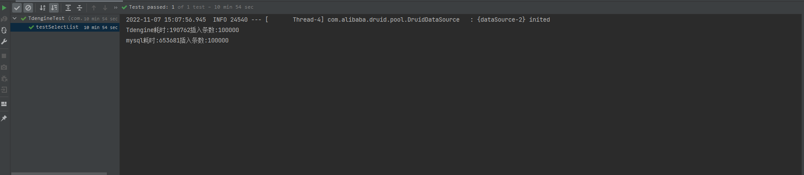

## 7.2 内存

Tdengine插入10w的数据


mysql插入10w的数据，**8M** 左右

> ```
> analyze table device_stat; #分析表大小
> 
> select concat(round(data_length/1024/1024,2),'MB') as data, TABLE_ROWS as tr from information_schema.tables where TABLE_NAME = 'device_stat';
> ```

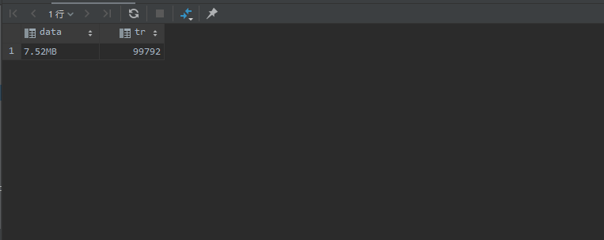

## 7.3 查询

同时查询 10w 条数据：Tdengine的查询效率是mysql的一倍

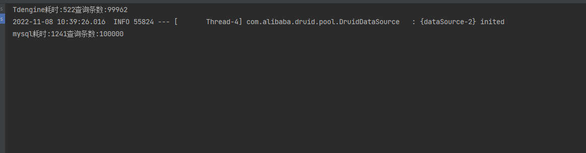

同时查询 20w 数据

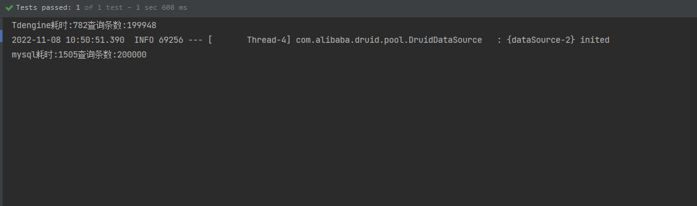

Tdeinge查询500w的数据时间差不多17秒左右

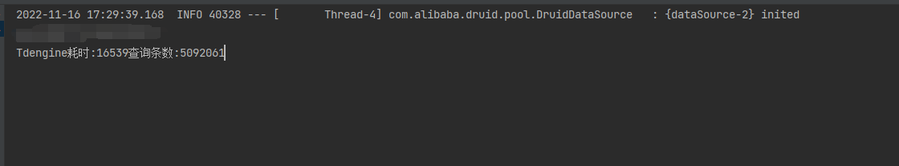

# 8. 改造方案

目前iot平台所采用的架构是 springboot + mybatis plus + mongo + mysql 的方式进行数据的存储，而其中的mongo又是作为时序数据的存储方案，目前每天线上日活的设备量在 1 - 2k 左右，每日的日志消息量就能够达到百万级别，对于心跳消息包以及设备状态这种消息具有非常典型的时序数据来说，采用mongo存储的话内存占用、查询效率会随着设备量的增长逐渐受到影响，这里可以将 **mongo** 替换为 **tdengine** 数据库来存储时序数据，具体性能对比可以查看官网文档：

> https://www.cnblogs.com/taosdata/p/15702785.html


新方案采用 springboot + mybatis plus + tdengine + mysql，其中mysql存储非时序性的数据，td存储设备状态等时序性数据利用 td 的数据压缩能力可以节省原来 1/10 的内存空间；甚至还可以利用 **tdengine** 消息订阅功能以及 http接口方式，实现多种数据的投递以及消费


## 8.1 心跳数据

对于设备的心跳数据可以进行以下表的改造，我们可以存储不同类型设备的协议类型，tag 用设备id进行区分，这样每个设备存储的时候都是一个对应的子表；这样我们进行统计设备每次的消息量就可以按照查询超级表的方式及进行查询，查需某一个设备时就可以按照子表名称进行查询

```sql
create stable device_heart(time timestamp, device_id varchar(32), payload varchar(32), protocol_type tinyint) tags(device_id varchar(32))
```

## 8.2 消息日志

消息日志的存储，也可以根据上面的方式创建对应的超级表来进行存储

```sql
create stable iot_device_log(time timestamp, component_id varchar(8), payload varchar(256), protocol_type tinyint) tags(device_id varchar(32))
```

## 8.3 物模型数据

对于在上报数据过程产生的物模型数据，例如：指令、事件、属性等数据可以按照以下的方式进行建表; **extend_type** 类型用来表示，当前属性下面的值是什么类型例如：

- 0：结构体
- 1：数组，只需要判断第一个数据的类型就可以知道当前数组的元素是什么类型
- 2：其他，其他就代表下面是单个单个的类型

```sql
create stable iot_device_model_property(time timestamp, device_id int, component_id varchar(8), extend_type tinyint) tags(device_id int)

create stable iot_device_model_property_extend(time timestamp, device_id int, type tinyint, value varchar(32)) tags(device_id int)
```

```json
{
    "value": {
        "int": 100,
        "float": 1.23,
        "double": 1.333,
        "bool": "0",
        "string": "vfsdhjfjhjkf",
        "date": "1667957473025",
        "enum": "a"
    },
    "timestamp": 1655277748664
}
```

```json
{
    "value": [
        1.022,
        1.0222
    ],
    "timestamp": 1655277748664
}
```

按照上面的两种数据结构，插入数据将会是这样；如果是结构体可以按照json存到value也可以按照 一条一条的数据进行存储，然后value就存每一个下面字段的id的数组（当然json存储更加简单，但是可能单个字段值可能会很大）

```sql
insert into d_model_property_01 using iot_device_model_property tags(1) values(now(), 1, "NGTIX4YJ", "other") 

insert into d_model_property_01_extend using iot_device_model_property_extend tags(1) values(now(), "int", "100") (now(), "float", "1.23") (now(), "double", "0.2")
```

## 8.4 消息引擎

将消息引擎单独抽成服务，然后利用 **tdengine** 订阅消息日志的功能，只要数据进行落库之后就直接触发规则引擎

> create topic rule_engine as select * from iot.iot_device_log;  


上面的改造例子比较简单，使用 **Tdengine** 的好处是查询快、利用压缩技术节省内存的成本、可以利用订阅消息的方式实现很多复杂的数据消费（例如统计数据，就不需要在代码中硬编码去向统计服务投递消息，统计服务只需要订阅数据库就可以了），而且 **Tdengine** 中的列式存储，可以每个设备一张数据表，查询的时候只需要定位数据表名称就可以了