# Camunda工作流

## 一、下载安装

通过 docker 来直接运行，默认账号密码 demo，demo

> docker run -d --name camunda -p 8080:8080 camunda/camunda-bpm-platform:latest

> http://localhost:8080/camunda-welcome/index.html

安装[camunda modeler](https://camunda.com/download/modeler/) 下载直接解压，启动 **exe** 文件

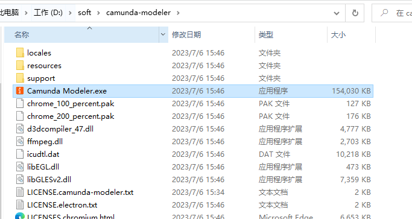

## 二、BPMN

BPMN 指业务流程建模与标记，BPMN定义业务流程图，其基于流程图技术，创建

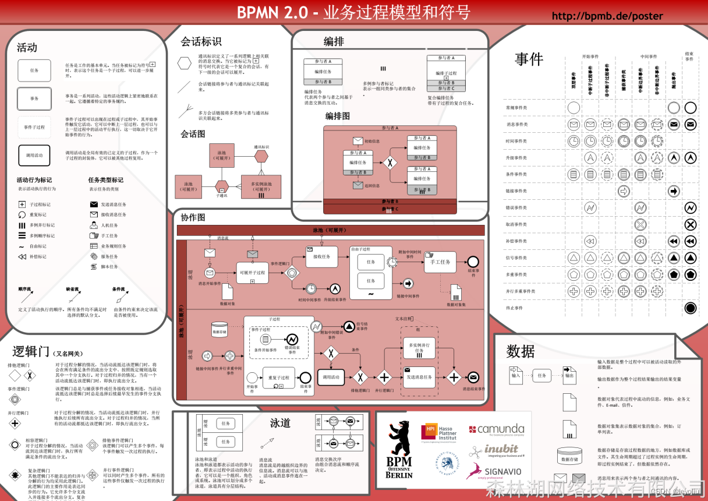

- 活动：就是指具体的任务
- 会话标识
- 编排：整个流程的参与者有哪些
- 泳道：跟编排差不多，例如：每个项目里面有多个流程，每一个项目就是一个泳道
- 事件：发起的一些额外处理
- 数据：起一个标识作用
- 逻辑门：就是网关

## 三、任务

### 1. 用户任务

需要人工处理后才能继续执行的任务。例如：请假流程，zhangsan请假，需要wanghao用户审批后才能继续执行；

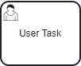

#### 1.1 流程模型

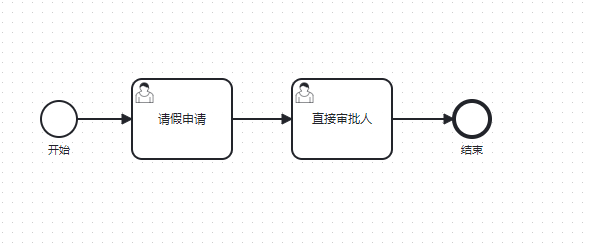

定义好启动变量 **starter**，这个变量表示谁启动它就指代的谁

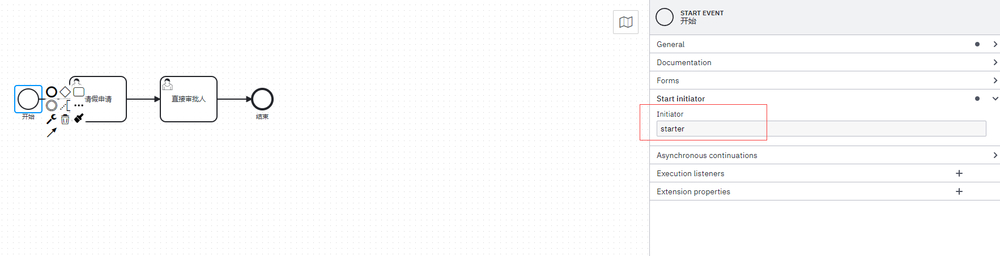

通过 EL 表达式可以获取到 **${starter}** 变量获取到发起审批的人是谁，就是这个任务由谁来发起；用户发起节点定义一个任务的表单，包含三个字段 **name、number、reason**，分别表示名字、天数、原因

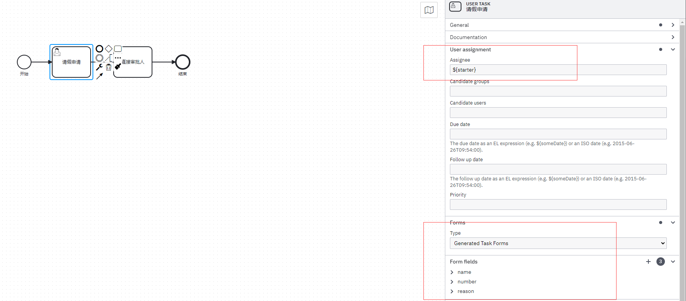

审批的节点定义好需要哪个用户来进行审批，然后审批节点又需要定义一个表单标识审核是否通过；真正流程是需要关联外部设计好的表单的

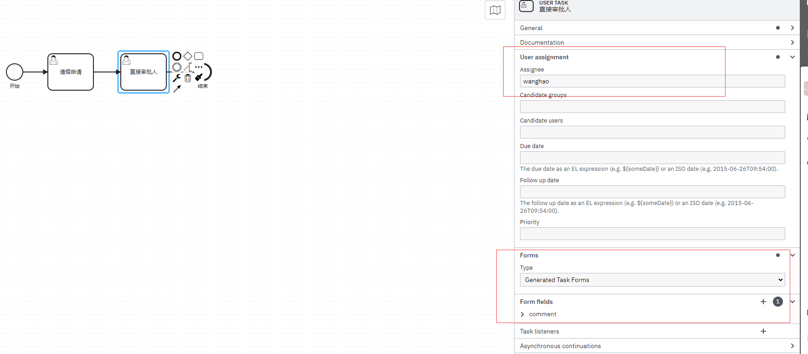

#### 1.2 部署流程

我这是通过运行的 camunda的 **Camunda Modeler** 来直接部署到运行的 **Camunda Platform** 上

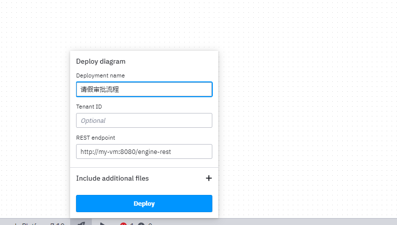

#### 1.3 创建用户

现在需要创建一个 **wanghao 和 zhangsan** 用户，并且都需要添加到对应的用户组里面，否则没有权限操作

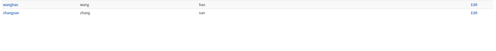

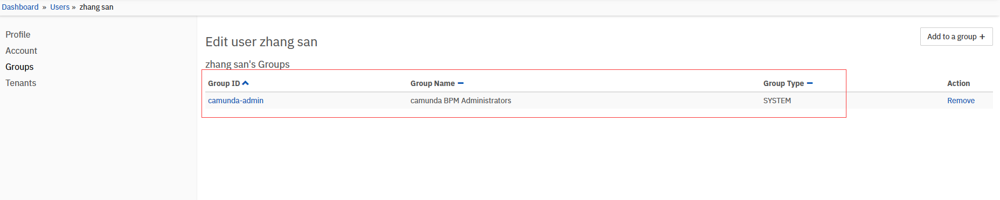

#### 1.4 启动任务

通过 **zhangsan** 用户启动一个流程，找到定义好的流程名字，输入对应的数据

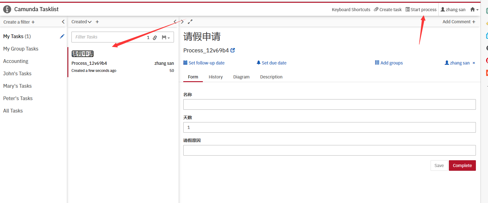

然后切换到 **wanghao** 账号的任务列表中就可以看到待办的任务了

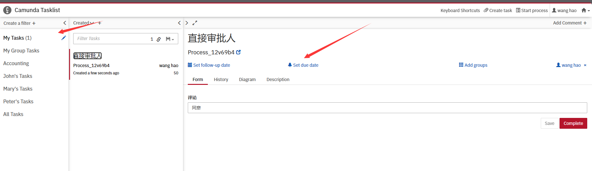

### 2. 业务任务

业务任务通常是用来调用业务系统，camunda中可以调用java代码或者rest api调用

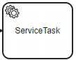

目前camunda中，业务任务实现方式有5种

- Java class
- Expression
- Delegate expression：需要实现camunda提供的接口 **JavaDelegate**
- External
- Connector

#### 2.1 流程模型

预约家电维修的流程定义

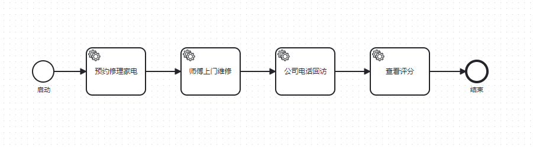

##### Class Java

预约修理家电使用的是 Java class来进行处理

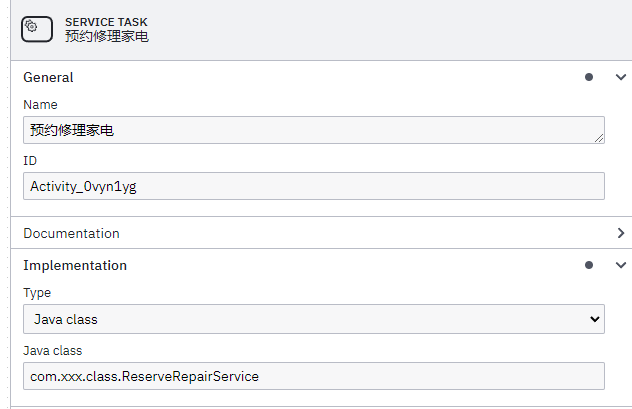

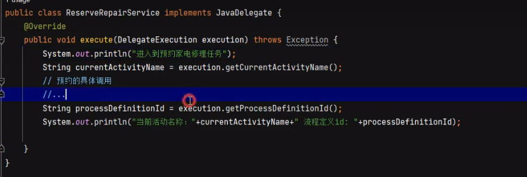

##### Delegation

师傅上门维修使用 Delegation Expression来使用，需要实现提供的接口 JavaDelegate，并且使用java spring service的注解指定bean的名称

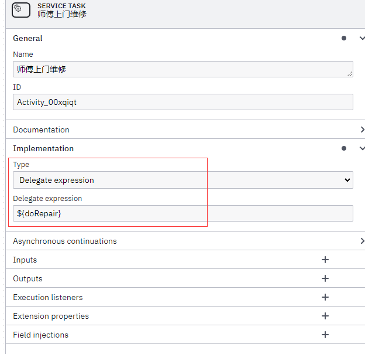

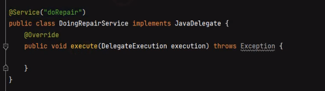

##### Expression

公司电话回访使用的 Expression 实现业务任务，使用EL表达式接受 **bean.callMethod(参数)** 的方式执行，也可以是一行普通的表达式；相比于 Delegate expression，此种方式实现任务的Bean无须实现JavaDelegate接口，可以是任意方法，参数，需要用到流程执行的参数，可以直接传入execution

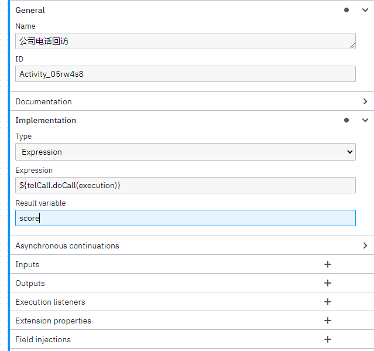

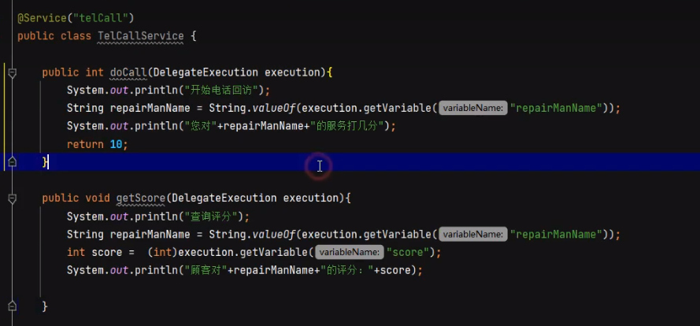

查看分数也使用 Execution 来实现

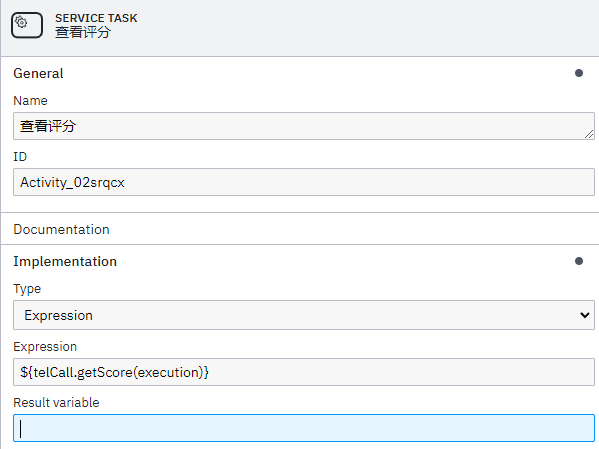

#### 2.2 部署流程

### 3. 外部任务

**External Task**：是属于业务任务的一个分支，外部任务需要实现方明确告知其 **complete** 任务了才会继续流传任务；外部任务的执行大体分三步

- Process Engine：创建一个外部任务实例
- External Worker：拉取并且锁定外部任务（根据订阅的topic）
- External Worker & Process Engine：完成外部任务实例，这一步如果上报异常给引擎，如果上报异常时，在异常没有消失前会永远卡在这里

#### 3.1 长轮询

camunda采用的是长轮询的模式拉去任务，如果没有外部任务可用，请求会被 **服务器** 挂起并加锁；在长时间轮询的帮助下，如果没有外部任务，服务器会暂停请求。一旦有新的外部任务出现，请求就会重新被激活，并执行响应。暂停的时间可以通过 timeout 配置

