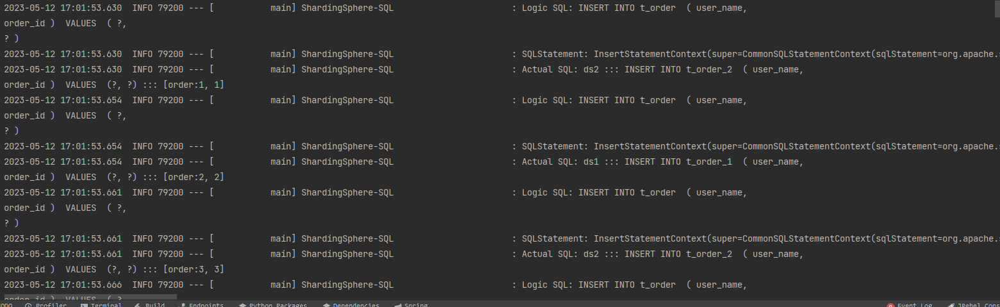
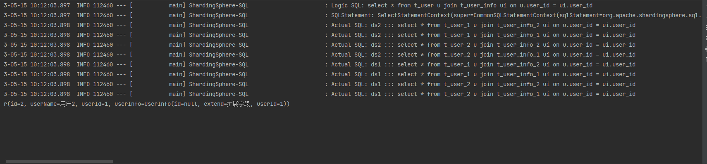
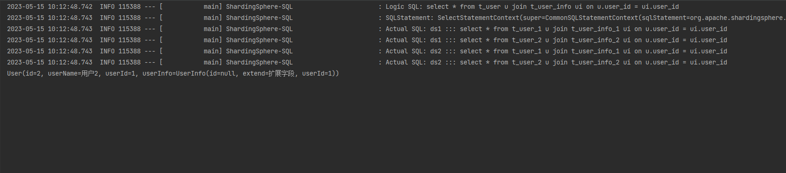

# shading-jdbc

**Sharding-JDBC** 是ShardingSphere的第一个产品，也是ShardingSphere的前身。 它定位为轻量级Java框架，在Java的 `JDBC` 层提供的额外服务。它使用客户端直连数据库，以jar包形式提供服务，无需额外部署和依赖，可理解为增强版的JDBC驱动，完全兼容JDBC和各种ORM框架。

## 1. 名词说明

## 2. 配置说明

在配置时由于采用的是 **shardingsphere-jdbc-core-spring-boot-starter** 自动装配时一定要注意不要使用驼峰命名配置文件，自动装配识别不了，如果是采用的 **Yml** 方式进行配置就可以使用驼峰；

注：官方提供了 Java API、Yaml、Spring Boot Starter 三种方式进行配置，Yaml可以自己进行手动创建数据源

### 2.1 数据源配置

```yml
spring:
  shardingsphere:
    datasources: #数据源配置，可以配置多个
      <data_source_name>: #<数据源池实现类> 具体的数据源
        driver-class-name: #数据库驱动名
        url: #数据库连接
        username: #数据库名
        password: #数据库密码
```

### 2.2 数据分片

```yml
spring:
  shardingsphere:
    rules:
      sharding:
      	tables: #需要进行分表的逻辑表
        <logic-table-name>: # 逻辑表名称
          actual-data-nodes: # 由数据源名 + 表名组成（参考 Inline 语法规则）
          database-strategy: # 分库策略，缺省表示使用默认分库策略，以下的分片策略只能选其一
            standard: # 用于单分片键的标准分片场景
              sharding-column: # 分片列名称
              sharding-algorithm-name: # 分片算法名称
            complex: # 用于多分片键的复合分片场景
              sharding-columns: # 分片列名称，多个列以逗号分隔
              sharding-algorithm-name: # 分片算法名称
            hint: # Hint 分片策略
              sharding-algorithm-name: # 分片算法名称
            none: # 不分片
          table-strategy: # 分表策略，同分库策略
          key-generate-strategy: # 分布式序列策略
            column: # 自增列名称，缺省表示不使用自增主键生成器
            key-generator-name: # 分布式序列算法名称
      auto-tables: # 自动分片表规则配置
        <logic-table-name>: # 逻辑表名称
          actual-data-sources: # 数据源名称
          sharding-strategy: # 切分策略
            standard: # 用于单分片键的标准分片场景
              sharding-column: # 分片列名称
              sharding-algorithm-name: # 自动分片算法名称
      binding-tables: # 绑定表规则列表
        - <logic_table_name_1, logic_table_name_2, ...> 
        - <logic_table_name_1, logic_table_name_2, ...> 
      broadcast-tables: # 广播表规则列表
        - <table-name>
        - <table-name>
      default-database-strategy: # 默认数据库分片策略
      default-table-strategy: # 默认表分片策略
      default-keyGenerate-strategy: # 默认的分布式序列策略
      default-sharding-column: # 默认分片列名称

      # 分片算法配置
      sharding-algorithms:
        <sharding-algorithm-name> (+): # 分片算法名称
          type: # 分片算法类型
          props: # 分片算法属性配置
          # ...

      # 分布式序列算法配置
      key-generators:
        <key-generate-algorithm-name> (+): # 分布式序列算法名称
          type: # 分布式序列算法类型
          props: # 分布式序列算法属性配置
          # ...
```

## 3. 实战例子

- spring boot采用2.1.3.RELEASE
- mysql连接器：8.0.18
- mybatis-plus：3.5.2
- shardingsphere-jdbc-core-spring-boot-starter：这里用官网提供的springboot组件5.1.1版本，详细的配置可以查看官网

```xml
<parent>
    <groupId>org.springframework.boot</groupId>
    <artifactId>spring-boot-starter-parent</artifactId>
    <version>2.1.3.RELEASE</version>
    <relativePath/>
</parent>
<!--mysql 连接依赖-->
<dependency>
    <groupId>mysql</groupId>
    <artifactId>mysql-connector-java</artifactId>
    <version>8.0.18</version>
    <scope>runtime</scope>
</dependency>

<dependency>
    <groupId>com.baomidou</groupId>
    <artifactId>mybatis-plus-boot-starter</artifactId>
    <version>3.5.2</version>
</dependency>

<dependency>
    <groupId>org.apache.shardingsphere</groupId>
    <artifactId>shardingsphere-jdbc-core-spring-boot-starter</artifactId>
    <version>5.1.1</version>
</dependency>
```

数据源的默认配置

```yaml
spring:
  shardingsphere:
    datasource:
      names: ds1,ds2
      ds1:
        type: com.zaxxer.hikari.HikariDataSource
        driver-class-name: com.mysql.cj.jdbc.Driver
        jdbc-url: jdbc:mysql://localhost:3306/test1?useUnicode=true&characterEncoding=UTF-8&useSSL=false&serverTimezone=Asia/Shanghai&useAffectedRows=true
        username: root
        password: 123456
      ds2:
        type: com.zaxxer.hikari.HikariDataSource
        driver-class-name: com.mysql.cj.jdbc.Driver
        jdbc-url: jdbc:mysql://localhost:3306/test2?useUnicode=true&characterEncoding=UTF-8&useSSL=false&serverTimezone=Asia/Shanghai&useAffectedRows=true
        username: root
        password: 123456
```

### 3.1 水平分库分表

定义了一张 `t_order` 表，分为两个数据库里面 `ds1`和`ds2` 下面又分有两张 `t_order_1`和`t_order_2` 表，最主要是 **tables** 的属性配置，下面再将具体的语法配置；这里我们配置根据 **order_id** 进行路由根据我们的分库数和分表数进行取模，由于是1开始的，所以需要加1，不然取模会取到0

#### yaml配置

```yml
spring:t
  shardingsphere:
    rules:
      sharding:
        tables:
          t_order:
            actual-data-nodes: ds$->{1..2}.t_order_$->{1..2}
            table-strategy:
              standard:
                sharding-column: order_id
                sharding-algorithm-name: t_order_inline
            database-strategy:
              standard:
                sharding-column: order_id
                shardingAlgorithmName: t_order_ds_inline
        sharding-algorithms:
          t_order_inline:
            type: inline
            props:
              algorithm-expression: t_order_$->{order_id % 2 + 1}
          t_order_ds_inline:
            type: inline
            props:
              algorithm-expression: ds$->{order_id % 2 + 1}
	props: #跟sharding平级
      sql-show: true #打印日志
```

#### 初始sql

下面创建sql表

```sql
create table test1.t_order_1(
    id bigint auto_increment primary key comment '主键id',
    user_name varchar(64) default null comment '用户名称',
    order_id bigint default null comment 'order_id',
    index idx_order_id(order_id) comment 'order索引'
)  comment '用户信息' collate = utf8mb4_general_ci;

create table test1.t_order_2(
    id bigint auto_increment primary key comment '主键id',
    user_name varchar(64) default null comment '用户名称',
    order_id bigint default null comment 'order_id',
    index idx_order_id(order_id) comment 'order索引'
)  comment '用户信息' collate = utf8mb4_general_ci;

create table test2.t_order_2(
    id bigint auto_increment primary key comment '主键id',
    user_name varchar(64) default null comment '用户名称',
    order_id bigint default null comment 'order_id',
    index idx_order_id(order_id) comment 'order索引'
)  comment '用户信息' collate = utf8mb4_general_ci;

create table test2.t_order_1(
    id bigint auto_increment primary key comment '主键id',
    user_name varchar(64) default null comment '用户名称',
    order_id bigint default null comment 'order_id',
    index idx_order_id(order_id) comment 'order索引'
)  comment '用户信息' collate = utf8mb4_general_ci;
```

#### 测试代码

mapper和实体类就不贴，自动生成即可

```java
@Test
public void test_order() {
    for (int i = 1; i <= 100; i++) {
        Order order = new Order();
        order.setUserName("order:" + i);
        order.setOrderId((long) i);
        orderMapper.insert(order);
    }
}
```

这里进行sql路由的时候会直接根据上面的配置通过 **table-strategy** 、**database-strategy** 配置的策略通过 **order_id ** 进行取模然后确定数据库和数据表



### 3.2 绑定表

绑定表所要解决的问题是主表与子表之间的查询所出现的笛卡尔积的问题导致出现多条无用的sql，例如：user_1、user2 与子表 user_info_1、user_info_2 互相关联时的笛卡尔积问题，下面写个例子

#### yaml配置

下面的 `yaml` 表示定义了一个比较简单的分库分表

- names：表示定义了两个数据源的名称，下面ds1和ds2中的配置分别定义了 **Datasource** 的类型和驱动、数据库的链接地址、账号密码等，这里直接省略了采用上面的进行
- tables：用于指定逻辑表的关系，这里使用了两个数据源和两张分表，通过 **user_id** 作为分片键进行分表

```yaml
server: 
  port: 9000
spring:
  shardingsphere:
    rules:
      sharding:
        tables:
          t_user:
            actual-data-nodes: ds$->{1..2}.t_user_$->{1..2}
            table-strategy:
              standard:
                sharding-column: user_id
                sharding-algorithm-name: t_user_inline
          t_user_info:
            actual-data-nodes: ds$->{1..2}.t_user_info_$->{1..2}
            table-strategy:
              standard:
                sharding-column: user_id
                sharding-algorithm-name: t_user_info_inline
        sharding-algorithms:
          t_user_inline:
            type: INLINE
            props:
              algorithm-expression: t_user_$->{user_id % 2 + 1}
          t_user_info_inline:
            type: INLINE
            props:
              algorithm-expression: t_user_info_$->{user_id % 2 + 1}
          t_user_ds_inline:
            type: INLINE
            props:
              algorithm-expression: ds$->{user_id % 2 + 1}
        default-database-strategy:
          standard:
            sharding-column: user_id
            sharding-algorithm-name: t_user_ds_inline
        binding-tables:
          - t_user,t_user_info
#配置mybatis-plus
mybatis-plus:
  type-aliases-package: com.zhj.sharding.entity
  mapper-locations: classpath:mapper/*Mapper.xml
```

#### 初始sql

```mysql
create table test2.t_user_1 (
    id        bigint auto_increment primary key comment '主键id',
    user_name varchar(64) default null comment '用户名称',
    user_id   bigint      default null comment '用户的id',
    index idx_user_id (user_id)
) comment '用户信息' collate = utf8mb4_general_ci;
create table test2.t_user_2 (
    id        bigint auto_increment primary key comment '主键id',
    user_name varchar(64) default null comment '用户名称',
    user_id   bigint      default null comment '用户的id',
    index idx_user_id (user_id)
) comment '用户信息' collate = utf8mb4_general_ci;

create table test2.t_user_info_1 (
    id      bigint auto_increment primary key comment '主键id',
    extend  varchar(64) default null comment '用户的扩展信息',
    user_id bigint      default null comment '用户的id',
    index idx_user_id (user_id)
) comment '用户信息' collate = utf8mb4_general_ci;

create table test2.t_user_info_2 (
    id      bigint auto_increment primary key comment '主键id',
    extend  varchar(64) default null comment '用户的扩展信息',
    user_id bigint      default null comment '用户的id',
    index idx_user_id (user_id)
) comment '用户信息' collate = utf8mb4_general_ci;
```

#### 测试代码

> select * from t_user u join t_user_info ui on u.user_id = ui.user_id

下面是没有配置绑定表时进行分页查询，可以看到查询时出现了笛卡尔积的问题，每个数据源都出现了无效的查询sql



下面是配置了绑定表后的解析sql



Sharding-JDBC在进行分库分表后，每个分片只会存储  **部分数据**，因此在进行查询时需要同时查询多个分片，然后将结果进行合并。在没有使用绑定表的情况下，如果查询的两个表在不同的分片中，就会出现笛卡尔积的情况，因为没有对这两个表进行关联，导致每个分片都会返回所有符合条件的结果。而使用绑定表，因为绑定表会将不同分片中的表进行关联，使得查询时只需要查询相关的分片，避免了笛卡尔积的产生。

### 3.3 事务

在 **sharding-jdbc** 中由于使用了分片和多数据的情况，那么使用 **@Transactional** 注解就会导致找不到数据源的问题，这里需要配置 **@ShardingSphereTransactionType** 注解一起使用，下面是该注解的说明

```java
@Target({ElementType.METHOD, ElementType.TYPE})
@Retention(RetentionPolicy.RUNTIME)
@Inherited
public @interface ShardingTransactionType {
    TransactionType value() default TransactionType.LOCAL;
}
```

下面是事务的类型：

- LOCAL：单数据源执行，采用本地事务
- XA：表示基于XA协议的两阶段提交模式，需要proxy的支持
- BASE：表示基于TCC协议的柔性事务模式，依赖应用程序自身实现事务提交和回滚，不需要proxy的支持
- MANUALXA：手动XA事务，不需要proxy支持

```java
public enum TransactionType {
    LOCAL,
    XA,
    BASE,
    MANUALXA;

    private TransactionType() {
    }
}
```

### 3.4 跨库关联查询

**sharding-jdbc** 现在并不支持单表 join 跨库查询，而是需要下面的一个子项目 **sql-federation** 进行支持可以实现**联合查询、分页查询、嵌套查询、聚合查询、子查询等** ；**sql-federation** 属于 **sharding-jdbc** 的实验性支持功能，目前支持sql有以下：

```sql
SELECT * FROM (SELECT * FROM t_order) o;

SELECT * FROM (SELECT * FROM t_order) o WHERE o.order_id = 1;

SELECT * FROM (SELECT * FROM t_order WHERE order_id = 1) o;

SELECT * FROM (SELECT * FROM t_order WHERE order_id = 1) o WHERE o.order_id = 2;

SELECT * FROM t_order o INNER JOIN t_order_item i ON o.order_id = i.order_id WHERE o.order_id = 1;

SELECT * FROM t_order o INNER JOIN t_user u ON o.user_id = u.user_id WHERE o.user_id = 1;

SELECT * FROM t_order o LEFT JOIN t_user_role r ON o.user_id = r.user_id WHERE o.user_id = 1;

SELECT * FROM t_order_item i LEFT JOIN t_user u ON i.user_id = u.user_id WHERE i.user_id = 1;

SELECT * FROM t_order_item i RIGHT JOIN t_user_role r ON i.user_id = r.user_id WHERE i.user_id = 1;

SELECT * FROM t_user u RIGHT JOIN t_user_role r ON u.user_id = r.user_id WHERE u.user_id = 1;

```

#### yaml配置

进行关联分页查询，跨库分页查询需要最新版的 **sharding-jdbc 5.3.2** 版本的支持，上述使用 **5.1.1** 版本只支持跨库查询不能进行分页

- shardingsphere-jdbc-core ：使用shardingsphere的核心
- snakeyaml：手动升级一下sprinboot的yml解析依赖，否者会出现下面的异常

```text
org.apache.shardingsphere.infra.util.yaml.constructor.ShardingSphereYamlConstructor$1.setCodePointLimit(I)V
```

```xml
<dependency>
    <groupId>org.apache.shardingsphere</groupId>
    <artifactId>shardingsphere-jdbc-core</artifactId>
    <version>5.3.2</version>
</dependency>

<dependency>
    <groupId>org.yaml</groupId>
    <artifactId>snakeyaml</artifactId>
    <version>1.33</version>
</dependency>
```

在classpath目录下面创建一个单独的文件夹 **sharding/sharding-jdbc.yml** 在里面配置好对应的配置信息，注意 **sql-federation-type：ADVANCED** 开启对应的关联查询引擎，我们这里表结构是不一样的，使用 **ADVANCED**

- NONE：当执行联邦查询时，根据 SQL 自动判断 SQL 是否能路由到指定的数据源，如果不能则抛出 UnsupportedOperationException 异常
- ORIGINAL：使用该执行器类型时，ShardingSphere Federated Query 会尝试在每个数据源上分别执行原始 SQL，然后将查询结果进行合并。这种类型执行器适用于每个数据源的表结构是相同的场景
- ADVANCED：使用该执行器类型时，ShardingSphere Federated Query 会根据注解或配置文件指定的逻辑表与真实表的映射关系，在每个数据源上分别执行自动生成的分片 SQL，并将执行结果进行合并。这种类型执行器适用于每个数据源的表结构不同的场景

```yml
dataSources:
  ds1:
    dataSourceClassName: com.zaxxer.hikari.HikariDataSource
    driverClassName: com.mysql.cj.jdbc.Driver
    jdbcUrl: jdbc:mysql://localhost:3306/test1?useUnicode=true&characterEncoding=UTF-8&useSSL=false&serverTimezone=Asia/Shanghai&useAffectedRows=true
    username: root
    password: 123456
  ds2:
    dataSourceClassName: com.zaxxer.hikari.HikariDataSource
    driverClassName: com.mysql.cj.jdbc.Driver
    jdbcUrl: jdbc:mysql://localhost:3306/test2?useUnicode=true&characterEncoding=UTF-8&useSSL=false&serverTimezone=Asia/Shanghai&useAffectedRows=true
    username: root
    password: 123456

rules:
  - !SHARDING
    tables:
      t_order:
        actualDataNodes: ds1.t_order
        tableStrategy:
          none:
        databaseStrategy:
          none:
      t_order_item:
        actualDataNodes: ds2.t_order_item
        tableStrategy:
          none:
        databaseStrategy:
          none:
props:
  sql-show: true
  sql-federation-type: ADVANCED
```

#### 初始sql

分别在 test1和test2数据库创建对应的数据库表

```sql
create table test1.t_order (
    id        bigint auto_increment primary key comment '主键id',
    user_name varchar(64) default null comment '用户名称',
    order_id bigint(64) default null comment '订单id'
) comment '订单表' collate = utf8mb4_general_ci;

create table test2.t_order_item (
    id        bigint auto_increment primary key comment '主键id',
    order_desc varchar(64) default null comment '订单名称',
    order_id bigint(64) default null comment '订单id'
) comment '订单详情' collate = utf8mb4_general_ci;

```

#### 测试代码

```xml
<?xml version="1.0" encoding="UTF-8"?>
<!DOCTYPE mapper PUBLIC "-//mybatis.org//DTD Mapper 3.0//EN" "http://mybatis.org/dtd/mybatis-3-mapper.dtd">
<mapper namespace="com.zhj.sharding.mapper.OrderMapper">
	<resultMap id="BaseResultMap" type="com.zhj.sharding.entity.Order">
		<id column="id" jdbcType="BIGINT" property="id"/>
		<result column="user_name" property="userName" jdbcType="VARCHAR"/>
		<result column="order_id" property="orderId" jdbcType="VARCHAR"/>
		<association property="item" javaType="com.zhj.sharding.entity.OrderItem">
			<id column="id" jdbcType="BIGINT" property="id"/>
			<result column="order_desc" property="orderDesc" jdbcType="VARCHAR"/>
		</association>
	</resultMap>
	<sql id="Base_Column_List">
		<!--@mbg.generated-->
		id, user_name, extend, user_id
	</sql>

	<select id="listByPage" resultMap="BaseResultMap">
		select o.id, o.user_name, i.order_desc
		from t_order o inner join t_order_item i on o.order_id = i.order_id where i.order_desc like '%1%' limit 0,10
	</select>
</mapper>

```

```java
@Data
@TableName("t_order")
public class Order {
    @TableId(type = IdType.AUTO)
    private Long id;
    private String userName;
    private Long orderId;
    private OrderItem item;
}
```

```java
@Data
@TableName("t_order_item")
public class OrderItem {
    @TableId(type = IdType.AUTO)
    private Long id;
    private String orderDesc;
    private Long orderId;
}
```

```java
@Mapper
public interface OrderMapper extends BaseMapper<Order> {

    IPage<Order> listByPage(@Param("page") IPage<Order> page, @Param("req") Map<String, Object> params);
}
```

```java
@Test
public void test_order() {
    Page<Order> page = new Page<>(1, 10);
    orderMapper.listByPage(page, null);
    page.getRecords().forEach(System.out::println);
}
```

