# # 一、什么是JVM?

## 1. 好处

- 一次编译，到处运行
- 自动内存管理，垃圾回收功能
- 数组下标越界检查
- 多态

## 2. JVM、JRE、JDK的关系图：

逐级包含的关系

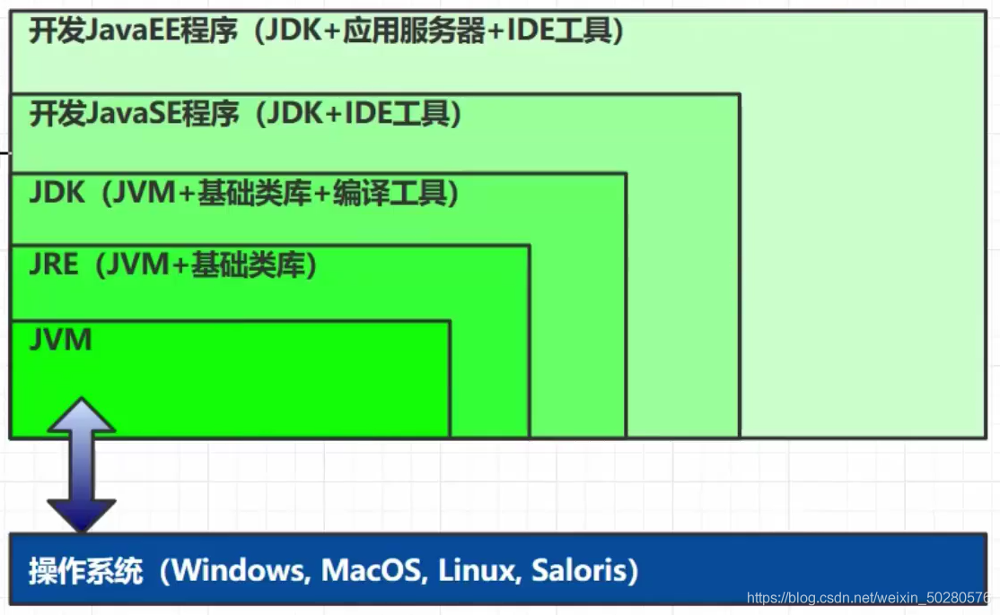

## 3. 常见JVM实现

不同的公司只要遵循虚拟机规范，都可以自己实现

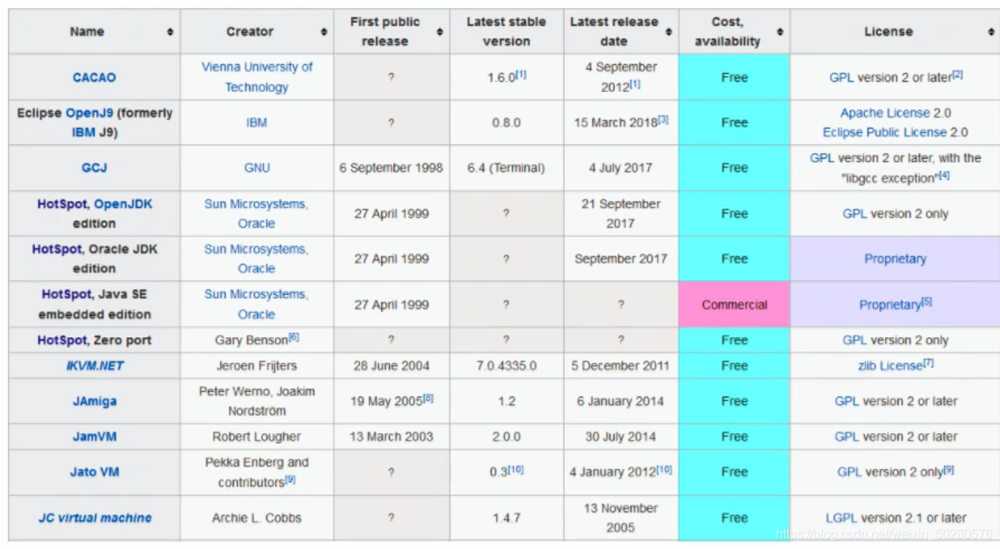

## 4. 学习路线

- ClassLoader：将编译后的二进制文件加载到JVM中运行
- Method Area：类放在方法区中
- Heap：存放类的实例对象
- JVM Stack、PC Register、本地方法栈：在类调用方法时使用
- 解释器：程序执行时由解释器逐行执行
- JIT即时编译器：方法中的热点代码被频繁调用后执行优化
- GC垃圾回收：GC对堆中不用的对象进行回收
- 本地方法接口：直接调用本地操作系统的方法

# 二、 内存结构

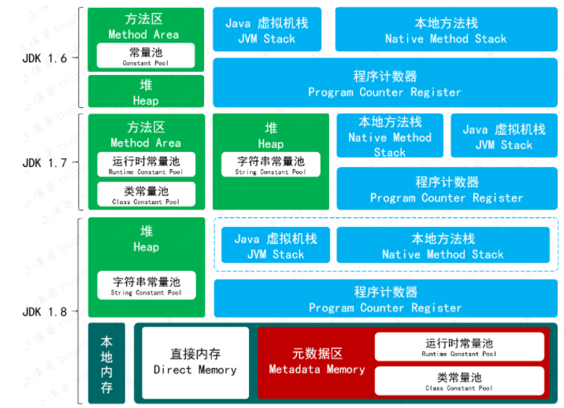

## 1. 程序计数器

### 定义

Program Counter Register 程序计数器（寄存器）

### 作用

是记录下一条 jvm 指令的执行地址行号

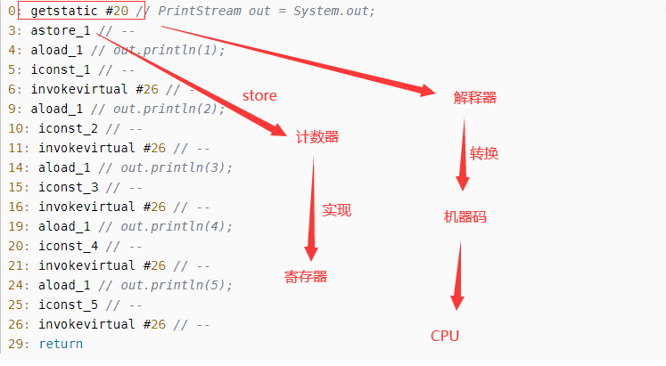

- 解释器转换代码会机器码，将下一行代码的地址存到计数器当中，执行完之后去计数器中拿取下一条数据
- 多线程环境，寄存器会记录下一行指令的地址行号，以便切换回来时可以继续执行

### 特点

- 线程私有
- 不会存在内存溢出

## 2. 虚拟机栈

- 每个线程运行时所需要的内存，成为虚拟机栈
- 每个栈由多个栈帧（Frame）组成，对应着每次调用方法时所占用的内存
- 每个线程只能有一个活动栈帧对应着当前正在执行的方法

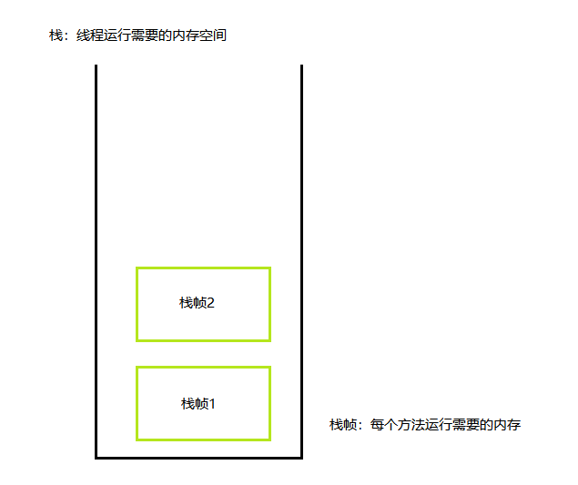

### 问题分析

1. 垃圾回收是否涉及栈内存？

不会，栈内存是方法调用产生的，方法调用结束后会弹出栈

2. 栈内存分配越大越好？

不是。物理内存是一定的，栈内存越大，可以支持更多的递归调用，但是可执行的线程数就会越少。因为线程执行时，调用方法需要申请栈帧内存，单个栈帧内存越大，可申请到的栈帧就越少。**Xss 1m**：用来设置栈内存大小

3. 方法内的局部变量是否线程安全？
   - 如果方法内局部变量没有逃离方法的作用区，它是线程安全的
   - 如果局部变量引用了对象，并且逃离了方法的作用区，它是线程不安全的

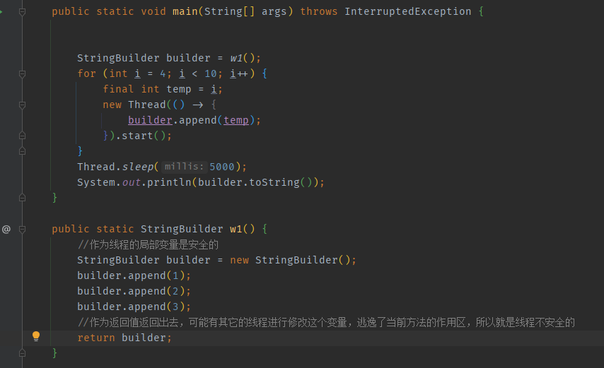

### 内存溢出

- 循环递归调用，入栈的栈帧比较多，并且没有收集回收
- 栈帧过大导致内存溢出

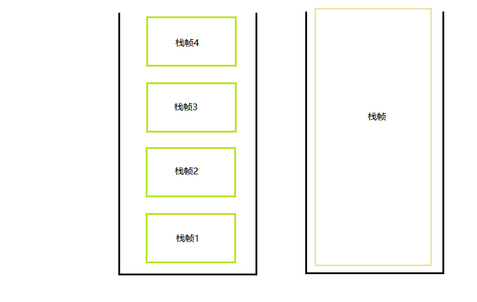

### 线程运行诊断

案例1：cpu占用过多

定位：

- top命令：查看是哪个进程占用资源过高

- ps H -eo pid,tid,%cpu | grep 进程id：定位具体是哪个线程引起的占用cpu过高
- jstack 进程id （需要将十进程线程号转换成十六进制号）

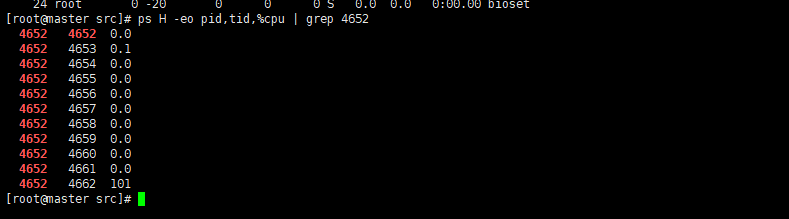

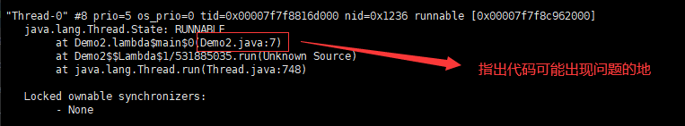

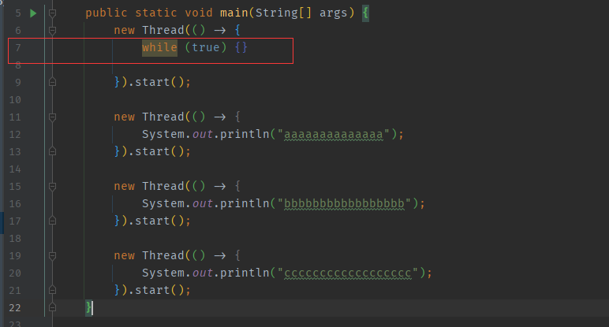

案例2：程序运行很长时间都没有得到自己想要的结果（线程死锁）

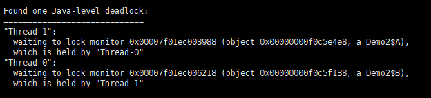

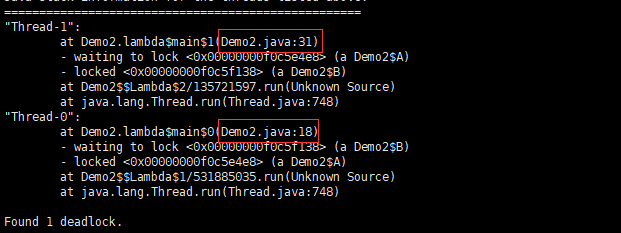

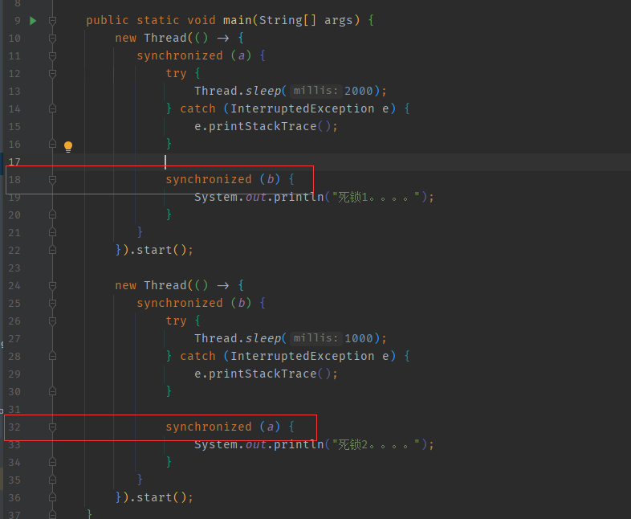

## 3. 本地方法栈

不是由Java代码实现的方法，是给本地方法执行的时候提供内存空间

## 4. 堆

### Heap堆

- 通过new关键字，创建的对象都会使用堆空间

### 特点

- 线程共享，堆中的对象都需要考虑线程安全的问题
- 自动控制的垃圾回收机制

### 堆内存溢出

a = a + a进行字符串拼接，每次拼接都会生成新的字符串对象，而且arrayList集合一直处于引用范围之内，就导致垃圾回收不了

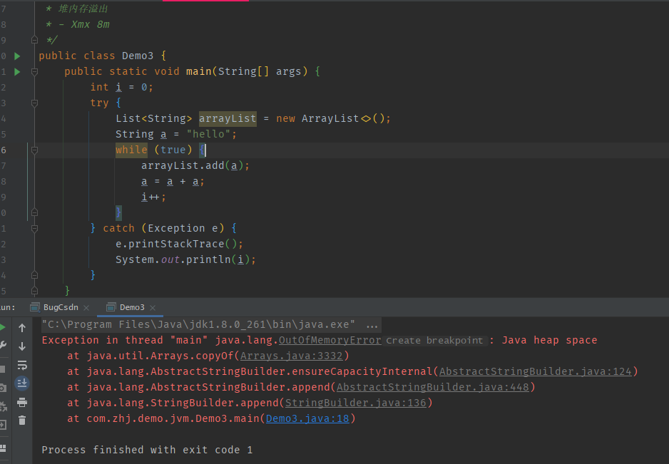

### 堆内存诊断

- 查看当前系统中有哪些java进程：jps
- 查看堆内存占用情况：jmap -heap pid
- 图形界面，多功能的监测工具，可以连续监测：jconsole
- 可视化的虚拟机：jvisualvm

#### GC之后内存依旧占用很高

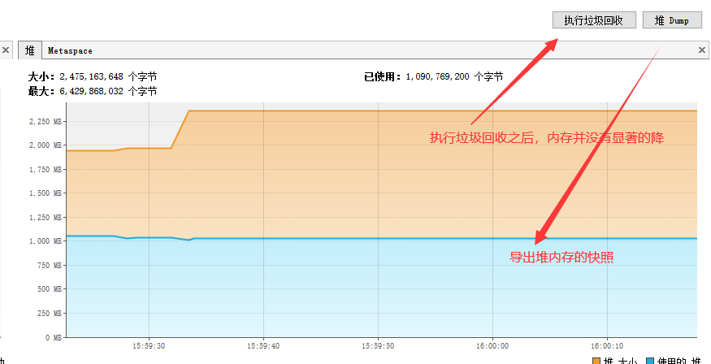

查找出最大的对象

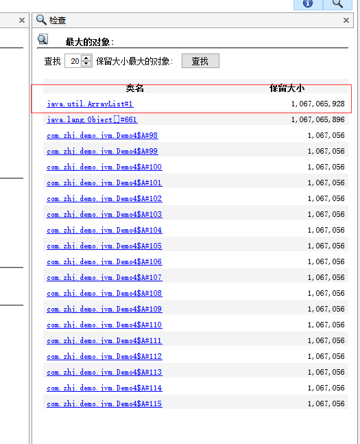

可以发现其中最大的属性值是哪一个，可以发现每一个age属性都有1m多，总共创建了999个对象

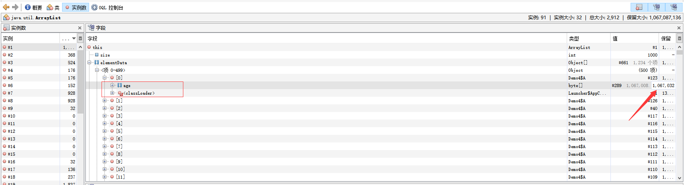

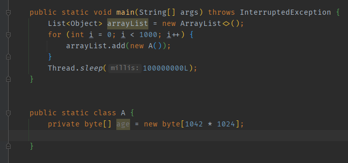

## 5. 方法区

### 5.1 特点

- 线程共享
- 存储类的结构相关信息
  - 成员方法
  - 构造器方法
  - 运行时常量池
- 虚拟器启动时创建，逻辑上是堆的一部分，根据虚拟机厂商来进行实现（hotspot 1.8以前是永久代，1.8之后是元空间，使用的操作系统的内存，不使用jvm来管理内存了）

- 也会导致内存溢出

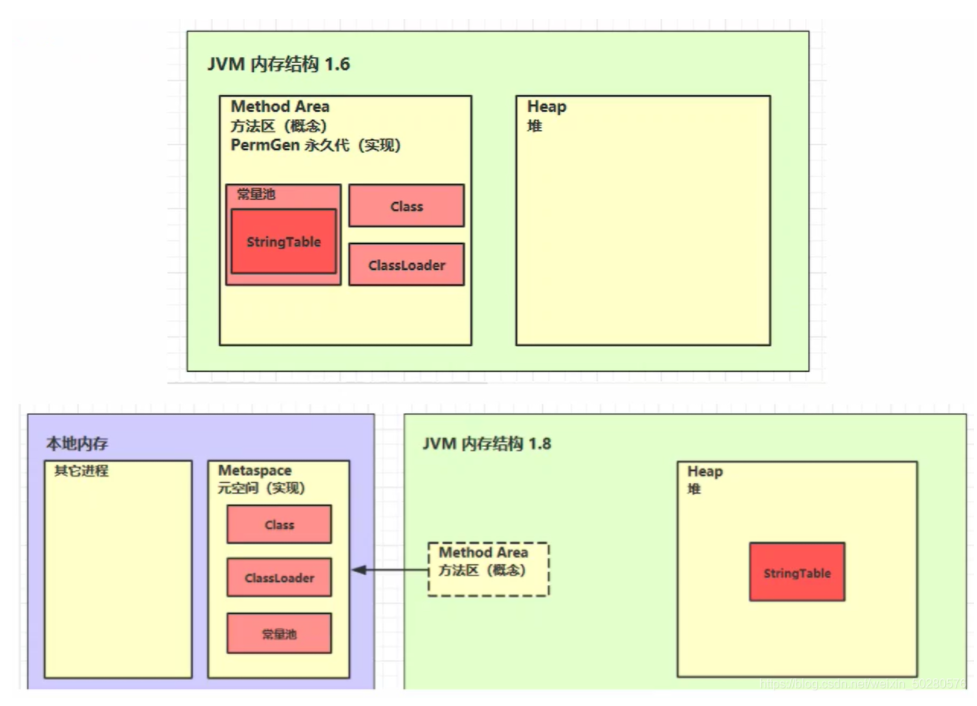

### 5.2 内存溢出

-XX: MaxMetaspaceSize=8m  调整方法区的大小（默认使用的系统内存，很难演示出元空间OOM）

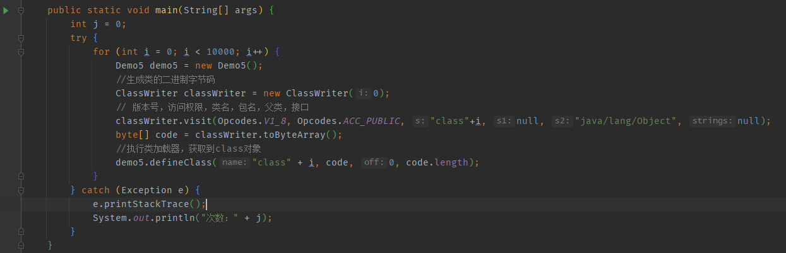

### 5.3 使用场景

- Spring
- mybatis：CGlib 动态代理

### 5.4 运行时常量池

javap -v .class 可以查看类的基本信息。

#### 常量池

就是一张表，虚拟机会根据指令去常量表中找到需要执行的类名，方法名称、参数类型、字面量等信息

#### 运行时常量池

常量池是 *.class文件中的，当该类被加载，它的常量信息就会被放入运行时常量池，并把里面的符号地址变为真实地址

## 6. 直接内存

- 常见于NIO操作时，用于数据缓冲区
- 分配回收成本比较高，但独写性能高
- 不受JVM内存回收管理

每次操作时，会存两份数据，系统内存存一次，在java缓存区中再存在一次

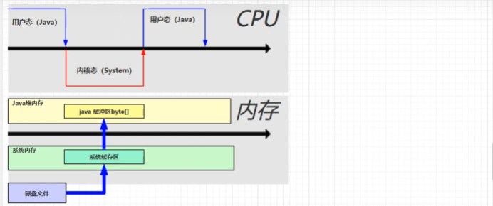

直接内存，就是少拷贝了一份数据

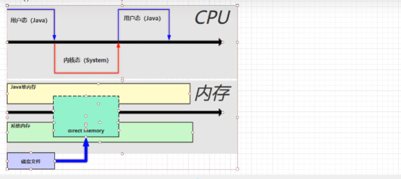

会存在OOM异常；

### 6.1 分配和回收原理

-XX:+DisableExplicitGC  禁用显示的垃圾回收（禁用System.gc() 触发的是FullGC，会有性能问题）

- 使用了Unsafe对象完成直接内存的分配回收，并且回收需要主要调用freeMemory方法
- ByteBuffer的实现类内部，使用了Cleaner（虚引用）来检测ByteBuffer对象，一旦ByteBuffer被垃圾回收，那么就会由ReferenceHandler线程通过Cleaner的clean方法调用freeMemory来释放直接内存

