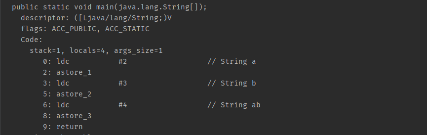
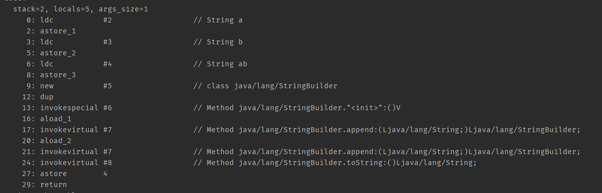
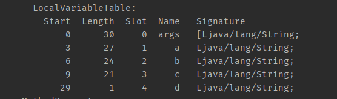
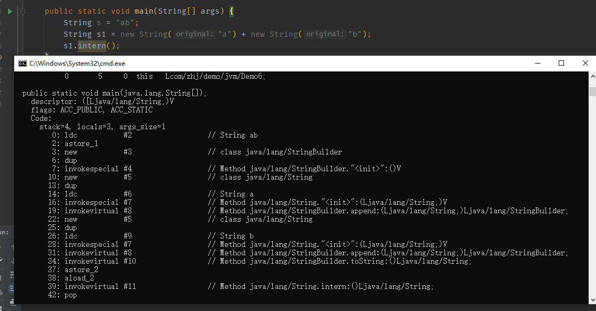
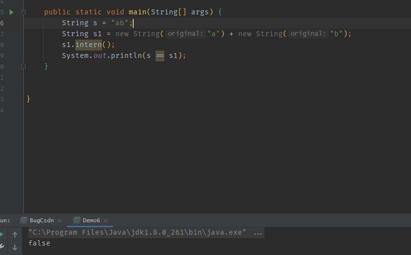
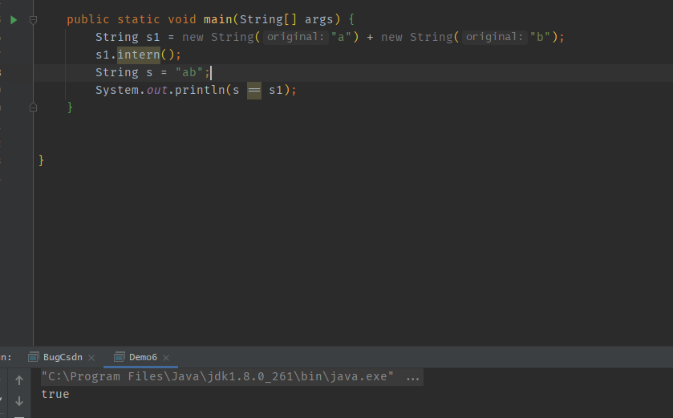
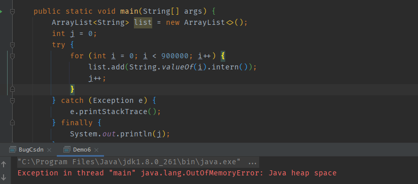
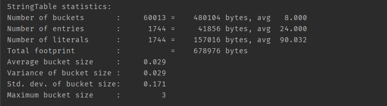
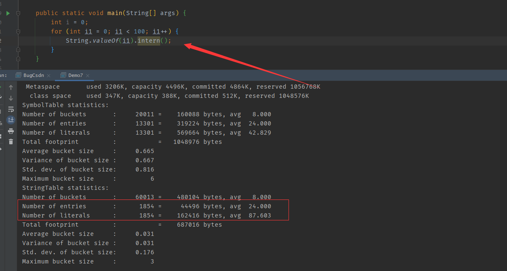
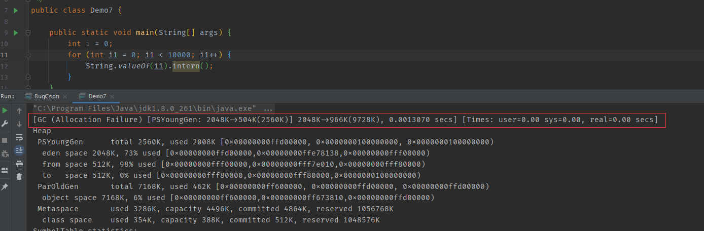

# StringTable

## 1. 特点

Hash表的结构 （数组+链表（桶）的结构构成），不能扩容

```java
public class Demo6 {
    public static void main(String[] args) {
        String a = "a";
        String b = "b";
        String c = "ab";
    }
}
```

javap -v查看反编译文件


0：ldc指令读取常量池中#2的数据，#2 为String类型的 常量，并且将#2替换成 “a”

2：astore_1，进行赋值

3：读取 #3



而在运行时，会先在串池中找，如果找到了直接获取引用，没有找到就放入 StringTable中

    public static void main(String[] args) {
        String a = "a";
        String b = "b";
        String c = "ab";
        String d = a + b;  //创建StringBuilder对象 ，d存的是String的对象地址
    }





ldc：将参数从常量池中查询出来

astore_1：将读取的数据写入 局部变量第一个参数的位置

aload_1：将局部变量表中第一个位置的数据读取出来

invokespecial：调用方法 无参构造

invokevirtual：调用方法

astore：写入到局部变量表第四的位置

```java
String s = "a" + "b";
```

javac在编译器进行优化，两个值都是字面量值，结果在编译器都已经确定了，所以就不需要使用StringBuilder来进行拼接了

## 2. 字符串延迟加载

- 常量池中的字符串仅是符号，只有在第一次使用时才会变为对象
- 利用串池的机制，可以避免重复创建字符串对象
- 字符串常量的拼接原理是StringBuilder (1.8)
- 字符串常量池拼接的原理是编译器优化

## 3. intern()

尝试将字符串放入串池当中



- 先定义ab在串池当中
- 创建了两个string字符串，会先吧a和b字符串存入串池当中，当用StringBuilder进行拼接
- intern尝试将ab存入串池，但是ab已经存在于串池中，就不会存入，并且返回常量池中的引用



- ab还没有存入串池中，s1尝试将ab放入串池中，串池中没有，就放入并且返回对象引用



上述的规则只适用于1.8的及之后的版本。而1.6则是 复制一份副本放入串池中，而后续引用字符串实际使用的是副本的引用

## 4. StringTable的位置

- 1.6 存在于永久代中：因为只有Full GC才会回收永久代中的，会导致回收效率较低
- 1.7 以后被移动到了 堆中，Mirror GC就会触发

将堆内存设置为10m：-Xmx10m  -XX:-UseGCOverheadLimit

UseGCOverheadLimit ：如果 98% 的时间清理堆空间不超过2%，就会导致 GCOverheadLimit异常



## 5. StringTable垃圾回收

### jvm参数

- -XX:+PrintStringTableStatistics  打印StringTable的详细信息
- -XX:+PrintGCDetails -verbose:gc 打印GC信息



- Number of buckets ： 默认桶的个数
- Number of entries：键值对的个数
-  Number of literals：字符串常量占的个数 （java的类名等信息也会以字符串的形式存在串池中）

将100个字符串添加到串池中，看看变化



将堆空间设置为10m，分配10000个字符串，就会触发Mirror GC



## 6. StringTable性能调优

HashTable调优，如果桶的个数越多，数据就越分散产生hash碰撞的概率就越小，链表就越短查询的时候就越快；如果桶越少数据就越集中hash碰撞的概率就越大，链表就越长。实际上就是调整 HashTable 的 桶的个数

-XX:StringTableSize=200000  调整字串池的桶的个数

如果应用中有大量的字符串并且有重复的，可以将字符串入池来减少内存的消耗

