# 垃圾回收

## 1. 如何判断对象是否可以被回收

### 1.1 引用计数法

特点：每次引用一次，计数器就加1

缺点：解决不了循环引用，A对象引用B，B对象引用A。会导致回收不了

### 1.2 可达性分析算法

#### 根对象

在虚拟机中，肯定不能被回收的对象

- 扫描队中的对象，看是否能够沿着GC Root对象为起点的引用链找到该对象，找不到表示可以回收
- 哪些可以作为GC Root？

### 1.3 五种引用

- 强引用：使用等号赋值
- 软引用：
  - 没有被直接引用时
  - 没有其它对象强引用时，发生垃圾回收时，如果内存不够，会回收软引用
- 弱引用：
  - 没有其它对象强引用时，只要垃圾回收时，就会回收软引用
- 虚引用：
  - 会关联引用队列
  - 比如创建ByteBuffer时，会创建一个Cleaner虚引用对象并且放入引用队列
  - 在回收ByteBuffer时，会将引用队列中的Cleaner虚拟引用对象来调用Unsafe.freeMemory方法
- 终结器引用
  - finallize()方法，通过虚拟机创建终结器引，在对象回收时，会将其放入引用队列
  - 通过FinallizeHandler一个优先级很低的线程去检查引用队列中的是否有终结器对象，并且由终结器对象来调用finallize()方法

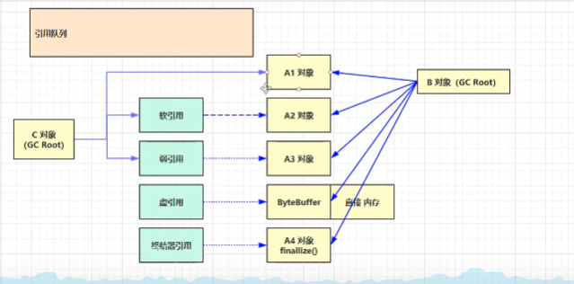

设置 Xms20m

hard方法：

其中的对象都采用强引用的方式关联上对象，就会报出OOM异常。如果在需要下载网上的一些资源很多，但是资源并不重要，就不能使用这种方式

soft方法：

中间使用软引用的方法来引用对象，在进行垃圾回收的时候堆内存不足就会回收以前的空间

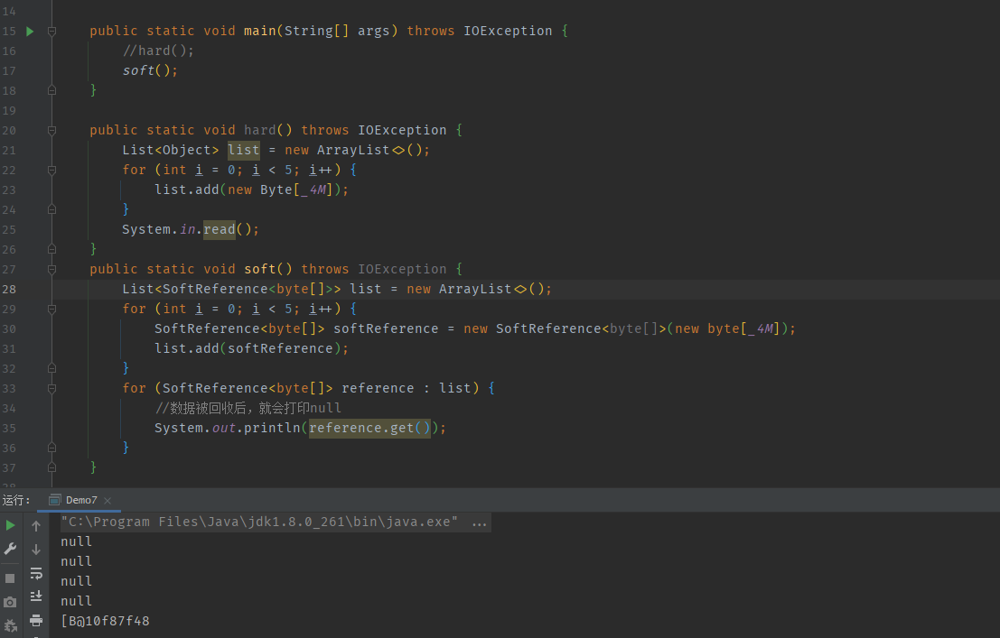

软引用也需要占用空间，所以也需要清楚掉，就需要引用队列

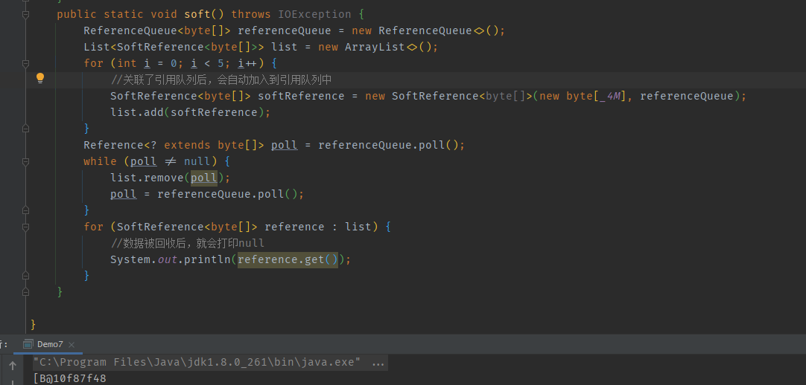

弱引用

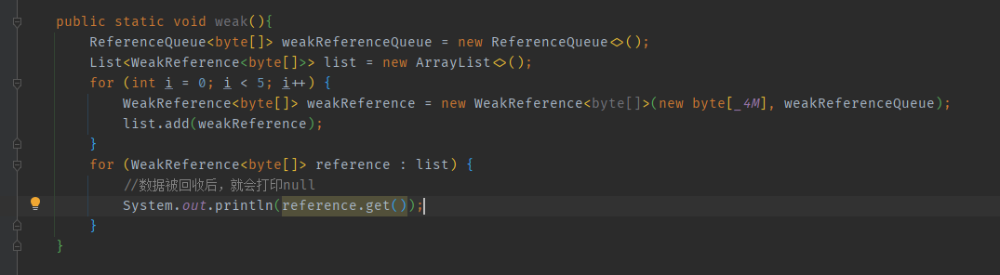

## 2. 垃圾回收算法

### 2.1 标记清除算法

- 记录内存的起始地址和结束地址，并且记录到地址列表里面
- 新对象来时，先到地址列表里面查询

优点：速度快

缺点：容易造成内存碎片，如果大对象来时，每个空闲地址都放不下，还是会抛出OOM

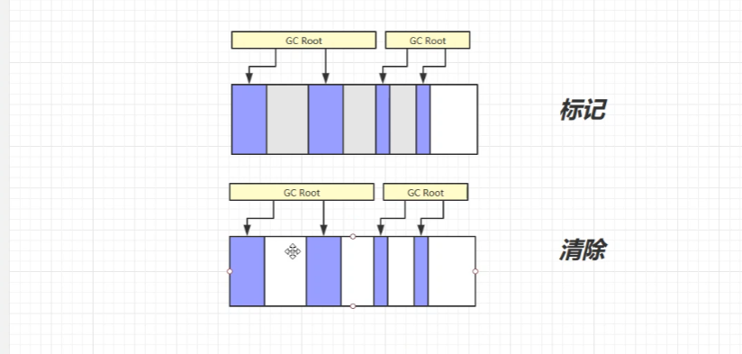

### 2.2 标记整理算法

优点：连续空间比较多

缺点：整理时，需要内存移动，还有所有对象引用地址的改变，比较耗性能

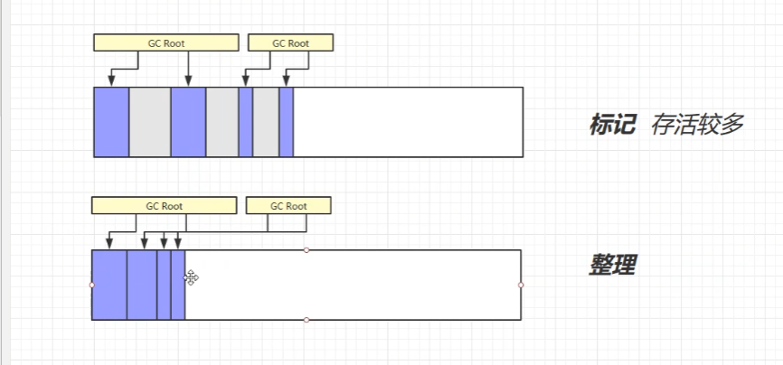

### 2.3 复制算法

划分区域 FROM和TO两个区域，标记FROM中需要回收的对象，然后全部复制到TO中，然后把TO和FROM交换

缺点：需要双倍的空间

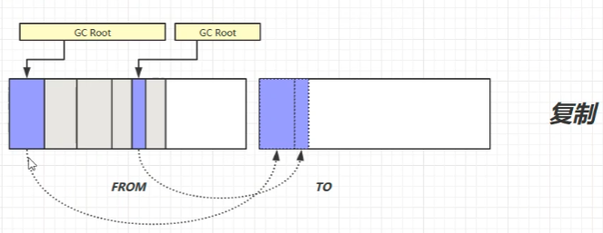

## 3. 垃圾分代（结合前面三种算法）

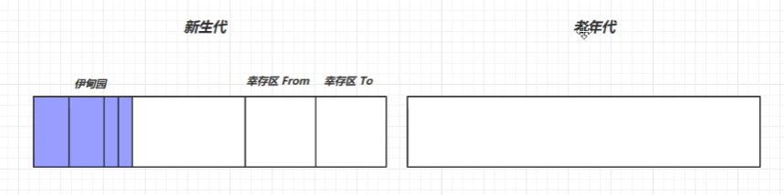

新生代：（复制算法）

- 用完就丢弃的对象
- 会触发 Minor GC：Minor GC触发后，会引发stop the world （暂停所有的用户线程，等待垃圾回收的线程执行）
- 将存活的对象复制到幸存区 To 中，对象的寿命就+1，然后将幸存区From和To进行交换。
- 当寿命超过了默认15（4 bit 就是1111，转换进制就是15）次后，就移动到了老年代中。如果新生代和老年代内存都不够了，就触发Full GC

老年代：（标记+清除 或者 标记+整理）

- 长时间存活的对象
- 大对象直接进入老年代
- 空间不足先触发Minor GC，之后还不足才会触发Full GC

### 新生代为什么采用分区的方式？

方便采用标记复制算法，使用对象复制，这样from区就会保持内存整齐，不会出现内存碎片，方便下一个对象进行存储

## 4. JVM参数

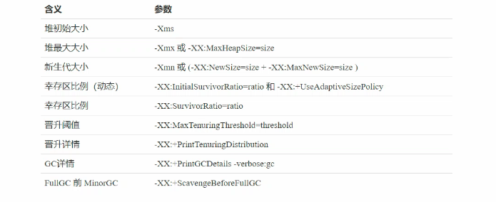

## 5. 垃圾回收器

### 5.1 串行

- 单线程
- 堆内存比较小，适合个人电脑

#### 5.1.1 参数

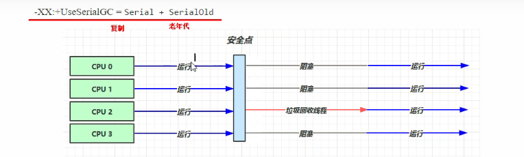

安全点：可能对象的地址被其它的线程改了，导致垃圾回收器来时找不到，就会出现问题。需要等用户线程到了安全点后，才会阻塞

### 5.2 吞吐量优先

- 多线程
- 适合堆内存较大，多核cpu支持
- 单位时间内，STW 的时间最短：总的时间来说更短

#### 5.2.1 参数

+UseAdaptiveSizePolicy：自适应的调整大小（新生代、晋升阈值、整个堆的大小）

GCTimeRatio = ratio：调整吞吐量的时间。公式： 1 / 1 + ratio  例如：ratio=99 ； 1 / 100 = 0.01。工作了100分钟，其中只有1分钟用于垃圾回收，如果达不到，就会调整堆的大小

MaxGCPauseMillis=ms：最大暂停毫秒数 跟 GCTimeRatio 冲突。

### 5.3 响应时间优先

- 多线程
- 适合堆内存较大，多核cpu支持
- 单次的STW 的时间尽可能短，每一次执行垃圾回收的时间

#### 5.3.1 参数

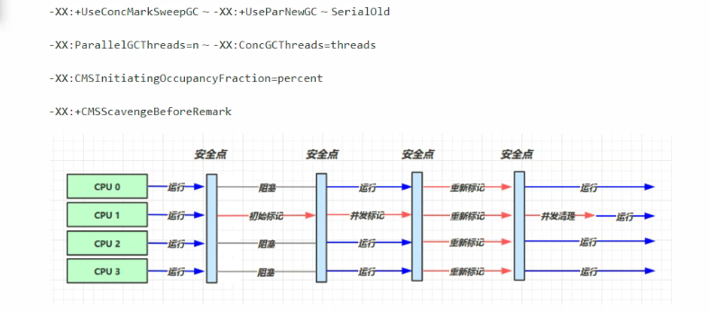

+UseConcMarkSweepGC ： 并发的标记清除算法的垃圾回收器。用户线程和垃圾回收器并发执行。只会再 初始标记、重新标记时会触发 STW

ParallelGCThreads=n：并行垃圾回收数

ConcGCThreads=threads：并发的线程数量，一般并行线程的四分之一线程数量

## 6.G1

### 6.1 特点

- 同时注重吞吐量、低延迟，默认的暂停目标是200ms
- 超大堆内存，会将堆划分为多个大小相等的Region
- 整体上是标记+整理算法，两个区域之间是复制算法

### 6.2 垃圾回收阶段

