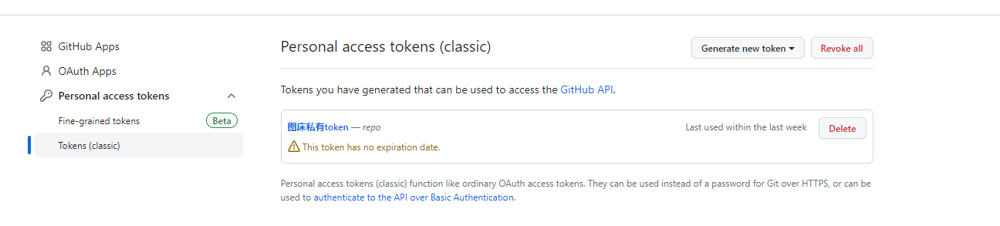
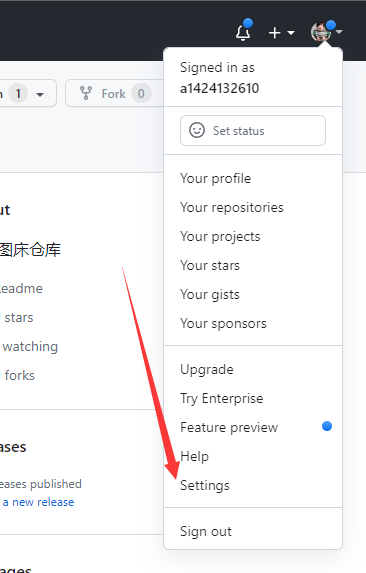
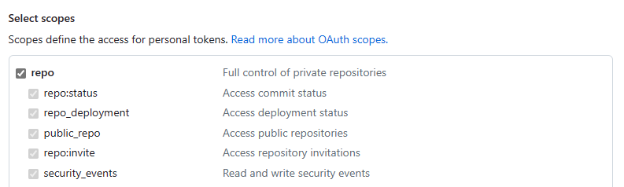
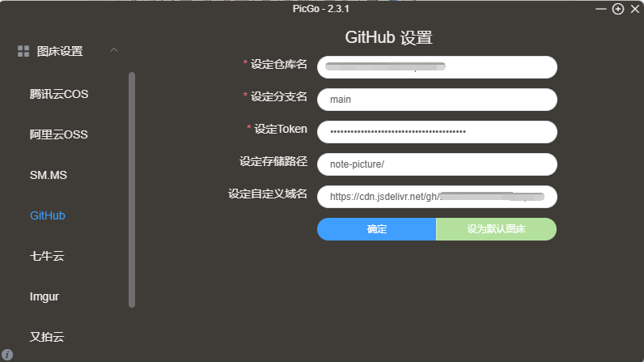
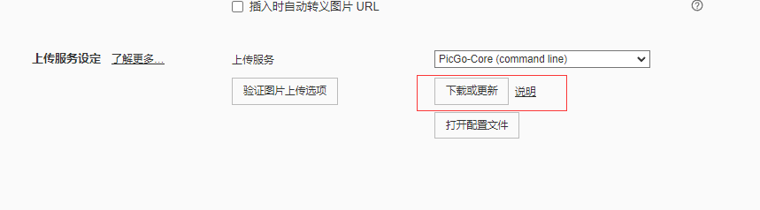
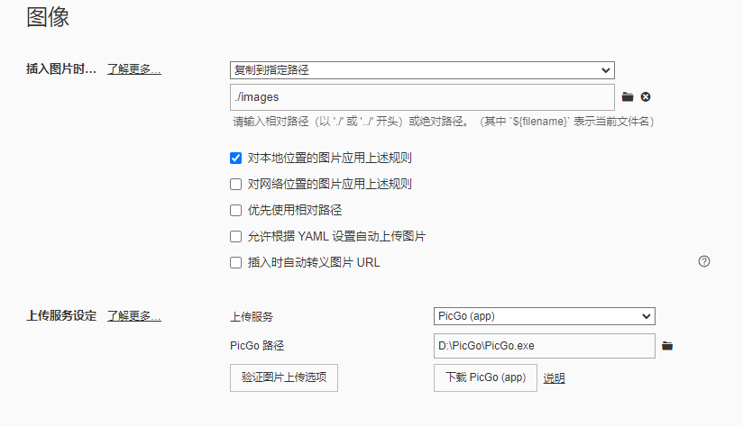
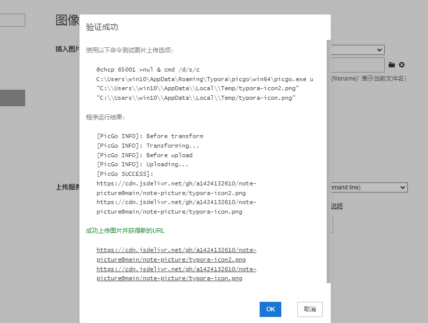

# 1. 创建Github图床

## 1.1 创建仓库

创建一个github的仓库名字叫 **note-picture** ，访问权限设置为 **public** 公共访问不然图片访问不了

## 1.2 创建私钥

打开 **settings --> Developer settings --> personal access tokens** 创建一个私有密钥，权限只需要勾选 **repo** 即可，不要设置过期时间，**只会显示一次记得记住**







# 2. 安装PicGo

到官网中下载：**https://github.com/Molunerfinn/PicGo/releases**

配置 Github 图床

- 仓库名称：用户名/仓库名称，一般是github链接后面的
- 分支：main，默认从main分支拉取
- token：上面设置的私人密钥
- 存储路径：定义好需要上传的图片路径，保存的文件夹
- 自定义域名：配置CDN加速，如果是默认的路径 **https://raw.githubusercontent.com/[username\]/[仓库名]** 获取图片会非常的慢，通过指定的CDN域名拉取就会很快，这里用jsdeliver **https://cdn.jsdelivr.net/gh/[github用户名]/[仓库名]@main**，注意这里需要 @main 代表上传到main分支，默认是master



# 3. 配置typora

## 3.1 PicGo（app）

直接使用 **PicGo（app）** 的方式需要下载软件进行安装，比较简单，但是运行一个软件会比较占用资源



## 3.2 PicGo（command）

直接下载即可，保存的路径是 **C:\Users\用户\AppData\Roaming\Typora\picgo\win64** 下载的是 **picgo.exe** 文件




编辑配置文件

> C:\Users\用户\.picgo\config.json

```json
{
  "picBed": {
    "current": "github",
    "uploader": "github",
    "github": {
      "repo": "{用户名}/{仓库名}",
      "token": "xxxxx",
      "path": "note-picture",
      "customUrl": "https://cdn.jsdelivr.net/gh/{用户名}/{仓库名}@main",
      "branch": "main"
    }
  },
  "picgoPlugins": {
    
  }
}
```

