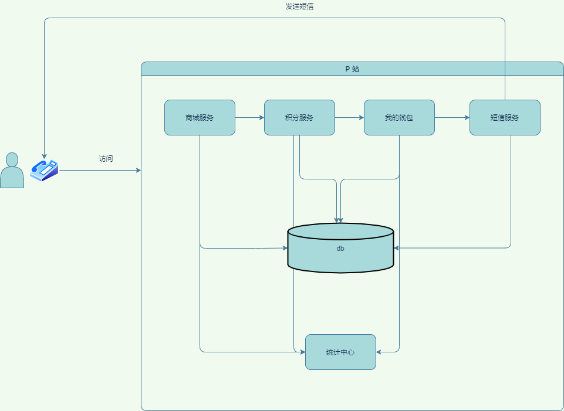
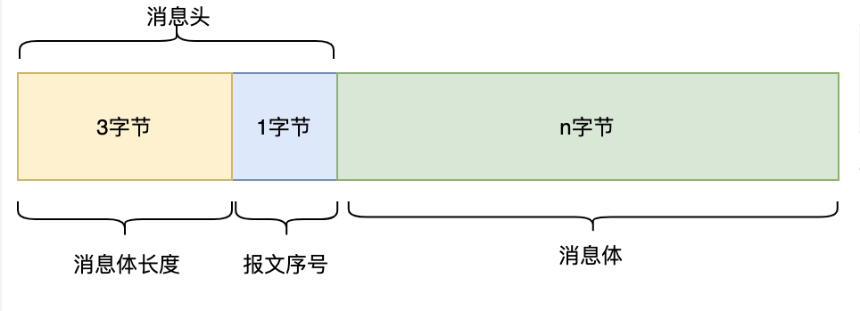
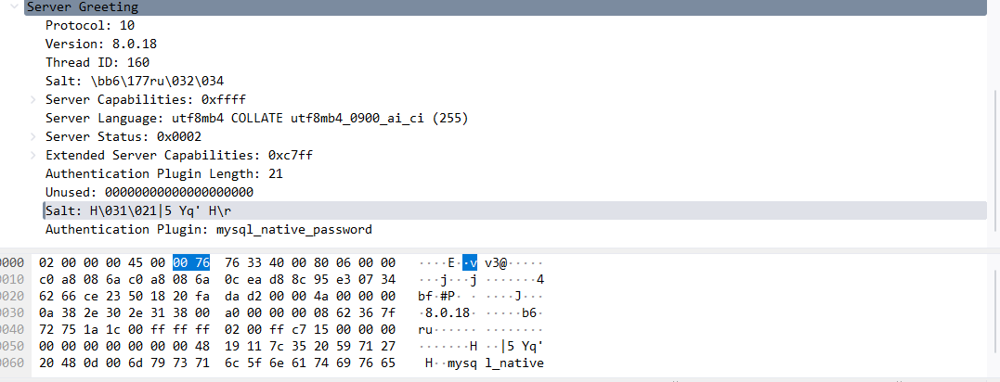
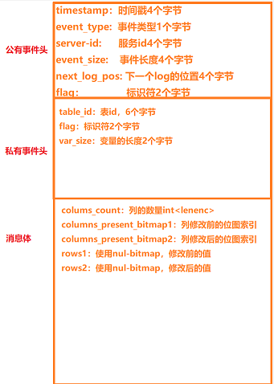
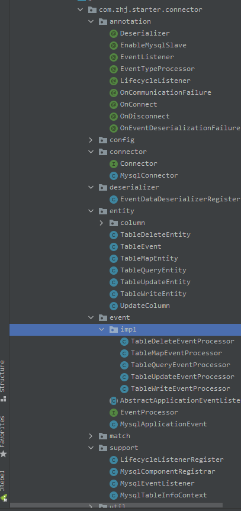

# **警告：下面内容太干了，有条件的大佬自带润滑油**

# 1. 业务场景

业务开发中经常需要根据一些数据变更实现相对应的操作。例如，用户登录P站，购买了一件商品，这时候需要去加积分，积分加完通知钱包扣款，扣款完成后通知短信服务发送短信给用户表示成功（后续的业务可能会进行用户的数据统计等等），如果这时候公司老板需要统计用户的消费信息，月度积分积累，以及用户年月日的消费情况，这时候怎么办？


# 2. 技术选型

## 2.1 业务系统

第一种方案直接通过业务系统进行调用，每个业务系统都通过接口进行调用统计中心，将自身的业务数据发送给统计服务，这种方案直接跟业务系统耦合了，而且随着产品的增长，代码量会越来越多，后续人员的维护会非常困难



## 2.2 canal

  


### 2.2.1 简介

 canal，译意为水道/管道/沟渠，主要用途是基于 **MySQL 数据库增量日志解析**，提供**增量数据订阅和消费**。 

### 2.2.2 工作原理

- canal 模拟 MySQL slave 的交互协议，伪装自己为 MySQL slave ，向 MySQL master 发送dump 协议
- MySQL master 收到 dump 请求，开始推送 binary log 给 slave (即 canal )
- canal 解析 binary log 对象(原始为 byte 流)

### 2.2.3 优点

apache顶级开源框架，功能比较完备，提供了数据转发MQ的功能，以及客户端订阅功能

### 2.2.4 弊端

canal采用的使用 **C/S** 架构，会在服务器上单独部署服务端需要进行维护，如果出现服务端宕机就会导致所有的客户端都接收不了mysql的事件，而且比较重，对于后期的维护难度会非常高

## 2.3 mysql-binlog-connector

### 2.3.1 简介

github上面提供的一个开源mysql协议slave封装库，主要用于发起slave请求 **https://github.com/osheroff/mysql-binlog-connector-java**

### 2.3.2 工作原理

- canal 模拟 MySQL slave 的交互协议，伪装自己为 MySQL slave ，向 MySQL master 发送dump 协议
- 解析对应的事件

### 2.3.3 优点

非常轻量级，java开发直接可以嵌入到自己的微服务当中

### 2.3.4 弊端

太轻了，以至于这个组件就只有封装 **slave** 请求以及最基本的事件封装，其余什么都没有做，功能都需要自己进行开发


# 3. 协议扫盲

### 3.1 什么是协议？

协议，网络协议的简称，网络协议是通信计算机双方必须共同遵从的一组约定。如怎么样建立连接、怎么样互相识别等。只有遵守这个约定，计算机之间才能相互通信交流。它的三要素是：[语法](https://baike.baidu.com/item/语法/2447258)、[语义](https://baike.baidu.com/item/语义/9716033)、[时序](https://baike.baidu.com/item/时序/4734345)。 

### 3.2 mysql协议

客户端与服务端交互协议：https://dev.mysql.com/doc/internals/en/client-server-protocol.html

#### 3.2.1 基本数据类型

在mysql协议中，会有以下三种类型用于定义协议的结构，根据对应的数据类型可以解析出对应协议的格式

- Integer Types：
  - 定长整数类型：例如：int<3> 表示3个字节长度的整型，字节存储就为 01 00 00
  - 长度编码整数类型 **int\<lenenc\>**：例如：>= 251 && < 2^16，字节格式存储为 fc+2字节整数，如果要解码长度编码需要判断第一个字节的类型；如果小于 251 只需要 1个字节的整数
- String Types：
  - 固定长度字符串 **string(fx)** ：已经知道字符串的长度
  - 0结尾的字符串 **string(NUL)**：从数据开始一直读取到 **[00]** 字节结尾
  - 可变长字符串 **string(var)** : 通过解析其它字段获取到当前字符串的长度
  - 以长度编码整数为前缀的字符串 **string(lenenc)**：首位是长度编码整数类型，用于定义字符串的长度
  - 字符串数据包是最后的组成部分 **string(EOF)** ：长度为整个数据包长度减去当前位置来计算
- Describeing Packets：数据包描述协议，用于描述协议包的类型

#### 3.2.2 mysql数据包

客户端和服务端以最大 16MByte 大小的数据包进行交换，下面是数据包头的结构：



COM_QUIT 断开连接包例子：

| 字节包         | 说明                                               |
| -------------- | -------------------------------------------------- |
| 01 00 00 00 01 | 长度：1<br />sequence_id：00<br />协议数据包：0x01 |

#### 3.2.3 响应包

- OK_Packet：标识命令执行成功的数据包

```text
数据类型   				说明
int<1>    			  包类型：[00]代表OK包、[fe]代表EOF包
int<lenenc>		      受影响的行数
int<lenenc>           最后插入的id数

下面通过if else进行判断客户端是否支持的能力

if (capabilities & CLIENT_PROTOCOL_41) {
int<2>                状态标识
int<2>				  告警计数器

} else if(capabilities & CLIENT_TRANSACTIONS) {
int<2>                状态标识

}

if status_flags & SERVER_SESSION_STATE_CHANGED {
 string<lenenc>	      会话状态改变信息
   if  状态标识 & SERVER_SESSION_STATE_CHANGED {
   		string<lenenc>  会话状态信息
   }
} else {
string<EOF>           剩余数据就是状态信息
}

```


- ERR_Packet：错误包

```text
数据类型   				说明
int<1>    			  包类型：[ff]代表错误包
int<2>				  错误码
if capabilities & CLIENT_PROTOCOL_41 {
  string[1]			  sql状态标记
  string[5]		      sql标记
}
string<EOF>           剩下所有的错误信息
```


- EOF_Packet：在MYSQL C/S 协议中，EOF和OK的作用是相同的

```text
数据类型   				说明
int<1>    			  包类型：[fe]
if capabilities & CLIENT_PROTOCOL_41 {
  int[2]			  警告数量
  int[2]		      状态标记
}
string<EOF>           剩下所有的错误信息
```


- Status Flags：https://dev.mysql.com/doc/internals/en/status-flags.html  状态值说明

### 3.3 连接生命周期

在mysql中连接生命周期有两个阶段，一个是连接阶段，一个是命令阶段

#### 3.3.1 连接阶段（Connection Phase）

##### 初始握手方式

初始握手方式在mysql中目前有两种

- 普通握手（5点几的版本使用普通握手的方式进行）
  - 服务端发送初始握手包
  - 客户端响应握手包
- SSL握手（目前mysql8以上的版本都使用的是TLS1.2进行的加密握手）
  - 服务端返回初始握手包
  - 客户端返回 SSL 连接请求包
  - SSL交换连接进行SSL连接
  - 客户端发送握手响应包

##### 连接阶段数据包

https://dev.mysql.com/doc/internals/en/connection-phase-packets.html

客户端创建连接时服务端返回的版本号是：HandshakeV10

```text
长度            说明
1              [0a] protocol version   			#协议版本号 V10
string[NUL]    server version          			#mysql服务端采用的版本号
4              connection id           			#当前连接的id
string[8]      auth-plugin-data-part-1			#加密数据
1              [00] filler						#填充物
2              capability flags (lower 2 bytes) #能力标识符低2位
  if more data in the packet:					#下面就是具体数据包数据集
1              character set					#采用的编码集
2              status flags						#状态标识符
2              capability flags (upper 2 bytes) #扩展服务端能力
if capabilities & CLIENT_PLUGIN_AUTH {
1              length of auth-plugin-data       #验证插件的长度
} else {
1              [00]
}
string[10]     reserved (all [00])              #保留位全部是 [00]
 if capabilities & CLIENT_SECURE_CONNECTION {
string[$len]   auth-plugin-data-part-2 ($len=MAX(13, length of auth-plugin-data - 8))
  
  if capabilities & CLIENT_PLUGIN_AUTH {
string[NUL]    auth-plugin name					#验证插件的名称插件名称
  }


```

注意点：capability flags整个由4个字节组成，上面包中将能力标识分成高低位进行传输，下面是详细的客户端能力标识位，协议中涉及到的标识位

- CLIENT_PLUGIN_AUTH：0x80000
- CLIENT_SECURE_CONNECTION：0x8000

https://dev.mysql.com/doc/internals/en/capability-flags.html#packet-Protocol::CapabilityFlags

下面是创建mysql连接时，服务端返回的初始数据包



##### SSLRequest

上面在采用初始握手之后，如果采用SSL进行连接，客户端需要按照下面的包进行返回，目的是将普通的握手升级为SSL

```text
4              capability flags, CLIENT_SSL always set
4              max-packet size
1              character set
string[23]     reserved (all [0])
```

上面包的目的是将普通连接，升级为SSL连接，下面的包需要在上面发送之后再发送认证包

```text
4              capability flags
4              max-packet size
1              character set
string[23]     reserved (all [0])
string<NUL>    username用户名设置后的0结尾
string<lenenc> password通过对应的插件加密密码
string<NUL>    schema数据库名称，如果不为空的话(数据库为空，可以不写这个值)
string<NUL>    plugin name 插件名称
```


能力标识：

- CLIENT_SSL：0x0800

##### 握手返回数据包

在mysql中为了兼容新老协议的客户端握手响应，使用了两种协议进行区分

- HandshakeResponse41

```text
长度				说明
4              capability flags, CLIENT_PROTOCOL_41 always set  #客户端 的能力标识
4              max-packet size                                  #包最大的长度
1              character set                                    #编码方式
string[23]     reserved (all [0])                               #填充符
string[NUL]    username                                         #用户名称以0结尾

  if capabilities & CLIENT_PLUGIN_AUTH_LENENC_CLIENT_DATA {     #根据客户端能力进行写入
lenenc-int     length of auth-response                          
string[n]      auth-response
  } else if capabilities & CLIENT_SECURE_CONNECTION {
1              length of auth-response                          #数据长度
string[n]      auth-response								    #数据值
  } else {
string[NUL]    auth-response
  }
  
  if capabilities & CLIENT_CONNECT_WITH_DB {                    #是否直接连接数据库
string[NUL]    database											#数据库名称
  }
  if capabilities & CLIENT_PLUGIN_AUTH {
string[NUL]    auth plugin name                                 #插件名称
  }
  if capabilities & CLIENT_CONNECT_ATTRS {                      #写入扩展字段
lenenc-int     length of all key-values                         #key和values的长度
lenenc-str     key
lenenc-str     value
   if-more data in 'length of all key-values', more keys and value pairs
  }
```


- HandshakeResponse320

```text
长度				说明
2              capability flags, CLIENT_PROTOCOL_41 never set   #客户端 的能力标识
3              max-packet size									#包最大的长度
string[NUL]    username
  if capabilities & CLIENT_CONNECT_WITH_DB {
string[NUL]    auth-response                                    #数据
string[NUL]    database											#数据库名称
  } else {
string[EOF]    auth-response                                    #数据
  }
```


#### 3.3.2 命令阶段（Command Phase）

在命令阶段客户端需要发送一个，序列号为 **[00]** 用来标识开启了命令阶段，例如：

```text
13 00 00 00 03 53 ...
01 00 00 00 01
            ^^- command-byte (命令类型)
         ^^---- sequence-id == 0  （序列号）
```

### 3.4 常用协议

在mysql协议中一共分为20种子协议进行区分以下列举部分例子：

#### 3.4.1 COM_QUIT

##### 请求包

断开连接命令

```text
1              [01] COM_QUIT

例如：01 00 00 00 01   #三个字节的长度，1个字节的序列号，01就代表类型
```

##### 响应包

OK_Packet

#### 3.4.2 COM_QUERY

##### 请求包

```text
1              [03] 协议类型
string[EOF]    执行的sql语句
```

##### 响应包

响应包分为4种类型：

- ERR_Packet
- OK_Packet
- LOCAL_INFILE_Reuqest
- Resultset

  

当发起一个查询请求时，会先返回一个 **int<lenenc\>** 类型的整数，表示结果集的数量

```text
  payload
    lenenc-int     number of columns in the resultset
```

- 如果返回的数据为 0：说明这是一个 OK_Packet 包

- 如果不是一个有效的 int<lenenc\> 类型的数据：说明时一个 ERR_Packet 或者是 INFILE 类型的包

 **Resultset**：结果集由一个定义列数的数据包开始，然后就是一个同样数量的列定义数据包，以一个 EOF 包进行分割（如果客户端没有设置 **CLIENT_DEPRECATE_EOF** 则为数据包）

- 包含一个 LengthEncodeInteger 数据包：用来表示列数
- ColumnDefinition数据包：列定义数据包
- 根据客户端设置：CLIENT_DEPRECATE_EOF 表示，包含一个 EOF_Packet 包
- 一个或者多个 ResultsetRow，真正存数据的数据包，每列的数据
  - 如果为空发送 0xfb
  - 其他的所有内容通过 string<lenenc\> 进行数据的编码

- ERR_Packet或者 EOF_Packet 进行结尾

**Java示例**：上面进行读取时可以通过 **EOF_Packet** 进行分割读取

```java
private ResultSetRowPacket[] readResult(PacketChannel channel) throws IOException {
    //先读取出列数的数据包，可以不使用，channel.read();读取整个数据包
    byte[] statementResults = channel.read();
    //跳过不是 0xFE 的包，如果是 0xFE数据分割，这里跳过的是列定义的数据包
    while (channel.read()[0] != (byte) 0xFE) { }
    List<ResultSetRowPacket> resultSet = new LinkedList();
    byte[] bytes;
    //读取 ResultSetRow 的数据包，如果读取到 0xFE或者0xFF 就退出
    while ((bytes = channel.read())[0] != (byte) 0xFE) {
        //需要验证是否是0xFF包，错误包
        resultSet.add(new ResultSetRowPacket(bytes));
    }
    return resultSet.toArray(new ResultSetRowPacket[0]);
}
```

#### 3.4.3 COM_REGISTER_SLAVE

注册从服务协议

##### 请求包

```text
1              [15] 协议id
4              服务id，不能重复
1              从协议的ip地址长度
string[$len]   ip地址
1              用户名长度
string[$len]   从服务用户名
1              密码长度
string[$len]   从服务密码
2              从服务mysql端口
4              可以忽略，副本的排名
4              主mysql的id，通常为o
```

##### 响应包

OK_Pakcet 或者 ERR_Packet

#### 3.4.4 COM_BINLOG_DUMP

binlog监听协议：

- 在使用此协议时，8.0之前需要先注册slave用于进行监听
- 在8.0之后的版本，通过当前协议的标识符，可以直接开启一个网络流，就不需要再注册slave了

##### 请求包

```text
1              [12] 协议id
4              binlog的写位置
2              标识符，在8.0之后可以写入 0x01,表示不阻塞
4              服务id
string[EOF]    binlog文件名称
```

##### 响应包

- 一个 binlog 的网络流
- ERR_Packet
- 或者设置表示符为0x01后，返回的EOF_Packet

#### 3.4.5 COM_BINLOG_DUMP_GTID

在mysql5.6版本开始的新特性，保证事务id在集群中的唯一性用于故障回复以及容错能力，需要在mysql配置中开启，可以在mysql中通过 **select @@gtid_mode;**  查询是否开启

##### 请求包

```text
1              [1e] 协议类型
2              标识符，有三个 0x01、0x02、0x04
4              服务id
4              binlog名称长度
string[len]    binlog文件名称
8              binlog写入的位置
  if flags & BINLOG_THROUGH_GTID {
4              数据长度
string[len]    数据
  }
```


### 3.5 Binlog Event

#### 3.5.1 头部协议

```text
4              时间戳
1              事件类型：https://dev.mysql.com/doc/internals/en/binlog-event-type.html
4              服务id
4              事件数据长度
   if binlog-version > 1:
4              下一个事件的位置
2              binlog的标识符：https://dev.mysql.com/doc/internals/en/binlog-event-flag.html
```

#### 3.5.2 事件类型

二进制协议将 NULL 值作为位图进行发送，而不是像前面 ResultsetRow 发送完整字节（查询），如果发送的数据 NULL值比较多，使用 null-bitmap发送更加节省空间




  

##### QUERY_TYPE_EVENT

```text
4              线程id
4              执行的事件
1              数据库名称的长度
2              错误码
  if binlog-version ≥ 4:
2              状态变量长度

string[$len]   状态值变量
string[$len]   数据库名称，通过上面的数据库名称长度决定
1              [00]
string[EOF]    剩下所有的数据为查询语句
```

##### TABLE_MAP_EVENT

在进行表写入或者修改时，会发送当前时间用于通知当前表的字段结构以及类型

```text
post-header:
  6              table_id                            #表id
  2              flags

payload:
  1              schema name length                  #数据库名称的长度
  string         schema name                         #数据库名称
  1              [00]
  1              table name length                   #表名长度
  string         table name                          #表名
  1              [00]
  lenenc-int     column-count                        #列的数量
  string.var_len [length=$column-count] column-def   #列定义的数组，每个字段类型一个字节
  lenenc-str     column-meta-def                     #元信息数组，长度是元信息数组的总长度，每个元信息的长度取决于列字段的类型
  n              NULL-bitmask, length: (column-count + 8) / 7 #位图掩码，包含每一列的位图
```

#####  ROWS_EVENT

- UPDATE_ROWS_EVENT：修改事件
- WRITE_ROWS_EVENT：写事件
- DELETE_ROWS_EVENT：删除事件

以上三个事件，在mysql5.6.x以后的版本使用v2的版本，5.1.15到5.6.x使用v1版本，5.1.10到5.1.15使用v0版本，

这里我使用的是8.0.18以后的版本使用的是v1版本进行解析；

**说明**： 在mysql每次进行表数据修改时，都会发布一个 **TABLE_MAP_EVENT** 时间用于通知当前表的结构，其中包含每个字段的类型

```text
header:
6  				     table_id               #6个字节为表id

2                    flags   				#标识符
  if version == 2 {                 		#版本号
2                    extra-data-length		#额外数据的长度
string.var_len       extra-data
  }

body:
lenenc_int           number of columns      #列的数量
string.var_len       columns-present-bitmap1, length: (num of columns+7)/8  #根据列的长度加上7然后除以8获取到列的长度

  if UPDATE_ROWS_EVENTv1 or v2 {
string.var_len       columns-present-bitmap2, length: (num of columns+7)/8
  }

rows:
string.var_len       nul-bitmap, length (bits set in 'columns-present-bitmap1'+7)/8 #返回可能为null的位图（如果是修改，这个字段是修改前的数据）
string.var_len       value的类型值定义在table-map事件中
  if UPDATE_ROWS_EVENTv1 or v2 {
string.var_len       nul-bitmap, length (bits set in 'columns-present-bitmap2'+7)/8  #这个值是修改后的数据索引（标识哪个字段是为null）
string.var_len       value的类型值定义在table-map事件中
  }

```

在 ROW_EVENT事件中，mysql对null的值的发送采用的是 null-bitmap 进行发送数据，相对于全值发送更加的节省空间，下面是计算的方式

>  NULL-bitmap-byte = ((field-pos + offset) / 8)  #计算字节位
>
> NULL-bitmap-bit  = ((field-pos + offset) % 8)   #计算位的位

```text
Resultset Row, 9 fields, 9th field is a NULL (9th field -> field-index == 8, offset == 2)

nulls -> [00] [00]

byte_pos = (10 / 8) = 1
bit_pos  = (10 % 8) = 2 #一个字节8位，通过字段跟8进行取莫，可以分布在 0 - 7之间

nulls[byte_pos] |= 1 << bit_pos
nulls[1] |= 1 << 2;  #通过左移异取值

nulls -> [00] [04]
```

取值的算法：

```java
public void test_bitmap() {
    Integer[] values = {1,2,3,null}; //设置初始索引数据值
    byte[] bytes = new byte[(values.length + 7) >> 3];
    for (int i = 0; i < values.length; i++) {
        if (values[i] != null) { //通过算法设置对应位的数据
            bytes[(i + 2) >> 3] |= (1 << ((i + 2) % 8));
        }
    }
    //通过BitSet获取到对应索引数据
    BitSet set = new BitSet();
    for (int i = 0; i < values.length; i++) {
        if ((bytes[(i + 2) >> 3] & (1 << ((i + 2) % 8))) != 0) {
            set.set(i);
        }
    }
    System.out.println(set.toString());
}
```

### 3.6 代码实战

下面是根据 **mysql-binlog-connector** 进行的一个简单的通过握手然后监听 **binlog** 的流程实战

#### 3.6.1 connector

- 开启Socket连接mysql，获取到 mysql server端的响应
- 解析mysql initial packet
- 通过SSL发送请求，将socket升级为 TLS 请求
- 根据返回的加密插件，通过插件对密码进行加密后进行发送
- 判断是否登录成功
- 通过 **show master status** 查询当前 mysql server的 **binlog** 状态
- 查询 **binlog_checksum** 通过4个额外字节做校检应用
- 查询服务id
- 发送 binlog dump的消息
- 监听binlog网络流

```java
public void test_connector() throws IOException {
        Socket socket = new Socket();
        socket.connect(new InetSocketAddress("localhost", 3306));
        //对包连接进行封装一层，初始化连接时，服务端会返回初始的握手包
        PacketChannel channel = new PacketChannel(socket);

        //读取首次发送请求返回的数据信息
        byte[] initialHandshakePacket = channel.read();
        GreetingPacket greetingPacket = new GreetingPacket(initialHandshakePacket);
        System.out.println(greetingPacket);

        SSLRequestCommand sslRequestCommand = new SSLRequestCommand();
        //通过将mysql返回的服务端的支持的各种能力参数设置到 ssl请求的实体中，再调用 toByteArray 会进行计算，详细参数可以查看mysql文档
        sslRequestCommand.setCollation(greetingPacket.getServerCollation());
        //发送ssl请求的参数
        channel.write(sslRequestCommand);
        //将管道连接升级为 SSL进行连接
        channel.upgradeToSSL(SocketFactory.SSL_SOCKET_FACTORY);

        //进行密码的发送，服务端返回的加密插件进行加密
        Command authenticateCommand;
        authenticateCommand = getAuthenticateCommand(greetingPacket);
        channel.write(authenticateCommand);
        //读取响应体
        byte[] authenticationResult = channel.read();
        //判断第1个包是否为0x00
        switch (authenticationResult[0]) {
            case (byte) 0x00:
                // success
                break;
            case (byte) 0xFF:
                // error
                byte[] bytes = Arrays.copyOfRange(authenticationResult, 1, authenticationResult.length);
                ErrorPacket errorPacket = new ErrorPacket(bytes);
                throw new AuthenticationException(errorPacket.getErrorMessage(), errorPacket.getErrorCode(),
                                                  errorPacket.getSqlState());
            case (byte) 0xFE:
                break;
        }
        //验证完成，需要将 packetNumber 置为0开始新一轮的登录
        channel.authenticationComplete();
        //拉取binlog文件，获取到binlog的名称以及position
        channel.write(new QueryCommand("show master status"));
        ResultSetRowPacket[] resultSetRowPackets = readResult(channel);
        ResultSetRowPacket resultSetRow = resultSetRowPackets[0];
        String binlogFilename = resultSetRow.getValue(0);
        long binlogPosition = Long.parseLong(resultSetRow.getValue(1));
        System.out.println("binlog文件名：" + binlogFilename + "binlog位置信息：" + binlogPosition);

        //查询到 binlog_checksum
        channel.write(new QueryCommand("show global variables like 'binlog_checksum'"));
        ResultSetRowPacket[] rowPackets = readResult(channel);
        String upperCase = rowPackets[0].getValue(1).toUpperCase();
        if ("CRC32".equals(upperCase)) {
            channel.write(new QueryCommand("set @master_binlog_checksum= @@global.binlog_checksum"));
            byte[] statementResult = channel.read();
        }
        //设置服务的id
        channel.write(new QueryCommand("select @@server_id"));
        ResultSetRowPacket[] readResult = readResult(channel);
        long serverId = Long.parseLong(readResult[0].getValue(0));

        //发起 binlog的请求
        DumpBinaryLogCommand command = new DumpBinaryLogCommand(serverId, binlogFilename, binlogPosition);
        channel.write(command);

        //获取到对应的输入流进行读取 binlog 的二进制日志流
        ByteArrayInputStream inputStream = channel.getInputStream();
        try {
            while (inputStream.peek() != -1) {
                //读取包的长度
                int packetLength = inputStream.readInteger(3);
                //跳过sequence_id
                inputStream.skip(1L);
                int marker = inputStream.read();
                //兼容数据包是否大于16m
                ByteArrayInputStream byteArrayInputStream = packetLength == 16777215 ?
                                                            new ByteArrayInputStream(readPacketSplitInChunks(inputStream, packetLength))
                                                                                     : inputStream;
                EventHeader header = new EventHeader();
                header.setTimestamp(byteArrayInputStream.readLong(4) * 1000L);
                header.setEventType(byteArrayInputStream.readInteger(1));
                header.setServerId(byteArrayInputStream.readLong(4));
                header.setEventLength(byteArrayInputStream.readLong(4));
                header.setNextPosition(byteArrayInputStream.readLong(4));
                header.setFlags(byteArrayInputStream.readInteger(2));
            }
        } catch (Exception v) {
            System.out.println(v.getMessage());
        }
    }
```

#### 3.6.2 channel

只是将 **socket** 进行封装，并且封装了ssl升级的方法以及写入和读取的操作

```java
public class PacketChannel implements Channel {
    //发送包数
    private int packetNumber;
    //是否验证完成
    private boolean authenticationComplete;
    //是否是ssl
    private boolean isSSL;
    //套接字
    private Socket socket;
    //输入流
    private ByteArrayInputStream inputStream;
    //输出流
    private ByteArrayOutputStream outputStream;

    public PacketChannel(String hostname, int port) throws IOException {
        this(new Socket(hostname, port));
    }

    public PacketChannel(Socket socket) throws IOException {
        this.packetNumber = 0;
        this.isSSL = false;
        this.socket = socket;
        this.inputStream = new ByteArrayInputStream(new BufferedSocketInputStream(socket.getInputStream()));
        this.outputStream = new ByteArrayOutputStream(socket.getOutputStream());
    }

    public ByteArrayInputStream getInputStream() {
        return this.inputStream;
    }

    public ByteArrayOutputStream getOutputStream() {
        return this.outputStream;
    }

    public void authenticationComplete() {
        this.authenticationComplete = true;
    }

    public byte[] read() throws IOException {
        //通过读取头部的3个字节确定包的长度，一次性读一个整包
        int length = this.inputStream.readInteger(3);
        int sequence = this.inputStream.read();
        if (sequence != this.packetNumber++) {
            throw new IOException("unexpected sequence #" + sequence);
        } else {
            return this.inputStream.read(length);
        }
    }

    public void write(Command command) throws IOException {
        //发送协议数据
        byte[] body = command.toByteArray();
        ByteArrayOutputStream buffer = new ByteArrayOutputStream();
        //先写包的长度
        buffer.writeInteger(body.length, 3);
        if (this.authenticationComplete) {
            this.packetNumber = 0;
        }
        //写入序列id
        buffer.writeInteger(this.packetNumber++, 1);
        //写入消息
        buffer.write(body, 0, body.length);
        this.outputStream.write(buffer.toByteArray());
        this.outputStream.flush();
    }

    public void upgradeToSSL(SSLSocketFactory sslSocketFactory) throws IOException {
        //通过 SSL工厂，将当前socket套接字升级为 SSL
        SSLSocket sslSocket = sslSocketFactory.createSocket(this.socket);
        sslSocket.startHandshake();
        this.socket = sslSocket;
        //替换原有的输入输出流
        this.inputStream = new ByteArrayInputStream(sslSocket.getInputStream());
        this.outputStream = new ByteArrayOutputStream(sslSocket.getOutputStream());
        this.isSSL = true;
    }

    public boolean isSSL() {
        return this.isSSL;
    }

    public boolean isOpen() {
        return !this.socket.isClosed();
    }

    public void close() throws IOException {
        try {
            this.socket.shutdownInput();
        } catch (Exception var3) {
        }

        try {
            this.socket.shutdownOutput();
        } catch (Exception var2) {
        }

        this.socket.close();
    }
}
```

#### 3.6.3 握手包

##### Command

封装协议消息体顶级接口

```java
public interface Command {
    byte[] toByteArray() throws IOException;
}
```

##### GreetingPacket

用户读取初始连接mysql服务端后返回的数据包

```java
public class GreetingPacket {
    private int protocolVersion;
    private String serverVersion;
    private long threadId;
    private String scramble;
    private int serverCapabilities;
    private int serverCollation;
    private int serverStatus;
    private int pluginDataLength;
    private String pluginProvidedData;

    public GreetingPacket(byte[] bytes) throws IOException {
        ByteArrayInputStream buffer = new ByteArrayInputStream(bytes);
        //读取协议号，是否采用的 HandshakeV10
        this.protocolVersion = buffer.readInteger(1);
        //读取服务端的版本号，是否以 [00] 结尾
        this.serverVersion = buffer.readZeroTerminatedString();
        //读取4个字节的连接id
        this.threadId = buffer.readLong(4);
        //插件加密数据第一部分，一直读取到 [00]
        String scramblePrefix = buffer.readZeroTerminatedString();
        //服务端能力标识
        this.serverCapabilities = buffer.readInteger(2);
        //服务端采用的编码集
        this.serverCollation = buffer.readInteger(1);
        //服务器状态
        this.serverStatus = buffer.readInteger(2);
        int extendServerCapabilities = buffer.readInteger(2);
        boolean match = (extendServerCapabilities & 0x08) >> 3 == 1;
        if (match) {
            //插件的长度
            this.pluginDataLength = buffer.readInteger(1);
        }
        buffer.skip(10L);
        //读取到加密字符
        if ((this.serverCapabilities & 0x8000) >> 15 == 1) {
            //判断是加密插件的数据是否超过了 13，如果超过了13就直接返回13，减1的目的是去掉后面 [00] 分隔符，因为插件长度只有12个字节
            byte[] bytes1 = buffer.read(Integer.max(13, this.pluginDataLength - 8) - 1);
            String s = new String(bytes1);
            this.scramble = scramblePrefix + s;
            buffer.skip(1L);
        }
        if (match) {
            //插件名称
            this.pluginProvidedData = buffer.readZeroTerminatedString();
        }
    }

    public String toString() {
        return String.format("服务端返回协议版本:[%s]\n" +
                      "Mysql版本号:[%s]\n" +
                      "连接Id:[%d]\n" +
                      "服务端能力标识:[%d]\n" +
                      "编码集Id:[%d]\n" +
                      "服务端状态:[%d]\n" +
                      "Scramble:[%s]\n" +
                      "采用的插件:[%s]",
                      this.protocolVersion,
                      this.serverVersion,
                      this.threadId,
                      this.serverCapabilities,
                      this.serverCollation,
                      this.serverStatus,
                      this.scramble,
                      this.pluginProvidedData);
    }
}
```

##### SSLRequestCommand

升级SSL请求协议实体

```java
public class SSLRequestCommand implements Command {
    private int clientCapabilities;
    private int collation;

    public SSLRequestCommand() {
    }

    public void setClientCapabilities(int clientCapabilities) {
        this.clientCapabilities = clientCapabilities;
    }

    public void setCollation(int collation) {
        this.collation = collation;
    }

    public byte[] toByteArray() throws IOException {
        ByteArrayOutputStream buffer = new ByteArrayOutputStream();
        int clientCapabilities = this.clientCapabilities;
        if (clientCapabilities == 0) {
            /**
             * 采用插件的方式进行连接、
             * 使用CLIENT_PROTOCOL_41协议
             * 支持本地插件的验证方式
             * 期望更长的标志
             */
            //翻译成二进制位 10001000001000000100
            clientCapabilities = 557572;
        }
        //采用SSLRequest方式进行连接
        clientCapabilities |= 2048;
        //写入4个字节
        buffer.writeInteger(clientCapabilities, 4);
        buffer.writeInteger(0, 4);
        //客户端的字符集，根据服务端的返回进行选择
        buffer.writeInteger(this.collation, 1);

        //写入23个填充符
        for(int i = 0; i < 23; ++i) {
            buffer.write(0);
        }

        return buffer.toByteArray();
    }
}
```

##### QueryCommand

查询协议封装实体

```java
public class QueryCommand implements Command {
    private String sql;

    public QueryCommand(String sql) {
        this.sql = sql;
    }

    public byte[] toByteArray() throws IOException {
        ByteArrayOutputStream buffer = new ByteArrayOutputStream();
        buffer.writeInteger(3, 1);
        buffer.writeString(this.sql);
        return buffer.toByteArray();
    }
}
```

##### DumpBinaryLogCommand

开启 binlog 网络流协议实体

```java
public class DumpBinaryLogCommand implements Command {
    private long serverId;
    private String binlogFilename;
    private long binlogPosition;

    public DumpBinaryLogCommand(long serverId, String binlogFilename, long binlogPosition) {
        this.serverId = serverId;
        this.binlogFilename = binlogFilename;
        this.binlogPosition = binlogPosition;
    }

    public byte[] toByteArray() throws IOException {
        ByteArrayOutputStream buffer = new ByteArrayOutputStream();
        buffer.writeInteger(18, 1);
        buffer.writeLong(this.binlogPosition, 4);
        buffer.writeInteger(0, 2);
        buffer.writeLong(this.serverId, 4);
        buffer.writeString(this.binlogFilename);
        return buffer.toByteArray();
    }
}
```

#### 3.6.4 ResultSetRowPacket

用于读取 ResultSetRow 类型的协议包

```java
public class ResultSetRowPacket {
    private String[] values;

    public ResultSetRowPacket(byte[] bytes) throws IOException {
        ByteArrayInputStream buffer = new ByteArrayInputStream(bytes);
        LinkedList values = new LinkedList();

        while(buffer.available() > 0) {
            values.add(buffer.readLengthEncodedString());
        }

        this.values = (String[])values.toArray(new String[values.size()]);
    }

    public String[] getValues() {
        return this.values;
    }

    public String getValue(int index) {
        return this.values[index];
    }

    public int size() {
        return this.values.length;
    }
}
```


#### 3.6.5 SSLSocketFactory

ssl工厂接口

```java
public interface SSLSocketFactory {
    SSLSocket createSocket(Socket var1) throws SocketException;
}
```

#### 3.6.6 SocketFactory

用于创建 ssl 工厂类

```java
public class SocketFactory {

    public static final SSLSocketFactory SSL_SOCKET_FACTORY = new DefaultSSLSocketFactory() {
        protected void initSSLContext(SSLContext sc) throws GeneralSecurityException {
            sc.init((KeyManager[])null, new TrustManager[]{new X509TrustManager() {
                public void checkClientTrusted(X509Certificate[] x509Certificates, String s) throws CertificateException {
                }

                public void checkServerTrusted(X509Certificate[] x509Certificates, String s) throws CertificateException {
                }

                public X509Certificate[] getAcceptedIssuers() {
                    return new X509Certificate[0];
                }
            }}, (SecureRandom)null);
        }
    };

    public static Socket createSocket() {
        return new Socket();
    }

    public static SSLSocket createSslSocket(Socket socket) throws SocketException {
        return SSL_SOCKET_FACTORY.createSocket(socket);
    }


    /**
     * 实现了 SSLSocketFactory
     */
    public static class DefaultSSLSocketFactory implements SSLSocketFactory {
        private final String protocol;

        public DefaultSSLSocketFactory() {
            //设置使用 TLSv1 的版本进行连接
            this("TLSv1");
        }

        public DefaultSSLSocketFactory(String protocol) {
            this.protocol = protocol;
        }

        public SSLSocket createSocket(Socket socket) throws SocketException {
            SSLContext sc;
            try {
                sc = SSLContext.getInstance(this.protocol);
                this.initSSLContext(sc);
            } catch (GeneralSecurityException var5) {
                throw new SocketException(var5.getMessage());
            }

            try {
                return (SSLSocket)sc.getSocketFactory().createSocket(socket, socket.getInetAddress().getHostAddress(), socket.getPort(), true);
            } catch (IOException var4) {
                throw new SocketException(var4.getMessage());
            }
        }

        protected void initSSLContext(SSLContext sc) throws GeneralSecurityException {
            sc.init((KeyManager[])null, (TrustManager[])null, (SecureRandom)null);
        }
    }

}
```

#### 3.6.7 加密插件类

##### AuthenticateSecurityPasswordCommand

```java
public class AuthenticateSecurityPasswordCommand implements Command {
    //数据库
    private String schema;
    //用户名
    private String username;
    //密码
    private String password;
    //加密字符串
    private String salt;
    //客户端能力标识符
    private int clientCapabilities;
    //采用的字符集
    private int collation;

    public AuthenticateSecurityPasswordCommand(String schema, String username, String password, String salt, int collation) {
        this.schema = schema;
        this.username = username;
        this.password = password;
        this.salt = salt;
        this.collation = collation;
    }

    public void setClientCapabilities(int clientCapabilities) {
        this.clientCapabilities = clientCapabilities;
    }

    public void setCollation(int collation) {
        this.collation = collation;
    }

    @Override
    public byte[] toByteArray() throws IOException {
        ByteArrayOutputStream buffer = new ByteArrayOutputStream();
        int clientCapabilities = this.clientCapabilities;
        if (clientCapabilities == 0) {
            clientCapabilities = ClientCapabilities.LONG_FLAG |
                                 ClientCapabilities.PROTOCOL_41 |
                                 ClientCapabilities.SECURE_CONNECTION |
                                 ClientCapabilities.PLUGIN_AUTH;

            if (schema != null) {
                clientCapabilities |= ClientCapabilities.CONNECT_WITH_DB;
            }
        }
        buffer.writeInteger(clientCapabilities, 4);
        buffer.writeInteger(0, 4); // maximum packet length
        buffer.writeInteger(collation, 1);
        for (int i = 0; i < 23; i++) {
            buffer.write(0);
        }
        buffer.writeZeroTerminatedString(username);
        byte[] passwordSHA1 = passwordCompatibleWithMySQL411(password, salt);
        buffer.writeInteger(passwordSHA1.length, 1);
        buffer.write(passwordSHA1);
        if (schema != null) {
            buffer.writeZeroTerminatedString(schema);
        }
        buffer.writeZeroTerminatedString("mysql_native_password");
        return buffer.toByteArray();
    }

    /**
     * see mysql/sql/password.c scramble(...)
	 * @param password the password
	 * @param salt salt received from server
	 * @return hashed password
     */
    public static byte[] passwordCompatibleWithMySQL411(String password, String salt) {
        if ("".equals(password) || password == null) {
            return new byte[0];
        }

        MessageDigest sha;
        try {
            sha = MessageDigest.getInstance("SHA-1");
        } catch (NoSuchAlgorithmException e) {
            throw new RuntimeException(e);
        }
        byte[] passwordHash = sha.digest(password.getBytes());
        return CommandUtils.xor(passwordHash, sha.digest(union(salt.getBytes(), sha.digest(passwordHash))));
    }

    private static byte[] union(byte[] a, byte[] b) {
        byte[] r = new byte[a.length + b.length];
        System.arraycopy(a, 0, r, 0, a.length);
        System.arraycopy(b, 0, r, a.length, b.length);
        return r;
    }
}
```

##### AuthenticateSHA2Command

```java
public class AuthenticateSHA2Command implements Command {
    //数据库
    private String schema;
    //用户名
    private String username;
    //密码
    private String password;
    //加密字符串
    private String scramble;
    //客户端能力标识符
    private int clientCapabilities;
    //采用的字符集
    private int collation;
    private boolean rawPassword = false;

    public AuthenticateSHA2Command(String schema, String username, String password, String scramble, int collation) {
        this.schema = schema;
        this.username = username;
        this.password = password;
        this.scramble = scramble;
        this.collation = collation;
    }

    public AuthenticateSHA2Command(String scramble, String password) {
        this.rawPassword = true;
        this.password = password;
        this.scramble = scramble;
    }

    public void setClientCapabilities(int clientCapabilities) {
        this.clientCapabilities = clientCapabilities;
    }

    public byte[] toByteArray() throws IOException {
        ByteArrayOutputStream buffer = new ByteArrayOutputStream();
        if (this.rawPassword) {
            //对密码进行编码
            byte[] passwordSHA1 = this.encodePassword();
            buffer.write(passwordSHA1);
            return buffer.toByteArray();
        } else {
            //设置对应的客户端能力位
            int clientCapabilities = this.clientCapabilities;
            if (clientCapabilities == 0) {
                clientCapabilities |= 4;
                clientCapabilities |= 512;
                clientCapabilities |= 32768;
                clientCapabilities |= 524288;
                clientCapabilities |= 2097152;
                if (this.schema != null) {
                    clientCapabilities |= 8;
                }
            }

            buffer.writeInteger(clientCapabilities, 4);
            buffer.writeInteger(0, 4);
            buffer.writeInteger(this.collation, 1);

            for(int i = 0; i < 23; ++i) {
                buffer.write(0);
            }

            buffer.writeZeroTerminatedString(this.username);
            byte[] passwordSHA1 = this.encodePassword();
            buffer.writeInteger(passwordSHA1.length, 1);
            buffer.write(passwordSHA1);
            if (this.schema != null) {
                buffer.writeZeroTerminatedString(this.schema);
            }

            buffer.writeZeroTerminatedString("caching_sha2_password");
            return buffer.toByteArray();
        }
    }

    private byte[] encodePassword() {
        if (this.password != null && !"".equals(this.password)) {
            try {
                MessageDigest md = MessageDigest.getInstance("SHA-256");
                int CACHING_SHA2_DIGEST_LENGTH = 32;
                byte[] dig1 = new byte[CACHING_SHA2_DIGEST_LENGTH];
                byte[] dig2 = new byte[CACHING_SHA2_DIGEST_LENGTH];
                byte[] scramble1 = new byte[CACHING_SHA2_DIGEST_LENGTH];
                md.update(this.password.getBytes(), 0, this.password.getBytes().length);
                md.digest(dig1, 0, CACHING_SHA2_DIGEST_LENGTH);
                md.reset();
                md.update(dig1, 0, dig1.length);
                md.digest(dig2, 0, CACHING_SHA2_DIGEST_LENGTH);
                md.reset();
                md.update(dig2, 0, dig1.length);
                md.update(this.scramble.getBytes(), 0, this.scramble.getBytes().length);
                md.digest(scramble1, 0, CACHING_SHA2_DIGEST_LENGTH);
                return CommandUtils.xor(dig1, scramble1);
            } catch (NoSuchAlgorithmException var6) {
                throw new RuntimeException(var6);
            } catch (DigestException var7) {
                throw new RuntimeException(var7);
            }
        } else {
            return new byte[0];
        }
    }
}
```

#### 3.6.8 数据流

对 input、output一些常用的操作进行封装

##### BufferedSocketInputStream

```java
public class BufferedSocketInputStream extends FilterInputStream {

    private byte[] buffer;
    private int offset;
    private int limit;

    public BufferedSocketInputStream(InputStream in) {
        this(in, 524288);
    }

    public BufferedSocketInputStream(InputStream in, int bufferSize) {
        super(in);
        this.buffer = new byte[bufferSize];
    }

    public int available() throws IOException {
        return this.limit - this.offset + this.in.available();
    }

    public int read() throws IOException {
        if (this.offset < this.limit) {
            return this.buffer[this.offset++] & 255;
        } else {
            this.offset = 0;
            this.limit = this.in.read(this.buffer, 0, this.buffer.length);
            return this.limit != -1 ? this.buffer[this.offset++] & 255 : -1;
        }
    }

    public int read(byte[] b, int off, int len) throws IOException {
        if (this.offset >= this.limit) {
            if (len >= this.buffer.length) {
                return this.in.read(b, off, len);
            }

            this.offset = 0;
            this.limit = this.in.read(this.buffer, 0, this.buffer.length);
        }

        int bytesRemainingInBuffer = Math.min(len, this.limit - this.offset);
        System.arraycopy(this.buffer, this.offset, b, off, bytesRemainingInBuffer);
        this.offset += bytesRemainingInBuffer;
        return bytesRemainingInBuffer;
    }
}
```

##### ByteArrayInputStream

```java
public class ByteArrayInputStream extends InputStream {
    private InputStream inputStream;
    private Integer peek;
    private Integer pos;
    private Integer markPosition;
    private int blockLength;

    public ByteArrayInputStream(InputStream inputStream) {
        this.blockLength = -1;
        this.inputStream = inputStream;
        this.pos = 0;
    }

    public ByteArrayInputStream(byte[] bytes) {
        this((InputStream)(new java.io.ByteArrayInputStream(bytes)));
    }

    public int readInteger(int length) throws IOException {
        int result = 0;

        for(int i = 0; i < length; ++i) {
            result |= this.read() << (i << 3);
        }

        return result;
    }

    public long readLong(int length) throws IOException {
        long result = 0L;

        for(int i = 0; i < length; ++i) {
            result |= (long)this.read() << (i << 3);
        }

        return result;
    }

    public String readString(int length) throws IOException {
        return new String(this.read(length));
    }

    public String readLengthEncodedString() throws IOException {
        return this.readString(this.readPackedInteger());
    }

    public String readZeroTerminatedString() throws IOException {
        ByteArrayOutputStream s = new ByteArrayOutputStream();

        int b;
        while((b = this.read()) != 0) {
            s.writeInteger(b, 1);
        }

        return new String(s.toByteArray());
    }

    public byte[] read(int length) throws IOException {
        byte[] bytes = new byte[length];
        this.fill(bytes, 0, length);
        return bytes;
    }

    public void fill(byte[] bytes, int offset, int length) throws IOException {
        int read;
        for(int remaining = length; remaining != 0; remaining -= read) {
            read = this.read(bytes, offset + length - remaining, remaining);
            if (read == -1) {
                throw new EOFException();
            }
        }

    }

    public BitSet readBitSet(int length, boolean bigEndian) throws IOException {
        byte[] bytes = this.read(length + 7 >> 3);
        bytes = bigEndian ? bytes : this.reverse(bytes);
        BitSet result = new BitSet();

        for(int i = 0; i < length; ++i) {
            if ((bytes[i >> 3] & 1 << i % 8) != 0) {
                result.set(i);
            }
        }

        return result;
    }

    private byte[] reverse(byte[] bytes) {
        int i = 0;

        for(int length = bytes.length >> 1; i < length; ++i) {
            int j = bytes.length - 1 - i;
            byte t = bytes[i];
            bytes[i] = bytes[j];
            bytes[j] = t;
        }

        return bytes;
    }

    public int readPackedInteger() throws IOException {
        Number number = this.readPackedNumber();
        if (number == null) {
            throw new IOException("Unexpected NULL where int should have been");
        } else if (number.longValue() > 2147483647L) {
            throw new IOException("Stumbled upon long even though int expected");
        } else {
            return number.intValue();
        }
    }

    public Number readPackedNumber() throws IOException {
        int b = this.read();
        if (b < 251) {
            return b;
        } else if (b == 251) {
            return null;
        } else if (b == 252) {
            return (long)this.readInteger(2);
        } else if (b == 253) {
            return (long)this.readInteger(3);
        } else if (b == 254) {
            return this.readLong(8);
        } else {
            throw new IOException("Unexpected packed number byte " + b);
        }
    }

    public int available() throws IOException {
        return this.blockLength != -1 ? this.blockLength : this.inputStream.available();
    }

    public int peek() throws IOException {
        if (this.peek == null) {
            this.peek = this.readWithinBlockBoundaries();
        }

        return this.peek;
    }

    public int read() throws IOException {
        int result;
        if (this.peek == null) {
            result = this.readWithinBlockBoundaries();
        } else {
            result = this.peek;
            this.peek = null;
        }

        if (result == -1) {
            throw new EOFException();
        } else {
            this.pos = this.pos + 1;
            return result;
        }
    }

    private int readWithinBlockBoundaries() throws IOException {
        if (this.blockLength != -1) {
            if (this.blockLength == 0) {
                return -1;
            }

            --this.blockLength;
        }

        return this.inputStream.read();
    }

    public void close() throws IOException {
        this.inputStream.close();
    }

    public void enterBlock(int length) {
        this.blockLength = length < -1 ? -1 : length;
    }

    public void skipToTheEndOfTheBlock() throws IOException {
        if (this.blockLength != -1) {
            this.skip((long)this.blockLength);
            this.blockLength = -1;
        }

    }

    public int getPosition() {
        return this.pos;
    }

    public synchronized void mark(int readlimit) {
        this.markPosition = this.pos;
        this.inputStream.mark(readlimit);
    }

    public boolean markSupported() {
        return this.inputStream.markSupported();
    }

    public synchronized void reset() throws IOException {
        this.pos = this.markPosition;
        this.inputStream.reset();
    }

    public synchronized long fastSkip(long n) throws IOException {
        long skipOf = n;
        if (this.blockLength != -1) {
            skipOf = Math.min((long)this.blockLength, n);
            this.blockLength = (int)((long)this.blockLength - skipOf);
            if (this.blockLength == 0) {
                this.blockLength = -1;
            }
        }

        this.pos = this.pos + (int)skipOf;
        return this.inputStream.skip(skipOf);
    }
}
```

##### ByteArrayOutputStream

```java
public class ByteArrayOutputStream extends OutputStream {
    private OutputStream outputStream;

    public ByteArrayOutputStream() {
        this(new java.io.ByteArrayOutputStream());
    }

    public ByteArrayOutputStream(OutputStream outputStream) {
        this.outputStream = outputStream;
    }

    public void writeInteger(int value, int length) throws IOException {
        for(int i = 0; i < length; ++i) {
            this.write(255 & value >>> (i << 3));
        }

    }

    public void writeLong(long value, int length) throws IOException {
        for(int i = 0; i < length; ++i) {
            this.write((int)(255L & value >>> (i << 3)));
        }

    }

    public void writeString(String value) throws IOException {
        this.write(value.getBytes());
    }

    public void writeZeroTerminatedString(String value) throws IOException {
        if (value != null) {
            this.write(value.getBytes());
        }

        this.write(0);
    }

    public void write(int b) throws IOException {
        this.outputStream.write(b);
    }

    public void write(byte[] bytes) throws IOException {
        this.outputStream.write(bytes);
    }

    public byte[] toByteArray() {
        return this.outputStream instanceof java.io.ByteArrayOutputStream ? ((java.io.ByteArrayOutputStream)this.outputStream).toByteArray() : new byte[0];
    }

    public void flush() throws IOException {
        this.outputStream.flush();
    }

    public void close() throws IOException {
        this.outputStream.close();
    }
}
```

#### 3.6.9 EventHeader

事件头部实体

```java
public class EventHeader {
    private long timestamp;
    private int eventType;
    private long serverId;
    private long eventLength;
    private long nextPosition;
    private int flags;
    
    public EventHeader readHeader(ByteArrayInputStream byteArrayInputStream) throws IOException {
        this.setTimestamp(byteArrayInputStream.readLong(4) * 1000L);
        this.setEventType(byteArrayInputStream.readInteger(1));
        this.setServerId(byteArrayInputStream.readLong(4));
        this.setEventLength(byteArrayInputStream.readLong(4));
        //下一个事件开始的位置
        this.setNextPosition(byteArrayInputStream.readLong(4));
        this.setFlags(byteArrayInputStream.readInteger(2));
        return this;
    }
}
```


### 3.7 canal实战

#### 3.7.1 服务端

##### 配置mysql

```properties
server-id=1
log-bin=mysql-bin 
binlog_format=row
binlog-do-db=test
```

##### 配置canal

```properties
canal.id = 1  #设置id，用于集群部署
canal.ip = 192.168.8.106   #ip地址，默认用本机
canal.port = 11111         #默认端口
canal.metrics.pull.port = 11112  #设置监控数据的拉取端口
canal.zkServers = 
#flush data to zk
canal.zookeeper.flush.period = 1000 
canal.withoutNetty = false
#tcp, kafka, RocketMQ
canal.serverMode = tcp
#flush meta cursor/parse positio to file
canal.destinations = example     #
canal.instance.mysql.slaveId=2   #设置从数据的id
#enable gtid use true/false 
canal.instance.gtidon=false
#positio info
canal.instance.master.address=127.0.0.1:3306 #设置数据库的ip地址
canal.instance.dbUsername=root   #设置用户名
canal.instance.dbPassword=123456   #设置密码
canal.instance.connectionCharset = UTF-8
canal.instance.defaultDatabaseName =设置默认数据库 
#enable druid Decrypt database password 
canal.instance.enableDruid=false
```

#### 3.7.2 客户端

```java
public class CanalClient implements InitializingBean {

    Logger logger = LoggerFactory.getLogger(CanalClient.class);

    @Override
    public void afterPropertiesSet() {
        CanalConnector connector = CanalConnectors.newSingleConnector(new InetSocketAddress("192.168.8.190", 11111), "example", "", "");
        try {
            connector.connect();
            connector.subscribe(".*\\..*");
            connector.rollback();
            while (true) {
                Message message = connector.getWithoutAck(1000);
                long batchId = message.getId();
                List<CanalEntry.Entry> entries = message.getEntries();
                int size = entries.size();
                if (batchId == -1 || size == 0) {
                    logger.info("休眠。。。。");
                    Thread.sleep(2000);
                } else {
                    entries.forEach(item -> {
                        CanalEntry.EntryType entryType = item.getEntryType();
                        if (!(entryType == CanalEntry.EntryType.TRANSACTIONBEGIN || entryType == CanalEntry.EntryType.TRANSACTIONEND)) {
                            try {
                                CanalEntry.RowChange rowChange = CanalEntry.RowChange.parseFrom(item.getStoreValue());
                                CanalEntry.EventType eventType = rowChange.getEventType();
                                logger.info("事件类型：" + eventType);
                                logger.info("数据信息：binlog[%s:%s],name[%s,%s],envent[%s]",
                                            item.getHeader().getLogfileName(),item.getHeader().getLogfileOffset()
                                           ,item.getHeader().getSchemaName(),item.getHeader().getTableName(),eventType);
                                List<CanalEntry.RowData> rowDatasList = rowChange.getRowDatasList();
                                rowDatasList.forEach(data -> {
                                    if (eventType == CanalEntry.EventType.DELETE) {
                                        List<CanalEntry.Column> beforeColumnsList = data.getBeforeColumnsList();
                                        System.out.println("=======================【删除事件】======================");
                                        beforeColumnsList.forEach(column -> {
                                            logger.info("字段[%s],value[%s]",column.getName(),column.getValue());
                                        });
                                        //如果是新增语句
                                    } else if (eventType == CanalEntry.EventType.INSERT) {
                                        System.out.println("=======================【插入事件】======================");
                                        List<CanalEntry.Column> afterColumnsList = data.getAfterColumnsList();
                                        afterColumnsList.forEach(column -> {
                                            logger.info("字段[%s],value[%s]",column.getName(),column.getValue());
                                        });
                                    } else {
                                        //变更前的数据
                                        System.out.println("=======================【更新事件】======================");
                                        List<CanalEntry.Column> beforeColumnsList = data.getBeforeColumnsList();
                                        System.out.println("------->; before");
                                        beforeColumnsList.forEach(column -> {
                                            logger.info("字段[%s],value[%s]",column.getName(),column.getValue());
                                        });
                                        //变更后的数据
                                        List<CanalEntry.Column> afterColumnsList = data.getAfterColumnsList();
                                        System.out.println("------->; after");
                                        afterColumnsList.forEach(column -> {
                                            logger.info("字段[%s],value[%s]",column.getName(),column.getValue());
                                        });
                                    }
                                });
                            } catch (InvalidProtocolBufferException e) {
                                e.printStackTrace();
                            }
                        }
                    });
                }
            }
        } catch (Exception e) {
            e.printStackTrace();
        }

    }
}
```

### 3.8 mysql-binlog-connector

根据组件  **https://github.com/osheroff/mysql-binlog-connector-java** 实战demo；

实战例子非常简单，只需要通过 **BinaryLogClient** 类创建一个客户端用于监听数据，后续通过 **Listener** 进行数据库的监听就可以了

```java
public class MyLogBinClient {

    public static void main(String[] args) {
        BinaryLogClient logClient = new BinaryLogClient("192.168.8.106", 3306, "root", "root");
        EventDeserializer eventDeserializer = new EventDeserializer();
        eventDeserializer.setCompatibilityMode(EventDeserializer.CompatibilityMode.CHAR_AND_BINARY_AS_BYTE_ARRAY,
                                               EventDeserializer.CompatibilityMode.DATE_AND_TIME_AS_LONG);
logClient.registerLifecycleListener(new BinaryLogClient.LifecycleListener() {
            @Override
            public void onConnect(BinaryLogClient client) {
                System.out.println("启动完成");
            }

            @Override
            public void onCommunicationFailure(BinaryLogClient client, Exception ex) {
                System.out.println("监听binlog异常");
            }

            @Override
            public void onEventDeserializationFailure(BinaryLogClient client, Exception ex) {
                System.out.println("事件序列化失败");
            }

            @Override
            public void onDisconnect(BinaryLogClient client) {
                System.out.println("客户端断开连接");
            }
        });
        logClient.setEventDeserializer(eventDeserializer);
        logClient.registerEventListener(event -> {
            EventData eventData = event.getData();
            if (eventData instanceof TableMapEventData) {
                TableMapEventData tableMapEventData = (TableMapEventData) eventData;
                System.out.println(String.format("表Id：%s，数据库：%s，表名：%s", tableMapEventData.getTableId(), tableMapEventData.getDatabase(),
                                                 tableMapEventData.getTable()));
            }
            if (eventData instanceof UpdateRowsEventData) {
                System.out.println("修改数据：" + eventData);
                UpdateRowsEventData updateRowsEventData = (UpdateRowsEventData) eventData;
                for (Map.Entry<Serializable[], Serializable[]> row : updateRowsEventData.getRows()) {
                    Serializable[] rowKey = row.getKey();
                    for (Serializable serializable : rowKey) {
                        if (serializable instanceof byte[]) {
                            System.out.println(new String((byte[]) serializable).trim());
                        } else {
                            System.out.println(serializable);
                        }
                    }
                }
            }
            if (eventData instanceof WriteRowsEventData) {
                System.out.println("插入数据：" + eventData);
            }
            if (eventData instanceof DeleteRowsEventData) {
                System.out.println("删除：" + eventData);
            }
        });

        try {

            logClient.connect();
        } catch (IOException e) {
            e.printStackTrace();
        }
    }
}
```

### 3.8 spring-mysql-connector-start

通过 **mysql-binlog-connector** 跟springboot框架进行整合实现自动装配以及通过注解进行处理

- 注解式启动客户端
- 封装查询了数据库列名
- 数据库表结构的缓存构建
- 注解式注册生命周期
- 自定义事件序列化器
- 自定义数据库表自定义匹配模式

#### 3.8.1 Start

用于开启springboot服务

```java
@SpringBootApplication
@EnableMysqlSlave
public class Start {

    public static void main(String[] args) {
        SpringApplication.run(Start.class);
    }

}
```

#### 3.8.2 LifecycleListener

生命周期监听函数

```java
@LifecycleListener(serverId = "test")
public class LifecycleListener {

    @OnConnect
    public void onConnect(String name, BinaryLogClient client) {
        System.out.println("启动完成");
    }

    @OnDisconnect
    public void OnDisconnect(BinaryLogClient client) {
        System.out.println("客户端断开连接");
    }
    
    @OnCommunicationFailure
    public void onCommunicationFailure(BinaryLogClient client, Exception ex) {
        System.out.println("监听binlog异常");
    }
    
    @OnEventDeserializationFailure
    public void onEventDeserializationFailure(BinaryLogClient client, Exception ex) {
        System.out.println("事件序列化失败");
    }

}
```

#### 3.8.3 EventListner

支持多客户端进行数据库订阅，以及监听通过表达式进行订阅

```java
@Slf4j
@EventListener(subscribe = "test.user") // test.* 监听test库下所有的事件
public class CommonEventListener extends AbstractApplicationEventListener {
    @Override
    protected void dispose(Entity entity) {
        log.info("接收到修改事件:{}", entity);
    }
}
```

#### 3.8.4 代码结构



