# TypeScript 语法基础

TypeScript 是一种由 Microsoft 开发的开源编程语言，它是 JavaScript 的一个超集，增加了静态类型和其他特性以帮助开发者编写更健壮和易于维护的代码。本文将介绍 TypeScript 的基本语法和核心概念。

---

## 1. TypeScript 的特点

- **静态类型检查**：在编译阶段捕获类型错误。
- **类型推断**：即使未显式声明类型，TypeScript 也能推断变量的类型。
- **面向对象支持**：支持类、接口、继承等面向对象编程特性。
- **与 JavaScript 兼容**：TypeScript 编译后生成标准的 JavaScript 代码。

---

## 2. 安装 TypeScript

首先需要安装 Node.js 和 npm（Node.js 的包管理器）。然后通过以下命令安装 TypeScript：

```bash
npm install -g typescript
```

安装完成后，可以通过以下命令编译 TypeScript 文件：

```bash
tsc yourfile.ts
```

---

## 3. 基本语法

### 3.1 变量声明

TypeScript 支持 `var`、`let` 和 `const` 三种变量声明方式，推荐使用 `let` 和 `const`，因为它们具有块级作用域。

```typescript
let name: string = "Alice";
const age: number = 25;

name = "Bob"; // 合法
// age = 30; // 错误，const 声明的变量不可重新赋值
```

### 3.2 数据类型

TypeScript 支持以下基本数据类型：

- `number`：数字类型。
- `string`：字符串类型。
- `boolean`：布尔类型。
- `null` 和 `undefined`：表示空值和未定义。
- `any`：允许变量为任意类型。
- `void`：表示没有返回值。
- `never`：表示永远不会返回值。
- `object`：表示非原始类型的数据。

示例：

```typescript
let isDone: boolean = false;
let decimal: number = 6;
let color: string = "blue";
let notDefined: undefined = undefined;
let nothing: void = undefined;
```

### 3.3 类型推断

如果未显式声明类型，TypeScript 会根据初始化值推
# 语法入门

## 1. 数据类型

定义数据的类型，let 变量名: 数据类型 = 数据

> let age: number = 18
>
> let name: string = 'zs'
>
> let sy: symbol = Symbol()

### 1.1 JS已有类型

- number
- string
- boolean
- null
- undefined
- symbol
- object（数组、对象、函数）


### 1.2 TS新增类型

- 联合类型
- 自定义类型（类型别名）
- 接口
- 元组
- 字面量类型
- 枚举
- void
- any

#### 数组

两种定义的方式，可以使用 **Array** 对象通过泛型来定义，也可以直接写数据类型的数组

```typescript
let numbers: number[] = [1,3,5]
let strings: Array<string> = ['a','b','c']
```

#### 联合类型

数组中有多种类型，在ts中也叫做 **联合类型**

```typescript
let arr: (number | string)[] = ['a', 1]
let arr: (number | string) = 'a'
arr = 1
```

#### 类型别名

给某一个类型取一个别名，可以简化写数据类型的定义，通过 **type** 关键字

```typescript
type CustomArray = (number | string)[]
let arr1: CustomArray = ['a', 1]
```

#### 函数类型

给函数的参数定义类型以及返回值的类型，返回值的类型可以单个类型也可以多种类型

```typescript
function add(num1: number, num2: number): number {
    return num1 + num2;
}

function add(num1: number, num2: number): (number | string) {
    return num1 + num2;
}
```

可以通过箭头函数进行赋值，以下只使用函数表达式

```typescript
const add = (num1: number, num2: number): number => {
    return num1 + num2
}
//前面指定了函数的类型，后面只需要写箭头函数就行了
const add: (num1: number, num2: number)=> number = (num1, num2) => {
    return num1 + num2
}
```

函数没有返回值

```typescript
function greet(): void {
    console.log("hello world")
}
```

可选参数，这也是 **slice** 参数，可传可不传**（必须放在参数的最后边）**

```typescript
function mySlice(start?: number, end?: number): void {
    
}
```

#### 对象

属性值里面定义变量的类型和方法的定义，如果一行只设置一个属性类型，可以省略分号

```typescript
let persion: {name: string; age: number; sayHi(): void} = {
    name: 'jack',
    age: 19,
    sayHi() {}
}
```

可选对象属性，传递的对象的属性可传可不穿

```typescript
function myAxios(config: {url: string; method?: string}) {
    console.log(config)
}
```

#### 接口

定义一个接口使用 **interface** 关键字，接口就是提前定义好一个对象的结构，方便其它的地方直接复用当前对象的结构

```typescript
interface IPersion {
    name: string
    age: number
    sayHi() => void
}
```

```typescript
let persion: IPersion = {
    name: 'zs',
    age: 18,
    sayHi(){}
}
```

#### 元组（Tuple）

可以知道确切的包括了多少个元素以及每个索引对应的类型就可以使用元组，而不需要使用数组。例如：经纬度

```typescript
//以下就定义了一个元组，两个对应的数据
let positio: [number, number] = [39.5427, 116.2317]
```

#### 字面量

- let：定义的是一个变量
- const：定义的是一个常量，值不能变化

下面就定义了一个字面量作为一个类型，一般字面量类型配合联合类型进行使用

```typescript
const str: 'Hello TS'
const age: 18 = 18

function change(direction: 'up' | 'down' | 'left' | 'right') {
    
}
```

#### 枚举

枚举类型可以看成是字面量和联合类型的替代类型，可以通过 **枚举类型.值** 的方式进行使用

```typescript
enum Direction {Up, Down, Left, Right}

function change(direction: Direction) {
    
}

change(Direction.Up)
```

枚举成员是有值的，默认是从0开始（自增），也可以自己指定

```typescript
//Up => 10,后面的Down就为11，自增
enum Direction {Up = 10, Down, Left, Right}
```

字符串枚举值，只有数字才会有自增长，字符串枚举值必须给每个成员都设置值

```typescript
enum Direction {
    Up = 'Up', 
    Down = 'Down', 
    Left = 'Left', 
    Right = 'Right'
}
```

> 注意：一般推荐字面量+联合类型组合的方式，因为相比较枚举，这种方式更加直观、简洁、高效

#### any

> 注意：不推荐使用any类型，会失去 TS 类型保护的优势

any类型可以让其成为任何类型，会失去类型检查，就跟js里面的语法一样

```typescript
let obj: any = {x : 0}
obj.x = 100
obj()
const n: number = obj
```

#### typeof关键字

可以使用js中的typeof操作符，用来在js中获取到数据

```typescript
console.log(typeof "hello")
```

TS也提供了 typeof 操作符，可以在类型上下文中引用变量或属性的类型 **(类型查询)**

```typescript
let p = {x: 1, y: 2}
//可以获取到变量在ts中详细的类型，这里point呢就需要是上面定义的p类型，方法里面就是p的类型
function(point: typeof p)
```

> 注意：无法查询函数调用的类型

```typescript
let a: type of function(a, b)
```


## 2. 接口继承

接口之间的继承，就是如果两个接口出现相同的属性，就可以抽出来成为一个公共的接口，通过接口来继承属性

```typescript
interface Point2D {
    x: number
    y: number
}
interface Point3D {
    x: number
    y: number
    z: number
}
//这样继承了就可以具有2d的属性了
interface Point3D extends Point2D {
    z: number
}
```

## 3. 类型推论

由于类型推论的存在，某些地方可以不用写类型定义；如果声明变量没有立即初始化值，这时还是必须要手动写类型

```typescript
let age = 18  //会触发类型推论

//以下函数也会出发类型推论
function add(num1: number, num2: number) {
    return num1 + num2
}
```

## 4. 类型断言

使用类型断言来指定更加具体的类型，例如：方法返回了一个接口类型，或者更加宽泛的类型。通过 **as** 指定这个方法返回具体的类型

```typescript
const aLink = document.getElementById('link') as HTMLAnchorElement
```

以下的方法可以在浏览器里面打印某个标签具体的类型的

```typescript
console.dir(变量)
```

## 5. 高级类型

### 1.1 class类

```typescript
class Person {
   
}
const p = new Persion()
```

#### 构造函数

使用关键字：**constructor** 关键字标记为构造函数

```typescript
class Person {
    
    constructor(age: number, gender: string) {
        this.age = age
        this.gender = gender
    }
}
```

#### 实例方法

实例方法的定义跟对象的定义差不多

```typescript
class Point {
    x = 10
    y = 10
    
    scale(n: number): void{
        this.x *= n
        this.y *= n
    }
}
```

#### 类继承

通过 **extends** 来继承父类，**implements** 来实现接口。下面的例子，dog继承了 Animal类，就拥有 Animal中的move方法

```typescript
class Animal {
    move() {console.log('moving along!')}
}

class Dog extends Animal {
    bark() {console.log('啊啊啊')}
}

const dog = new Dog()
```

#### 接口实现

类通过 **implements** 来实现接口中定义的属性和方法，类在实现接口时，必须要提供接口中所有的方法和属性；接口主要提供约束，说明类中必须要有哪些属性哪些方法

```typescript
interface Singable {
    sing(): void
}
class Person implements Singable {
    sing() {console.log('hello')}
}
```

#### 可见性修饰符

可见性修饰符指定当前属性或者方法，只有当前类可以使用，外部或者子类不能使用

- public：共有的，所有的人都可以使用，不加访问符默认就是
- protected：受保护的，只有自己和子类（非实例对象）才可以用
- private：私有的，只有自己才可以用，一般名称取名为 __name\_\_() 来区分特殊方法

```typescript
class Animal{
    run(){
        console.log('Animal is running');
    }
    protected eat(){
        console.log('Animal is eating');
    }
    private sleep(){
        console.log('Animal is sleeping');
    }
}

class Dog extends Animal {
    walk(){
        this.eat() //只能内部调用
        console.log('Dog is walking');
    }
}
let dog = new Dog();
dog.walk()
dog.run()
dog.eat() //外部不能调用
```

#### readonly

可以在构造函数里面赋值，赋值完成之后就不能再更改了，而且只能修饰方法

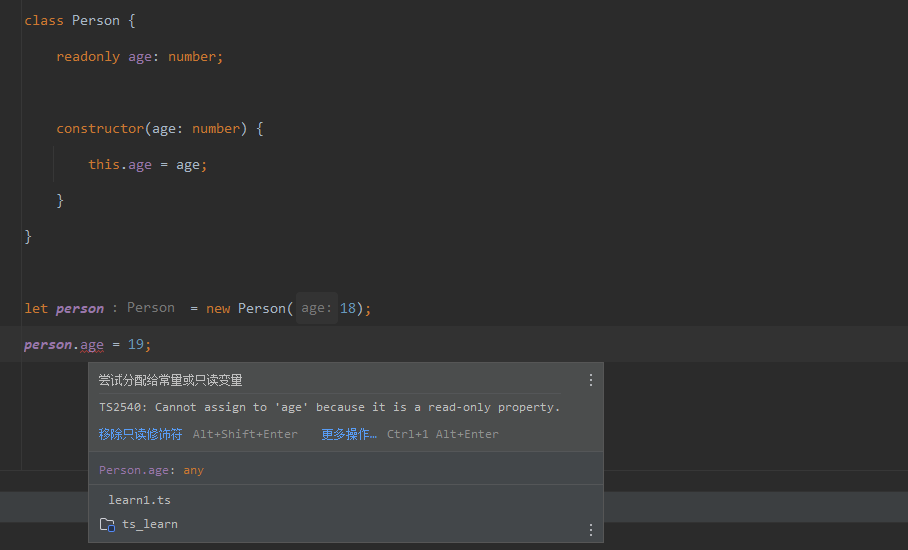

注意只读属性，如果有默认值，一定要指定明确的类型，否则会变成字面量类型

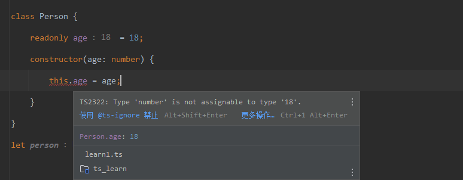

### 1.2类型兼容性

#### class兼容

如果两个类型的属性内容一样，那么他们的类型就可以进行兼容

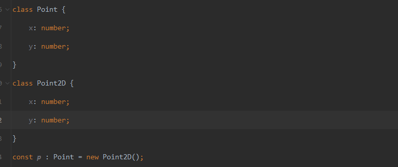

成员多的也可以兼容成员少的

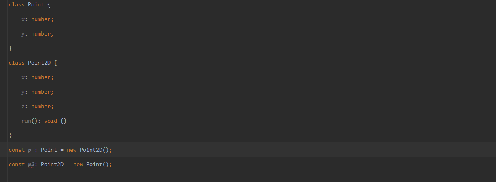

#### 接口兼容

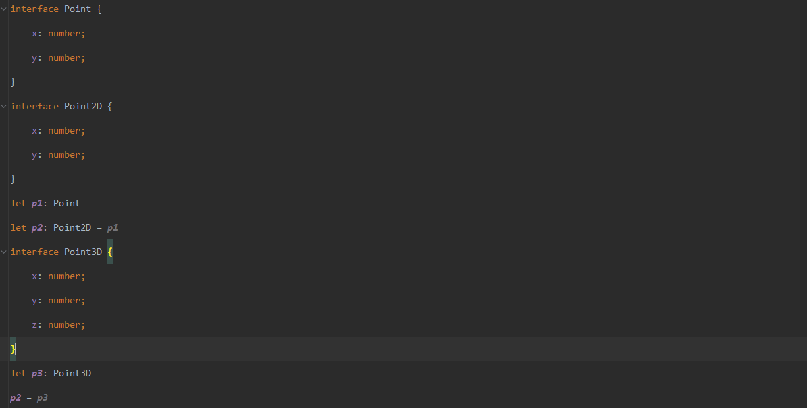

#### class与接口兼容

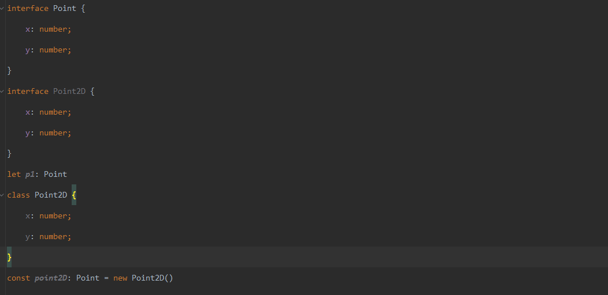

#### 函数兼容性

- 参数个数：参数少的可以兼容参数多的，跟类是相反的


- 参数类型：相同位置的参数类型要相同（原始类型）或者兼容（对象类型）Point2D和Point就是类之间的兼容性

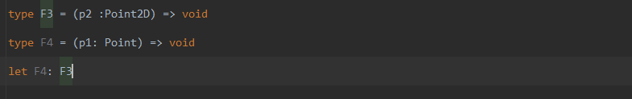

- 返回值类型：如果返回值是原始类型相同，只需要关注返回值本身即可

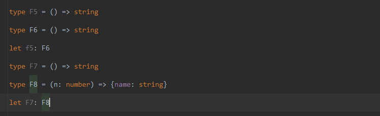

### 1.3 交叉类型

交叉类型跟继承很像，直接使用 **&** 即可，然后使用一个类型别名赋值给一个新的类型

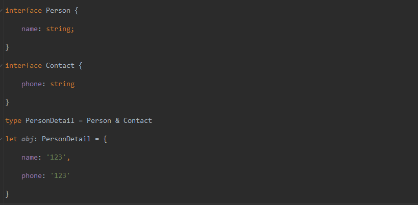

#### 交叉类型和extends区别

- 相同点：都可以实现对象类型的组合

- 不同点：对于同名属性之间，处理类型冲突的方式不同

  - 继承的方式，如果出现同名属性，类型不同就会报错，类型不兼容

  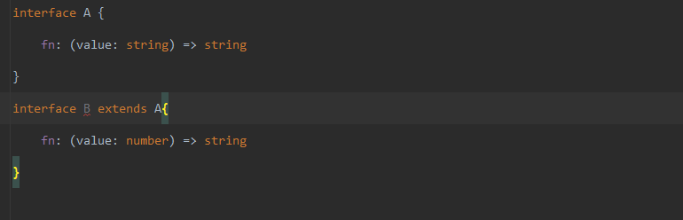

  - 交叉类型，如果出现相同的类型，这是就可以理解为联合类型

  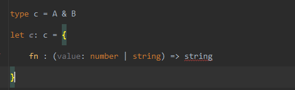

### 1.4 泛型

泛型是可以包装类型安全的前提下，让函数等与多种类型一起工作，从而实现复用

#### 1.4.1 函数泛型

>function id\<Type\>(value: Type): Type { return value}

语法：在函数名称的后面添加 \<\>(尖括号)，类型变量是一种特殊类型的变量，可以是任意的

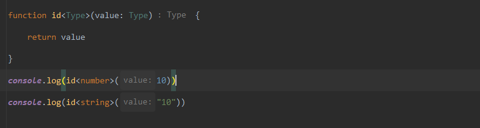

也可以进行简化不需要知道泛型的类型，通过类型推断的机制，如果不指定类型的话就会变成字面量的类型

```typescript
console.log(id("10"))

let i: string = '10'
console.log(id(i))
```

#### 1.4.2 泛型约束

可以给泛型添加 **extends** 关键字来进行类型约束，以下的例子就是，传递进行的参数必须要继承至 **Point** 接口，否则就会报错，只要传入的类型符合 **Point** 接口的类型就可以了

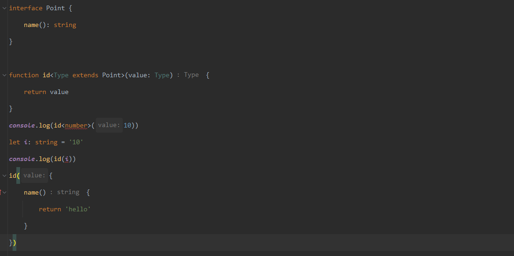

泛型之间也可以进行约束，例如：t1需要传入一个泛型，key需要的类型是KEY，而KEY通过 **keyof TYPE** 获取到了 TYPE类型中的所有属性名称的联合类型；如果传递的是 **string** 类型，后面可以传递 **string** 中所具有的方法

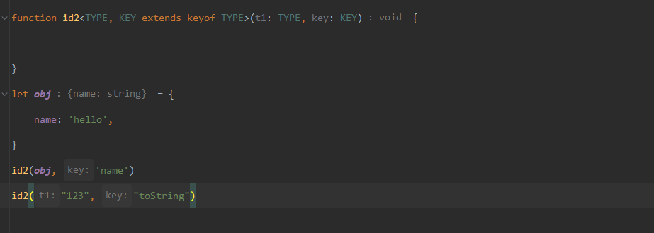

#### 1.4.3 泛型接口

直接在接口上定义泛型的类型

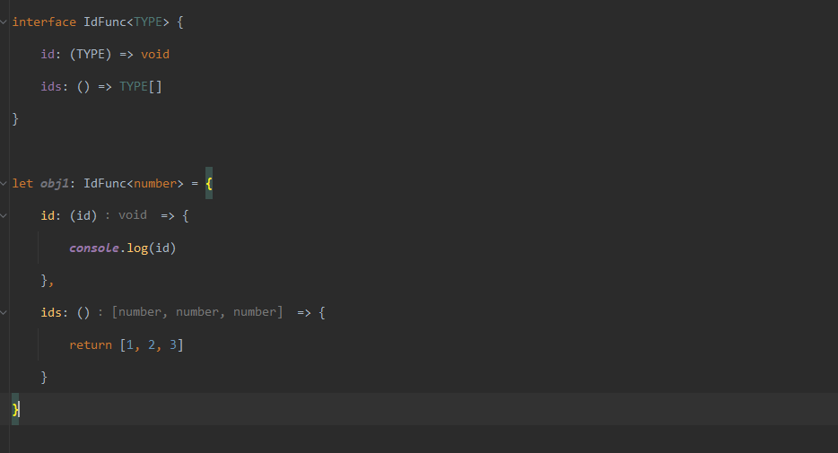

#### 1.4.4 泛型类

泛型类跟泛型接口是一样的定义方式，在使用时最好明确的指示泛型的类型


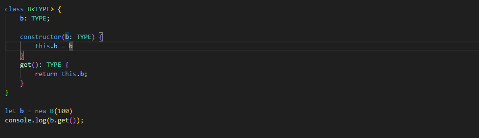

### 1.5 泛型工具类

#### 1.5.1 Partial<Type\>

用来创建一个类型，将 **Type** 中的所有属性设置为可选（产生一个新的类型，结构不会变），下面的例子：通过 **Partial** 工具类，就可以将所有的属性设置为可选

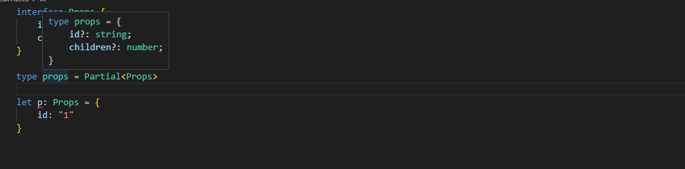

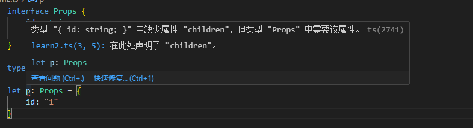

#### 1.5.2 Readonly<Type\>

将所有的属性变为只读的类型，结构不会变

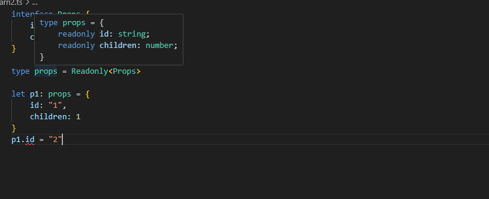

#### 1.5.3 Pick<Type, Keys>

从Type中选择一组属性来构造新类型

- Type：表示选择谁的类型
- Keys：表示选择哪几个属性（只能是第一个类型变量中存在的属性）

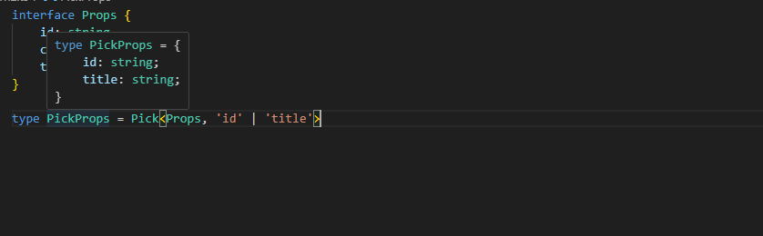

#### 1.5.4 Record<Keys,Type\>

构造一个对象类型，属性键为Keys，属性类型为Type，下面的例子：就新构建了类型 **RecordObj** 启动属性值就有 **Keys** 中指定的

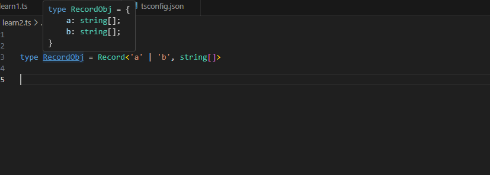

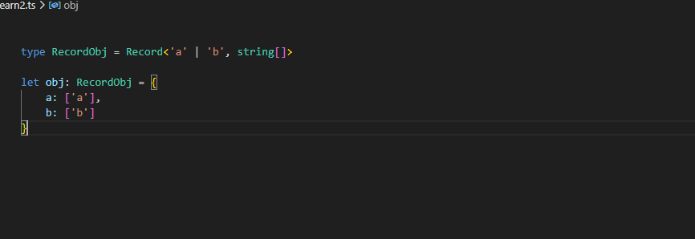

### 1.6 索引签名类型

无法确定对象中有哪些属性（或者说对象中可以出现任意多个属性），就可以使用索引签名类型

```typescript
interface AnyObj {
    [key: string]: number
}
```

- [key: string] 来约束接口中允许出现的属性名称。表示只要是string类型的属性名称，都可以出现在对象中
- key只是一个占位符，可以换成任意合法的变量名称（类型必须是string、number、symbol）等类型
- JS中对象的键都是string类型

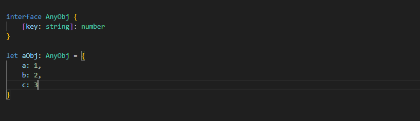

### 1.7 映射类型

基于旧类型创建一个新类型（对象类型）

- 映射类型是基于索引签名类型，语法类型，也使用了[]
- key in PropKeys 表示key可以是Propkeys联合类型终端任意一个
- 映射类型只能在类型别名中使用，不能在接口中使用

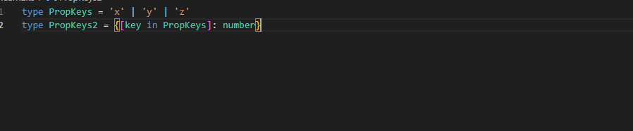

也可以根据一个类中的所有key来作为一个新的类型

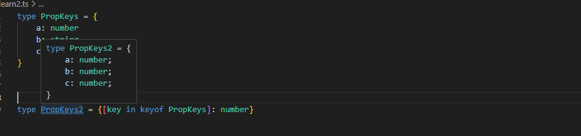

索引查询类型，通过 **P[Key]** 就可以获取到对应字段的类型

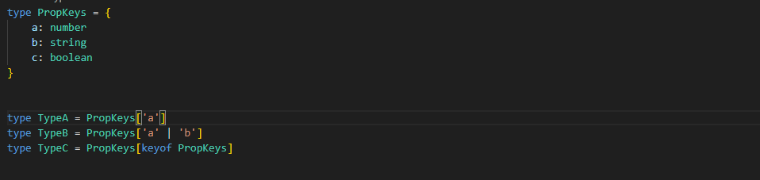

## 6. 类型声明文件

### 1.1 类型声明文件定义

类型声明文件：用来为已经存在的JS库提供类型信息（引入的三方库，实际都是js文件，但是真正使用的时候都有ts的类型检查，就是通过类型声明文件）

TS中有两种文件类型：

- .ts文件
  - 既可以包含类型信息又可以包含执行代码
  - 可以编译为.js文件
- .d.ts文件
  - 只能包含类型的定义，不能包含可执行代码
  - 不会生成.js文件，仅用于提供类型信息

目前类型声明文件的加载方式有两种

- 库自带类型声明文件：这种方式一般在packge.json 里面的 **typeings** 来指定需要加载的ts文件
- 由DefinitelyTyped提供：是一个github仓库，提供高质量的ts类型声明文件，包的格式为 **@types/***，可以通过 **npm i -D @types/*** 的方式进行类型的加载

### 1.2 自定义类型声明文件

自定义在什么场景下需要自己定义：

- 项目内共享类型
- 为已有JS文件提供类型声明

创建步骤：

- 创建类型声明文件
- 创建需要共享的类型，并且使用 export导出（ts中也可以使用import/export实现模块化功能）
- 在需要使用共享类型的.ts文件中，通过import导入即可（.d.ts后缀导入时，直接省略）