# LightRoom入门

## 1. 色彩原理

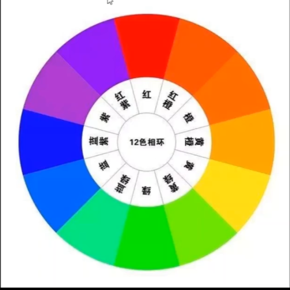

### 1.1 色相、饱和度、明度

- 色相：颜色的相貌，颜色的名字
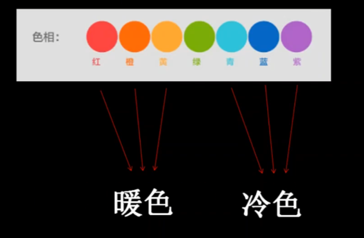

- 饱和度：颜色的鲜艳程度
- 明度：颜色的明暗

如何分析一张照片的主题风格
日系风格：
- 色相：青、绿、蓝、白、灰
- 饱和度：低饱和度
- 明度：高

### 1.2 色温和色调
色温是由蓝色和黄色进行控制，色调是由绿色和洋红进行控制。需要通过互补色进行配合使用

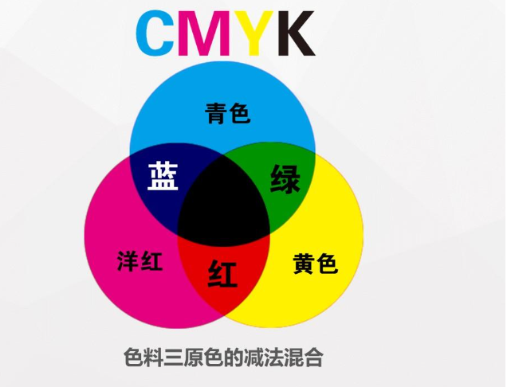

| 名称（CMY色料三原色） |    组成色     |
| :----------: | :--------: |
|      红色      |   洋红 + 黄   |
|      绿色      |   黄 + 青    |
|      蓝色      |   青 + 洋红   |
|      黑色      | 青 + 洋红 + 黄 |

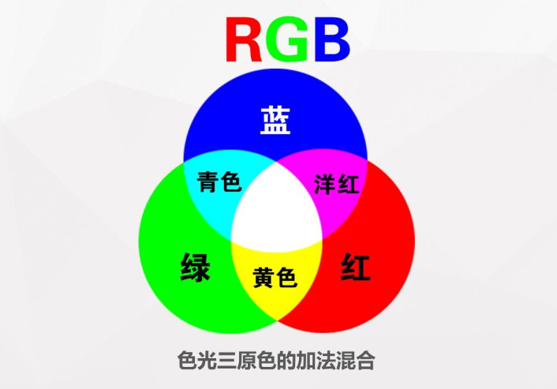

| 名称（RGB色光三原色） |    组成色    |
| :----------: | :-------: |
|      洋红      |   红 + 蓝   |
|      青色      |   绿 + 蓝   |
|      黄色      |   红 + 绿   |
|      白色      | 红 + 绿 + 蓝 |

### 1.3 互补色
两种颜色在色环上180°相对，类似两个极端，为补色相互调和会使色彩纯度降低，变成灰色

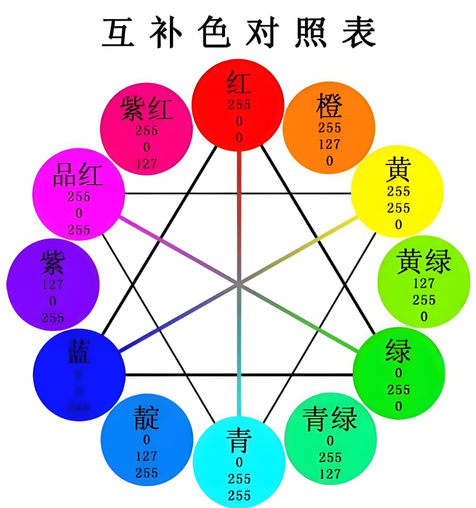

#### RGB颜色转换

###### 1. 青转绿
- 组合：蓝 + 绿
- 转换公式：主要目的是减蓝色，那么可以加互补色黄色

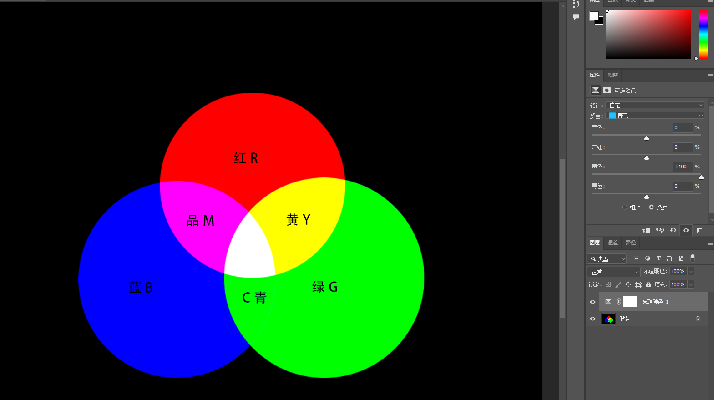

###### 2. 青转蓝
- 组合：蓝 + 绿
- 转换公式：主要目的是减去绿，那么增加绿色互补色洋红

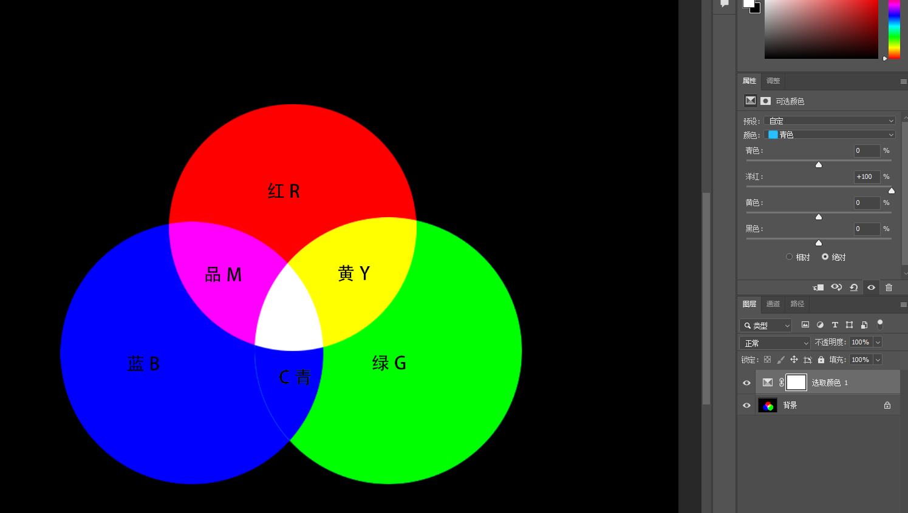
###### 3. 黄转绿
- 组合：红 + 绿
- 转换公式：减去红色，增加互补色青色

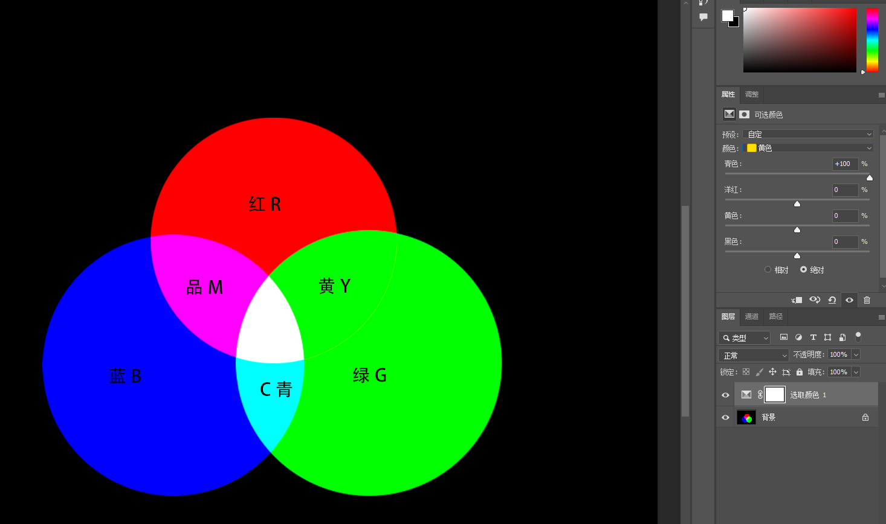

###### 4. 黄转红
- 组合：红 + 绿
- 转换公式：减去绿色，增加互补色品红

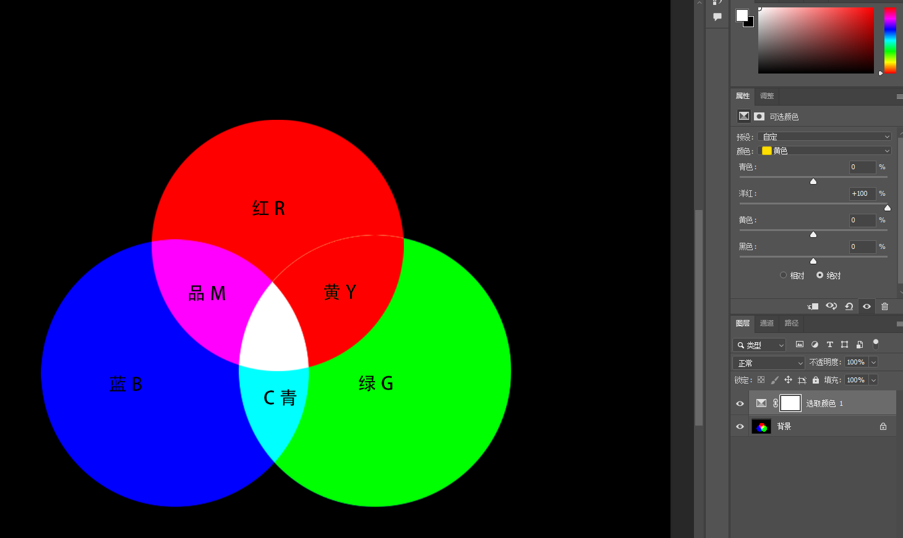

##### 5. 品红转蓝
- 组合：红 + 蓝
- 转换公式：减去红色，增加红色互补色青色

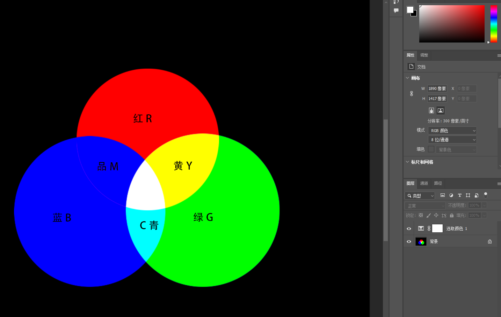

##### 6. 青转黄
- 转换公式：先将青色转换为绿色（减去蓝色，增加蓝色互补色黄色），在将绿色转换为黄色（加上红色，减去红色的互补色青色）

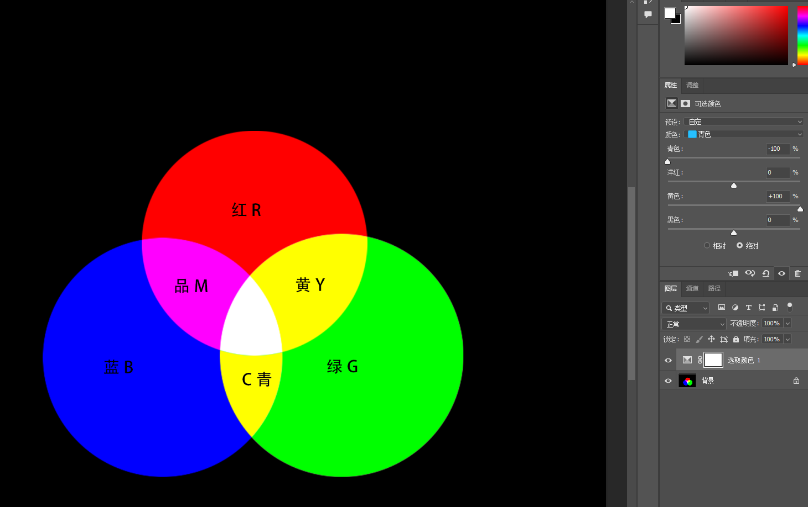

##### 7. 黄转青
- 转换公式：将黄色转化为绿色（减去红色，增加红色互补色青色），在将绿色转换为黄色（加上蓝色，减去蓝色的互补色黄色）

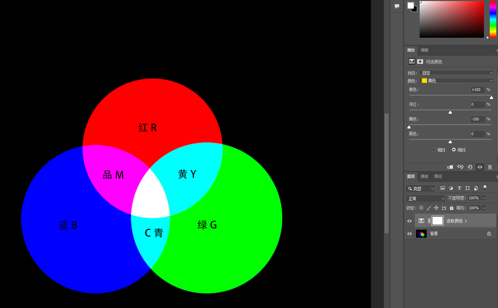

##### 8. 品红转黄
- 转换公式：将品红转换红色（减去蓝色，增加蓝色互补色黄色），将红色转换为黄色（增加绿色，减去绿色互补色品红）

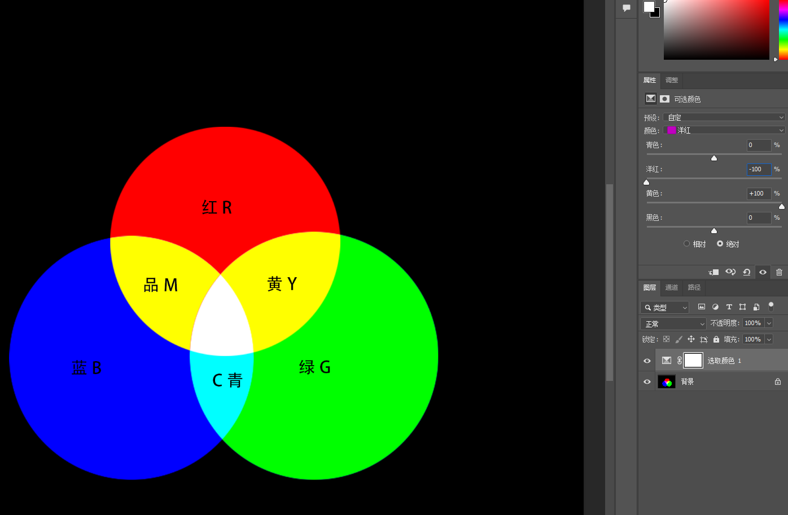

#### CMYK颜色转换

PS中使用正片叠底

##### 1. 绿转黄
- 组合：青 + 黄
- 转换公式：减去青色

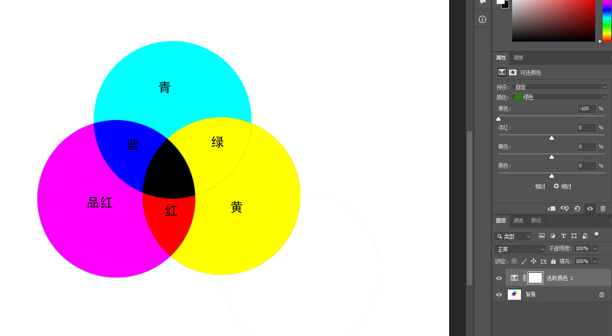

##### 2. 黄转蓝
- 组合：蓝 = 品红 + 青
- 转换公式：减去黄色，加上品红和青色

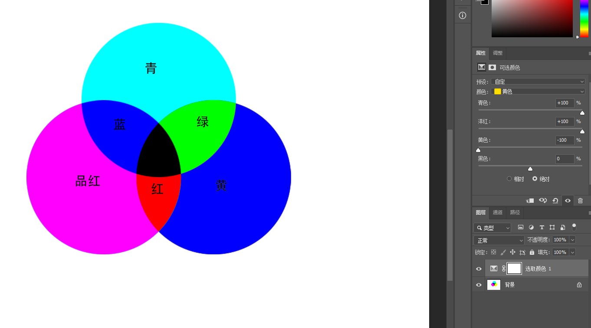
##### 3. 青转红
- 转换公式：先减去青色，在加上品红和黄色

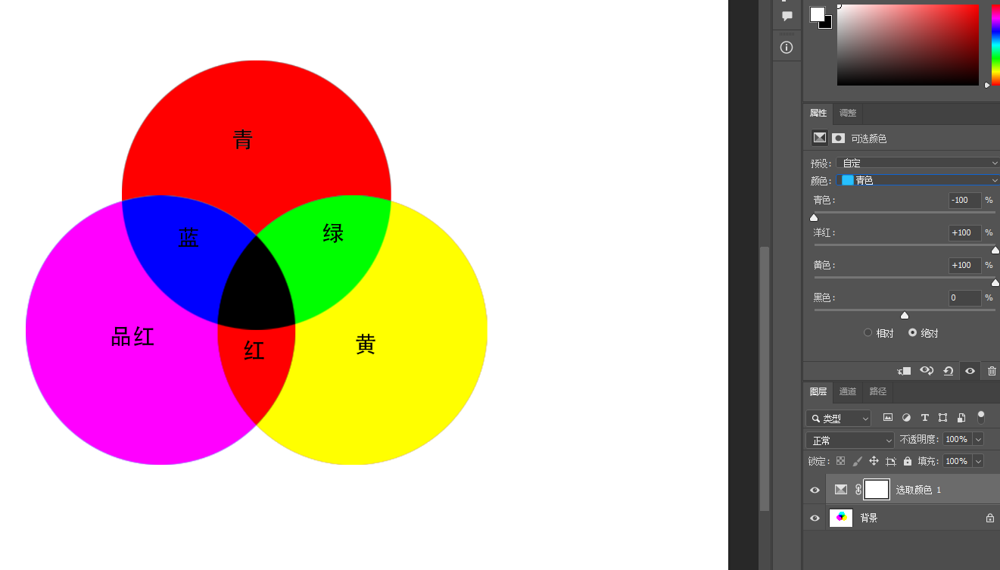

##### 4. 品红转绿
- 转换公式：先减去品红，在加上青色和黄色

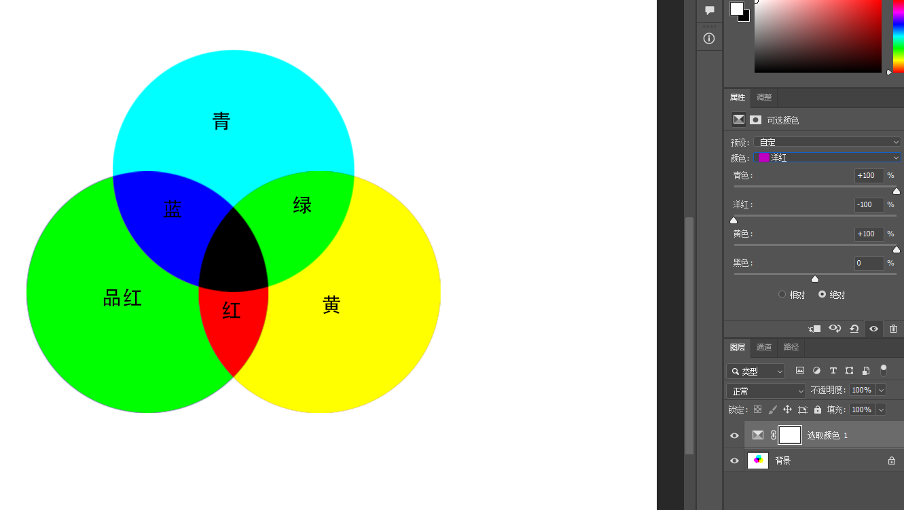
## 2. LightRoom

### 2.1 基础面板

#### 2.1.1 色彩调整区域

白平衡：用好就需要利用互补色的关系

- 色温：蓝色和黄色控制
- 色调：绿色和品红控制

#### 2.1.2 明暗调整区域

- 曝光：与白平衡相似，整体控制照片，提高照片的亮度。注意：对整体照片产生变化
- 对比度：主要是控制明暗的对比反差，色彩的饱和度

|  设置   |             影响             |          什么时候调整           |
| :---: | :------------------------: | :-----------------------: |
| 拉低对比度 | 照片亮的地方变暗了，暗的地方变亮了、色彩的饱和度变低 | 画面中的明暗对比度太高了、颜色之间的饱和度也太高了 |
| 提高对比度 | 照片亮的地方更亮了，暗的地方更暗了、色彩的饱和度变高 |     画面明暗对比度太低、颜色饱和度不够     |
- 高光、白色色阶：如果要通过降低高光保留细节的时候，高光比白色影响的范围更大（高光对整体提亮最好）；白色提亮画面中的亮部时影响的更大（白色是将照片中亮的部分变亮）
- 阴影、黑色色阶：如果想要压暗一张照片暗部的时候，黑色比阴影控制的范围更大；如果想要提亮暗部，阴影比黑色控制的范围更大（使用时先提升阴影在降低黑色可以让照片不发灰）
#### 2.2.3 纹理质感调整区域

- 纹理：将像素格的线条加强，如果提高的话照片整体会变的粗糙许多
- 清晰度：与纹理原理差不多，给照片的像素格添加明暗反差使其拥有质感。但是清晰度的控制范围更大
- 去朦胧：去灰，降低去朦胧会使亮部加强，如果提高去朦胧会使暗部加强

#### 2.2.4 色彩饱和区域

- 鲜艳度：优先将饱和度低的地方开始增加
- 饱和度：所有的范围都增加

使用方式：增加鲜艳度，降低饱和度，让饱和度不均匀的情况变的均匀一点
#### 2.2.5 直方图

显示一张图的色彩分布情况

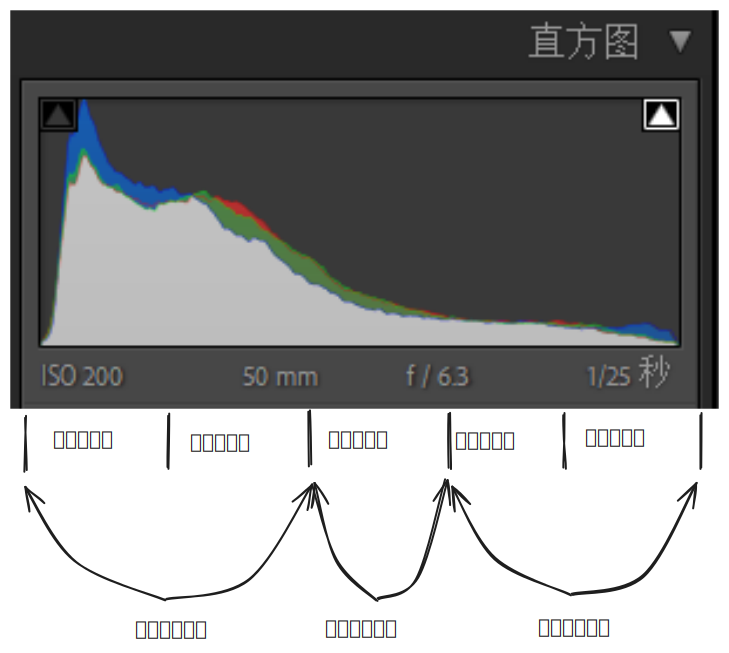

### 2.2 曲线

分为x与y轴，从左到右分别为最暗到最亮，曲线跟直方图的范围差不多分为5个部分，最暗 -> 偏暗 -> 偏灰 -> 偏亮 -> 最亮

**注意：所有的色彩都是基于光影之上，需要观察照片中的明暗关系**

#### 2.2.1 红通道

往上是增加红色，往下是增加青色

#### 2.2.2 绿通道

网上是增加绿色，往下是增加洋红

#### 2.2.3 蓝通道

往上是增加蓝色，往下是增加黄色

#### 2.2.4 点曲线

控制照片的明暗度，往上是增加白色，往下是增加黑色

### 2.3 HSL（混色器）

色相、饱和度、明度的简称。HSL调色是调整图片当中本身就有的色彩，如果图片中没有这个色彩那么调整就不会有任何效果，而且调整中一定要考虑颜色的组成。
例如：调整绿色时，绿 = 黄 + 青，往左就是黄绿色，往右就是青绿色

#### 2.4 颜色分级

颜色分级是分离色调的升级版。将照片中的高光、阴影、中间调进行分层调整，可以针对某一个具体的颜色进行上色。如果当色彩过于融合就可以使用颜色分级来进行调整

- 高光
	- 

### 2.5 细节

##### 2.5.1 锐化（磨皮）

增加锐化，图片的像素格就越明显，图片的细节就越丰富，可以通过图片对比就能发现

#### 2.5.2 减少杂色

例如晚上拍摄时感光过高了图片噪点很多，可以通过减色杂色

### 2.6 镜头矫正

- 删除色差
- 启用配置文件矫正：可以矫正广角镜头导致的镜头畸变

### 2.7 变形

对图片进行垂直水平、旋转等操作