# 寄存器

## 1. 特点

一个典型的CPU是由运算器、控制器、寄存器（CPU工作原理）等器件构成，器件内部靠总线想连。前面说的相当于外部总线。CPU的不同，寄存器的个数、结构也是不同的

- 运算器进行信息处理
- 寄存器进行信息存储：CPU中最主要的器件，程序员可以通过改变各种寄存器中的内容来实现对CPU的控制
- 控制器控制各种器件进行工作
- 内部总线连接各种器件，在它们之间进行数据传送

### 1.1 通用寄存器

在8086CPU中，所有寄存器都是16位，可以存放2个Byte。AX、BX、CX、DX这四个寄存器通常用来存放一般性的数据。可以称为通用寄存器。

AX寄存器16位的逻辑结构图：


- AX可分为AH和AL
- BX可分为BH和BL
- CX可分为CH和CL
- DX可分为DH和DL

例子：数据 18，二进制表示 10010，在AX中存储：


例子：数据20，二进制 100111000100000


AX中，8080CPU的16位寄存器又分为两个8位寄存器，分别为高位和低位

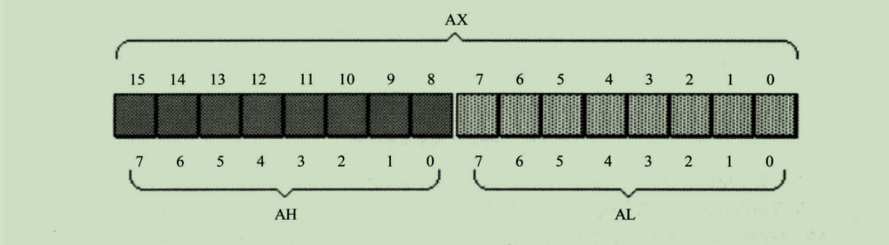

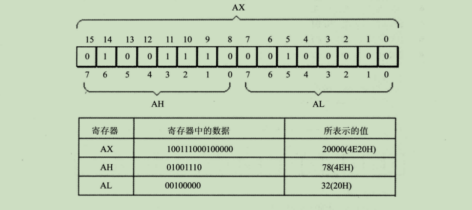

### 1.2 字在存储器中的存储

- 字节：一个字节由8个big组成，可以存在8位寄存器中
- 字：word，一个字由两个字节组成，这两个字节分别称为这个字节的高位字节和低位字节


在高位和低位所存储的数据可以分别作为两个独立的字节型数据。cpu中的寄存器可以存放N个 8位的数据，也就是说计算机中的数据大多数是由 1~N 个8位数据构成。

### 1.3 汇编指令

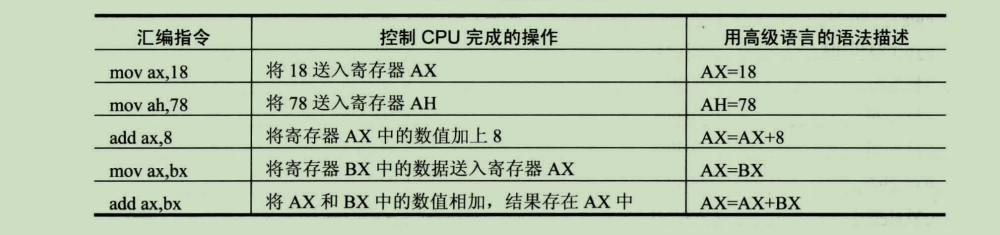

例子：

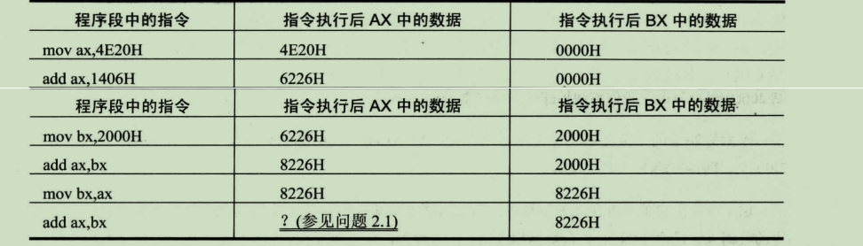

分析：

最后一条指令 add ax,bx ，将bx寄存器中的数据跟 ax中的数据进行相加，ax寄存器中的数据为 8226H，bx中的数据也为8226H，得出的结果为1044CH，因为ax为16位寄存器，所以最高位的1 就不能存在ax中，所以ax的数据为044CH。

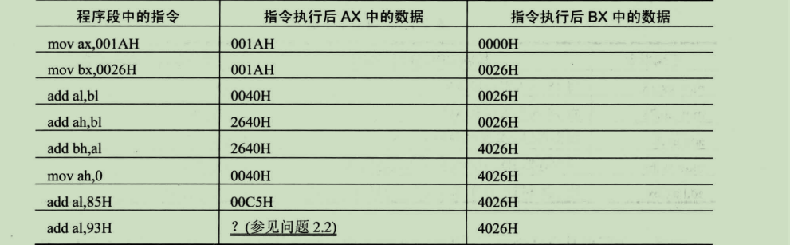

分析：

程序段中的最后一条指令为 add al,93H，在执行前，al中的数据为C5H，相加后为：158H，但al为8位寄存器，只能存放两位16进制数据，所以最高位1丢失（丢失，指的是进位制不能在8位寄存器中保存，但是CPU不会真的丢弃这个进位制）

注意点：

此时al是作为单独的8位寄存器来使用的，和ah没有关系，CPU执行时跟ah是没有任何关系的。执行运算操作时，两个操作的对象时，位数必须是一致的。**而8位寄存器，最高也只能存放255的数据**

### 1.4 检测点

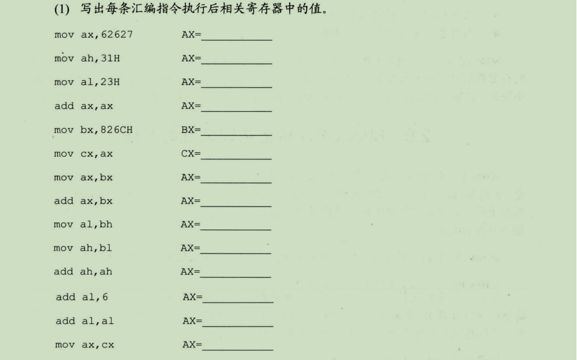

```
mov ax,62627  # 62627为十进制，转换 16进制为F4A3   ah:F4 al:A3  AX=F4A3H
mov ah,31H    #  					                        AX=31A3H
mov al,23H    #                                             AX=3123H
add ax,ax     # 3123+3123                                   AX=6246H
mov bx,826CH  #                                             BX=826CH
mov cx,ax     #                                             CX=6246H
mov ax,bx     # ax = bx                                     AX=826CH
add ax,bx     # ax = ax + bx = 104D8                        AX=04D8H
mov al,bh     # al = bh = 82                                AX=0482H
mov ah,bl     # ah = bl = 6C                                AX=6C8CH
add ah,ah     # ah = ah + ah                                AX=D88CH
add al,6      # al = al + 6                                 AX=D806H
add al,al     # al = al + al                                AX=D80CH
mov ax,cx     # ax = cx = 6246H                             AX = 6246H
```


```
mov ax,0000H   # 赋值初始值
add al,10H     # ax的低位为加上 10H，ax=0010H
```

## 2. 物理地址

cpu在访问内存单元时，需要给出内存地址，而内存单元的存储空间是一个一维的线性空间，每一个内存单元在这个空间都是唯一的地址，我们称这个地址为物理地址

### 2.1 16位结构的CPU

- 运算器一次最多可以处理16位的数据
- 寄存器的最大宽度为16位
- 寄存器和运算器之间的通路为16位

8086是16位结构的CPU，在8086内部能够一次性处理、传输、暂时存储的信息的最大长度为16位。内存单元的地址在送上地址总线之前，必须在CPU中处理、传输、暂时存放

### 2.2 8086CPU给出物理地址的方法

8086地址总线有20根，而CPU又只能处理16位，如果从CPU内部简单地发出，那么只能送出16位的地址，表现力只有64KB。

8086在内部采用一种用两个16位地址合成的方式来形成一个20位物理地址。

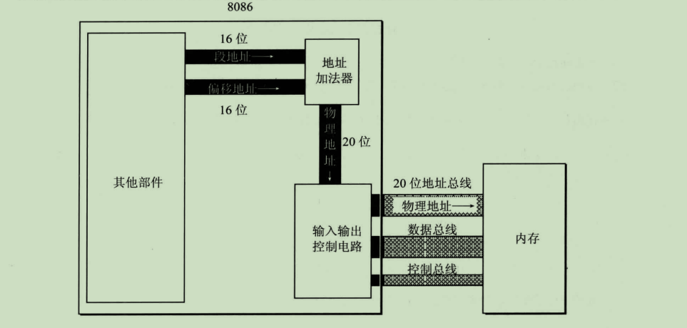

CPU的寻址功能是：基础地址（段地址 x 16）+偏移地址 = 物理地址

### 2.3 “段”的概念

并不是内存被划分成了一个一个的段。而是被CPU划分成的逻辑段，便于CPU就行管理。以后在编程时可以使用 **段地址x16（十进制数据）** 定位段的起始地址。一个段的起始地址必然是 16的倍数，偏移地址也为16位，16位的寻址能力为64KB，所以一个段的长度最大为64KB

如果给定一个段地址，仅通过变化偏移地址来进行寻址，最多可以定位多少个内存单元？

结论：偏移地址16位，变化的范围0 ~ FFFFFH（2^16 - 1 存储单元），用偏移地址来进行寻址最多寻找 64KB。如：给定段位地址 1000H，用偏移地址进行寻址：10000H ~ 1FFFFH

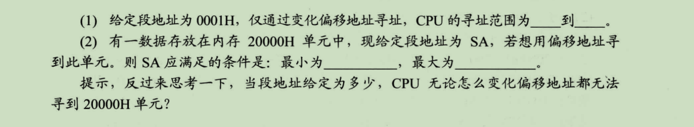

```
1. 0001H x 10 (16的十六进制) = 0010H 获得起始地址，偏移地址最大为64KB 
00010H 到 1000FH
2. 最小为 0，最大为 1000H。
取0时：0000H * 10H = 00000H ~ FFFFH。取不到 20000H
取1000H时：1000H * 10H = 10000H ~ 基本地址+偏移地址（1FFFFH）取不到20000H
```

## 3. 段寄存器

8086CPU在访问内存时需要由相关部件提供内存单元的段地址和偏移地址，送入地址加法合成物理地址。8086CPU共有4个段寄存器：CS、DS、SS、ES。CPU在访问内存单元时就由这四个寄存器提供段地址

### 3.1 CS和IP

CS和IP是8086CPU中两个最关键的寄存器，他们指示了CPU当前要读取指令的地址，CS为代码段寄存器，IP为指令指针寄存器。

例如：设CS中的内容为M，IP中的内容为N，8086CPU内存就会从 M*16 + N单元开始，读取一条指令并执行。相当于，8086会去获取到CS:IP指向的内容当作指令执行

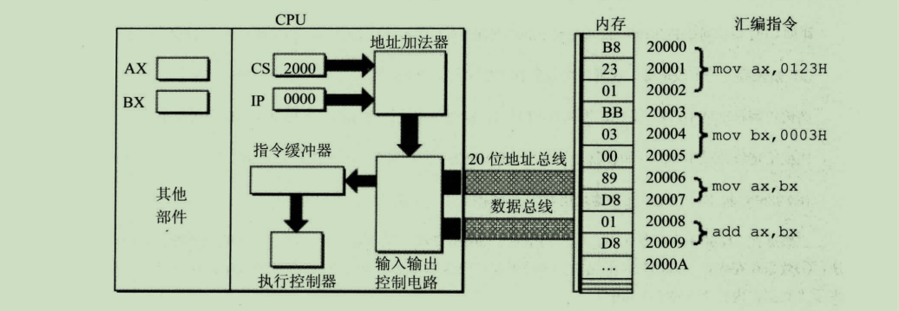

- CPU先将CS:IP 送入地址加法器确认需要读取的内存单元 （物理地址 = 段地址 * 16 + 偏移地址）
- 地址加法器将数据送入 输入输出控制电路，然后读取 物理地址 20000H 存放的数据 ：B8 23 01通过数据总线送入 输入输出控制电路中
- CS:IP 这时读取的指令长度为 3 byte，就会自增存放下一条指令的地址，然后继续读取剩下的指令

**在内存中，指令和数据是没有任何区别的，都是二进制数据，CPU在工作时会将CS:IP 指向的内存地址看作是指令并且执行**

### 3.2 修改CS和IP的方法

在8086CPU中大部分寄存器的值，都可以使用mov进行修改，mov指令被称为传送指令。但是在8086中mov不能设置CS:IP的值，因为不支持。所以改为了 jmp 命令来进行修改。

jmp 2AE3:3  执行前：CS = 2AE3H, IP=00003H

jmp 3:0B16 执行后：CS=0003H, IP=0B16H

jmp ax  执行前：ax=1000H， cs=2000H，ip=0003H。执行后：ax=1000H，cs=1000H

jmp命令相当于 mov IP,ax 指令

### 3.3 代码段

在编程时，可以根据需要，将一组内存单元定义为一个 “**段**”。只需要将cs:ip的地址改为当前代码段的起始地址即可执行

## 4. 实验

查看CPU和内存，用机器指令和汇编指令编程

Debug是提供给查询CPU各种寄存器中内容、内存的情况以及机器码级跟踪程序的运行

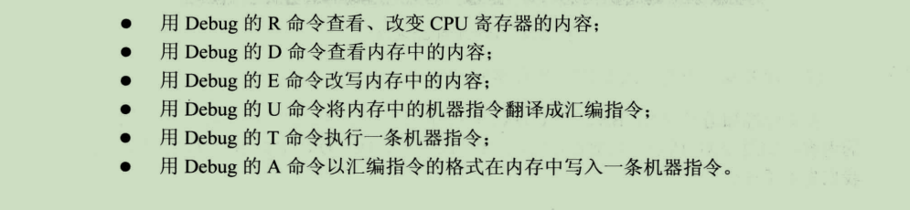

### 4.1 win10环境安装Debug指令

- 安装 DOSBox：*https://www.dosbox.com/*

- 找到DOSBox安装路径，双击打开其中 DOSBox 0.74 Options.bax
- 添加 DEBUG.exe 的文件路径
- 直接打开DOSBox.exe

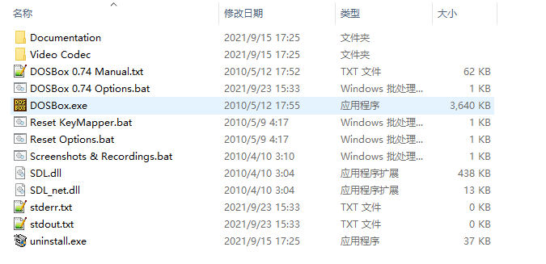

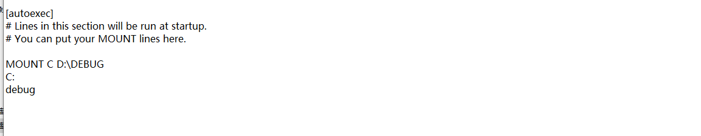

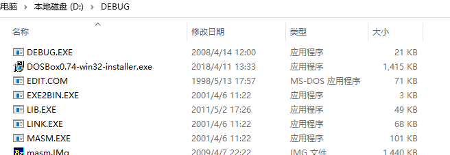

输入 r 查看寄存器中的内容

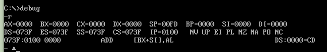

CS:IP 此时指向的地址是 073F:0100 , 而对应的汇编指令是  ADD [BX+SI],AL

### 4.2 修改寄存器中值

输入 “ r ax  ” 出现 " : "作为提示，在后面输入想要写入的数据

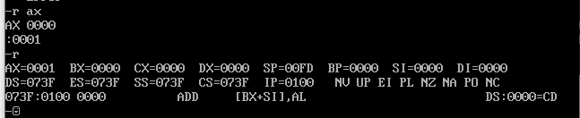

### 4.3 查看内存中的值

使用 -d 内存地址：偏移地址   可以展示内存中指定内存中 128个内存单元的数据

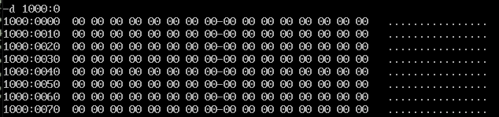

而其中 “ - ”只要是用来进行分割范围  比如   " - " 之前的范围 1000:10 ~ 1000:17  而后面则是 17 ~ 1000:1F的范围

最左边存放的是起始地址，最右边则存放的是内存中数据对应的 ASCLL码

不同的操作系统所展示出的数据不一样 直接使用  -d 可以展示出系统预设的地址

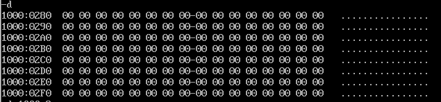

-d 1000:0 9 也可以查询范围的地址

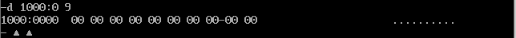

### 4.4 改写内存中的数据

可以使用 -e 1000:0  数据...数据  从输入的地址开始修改后面的数据 

输入 -e 1000:0 f  逗号后面输入需要改变的数据，如果空格就不修改，会自动跳到下一个内存单元。都修改完成了就使用回车


### 4.5 查看内存中机器码所对应的指令

-u  段地址:偏移量地址

就可以展示出对应内存地址中的汇编指令

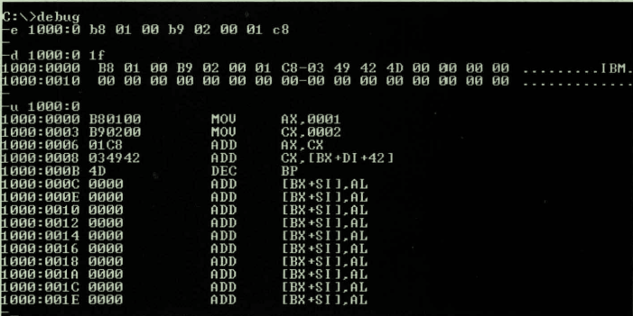

### 4.6 执行内存中的命令

使用 -t 命令可以执行CS:IP所指向内存的指令，但是在执行之前需要将CS:IP所指向的地址改为需要执行指令的地址

### 4.7 写入汇编指令

使用 -a 段地址:偏移量地址  就可以写入汇编代码

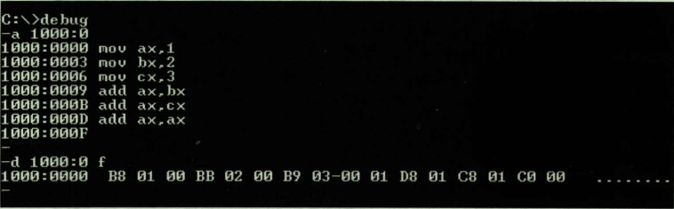

## 5. 操作显卡地址

所有的物理设备都会被映射到某一串地址当中，对内存地址中的数据进行操作，实际就是对显卡进行操作

### 5.1 实例

```text
-e B810:0000 01 01 02 02 03 03 04 04  #向内存地址中写入当前数据
```


```text
e B810:0000 48 07 65 07 6c 07 6c 07 6f 07 20 07 57 07 6f 07 72 07 6c 07 64 07 #48对应ascall码中字符，07代码颜色为白色
```


