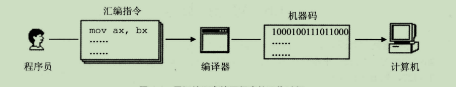
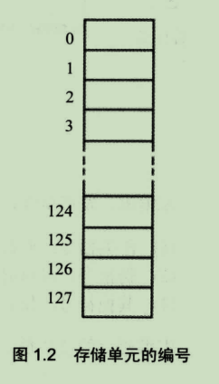
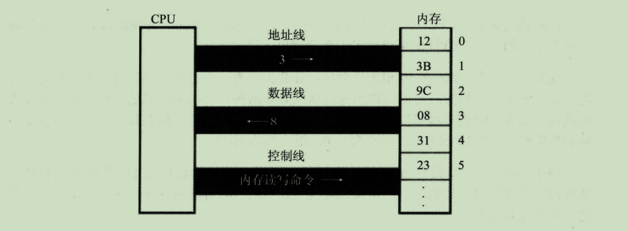
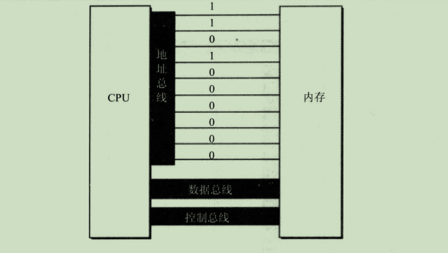
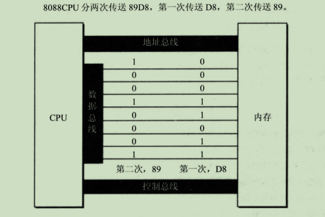
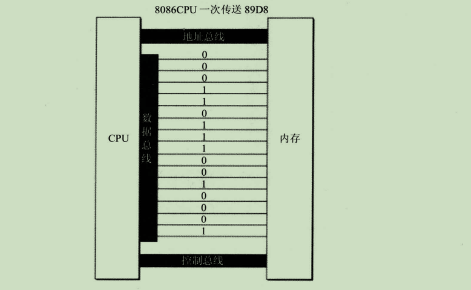
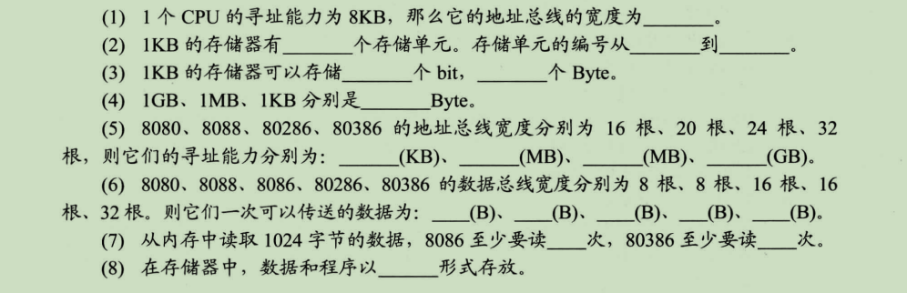
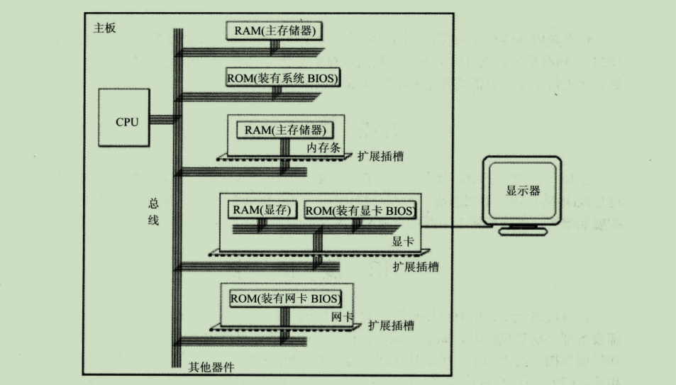
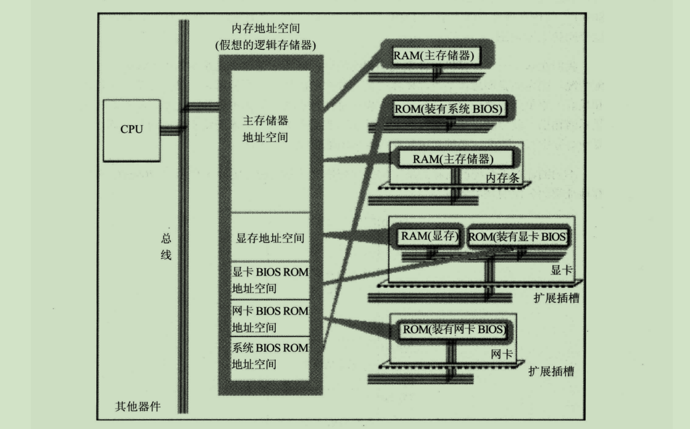
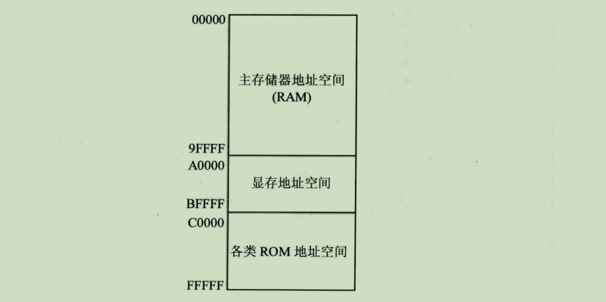

# 一、机器语言

机器语言是机器指令的集合，机器指令就是一台机器可以正确执行的命令。电子计算机的机器指令就是一列二进制数据，计算机将其转换为一列高低电平，使计算机的电子器件受到驱动，进行运算。

# 二、汇编语言

## 1. 特点

汇编语言的主体使汇编指令，汇编指令和机器指令的差别在于表示的方法上，汇编指令是便于记忆的书写格式

例如：

机器指令：1000100111011000 表示把BX寄存器的内容发送到 AX寄存器中

汇编指令：mov ax,bx

## 2. 汇编语言的组成

- 汇编指令：机器码的助记符，有对应的机器码
- 伪指令：没有对应的机器码，由编译器执行
- 其他符号：如 +、-、*、/ 等

## 3. 存储器

cpu是计算机的核心部件，控制整个计算机的运作并进行运算，想要cpu工作就必须提供指令和数据，指令和数据就存放再存储器中。

## 4. 指令和数据

指令和数据只是应用上的概念，在内存或磁盘上，指令和数据没有任何区别，都是二进制信息，CPU工作时把有的信息看作指令，有的信息看作数据，为同样的信息赋予了不同的意义。只有在使用时，才会有意义

## 5. 存储单元

特点：存储器被划分成若干个存储单元，每个存储单元从 0 开始编号。每个存储器可以存储 **128个Byte**，而一个存储单元可以存储1个Byte

## 6. CPU对存储器的读写

CPU要从内存中读取数据时需要与外部器件（芯片）进行下面3类的信息交互

- 存储单元的地址（地址信息）
- 器件的选择，读或者写（控制信息）
- 读或写的数据（数据信息）

电子计算器能处理，传输的信息都是电信号，电信号需要使用导线进行传送，而计算机中有专门连接CPU和其他芯片的导线，通常称为 **总线**

- CPU通过地址线发送出存储单元3信息
- CPU通过控制线发出内存读的命令，选中存储器芯片，并且通知它，将要从中读取数据（或者写命令）
- 存储器将3号单元的数据通过数据线送入CPU（或者将数据送入存储单元3中）

如何操作CPU进行数据的读取？

机器码：101000010000001100000000

含义：从3号存储单元读取数据送入寄存器AX

汇编指令：MOV AX,[3]

## 7. 总线

### 7.1 地址总线

CPU是通过地址总线来指定存储单元的，也就是说地址总线上能传送多少个不同的信息，CPU就可以对多少个存储单元进行寻址。

例如：一个CPU有10根地址总线，而一根导线可以传送的稳定的状态为**高电平**和**低电平**两种状态，也就是1和0，而10位二进制数据可以传送2的10次方，最小数为0，最大数为1023。一个CPU有N根地址线，则可以说这个CPU最多可以寻找2的N次方个内存单元

### 7.2 数据总线

CPU与内存或其他器件之间的数据传输是通过数据总线来进行传输的，数据总线的宽度决定了CPU和外界的数据传输速度。8根数据总线一次可以传送一个8位二进制数据（一个字节），16根数据总线一次可以传输2个字节。

8088CPU数据总线的宽度为8位，8086CPU的数据总线宽度位16位。所以8088传输一个 89D8 数据到内存中，需要分成两次传输

### 7.3 控制总线

CPU对外部器件的控制是通过**控制总线**进行的。控制总线是一些不同控制线的集合，有多少根控制总线，就意味着CPU提供了对外部器件的多少种控制。控制总线的宽度决定了CPU对外部器件的控制能力

前面说到的内存读或写命令，是由几根控制线综合发出的，其中有一根称为“读信号输出”，还有一根称为“写信号输出”的控制线

### 检测点

1. 16根总线
2. 1024个存储单元，编号 0-1023
3. 8192bit，1024Byte
4. 1073741824, 1048576, 1024
5. 64，1，16，4  （一个存储单元可以存8位1字节）
6. 1，1，2，2，4
7. 512，256
8. 数据

## 8. 内存地址空间

例如：一个CPU的地址总线的宽度为10，那么就是1024个存储单元，而这1024个可寻的存储单元就构成了内存地址空间。而我们所用的 64位CPU，理论上来说寻址能力可以达到 200多wTB

## 9. 主板和接口卡

主板：每一台PC机都有主板，主板上有核心器件和主要器件，这些器件通过总线相连。例如：CPU、存储器、外围芯片组、扩展插槽。扩展插槽一般有RAM内存条和各类接口卡

接口卡：所有程序控制其工作的设备，必须受到CPU的控制。如显示器、音响这类设备都是通过扩展插槽上面的接口卡与CPU想连，而接口卡又是通过总线同CPU想连。CPU可以直接通过控制这些接口卡，实现对外设的简介控制

## 10. 各类存储芯片

从独写属性上看分为两类：随机存储器（RAM）、只读存储器（ROM）

RAM：可读可写，必须带电存储，关机后存储内容丢失

ROM：只能读取不能写入，关机后内容不丢失

- 随机存储器：存放供CPU使用的绝大部分程序和数据
- 装有BIOS的ROM：BIOS是由主板和各类接口卡厂商提供的软件系统，可以通过它利用该硬件设备进行最基础的输入输出
- 接口卡上的RAM：某些接口卡需要对大批量输入、输出数据进行暂时存储，在其上装有RAM。最典型的就是显卡的显存

## 11. 内存地址空间

CPU在控制上诉器件的时候，**都把它们当作内存来对待，把它们总的看作一个由若干个存储单元组成的逻辑存储器**，这个逻辑存储器就是我们所说的内存地址。

假设上图中的内存地址空间的地址段分配如下：

- 0 - 7FFFH 的 32KB 空间为主RAM的地址空间
- 8000H - 9FFFH 的 8KB空间为显存地址空间
- A000H - FFFFH的24KB空间为各个ROM的地址空间

cpu向地址为1000H的内存单元中写入数据，这个数据就会被写入主随机存储器中；

cpu向地址为8000H的内存单元中写入数据，这个数据就被写入显卡中，然后会被显卡输出到显示器上；

内存地址空间的大小受CPU地址总线宽度的限制，总线宽度为20，那么可以传送 2^20 个不同的地址信息，就是1MB；同理总线宽度为32，内存地址空间的最大为 4GB。所以当我们想在某类存储器中读写数据时，必须要知道第一个单元的地址和最后一个单元的地址；比如我们要将数据显示在屏幕上，就必须要知道显存的内存地址空间是多少。

不同的计算器内存地址的分配是不同的，下面是8086CPU的内存地址划分

00000 - 9FFFF 相当于在独写 主存储器中的数据；A0000 - BFFFF 相当于在操作显存中的数据；C0000 - FFFFF 操作是无效的，因为ROM是只读存储器

*最终运行程序的是CPU，我们用汇编语言的时候，必须要从CPU的角度考虑问题，系统中所有的存储器的存储单元都处于一个统一的逻辑存储器中，它的容量受CPU的寻址能力的限制*

