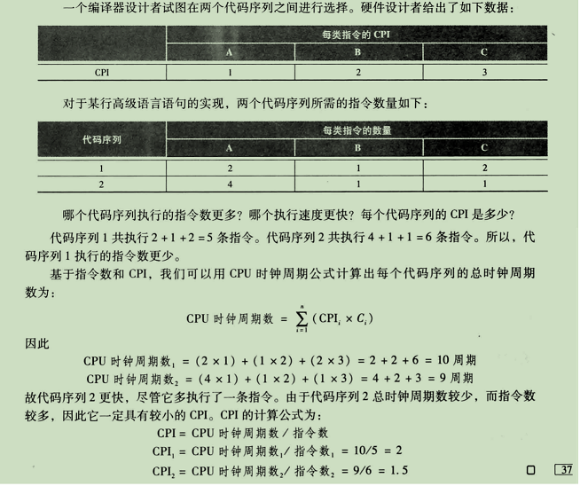
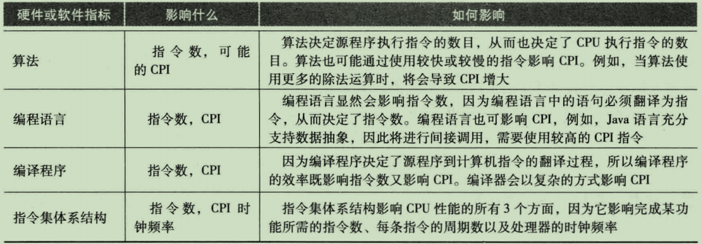

# 计算机组成与设计

## 1. 性能

- 响应时间：也叫执行时间
- 吞吐率：也叫带宽（bandwidth），性能的另一种度量参数，表示单位时间内完成的任务数量

### 1.1 计算机性能比较

性能X / 性能Y = n

例如：A计算机运行程序需要10秒、B运行程序需要15秒，A比计算机B快多少？

15/10 = 1.5

因此，计算机A比B快1.5倍

### 1.2 性能的度量

程序的执行时间一般以秒为单位。然而，时间可以根据我们的计量方法选用不同的表示方法。对时间最直接的定义是墙上时钟时间（wall clock time），也叫响应时间（response time），消逝时间（elapsed time）；这些术语表示需要完成任务的总时间，包括了硬盘访问、内存访问、I/O操作和操作系统的开销等一切时间

### 1.3 时钟周期

为计算机的一个时钟周期的时间，通常是处理器的时钟；也可用它的倒数来描述，称为 **时钟频率**； 例如：时钟周期为250ps（皮秒：1s = 10^12 ps），时钟频率就为4GHZ；几乎所有计算机都用时钟来驱动硬件中发生的各种事件，**用于度量硬件执行完基本功能的速度，时钟间隔的时间称为时钟周期**;；

转换公式

```text
s:秒，ns:纳秒（10^9s），ps:皮秒(10^12s)
4GHZ = 4 x 10 ^ 9 = 0.25纳秒 （互为倒数 1/4 因为纳秒为10^9秒，所以抵消，就剩下 1/4 = 0.25）
时钟周期 = 1 / 4 x 10^9 = 0.25 x 10 ^ -9 s = 0.25ns = 250ps

例如：时间周期为180ps，时钟频率是多少？
180ps = 0.18ns = 0.18 x 10^-9s = 1 / 5.5 x 10^9 ≈ 5.5GHZ
```


### 1.4 时钟频率

时钟频率由过去的MHZ发展到了当前的GHZ ：**1GHZ = 10^3MHz = 10^6KHz = 10^9Hz**

### 1.5 CPU性能及其因素

- 一个程序的CPU执行时间 = 一个程序的CPU时钟周期数 x 时钟周期时间
- 一个程序的CPU执行时间 = 一个程序的CPU时钟周期数 / 时钟周期频率

例如：某程序在一台时钟频率为2GHz的计算机A上面运行需要10秒。现在将设计一台计算机B，希望将运行时间缩短为6秒。计算机的设计采用提高时钟频率，但这会影响CPU其余的设计，使计算机B运行该程序时相当于计算机A的1.2倍的时钟周期数。那么计算机设计者应该将时钟频率提高到多少？

```text
// 先计算A计算机的CPU时钟周期数
10 = CPU周期数 / 2 x 10^9  （2x10^9 是需要将GHz转换为Hz）
CPU周期数 = 10 x 2 x 10^9 = 20 x 10^9

//计算机B
6 = 1.2 x （A的时钟周期数）/ 时钟频率
时钟频率 = 1.2 x 20 x 10^9 / 6 = 0.2 x 20 x 10^9 = 4 x 10 ^ 9 = 4GHz
```

### 1.6 指令性能

上面的计算并没有考虑程序所需的指令数。然而计算机都是通过执行指令来运行程序的；所以一个程序需要的时钟周期数可写为：

**CPU时钟周期数 = 程序指令数 x 指令的平均执行时钟周期数(CPI)**

> CPI：一个程序运行时所有指令所用时钟周期的平均值




**注：对指令集减少指令数目的改进可能降低时钟周期时间或提高CPI，CPI与执行的指令类型相关，执行指令最少的代码其执行速度未必是最快的**



### 1.7 Amdahl定律

**改进后的执行时间 = 受改进影响的执行时间 / 改进量 + 不受影响的执行时间**

例如：假设一个程序在一台计算机上运行需要100秒，其中80秒的时间用于乘法操作。如果要把该程序的运行速度提高到5倍，乘法的操作的速度应该改进多少？

```text
改进后的时间 = 80 / n + (100 - 80)
要求快至5倍，新的执行时间应该是20：
20 = 80 / n + 20
0 = 80 / n
```

上诉计算如果乘法运算占总负债的80%，无论怎样改进乘法，也无法达到性能提高至5倍的结果。

### 1.8 MIPS（每秒百万条指令）

> MIPS = 指令数 / （执行时间 x 10^6）
>
> MIPS = 指令数 /（指令数 x CPI / 时钟频率 x 10^6）= 时钟频率 /（CPI x 10^6）

MIPS是指指令的执行速率，它规定了性能与执行时间成反比，越快的计算机具有越高的MIPS值

### 1.8 测定公式


## 2. 计算机语言

